# 货拉拉全链路监控体系的落地与实践

> 来源：未核验 · 类型：分享 · 状态：draft


> 分享嘉宾：曹伟 - 货拉拉技术中心核心基础设施部资深研发工程师  
> 职责：全链路监控体系建设，货拉拉全链路Trace服务、分布式定时调度服务负责人

## 一、分享嘉宾介绍

- **2016年**：毕业于上海大学，加入便利蜂钱包支付团队，负责分布式定时调度服务
- **2019年**：加入阿里本地生活，负责业务研发框架
- **2020年至今**：加入货拉拉，主要负责分布式全链路Trace服务及分布式定时调度服务

## 二、全链路监控发展历史

### 2.1 业界发展历程

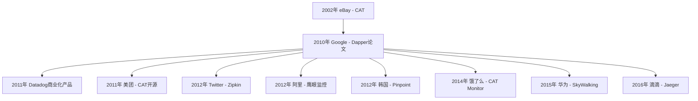

**关键产品特点：**

| 产品 | 特点 | 优势 | 劣势 |
|------|------|------|------|
| CAT | Java版本实现 | 开源后覆盖率高，优化迭代多 | - |
| Dapper | Google内部产品 | 奠定理论基础 | 未开源 |
| Pinpoint | 基于字节码增强 | 埋点非常细致 | 性能损耗大，数据膨胀 |
| CAT Monitor | 饿了么开源 | 用户体验最佳，所见即所得 | - |
| SkyWalking | 华为开源 | 适用微服务体系，中小型公司追捧 | - |

### 2.2 货拉拉监控演进史

货拉拉监控体系划分为三个阶段：

#### 监控1.0时代
- **特点**：各团队独立维护Prometheus监控体系
- **问题**：
  - 无全链路Trace监控
  - 无统一标准化
  - 无治理能力
  - 客服接到投诉后才知道问题，排查效率极低

#### 监控2.0时代
- **改进措施**：
  - 监控统一收拢和治理
  - 基础埋点全覆盖
  - 采用字节码增强技术，实现零代码侵入接入
  - 实现埋点弯道超车，快速达到90%覆盖率（目前已100%）
  - 自研基础监控页面，结合Grafana大盘
  - 搭建全链路Trace服务
  - 研发智能告警体系

#### 监控3.0时代
- **优化方向**：
  - 针对细微场景迭代打磨
  - 实现错、慢、核心链路的采样，降低存储成本
  - 打通Metric、Trace、Log闭环，提升排查流畅度
  - 基础监控和业务大盘自研升级
  - 深化告警预案和根因分析

## 三、货拉拉监控体系架构

### 3.1 整体架构图

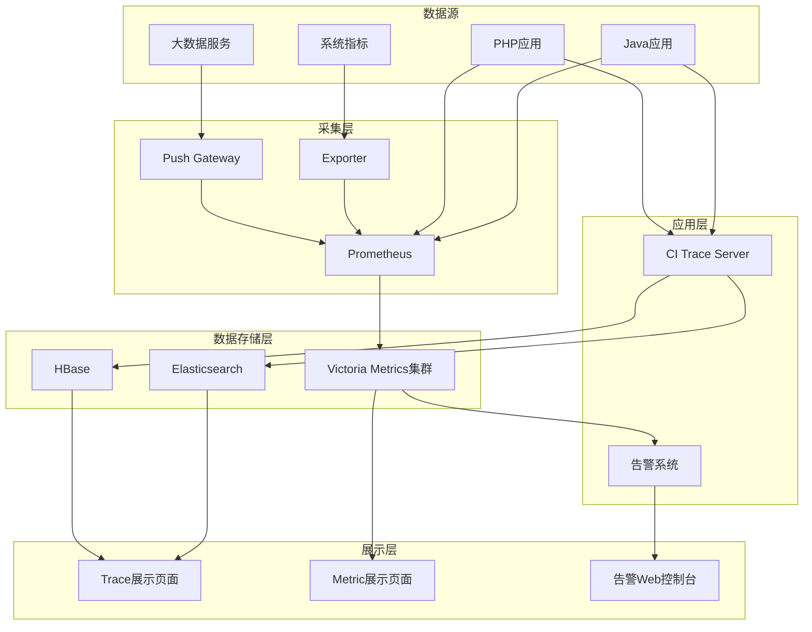

**架构说明：**

1. **采集层**：
   - Prometheus：采集应用层、系统层数据
   - Push Gateway：接收大数据等场景的推送数据
   - Exporter：暴露系统级别指标（CPU、网络等）

2. **存储层**：
   - Victoria Metrics：存储时序数据，承担部分告警计算
   - Elasticsearch：存储Trace基础数据，用于复杂查询
   - HBase：存储Trace详情数据（原始数据）

3. **应用层**：
   - CI Trace Server：基于SkyWalking深度定制
   - 告警系统：自研告警能力

### 3.2 Java SDK埋点图谱

货拉拉Java SDK实现了全面的组件覆盖：

**客户端支持：**
- SOA支持
- 主流gRPC Client（包括异步）

**服务端支持：**
- SOA SV
- Tomcat、Jetty等异步容器

**技术层支持：**
- 灰度
- Log

**数据库层支持：**
- 针对不同DB、不同组件、不同版本的主流客户端全覆盖
- MySQL、Redis、MongoDB等

**特点：**
- 100%覆盖率
- 完全基于字节码增强
- 业务零侵入、零代码改造
- 一键快速接入

## 四、字节码增强技术详解

### 4.1 什么是字节码增强

字节码增强技术可以在不修改源代码的情况下，动态修改类的字节码，实现功能增强。

**典型应用场景：Log4j2漏洞修复**

```java
// 原始代码
public void lookup(String key) {
    // 存在安全漏洞
}

// 通过字节码增强修复
public void lookup(String key) {
    return; // 直接返回，阻止漏洞利用
}
```

### 4.2 字节码增强核心技术

#### 两个关键点：
1. **谁来修改字节码**：字节码修改框架
2. **如何让修改生效**：Java Agent技术

#### Java Agent原理

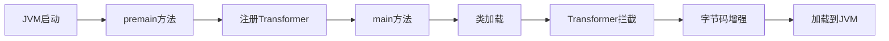

**工作流程：**

1. JVM启动时，在main方法之前先执行premain方法
2. premain方法中注册自定义Transformer
3. Transformer拦截类加载过程
4. 获取原始字节码数据
5. 通过字节码框架修改字节码
6. 返回修改后的字节码给JVM

**示例代码：**

```java
// Agent类
public class MyAgent {
    public static void premain(String args, Instrumentation inst) {
        // 注册Transformer
        inst.addTransformer(new MyTransformer());
    }
}

// Transformer类
public class MyTransformer implements ClassFileTransformer {
    public byte[] transform(ClassLoader loader, String className, 
                          byte[] classfileBuffer) {
        // 使用字节码框架修改classfileBuffer
        byte[] newBytes = enhance(classfileBuffer);
        return newBytes;
    }
}
```

### 4.3 字节码修改框架对比

| 框架 | 难度 | 特点 | 优缺点 |
|------|------|------|--------|
| ASM | 高 | 底层框架 | 需要了解JVM指令集和Class文件规范，不支持Debug |
| Javassist | 中 | 中间层框架 | 需要硬编码，不支持Debug |
| ByteBuddy | 低 | 高级框架 | 按照正常Java编码习惯，支持Debug，学习成本低 |

**ByteBuddy示例：**

```java
// 原始类
public class BaseService {
    public void process() {
        // 业务逻辑
    }
}

// 使用ByteBuddy增强
new ByteBuddy()
    .redefine(BaseService.class)
    .method(named("process"))
    .intercept(MethodDelegation.to(Interceptor.class))
    .make();

// 拦截器
public class Interceptor {
    @RuntimeType
    public static Object intercept(@SuperCall Callable<?> zuper) {
        System.out.println("start");
        Object result = zuper.call();
        System.out.println("end");
        return result;
    }
}
```

**货拉拉选择ByteBuddy的原因：**
- 编码效率最高
- 学习成本最低
- 支持Debug
- 最适合Java开发人员

### 4.4 字节码增强埋点的优势

**对比传统侵入式埋点：**

| 维度 | 传统埋点 | 字节码增强埋点 |
|------|----------|----------------|
| 代码侵入 | 需要修改业务代码 | 零侵入 |
| 依赖方式 | 依赖组件扩展点 | 可拦截任何方法 |
| 维护成本 | 需要二次封装甚至修改源码 | 只需维护大版本兼容 |
| 接入成本 | 高 | 一键接入 |
| 灵活性 | 受限于扩展点 | 可拦截源码任意方法 |

## 五、全链路Trace架构演进

### 5.1 Trace 1.0架构

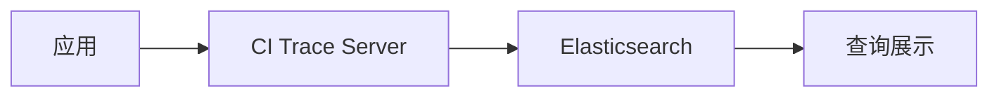

**问题：**
- ES不适合存储Trace数据
- Trace数据分为基础数据和详细数据
- 详细数据是基础数据的数十倍
- 大量原始数据占用ES内存，导致缓存命中率低
- 影响查询和写入效率

### 5.2 Trace 2.0架构

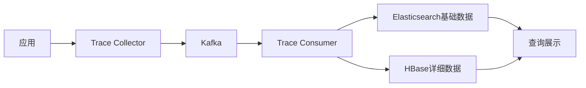

**改进：**
- 拆分Trace服务为Collector和Consumer
- Collector负责收集数据，投递到Kafka
- Consumer异步消费，分别存储到ES和HBase
- ES存储基础数据用于复杂查询
- HBase存储详细数据
- 支持水平扩容，支撑百万TPS，日均100TB数据

**问题：**
- 90%的数据是无意义的
- 业务只关心：错误请求、慢请求、核心服务请求

### 5.3 Trace 3.0架构（冷热分离）

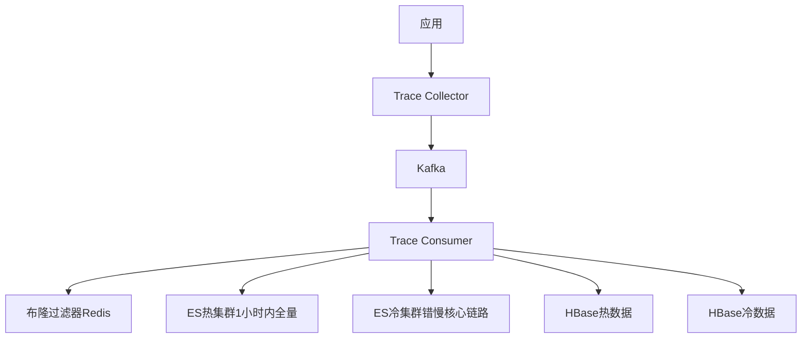

**核心改进：**

1. **差异化采样**：
   - 1小时内：全量数据（热数据）
   - 1小时外：只保留错、慢、核心链路（冷数据）
   - 降低存储成本60%

2. **冷热分离价值**：
   - 数据价值随时间递减
   - 线上异常通常在半小时内解决
   - 存储成本随时间递增
   - 差异化采样兼顾成本和价值

### 5.4 采样策略对比

#### 常规采样（无差别）

基于Trace ID结构采样：
```
Trace ID = [Process ID].[Thread ID].[Timestamp].[Sequence]
```

- 提取毫秒位（千位）
- 例如：毫秒位 < 100，采样率10%

**缺点**：无法识别Trace是否为错、慢、核心链路

#### 差异化采样（货拉拉方案）

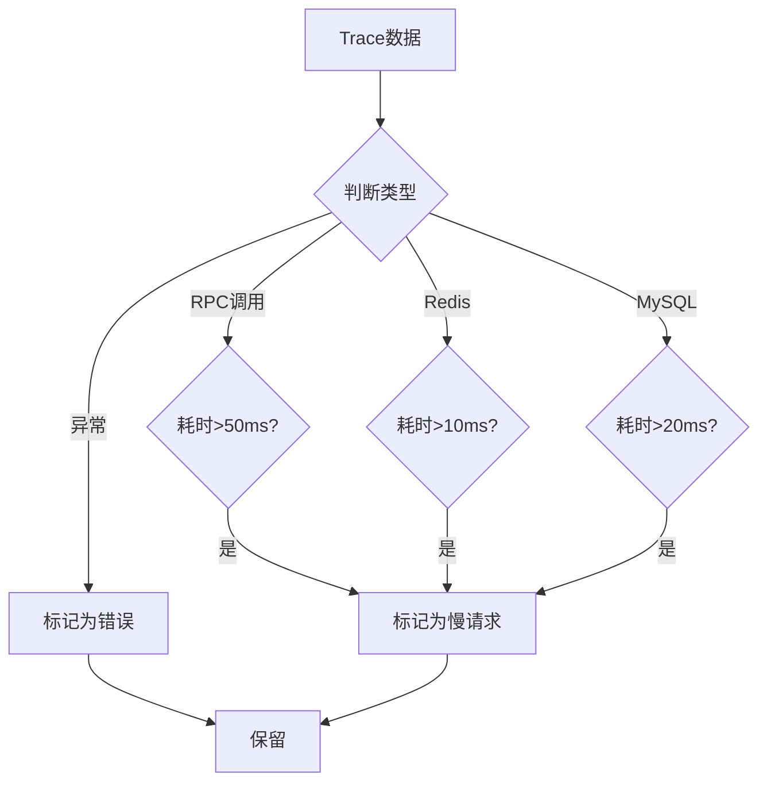

**优势**：
- 精细化识别业务关心的数据
- 不同组件不同阈值
- 完整保留有价值数据

### 5.5 链路完整性保障

#### 问题场景

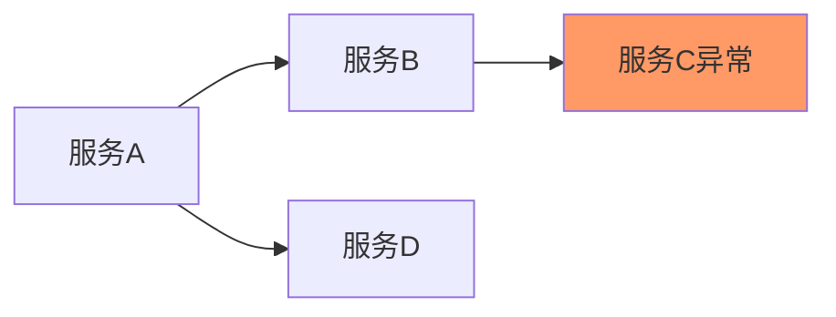

- A、B、C、D是不同服务，异步上报Trace
- B→C出现异常，B和C会被采样
- 但A和D可能不被采样（部分采样）
- 排查时需要完整链路（A、B、C、D）

#### 业界方案对比

**阿里方案（染色+内存查询）：**

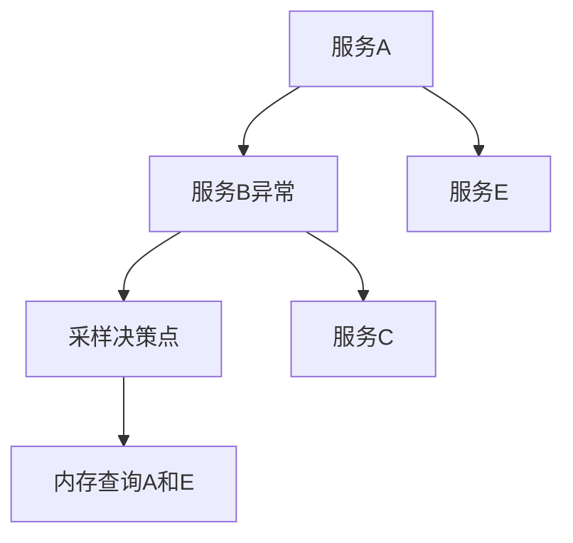

- 异常节点染色标记
- 采样决策点从内存逆向查找前置节点
- 需要大量内存存储1小时内数据（数百GB到TB级别）
- 成本高

**字节跳动方案（部分采样）：**
- 只保存异常节点及后续节点
- 无法保存前置节点
- 链路不完整

**货拉拉方案（Kafka延迟消费+布隆过滤器）：**

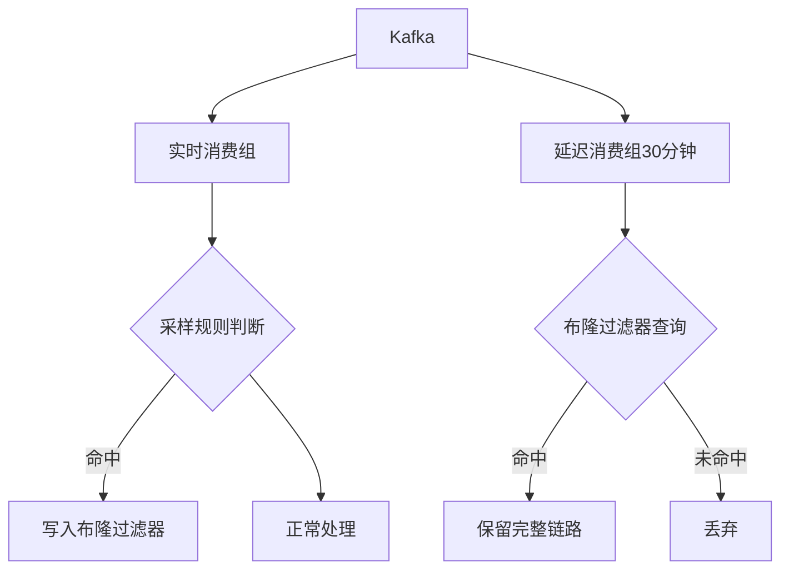

**实现细节：**

1. **实时消费**：
   - 判断是否为错、慢、核心链路
   - 如果是，将Trace ID写入布隆过滤器

2. **延迟消费**（30分钟后）：
   - 从Kafka头部开始消费
   - 查询布隆过滤器
   - 命中则保留该Trace ID的所有数据

3. **布隆过滤器优化**：
   - 使用Redis实现
   - 5个节点（2核4G）支撑百万QPS
   - 具体优化细节已申请专利

**优势**：
- 成本低（相比内存方案）
- 链路完整
- 支持高吞吐

## 六、可视化建设：所见即所得

### 6.1 核心理念

借鉴饿了么CAT Monitor的"所见即所得"思想：
- 所有曲线都可点击
- 点击后直接跳转到Trace详情
- 快速定位问题根因

### 6.2 功能展示

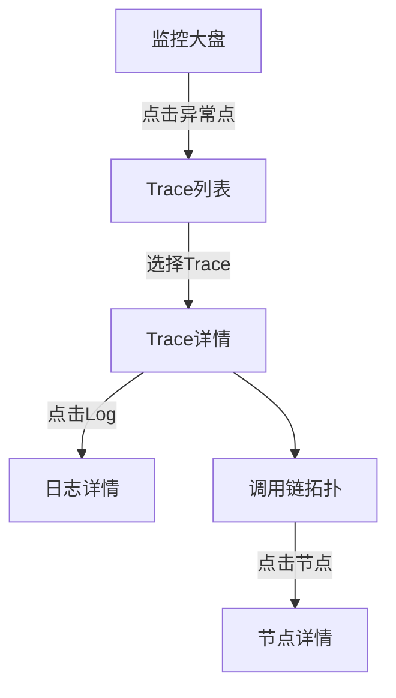

**监控大盘功能：**
- 展示QPS、RT、异常等指标曲线
- 点击曲线任意点，跳转到对应时间的Trace列表
- 快速查看RT飙高或异常时的具体请求

**Trace详情页：**
- 展示完整调用链
- 异常堆栈信息
- 点击可跳转到日志系统
- REST拓扑图展示

**价值：**
- 极大提升排查流畅度
- 从指标→Trace→日志形成闭环
- 重新定义业务排查思路

## 七、Metric、Trace、Log数据闭环

### 7.1 数据关联关系

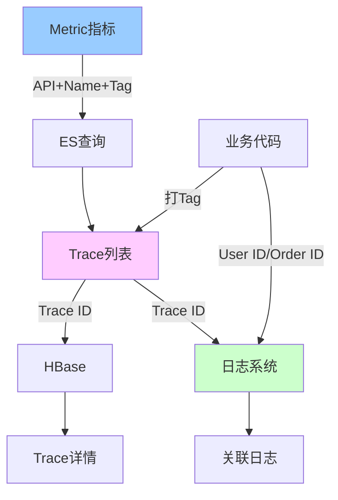

**数据映射关系：**

| 数据源 | 包含信息 | 关联方式 |
|--------|----------|----------|
| Metric | API、Name、Tag、时间戳 | 组合查询ES获取Trace列表 |
| Trace | Trace ID、Span信息、Tag | Trace ID查询HBase获取详情 |
| Log | Trace ID、业务日志 | Trace ID关联日志 |
| 业务 | User ID、Order ID等 | Tag方式注入Trace |

### 7.2 排查流程

**传统方式**：
- 日志中搜索关键字
- 效率极低

**新方式**：
1. 从Metric页面发现QPS或RT异常
2. 点击异常点查看Trace详情
3. 查看异常调用栈
4. 如需更多信息，点击跳转到日志系统
5. 通过Trace ID查看完整日志

**价值**：
- 规范化排查流程
- 提高排查效率
- 形成数据闭环

## 八、根因分析与智能告警

### 8.1 根因分析

根因分析本质：将排查思路沉淀为专家经验，让代码自动执行。

#### 指标下降场景分析流程

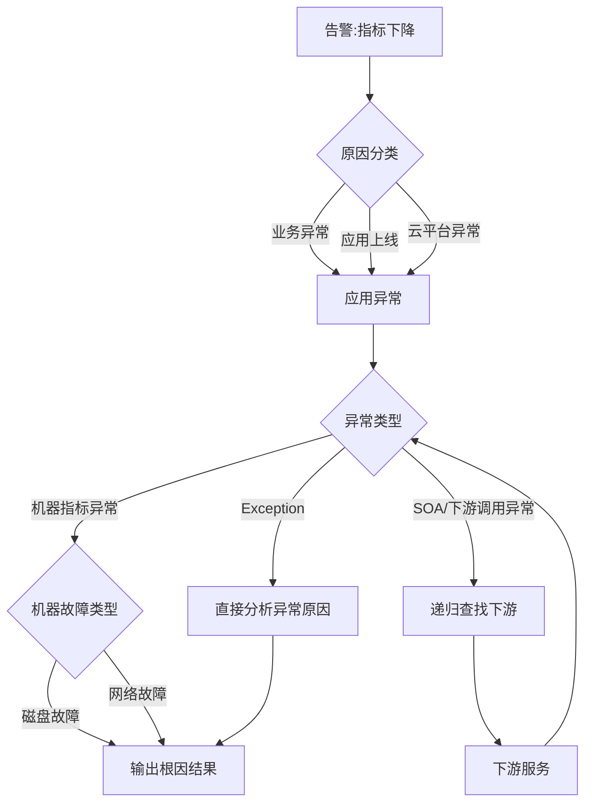

**前置条件：**
- 链路治理
- 应用标准化（SOA、RPC标准化）
- 监控完善（运维数据、业务数据、网络数据）

### 8.2 智能告警预案

将应对异常的处理手段沉淀为专家经验，形成规则引擎。

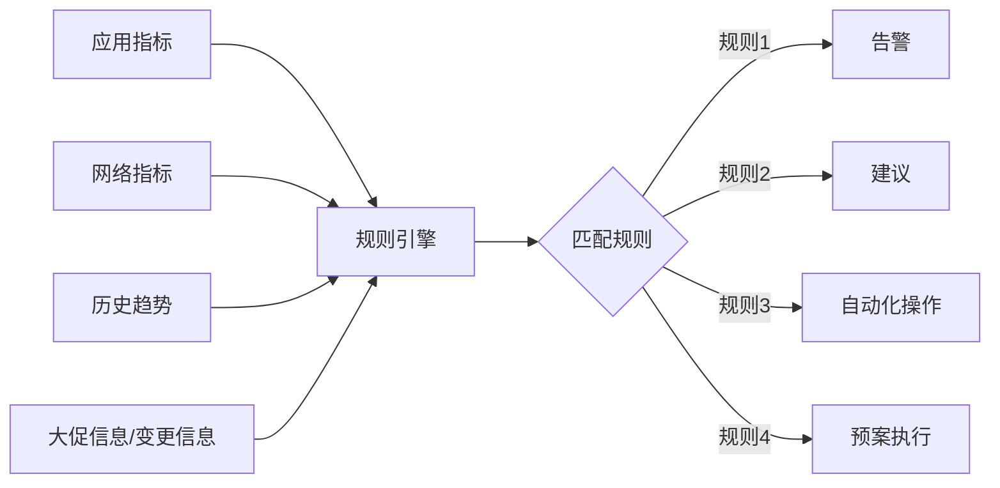

**示例规则：**
- **输入**：某接口QPS飙高 + CPU使用率高
- **输出**：
  - 告警通知
  - 建议扩容
  - （未来）自动扩容

**发展方向：**
- 不断覆盖更多输入场景
- 丰富规则引擎
- 增强自动化处理能力（扩缩容、预案执行）

## 九、技术指标总结

| 指标 | 数值 | 说明 |
|------|------|------|
| 覆盖率 | 100% | Java应用全覆盖 |
| 吞吐量 | 百万TPS | 支持百万级TPS |
| 数据量 | 日均100TB | 日均处理数据量 |
| 成本优化 | 降低60% | 通过冷热分离降低存储成本 |
| 接入方式 | 零代码侵入 | 基于字节码增强 |
| 延迟 | 低延迟 | 对业务影响极小 |

## 十、核心技术亮点

### 1. 字节码增强技术
- 选择ByteBuddy框架
- 实现零侵入埋点
- 支持Debug
- 快速实现弯道超车

### 2. 冷热分离方案
- 基于Kafka延迟消费
- 布隆过滤器优化
- 链路完整性保障
- 成本降低60%

### 3. 所见即所得
- 借鉴饿了么CAT Monitor
- 所有曲线可点击
- 快速定位问题
- 提升排查效率

### 4. 数据闭环
- Metric、Trace、Log打通
- 统一Trace ID
- 规范排查流程
- 提高排查效率

### 5. 智能化
- 根因分析
- 智能告警
- 预案执行
- 自动化处理

## 十一、Q&A精选

### Q1: 全链路监控在混合云环境下如何实现？
**A**: 货拉拉监控体系基于开源构建，不依赖特定云厂商：
- 基础架构：Prometheus + Victoria Metrics + SkyWalking
- 自研部分：字节码增强SDK、冷热分离、数据闭环
- 可跨云部署，统一管理

### Q2: 字节码增强只能用于Java吗？
**A**: 是的，字节码增强是Java特有的能力。其他语言：
- Go：需要修改源码
- PHP：有类似机制但不如Java成熟
- 网络抓包：是另一个维度的监控手段，可以作为补充

### Q3: 指标数据如何与Trace衔接？
**A**: 通过以下方式实现：
- Metric包含API、Name、Tag、时间戳
- 点击Metric曲线时，将这些参数传递给Trace系统
- Trace系统在ES中查询满足条件的Trace列表
- 展示详情，包括Tag、基础信息
- 提供Log跳转链接

### Q4: 相比Zipkin、Pinpoint、SkyWalking如何选型？
**A**: 
- **Pinpoint**：埋点非常细致，但性能损耗大，数据膨胀
- **Zipkin**：Dapper的开源实现，但原生埋点有局限
- **SkyWalking**：货拉拉基于SkyWalking深度定制，在其基础上实现了冷热分离、数据闭环等功能
- 建议根据公司实际情况选择，并进行深度定制

### Q5: 开发场景下链路跟踪会更简单吗？
**A**: 容器化前后对Trace服务差异不大，主要取决于：
- 应用架构（微服务化程度）
- 监控体系完善度
- 与容器化关系不大

## 十二、总结与展望

### 核心价值

1. **提升研发效率**：
   - 零侵入接入
   - 快速定位问题
   - 规范排查流程

2. **降低运维成本**：
   - 存储成本降低60%
   - 自动化程度提高
   - 减少人工介入

3. **保障系统稳定性**：
   - 全链路可观测
   - 智能告警
   - 根因分析

### 未来规划

1. **智能化增强**：
   - 完善根因分析
   - 增强预案自动执行
   - 引入AI/ML能力

2. **成本优化**：
   - 进一步优化采样策略
   - 探索更低成本存储方案

3. **体验提升**：
   - 优化可视化界面
   - 增强数据关联能力
   - 提供更多自助分析工具

---

> **议题核心收获**：
> 1. ✅ 基于Prometheus + Victoria + SkyWalking构建全链路监控
> 2. ✅ 使用ByteBuddy实现字节码增强，零侵入大面积埋点
> 3. ✅ 通过Kafka延迟消费+布隆过滤器实现无损冷热分离，成本降低60%
> 4. ✅ "所见即所得"理念打通Metric-Trace-Log，极大提升排查效率

