# 中型企业快速搭建性能监控体系

> 来源：未核验 · 类型：分享 · 状态：draft


## 分享嘉宾

**赵勇** - 哈罗出行平台前端负责人

### 个人经历

- 2011年参加工作，早期在阿里从事运营产品相关工作
- 2015年加入有赞，历任架构师、批发无线负责人、电商移动团队负责人
- 2018年创业，搭建20人技术团队，完成前后端及移动端基建
- 2019年加入哈罗出行，担任平台产品部前端Leader，团队规模45人

## 一、背景与问题

### 1.1 业务背景

哈罗出行作为一家相对年轻的公司，在创业中期经历了：

- **业务量高速增长**
- **横向业务种类快速扩张**

### 1.2 面临的核心问题

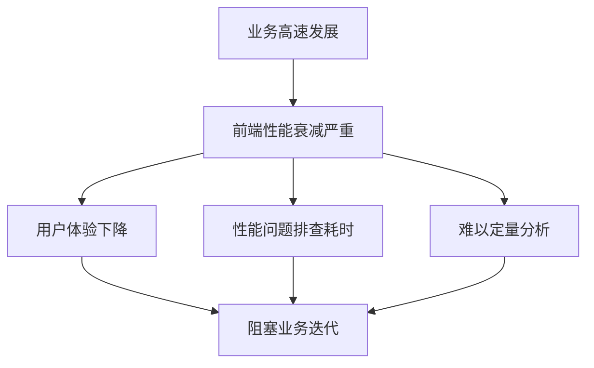

**主要痛点：**

- 前端性能在迭代后衰减严重
- 性能问题影响用户体验
- 排查性能问题耗时且难以定量
- 阻塞业务高速增长

### 1.3 核心问题思考

1. 为什么不能用性能测试工具？
2. 性能监控平台应该包含哪些功能？
3. 需要关注哪些性能指标？

**答案：**

- 性能测试工具无法满足**线上稳定性诉求**
- 测试工具数据**不够全面**，无法如实反馈线上真实情况
- 需要建立完整的**性能监控体系**

## 二、性能优化流程

### 2.1 三步优化法

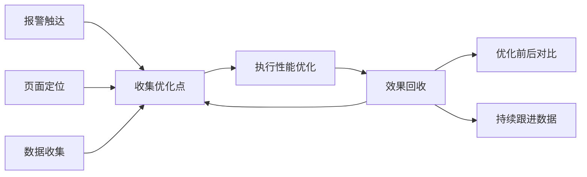

**核心要点：**

- 第一步：收集优化点（报警触达、页面定位、数据收集）
- 第二步：针对优化点做具体性能优化
- 第三步：效果回收（优化前后对比、持续跟进）

**关键洞察：** 整个流程的出发点和归宿都是**数据和性能指标**

## 三、性能监控系统架构

### 3.1 系统整体流程

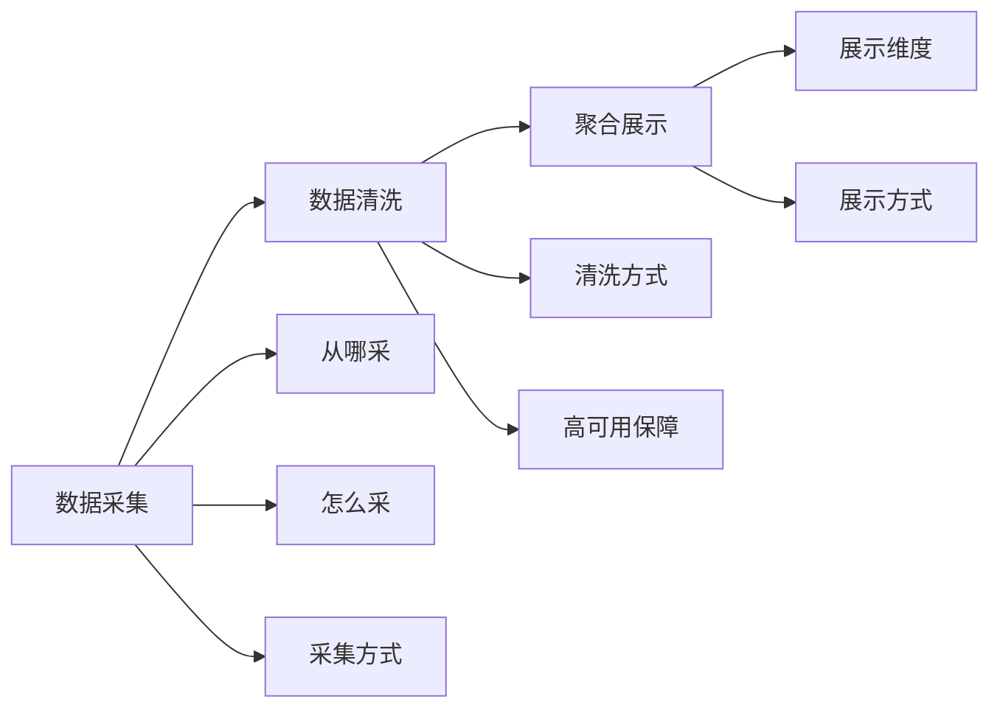

**三大核心模块：**

1. 数据采集
2. 数据清洗
3. 聚合展示

## 四、数据采集详解

### 4.1 功能模块设计

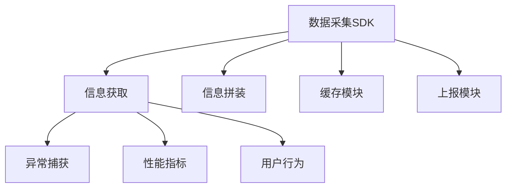

**四大功能模块：**

1. **信息获取** - 采集原始数据
2. **信息拼装** - 标准化数据格式
3. **缓存模块** - 数据暂存（可选）
4. **上报模块** - 数据发送

### 4.2 SDK架构设计

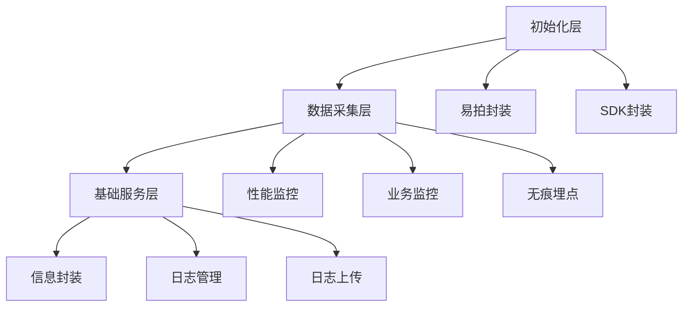

**分层架构：**

- **顶层：** 初始化数据，针对不同端做易拍和SDK封装
- **中层：** 数据采集（性能监控、业务监控、无痕埋点）
- **底层：** 信息封装、日志管理、日志上传

### 4.3 采集信息类型

#### 4.3.1 五大类信息

| 类型                   | 内容                                     | 说明             |
| ---------------------- | ---------------------------------------- | ---------------- |
| **异常相关**     | JS异常、Promise异常、跨域异常            | 全面捕获前端错误 |
| **页面加载时间** | 白屏时间、首屏时间、完全加载、可操作时间 | 多维度性能指标   |
| **页面性能**     | FPS、渲染性能                            | 流畅度监控       |
| **网络情况**     | 请求数、请求时长、网络异常               | 接口性能监控     |
| **原生方法调用** | JSBridge调用、原生容器交互               | Hybrid场景监控   |

#### 4.3.2 异常捕获详解

```javascript
// 1. 一般异常监听
window.onerror

// 2. 未捕获Promise异常
window.addEventListener('unhandledrejection', handler)

// 3. 跨域脚本异常
// 解决方案: 允许跨域标签
<script crossorigin="anonymous" src="..."></script>
```

#### 4.3.3 加载时间指标

**白屏时间：**

- 重要性得分不为零的页面渲染时间
- 重要性得分 = 新增元素得分相加 × 权重

**首屏时间：**

- 重要性得分最高的页面渲染时间

**页面完全加载：**

- 所有资源完成加载时间（window.onload）

**可操作时间：**

- DOMReady + 特定JS标记完成时间

### 4.4 数据拼装标准化

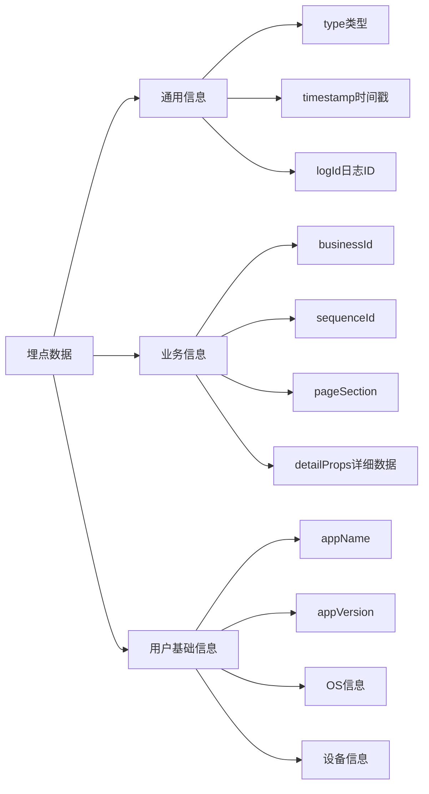

**数据模型三部分：**

1. **通用信息** - 所有日志都包含

   - `type`: 数据类型标识
   - `timestamp`: 时间戳（用于排序）
   - `logId`: 日志唯一标识（用于索引查询）
2. **业务信息** - 业务相关数据

   - `businessId`: 业务标识
   - `sequenceId`: 序列ID
   - `pageSectionId`: 页面区域ID
   - `detailProps`: 详细业务数据
3. **用户基础信息** - 用户环境数据

   - App名称和版本
   - 操作系统信息
   - 设备信息
   - 用于用户画像和错误归集

### 4.5 缓存与上报机制

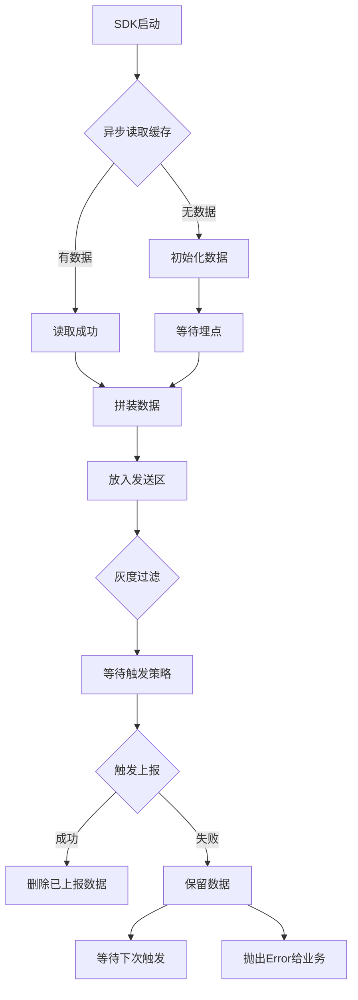

**设计要点：**

- 先异步读取缓存数据
- 接收埋点后放入发送区
- 灰度数据单独处理
- 等待触发策略执行上报
- 失败后保留数据等待重试

### 4.6 上报触发策略

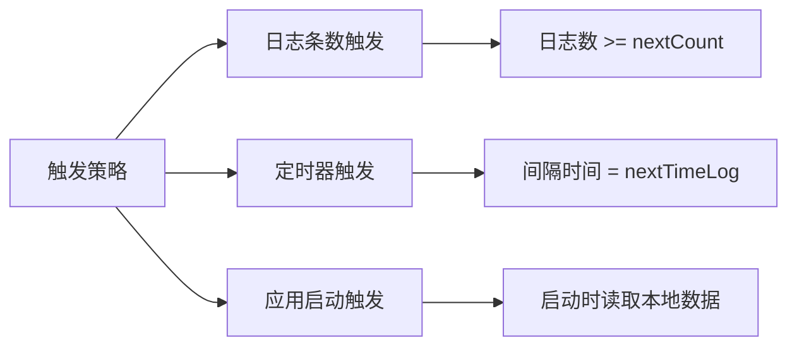

**三种触发策略：**

1. **日志条数触发**

   - 每条数据写入后判断日志数量
   - 大于等于配置的 `nextCount` 值时触发
2. **定时器触发**

   - 设置 `nextTimeLog` 间隔值
   - 定时器到达时间自动触发
3. **应用启动触发**

   - 应用启动时读取本地缓存
   - 如有数据则立即上报
   - 失败则等待其他策略触发

**策略优势：**

- 降低日志上报服务QPS压力
- 业务方可根据场景灵活配置
- 高优先级业务可实时上报
- 低优先级业务可降低频率

## 五、数据清洗详解

### 5.1 清洗架构设计

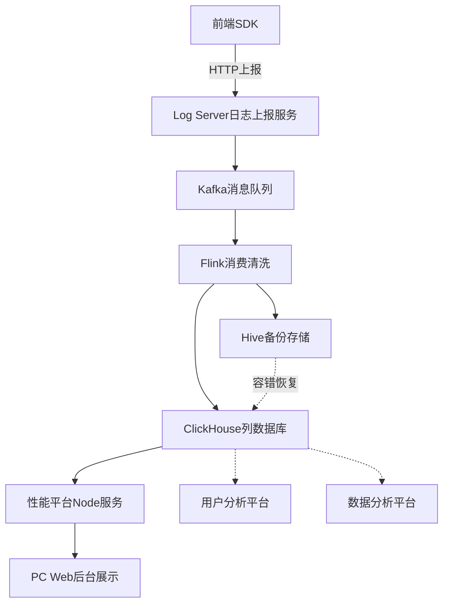

**四大功能模块：**

1. **日志上报服务** - 接收前端上报请求（Node实现）
2. **日志消息队列** - Kafka消息队列缓冲
3. **日志清洗** - Flink消费和清洗
4. **日志存储** - ClickHouse + Hive双存储

### 5.2 技术选型：Flink + ClickHouse

**为什么选择ClickHouse？**

| 优势               | 说明                         |
| ------------------ | ---------------------------- |
| **性能极快** | 列数据库，横向字段计算性能高 |
| **查询速度** | 复杂数据查询从1分钟降至1秒内 |
| **成熟度高** | 业界成熟方案，部署运维简单   |
| **SQL支持**  | 支持SQL化描述，学习成本低    |

**对比ES方案：**

- ES更适合字段索引和搜索引擎场景
- ES不适合性能类数据存储
- ES复杂查询耗时过长（超过1分钟）

### 5.3 数据容错机制

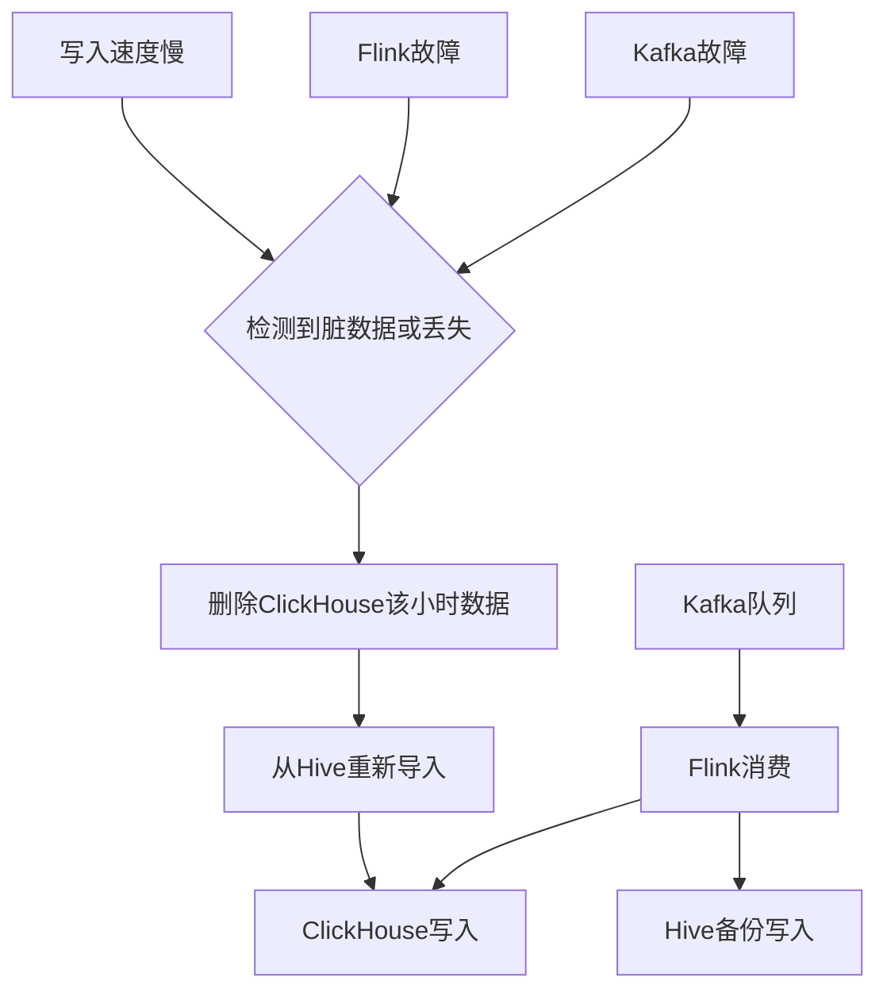

**遇到的问题：**

1. **脏数据增多** - 数据质量下降
2. **消息丢失** - 部分数据未写入
3. **准确性验证困难** - 随机丢数据影响参考价值

**解决方案：Hive双备份**

- Flink同时写入ClickHouse和Hive
- 以小时为维度进行容错
- 发现问题时删除ClickHouse脏数据
- 从Hive重新导入该小时数据
- 解决Kafka队列拥堵和Flink写入速度问题

**核心思想：** 双份备份 + 小时级容错恢复

## 六、聚合展示详解

### 6.1 展示架构设计

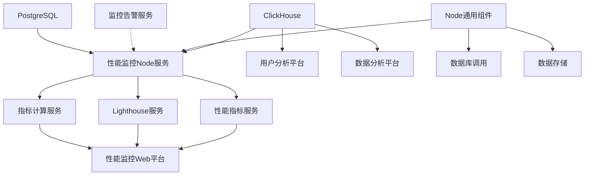

**三层架构：**

1. **展示层** - 性能平台Web、用户分析平台、数据分析平台
2. **服务层** - Node服务（性能指标、Lighthouse、指标计算）
3. **存储层** - ClickHouse（原始数据）+ PostgreSQL（业务数据）

### 6.2 功能特性

**核心功能模块：**

1. **实时数据监控** - 实时查看性能指标
2. **每日报告** - 自动生成性能报告
3. **分析工具** - Lighthouse本地分析
4. **性能优化工具** - 辅助优化决策

### 6.3 定制化处理

**二次清洗：**

- 原始数据清洗：序列化、格式化
- 定制化清洗：计算秒开率等业务指标
- 数据筛选：提取关注的核心数据
- 数据存储：存入PostgreSQL供快速查询

### 6.4 监控告警集成

**接入公司统一告警服务：**

- 不重复造轮子
- 提供性能指标给告警服务消费
- 统一的前后端、移动端告警体系

## 七、性能优化实践

### 7.1 性能分析维度

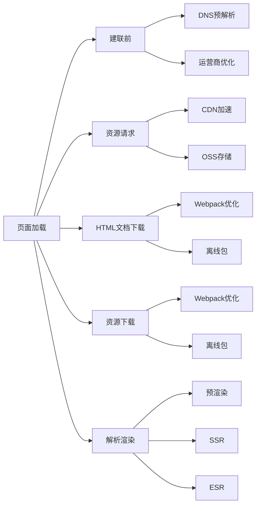

**优化方向：**

- **建联前优化** - DNS预解析、运营商介入（成本高）
- **资源请求优化** - CDN + OSS
- **文档和资源下载** - Webpack打包优化、离线包
- **解析渲染优化** - 预渲染、SSR、ESR

### 7.2 预渲染方案详解

#### 7.2.1 SSR的局限性

**SSR存在的问题：**

1. **后端资源占用大** - ToC业务QPS高，服务压力大
2. **首屏时间优势不明显** - 需等待所有接口返回后才渲染
3. **影响高可用性** - 增加系统不稳定性

#### 7.2.2 预渲染方案设计

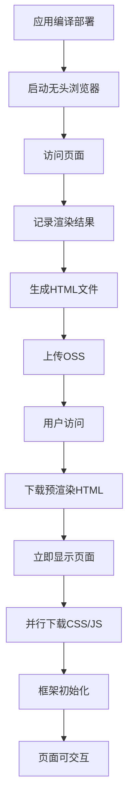

**核心思想：**

- 在**打包阶段**完成页面渲染
- 生成已渲染的HTML骨架
- 用户访问时立即显示
- 并行加载真正的资源

**时间对比：**

| 方案              | 白屏时间 | 首屏时间 | 可交互时间 |
| ----------------- | -------- | -------- | ---------- |
| **传统CSR** | 长       | 长       | 中         |
| **SSR**     | 短       | 中       | 短         |
| **预渲染**  | 极短     | 极短     | 稍长       |

#### 7.2.3 预渲染优势

**优点：**

- ✅ 白屏时间几乎为零
- ✅ 首屏时间缩短50%以上（1600ms → 700ms）
- ✅ 流程简单，系统交互少
- ✅ 基于发布系统，降级和治理方便
- ✅ 无额外服务负载压力
- ✅ 业务开发方式不变（仍是CSR）

**缺点：**

- ❌ 可交互时间稍有延后（多一次HTML下载）

**适用场景：**

- C端活动页面
- 核心业务场景
- 对首屏要求极高的页面

#### 7.2.4 与发布系统集成

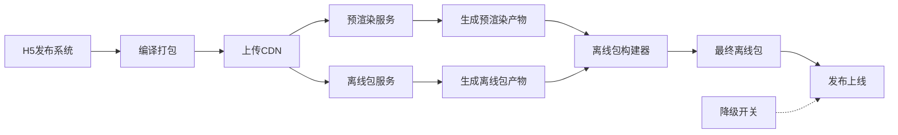

**集成优势：**

- 统一发布流程
- 支持降级开关
- 预渲染和普通版本并存
- 线上治理灵活方便

### 7.3 离线包方案详解

#### 7.3.1 离线包原理

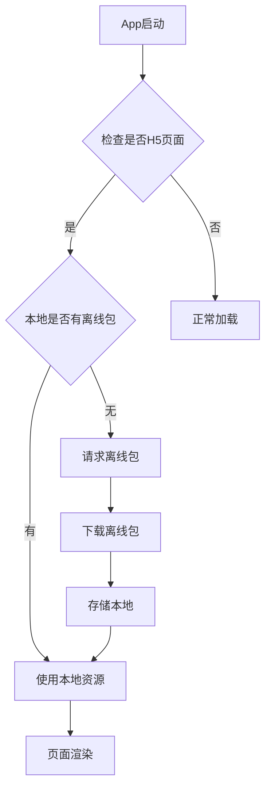

**核心机制：**

- App检测H5页面
- 优先使用本地离线包资源
- 无资源时下载并缓存
- 后续访问直接使用本地资源

#### 7.3.2 离线包优势

**解决的问题：**

1. 消除网络请求往返时间
2. 配合预渲染减少资源下载
3. App场景下的常见优化方案

**效果：**

- 资源加载时间接近零
- 页面打开速度极快
- 用户体验显著提升

### 7.4 预渲染 + 离线包组合方案

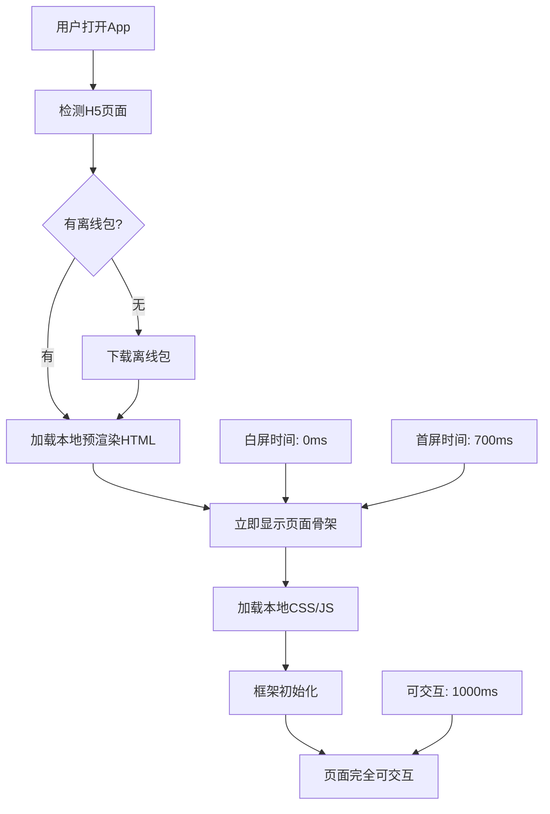

**组合效果：**

- 白屏时间：**0ms**（预渲染）
- 首屏时间：**700ms**（预渲染，优化50%+）
- 资源加载：**接近0ms**（离线包）
- 可交互时间：**1000ms左右**

## 八、核心经验总结

### 8.1 性能优化三原则

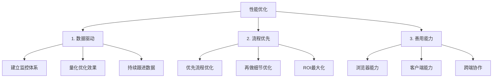

#### 8.1.1 数据驱动优化

**核心观点：**

- 借助性能监控体系挖掘需求
- 避免"无头苍蝇"式优化
- 优化前后效果量化对比
- 持续跟进数据变化

**反面案例：**

- 凭感觉做优化
- 不知道优化什么
- 不知道优化效果如何

#### 8.1.2 流程优先于细节

**优化优先级：**

1. **流程优化** - 效果显著（50%+提升）
2. **细节优化** - 效果有限（5%-10%提升）

**案例对比：**

- ❌ 在1600ms加载时间时做细节优化 → 效果不明显
- ✅ 先用预渲染做流程优化 → 缩短50%至700ms
- ✅ 再做细节优化 → 继续优化至更佳

**原则：**

- 细节优化占总时间百分比小
- 初期应聚焦流程优化
- 后期再精细化调优

#### 8.1.3 善用浏览器和客户端能力

**浏览器能力：**

- DNS预解析
- 资源预加载
- Service Worker
- HTTP/2推送

**客户端能力：**

- 本地缓存
- JSBridge
- 请求拦截
- 离线包机制
- 原生通知

**跨端协作：**

- 不局限于纯前端优化
- 结合Native能力
- 打通整个链路
- 实现高性能体验

### 8.2 大部分优化的本质

**三大方向：**

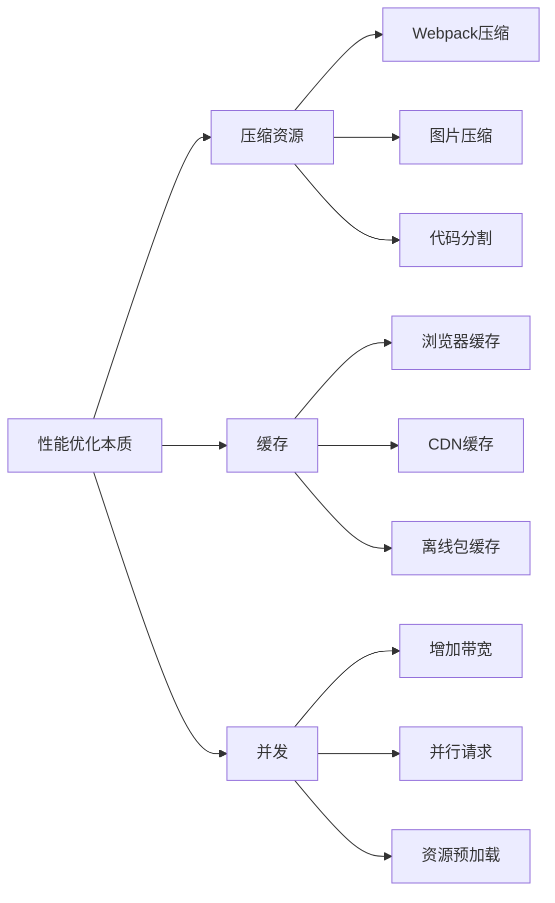

1. **压缩资源** - Webpack压缩、图片优化、代码分割
2. **缓存** - 浏览器缓存、CDN、离线包
3. **并发** - 增加带宽、并行请求、预加载

### 8.3 中型企业快速搭建要点

**技术选型原则：**

- ✅ 选择成熟方案（Flink + ClickHouse）
- ✅ 降低学习成本（SQL化描述）
- ✅ 简化部署运维
- ✅ 前端友好（Node技术栈）

**架构设计原则：**

- ✅ 模块化设计（采集-清洗-展示）
- ✅ 可扩展性（支持业务监控复用）
- ✅ 灵活配置（上报策略可调）
- ✅ 容错机制（Hive双备份）

**实施建议：**

- 不要追求完美，先跑起来
- 根据实际场景灵活调整
- 复用公司现有基础设施
- 因地制宜选择技术方案

## 九、Q&A精选

### Q1: 如何处理大量重复日志上报？

**A:** 在数据清洗阶段做采样处理：

- 按相同类型、相同用户、相同业务维度
- 单一用户或应用短时间超过阈值时
- 按百分比进行采样
- 在Flink清洗阶段执行

### Q2: 数据拼装与埋点的关系？

**A:** 埋点数据包含标准格式：

- 通用信息：type、timestamp、logId
- 用户基础信息：appVersion、OS等
- 业务信息：通过detailProps传递
- 服务端生成：logId、sequenceId等
- 前端上报：其他所有字段

### Q3: 如何监控页面卡顿？

**A:** 关注多维度指标：

- 加载慢：白屏时间、首屏时间
- 渲染慢：FPS、渲染性能
- 网络慢：请求时长、失败率
- 综合监控：覆盖所有关键指标

### Q4: 如何建立稳定性保障工程？

**A:** 前后端策略不同：

- **后端**：依赖监控做高可用（服务器端运行）
- **前端**：监控做兜底，测试做前置（用户端运行）
- 前端更关注性能和体验
- 自动化测试比监控更重要
- 监控用于发现线上问题

### Q5: 预渲染会导致CPU过高或丢帧吗？

**A:** 不会：

- 预渲染在**打包阶段**完成（打包机上）
- 不在客户端或浏览器执行
- 生成的是HTML骨架
- 用户端只是正常渲染HTML
- 不会导致丢帧

**副作用：**

- 可操作时间稍有延后（可接受）

### Q6: 是否有必要容器化？

**A:** 有必要，但需分阶段：

- 容器化对服务稳定性、环境治理、运维成本都有帮助
- 可以支持DevOps流程
- 哈罗正在逐步推进容器化
- 包括性能平台、低代码、发布系统
- 容器化后可能会上SSR（降低运维成本）

### Q7: 实时处理还是批处理？

**A:** 目前实时处理，但批处理更好：

- 实时处理在波峰时风险较高
- 批处理 + 保存可以更好容错
- 后续可能改为批处理方案
- 需要考虑公司整体架构

## 十、总结与展望

### 10.1 核心收获

**性能监控体系建设：**

1. 数据采集 → 数据清洗 → 聚合展示
2. 标准化、模块化、可扩展
3. 技术选型成熟、学习成本低

**性能优化实践：**

1. 预渲染 + 离线包组合方案
2. 首屏时间优化50%+
3. 白屏时间接近零

**方法论沉淀：**

1. 数据驱动优化
2. 流程优先于细节
3. 善用浏览器和客户端能力

### 10.2 适用场景

**中型企业特点：**

- 业务快速增长
- 技术团队规模有限
- 需要快速见效
- 成本控制要求高

**方案优势：**

- 快速搭建（周级别）
- 成本可控
- 效果显著
- 可持续迭代

### 10.3 未来规划

**技术演进方向：**

- 容器化部署
- 批处理优化
- 更多场景覆盖（SSR）
- 低代码集成

**体系完善方向：**

- 更精细的监控维度
- 更智能的告警策略
- 更丰富的分析工具
- 更好的用户体验

---

## 附录

### 相关技术栈

**前端：**

- SDK开发
- 数据埋点
- 性能监控

**服务端：**

- Node.js（日志服务、性能服务）
- Kafka（消息队列）
- Flink（流式计算）
- ClickHouse（列数据库）
- Hive（数据仓库）
- PostgreSQL（业务数据）

**工具：**

- Webpack（打包优化）
- 无头浏览器（预渲染）
- Lighthouse（性能分析）

### 联系方式

**讲师：** 赵勇
**团队：** 哈罗出行平台前端
**公众号：** 哈罗技术团队
