# 可观测性体系建设及OTLP应用实践

> 来源：未核验 · 类型：分享 · 状态：draft


> 分享嘉宾: 唐红建 | OPPO云服务中心高级后端工程师

## 目录

- [一、可观测性要素](#一可观测性要素)
- [二、可观测性方案对比](#二可观测性方案对比)
- [三、OpenTelemetry应用实践](#三opentelemetry应用实践)
- [四、总结与展望](#四总结与展望)

---

## 一、可观测性要素

### 1.1 背景与演进

随着软件应用部署方案的不断演进,从传统的主机部署到虚拟化、容器部署,再到现在的Serverless架构,原有的APM监控方案需要重新定义监控的领域和范围。

现代可观测性需要关注的场景包括:
- 网络监控
- 安全数据
- 基础设施监控
- 日志管理
- 关键性能指标(KPI)监控

### 1.2 可观测性定义

根据可观测性白皮书的定义:

> **可观测性**是衡量一个系统内部状态可以从其外部输出的知识中推断出来的程度的指标。

### 1.3 可观测性三要素

可观测性白皮书定义了三个核心要素:

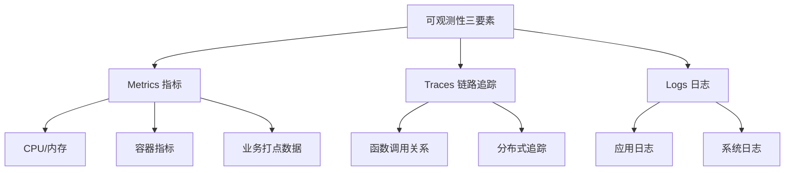

#### 1.3.1 Metrics(指标)
- **内容**: CPU、内存、容器指标、业务打点数据
- **解决方案**: Prometheus、VictoriaMetrics、Datadog等

#### 1.3.2 Traces(链路追踪)
- **内容**: 函数调用关系、分布式追踪
- **解决方案**: Jaeger、Zipkin、Tempo等

#### 1.3.3 Logs(日志)
- **内容**: 应用日志、系统日志
- **解决方案**: Loki、Elasticsearch、ClickHouse等

### 1.4 可观测性技术演进历程

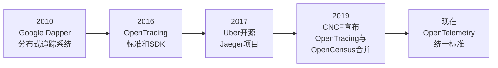

---

## 二、可观测性方案对比

### 2.1 Grafana全家桶方案

Grafana推出了一套完整的可观测性解决方案:

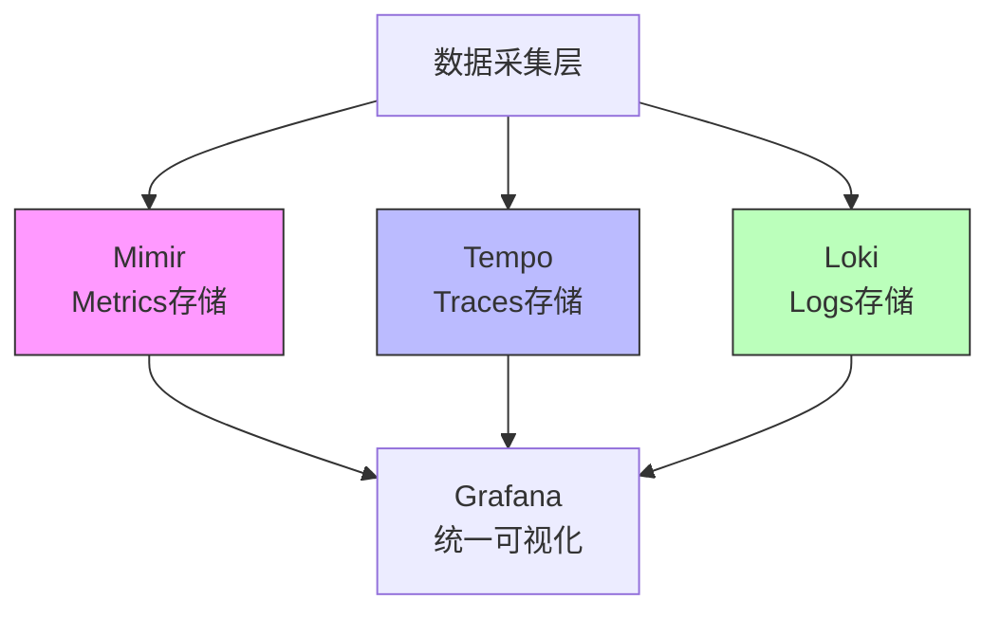

#### 核心组件

| 组件 | 功能 | 技术特点 |
|------|------|----------|
| **Mimir** | Metrics存储 | 基于Prometheus的水平分布式、可扩展的后端存储方案 |
| **Tempo** | Traces存储 | 分布式追踪数据存储 |
| **Loki** | Logs存储 | 日志数据存储和持久化 |

#### 数据关联机制

Grafana通过在Metrics中打上`exemplar`标记,实现Metrics与Traces、Metrics与Logs的联动查询。

**架构特点**:
- 主要基于Prometheus架构
- 采用LSM Tree存储结构
- 支持数据关联查询

### 2.2 VictoriaMetrics方案

VictoriaMetrics是一个高性能的时序数据库解决方案。

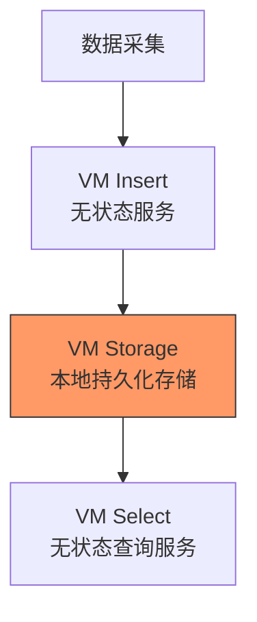

#### 架构特点

- **唯一持久化组件**: VM Storage(本地存储)
- **无状态服务**: VM Insert和VM Select都是无状态的
- **高性能设计**: 优化的索引和压缩算法

#### 核心数据结构

**关键词定义**:
- `metric_name`: 指标名称
- `metric_group`: 指标分组
- `tag`: 标签(对应Prometheus的label name和label value)

**内部结构(TSID)**:
```
TSID = {
    metric_group_id,
    tag_id,
    instance_id,
    metric_id
}
```

#### 索引机制

VictoriaMetrics实现了多层索引结构:

| 索引类型 | 映射关系 | Prefix值 |
|----------|----------|----------|
| 指标名索引 | metric_id → metric_name | - |
| 标签索引 | tag → metric_id | 3 |
| TSID索引 | metric_id → TSID | - |
| 倒排索引 | tag_id → metric_id | 1 |

**优化技术**:
- **倒排索引**: 在从Memory数据转到Block时,对所有tag的key和value进行排序
- **前缀异或**: 大量使用前缀异或操作,减少索引数据长度和占用空间

#### VM Logs方案

2023年,VictoriaMetrics推出了针对日志的解决方案(目前尚未正式Release):

**技术特点**:
- 基于ClickHouse架构
- 使用布隆过滤器
- 不同数据类型采用不同的压缩和编码方式
- 支持稀疏索引
- 支持高基数数据检索

### 2.3 OpenObserve方案

OpenObserve是2023年新兴的可观测性解决方案。

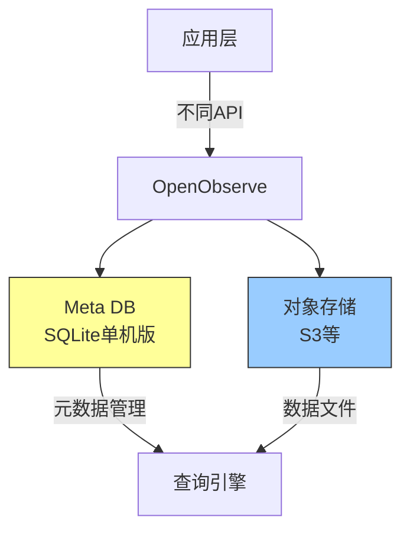

#### 核心特点

1. **索引分离**: 索引存储在独立的Meta DB中(如SQLite)
2. **数据存储**: 数据以Parquet文件格式存储在对象存储中
3. **简化架构**: 不需要自己维护索引和数据存储的复杂逻辑

#### 数据导入API

支持多种数据导入方式:
- Traces导入接口
- Metrics导入接口  
- Logs导入接口

#### 文件结构

**本地文件结构**:
```json
{
  "start_time": "...",
  "compressed_data": "..."
}
```

**持久化目录结构**:
```
/data/
  ├── 1h/     # 1小时粒度
  ├── 6h/     # 6小时粒度
  └── 24h/    # 24小时粒度
```

数据按时间粒度从小到大逐渐汇聚。

### 2.4 方案对比总结

| 方案 | 优势 | 适用场景 |
|------|------|----------|
| **Grafana全家桶** | 生态完整、数据关联强、可视化优秀 | 云原生环境、需要完整可观测性方案 |
| **VictoriaMetrics** | 高性能、低资源占用、压缩率高 | 大规模Metrics存储、资源受限环境 |
| **OpenObserve** | 架构简单、运维成本低、存储成本低 | 中小规模、希望降低运维复杂度 |

---

## 三、OpenTelemetry应用实践

### 3.1 OpenTelemetry概述

OpenTelemetry(简称OTel)在可观测性体系中的定位是**数据采集和传输的统一标准**。

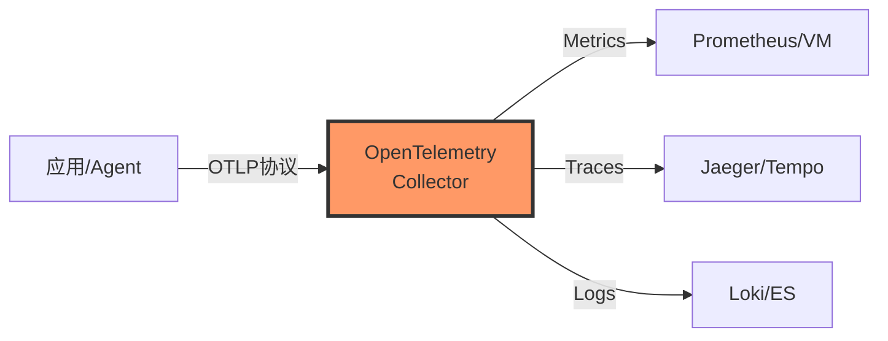

#### 核心角色

OpenTelemetry Collector作为**数据汇聚层**,负责:
- 接收前端应用/Agent推送的数据
- 对数据进行处理和转换
- 将数据分发给后端存储节点

#### 支持的维度

- **Metrics**: 指标数据
- **Traces**: 链路追踪数据
- **Logs**: 日志数据

#### 支持的语言SDK

- **JVM系**: Java、Kotlin、Scala
- **非JVM系**: Go、Python、JavaScript、Rust、C++等

### 3.2 OpenTelemetry Collector架构

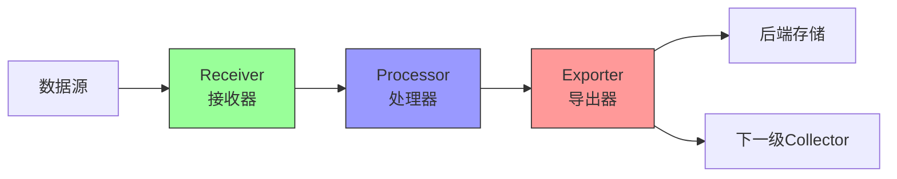

#### 三大核心组件

| 组件 | 功能 | 典型操作 |
|------|------|----------|
| **Receiver** | 接收数据 | 数据过滤、预聚合 |
| **Processor** | 处理数据 | 批处理、降采样、数据清洗 |
| **Exporter** | 导出数据 | 发送到后端存储或下一级Collector |

#### 支持级联部署

OpenTelemetry Collector支持多级部署:
- **边缘层**: 靠近应用部署,做初步数据处理
- **中心层**: 汇聚多个边缘节点数据,做进一步聚合

### 3.3 OpenTelemetry数据模型

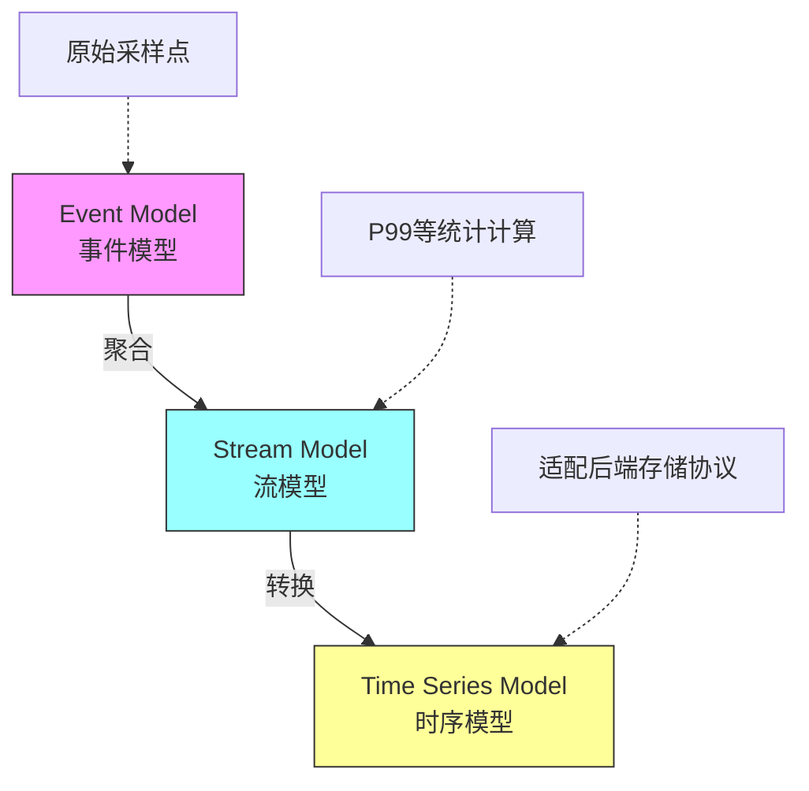

#### 三层数据模型

1. **Event Model(事件模型)**
   - 表示采样的原始数据点
   - 单个时间点的单个值
   - 位置: 应用层(Instrumentation)

2. **Stream Model(流模型)**
   - 对原始数据进行聚合计算
   - 如P99、P95等统计指标
   - 位置: Collector层

3. **Time Series Model(时序模型)**
   - 适配后端存储协议
   - 如Prometheus、InfluxDB等格式
   - 位置: Exporter层

### 3.4 分布式扩展策略

#### 何时需要扩展?

监控以下指标判断是否需要扩容:

1. **业务高峰**: 某个时间点出现内存和CPU波动
2. **持续高负载**: 过去24小时负载一直较高

#### 关键监控指标

| 指标 | 含义 | 处理建议 |
|------|------|----------|
| `processor_refused` | Collector处理能力不足,丢弃数据 | **需要扩容Collector** |
| `exporter_queue` | 后端存储处理能力不足 | 增加缓存层或扩容后端存储 |

#### 扩展场景

**场景1: 无状态Collector扩容(Push模式)**

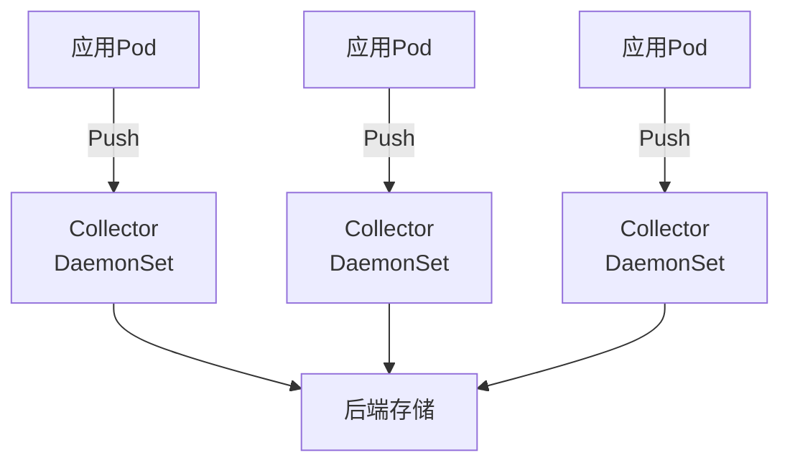

- **DaemonSet部署**: 每个节点一个Collector,随业务扩容自动扩展
- **负载均衡部署**: Collector集群前置LB,应用Push到LB

**场景2: 有状态Collector扩容(Pull模式)**

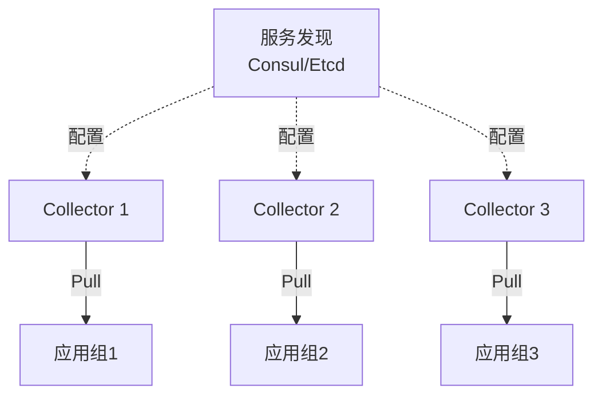

扩展策略:
- **服务发现**: 使用Consul等实现负载均衡的抓取
- **配置分片**: 不同Collector配置不同的endpoint
- **标签匹配**: 通过标签过滤实现数据分片

**场景3: 有状态Collector扩容**

针对需要状态管理的场景,需要更复杂的方案,建议参考OpenTelemetry官方文档。

### 3.5 实践案例: 完整部署流程

#### 案例架构

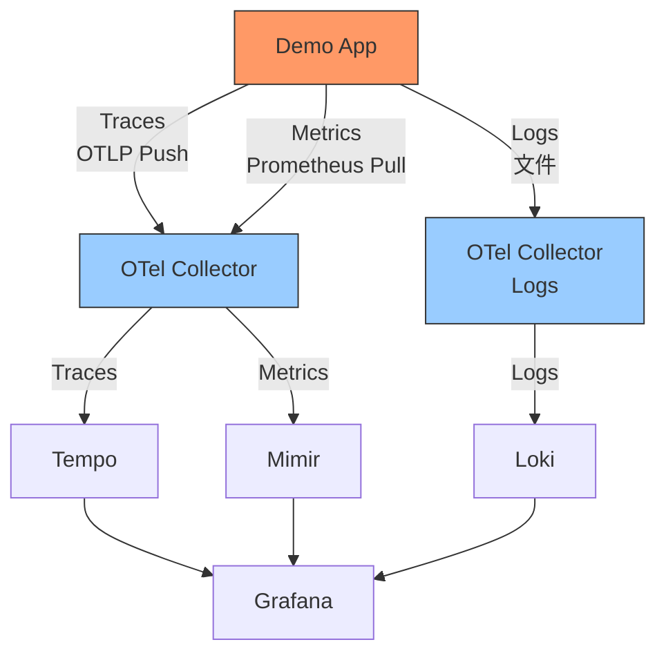

#### 部署步骤

**Step 1: 部署后端存储**

使用Docker Compose部署Grafana全家桶:
```yaml
services:
  mimir:      # Metrics存储
  tempo:      # Traces存储
  loki:       # Logs存储
  grafana:    # 可视化
  pyroscope:  # 持续性能监控(可选)
```

**Step 2: 部署Collector**

- `collector`: 处理Metrics和Traces
- `collector-logs`: 处理Logs
- 配置负载均衡(可选)

**Step 3: 部署应用**

在应用中集成OpenTelemetry SDK

#### 应用侧配置

**1. 初始化配置**

```go
// 指定OTel Collector地址
endpoint := "otel-collector:4317"

// 初始化Trace Provider
traceProvider := initTraceProvider(endpoint)
defer traceProvider.Shutdown(context.Background())
```

**2. Traces采集(Push模式)**

```go
// 设置Trace Provider
otel.SetTracerProvider(traceProvider)

// 在函数中使用
func handleRequest(ctx context.Context) {
    ctx, span := tracer.Start(ctx, "handleRequest")
    defer span.End()
    
    // 业务逻辑
    // ...
}
```

**3. Metrics采集(Pull模式)**

```go
// 应用暴露Prometheus端点
http.Handle("/metrics", promhttp.Handler())

// Collector配置抓取
```

**4. 关联Traces和Logs**

当请求延时超过阈值时,生成exemplar标记:

```go
if latency > 100 * time.Millisecond {
    // 生成exemplar,关联trace_id
    exemplar := prometheus.NewExemplar(
        prometheus.Labels{"trace_id": traceID},
        latency,
    )
}
```

#### Collector配置详解

**Collector配置文件(Metrics + Traces)**

```yaml
receivers:
  otlp:
    protocols:
      grpc:
        endpoint: 0.0.0.0:4317  # 接收Traces
  prometheus:
    config:
      scrape_configs:
        - job_name: 'demo-app'
          static_configs:
            - targets: ['app:8080']  # 抓取Metrics

processors:
  batch:
    timeout: 10s
    send_batch_size: 1024

exporters:
  otlp/tempo:
    endpoint: tempo:4317  # Traces导出到Tempo
  prometheusremotewrite:
    endpoint: http://mimir:9009/api/v1/push  # Metrics导出到Mimir
    headers:
      X-Scope-OrgID: "demo"

service:
  pipelines:
    traces:
      receivers: [otlp]
      processors: [batch]
      exporters: [otlp/tempo]
    metrics:
      receivers: [prometheus]
      processors: [batch]
      exporters: [prometheusremotewrite]
```

**Collector配置文件(Logs)**

```yaml
receivers:
  filelog:
    include: [/var/log/app/*.log]  # 读取日志文件
    operators:
      - type: json_parser  # 解析JSON格式日志

processors:
  batch:
    timeout: 10s

exporters:
  loki:
    endpoint: http://loki:3100/loki/api/v1/push

service:
  pipelines:
    logs:
      receivers: [filelog]
      processors: [batch]
      exporters: [loki]
```

#### 配置要点

1. **Traces采用Push**: 应用主动推送到Collector
2. **Metrics采用Pull**: Collector主动抓取应用暴露的端点
3. **Logs采用文件采集**: Collector读取应用输出的日志文件
4. **数据关联**: 通过exemplar实现Metrics和Traces的关联

### 3.6 实践经验总结

#### 优势

1. **统一标准**: 一套SDK支持多种后端存储
2. **灵活性**: 可以随时切换后端存储而不改应用代码
3. **可扩展**: 支持级联部署和水平扩展
4. **数据处理**: 在Collector层统一处理数据转换和清洗

#### 注意事项

1. **性能开销**: SDK会带来一定的性能开销,需要评估
2. **采样策略**: 高流量场景需要合理配置采样率
3. **资源规划**: Collector需要足够的CPU和内存资源
4. **监控Collector**: 需要监控Collector自身的健康状态

---

## 四、总结与展望

### 4.1 核心要点回顾

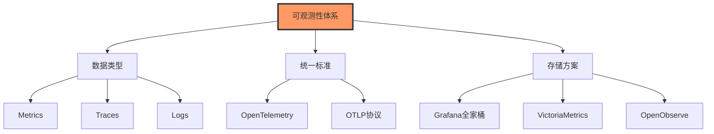

#### 1. 可观测性数据类型

- **Metrics**: 监控指标,时序数据
- **Traces**: 分布式链路追踪
- **Logs**: 日志数据
- 每种数据类型特点不同,需要不同的存储和处理方案

#### 2. OpenTelemetry的价值

- **统一数据接入标准**: 解决数据格式不统一的问题
- **提高数据流转效率**: 简化数据从采集到存储的链路
- **降低切换成本**: 更换后端存储不需要改动应用代码

#### 3. 后端存储选型

| 考虑因素 | 说明 |
|----------|------|
| **数据规模** | 小规模可用单机方案,大规模需要分布式方案 |
| **持久化要求** | 不同方案的数据保留能力不同 |
| **查询性能** | 根据查询模式选择合适的索引方案 |
| **运维成本** | 考虑团队的运维能力和资源投入 |
| **成本预算** | 开源方案vs商业方案的成本差异 |

### 4.2 未来发展趋势

#### 1. 后端数据库融合

不同的可观测性数据可能需要不同的存储方案,未来趋势是:
- 统一的数据接入层(OpenTelemetry)
- 多种后端存储共存
- 根据数据特点选择最优存储

#### 2. OpenTelemetry生态扩展

OpenTelemetry正在扩展支持更多类型的可观测性数据:
- **持续性能监控**: Continuous Profiling
- **eBPF集成**: 无侵入式监控
- **更多语言SDK**: 覆盖更多编程语言

#### 3. 数据格式统一

OpenTelemetry推动数据格式标准化:
- 简化不同系统间的数据流转
- 降低数据转换成本
- 提高数据互操作性

例如: 当Prometheus不支持乱序数据(Out of Order)时,如果要导入到支持乱序的数据库(如InfluxDB),需要做大量数据格式转换。有了OpenTelemetry,这个过程会更加简化。

### 4.3 实践建议

#### 对于小规模场景(50套以下应用)

1. **Metrics**: 单机VictoriaMetrics即可满足
2. **Logs**: VictoriaMetrics Logs或Loki
3. **Traces**: Tempo或Jaeger
4. **可视化**: Grafana

#### 对于中大规模场景

1. **采用OpenTelemetry**: 统一数据采集标准
2. **Collector分层部署**: 边缘+中心两层架构
3. **后端存储集群化**: Mimir/Thanos集群、分布式Tempo等
4. **监控Collector**: 关注`processor_refused`等关键指标

#### 对于Kubernetes环境

1. **DaemonSet部署Collector**: 每个节点一个Agent
2. **中心Collector集群**: 汇聚和处理数据
3. **利用云原生特性**: 服务发现、自动扩缩容等
4. **考虑商业方案**: Datadog、Dynatrace等(如预算充足)

### 4.4 常见问题解答

**Q1: 可观测性与监控的区别?**

- **监控(Monitoring)**: 范围较窄,主要关注已知的指标和告警
- **可观测性(Observability)**: 范围更广,强调从外部输出推断内部状态的能力,包括对未知问题的探索

两者可以并行,监控是可观测性的子集。

**Q2: Prometheus + VictoriaMetrics适合什么场景?**

- 数据持久化要求不是特别高
- 数据量中等规模
- 希望利用Prometheus生态
- VictoriaMetrics提供更好的压缩比和查询性能

**Q3: 如何实现Metrics、Traces、Logs的关联?**

- 使用**Exemplar机制**: 在Metrics中嵌入trace_id
- 统一使用**trace_id**: 在Logs中记录trace_id
- 通过Grafana的**数据关联功能**: 点击Metrics跳转到对应的Trace和Logs

**Q4: 网络性能监控如何实现?**

- **Kubernetes环境**: Cilium提供L3-L7层的可观测性
- **eBPF技术**: 无侵入式网络性能监控
- **专业工具**: 如Kentik、ThousandEyes等

**Q5: OpenTelemetry是否有数据采集SDK?**

OpenTelemetry提供了完整的SDK,支持多种语言:
- Java、Go、Python、JavaScript、.NET等
- 但**不提供后端存储实现**(这是设计理念,专注于标准制定)
- 后端存储由专业的存储方案提供(Prometheus、Jaeger等)

---

## 附录

### 相关资源

- **OpenTelemetry官网**: https://opentelemetry.io/
- **Grafana官网**: https://grafana.com/
- **VictoriaMetrics官网**: https://victoriametrics.com/
- **OpenObserve官网**: https://openobserve.ai/
- **CNCF可观测性白皮书**: https://www.cncf.io/

### 技术栈对比

| 技术栈 | Metrics | Traces | Logs | 特点 |
|--------|---------|--------|------|------|
| **Grafana全家桶** | Mimir | Tempo | Loki | 生态完整,数据关联强 |
| **VictoriaMetrics** | VM | - | VM Logs | 高性能,低资源占用 |
| **Elastic Stack** | Metricbeat | APM | Elasticsearch | 功能强大,资源消耗大 |
| **Datadog** | ✓ | ✓ | ✓ | 商业方案,开箱即用 |

---

> **分享总结**: 本次分享详细介绍了可观测性体系的构成要素、主流开源方案的对比,以及OpenTelemetry的应用实践。OpenTelemetry作为统一的数据采集标准,正在成为云原生可观测性的基石。建议根据实际场景选择合适的后端存储方案,并充分利用OpenTelemetry的灵活性构建可扩展的可观测性平台。

---

*文档整理: 基于OPPO云服务中心唐红建老师的技术分享*  
*整理日期: 2025年*
