# 私有云环境下基于Prometheus的监控体系建设

> 来源：未核验 · 类型：分享 · 状态：draft


## 分享嘉宾简介

**讲师**：小罗  
**职位**：北方激光研究院广西分公司运维总监  
**工作背景**：
- 曾在荔枝FM负责运维开发工作
- 早期在电商公司从事运维相关工作
- 目前负责组建云计算团队，构建基于北斗的私有云+Docker PaaS层服务

## 一、当前环境架构概览

### 1.1 技术栈组成

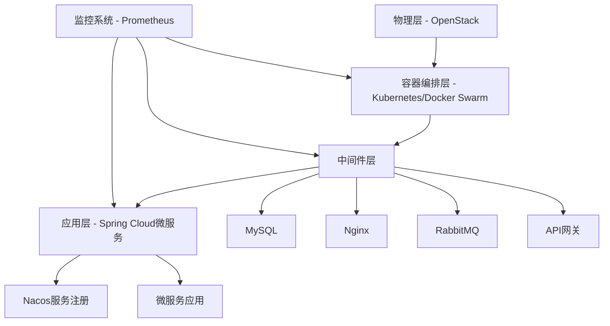

**架构层次说明**：
- **底层**：OpenStack构建的物理环境
- **容器层**：从Docker Swarm逐步迁移到Kubernetes
- **中间件层**：MySQL、Nginx、RabbitMQ等
- **应用层**：基于Spring Cloud + Alibaba Nacos的微服务架构
- **监控层**：基于Prometheus的统一监控平台

### 1.2 运维自动化平台架构演进

之前公司的自动化架构体系：

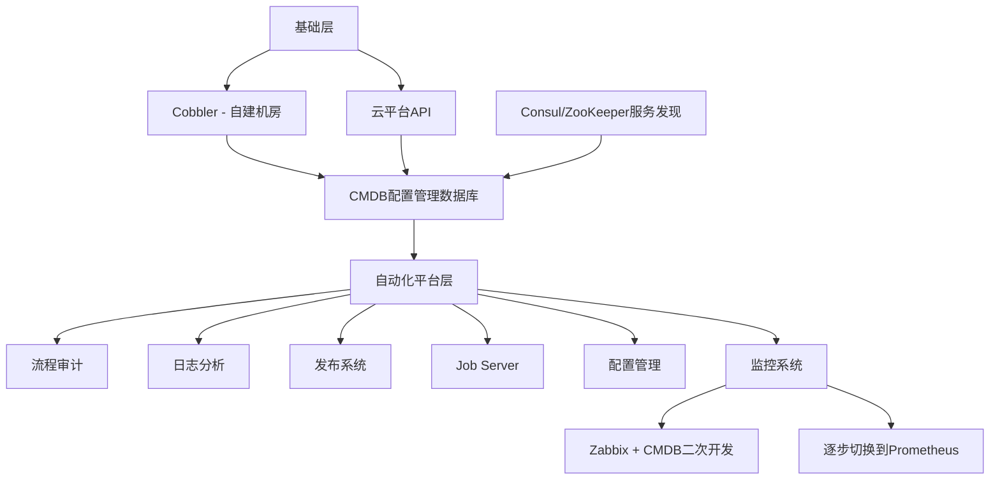

## 二、监控体系分类

### 2.1 按监控层次分类

#### 硬件层面监控
- **监控对象**：物理服务器、网络设备
- **采集方式**：
  - 硬件传感器采集
  - SNMP协议采集硬件信息
  - CPU、内存、风扇等物理状态监控

#### 软件层面监控
- **中间件监控**：MySQL、Redis、RabbitMQ、Nginx等
- **应用监控**：Java应用、进程状态等

#### 云基础设施监控
- **OpenStack层**：
  - 虚拟机使用状态
  - 存储使用状态
  - 各组件健康状态

#### 微服务监控
- **应用状态**：每个微服务的运行状态
- **接口监控**：URL请求次数、响应时间
- **业务埋点**：通过接口埋点实现业务指标采集

### 2.2 按监控方式分类

参考Google SRE理念，监控分为白盒监控和黑盒监控：

#### 白盒监控（White-Box Monitoring）
- **定义**：基于应用内部运行状态的监控
- **特点**：通过业务埋点发现服务内部问题，从而推断接口状态
- **应用场景**：
  - JVM内存、线程状态
  - 业务接口调用次数
  - 数据库连接池状态
  - 自定义业务指标

#### 黑盒监控（Black-Box Monitoring）
- **定义**：从外部直观观察系统状态
- **特点**：通过HTTP探针、TCP探针等方式检测
- **应用场景**：
  - 网络线路是否正常
  - 端口是否健康
  - SSL证书是否到期
  - 接口响应状态码
- **Prometheus方案**：Blackbox Exporter

## 三、监控软件选型对比

### 3.1 主流监控方案对比

| 监控系统 | 存储方式 | 优势 | 劣势 | 适用场景 |
|---------|---------|------|------|---------|
| **Zabbix** | MySQL/PostgreSQL | 功能全面、成熟稳定、二次开发友好 | 大规模场景存储瓶颈（>1000节点）、需要分库分表 | 传统运维环境 |
| **Prometheus** | 时序数据库TSDB | 性能强大、云原生、K8s集成好、查询语言强大 | 不适合日志分析和链路追踪 | 云原生、微服务、K8s环境 |
| **Open-Falcon** | - | 社区活跃 | 文档相对较少 | - |
| **Nightingale** | - | 新一代监控方案 | - | - |

### 3.2 Zabbix的问题与挑战

实践中遇到的Zabbix痛点：
1. **性能瓶颈**：访问量大时，MySQL存储成为瓶颈
2. **扩展性**：超过1000个节点时需要分库分表或使用中间件
3. **版本迁移**：Zabbix 4.0后改用时序数据库，但迁移成本高
4. **动态环境**：不适合云原生的动态服务发现场景

### 3.3 选择Prometheus的核心原因

#### 原因1：私有云环境的动态性
- OpenStack + Kubernetes环境，服务实例可变
- Prometheus提供多种服务发现机制
- 完美集成Kubernetes生态

#### 原因2：微服务状态监控
- 无需提前配置，通过埋点自动发现
- 支持集成Micrometer到微服务框架
- 自动采集每个微服务的运行指标

#### 原因3：强大的查询能力（PromQL）
- **预测功能**：根据磁盘增长率预测未来使用率
- **排序统计**：查询CPU使用率Top 5、访问量Top 10的URL/IP
- **聚合分析**：灵活的数据聚合和计算

**PromQL示例**：
```promql
# 预测7小时后磁盘使用率
predict_linear(node_filesystem_free_bytes[1h], 7*3600)

# 查询最近10分钟访问量Top 10的URL
topk(10, rate(http_requests_total[10m]))

# 查询CPU使用率Top 5的实例
topk(5, 100 - (avg by(instance) (irate(node_cpu_seconds_total{mode="idle"}[5m])) * 100))
```

#### 原因4：Kubernetes深度集成
- 已作为CNCF官方认证项目
- 以Operator形式集成到K8s
- 成为容器监控的事实标准

#### 原因5：炫酷的可视化（Grafana）
- 与Grafana完美结合
- 丰富的图表渲染效果
- 直观的数据展示

## 四、Prometheus架构解析

### 4.1 核心组件架构

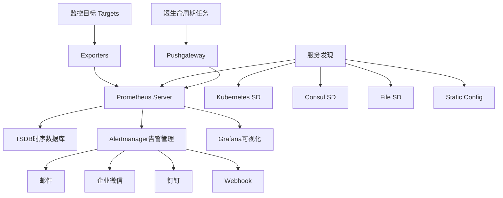

**架构特点**：
- **解耦设计**：各组件独立部署，轻量级
- **拉取模式**：Prometheus Server主动拉取Exporter指标
- **推送模式**：特殊场景通过Pushgateway推送
- **灵活告警**：Alertmanager独立处理告警路由和通知

### 4.2 核心组件说明

| 组件 | 功能 | 说明 |
|-----|------|------|
| **Prometheus Server** | 核心服务 | 数据采集、存储、查询 |
| **Exporter** | 数据导出器 | 将各类系统指标转换为Prometheus格式 |
| **Pushgateway** | 推送网关 | 接收短期任务推送的指标 |
| **Alertmanager** | 告警管理 | 告警分组、抑制、静默、路由 |
| **Grafana** | 可视化 | 图表展示和Dashboard管理 |
| **服务发现** | 动态发现 | 自动发现监控目标 |

### 4.3 Prometheus的核心优势

#### 1. 配置灵活
- 开箱即用，下载解压即可运行
- 无需复杂的依赖包安装
- 配置文件简洁明了

#### 2. 强大的查询语言（PromQL）
- 丰富的聚合函数
- 灵活的数据查询和计算
- 支持各种复杂的图表展示

#### 3. 高性能单机架构
- 基于时序数据库TSDB
- 单机可处理百万级监控指标
- 实测场景：数十台物理机+100+个K8s节点，无压力

#### 4. 良好的生态环境
- 官方和社区提供丰富的Exporter
- 无需编写自定义监控脚本
- 多语言SDK支持（Go、Java、Python等）
- 直接暴露/metrics接口供采集

## 五、Exporter实战应用

### 5.1 基础监控Exporter

#### Node Exporter - 主机监控
**功能**：采集主机硬件和操作系统指标

**监控指标**：
- CPU使用率、负载
- 内存使用情况
- 磁盘IO、使用率
- 网络流量
- 系统运行时间
- 文件系统状态

**部署方式**：
```bash
# 下载并运行Node Exporter
wget https://github.com/prometheus/node_exporter/releases/download/v1.x.x/node_exporter-1.x.x.linux-amd64.tar.gz
tar -xzf node_exporter-1.x.x.linux-amd64.tar.gz
./node_exporter
```

**Prometheus配置**：
```yaml
scrape_configs:
  - job_name: 'node'
    static_configs:
      - targets: ['localhost:9100']
```

#### Process Exporter - 进程监控
**功能**：监控指定进程的状态

**监控对象**：
- 通用进程：Nginx、JVM等
- 自定义脚本进程
- 进程CPU、内存使用
- 进程存活状态

#### Blackbox Exporter - 黑盒监控（重点推荐）
**功能**：外部探测监控

**应用场景**：
1. **全国机房链路监控**
   - 基于ICMP Ping探测
   - 监控各机房到中心机房的网络质量
   - 延迟、丢包率统计

2. **API接口状态监控**
   - HTTP状态码检测
   - 接口响应时间
   - 支持GET/POST请求
   - 支持自定义请求头和Body

3. **域名访问监控**
   - 网站可用性检测
   - SSL证书到期时间
   - DNS解析时间
   - 每个子域名的访问耗时

**Blackbox配置示例**：
```yaml
modules:
  http_2xx:
    prober: http
    http:
      preferred_ip_protocol: "ip4"
      valid_status_codes: [200]
  
  http_post_2xx:
    prober: http
    http:
      method: POST
      headers:
        Content-Type: application/json
      body: '{"key":"value"}'
  
  icmp:
    prober: icmp
```

**Prometheus配置**：
```yaml
scrape_configs:
  - job_name: 'blackbox'
    metrics_path: /probe
    params:
      module: [http_2xx]
    static_configs:
      - targets:
        - https://example.com
        - https://api.example.com
    relabel_configs:
      - source_labels: [__address__]
        target_label: __param_target
      - source_labels: [__param_target]
        target_label: instance
      - target_label: __address__
        replacement: blackbox-exporter:9115
```

#### OpenStack Exporter - 云平台监控
**功能**：监控OpenStack云平台资源

**监控指标**：
- Running VMs：运行中的虚拟机数量
- Free Memory：可用内存资源
- Controller/Compute节点状态
- 资源超分情况（CPU、内存）
- 存储资源使用情况

**实践经验**：
- 支持虚拟化超分配（CPU、内存超售）
- 实时监控资源超分告警
- 磁盘资源独立监控

### 5.2 中间件监控Exporter

#### MySQL Exporter
**监控指标**：
- 主从复制状态
  - IO线程状态
  - SQL线程状态
  - 主从延迟时间（Seconds_Behind_Master）
- 连接数
  - 当前连接数
  - 最大连接数
- 查询性能
  - QPS（每秒查询数）
  - TPS（每秒事务数）
  - 慢查询统计
- 数据库运行时间
- InnoDB缓冲池状态

**Grafana Dashboard**：社区提供丰富的MySQL监控模板（如Dashboard ID: 7362）

#### RabbitMQ Exporter
**监控指标**：
- Queue深度
- 消息堆积情况
- 消费者数量
- 集群节点状态
- 内存使用

#### Redis Exporter
**监控指标**：
- 内存使用
- 键空间统计
- 命令执行统计
- 持久化状态
- 主从复制状态

#### Nginx Exporter
**监控指标**：
- 活跃连接数
- 请求处理速率
- 响应状态码统计

#### Ceph Exporter - 分布式存储监控
**监控指标**：
- OSD状态（3个OSD健康状态）
- 集群健康状态（HEALTH_OK/WARN/ERR）
- 存储容量和使用率
- 多副本状态监控

**实践案例**：
- 实时监控OSD故障
- 当某个OSD变红时触发告警
- 存储容量预警

### 5.3 Kubernetes监控

#### Kube-State-Metrics
**功能**：采集Kubernetes集群状态指标

**监控内容**：
- Pod状态和资源使用
- Deployment副本数
- Node节点状态
- Service、Ingress状态
- PVC存储状态

#### 容器监控组合
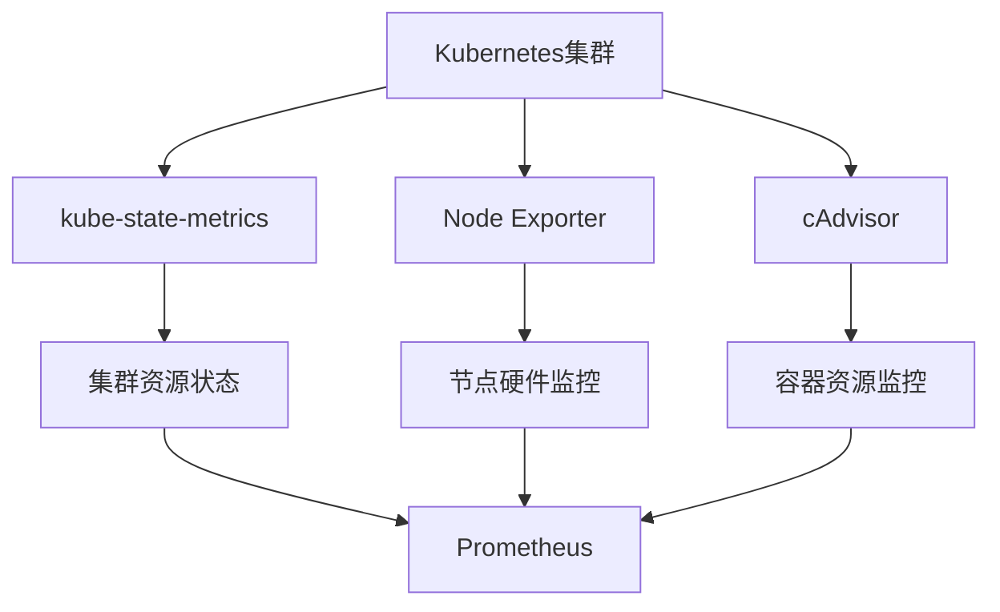

**监控层次**：
1. **Node Exporter**：监控K8s主机节点
2. **cAdvisor**：监控容器内部资源
3. **Kube-State-Metrics**：监控K8s资源对象状态

### 5.4 Spring Cloud微服务监控

#### Micrometer + Actuator方案

**依赖引入**（Maven）：
```xml
<dependency>
    <groupId>org.springframework.boot</groupId>
    <artifactId>spring-boot-starter-actuator</artifactId>
</dependency>
<dependency>
    <groupId>io.micrometer</groupId>
    <artifactId>micrometer-registry-prometheus</artifactId>
</dependency>
```

**配置文件**（application.yml）：
```yaml
management:
  endpoints:
    web:
      exposure:
        include: prometheus,health,info
  metrics:
    export:
      prometheus:
        enabled: true
```

**自动暴露的指标**：
- JVM内存使用（堆内存、非堆内存）
- JVM线程状态
- GC统计信息
- HTTP请求统计
- 数据库连接池状态
- 自定义业务指标

#### 自定义业务埋点

**示例代码**（统计接口调用次数）：
```java
import io.micrometer.core.instrument.Counter;
import io.micrometer.core.instrument.MeterRegistry;

@RestController
public class OrderController {
    
    private final Counter orderCounter;
    
    public OrderController(MeterRegistry registry) {
        this.orderCounter = Counter.builder("order_created_total")
            .description("Total number of orders created")
            .tag("type", "online")
            .register(registry);
    }
    
    @PostMapping("/order")
    public Result createOrder(@RequestBody Order order) {
        // 业务逻辑
        orderCounter.increment();
        return Result.success();
    }
}
```

**监控维度**：
- 每个URL的访问量
- 每个接口的响应时间
- 用户下单量（实时统计）
- 用户访问量
- 业务自定义指标

**Prometheus配置**（基于Nacos服务发现）：
```yaml
scrape_configs:
  - job_name: 'spring-cloud'
    metrics_path: '/actuator/prometheus'
    static_configs:
      - targets: 
        - '10.10.1.114:8001'
        - '10.10.1.115:8002'
```

## 六、Prometheus高可用架构

### 6.1 基础高可用方案

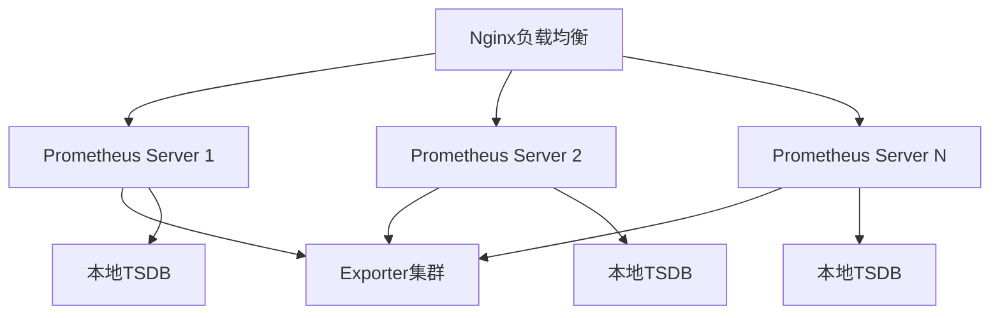

**方案特点**：
- 多个Prometheus Server独立采集
- Nginx做反向代理和负载均衡
- 每个Server独立存储

**优点**：
- 实现基本的高可用
- 单点故障不影响其他节点

**缺点**：
- 数据不同步
- 查询结果可能不一致

### 6.2 远程存储高可用方案（推荐）

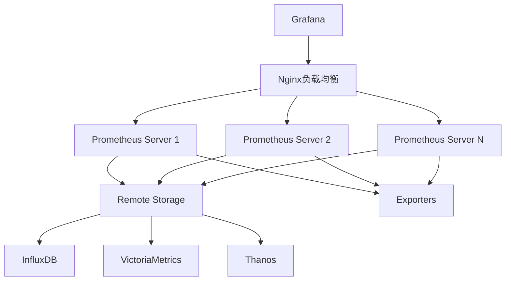

**方案特点**：
- 分离计算和存储
- 使用Remote Read/Write接口
- 统一的远程存储后端

**推荐存储方案**：
1. **InfluxDB**：成熟稳定，查询性能好
2. **VictoriaMetrics**：高性能、低成本
3. **Thanos**：长期存储、全局查询

**配置示例**：
```yaml
# prometheus.yml
remote_write:
  - url: "http://influxdb:8086/api/v1/prom/write?db=prometheus"

remote_read:
  - url: "http://influxdb:8086/api/v1/prom/read?db=prometheus"
```

**优点**：
- 数据统一存储，查询结果一致
- 任一Prometheus Server宕机不影响数据
- 支持数据长期保存（默认TSDB仅保存15天）

### 6.3 联邦集群架构（大规模场景）

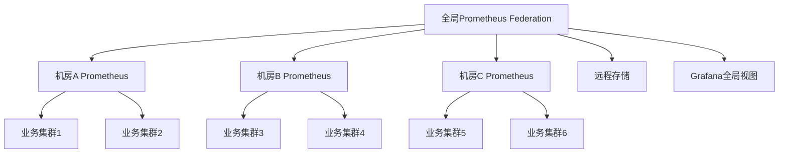

**适用场景**：
- 多机房、多集群
- 监控指标数量巨大
- 需要全局视图和局部视图

**配置示例**：
```yaml
# 全局Prometheus配置
scrape_configs:
  - job_name: 'federate'
    scrape_interval: 15s
    honor_labels: true
    metrics_path: '/federate'
    params:
      'match[]':
        - '{job="prometheus"}'
        - '{__name__=~"job:.*"}'
    static_configs:
      - targets:
        - 'prometheus-dc1:9090'
        - 'prometheus-dc2:9090'
        - 'prometheus-dc3:9090'
```

### 6.4 Alertmanager高可用

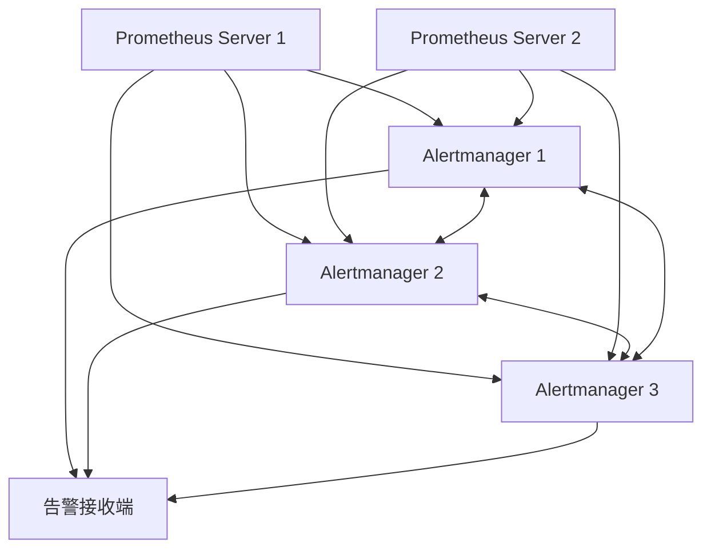

**实现方式**：基于Gossip协议实现高可用
- Alertmanager之间互相通信
- 告警去重和分组
- 避免重复告警

**配置示例**：
```yaml
# alertmanager.yml
route:
  group_by: ['alertname', 'cluster', 'service']
  group_wait: 10s
  group_interval: 10s
  repeat_interval: 12h
  receiver: 'default-receiver'

receivers:
  - name: 'default-receiver'
    webhook_configs:
      - url: 'http://alertmanager-webhook/alert'

# 集群配置
cluster:
  listen-address: "0.0.0.0:9094"
  peers:
    - "alertmanager-1:9094"
    - "alertmanager-2:9094"
    - "alertmanager-3:9094"
```

### 6.5 Kubernetes环境高可用

在Kubernetes环境中，高可用更简单：
- 利用Deployment的副本机制
- Service实现负载均衡
- PVC实现数据持久化
- Prometheus Operator简化部署

## 七、服务发现机制

### 7.1 服务发现方式对比

传统监控（如Zabbix）：
- 需要安装Agent
- 手动配置Server IP
- 静态配置，扩展性差

Prometheus服务发现：
- 无需Agent（仅需Exporter）
- 动态发现监控目标
- 自动适配云原生环境

### 7.2 支持的服务发现类型

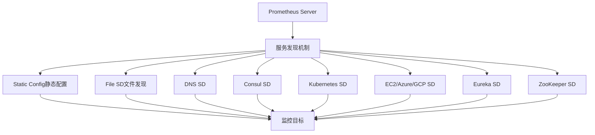

#### 1. 静态配置（Static Config）
```yaml
scrape_configs:
  - job_name: 'node'
    static_configs:
      - targets: ['localhost:9100', '10.0.0.1:9100']
```

#### 2. 文件发现（File SD）
```yaml
scrape_configs:
  - job_name: 'file'
    file_sd_configs:
      - files:
        - '/etc/prometheus/targets/*.json'
        refresh_interval: 5m
```

**targets.json示例**：
```json
[
  {
    "targets": ["10.0.0.1:9100", "10.0.0.2:9100"],
    "labels": {
      "env": "production",
      "region": "cn-north"
    }
  }
]
```

#### 3. Consul服务发现（推荐）

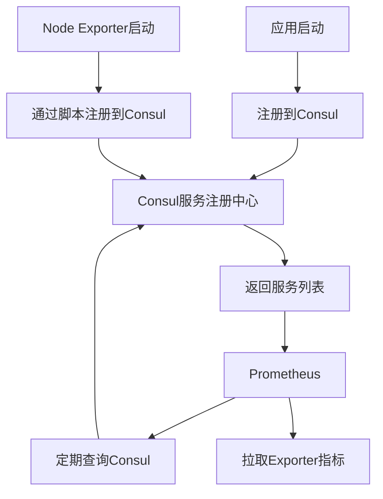

**Prometheus配置**：
```yaml
scrape_configs:
  - job_name: 'consul'
    consul_sd_configs:
      - server: 'consul.example.com:8500'
        services: ['node-exporter', 'mysql-exporter']
```

**Consul注册脚本示例**：
```bash
#!/bin/bash
# 注册Node Exporter到Consul
curl -X PUT -d '{
  "id": "node-exporter-'$(hostname)'",
  "name": "node-exporter",
  "address": "'$(hostname -i)'",
  "port": 9100,
  "tags": ["monitoring"],
  "check": {
    "http": "http://'$(hostname -i)':9100/metrics",
    "interval": "10s"
  }
}' http://consul:8500/v1/agent/service/register
```

**优势**：
- 自动发现新增节点
- 服务下线自动移除
- 支持健康检查
- 适合动态环境

#### 4. Kubernetes服务发现

Prometheus在K8s中支持多种发现机制：

```yaml
scrape_configs:
  # 发现K8s节点
  - job_name: 'kubernetes-nodes'
    kubernetes_sd_configs:
      - role: node
    relabel_configs:
      - action: labelmap
        regex: __meta_kubernetes_node_label_(.+)
  
  # 发现Pod
  - job_name: 'kubernetes-pods'
    kubernetes_sd_configs:
      - role: pod
    relabel_configs:
      - source_labels: [__meta_kubernetes_pod_annotation_prometheus_io_scrape]
        action: keep
        regex: true
      - source_labels: [__meta_kubernetes_pod_annotation_prometheus_io_path]
        action: replace
        target_label: __metrics_path__
        regex: (.+)
  
  # 发现Service
  - job_name: 'kubernetes-service-endpoints'
    kubernetes_sd_configs:
      - role: endpoints
```

**Pod注解示例**：
```yaml
apiVersion: v1
kind: Pod
metadata:
  annotations:
    prometheus.io/scrape: "true"
    prometheus.io/port: "8080"
    prometheus.io/path: "/actuator/prometheus"
```

### 7.3 Spring Cloud微服务发现

**Maven依赖**：
```xml
<dependency>
    <groupId>org.springframework.boot</groupId>
    <artifactId>spring-boot-starter-actuator</artifactId>
</dependency>
<dependency>
    <groupId>io.micrometer</groupId>
    <artifactId>micrometer-registry-prometheus</artifactId>
</dependency>
```

**配置**：
```yaml
management:
  endpoints:
    web:
      exposure:
        include: prometheus
```

**Prometheus配置**（静态或通过Nacos/Consul发现）：
```yaml
scrape_configs:
  - job_name: 'spring-cloud-apps'
    metrics_path: '/actuator/prometheus'
    static_configs:
      - targets: ['app1:8080', 'app2:8080']
```

## 八、告警配置实践

### 8.1 告警规则配置

**告警规则文件**（rules/alert.yml）：
```yaml
groups:
  - name: node_alerts
    interval: 30s
    rules:
      # CPU使用率告警
      - alert: HighCPUUsage
        expr: 100 - (avg by(instance) (irate(node_cpu_seconds_total{mode="idle"}[5m])) * 100) > 80
        for: 5m
        labels:
          severity: warning
        annotations:
          summary: "High CPU usage on {{ $labels.instance }}"
          description: "CPU usage is above 80% (current value: {{ $value }}%)"
      
      # 内存使用率告警
      - alert: HighMemoryUsage
        expr: (1 - (node_memory_MemAvailable_bytes / node_memory_MemTotal_bytes)) * 100 > 85
        for: 5m
        labels:
          severity: warning
        annotations:
          summary: "High memory usage on {{ $labels.instance }}"
          description: "Memory usage is above 85% (current value: {{ $value }}%)"
      
      # 磁盘空间告警
      - alert: DiskSpaceWarning
        expr: (node_filesystem_avail_bytes{fstype!~"tmpfs|fuse.lxcfs"} / node_filesystem_size_bytes) * 100 < 20
        for: 10m
        labels:
          severity: warning
        annotations:
          summary: "Disk space low on {{ $labels.instance }}"
          description: "Filesystem {{ $labels.mountpoint }} has less than 20% space left"
      
      # 磁盘空间预测
      - alert: DiskWillFillIn4Hours
        expr: predict_linear(node_filesystem_free_bytes{fstype!~"tmpfs"}[1h], 4*3600) < 0
        for: 5m
        labels:
          severity: critical
        annotations:
          summary: "Disk will be full in 4 hours"
          description: "Filesystem {{ $labels.mountpoint }} on {{ $labels.instance }} will be full in approximately 4 hours"

  - name: application_alerts
    interval: 30s
    rules:
      # 接口错误率告警
      - alert: HighErrorRate
        expr: rate(http_requests_total{status=~"5.."}[5m]) > 0.05
        for: 5m
        labels:
          severity: critical
        annotations:
          summary: "High error rate on {{ $labels.instance }}"
          description: "Error rate is above 5% (current value: {{ $value }})"
      
      # JVM内存告警
      - alert: HighJVMMemory
        expr: (jvm_memory_used_bytes{area="heap"} / jvm_memory_max_bytes{area="heap"}) * 100 > 90
        for: 5m
        labels:
          severity: warning
        annotations:
          summary: "High JVM heap memory usage"
          description: "JVM heap usage is above 90% on {{ $labels.instance }}"
```

**Prometheus主配置引入规则**：
```yaml
# prometheus.yml
rule_files:
  - '/etc/prometheus/rules/*.yml'
```

### 8.2 Alertmanager配置

```yaml
global:
  resolve_timeout: 5m

# 告警路由配置
route:
  group_by: ['alertname', 'cluster', 'service']
  group_wait: 10s          # 组内等待时间
  group_interval: 10s       # 组间隔时间
  repeat_interval: 12h      # 重复告警间隔
  receiver: 'default'
  
  # 子路由
  routes:
    - match:
        severity: critical
      receiver: 'critical-alerts'
      continue: true
    
    - match:
        severity: warning
      receiver: 'warning-alerts'

# 告警接收器
receivers:
  - name: 'default'
    webhook_configs:
      - url: 'http://localhost:5000/webhook'
  
  - name: 'critical-alerts'
    webhook_configs:
      - url: 'http://alertmanager-webhook:5000/wechat'
        send_resolved: true
  
  - name: 'warning-alerts'
    webhook_configs:
      - url: 'http://alertmanager-webhook:5000/wechat'

# 抑制规则
inhibit_rules:
  - source_match:
      severity: 'critical'
    target_match:
      severity: 'warning'
    equal: ['alertname', 'instance']
```

### 8.3 告警方式

#### 1. 企业微信告警（推荐）
- 通过Alertmanager Webhook调用企业微信API
- 支持Markdown格式消息
- 可@指定人员

#### 2. 钉钉告警
- 类似企业微信
- 通过自定义机器人Webhook

#### 3. 邮件告警
```yaml
receivers:
  - name: 'email-alert'
    email_configs:
      - to: 'ops-team@example.com'
        from: 'alertmanager@example.com'
        smarthost: 'smtp.example.com:587'
        auth_username: 'alertmanager@example.com'
        auth_password: 'password'
```

#### 4. 自定义Webhook
可以自己开发Webhook服务，实现：
- 电话告警（对接语音网关）
- 短信告警
- 工单系统集成
- ChatOps集成

**Webhook示例代码**（Python Flask）：
```python
from flask import Flask, request
import requests

app = Flask(__name__)

@app.route('/webhook', methods=['POST'])
def webhook():
    data = request.json
    
    # 解析告警信息
    for alert in data.get('alerts', []):
        alert_name = alert['labels'].get('alertname')
        instance = alert['labels'].get('instance')
        description = alert['annotations'].get('description')
        
        # 发送到企业微信
        send_to_wechat(alert_name, instance, description)
    
    return 'OK', 200

def send_to_wechat(alert_name, instance, description):
    webhook_url = 'https://qyapi.weixin.qq.com/cgi-bin/webhook/send?key=YOUR_KEY'
    message = {
        "msgtype": "markdown",
        "markdown": {
            "content": f"**告警名称**: {alert_name}\n**实例**: {instance}\n**描述**: {description}"
        }
    }
    requests.post(webhook_url, json=message)

if __name__ == '__main__':
    app.run(host='0.0.0.0', port=5000)
```

### 8.4 告警聚合与去重

**配置策略**：
- **group_by**：按告警名称、集群、服务分组
- **group_wait**：等待10秒收集同组告警
- **group_interval**：组间隔10秒发送
- **repeat_interval**：12小时重复一次未恢复的告警

**效果**：
- 避免告警风暴
- 同类告警合并发送
- 减少告警噪音

## 九、完整监控体系架构

### 9.1 综合监控架构

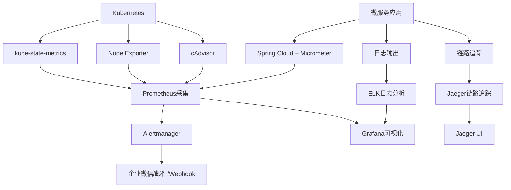

**架构说明**：
1. **指标监控**：Prometheus + Grafana
2. **日志分析**：ELK（Elasticsearch + Logstash + Kibana）
3. **链路追踪**：Jaeger
4. **告警通知**：Alertmanager + 企业微信

### 9.2 Prometheus的局限性

虽然Prometheus强大，但也有不足：

| 局限性 | 说明 | 替代方案 |
|--------|------|---------|
| **日志分析** | 不支持日志收集和分析 | ELK/EFK/Loki |
| **链路追踪** | 无法追踪微服务调用链路 | Jaeger/Zipkin/SkyWalking |
| **实时性** | 数据有延迟（默认15s抓取间隔） | 特殊场景考虑其他方案 |
| **数据保留** | TSDB默认仅保存15天 | 使用远程存储 |

### 9.3 完整技术栈推荐

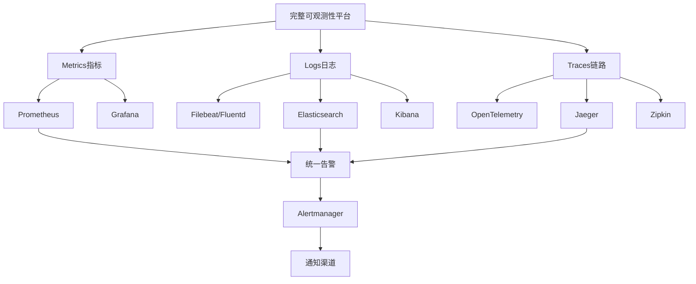

## 十、最佳实践与建议

### 10.1 监控指标规划

#### 黄金指标（Google SRE）
1. **延迟（Latency）**：请求响应时间
2. **流量（Traffic）**：系统吞吐量
3. **错误（Errors）**：错误率
4. **饱和度（Saturation）**：资源利用率

#### RED方法（微服务监控）
- **Rate**：请求速率
- **Errors**：错误数
- **Duration**：响应时间

#### USE方法（资源监控）
- **Utilization**：利用率
- **Saturation**：饱和度
- **Errors**：错误数

### 10.2 性能优化建议

1. **合理设置抓取间隔**
   - 默认15秒适合大多数场景
   - 关键业务可缩短到5-10秒
   - 非核心指标可延长到30-60秒

2. **控制指标基数**
   - 避免高基数标签（如用户ID、请求ID）
   - 合理使用标签
   - 定期清理无用指标

3. **数据保留策略**
   - 本地TSDB保留7-15天
   - 远程存储保留30-90天
   - 长期归档考虑降采样

4. **查询优化**
   - 使用recording rules预计算
   - 避免大范围时间查询
   - 合理使用rate、irate等函数

### 10.3 告警设计原则

1. **可操作性**：告警必须可操作，不能是噪音
2. **及时性**：尽早发现问题
3. **准确性**：减少误报
4. **分级处理**：Critical、Warning、Info
5. **告警收敛**：避免告警风暴

### 10.4 团队协作建议

1. **开发与运维协作**
   - 开发负责埋点和业务指标
   - 运维负责基础设施监控
   - 共同定义SLO/SLI

2. **文档与规范**
   - 编写监控接入文档
   - 制定告警规范
   - 建立值班流程

3. **监控即代码**
   - 配置文件版本控制
   - 使用Jsonnet/YAML模板
   - CI/CD集成

## 十一、总结

### 11.1 核心要点回顾

1. **Prometheus是云原生时代的监控首选**
   - 云原生、容器化、微服务场景的标准选择
   - 强大的查询语言和灵活的数据模型
   - 丰富的生态和社区支持

2. **合理选择监控方案**
   - 根据业务规模和场景选择架构
   - 小规模：单机部署即可
   - 中等规模：远程存储方案
   - 大规模：联邦集群架构

3. **构建完整可观测性体系**
   - Metrics：Prometheus
   - Logs：ELK/Loki
   - Traces：Jaeger/Zipkin
   - 三者结合才是完整方案

4. **持续优化监控体系**
   - 定期review告警规则
   - 优化指标采集
   - 关注监控系统本身的性能

### 11.2 实践经验总结

**监控软件选型建议**：
- 初创团队：Prometheus + Grafana（快速上手）
- 传统环境迁移：Prometheus + Consul服务发现
- Kubernetes环境：Prometheus Operator
- 大规模场景：Prometheus + Thanos/Cortex

**避免的坑**：
1. 不要过度监控，关注核心指标
2. 告警阈值要合理，减少误报
3. 注意Prometheus的TSDB存储限制
4. 高基数标签会影响性能
5. 定期备份Prometheus配置和规则

### 11.3 延伸学习

**推荐资源**：
- Prometheus官方文档：https://prometheus.io/docs/
- Grafana Dashboard库：https://grafana.com/grafana/dashboards/
- Awesome Prometheus：https://github.com/roaldnefs/awesome-prometheus
- 《Prometheus监控实战》
- 《Google SRE工作手册》

**进阶主题**：
- Thanos长期存储方案
- VictoriaMetrics高性能方案
- Prometheus Operator深入使用
- 自定义Exporter开发
- PromQL高级查询技巧

## Q&A 常见问题

### Q1: Prometheus存储单点故障如何解决？
**A**: 使用远程存储方案，将存储抽离出来，使用InfluxDB、VictoriaMetrics等作为后端存储，并做好存储层的高可用。

### Q2: 如何实现告警聚合？
**A**: 通过Alertmanager的group_by配置实现告警分组，结合group_wait和group_interval参数控制告警发送时机，避免告警风暴。

### Q3: 能否实现电话告警？
**A**: 可以，通过自定义Webhook对接第三方语音网关API实现电话告警功能。

### Q4: Oracle数据库如何监控？
**A**: 社区有oracledb_exporter，也可以自己开发Exporter，通过SQL查询获取数据库指标。

### Q5: 容器重启后如何自动发现？
**A**: 在Kubernetes环境中，使用kubernetes_sd_configs自动发现；在传统环境中，可使用Consul服务发现，容器启动时自动注册。

### Q6: 如何监控OpenStack各个组件？
**A**: 使用官方openstack-exporter，每个OpenStack组件都有对应的Exporter，也可以根据需求自定义采集。

### Q7: Prometheus Server双副本时存储是一份还是两份？
**A**: 使用远程存储时，多个Prometheus Server写入同一个远程存储，数据是一份；如果不用远程存储，每个Server本地存储独立，数据是多份。

### Q8: 如何实现分布式监控？
**A**: 使用Prometheus联邦集群架构，对每个机房或业务做分区监控，上层再部署一个全局Prometheus聚合数据。

---

**分享者**：小罗（北方激光研究院广西分公司运维总监）  
**更多内容**：51CTO订阅专栏搜索"Prometheus"

**结语**：监控是运维的眼睛，Prometheus为云原生时代的监控提供了强大而灵活的解决方案。希望这次分享能帮助大家更好地理解和使用Prometheus，构建稳定可靠的监控体系。

