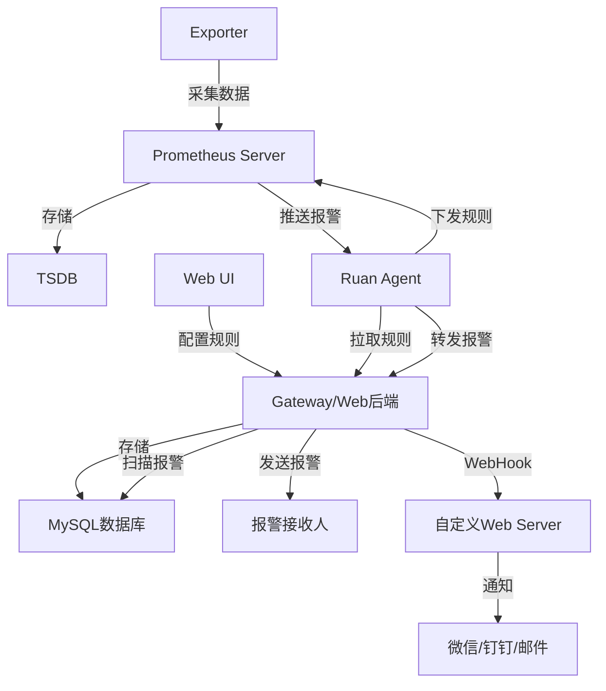
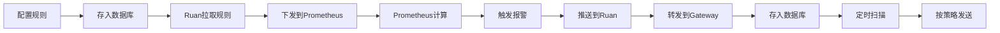
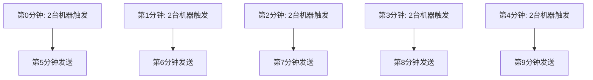
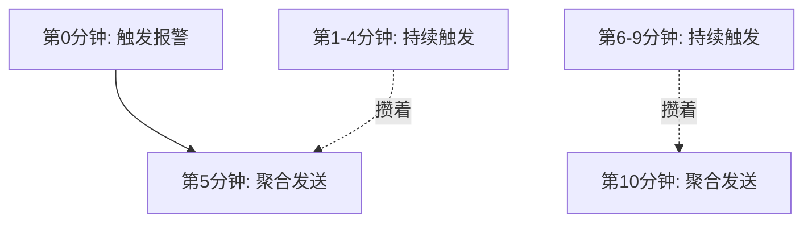
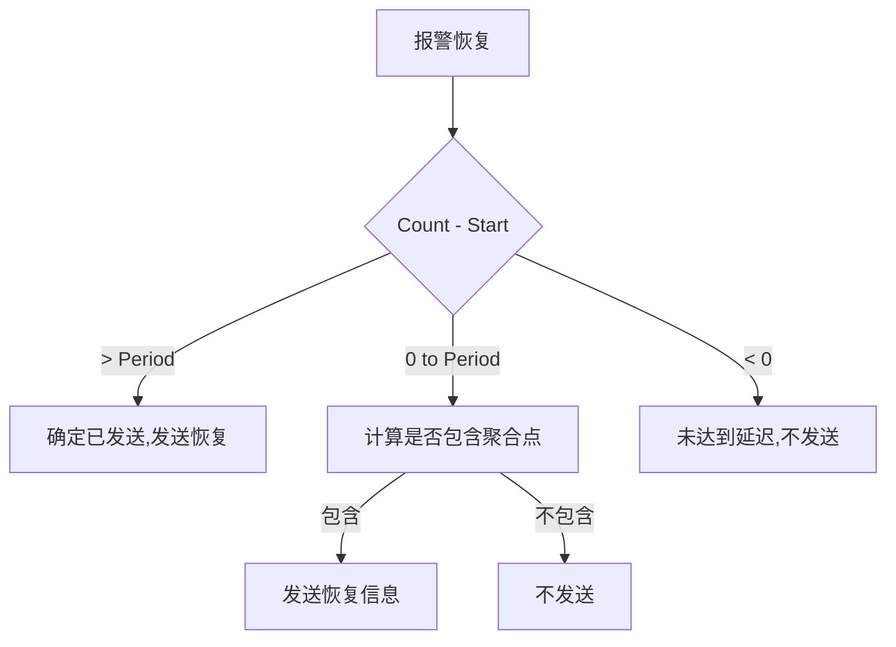
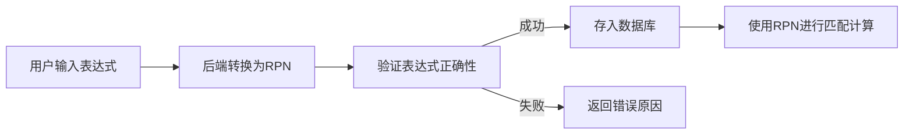

# 基于Prometheus的企业监控平台设计与实现

> 来源：未核验 · 类型：分享 · 状态：draft · 原始线索：分享人 360搜索事业部


## 分享概述

本次分享介绍360搜索事业部基于Prometheus开发的监控平台——哆啦A梦(Doraemon)，该平台已在GitHub上开源，主要解决了Alert Manager在实际使用中的痛点问题，提供了更加灵活和易用的报警管理功能。

## 一、团队介绍与背景

### 1.1 团队简介

360搜索事业部云平台团队致力于将容器技术在生产环境中落地，已开源企业级K8s管理平台，并经历了生产环境大规模应用的考验。

### 1.2 技术背景

- **容器时代标配**：Prometheus作为被广泛应用的监控系统，是容器时代的标配
- **应用场景**：解决了应用指标监控问题，采用联邦架构部署在容器上
- **监控范围**：容器监控指标和物理机指标都通过Prometheus采集
- **存在问题**：Alert Manager报警模块存在使用不够灵活的问题

## 二、Alert Manager的痛点分析

### 2.1 主要痛点

1. **无法动态加载监控规则**
   - 需要修改配置文件
   - 需要重启Prometheus才能生效
   - 管理维护成本高

2. **配置关联复杂**
   - 需要修改Prometheus配置文件
   - 需要将Alert Manager与Prometheus相关联
   - 配置分散，不便于统一管理

3. **功能缺失**
   - 无法实现报警升级
   - 不支持获取动态值班组
   - 标签匹配不能动态配置

4. **用户体验差**
   - 配置不够方便灵活
   - 需要频繁修改配置文件
   - 学习成本高，不够直观

### 2.2 报警升级功能说明

**报警升级**：当报警触发后，如果在指定时间(如60分钟)内未被确认或处理，报警会自动发送给更高级别的人员(如领导)。

## 三、哆啦A梦架构设计

### 3.1 整体架构



### 3.2 核心组件说明

#### 3.2.1 左侧：原生Prometheus部分
- **Prometheus Server**：部署在多台机器或容器上
- **Exporter**：采集监控数据
- **TSDB**：存储时序数据

#### 3.2.2 右侧：哆啦A梦部分

**Web UI**
- 用户配置报警规则的界面
- 创建报警策略和维护组
- 进行报警确认
- 查看历史报警

**Gateway (Web后端/报警网关)**
- 接收Web UI配置，存储到数据库
- 每分钟扫描数据库
- 根据报警策略发送报警
- 支持多种报警方式

**Ruan Agent**
- 从Web后端周期性拉取报警规则
- 通过Prometheus的Query API下发规则
- 接收Prometheus推送的报警
- 转发报警到Web后端

### 3.3 工作流程



## 四、核心概念与术语

### 4.1 基础概念

| 术语 | 说明 |
|------|------|
| **报警规则(Rule)** | 与Prometheus中的alerting rule概念相同，定义监控指标和阈值 |
| **数据源** | Prometheus Server的Query API的URL地址 |
| **报警接收组** | 由多个报警接收人组成的组 |
| **值班组** | 动态从接口获取成员列表的组，成员会随时间变化 |
| **报警延迟** | 报警触发后延迟一段时间才发送，用于实现报警升级 |
| **报警周期** | 报警发送的周期，如每5分钟发送一次 |
| **报警计划** | 由多条报警策略组成的集合 |
| **报警策略** | 包含报警接收组、值班组、延迟、周期等的完整配置 |
| **报警方式** | 短信、电话、蓝信、WebHook等 |
| **报警确认** | 暂停报警一段时间的操作 |
| **维护组** | 屏蔽特定时间段特定机器报警的配置 |

### 4.2 报警策略组成

一条完整的报警策略包含：
- 报警时间段
- 报警延迟
- 报警周期
- 报警接收人/用户组/值班组
- Filter表达式
- 报警方式

## 五、核心功能详解

### 5.1 报警计划与策略

#### 5.1.1 创建报警计划

报警计划只需填写：
- **名称**：计划的名称
- **描述**：计划说明

#### 5.1.2 配置报警策略

**示例：三级报警策略**

| 策略编号 | 报警延迟 | 报警周期 | 接收人 | Filter表达式 | 报警方式 |
|---------|---------|---------|--------|-------------|---------|
| 策略1 | 0分钟 | 5分钟 | OP1 | idc == "北京" | 短信 |
| 策略2 | 0分钟 | 5分钟 | OP2 | idc != "北京" | 短信 |
| 策略3 | 60分钟 | 10分钟 | Leader | (留空，匹配所有) | WebHook |

**策略说明**：
- 策略1和策略2：立即发送，按地域分配给不同运维人员
- 策略3：超过60分钟未确认，自动升级给Leader
- 实现了报警分级和自动升级功能

### 5.2 Filter表达式

#### 5.2.1 支持的运算符

| 运算符 | 说明 | 示例 |
|-------|------|------|
| `==` | 等于 | `name == "搜索"` |
| `!=` | 不等于 | `host != "h1"` |
| `&&` | 与 | `name == "搜索" && idc == "北京"` |
| `\|\|` | 或 | `idc == "北京" \|\| idc == "上海"` |
| `()` | 优先级 | `(idc == "北京" \|\| idc == "上海") && name == "搜索"` |

#### 5.2.2 表达式校验

系统会自动校验表达式的合法性：
- 括号是否成对出现
- 运算符是否连续出现
- 表达式语法是否正确
- 只有合法的表达式才能存入数据库

#### 5.2.3 示例

**需求**：只发送来自北京或上海机房，并且服务名称是"搜索"的报警

**Filter表达式**：
```
name == "搜索" && (idc == "北京" || idc == "上海")
```

### 5.3 数据源管理

创建数据源非常简单：
1. 填写Prometheus名称(自定义)
2. 填写Query API的URL地址
3. 保存即可

### 5.4 报警规则配置

#### 5.4.1 规则参数

| 参数 | Prometheus对应 | 说明 |
|------|---------------|------|
| 监控指标 | expr | PromQL查询表达式 |
| 阈值 | - | 报警触发阈值 |
| 持续时间 | for | 防抖动，持续满足条件才报警 |
| 标题 | summary | 支持变量，如`{{$labels.instance}}` |
| 描述 | description | 支持变量模板 |
| 数据源 | - | 关联的Prometheus Server |
| 策略 | - | 关联的报警计划 |

#### 5.4.2 变量支持

标题和描述支持Go模板语法：
```
实例 {{$labels.instance}} CPU使用率超过阈值
```

## 六、报警聚合机制

### 6.1 为什么需要报警聚合

#### 6.1.1 不聚合的问题

**场景**：报警延迟5分钟，报警周期5分钟



**问题**：
- 第5-9分钟每分钟都会发送报警
- 报警信息分散，难以快速识别问题
- 大面积报警时，各个规则的报警交织在一起

#### 6.1.2 聚合后的效果



**优势**：
- 按周期聚合发送，清晰明了
- 减少报警噪音
- 自动过滤抖动(在两个聚合点之间触发又恢复的报警不会发送)

### 6.2 聚合实现原理

#### 6.2.1 核心思想

为每个Rule维护一个计数器(RuleCount)：
- 每分钟检查Rule下是否有报警触发
- 如果有报警触发，RuleCount加1
- 当RuleCount达到周期的整数倍时，聚合发送所有满足条件的报警
- 如果Rule下没有满足延迟条件的报警，RuleCount归零

#### 6.2.2 数据结构

```go
// 全局Map
map[RuleID + Start] = RuleCount

// RuleID: 规则ID
// Start: 报警延迟
// RuleCount: 计数器
```

#### 6.2.3 内存优化

**问题**：如果保存所有RuleCount(包括为0的)，会导致内存持续增长

**解决方案**：
- 每分钟只保存RuleCount不为0的记录
- 使用新的Map替换旧Map，释放内存
- 只记录当前有报警的Rule的计数

### 6.3 报警恢复机制

#### 6.3.1 核心问题

当报警恢复时，如何确定应该发送给哪些用户？

**场景**：
- 同一条报警可能发送给多个用户
- 不同用户的策略(延迟、周期)不同
- 只能发送给已经收到报警的用户
- 不能发送给未收到报警的用户

#### 6.3.2 解决方案

不在数据库中保存"已发送给谁"的信息，而是通过计数器关系计算：

**三种判断情况**：

1. **Count - Start > Period**
   - 确定包含了至少一个聚合发送点
   - 报警恢复信息必须发送

2. **0 < Count - Start ≤ Period**
   - 需要通过公式判断是否包含聚合点
   - 如果包含，发送恢复信息
   - 如果不包含，不发送

3. **Count - Start < 0**
   - 未达到报警延迟
   - 报警未发送，恢复信息也不发送



#### 6.3.3 边界条件处理

由于报警触发和扫描是异步的，需要考虑特殊情况：
- RuleCount和Count不总是同时加1
- 需要处理边界条件，确保恢复信息正确发送
- 极端情况下修改策略可能影响报警，但影响可接受

## 七、标签匹配算法

### 7.1 问题定义

**目标**：
- 校验Filter表达式的正确性
- 快速判断报警标签是否匹配表达式
- 表达式计算时间复杂度尽可能低

**示例表达式**：
```
host != "h1" && (idc == "shyc" || idc == "zzc") && port == "80"
```

### 7.2 逆波兰表达式(RPN)

#### 7.2.1 什么是逆波兰表达式

**传统表达式**：`a + b`  
**逆波兰表达式**：`a b +`

**优势**：
- 去除括号和优先级
- 使用栈计算，时间复杂度O(n)
- 便于计算机处理

#### 7.2.2 计算示例

**示例1**：`a + b`


**示例2**：`(a + b) * (c + d)`

逆波兰表达式：`a b + c d + *`

```
1. a入栈                    [a]
2. b入栈                    [a, b]
3. 遇到+, 弹出b和a, 计算    [a+b]
4. c入栈                    [a+b, c]
5. d入栈                    [a+b, c, d]
6. 遇到+, 弹出d和c, 计算    [a+b, c+d]
7. 遇到*, 弹出两个值, 计算  [(a+b)*(c+d)]
```

### 7.3 应用到标签匹配

#### 7.3.1 转换流程



#### 7.3.2 表达式树

原表达式：
```
host != "h1" && (idc == "shyc" || idc == "zzc") && port == "80"
```

表达式树：
```mermaid
graph TD
    A[&&] --> B[&&]
    A --> C[port==80]
    B --> D[host!=h1]
    B --> E[||]
    E --> F[idc==shyc]
    E --> G[idc==zzc]
```

逆波兰表达式(后序遍历)：
```
host != h1  idc == shyc  idc == zzc  ||  &&  port == 80  ||
```

#### 7.3.3 计算过程

每个叶子节点(标签比较)结果只有两种：`true` 或 `false`

```
1. 判断 host != "h1"  → true/false → 入栈
2. 判断 idc == "shyc" → true/false → 入栈  
3. 判断 idc == "zzc"  → true/false → 入栈
4. 遇到 ||  → 弹出两个值 → 或运算 → 结果入栈
5. 遇到 &&  → 弹出两个值 → 与运算 → 结果入栈
6. 判断 port == "80"  → true/false → 入栈
7. 遇到 ||  → 弹出两个值 → 或运算 → 得到最终结果
```

### 7.4 性能分析

- **存储**：数据库中存储RPN表达式
- **展示**：前端显示原始表达式(用户友好)
- **计算**：使用RPN进行匹配(高效)
- **复杂度**：匹配计算O(n)，转换O(n log n)
- **优化空间**：转换过程可优化到O(n)，但不是性能瓶颈

## 八、报警确认机制

### 8.1 两种确认方式

#### 8.1.1 方式一：从报警规则维度确认

**适用场景**：针对特定规则的报警进行确认

**特点**：
- 点击报警信息中的确认链接
- 只能看到符合当前策略的报警
- 自动过滤不满足条件的报警

**示例**：
```
报警策略：
- 报警延迟: 5分钟
- Filter: idc == "北京" || idc == "上海"

确认页面只显示：
- 报警时长 > 5分钟
- 且 idc == "北京" 或 "上海"
的报警
```

#### 8.1.2 方式二：从Label维度确认

**适用场景**：某台机器宕机，触发多条规则的报警

**优势**：
- 可以按机器维度批量确认
- 提高确认效率
- 一次确认该机器的所有报警

**操作方式**：
```
选择标签: instance == "10.0.0.1"
→ 批量确认该IP的所有报警
→ 直到故障恢复
```

### 8.2 确认功能说明

- **暂停时长**：可填写暂停报警的时长
- **自动恢复**：确认时间到期后自动恢复报警
- **故障恢复**：故障解除后报警自动解除

## 九、维护组功能

### 9.1 功能说明

**使用场景**：
- 大批量机器需要维护
- 需要升级操作
- 特定时间段屏蔽报警

### 9.2 配置参数

| 参数 | 说明 |
|------|------|
| **维护时间段** | 每天屏蔽报警的时间段 |
| **维护月份** | 屏蔽报警的月份 |
| **维护日期** | 在维护月份的哪些天屏蔽 |
| **有效期** | 维护规则的整体有效期 |
| **机器列表** | instance标签(去掉端口号)，通常是IP地址 |

### 9.3 工作原理

- 以instance标签(不含端口号)作为机器唯一标识
- 在指定时间段内，匹配的机器产生的报警不会发送
- 维护期结束或有效期过期，规则自动失效

## 十、报警历史查询

### 10.1 功能特点

- 查看所有历史报警信息
- 包括未发送的报警(抖动报警)
- 支持多维度筛选
- 便于问题排查和分析

### 10.2 抖动报警

**定义**：在两个聚合点之间触发又自动恢复的报警

**特点**：
- 不会发送给用户
- 但会记录在历史中
- 可通过历史页面查询

## 十一、快速部署

### 11.1 Docker Compose部署

**适用场景**：本地快速测试和体验

**部署步骤**：

```bash
# 1. 下载代码
git clone https://github.com/...

# 2. 进入部署目录
cd deployment

# 3. 修改配置
# 编辑 config.js.local
# 将 localhost 替换为本机物理网卡IP或域名
# 端口号保持不变

# 4. 启动服务
docker-compose up

# 5. 访问
http://本机IP:32000
```

**注意**：
- 不提供高可用机制
- 仅用于快速体验和测试

### 11.2 Kubernetes部署

**适用场景**：生产环境

**部署步骤**：

```bash
# 1. 配置MySQL信息
# 编辑 deployment.yaml
# 通过 ConfigMap 配置数据库连接信息

# 2. 配置访问地址
# 将 doraemon_ui 中的 node_ip 替换为K8s集群任意节点IP

# 3. 部署
kubectl apply -f deployment.yaml

# 4. 访问
# 通过 NodePort 方式访问K8s集群任意节点
```

**特点**：
- 支持高可用
- 使用NodePort暴露服务
- 适合生产环境使用

## 十二、报警方式

### 12.1 内部用户(360)

- **短信**：文本消息通知
- **电话**：语音告警
- **蓝信**：企业内部IM工具

### 12.2 外部用户(开源版本)

**WebHook方式**：
- 通过HTTP POST请求发送报警
- 用户需自行实现Web Server
- 可对接微信、钉钉、邮件等

**实现示例**：
```
哆啦A梦 → HTTP POST → 自定义Web Server → 微信/钉钉/邮件
```

## 十三、技术亮点总结

### 13.1 动态规则管理

✅ **解决问题**：无需修改配置文件和重启服务  
✅ **实现方式**：通过Query API动态下发规则  
✅ **用户体验**：Web界面直观配置，即时生效

### 13.2 报警聚合

✅ **解决问题**：减少报警噪音，提高可读性  
✅ **实现方式**：Rule级别计数器+周期聚合  
✅ **附加价值**：自动过滤抖动报警

### 13.3 报警升级

✅ **解决问题**：重要报警及时升级到更高级别  
✅ **实现方式**：报警计划+多级策略+延迟机制  
✅ **应用场景**：未及时处理的报警自动上报

### 13.4 灵活的标签匹配

✅ **解决问题**：精确控制报警接收对象  
✅ **实现方式**：逆波兰表达式+栈计算  
✅ **性能优势**：O(n)时间复杂度，高效匹配

### 13.5 多维度确认

✅ **解决问题**：快速处理大量报警  
✅ **实现方式**：规则维度+标签维度  
✅ **使用场景**：单机故障批量确认

### 13.6 报警恢复智能判断

✅ **解决问题**：准确发送恢复通知  
✅ **实现方式**：基于计数器关系计算  
✅ **数据优化**：不额外存储发送记录

## 十四、适用场景

### 14.1 推荐使用

- ✅ 需要频繁调整报警规则的场景
- ✅ 有报警分级和升级需求
- ✅ 多团队协作，需要灵活分配报警
- ✅ 容器化环境，大规模集群监控
- ✅ 需要动态值班组支持
- ✅ 有维护窗口管理需求

### 14.2 特别适合

- 🎯 互联网公司运维团队
- 🎯 容器化云平台监控
- 🎯 需要精细化报警管理的场景
- 🎯 多机房、多集群监控统一管理

## 十五、未来规划

### 15.1 功能增强

- **报警收敛**：支持报警依赖关系，只发送根因报警
- **静默管理**：机房级别的报警静默
- **报警分组**：更灵活的报警分组策略
- **可选聚合**：支持关键报警不聚合的配置

### 15.2 性能优化

- **表达式解析**：从O(n log n)优化到O(n)
- **内存优化**：持续优化内存使用
- **并发处理**：提升大规模报警处理能力

## 十六、常见问题FAQ

### Q1: 能否设置不聚合？
**A**: 当前版本所有报警都会聚合，延迟最多不超过一个报警周期。未来版本可能支持配置不聚合的选项。

### Q2: 如何处理不同阈值的机器？
**A**: 目前需要配置多条规则，关联到不同的Prometheus数据源。未来计划支持同一规则不同Label不同阈值。

### Q3: 是否支持故障自愈？
**A**: 哆啦A梦本身不支持，360内部在服务树系统中集成了故障自愈功能，可以在报警触发时执行预定义脚本。

### Q4: 一台主机100个指标，N台机器需要配置N×100次吗？
**A**: 不需要。一条Rule可以关联多台机器的同一指标，只需配置100条规则即可覆盖N台机器。

### Q5: 支持哪些报警收敛场景？
**A**: 当前支持主机级别的静默(维护组)。未来计划支持Rule级别的依赖关系，实现根因报警收敛。

## 十七、开源信息

- **项目名称**：Doraemon(哆啦A梦)
- **开源平台**：GitHub
- **开源组织**：360搜索事业部
- **技术栈**：Go + Vue.js
- **数据库**：MySQL
- **监控系统**：Prometheus
- **部署方式**：Docker Compose / Kubernetes

## 总结

哆啦A梦监控平台通过创新的架构设计和算法实现，完美解决了Alert Manager在实际使用中的痛点问题。其核心优势在于：

1. **易用性**：Web界面配置，无需修改配置文件
2. **灵活性**：动态规则、多级策略、灵活的标签匹配
3. **实用性**：报警聚合、自动升级、多维确认
4. **高效性**：逆波兰表达式、优化的内存管理
5. **可扩展**：支持大规模集群、联邦架构

该平台已在360搜索事业部大规模生产环境中稳定运行，经受了实战检验，是企业级Prometheus监控的优秀实践案例。

---

**分享人**：360搜索事业部  
**技术领域**：监控系统、SRE、云平台  
**受众群体**：SRE工程师、运维工程师、稳定性保障工程师

