# Prometheus和Zabbix的对比选型

> 来源：未核验 · 类型：分享 · 状态：draft


## 分享概述

本次技术分享由DBA Plus当打之年系列主题活动组织,邀请了两位资深专家围绕监控软件Zabbix和Prometheus展开深入讨论。

**分享嘉宾:**
- **蔡祥华** - 招商银行技术经理,Zabbix认证专家,Zabbix中文手册官方译者
- **刘宇** - 甜橙金融基础技术架构师,数据库运维和研发专家

---

## 第一部分: Zabbix全栈自动化监控实践

### 一、监控需求分析

#### 1.1 监控的广度

监控对象从下至上包括:
- 硬件存储
- 操作系统(Windows/Linux/虚拟化/容器)
- 中间件
- 数据库
- 应用

**面临的挑战:**
- 系统异构性
- 平台多样性
- 监控遗漏风险
- 监控重复和告警风暴

#### 1.2 监控的深度

监控分为四个层次:

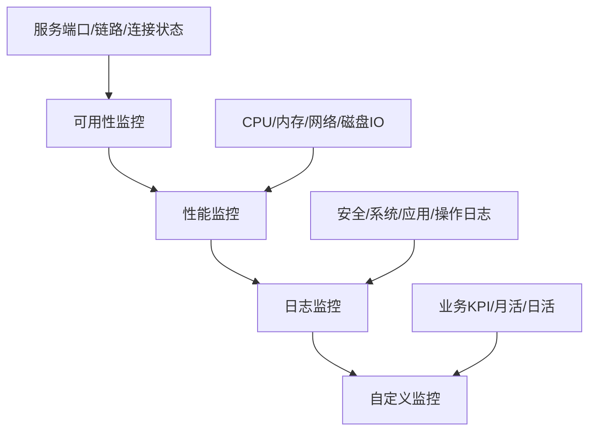

**1. 可用性监控**
- 服务端口、链路和连接状态
- 布尔型判断(UP/DOWN)
- 最基础的监控层面

**2. 性能监控**
- CPU占用率、内存使用
- 网络带宽、磁盘IO
- 用户连接数等指标
- 影响用户体验和业务感知

**3. 日志监控**
- 基于事件或异常的监控
- 弥补时间点监控的盲区
- 包括安全、系统、应用、操作日志

**4. 自定义监控**
- 面向业务的KPI监控
- 需要二次开发能力
- 满足个性化业务需求

### 二、监控平台选型原则

#### 2.1 选型考虑因素

**核心原则:** 脱离实际应用场景讨论平台没有任何意义

**关键考量:**
- 监控环境的复杂度
- 监控对象的数量和类型
- 深度与广度的平衡
- 维护成本和人员投入

#### 2.2 Zabbix vs Prometheus对比

| 对比维度 | Zabbix | Prometheus |
|---------|--------|------------|
| **适用场景** | 异构环境、全栈监控 | 容器化、微服务环境 |
| **监控广度** | 硬件到应用全覆盖 | 主要关注应用和容器 |
| **UI界面** | 功能完善的Web UI | 需配合Grafana使用 |
| **配置方式** | 90%通过UI完成 | 主要依赖配置文件 |
| **数据采集** | 统一Agent | 多种Exporter |
| **学习成本** | 相对较低 | 相对较高 |

### 三、Zabbix架构设计

#### 3.1 分布式架构

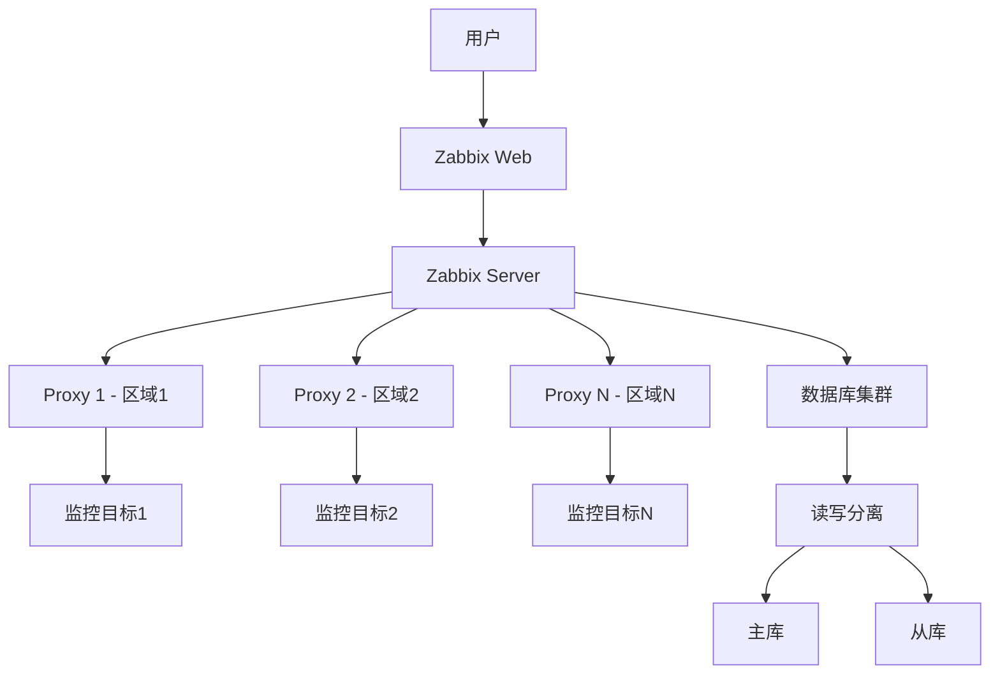

**架构特点:**
- **Zabbix Server**: 核心大脑,负责数据处理和告警
- **Zabbix Proxy**: 区域代理,减少网络依赖
- **数据库集群**: 支持读写分离和高可用
- **Zabbix Web**: 用户访问入口

**高可用保障:**
- Server端可实现高可用
- 数据库通过MyCat/OneProxy实现高可用
- Proxy分布式部署,避免单点故障

#### 3.2 核心性能指标

**NVPS (New Values Per Second):**
- 每秒新增值的数量
- 比监控节点数更准确的性能指标
- 业界案例: 40万+监控点(经过优化的极限场景)
- 实践建议: 3000-6000 NVPS为合理范围

### 四、自动化监控实践

#### 4.1 自动发现机制

**网络发现配置示例:**
```yaml
发现规则:
  - 网段: 192.168.x.x/24
  - 扫描端口: 1433 (SQL Server)
  - 自动关联: SQL Server模板
  
  - 网段: 10.123.x.x/16  
  - 扫描端口: 3306 (MySQL)
  - 自动关联: MySQL模板
```

**低级别发现(LLD):**
- 自动识别磁盘、网卡等资源
- 动态创建监控项
- 减少手动配置工作量

#### 4.2 组织架构设计

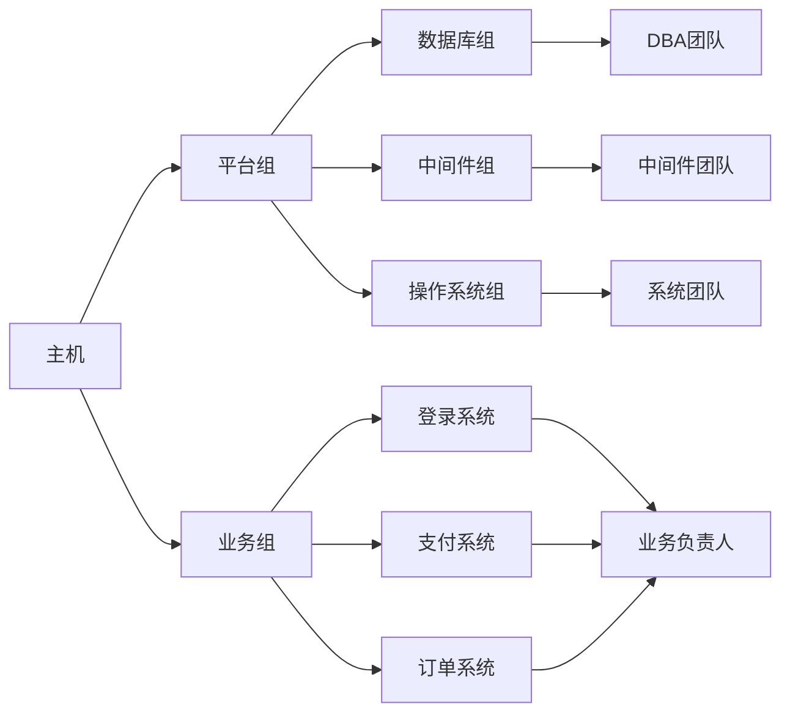

**平台组 (Platform Group):**
- 按技术栈划分(数据库/中间件/OS)
- 对应技术团队
- 接收平台级告警

**业务组 (Service Group):**
- 按业务系统划分
- 包含该业务的所有相关主机
- 业务负责人接收告警
- 快速定位业务影响范围

#### 4.3 告警分级策略

| 级别 | 说明 | 处理时效 | 通知方式 | 示例 |
|-----|------|---------|---------|------|
| **Disaster** | 灾难级 | 立即处理 | 短信+大屏 | 磁盘空间<10% |
| **Warning** | 警告级 | 尽快处理(非立即) | 短信+邮件 | 磁盘空间<20% |
| **Information** | 信息级 | 可延后处理 | 邮件 | 性能指标异常 |

**告警短信优化示例:**
```
[状态] 问题/恢复
[内容] 磁盘空间小于20%
[主机] 192.168.1.100
[当前值] 17.98%
[联系人] 张三 13800138000
[描述] 请立即清理磁盘或扩容
```

包含六要素: 状态、问题、主机、当前值、联系人、处理建议

### 五、DevOps集成实践

#### 5.1 CI/CD流程集成

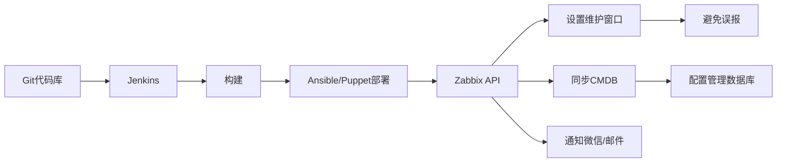

**集成要点:**
- 部署前通过API设置维护周期
- 避免服务重启期间的误报
- 自动同步主机信息到CMDB
- 支持微信、邮件等多渠道通知

#### 5.2 硬件监控实践

**IPMI协议监控:**
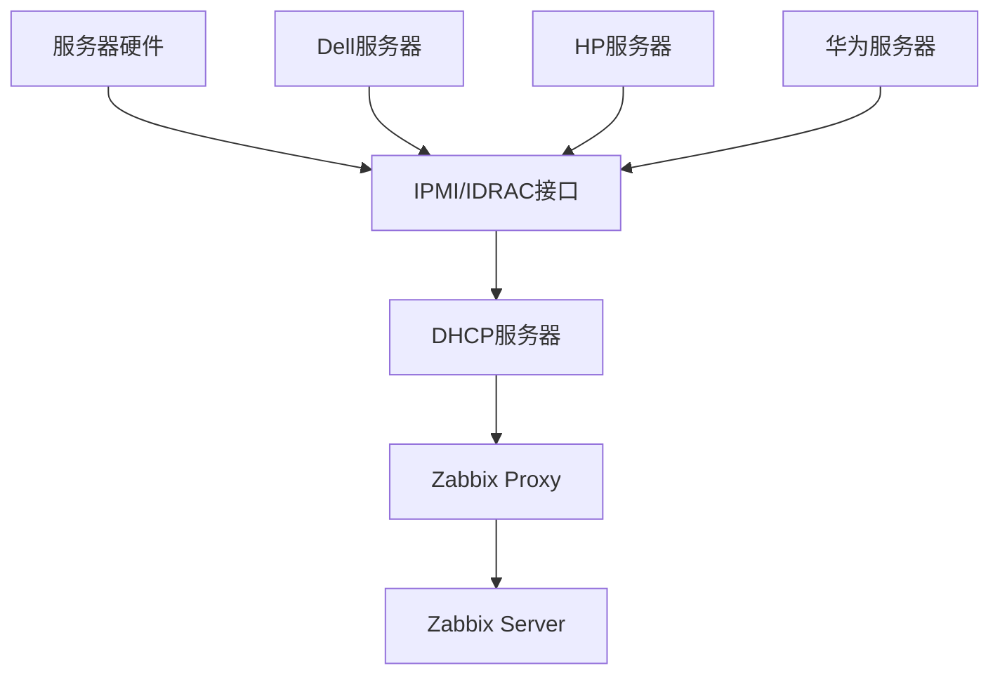

**优势:**
- 统一标准协议(IPMI/SNMP)
- 无需登录机房巡检
- 自动发现硬件故障
- 支持多厂商设备

### 六、Zabbix使用建议

#### 6.1 适用场景

**推荐使用Zabbix:**
- ✅ 异构环境(Windows + Linux + 虚拟化)
- ✅ 需要硬件监控
- ✅ 全栈监控需求
- ✅ 中小企业
- ✅ 希望降低学习成本

**不推荐使用Zabbix:**
- ❌ 纯容器化环境
- ❌ 纯Docker/Kubernetes环境

#### 6.2 核心优势总结

1. **开源免费**: 无社区版/商业版区分
2. **分布式高可用**: 原生支持分布式架构
3. **自动发现**: LLD + 网络发现
4. **全栈覆盖**: 覆盖80%+监控需求
5. **可定制**: 开放API,易于集成
6. **低学习成本**: 中文社区活跃,资源丰富

---

## 第二部分: Prometheus高可用监控实践

### 一、Prometheus架构介绍

#### 1.1 核心架构

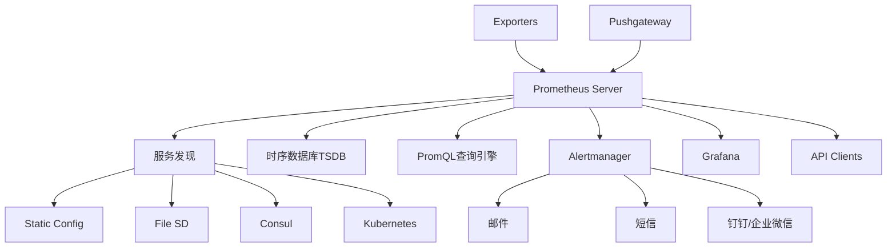

**核心组件:**
- **Prometheus Server**: 数据采集、存储、查询
- **Exporters**: 数据暴露组件(Node Exporter、Redis Exporter等)
- **Pushgateway**: 支持主动推送指标
- **Alertmanager**: 独立的告警组件
- **服务发现**: 支持多种动态发现方式

#### 1.2 工作原理

**数据采集流程:**
1. Prometheus定时从目标拉取指标数据(Pull模式)
2. 目标通过HTTP接口暴露metrics
3. 支持从配置文件、Consul、Kubernetes等发现目标
4. 数据先缓存到内存队列
5. 批量写入本地TSDB
6. 可选写入远程存储

**特点:**
- 纯数值时间序列监控
- 强调可靠性而非100%数据准确性
- 适合服务器和微服务监控
- 多维数据模型
- 灵活的查询语言PromQL

### 二、高可用架构设计

#### 2.1 自研HA方案

**基于etcd的高可用实现:**

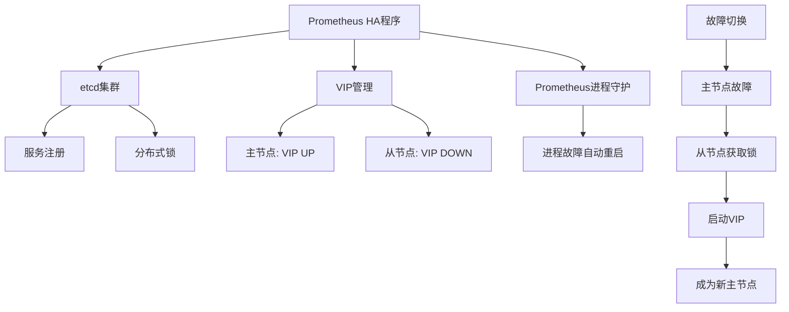

**配置示例:**
```yaml
etcd_endpoints: ["http://etcd1:2379", "http://etcd2:2379"]
network_interface: "eth0"
vip_address: "192.168.1.100"
vip_device_number: 1
service_path: "/prometheus/leader"
prometheus_command: "/usr/local/bin/prometheus --config.file=/etc/prometheus/prometheus.yml"
```

**HA程序功能:**
1. **进程故障**: 守护进程自动拉起Prometheus
2. **HA程序故障**: 自动下线VIP,从节点接管
3. **主机宕机**: 从节点获取锁并接管服务

**官方HA方案:**
- 部署两台相同配置的Prometheus
- 监控相同目标
- 通过外部负载均衡实现高可用
- 数据可能存在短暂不一致

#### 2.2 远程存储方案

**为什么需要远程存储:**
- Prometheus本地存储默认保留15天
- 不适合长期数据存储
- 功能相对简单
- 大规模环境下本地存储压力大

**InfluxDB作为远程存储:**

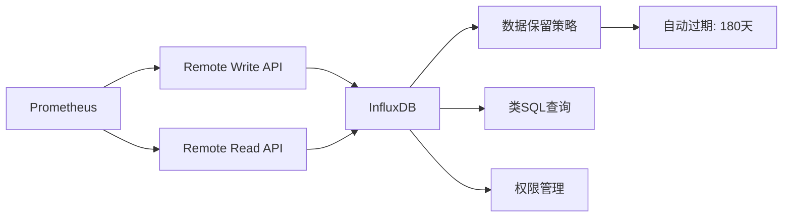

**选择InfluxDB的原因:**
1. 开源免费,开箱即用
2. 自带HTTP管理界面
3. 内置数据过期功能
4. 类SQL查询语法
5. 支持精细权限控制

**Prometheus配置:**
```yaml
remote_write:
  - url: "http://influxdb:8086/api/v1/prom/write?db=prometheus"
    basic_auth:
      username: "admin"
      password: "password"

remote_read:
  - url: "http://influxdb:8086/api/v1/prom/read?db=prometheus"
    basic_auth:
      username: "admin"
      password: "password"
```

#### 2.3 性能优化

**远程写入性能调优:**

```yaml
remote_write:
  - url: "http://influxdb:8086/api/v1/prom/write?db=prometheus"
    queue_config:
      max_shards: 1000              # 最大并发分片数
      max_samples_per_send: 100     # 每次发送最大样本数
      batch_send_deadline: 5s       # 批量发送截止时间
      min_shards: 1                 # 最小分片数
      max_shards_per_second: 100    # 每秒最大分片数
```

**TPS计算公式:**
```
TPS = (max_shards × max_samples_per_send) / (发送耗时/1000)
示例: (1000 × 100) / (100ms/1000) = 1,000,000 samples/s
```

### 三、Redis多实例监控实践

#### 3.1 Exporter介绍

**社区Exporter生态:**
- 统一命名规范: `{service}_exporter`
- 丰富的官方和社区Exporter
- 常见数据库全覆盖: MySQL、Redis、MongoDB、PostgreSQL等

**Redis Exporter特点:**
- 社区成熟度高(1400+ stars)
- 支持多实例监控
- 支持Redis Cluster
- 丰富的监控指标

#### 3.2 静态配置方式

**多实例监控配置:**
```yaml
scrape_configs:
  - job_name: 'redis_exporter_targets'
    static_configs:
      - targets:
        - redis://10.0.1.11:6379
        - redis://10.0.1.11:6380
        - redis://10.0.1.12:6379
        - redis://10.0.1.12:6380
    metrics_path: /scrape
    relabel_configs:
      - source_labels: [__address__]
        target_label: __param_target
      - source_labels: [__param_target]
        target_label: instance
      - target_label: __address__
        replacement: 127.0.0.1:9121  # Redis Exporter地址
```

**启动Exporter:**
```bash
redis_exporter --redis.addr="" \
  --web.listen-address=:9121
```

**重载配置方式:**
1. `kill -HUP <pid>` - 发送信号
2. `curl -X POST http://localhost:9090/-/reload` - API方式(需启用`--web.enable-lifecycle`)

#### 3.3 文件服务发现

**File SD配置:**
```yaml
scrape_configs:
  - job_name: 'redis_exporter_targets'
    file_sd_configs:
      - files:
        - '/etc/prometheus/targets/*.json'
        refresh_interval: 30s
```

**目标文件示例 (redis_targets.json):**
```json
[
  {
    "targets": [
      "redis://10.0.1.11:6379",
      "redis://10.0.1.11:6380"
    ],
    "labels": {
      "env": "production",
      "cluster": "redis-cluster-01"
    }
  }
]
```

**优势:**
- 无需重启Prometheus
- 自动检测文件变化
- 支持通配符匹配

#### 3.4 Consul服务发现(推荐)

**架构流程:**

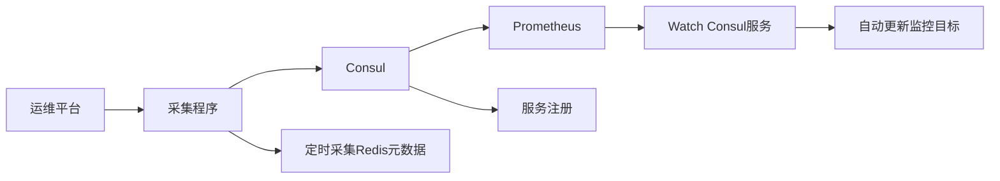

**Consul注册示例:**
```bash
curl -X PUT http://consul:8500/v1/agent/service/register -d '{
  "ID": "redis-10.0.1.11-6379",
  "Name": "redis-exporter-targets",
  "Address": "10.0.1.11:6379",
  "Tags": ["cluster:redis-prod", "role:master"],
  "Check": {
    "TCP": "10.0.1.11:6379",
    "Interval": "10s"
  }
}'
```

**Prometheus配置:**
```yaml
scrape_configs:
  - job_name: 'redis_exporter_targets'
    scrape_interval: 5s
    consul_sd_configs:
      - server: 'consul:8500'
        services: ['redis-exporter-targets']
    
    relabel_configs:
      # 过滤掉Consul自身服务
      - source_labels: [__meta_consul_service]
        regex: consul
        action: drop
      
      # 提取Consul tags中的信息
      - source_labels: [__meta_consul_tags]
        regex: '.*,cluster:([^,]+),.*'
        target_label: cluster
        replacement: '$1'
      
      # 设置监控目标地址
      - source_labels: [__meta_consul_service_address, __meta_consul_service_port]
        regex: '(.+):(.+)'
        target_label: __address__
        replacement: '127.0.0.1:9121'
      
      # 设置Redis实例地址参数
      - source_labels: [__meta_consul_service_address, __meta_consul_service_port]
        regex: '(.+):(.+)'
        target_label: __param_target
        replacement: 'redis://$1:$2'
```

**Relabel配置详解:**
- `__meta_consul_*`: Consul提供的元数据标签
- `source_labels`: 源标签
- `target_label`: 目标标签
- `regex`: 正则表达式匹配
- `replacement`: 替换规则
- `action`: 操作类型(keep/drop/replace等)

**优势:**
1. 完全自动化,无需手动配置
2. 易于与自动化平台集成
3. 支持动态扩缩容
4. 统一的服务注册中心

#### 3.5 Redis监控指标

**核心监控指标:**

| 类别 | 指标 | 说明 |
|-----|------|------|
| **性能** | QPS | 每秒查询数 |
| | CPU使用率 | Redis进程CPU占用 |
| | 慢查询数量 | 慢查询累计数 |
| **连接** | 连接数 | 当前客户端连接数 |
| | 连接拒绝数 | 达到maxclients后的拒绝数 |
| **内存** | 内存使用率 | used_memory / maxmemory |
| | 内存碎片率 | mem_fragmentation_ratio |
| **键值** | Key总数 | 所有DB的key数量 |
| | 过期Key数 | expired_keys |
| | 驱逐Key数 | evicted_keys |
| **命中率** | 缓存命中率 | hits / (hits + misses) |
| **持久化** | RDB/AOF状态 | 持久化健康状态 |
| **复制** | 主从延迟 | master_repl_offset差值 |

**Grafana展示:**
- 按cluster标签分组
- 单屏展示集群所有实例
- 支持多维度筛选
- 实时性能曲线

### 四、Grafana整合实践

#### 4.1 整合Zabbix和Prometheus

**应用场景:**
- 避免登录多个监控系统
- 统一数据展示界面
- 提升问题追踪效率
- 适合大型活动保障

**架构设计:**

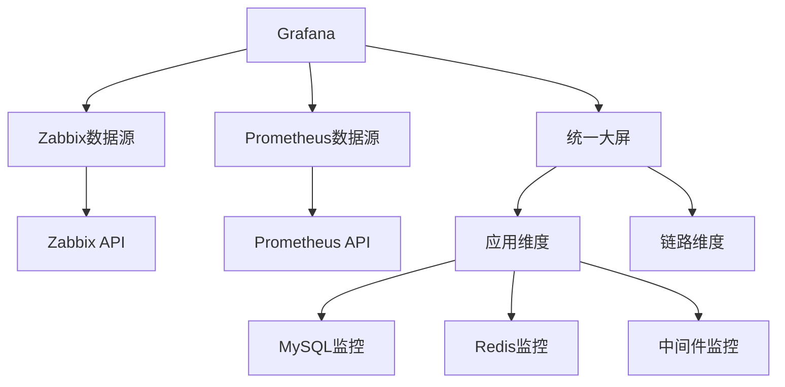

#### 4.2 Zabbix插件配置

**安装Zabbix插件:**
```bash
# 在线安装
grafana-cli plugins install alexanderzobnin-zabbix-app

# 离线安装
unzip alexanderzobnin-zabbix-app.zip -d /var/lib/grafana/plugins/

# 重启Grafana
systemctl restart grafana-server
```

**配置数据源:**
```json
{
  "type": "alexanderzobnin-zabbix-datasource",
  "url": "http://zabbix-server/api_jsonrpc.php",
  "access": "proxy",
  "basicAuth": false,
  "jsonData": {
    "username": "grafana",
    "trends": true,
    "trendsFrom": "7d",
    "trendsRange": "4d"
  },
  "secureJsonData": {
    "password": "password"
  }
}
```

**推荐使用API方式:**
- ✅ 版本兼容性好
- ✅ 不受数据库结构变更影响
- ✅ 官方推荐方式
- ❌ 避免直连数据库

#### 4.3 图表配置实践

**Zabbix查询配置:**
```
Group: [选择主机组]
Host: [选择主机]
Application: [选择应用]
Item: [选择监控项]
```

**支持变量:**
- 使用`$variable`语法
- 支持正则表达式匹配
- 可监控多个主机

**Prometheus查询配置:**
```promql
# Redis QPS
rate(redis_commands_processed_total{cluster="$cluster"}[5m])

# MySQL连接数
mysql_global_status_threads_connected{instance=~"$instance"}

# 应用响应时间
histogram_quantile(0.95, 
  rate(http_request_duration_seconds_bucket{app="$app"}[5m])
)
```

#### 4.4 大屏设计实践

**应用维度大屏:**
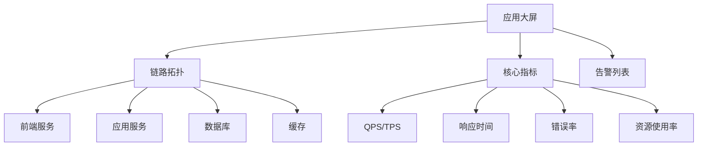

**设计要点:**
1. **应用视角**: 以业务系统为维度
2. **全链路展示**: 前端→应用→数据库→缓存
3. **实时性**: 5-10秒刷新间隔
4. **告警集成**: 实时显示告警状态
5. **多数据源**: 整合Zabbix和Prometheus数据

**大型活动保障实践:**
- 提前梳理活动链路
- 按应用维度组织监控
- 开发和运维共同关注
- 快速定位性能瓶颈

---

## 第三部分: 选型建议与最佳实践

### 一、选型决策树

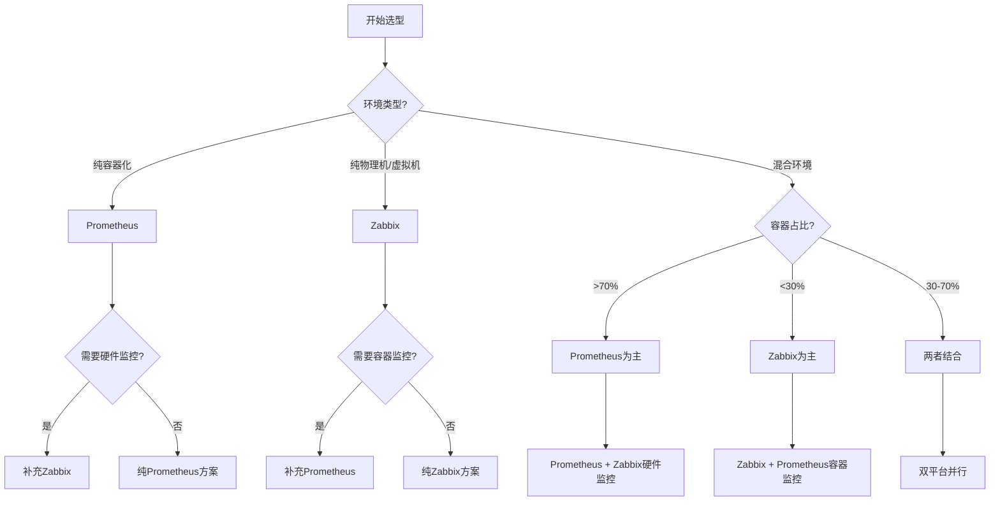

### 二、适用场景对比

#### 2.1 Zabbix适用场景

**强烈推荐:**
- ✅ 异构环境(Windows + Linux + 虚拟化)
- ✅ 需要硬件监控(服务器、存储、网络设备)
- ✅ 全栈监控需求(从硬件到应用)
- ✅ 中小企业(监控对象<5000)
- ✅ 希望快速上手,降低学习成本
- ✅ 需要丰富的UI和报表功能
- ✅ 传统IT架构

**不推荐:**
- ❌ 纯容器化环境
- ❌ 纯Kubernetes环境
- ❌ 微服务架构为主

#### 2.2 Prometheus适用场景

**强烈推荐:**
- ✅ 容器化环境(Docker/Kubernetes)
- ✅ 微服务架构
- ✅ 云原生应用
- ✅ 需要灵活的多维查询
- ✅ 服务级监控
- ✅ 动态环境(频繁扩缩容)

**不推荐:**
- ❌ 需要硬件监控
- ❌ 需要复杂的UI配置
- ❌ 要求100%数据准确性
- ❌ 传统物理机环境为主

#### 2.3 组合使用场景

**推荐组合方案:**

| 监控对象 | 推荐工具 | 原因 |
|---------|---------|------|
| 物理服务器 | Zabbix | IPMI/SNMP支持好 |
| 虚拟机 | Zabbix | Agent成熟稳定 |
| 操作系统 | Zabbix/Prometheus | 都支持,看整体架构 |
| 容器 | Prometheus | 原生支持,生态丰富 |
| Kubernetes | Prometheus | 官方推荐 |
| 数据库 | 两者都可 | Prometheus更灵活 |
| 中间件 | 两者都可 | 看具体中间件 |
| 应用 | Prometheus | 自定义指标方便 |
| 网络设备 | Zabbix | SNMP支持完善 |

### 三、核心问题解答

#### 3.1 规模和性能

**Q: 支持多大规模的监控?**

**Zabbix:**
- 单实例: 5000-10000台主机
- 关键指标: NVPS(每秒新增值)
- 实践案例: 40万+监控点(极限优化)
- 建议范围: 3000-6000 NVPS
- 扩展方式: Proxy分布式 + 数据库优化

**Prometheus:**
- 单实例: 百万级指标/秒
- 关键指标: 样本数/秒
- 扩展方式: 联邦集群 + 功能分片
- 建议: 按服务类型拆分多个实例

**高可用方案:**
- Zabbix: 数据库HA + Server HA(5.x+原生支持)
- Prometheus: 双实例 + 远程存储 + Thanos/Cortex

#### 3.2 存储方案

**Q: 如何解决长期存储问题?**

**Zabbix方案:**
1. **TSDB支持** (4.2+)
   - 原生时序数据库支持
   - 性能优于MySQL
   
2. **数据分层**
   - History: 原始数据(如30天)
   - Trends: 聚合数据(如180天)
   - 自动归档机制

3. **数据库优化**
   - 分库分表
   - SSD存储
   - 读写分离

**Prometheus方案:**
1. **本地存储**
   - 默认15天
   - 最多建议30天
   
2. **远程存储**
   - InfluxDB(推荐)
   - VictoriaMetrics
   - Thanos
   - M3DB
   - Elasticsearch

3. **数据采样**
   - Recording Rules预聚合
   - 降低存储压力

#### 3.3 告警管理

**Q: 如何避免告警风暴和误报?**

**误报处理原则:**
> "不存在误报,只有配置不当"

**最佳实践:**

1. **规则优化**
   - 准确的阈值设置
   - 合理的触发条件
   - 充分的测试验证

2. **模板化管理**
   - 统一监控模板
   - 减少配置差异
   - 便于维护和审计

3. **告警分级**
   ```
   Disaster  → 立即处理 → 短信
   Warning   → 尽快处理 → 短信+邮件  
   Info      → 可延后   → 邮件
   ```

**告警风暴抑制:**

**Zabbix方式:**
- 依赖项配置(Dependencies)
- 维护周期(Maintenance)
- 告警升级(Escalations)

**Prometheus方式:**
```yaml
# Alertmanager配置
route:
  group_by: ['alertname', 'cluster']
  group_wait: 30s
  group_interval: 5m
  repeat_interval: 12h

inhibit_rules:
  - source_match:
      severity: 'critical'
    target_match:
      severity: 'warning'
    equal: ['instance']
```

**统一告警平台:**
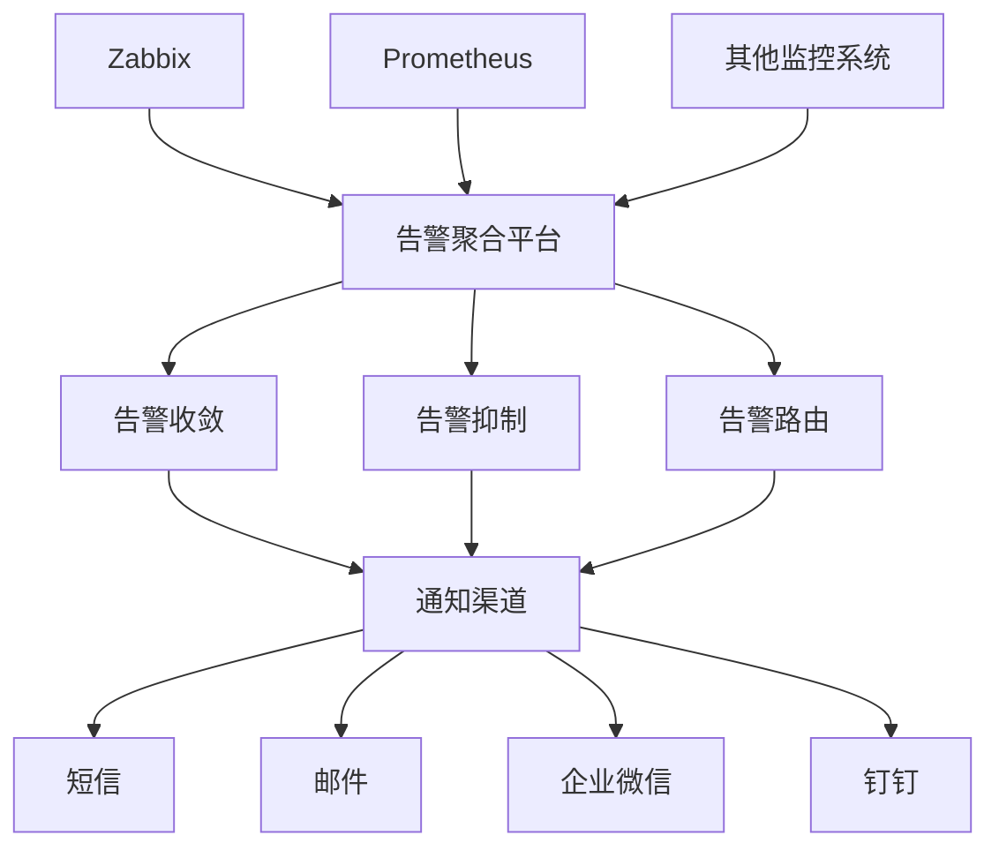

#### 3.4 自动化运维

**Q: 如何实现自动发现和自动治愈?**

**自动发现对比:**

| 功能 | Zabbix | Prometheus |
|-----|--------|------------|
| 网络发现 | ✅ 原生支持 | ❌ 需第三方 |
| LLD | ✅ 强大 | ⚠️ 有限 |
| 静态配置 | ✅ | ✅ |
| 文件发现 | ✅ | ✅ |
| Consul | ✅ | ✅ |
| Kubernetes | ⚠️ 插件 | ✅ 原生 |
| 云平台 | ⚠️ 插件 | ✅ 原生 |

**自动治愈实践:**

**能做的:**
- ✅ 清理日志文件
- ✅ 重启僵死进程
- ✅ 释放缓存
- ✅ 扩容磁盘(云环境)
- ✅ 服务降级
- ✅ 流量切换

**需谨慎的:**
- ⚠️ 数据库主从切换
- ⚠️ 服务重启
- ⚠️ 配置变更

**不建议的:**
- ❌ 复杂的故障处理
- ❌ 涉及数据安全的操作
- ❌ 未经充分测试的操作

**实现方式:**
```yaml
# Zabbix Action
Conditions: 触发器 = "磁盘空间不足"
Operations:
  1. 执行远程命令: cleanup_logs.sh
  2. 发送通知
  3. 等待5分钟
  4. 检查是否恢复
```

**建议:**
- 依赖业务侧能力(熔断、降级、限流)
- 监控系统提供数据支持
- 自动化平台执行操作
- 充分的测试和回滚机制

#### 3.5 可观测性建设

**Q: 如何实现全链路可观测性?**

**可观测性三大支柱:**

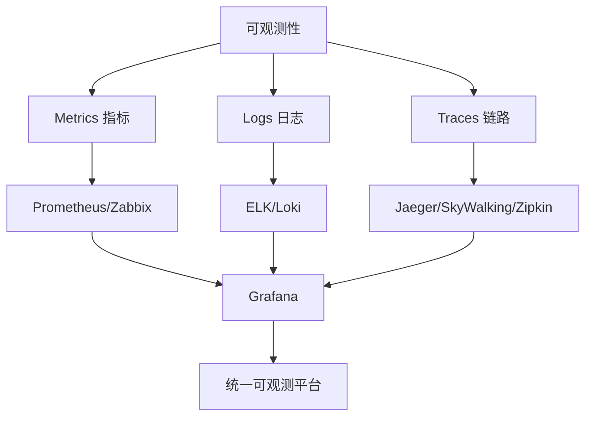

**分层监控策略:**

1. **基础设施层**
   - 工具: Zabbix/Prometheus
   - 对象: 硬件、网络、操作系统

2. **平台层**
   - 工具: Prometheus
   - 对象: Kubernetes、容器、中间件

3. **应用层**
   - 工具: APM(SkyWalking/Pinpoint)
   - 对象: 应用性能、业务指标

4. **用户体验层**
   - 工具: 前端监控(听云/博睿)
   - 对象: 页面性能、用户行为

**端到端诊断:**
- 链路追踪: 分布式Tracing
- 日志关联: TraceID串联
- 指标关联: 统一标签体系
- 拓扑展示: 服务依赖关系图

### 四、迁移和整合

#### 4.1 从Zabbix迁移到Prometheus

**迁移策略:**

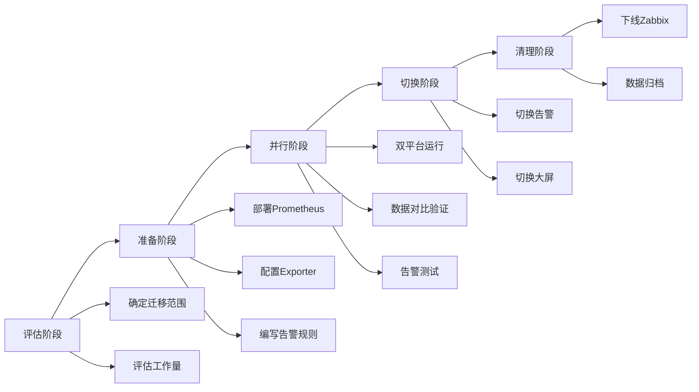

**实施步骤:**

1. **模块化迁移**
   - 按业务模块分批迁移
   - 先非核心,后核心
   - 充分测试验证

2. **并行运行**
   - 两套系统同时监控
   - 对比数据一致性
   - 验证告警准确性

3. **逐步切换**
   - 先切换数据展示
   - 再切换告警通知
   - 最后下线旧系统

**注意事项:**
- ❌ 不建议直接数据迁移(数据结构差异大)
- ✅ 通过Agent/Exporter重新采集
- ✅ 保留历史数据查询入口
- ✅ 制定回滚预案

#### 4.2 双平台整合方案

**整合架构:**

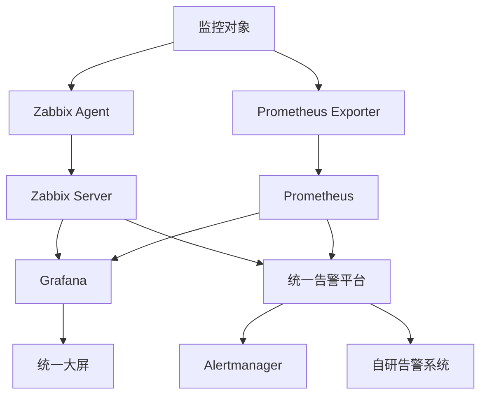

**职责划分:**

| 层面 | Zabbix | Prometheus |
|-----|--------|------------|
| 硬件 | ✅ 主要 | - |
| 网络设备 | ✅ 主要 | - |
| 操作系统 | ✅ 主要 | ⚠️ 辅助 |
| 虚拟化 | ✅ 主要 | - |
| 容器 | - | ✅ 主要 |
| Kubernetes | - | ✅ 主要 |
| 数据库 | ⚠️ 辅助 | ✅ 主要 |
| 中间件 | ⚠️ 辅助 | ✅ 主要 |
| 应用 | - | ✅ 主要 |

**数据流转:**
- Zabbix可通过Action推送数据给Prometheus
- Prometheus可通过Exporter拉取Zabbix数据
- 统一在Grafana展示
- 告警统一路由到告警平台

### 五、监控大屏设计

#### 5.1 设计原则

**核心理念:**
1. **一屏掌控**: 关键信息一屏展示
2. **分层设计**: 总览→详情→深度分析
3. **实时性**: 5-10秒刷新
4. **告警突出**: 异常状态醒目展示
5. **业务视角**: 以业务系统为维度

#### 5.2 大屏架构

**三层架构:**

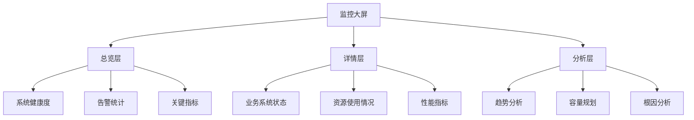

**推荐工具:**
- Grafana + Service Graph插件
- 自研大屏系统
- DataV等可视化工具

#### 5.3 业务大屏示例

**电商促销活动大屏:**

```
┌─────────────────────────────────────────────────────────┐
│  双11活动监控大屏                    2024-11-11 20:00:00 │
├─────────────────────────────────────────────────────────┤
│  系统拓扑                                                │
│  [用户] → [CDN] → [LB] → [Web] → [App] → [DB/Cache]   │
│    ✅      ✅      ✅      ⚠️      ✅      ✅            │
├─────────────────────────────────────────────────────────┤
│  核心指标                                                │
│  ┌─────────┬─────────┬─────────┬─────────┐            │
│  │ QPS     │ 响应时间 │ 错误率   │ 订单量   │            │
│  │ 50K/s   │ 120ms   │ 0.01%   │ 1.2M    │            │
│  │ ↑ 200%  │ ↑ 20%   │ → 正常  │ ↑ 300%  │            │
│  └─────────┴─────────┴─────────┴─────────┘            │
├─────────────────────────────────────────────────────────┤
│  资源使用                                                │
│  Web服务器: CPU 65% | 内存 70% | 连接数 8000            │
│  数据库:    CPU 80% | 连接数 500 | QPS 15K              │
│  Redis:     内存 60% | 命中率 99.5% | QPS 80K           │
├─────────────────────────────────────────────────────────┤
│  告警列表                                                │
│  ⚠️  [Warning] Web-03 CPU使用率超过80%                  │
│  ⚠️  [Warning] DB主库连接数接近上限                     │
└─────────────────────────────────────────────────────────┘
```

### 六、成本分析

#### 6.1 人力成本

| 项目 | Zabbix | Prometheus |
|-----|--------|------------|
| 学习成本 | ⭐⭐⭐ | ⭐⭐⭐⭐ |
| 部署成本 | ⭐⭐ | ⭐⭐⭐ |
| 配置成本 | ⭐⭐ | ⭐⭐⭐⭐ |
| 维护成本 | ⭐⭐⭐ | ⭐⭐⭐ |
| 社区支持 | ⭐⭐⭐⭐ | ⭐⭐⭐⭐⭐ |

#### 6.2 资源成本

**Zabbix:**
- Server: 4C8G起步
- Proxy: 2C4G
- Database: 取决于数据量,建议SSD
- 总体: 中等

**Prometheus:**
- Server: 4C8G起步(单实例)
- Exporter: 资源消耗极小
- 远程存储: 取决于保留时长
- 总体: 较低(无数据库依赖)

#### 6.3 综合建议

**选择Zabbix如果:**
- 团队熟悉传统监控
- 需要快速上手
- 预算有限
- 异构环境复杂

**选择Prometheus如果:**
- 容器化/云原生环境
- 团队技术能力强
- 需要灵活的查询
- 微服务架构

**两者结合如果:**
- 大型企业
- 混合架构
- 充足的人力资源
- 追求最佳实践

---

## 总结与展望

### 核心观点

1. **没有最好的工具,只有最合适的方案**
   - 具体场景具体分析
   - 不要盲目跟风
   - 考虑团队能力和资源

2. **监控的本质**
   - 数据采集与暴露
   - 数据存储与处理
   - 数据分析与应用
   - 告警与响应

3. **技术选型原则**
   - 从需求出发
   - 考虑长期演进
   - 注重可维护性
   - 控制复杂度

### 发展趋势

1. **云原生监控**
   - Kubernetes原生集成
   - 服务网格可观测性
   - eBPF技术应用

2. **AIOps智能运维**
   - 异常检测算法
   - 根因分析
   - 自动化响应
   - 容量预测

3. **统一可观测平台**
   - Metrics + Logs + Traces融合
   - 统一查询语言
   - 关联分析能力

4. **边缘监控**
   - 5G/IoT场景
   - 边缘计算监控
   - 分布式架构

### 学习建议

1. **掌握核心原理**
   - 时序数据库原理
   - 监控数据模型
   - 告警机制设计

2. **实践出真知**
   - 搭建测试环境
   - 模拟真实场景
   - 总结最佳实践

3. **关注技术演进**
   - 跟踪社区动态
   - 参与开源贡献
   - 分享经验心得

4. **建立知识体系**
   - 系统学习,不要碎片化
   - 理论结合实践
   - 持续迭代优化

---

## 附录

### 参考资源

**Zabbix:**
- 官方文档: https://www.zabbix.com/documentation
- 中文社区: https://www.zabbix.org.cn/
- GitHub: https://github.com/zabbix/zabbix

**Prometheus:**
- 官方文档: https://prometheus.io/docs/
- GitHub: https://github.com/prometheus/prometheus
- Awesome Prometheus: https://github.com/roaldnefs/awesome-prometheus

**Grafana:**
- 官方文档: https://grafana.com/docs/
- 插件市场: https://grafana.com/grafana/plugins/
- GitHub: https://github.com/grafana/grafana

### 社区交流

- DBA Plus社群
- Zabbix中文社区
- Prometheus中文社区
- CNCF Slack

---

**文档整理:** 基于DBA Plus技术分享音频记录  
**分享时间:** 2024年  
**整理时间:** 2025年10月  
**版本:** v1.0

