# 去哪儿网可观测性实践

> 来源：未核验 · 类型：分享 · 状态：draft


## 分享嘉宾

**肖老师** - 去哪儿网可观测性专家

## 一、引言

### 1.1 分享主题

本次分享围绕去哪儿网在可观测性领域的实践经验，主要包含三大核心内容：

1. **以始为终**：用故障指标来衡量监控系统的完善度
2. **秒级监控**：订单类故障的秒级发现落地实践
3. **故障定位**：针对复杂故障的分钟级定位能力建设

### 1.2 核心目标

- 降低MTTR（Mean Time To Repair）
- 提升故障发现速度
- 提高故障定位准确率

## 二、以始为终：用故障指标衡量监控系统

### 2.1 传统监控系统的度量方式

#### 2.1.1 早期关注的指标

**传统度量指标**：

- 监控指标数量
- 报警数量
- 存储容量
- 系统性能指标

**问题**：

> 这些指标都是监控系统自身的指标，但无法直接反映对业务的帮助有多大。

#### 2.1.2 反思

**核心疑问**：

- 监控系统到底对业务有什么帮助？
- 帮助的程度有多大？

### 2.2 故障数据分析

#### 2.2.1 去哪儿网故障现状分析（去年数据）

**关键发现**：

| 指标                  | 数据      | 说明                 |
| --------------------- | --------- | -------------------- |
| P1/P2故障平均发现时长 | 4分钟左右 | 核心故障发现速度     |
| 订单类故障1分钟发现率 | 仅20%     | 快速发现能力不足     |
| 故障处理超30分钟占比  | 48%       | 近半故障处理时长过长 |

**结论**：

> 故障发现和处理效率有非常大的提升空间。

### 2.3 MTTR分解与优化思路

#### 2.3.1 MTTR三阶段划分

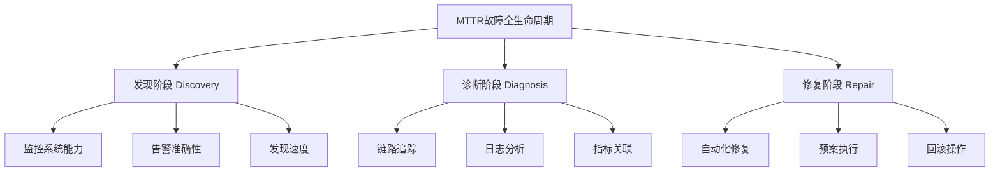

#### 2.3.2 优化策略

**针对每个阶段的优化**：

1. **发现阶段（Discovery）**

   - 建设秒级监控
   - 提升告警准确率
   - 降低发现时长
2. **诊断阶段（Diagnosis）**

   - 链路与指标关联
   - 应用健康度概览
   - 自动根因分析
3. **修复阶段（Repair）**

   - 自动化修复
   - 预案管理
   - 快速回滚

### 2.4 新目标制定

**订单类故障目标**：

> 必须做到秒级发现，而不是几分钟或分钟级才能发现。

## 三、秒级监控的落地实践

### 3.1 现有监控系统分析

#### 3.1.1 系统架构现状

**设计特点**：

- 全部采用分钟级设计
- 数据采集：分钟级
- 数据上报：分钟级
- 报警触发：分钟级

**采集模式**：

- Pull模式（类似Prometheus）

**存储方案**：

- TSDB：早期使用Graphite
- 存储引擎：Carbon + Whisper

#### 3.1.2 存在的问题

**Whisper存储问题**：

- 空间预分配策略
- 写放大问题
- 磁盘I/O特别高

**架构限制**：

- 必须使用Graphite协议
- 限制了扩展性

**改造需求**：

> 新的秒级监控要考虑与现有系统的兼容性。

### 3.2 存储方案选型

#### 3.2.1 候选方案对比

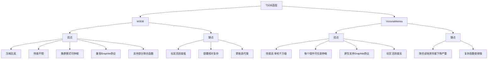

**M3DB特点**：

**优点**：

- ✅ 压缩比较高
- ✅ 性能不错
- ✅ 集群模式，可伸缩
- ✅ 兼容Graphite协议
- ✅ 支持部分聚合函数

**缺点**：

- ❌ 社区活跃度较低
- ❌ 部署相对复杂
- ❌ 更新迭代慢

**VictoriaMetrics（VM）特点**：

**优点**：

- ✅ 性能高，单机读写可达千万级指标
- ✅ 每个组件都可以任意伸缩
- ✅ 原生支持Graphite协议
- ✅ 社区活跃度高

**缺点**：

- ❌ 聚合读场景下性能下降严重
- ❌ 使用大量聚合函数时（sum、aspercent等），指标量稍大性能下降明显

#### 3.2.2 VictoriaMetrics压测数据

**测试环境**：

| 配置项 | 参数      |
| ------ | --------- |
| CPU    | 32核      |
| 内存   | 64GB      |
| 磁盘   | 3.2TB SSD |

**压测参数**：

- 写入速度：每分钟1000万指标
- 读取压力：2000 QPS

**压测结果**：

| 指标                   | 结果            |
| ---------------------- | --------------- |
| 单指标查询平均响应时长 | 100毫秒左右     |
| 磁盘使用量             | 40GB（较低）    |
| 主机负载               | 5-6（消耗较低） |

**性能瓶颈**：

- 大量聚合指标查询时性能下降严重
- 甚至会超时

### 3.3 存算分离架构设计

#### 3.3.1 架构设计思路

**核心理念**：

> 利用VM单指标查询性能好的优势，将聚合计算上移到独立的聚合层。

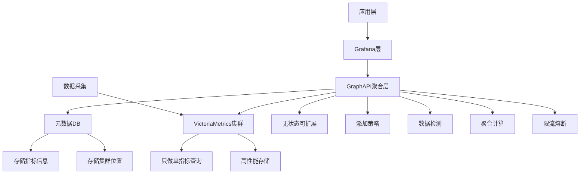

#### 3.3.2 架构优势

**GraphAPI层优势**：

- **无状态设计**：可任意扩展
- **功能丰富**：
  - 添加策略能力
  - 数据检测功能
  - 自定义聚合逻辑
  - 限流能力
  - 熔断能力

**元数据DB**：

- 存储所有指标信息
- 记录指标对应的VM集群位置
- 支持多VM集群管理

**查询流程**：

1. 用户查询请求到达GraphAPI
2. GraphAPI从元数据DB获取指标存储位置
3. 从对应VM集群拉取单指标数据
4. 在GraphAPI层进行聚合计算
5. 返回结果给用户

**核心价值**：

> 解决了VM聚合读场景的性能短板问题。

### 3.4 客户端改造

#### 3.4.1 原有客户端架构

**设计特点**：

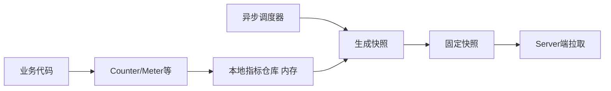

**工作原理**：

1. 业务代码使用Counter、Meter等计数
2. 数据存储在本地指标仓库（内存中）
3. 异步调度器每分钟生成一次快照
4. Server端拉取快照数据

**优点**：

- ✅ Server端多次拉取数据一致
- ✅ 支持补偿机制
- ✅ 数据准确度高

**缺点**：

- ❌ 调度器固定每分钟生成快照
- ❌ 指标仓库只支持分钟级数据存储

#### 3.4.2 改造方案对比

**方案一：参考Prometheus模式**

**设计思路**：

- Client端不做快照累加
- Server端拉取时做增量计算
- 实时从仓库拉取数据

**优点**：

- ✅ 客户端简单
- ✅ 节省内存

**缺点**：

- ❌ Server端计算压力大
- ❌ 现有采集架构改动大
- ❌ 存在数据精度问题
- ❌ 无法满足分钟级数据对齐需求

**方案二：多仓库快照模式（最终选择）**

**设计思路**：

- 客户端存储多份数据
- 分钟级数据一个仓库
- 秒级数据另一个仓库副本
- 支持不同周期的快照生成

**优点**：

- ✅ 采集架构改动小
- ✅ 没有数据精度问题
- ✅ Server端压力小
- ✅ 分钟级和秒级数据互相隔离

**缺点**：

- ❌ 部分指标多占内存

**内存优化**：

- 使用T-Digest采样算法压缩内存
- 经过测试，内存占用可接受

#### 3.4.3 快照生成机制

**分钟级快照**：

- 0秒时生成上一分钟（0-59秒）的快照
- 快照生成后数据固定不变

**秒级快照**：

- 每10秒生成一个快照
- 一分钟生成6个快照
- 每个快照累加后等同于分钟级数据

**数据精度保证**：

> 新进数据存入新仓库，不干扰已生成快照，确保数据精度。

### 3.5 Server端改造

#### 3.5.1 原有架构问题

**原架构（Python多线程模型）**：

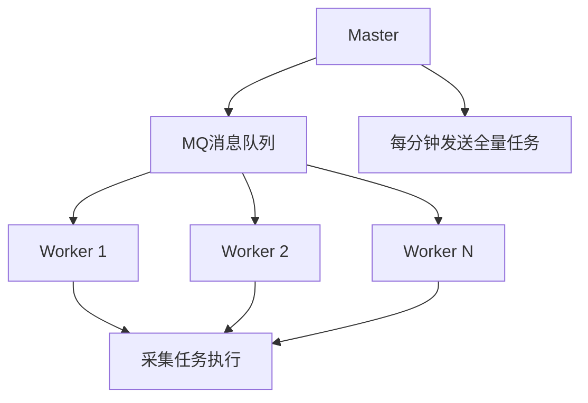

**优点**：

- ✅ Worker节点可随意扩展
- ✅ 架构简单

**缺点**：

- ❌ 任务量大时，MQ派发耗时长
- ❌ 每10秒派发十几万采集任务，超过10秒无法完成
- ❌ Python聚合计算时CPU消耗高
- ❌ 无法支持高频采集

#### 3.5.2 新架构设计（Golang实现）

**核心改进**：

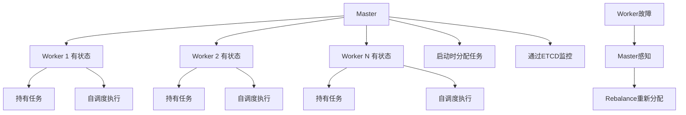

**关键特性**：

1. **去掉MQ层**

   - 不再通过MQ派发任务
   - 大幅降低派发延迟
2. **Worker有状态化**

   - Worker启动时从Master获取任务
   - 持续持有任务直到故障
   - Worker内部自调度
3. **故障处理**

   - Master通过ETCD监控Worker状态
   - Worker故障时触发Rebalance
   - 任务重新分配到其他Worker
4. **语言选择**

   - 采用Golang开发
   - 支持高并发
   - CPU消耗低
5. **双模式支持**

   - 同时支持分钟级采集
   - 同时支持秒级采集

### 3.6 最终架构

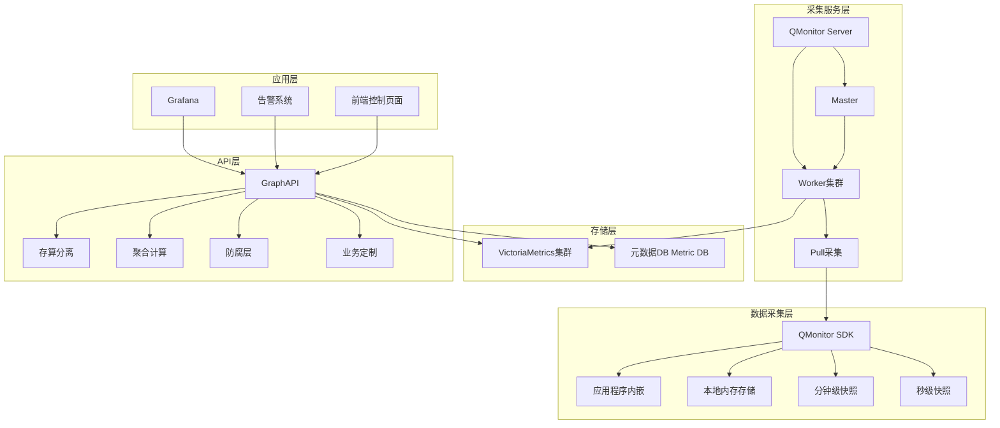

**架构说明**：

1. **数据采集层（QMonitor SDK）**

   - SDK嵌入应用程序
   - 在内存中采集数据
   - 支持分钟级和秒级快照
2. **采集服务层（QMonitor Server）**

   - Master负责任务调度
   - Worker集群执行采集
   - Pull模式拉取SDK数据
   - 数据推送到VictoriaMetrics
3. **存储层**

   - VictoriaMetrics：时序数据存储
   - 元数据DB：指标元数据和集群信息
4. **API层（GraphAPI）**

   - 存算分离
   - 聚合计算
   - 防腐层功能（数据兼容处理）
   - 支持业务定制需求
5. **应用层**

   - Grafana：可视化
   - 告警系统
   - 前端控制页面

### 3.7 成效

**订单类故障发现时长**：

- **优化前**：平均3分钟
- **优化后**：1分钟以内

**改善幅度**：

> 故障发现时长降低了66%以上

## 四、复杂故障的分钟级定位

### 4.1 微服务化带来的定位难题

#### 4.1.1 核心难点分析

**两大核心难点**：

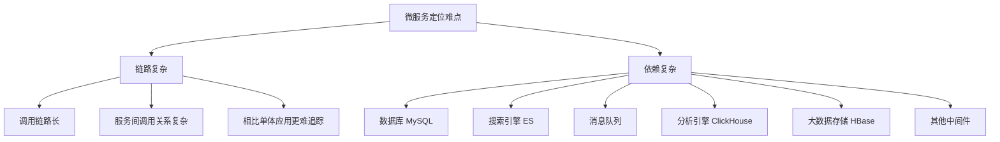

**链路复杂**：

- 调用链路比单体应用复杂得多
- 服务间调用关系错综复杂
- 难以快速定位问题节点

**依赖复杂**：

- MySQL数据库
- Elasticsearch搜索引擎
- 消息队列
- ClickHouse分析引擎
- HBase大数据存储
- 各种中间件

**定位复杂度**：

> 在微服务架构下，故障定位的复杂度主要聚焦在链路复杂和依赖复杂两个维度。

### 4.2 链路与指标关联

#### 4.2.1 问题场景

**传统方式的困境**：

1. **指标报警后查找Trace**

   - 指标报警（metric告警）
   - 在一分钟或几分钟内查找Trace
   - 如果应用QPS高，会捞出大量Trace
2. **Trace过多的干扰**

   - 例如：3个入口（A、B、C）产生3条Trace
   - 只有A这条Trace经过报警指标
   - B和C的Trace不经过报警指标
   - 拿B和C的Trace去定位是错误方向

**核心问题**：

> 无法确定哪些Trace真正与报警指标相关，导致大量干扰信息。

#### 4.2.2 解决方案：指标与Trace关联

**实现方式**：

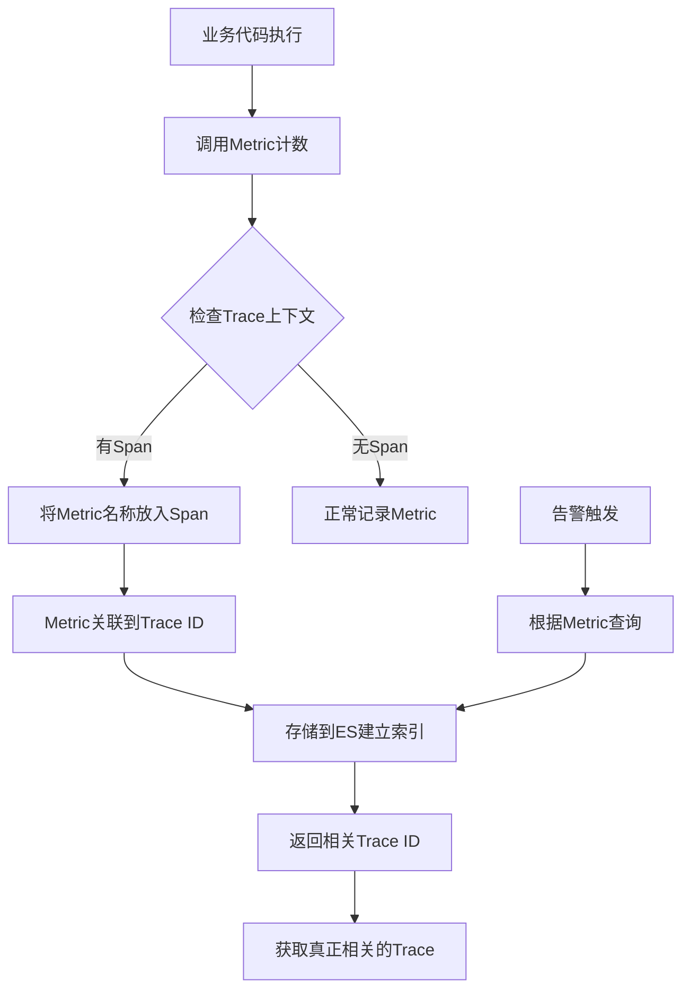

**关联逻辑**：

1. **打点时关联**

   - QMonitor在打点时检查当前是否有Trace上下文
   - 如果有Span，将Metric名称放入Span数据中
   - Metric通过Span关联到Trace ID
2. **数据结构**

   - Trace ID 串联多个Span
   - Metric与Span关联
   - Metric间接关联到Trace ID
3. **查询流程**

   - 指标发生告警
   - 根据指标名称查询
   - 返回所有相关的Trace ID
   - 这些Trace都是真正经过该指标的流量

**核心价值**：

> 精准定位与告警指标相关的Trace，大幅提升定位效率。

#### 4.2.3 功能展示

**告警面板功能**：

1. **查看QTrace按钮**

   - 告警发生时点击
   - 自动捞出关联的Trace ID
   - 展示相关Trace列表
2. **链路分析**

   - 自动进行应用异常探测
   - 标识哪些应用正常、哪些异常
   - 探测维度：
     - 异常日志
     - 异常告警
     - 事件（发布、回滚等）
     - 依赖资源状态（DB、ES、Redis等）
     - 容器运行时环境
     - JVM运行时环境
3. **辅助定位**

   - 采集所有异常信息
   - 展示在界面上
   - 辅助开发快速定位问题

### 4.3 应用概览

#### 4.3.1 设计理念

**核心目标**：

> 让开发快速感知应用是否健康，聚合最核心的指标和状态形成概览。

**应用维度 vs 链路维度**：

- 链路维度：追踪调用链路
- 应用维度：聚合应用健康度

#### 4.3.2 功能模块

**入口请求列表**：

| 字段         | 说明                       |
| ------------ | -------------------------- |
| 服务接口     | 提供的服务（Dubbo、API等） |
| 平均QPS      | 每秒请求数                 |
| 异常率       | 错误比例                   |
| 平均响应时长 | 平均耗时                   |
| P98响应时长  | 98分位耗时                 |

**出口请求列表**：

| 字段         | 说明                 |
| ------------ | -------------------- |
| 目标应用     | 下游服务的App Code   |
| 请求接口     | 调用的接口           |
| 平均QPS      | 每秒请求数           |
| 异常率       | 请求外部服务的错误率 |
| 平均响应时长 | 平均耗时             |

**依赖组件状态**：

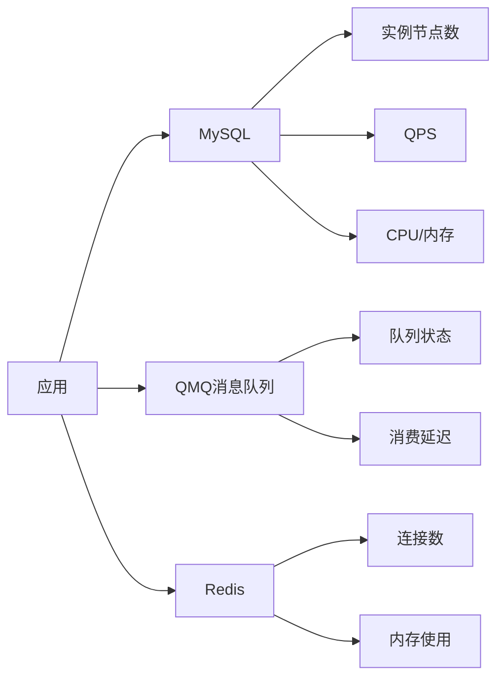

**自动识别依赖**：

- 自动列出依赖的MySQL、Redis等
- 显示各组件状态
- 点击查看详情可查看：
  - MySQL：实例数、QPS、CPU/内存
  - Redis：连接数、内存、命中率
  - 其他中间件状态

**异常日志**：

- 展示异常日志
- 环比分析
- 标识新增异常
- 标识异常增长

**JVM状态（Java应用）**：

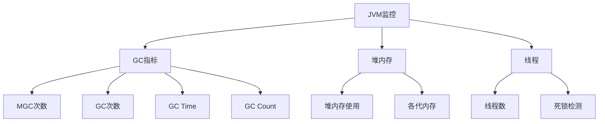

**机器级别（运行时状态）**：

- 机器列表
- 每台机器的CPU使用率
- 内存使用率
- 磁盘使用率
- 磁盘I/O

#### 4.3.3 核心价值

**一眼看出应用健康度**：

> 开发人员一眼就能了解应用运行状态是否正常，快速判断是否有问题。

**详细信息钻取**：

- 点击组件可查看更详细信息
- 例如MySQL：可以看到Slow Query、Update/Delete次数、影响行数等
- 例如线程：可以看到ProcessList、正在执行的查询线程数

### 4.4 自动分析平台

#### 4.4.1 自动分析逻辑

**分析流程**：

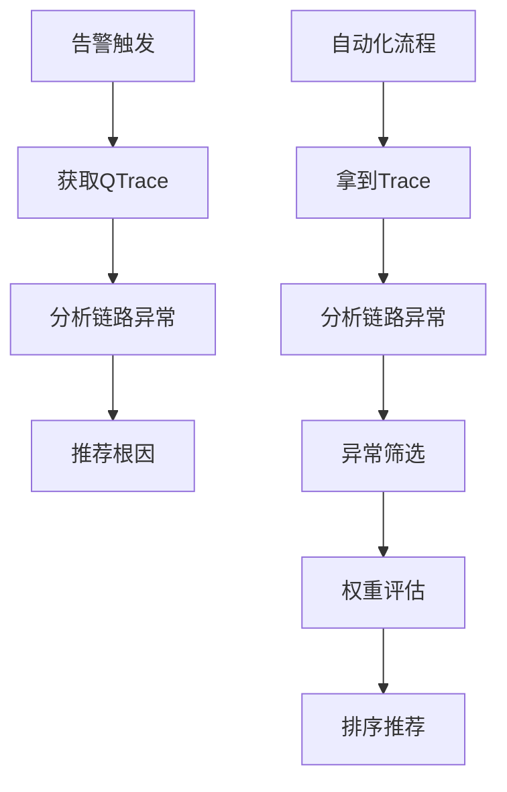

**核心理念**：

> 将人工排查逻辑自动化，通过权重体系推荐最可能的根因。

#### 4.4.2 知识图谱构建

**架构设计**：

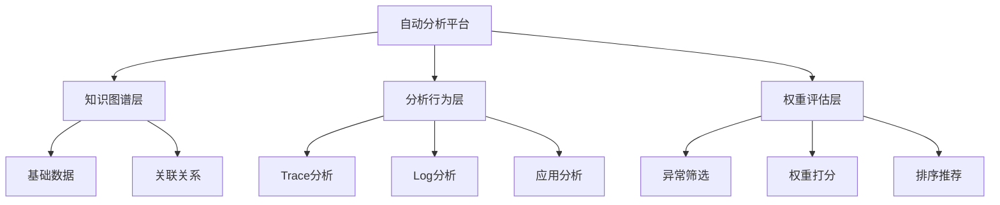

**基础数据构建**：

1. **统一事件中心**

   - 应用发布事件
   - 配置变更事件
   - 业务活动上线
   - 其他运维操作
2. **日志、Trace、告警**

   - 全量日志数据
   - Trace链路数据
   - 告警事件数据
3. **应用画像**

   - 运行端口
   - 启动参数
   - JVM版本
   - 资源规格（4C8G、2C4G等）
   - 运行时配置

**关联关系建立**：

1. **服务调用链路关系**

   - 依赖Trace系统
   - 建立服务间调用关系
   - 分析调用频率和依赖强度
2. **强弱依赖关系**

   - A调B是强依赖还是弱依赖
   - B挂了是否影响A
   - 影响概率评估
   - 支持混沌工程
3. **资源关系**

   - 应用运行在哪个JVM上
   - JVM运行在哪个宿主机上
   - 宿主机在哪个机房
   - 物理拓扑感知
   - 网络环境
   - 交换机信息
4. **异常关联关系**

   - Trace到Log关联
   - Trace也落在Log中，快速查询
   - 异常告警之间关联
   - 指标依赖关系（QPS指标 vs 业务异常指标）

#### 4.4.3 分析行为

**应用维度分析**（类似人工巡查）：

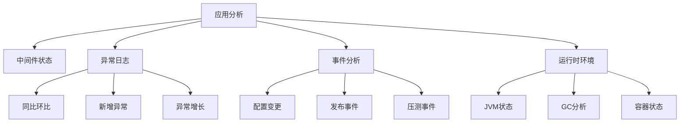

**关注重点**：

1. **异常日志**

   - 同比环比分析
   - 以前没有现在有：重点关注
   - 以前有现在突然增长：重点关注
   - 一直存在的异常：优先级低
2. **事件关联**

   - 配置变更
   - 发布事件
   - 压测事件
3. **运行时环境**

   - JVM状态
   - GC情况
   - 容器状态

**链路维度分析**：

**Trace筛选收敛**：

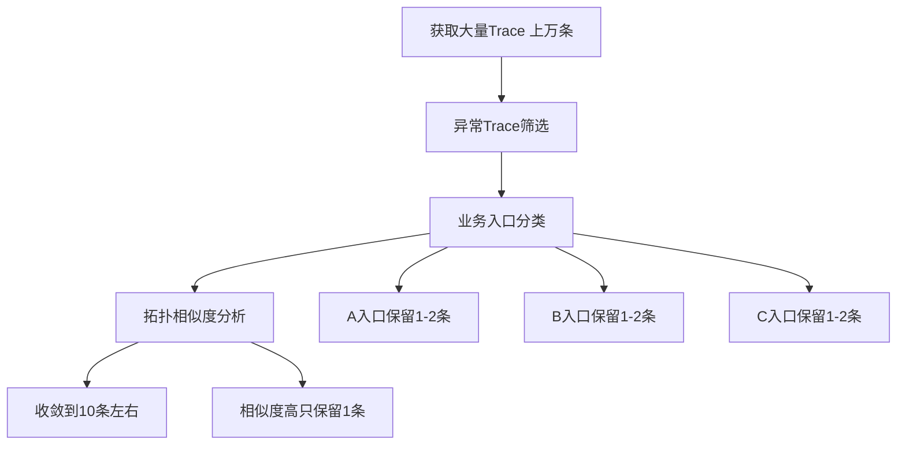

**筛选策略**：

1. **优先筛选异常Trace**

   - 重点关注有异常的Trace
2. **业务入口分类**

   - 按入口分组（A、B、C入口）
   - 每个入口保留1-2条代表性Trace
3. **拓扑相似度**

   - 分析Trace的拓扑结构
   - 相似度高的只保留一条
   - 避免重复分析

**收敛效果**：

> 从上万条Trace收敛到10条左右，大幅降低分析复杂度。

**应用异常标记**：

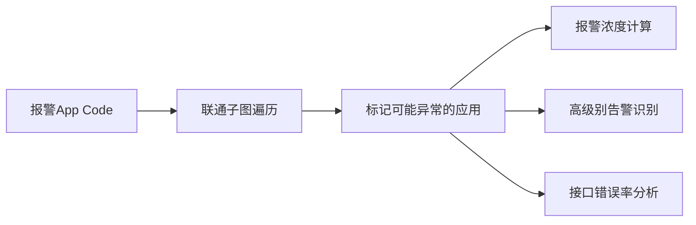

**标记规则**：

1. **对于延迟类指标**

   - 下游影响上游可能性大
   - 以报警App Code为顶点
   - 找联通子图（直连应用）
   - 遍历并标记可能异常的应用
2. **对于流量类指标**

   - 上下游都可能影响
3. **异常标记方法**：

   **报警浓度**：

   - 配置10个告警，现在4个在报警
   - 异常概率较高
   - 标记为异常

   **高级别告警**：

   - 存在高优先级告警
   - 标记为异常

   **接口错误率分析**：

   - 分析调用链路
   - A调用B的某个服务接口
   - 检查B的该接口错误率和延迟
   - 如果正常，认为B不影响A
   - 如果异常，标记B为异常

#### 4.4.4 权重体系

**四种权重类型**：

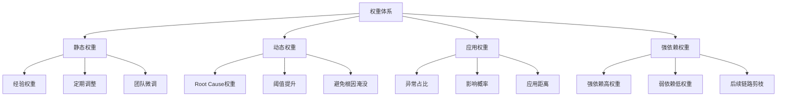

**1. 静态权重（经验权重）**

**特点**：

- 基于历史经验设置
- 定期根据故障原因调整
- 不同团队可微调

**示例**：

- 磁盘使用率80%：权重较低（通常不致命）
- 磁盘使用率100%：权重极高（几乎必然导致问题）

**2. 动态权重（Root Cause权重）**

**目的**：

> 避免真正的根因被淹没。

**示例**：

- 磁盘使用率80%：正常告警，权重10%
- 磁盘使用率100%：极大概率导致故障，权重提升到90%

**3. 应用权重**

**含义**：

- 当前故障中，该应用异常所占的权重比
- 表示该应用影响故障的概率大小

**计算方法**：

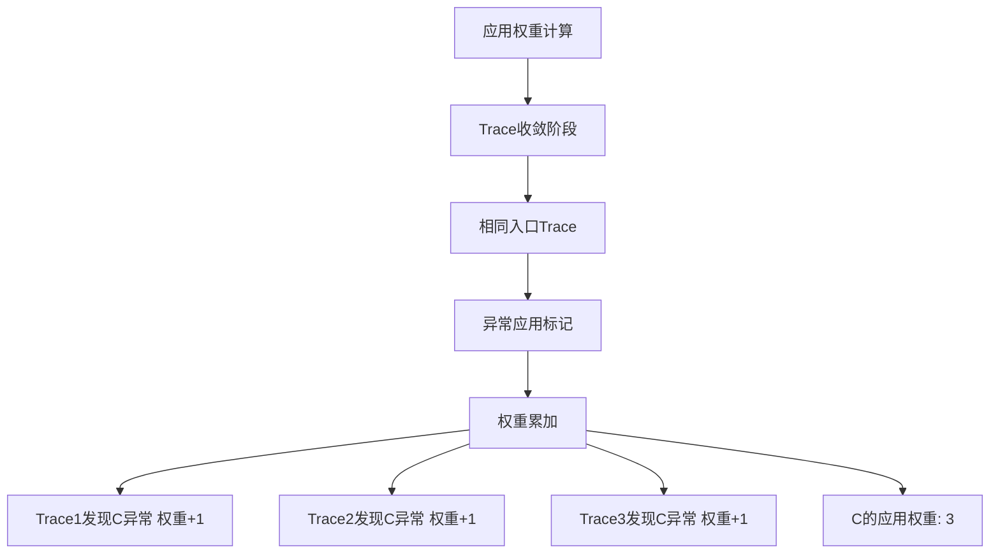

**应用距离因素**：

- 距离报警App Code越近，权重越高
- 例如：B比C、F更靠近A
- B导致A故障的概率可能更高

**适用性**：

> 不同业务场景可能不同，需要根据实际情况调整。

**4. 强依赖权重**

**场景**：

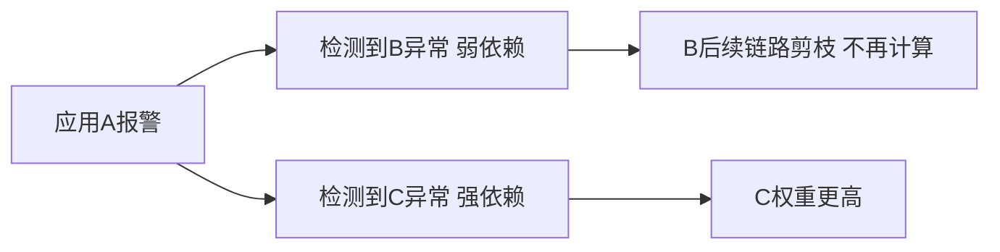

**逻辑**：

- A出现报警
- B和C都检测到异常
- B是弱依赖
- C是强依赖
- 认为C影响概率更高
- B的后续链路不再计算（剪枝）

**依赖关系来源**：

> 通过混沌工程的强依赖治理获得，常态化进行。

#### 4.4.5 输出结果

**展示格式**：

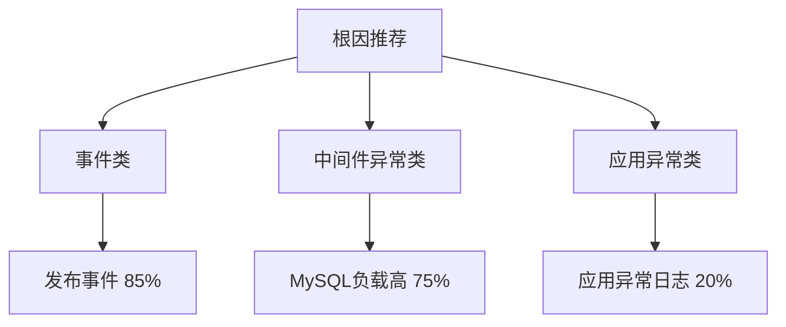

**输出内容**：

- 推荐的Root Cause
- 每个根因的占比（置信度）
- 例如：
  - 发布事件：85%
  - MySQL负载高：75%
  - 应用异常日志：20%

**实际案例**：

**场景**：MySQL线程异常

**分析结果**：

- MySQL负载特别高
- 慢查询多
- 导致应用异常

**展示**：

- 提示MySQL相关异常
- 给出Root Cause建议

### 4.5 成效

**故障定位效率提升**：

| 指标             | 数据    |
| ---------------- | ------- |
| 定位慢的故障比例 | 降低20% |
| 自动定位准确率   | 70%左右 |

**核心价值**：

> 通过自动化分析，显著提升故障定位效率和准确率。

## 五、总结

### 5.1 核心实践

**三大核心实践**：

1. **以始为终衡量监控系统**

   - 关注故障指标而非系统指标
   - 参考MTTR优化各个阶段
   - 以业务价值为导向
2. **秒级监控建设**

   - 解决高级别故障（P1/P2）的快速发现
   - 订单类故障要求秒级发现
   - 更快发现、更快处理
3. **故障快速定位**

   - 应对链路复杂和依赖复杂
   - 确认应用及依赖组件健康状况
   - 计算相关异常权重
   - 推荐可能的根因

### 5.2 技术架构总结

**秒级监控架构**：

```mermaid
graph TD
    A[秒级监控系统] --> B[客户端改造]
    A --> C[服务端改造]
    A --> D[存储优化]
  
    B --> B1[多仓库快照]
    B --> B2[T-Digest压缩]
    B --> B3[分钟级+秒级支持]
  
    C --> C1[Golang重构]
    C --> C2[去MQ化]
    C --> C3[Worker有状态]
  
    D --> D1[VictoriaMetrics]
    D --> D2[存算分离]
    D --> D3[GraphAPI]
```

**故障定位架构**：

```mermaid
graph TD
    A[故障定位系统] --> B[链路与指标关联]
    A --> C[应用概览]
    A --> D[自动分析平台]
  
    B --> B1[Metric关联Span]
    B --> B2[精准Trace定位]
  
    C --> C1[入口出口列表]
    C --> C2[依赖组件状态]
    C --> C3[异常日志环比]
    C --> C4[JVM状态]
  
    D --> D1[知识图谱]
    D --> D2[分析行为]
    D --> D3[权重体系]
```

### 5.3 关键收益

**量化指标**：

| 优化项                | 优化前 | 优化后   | 改善幅度 |
| --------------------- | ------ | -------- | -------- |
| P1/P2故障平均发现时长 | 4分钟  | 优化中   | -        |
| 订单类故障发现时长    | 3分钟  | 1分钟内  | 66%+     |
| 订单类故障1分钟发现率 | 20%    | 显著提升 | -        |
| 定位慢的故障比例      | 基准   | 降低20%  | 20%      |
| 自动定位准确率        | -      | 70%      | -        |
| 故障处理超30分钟占比  | 48%    | 持续优化 | -        |

**业务价值**：

- ✅ 更快发现故障
- ✅ 更快定位问题
- ✅ 更快恢复服务
- ✅ 降低业务影响
- ✅ 提升用户体验

## 六、Q&A精选

### Q1: 放在Span里的指标具体是指什么？数据模型是怎么样的？

**答**：

**指标示例**：

- 例如接口 `/foo`的QPS监控
- 指标名可能是：`/foo/qps`

**关联方式**：

- 请求进来时，指标计数（如加1）
- 检查当前是否有Trace上下文（Span）
- 如果有，将指标名放入Span中
- Span关联了Trace ID
- 指标间接关联到Trace ID

**数据模型**：

```
Trace ID
  ├── Span 1
  │     └── Metric: /foo/qps
  ├── Span 2
  │     └── Metric: /foo/latency
  └── Span N
```

**存储**：

- 数据存储在ES中
- 建立索引
- 支持根据指标名反查Trace ID

**查询**：

- 根据指标名搜索
- 返回关联的Trace
- 这些Trace都经过该指标

### Q2: 智能分析用了哪些技术栈或工具？

**答**：

**语言选择**：

- Golang

**算法应用**：

- 整体是调度模型和调度算法
- 离群检测算法（异常检测）
- 权重评分算法
- 开源离群检测算法（可选用合适的）

**建议**：

> 算法不是特别复杂，重点是调度逻辑和业务规则。

### Q3: 指标仓库中数据精度怎么把控？有怎样的评判标准？

**答**：

**精度控制方式**：

**快照机制**：

- 0秒时生成上一分钟（0-59秒）快照
- 快照生成后数据固定
- 新进数据存入新仓库
- 不干扰已生成快照

**数据一致性**：

- Server端无论何时拉取，都是同一个快照
- 数据不会变化
- 保证数据精度

**业务场景考虑**：

1. **大部分监控场景**

   - 丢失1-2个数据点影响不大
   - 精度要求不高
2. **订单类监控**

   - 精度要求高
   - 不能丢失数据
   - 需要使用快照机制保证

**评判标准**：

> 根据业务重要程度决定精度要求。

### Q4: 权重体系中，不同权重占比大概是多少？

**答**：

**不是固定比例**：

- 不是静态权重50%、动态权重25%这种分配
- 而是评分累加系统

**工作方式**：

- 不断累加评分
- 选择评分最高的

**区间设置**：

- 设置权重区间（如1-10）
- 每种权重在自己区间内评分
- 根据情况在区间内升级

**示例**：

- 静态权重：1-10分
- 动态权重：1-10分
- 应用权重：1-10分
- 强依赖权重：1-10分
- 累加后选最高分

### Q5: 服务的强弱依赖怎么确定的？是通过静态配置吗？还是动态运行，是根据什么规则运行？

**答**：

**数据来源**：

- 不是由监控系统自身提供
- 不是人工标注
- 来自混沌工程实践

**混沌工程**：

- 去哪儿网实施混沌工程
- 其中一项是强弱依赖治理

**治理方式**：

- 业务线常态化做强弱依赖治理
- 测试A应用到B应用的某个接口
- B挂了对A是否有影响
- 记录影响程度

**数据沉淀**：

- 通过混沌工程实验沉淀数据
- 持续更新依赖关系
- 精确到接口级别

### Q6: 目前告警治理和运维团队通过哪些线上化工具系统？如何考核应用业务团队量化SLA绩效指标还是事故统计？

**答**：

**SLA考核方式**：

- 最常用：故障时长统计

**错误预算（Error Budget）**：

- 设置SLO目标（如三个九、四个九）
- 四个九意味着一年只有50多分钟故障时长
- 每次故障消耗错误预算
- 预算消耗完：未完成目标
- 预算未消耗完：完成目标

**燃尽图（Burn Down Chart）**：

- 可视化错误预算消耗
- 跟踪SLA达成情况

**考核重点**：

- 从老板层面：关注故障
- 特别是影响真实订单业务的故障
- 其他指标不是主要关注点

### Q7: 什么情况下可以故障免责？

**答**：

**因公司而异**：

- 每个公司定责标准不同

**去哪儿网标准**：

- 谁造成的故障，谁负责

**一般原则**：

- 看具体情况
- 看故障性质
- 看影响范围

**建议**：

> 建立明确的故障定责标准和流程。

## 七、技术要点总结

### 7.1 TSDB选型关键因素

**评估维度**：

```mermaid
graph TD
    A[TSDB选型] --> B[性能指标]
    A --> C[功能支持]
    A --> D[社区生态]
    A --> E[运维成本]
  
    B --> B1[写入性能]
    B --> B2[查询性能]
    B --> B3[压缩比]
  
    C --> C1[协议兼容性]
    C --> C2[聚合函数]
    C --> C3[集群能力]
  
    D --> D1[活跃度]
    D --> D2[文档完善度]
    D --> D3[问题响应速度]
  
    E --> E1[部署复杂度]
    E --> E2[维护成本]
    E --> E3[升级便利性]
```

**关键教训**：

- 压测要贴近真实业务场景
- 特别是聚合函数使用场景
- 单指标性能好不代表聚合性能好
- 需要综合评估

### 7.2 存算分离的价值

**核心优势**：

1. **性能优化**

   - 发挥VM单指标查询优势
   - 规避聚合查询性能问题
2. **架构灵活**

   - API层无状态，可任意扩展
   - 易于添加新功能
3. **业务定制**

   - 防腐层功能
   - 支持业务特殊需求
   - 限流熔断等保护机制

### 7.3 客户端设计要点

**关键考虑**：

1. **数据精度**

   - 快照机制保证精度
   - 满足业务数据对齐需求
2. **内存优化**

   - T-Digest采样算法
   - 平衡精度和内存占用
3. **兼容性**

   - 支持分钟级和秒级
   - 平滑迁移

### 7.4 服务端架构演进

**关键改进**：

1. **去MQ化**

   - 降低任务派发延迟
   - 支持高频采集
2. **有状态Worker**

   - 减少任务分配开销
   - 提升稳定性
3. **语言选择**

   - Golang高并发支持
   - CPU消耗低

### 7.5 故障定位的关键

**三个核心**：

1. **精准关联**

   - Metric与Trace关联
   - 减少干扰信息
2. **全面视图**

   - 应用概览
   - 一眼看出健康度
3. **智能推荐**

   - 知识图谱
   - 权重体系
   - 自动化分析

## 八、最佳实践建议

### 8.1 监控系统建设

**建议**：

1. **以业务为中心**

   - 不只关注系统指标
   - 关注故障指标
   - 衡量业务价值
2. **分阶段优化**

   - 发现阶段：提升速度和准确率
   - 诊断阶段：提供全面信息和智能分析
   - 修复阶段：支持快速恢复
3. **量化目标**

   - 设定明确的MTTR目标
   - 定期评估和优化

### 8.2 秒级监控建设

**建议**：

1. **聚焦核心场景**

   - 不是所有场景都需要秒级
   - 聚焦高价值场景（如订单）
   - P1/P2级别故障
2. **兼容性优先**

   - 保持与现有系统兼容
   - 平滑迁移
   - 降低改造风险
3. **压测验证**

   - 充分压测
   - 模拟真实场景
   - 验证性能指标

### 8.3 故障定位能力

**建议**：

1. **知识图谱是基础**

   - 投入精力构建知识图谱
   - 持续完善关联关系
   - 数据质量决定分析准确度
2. **权重体系需要迭代**

   - 初期基于经验
   - 根据故障数据持续优化
   - 不同团队可能需要定制
3. **混沌工程很重要**

   - 提供强弱依赖关系
   - 提升分析准确率
   - 建议常态化实施

### 8.4 可观测性体系

**完整视图**：

```mermaid
graph TD
    A[可观测性] --> B[Metrics 指标]
    A --> C[Tracing 链路]
    A --> D[Logging 日志]
  
    B --> E[关联分析]
    C --> E
    D --> E
  
    E --> F[应用概览]
    E --> G[自动分析]
    E --> H[根因推荐]
```

**核心价值**：

- 不是三大支柱独立存在
- 而是相互关联、相互印证
- 提供统一的故障定位能力

## 附录：关键术语

| 术语       | 全称/说明                               |
| ---------- | --------------------------------------- |
| MTTR       | Mean Time To Repair - 平均修复时间      |
| MTTD       | Mean Time To Detect - 平均检测时间      |
| SLO        | Service Level Objective - 服务等级目标  |
| SLA        | Service Level Agreement - 服务等级协议  |
| TSDB       | Time Series Database - 时序数据库       |
| QPS        | Queries Per Second - 每秒查询数         |
| P98        | 98th Percentile - 98分位数              |
| VM         | VictoriaMetrics - 时序数据库            |
| ES         | Elasticsearch - 搜索引擎                |
| JVM        | Java Virtual Machine - Java虚拟机       |
| GC         | Garbage Collection - 垃圾回收           |
| MGC        | Major Garbage Collection - 大型垃圾回收 |
| T-Digest   | 分位数估算算法                          |
| Root Cause | 根因                                    |
| App Code   | 应用代码标识                            |
| Span       | 链路追踪的跨度单元                      |
| Trace ID   | 链路追踪标识                            |
