# 去哪儿网基于Trace的根因分析实践

> 来源：未核验 · 类型：分享 · 状态：draft


## 分享嘉宾
梁老师 - 去哪儿网SRE工程师，基础架构基础平台团队

## 个人简介
- 从事CI/CD、可观测性等相关工作
- 参与去哪儿网容器化落地
- 完成监控系统Watcher 2.0升级
- 负责秒级监控建设
- 主导根因分析平台和预案平台落地

---

## 一、背景介绍

### 1.1 故障快速恢复体系

去哪儿网建立了**"1-5-10"故障快速恢复体系**：
- **1分钟**：发现故障
- **5分钟**：定位问题
- **10分钟**：恢复服务

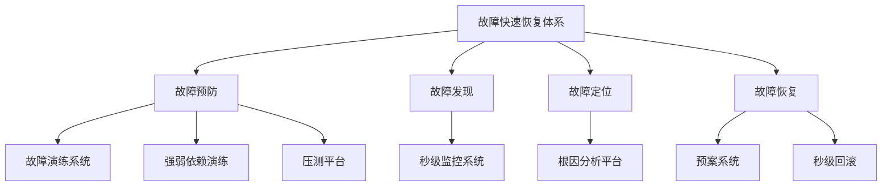

### 1.2 建设背景

随着云原生和微服务技术的大量应用，去哪儿网面临的挑战：
- 业务调用链路越发复杂
- 线上问题定位耗时越来越长
- 需要自动化的根因分析能力

### 1.3 问题分析

通过对年度故障数据统计，发现定位慢的四大原因：

#### 1.3.1 信息量大（占比57%）
- 链路交互复杂，链路长
- 信息多，异常多
- 链路分析不清晰
- 未定位到DB问题
- 未定位到单机问题
- 未关注到异常增长

#### 1.3.2 信息差
- 中间件影响未感知
- 单机问题未感知
- 其他应用的事件和变更未感知
- 查问题工具不熟悉

#### 1.3.3 不可控因素
- 节假日因素
- 人为因素

#### 1.3.4 短期问题
- 回滚时间长
- 容器切换慢

### 1.4 解决方案

针对不同问题采取的措施：

| 问题类型 | 解决方案 |
|---------|---------|
| 回滚时间长 | 秒级回滚系统 |
| 发现时间晚 | 秒级监控系统 |
| 人为因素 | 规范发布流程、值班流程 |
| 定位困难（60%） | **根因分析系统** |

### 1.5 整体思路

基于可观测性三要素（MTL）进行分析和建模：

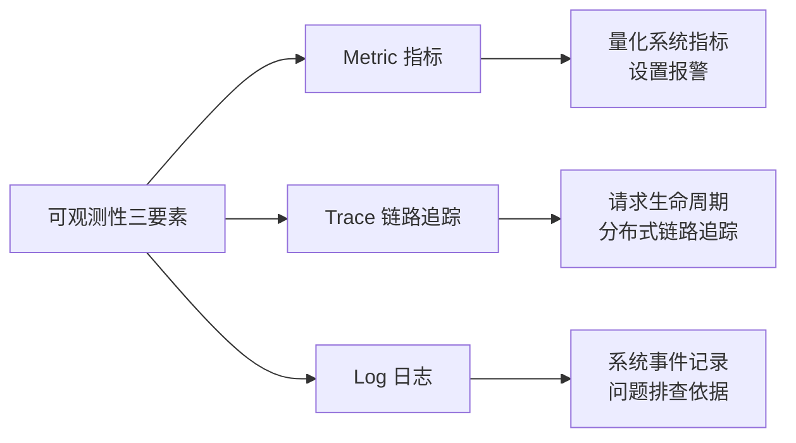

**三要素说明：**
- **Log（日志）**：提供系统进程最精细化的信息，记录关键变量、事件、访问记录等，是问题排查取证的依据
- **Metric（指标）**：提供量化的系统内外部各维度指标，是对关注事件的聚合，可根据指标设置报警
- **Trace（链路追踪）**：提供请求从接收到处理完毕整个生命周期的跟踪路径，支持分布式系统的链路追踪

---

## 二、架构设计

### 2.1 模型构建思路

**核心理念：模拟人的思维**

#### 2.1.1 人工排查思路

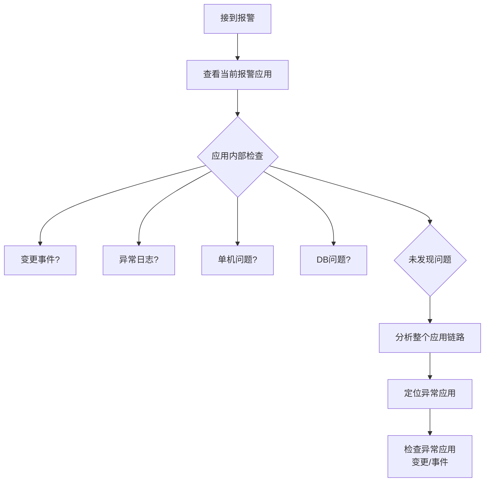

#### 2.1.2 抽象后的核心思路

根因分析模型构建的五个核心步骤：

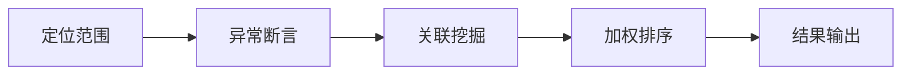

### 2.2 模型构建步骤

#### 步骤概览

1. **知识图谱构建**
   - 基础数据
   - 应用内资源关联关系
   - 应用间关联关系
   - 异常关联关系

2. **异常应用断言**
   - 配置获取
   - 链路分析
   - 异常应用定位

3. **异常应用分析**（应用内部）
   - 运行时分析
   - 事件变更
   - 中间件分析
   - 日志分析

4. **异常关联分析**（应用之间）
   - 指标特征分析
   - 日志关联分析

5. **聚合分析**
   - 应用权重
   - 静态/动态权重
   - 强弱依赖权重
   - AI决策
   - AI Summary

### 2.3 知识图谱构建

#### 2.3.1 基础数据

去哪儿网的统一基础设施（根因分析的基石）：
- 统一事件中心
- 日志平台
- Trace平台（QTracer）
- 监控指标和告警（QMonitor）

#### 2.3.2 资源关联关系

**应用内部依赖资源：**
- MySQL、Redis等中间件关联
- 物理拓扑感知：容器、QVM、宿主机、网络环境

#### 2.3.3 应用间关联关系

- 应用调用链路
- 应用强弱依赖关系

#### 2.3.4 异常间关联关系

- 异常指标精确关联Trace和Log
- 异常告警之间的关联关系挖掘

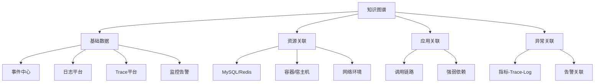

### 2.4 异常应用断言

#### 2.4.1 报警和故障体系

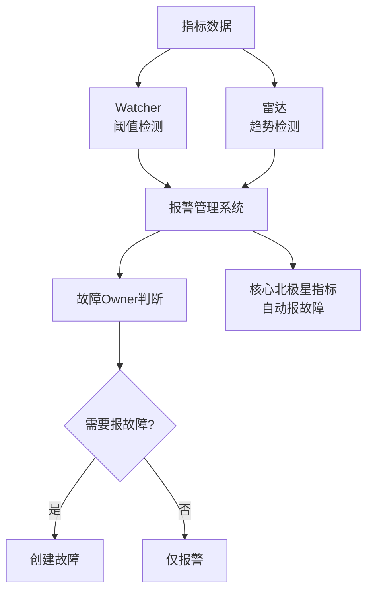

**报警体系说明：**
- **Watcher**：阈值检测系统（如：连续3分钟大于阈值）
- **雷达**：趋势检测系统（如：指标突增、突降）
- 两者都依托于指标，统一发送到报警管理系统
- 核心北极星指标异常会自动报故障

#### 2.4.2 指标与Trace关联

**关联的重要性：**
报警系统依托于指标，如果建立指标与Trace的关系，就能快速获取整个报警系统的链路信息。

**关联实现方案：**

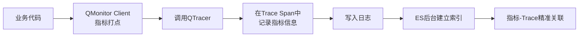

**技术细节：**
- QMonitor和QTracer都是自研组件
- QMonitor Client打点时调用QTracer接口
- 在Trace Span中记录指标信息
- 通过日志写入，ES建立索引关联
- 对性能几乎无影响
- 可通过指标+时间范围精确查询垂直链路

#### 2.4.3 Trace收敛

**问题：** 根据指标查询Trace，数量级可能达到万级，需要收敛。

**三步漏斗式筛选：**

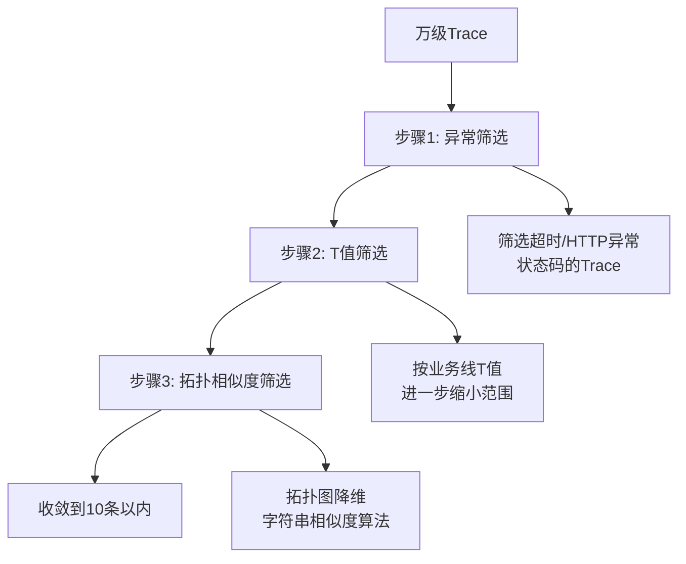

**详细说明：**

1. **异常筛选**
   - QTracer记录链路时标记异常调用（超时、HTTP状态码异常）
   - 将Trace标记为异常Trace
   - 异常Trace是根因分析最重要的数据

2. **T值筛选**
   - T值（QRT）是去哪儿网大客户端的概念
   - 用于区分各业务线服务
   - 不同T值对应不同业务
   - 进一步缩小分析范围

3. **拓扑相似度筛选**
   - 将拓扑图降维构建为字符串
   - 使用字符串相似度算法
   - 最终筛选到10条以内

#### 2.4.4 异常应用定位

**四个步骤：**

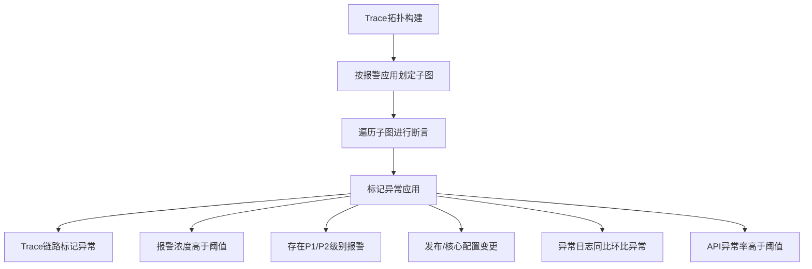

**异常应用判定条件（满足任一即标记）：**
1. Trace链路上标记为异常（红色节点）
2. 当前应用报警浓度高于阈值
3. 存在P1/P2级别报警
4. 存在发布或核心配置变更事件
5. 异常日志同比环比高于预值
6. API异常率指标高于阈值

### 2.5 异常应用内部分析

对标记的异常应用进行深度分析，包含四个维度：

#### 2.5.1 Runtime（运行时分析）

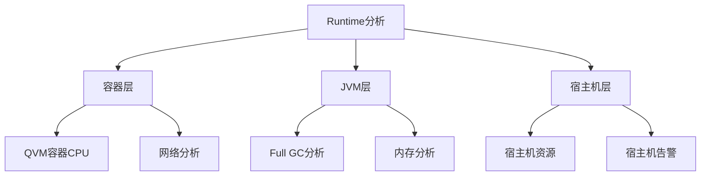

#### 2.5.2 中间件分析

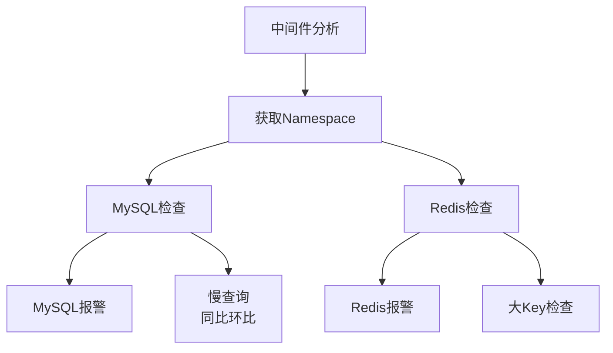

**技术细节：**
- 通过AppCode获取Namespace
- 检查MySQL/Redis报警
- 慢查询采用同比环比判定（更精确）
- Redis检查大Key问题

#### 2.5.3 事件分析

- 发布事件
- 配置变更
- 压测事件

#### 2.5.4 应用日志分析

**两种方式：**

1. **精确查询**
   - 根据筛选的Trace ID从ES查询异常日志
   - 精准定位到具体请求的日志

2. **聚合查询**
   - 通过黑幕异常日志平台查询
   - 获取时间范围内异常日志类型、总量
   - 同比环比分析

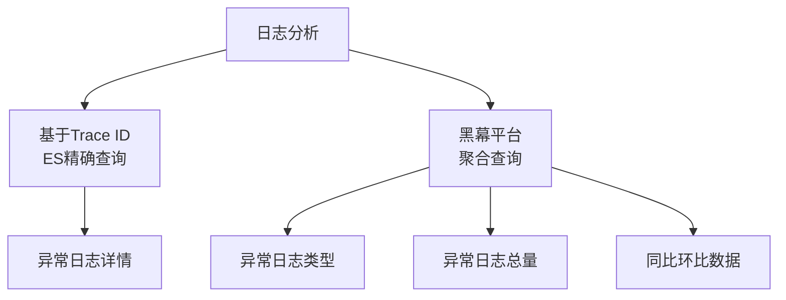

### 2.6 异常关联分析

应用之间的异常关联分析，包含三个部分：

#### 2.6.1 单机离群检测

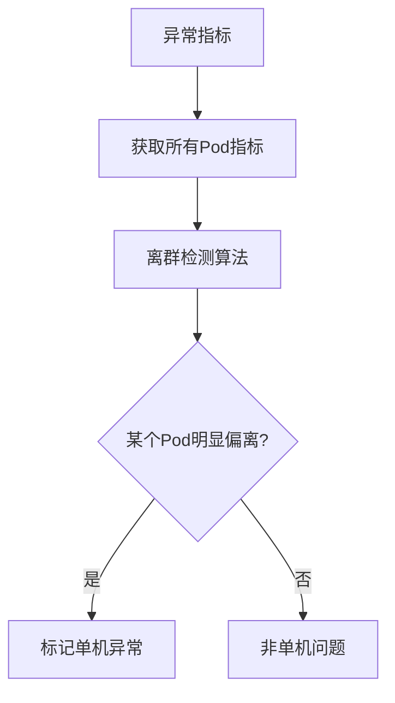

**场景：** 某个Pod的单机指标明显偏离其他Pod，倾向于认定该Pod有问题。

#### 2.6.2 耗时类异常指标分析

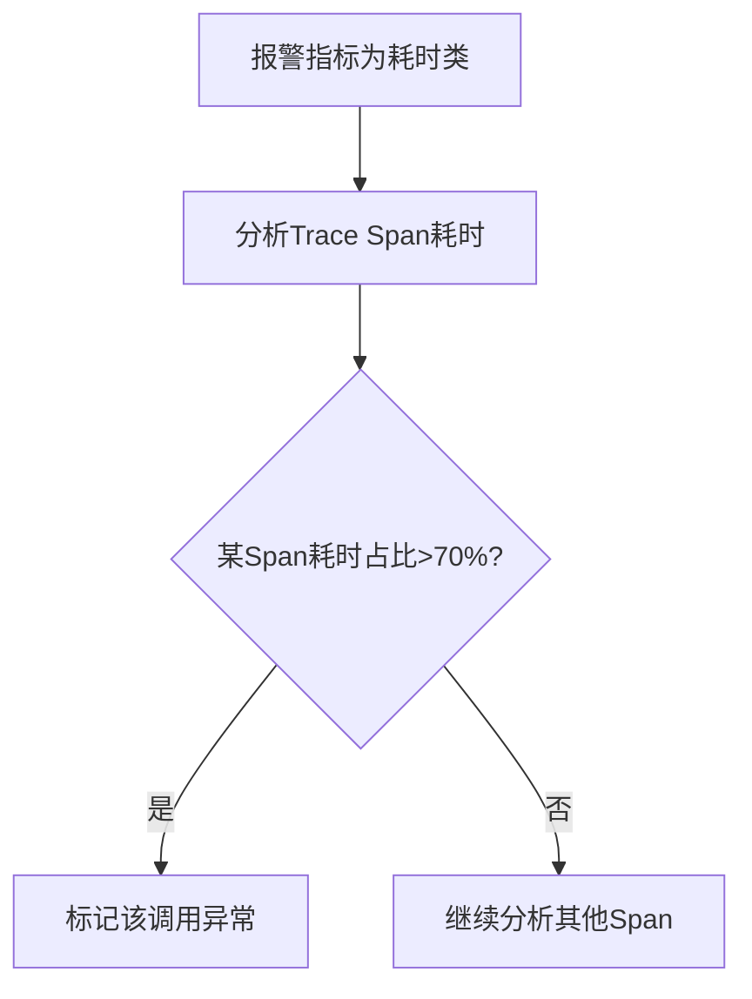

**场景：** 当报警关联的异常指标是耗时类时，分析Trace Span耗时，找出占整个调用链路70%以上的异常调用。

#### 2.6.3 链路关联分析

**上游影响分析：**
- 上游特定事件分析
- 上游API QPS分析（QPS激增）
- 上游AppCode事件变更

**原因：** 某些情况下，当前报警可能是由上游影响导致的。

#### 2.6.4 异常日志单机分析

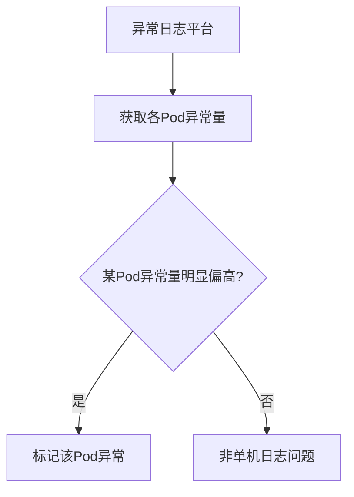

**依托：** 黑幕异常日志平台，可标记出每个Pod的异常量。

### 2.7 聚合分析

#### 2.7.1 权重体系

将前面分析到的所有异常进行聚合，通过权重体系进行加权排序。

**四大权重维度：**

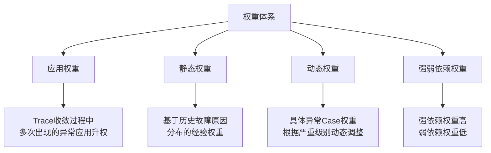

**1. 应用权重**

代表当前故障/报警中此应用异常所占的权重比，表示此应用影响当前故障/报警的概率大小。

**计算方式：** 在Trace收敛过程中，对多次出现的异常AppCode进行升权。

示例：多个Trace中都发现C应用有问题，则对C应用升权，认为其异常概率更大。

**2. 静态权重**

基于历史故障原因分布的经验权重。

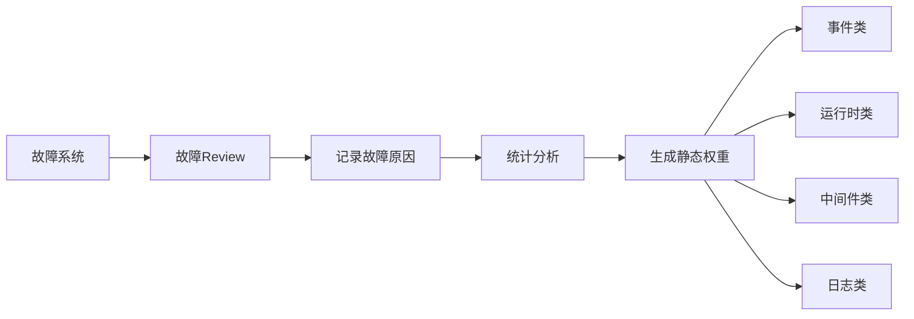

**数据来源：** 从年度故障原因统计中获取各类问题的概率分布。

**3. 动态权重**

具体异常Case的权重，根据各个根因的严重级别动态升权，避免真正的根因被淹没。

**动态调整场景：**

| 类型 | 动态调整规则 | 示例 |
|------|-------------|------|
| 运行时 | CPU使用率越高权重越大 | CPU 90% vs 100% |
| 事件 | 越接近故障时间权重越大 | 发布时间距离报警时间 |
| 事件 | 发布事件权重高于其他事件 | 发布 > 配置变更 |
| 中间件 | 根据DBA分级调整 | P1告警 > P2告警 |

**4. 强弱依赖权重**

用于减权，明确应用间接口调用的强弱依赖关系。

**场景示例：**
```
告警应用：A
异常应用：B、C
关系：A调B是弱依赖，A调C是强依赖
结论：倾向于认为A的告警是由C的异常造成的
```

**强弱依赖维护：** 通过定期的强弱依赖演练来维护，针对接口级进行演练验证。

#### 2.7.2 AI Summary

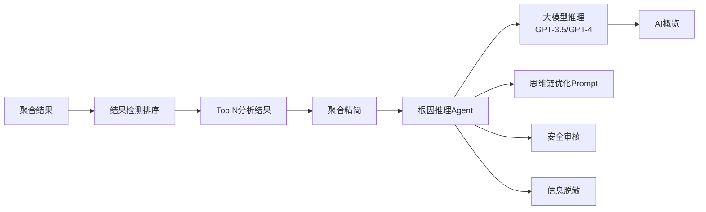

**输入内容：**
- 应用事件异常
- 异常日志
- 中间件异常
- 单机异常
- 异常OPS等

**处理流程：**
1. 结果检测排序，得到Top N分析结果
2. 聚合精简
3. 调用根因推理Agent（通过思维链优化Prompt）
4. 经过安全审核和信息脱敏
5. 交给大模型推理（GPT-3.5 Turbo / GPT-4）
6. 生成AI概览

**案例：**
```
AI概览：根因为单机异常

推理过程：
- 实例异常的可能性最高
- 与多个异常日志相关联
- 表明单机问题可能导致了其他异常

处理结果：
业务线同学删除重建该单机后，故障恢复
```

### 2.8 结果输出

#### 2.8.1 分析报告页面

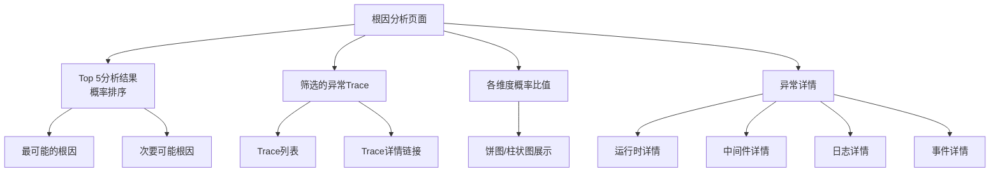

**页面布局：**
- **上部**：Top 5概率最高的分析结果
- **中部**：筛选到的异常Trace列表
- **右侧**：各维度所占概率比值（可视化）
- **下部**：异常详情展开

#### 2.8.2 可视化拓扑图

**背景：** 业务线同学反馈仅看分析报告不够直观，希望看到故障期间整个链路的调用关系。

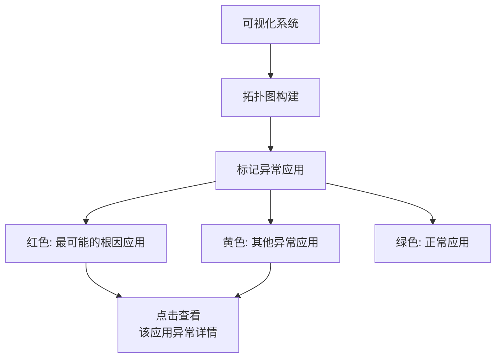

**特点：**
- 直观展示调用链路拓扑
- 颜色区分异常级别
- 点击节点查看详细异常信息
- 更符合用户排查习惯

### 2.9 整体架构

```mermaid
graph TD
    A[触发源] --> B[Trace筛选]
    B --> C[异常应用断言]
    C --> D[应用分析模块]
    C --> E[异常关联模块]
    D --> F[权重模块]
    E --> F
    F --> G[决策模块]
    G --> H[用户侧]
    
    A --> A1[报警自动触发]
    A --> A2[故障自动分析]
    A --> A3[监控页面手动触发]
    
    B --> B1[指标函数]
    B --> B2[T值筛选]
    B --> B3[异常Trace]
    B --> B4[相似度筛选]
    
    C --> C1[Trace异常边]
    C --> C2[报警浓度/P1P2]
    C --> C3[API异常率]
    C --> C4[异常日志增长率]
    
    D --> D1[Runtime]
    D --> D2[中间件]
    D --> D3[事件]
    D --> D4[日志]
    
    E --> E1[单机离群]
    E --> E2[耗时分析]
    E --> E3[链路关联]
    
    F --> F1[应用权重]
    F --> F2[静态权重]
    F --> F3[动态权重]
    F --> F4[强弱依赖]
    
    G --> G1[聚类分析]
    G --> G2[加权排序]
    G --> G3[AI决策]
    G --> G4[报告聚合]
    
    H --> H1[API调用]
    H --> H2[分析报告]
    H --> H3[异常拓扑]
    H --> H4[用户反馈]
```

**架构说明：**

**触发源：**
- 报警自动触发
- 故障自动分析
- 监控系统页面手动触发

**Trace筛选：**
- 指标函数关联
- T值筛选
- 异常Trace筛选
- 拓扑相似度筛选

**异常应用断言：**
- Trace异常边
- 报警浓度/P1P2报警
- API异常率（Nail指标）
- 异常日志增长率

**分析模块：**
- 应用分析：Runtime、中间件、事件、日志
- 异常关联：单机离群、耗时分析、链路关联

**权重模块：**
- 应用权重、静态权重、动态权重、强弱依赖权重

**决策模块：**
- 聚类分析
- 加权排序
- AI决策
- 报告聚合

**用户侧：**
- API调用（应用维度分析、健康状况查询）
- 分析报告
- 异常拓扑生成
- 用户反馈（分析结果对错反馈）

---

## 三、模型验证

### 3.1 验证策略

模型验证采用三种方式，确保根因分析的准确性：

```mermaid
graph TD
    A[模型验证] --> B[线上真实Case验证]
    A --> C[混沌工程演练]
    A --> D[Lab环境验证]
    
    B --> B1[真实故障]
    B --> B2[真实异常报警]
    B --> B3[自动验证机制]
    
    C --> C1[混沌注入故障]
    C --> C2[验证分析准确性]
    
    D --> D1[Redis故障模拟]
    D --> D2[DB故障模拟]
```

### 3.2 线上真实Case验证

**最有价值的第一手材料**

#### 3.2.1 验证方式

1. **上线时验证**
   - 对历史故障进行回溯分析
   - 验证模型是否能准确定位根因

2. **自动验证机制**
   - 将线上真实故障存储到ES平台
   - 包括真实故障原因和分析结果
   - 每次模型调整后自动跑一遍
   - 对比分析效果是好是坏

```mermaid
graph LR
    A[线上故障] --> B[存储到ES]
    B --> C[记录真实原因]
    B --> D[记录分析结果]
    C --> E[模型调整]
    D --> E
    E --> F[自动验证]
    F --> G[效果对比]
```

### 3.3 混沌工程攻防演练

**结合故障预防体系**

```mermaid
graph TD
    A[混沌工程] --> B[故障演练]
    A --> C[强弱依赖演练]
    A --> D[压测平台]
    
    B --> E[混沌注入故障]
    E --> F[根因分析系统分析]
    F --> G{能否准确定位?}
    G -->|是| H[验证通过]
    G -->|否| I[模型优化]
```

**验证流程：**
1. 通过混沌工程注入故障
2. 根因分析系统自动分析
3. 验证能否准确分析出注入的故障原因
4. 持续迭代优化

### 3.4 Lab环境验证

**目的：** 验证不敢在线上真实应用测试的故障场景。

```mermaid
graph TD
    A[Lab环境] --> B[Redis故障模拟]
    A --> C[DB故障模拟]
    A --> D[其他中间件故障]
    
    B --> E[连接超时]
    B --> F[大Key查询]
    B --> G[关键指标告警]
    
    C --> H[连接超时]
    C --> I[连接数不够]
    C --> J[慢查询]
    C --> K[宿主机告警]
```

**原因：** Redis、DB等中间件问题不适合在线上真实环境测试，风险太大。

### 3.5 验证覆盖范围

#### 3.5.1 六大类故障

| 故障类型 | 说明 |
|---------|------|
| 事件变更 | 发布、配置变更等 |
| 异常日志 | 应用日志异常增长 |
| DB | MySQL相关问题 |
| Redis | Redis相关问题 |
| 单机 | 单机资源/网络问题 |
| GC | JVM GC问题 |

#### 3.5.2 十八种场景

**DB场景：**
- 连接超时
- 连接数不够
- 宿主机关键指标告警
- 慢查询

**Redis场景：**
- 关键指标告警
- 查询大Key

**其他场景：**
- 发布事件
- 配置变更
- 单机CPU/内存/网络异常
- Full GC
- 异常日志激增
- ...

#### 3.5.3 验证规模

- **已验证Case数：** 200+
- **状态：** 持续迭代和验证中

### 3.6 验证案例

**MySQL线程异常注入：**

```mermaid
graph LR
    A[Lab环境] --> B[注入MySQL线程异常]
    B --> C[触发应用报警]
    C --> D[根因分析系统]
    D --> E[分析链路]
    E --> F{能否定位到MySQL异常?}
    F -->|是| G[验证通过]
    F -->|否| H[分析原因优化]
```

---

## 四、应用实践

### 4.1 业务报警自动分析

#### 4.1.1 整体流程

```mermaid
graph TD
    A[业务报警] --> B[过滤器]
    B --> C{通过过滤?}
    C -->|是| D[根因分析]
    C -->|否| E[忽略]
    
    D --> F[推送到群组]
    
    B --> B1[核心面板]
    B --> B2[核心T值]
    B --> B3[无效报警过滤]
    
    F --> F1[可配置群组]
    F --> F2[及时发现问题]
    F --> F3[及时解决问题]
```

#### 4.1.2 过滤器配置

**目的：** 业务报警较多，每个都分析干扰性大，需要过滤。

**三种过滤条件（可配置）：**

1. **核心面板**
   - 只分析配置的核心面板中的报警
   - 由业务线自行配置

2. **核心T值**
   - Trace中包含核心T值才分析
   - 聚焦核心业务

3. **无效报警**
   - 几天内连续报8-9次但未触发故障
   - 倾向于认为是无效报警
   - 自动过滤降低干扰
   - 可选择开启或关闭

#### 4.1.3 群组推送

**特点：**
- 群组可配置
- 业务线自由配置推送目标
- 支持多群组推送

**价值：**
1. **及时解决问题**：业务线同学及时关注和处理
2. **及时发现问题**：可能规避故障

**真实案例：**
```
时间：去年五一
场景：某报警触发
分析结果：DB慢查询
处理：业务线同学及时处理
结果：规避了一次故障
```

### 4.2 故障根因推送

#### 4.2.1 故障系统打通

```mermaid
graph TD
    A[故障系统] --> B[创建故障]
    B --> C[根因分析机器人<br/>自动加入故障群]
    C --> D[监听故障信息]
    D --> E{故障信息填写完整?}
    E -->|是| F[获取核心报警]
    E -->|否| D
    
    F --> G[以报警为维度<br/>进行根因分析]
    G --> H[聚合分析结果]
    H --> I[推送到故障群]
    
    E --> E1[受影响应用]
    E --> E2[故障开始时间]
    E --> E3[其他元数据]
```

#### 4.2.2 分析流程

1. **监听故障群**
   - 根因分析机器人自动加入故障群
   - 监听故障信息填写

2. **获取核心报警**
   - 根据故障应用和开始时间
   - 获取核心报警列表

3. **多维度分析**
   - 以报警为维度进行根因分析
   - 聚合多个报警的分析结果

4. **结果推送**
   - 推送故障分析报告到故障群
   - 包含AI概览和推理过程

#### 4.2.3 真实案例

**故障场景：**
```
AI概览：
根因为某应用发布了配置文件

推理过程：
1. 配置文件发布时间最接近问题发生时间
2. 概率较高，可能导致Namespace异常告警
3. 其他应用异常与此无直接关联

处理结果：
业务线同学确认配置变更，及时回滚后故障恢复
```

**价值体现：**
- 快速定位到配置变更
- 明确指出最可疑的变更
- 缩短故障定位时间
- 加快故障恢复

### 4.3 API调用支持

**对外提供API接口**

#### 4.3.1 应用维度分析

```mermaid
graph TD
    A[外部系统] --> B[调用根因分析API]
    B --> C[应用维度分析]
    C --> D[返回健康状况]
    
    D --> D1[事件信息]
    D --> D2[异常日志]
    D --> D3[中间件状态]
    D --> D4[运行时状态]
    D --> D5[综合评分]
```

**功能：**
- 查看当前应用运行状况
- 包括事件、异常日志、中间件、运行时等
- 获取应用健康状况综合评估

#### 4.3.2 接入系统

- 预案系统
- 监控大盘
- 运维平台
- 其他内部系统

### 4.4 用户反馈机制

**持续优化的基础**

```mermaid
graph LR
    A[分析报告] --> B[用户反馈]
    B --> C{分析结果正确?}
    C -->|是| D[记录正确案例]
    C -->|否| E[记录错误案例]
    E --> F[填写正确根因]
    D --> G[统计分析]
    F --> G
    G --> H[模型优化]
```

**反馈内容：**
- 分析结果是否正确
- 如果不正确，正确的根因是什么
- 方便统计和学习

---

## 五、未来规划

### 5.1 权重体系AI化

**现状问题：**
- 当前权重体系（特别是静态权重）不够完整
- 人工维护成本高
- 调整不够灵活

**规划方向：**
```mermaid
graph TD
    A[权重体系AI化] --> B[静态权重AI学习]
    A --> C[动态权重AI优化]
    A --> D[权重自动调整]
    
    B --> B1[从历史故障学习]
    B --> B2[自动生成权重分布]
    
    C --> C1[实时调整策略]
    C --> C2[场景化权重]
    
    D --> D1[持续学习优化]
    D --> D2[减少人工干预]
```

### 5.2 覆盖更多异常场景

**计划新增场景：**

#### 5.2.1 Pod重启分析

```mermaid
graph TD
    A[Pod重启] --> B[重启原因分析]
    B --> C[OOM]
    B --> D[健康检查失败]
    B --> E[节点驱逐]
    B --> F[应用Crash]
    
    C --> G[内存分析]
    D --> H[接口响应分析]
    E --> I[节点资源分析]
    F --> J[日志异常分析]
```

#### 5.2.2 线程池异常

```mermaid
graph TD
    A[线程池异常] --> B[线程池满]
    A --> C[线程泄漏]
    A --> D[线程阻塞]
    
    B --> E[任务堆积分析]
    C --> F[线程数增长趋势]
    D --> G[线程栈分析]
```

#### 5.2.3 其他场景

- 连接池异常
- 消息队列积压
- 缓存穿透/击穿
- 限流降级触发
- 网络抖动
- ...

### 5.3 持续优化方向

```mermaid
graph TD
    A[持续优化] --> B[准确率提升]
    A --> C[分析速度优化]
    A --> D[用户体验改进]
    A --> E[智能化增强]
    
    B --> B1[模型迭代]
    B --> B2[算法优化]
    
    C --> C1[并行分析]
    C --> C2[缓存优化]
    
    D --> D1[可视化增强]
    D --> D2[报告优化]
    
    E --> E1[AI能力提升]
    E --> E2[自动化程度提高]
```

---

## 六、总结与思考

### 6.1 核心价值

```mermaid
graph TD
    A[根因分析系统价值] --> B[提升效率]
    A --> C[降低成本]
    A --> D[保障稳定性]
    
    B --> B1[故障定位时间<br/>从小时级到分钟级]
    B --> B2[减少人工排查工作量]
    
    C --> C1[降低故障影响时长]
    C --> C2[减少人力投入]
    
    D --> D1[快速恢复服务]
    D --> D2[提前发现问题]
```

### 6.2 关键成功因素

1. **完善的基础设施**
   - 统一事件中心
   - 日志平台
   - Trace平台
   - 监控告警系统
   - **这是根因分析成功的基石**

2. **指标与Trace关联**
   - 创新性的关联方案
   - 精准定位问题链路
   - 性能影响小

3. **知识图谱构建**
   - 应用内外关联关系
   - 异常关联关系
   - 强弱依赖关系

4. **科学的权重体系**
   - 多维度权重
   - 动态调整机制
   - 避免根因被淹没

5. **AI能力加持**
   - 大模型推理
   - 思维链优化
   - 生成易懂的分析报告

### 6.3 实施建议

**对于想要建设根因分析系统的团队：**

1. **先完善基础设施**
   - 统一的日志、监控、链路追踪
   - 这是一切的基础

2. **从小场景开始**
   - 先解决最常见的故障类型
   - 逐步扩展覆盖范围

3. **重视数据质量**
   - 准确的标注数据
   - 完整的故障记录

4. **持续迭代优化**
   - 建立反馈机制
   - 定期验证和调整

5. **注重用户体验**
   - 可视化展示
   - 易懂的分析报告
   - 方便的接入方式

### 6.4 技术亮点

| 技术点 | 创新性 | 价值 |
|-------|--------|------|
| 指标-Trace关联 | ⭐⭐⭐⭐⭐ | 精准定位问题链路 |
| Trace收敛算法 | ⭐⭐⭐⭐ | 从万级降到10条以内 |
| 多维权重体系 | ⭐⭐⭐⭐ | 准确排序根因 |
| AI推理 | ⭐⭐⭐⭐⭐ | 生成易懂的分析报告 |
| 可视化拓扑 | ⭐⭐⭐ | 直观展示调用关系 |
| 自动验证机制 | ⭐⭐⭐⭐ | 持续保证准确性 |

### 6.5 效果数据

- **定位时间**：从小时级缩短到分钟级
- **覆盖场景**：6大类故障，18种场景
- **验证Case**：200+持续增长
- **准确率**：核心报警和故障场景准确率持续提升
- **应用范围**：核心业务报警、故障分析、API调用

---

## 七、Q&A精选

### Q1: 预案平台设计了哪些场景？有没有结合根因分析联动预案做自动执行？

**A:** 预案系统主要包括：

**设计要素：**
- **触发源**：报警触发、事件触发
- **策略指标**：验证是否达到故障级别
- **关键动作**：降级、配置变更、哨兵变化等

**与根因分析联动：**
- 不做自动执行（风险太大）
- 根据根因分析结果动态生成预案
- 业务线同学手动确认执行
- 例如：分析到发布导致故障 → 生成回滚预案
- 例如：分析到单机问题 → 生成重建预案

**秒级回滚：**
- 1分钟内完成回滚
- 即使上百个Pod也能快速回滚

### Q2: 强弱依赖关系是怎么维护的？

**A:** 通过定期的强弱依赖演练维护：

1. 各业务线定期进行强弱依赖演练
2. 根据T值和链路进行演练
3. 针对接口级进行演练
4. 演练某接口挂掉对整个服务的影响
5. 无影响 → 弱依赖，有影响 → 强依赖

### Q3: AI模型用的是GPT-3.5 Turbo吗？

**A:** 
- 由算法组封装
- 包含安全审核和信息脱敏
- 主要使用GPT-3.5 Turbo和GPT-4

### Q4: 根因的概率是怎么计算的？

**A:** 通过权重体系综合计算：
- 应用权重
- 静态权重
- 动态权重
- 强弱依赖权重
- 结合AI决策综合判定

### Q5: 根因分析Agent是自己开发的吗？

**A:** 
- 由内部AI团队封装
- 提供便捷的调用接口
- 基于大模型能力

### Q6: 能再介绍一下指标和Trace是怎么结合的吗？

**A:** 
1. QMonitor和QTracer都是自研组件
2. QMonitor Client打点时调用QTracer接口
3. 在Trace Span中记录指标信息
4. 写入日志，对性能几乎无影响
5. ES后台通过实时日志建立关联
6. 可根据指标查Trace，也可根据Trace ID查指标

### Q7: 这一整套部署起来需要多少硬件？

**A:** 
- 依赖完善的基础设施
- 包括统一事件中心、日志、Trace、监控告警
- 基础设施的完善性是根因分析成功的基石

### Q8: 重要的指标都有哪些？

**A:** 
- 由业务线整理，包含业务逻辑
- 核心链路指标
- 例如：酒店生单流程、机票生单、售后、退款、下单等
- 秒级监控只接入核心指标

### Q9: 指标是统计值，怎么根据指标去查Trace？

**A:** 
- 通过指标和Trace的关联机制
- 在打点时建立关联关系
- ES建立索引支持查询

### Q10: 针对告警风暴有好的建议吗？

**A:** 采用多种收敛策略：

1. **主机报警收敛**
   - 宿主机宕机 → 聚合所有相关报警

2. **业务报警收敛**
   - 同应用大批量报警 → 合并发送

3. **链路间收敛**（试验中）
   - 同一调用链路 → 倾向发送底层应用报警

### Q11: 多应用同时告警产生告警风暴，如何界定哪个是根因，哪个是被影响？

**A:** 
- 主要通过调用链路判断
- 上下游关系：倾向于认为下游是根因
- 结合强弱依赖关系
- 通过权重体系综合判定

### Q12: 应用异常与报警的时间先后间隔作为权重的一部分吗？

**A:** 
- 应用异常在报警时间段内取同比环比，不需要时间权重
- 事件有时间权重（动态权重）
- 越接近报警/故障时间，权重越高

### Q13: 是不是有运营机制？比如业务指标的收集更新？

**A:** 
- 按周/月统计核心报警准确率
- 统计故障分析准确率
- 验证分析原因是否正确
- 不正确则及时调整模型

### Q14: 介绍的指标包含Prometheus采集的指标吗？

**A:** 
- 目前不包含
- Prometheus主要用于K8s容器指标
- 当前体系基于Grafana指标（业务指标）

---

## 附录

### 相关系统

| 系统名称 | 用途 | 说明 |
|---------|------|------|
| Watcher | 阈值检测 | 固定阈值报警 |
| 雷达 | 趋势检测 | 智能趋势报警 |
| QMonitor | 指标打点 | 自研指标系统 |
| QTracer | 链路追踪 | 自研Trace系统 |
| 黑幕 | 异常日志平台 | 日志聚合分析 |
| 秒级监控 | 快速发现 | 1分钟发现故障 |
| 秒级回滚 | 快速恢复 | 1分钟内完成回滚 |
| 预案系统 | 故障恢复 | SOP自动化 |
| 混沌工程 | 故障演练 | 验证系统可靠性 |

### 关键概念

- **T值（QRT）**：去哪儿网大客户端概念，用于区分业务线
- **北极星指标**：核心业务指标，异常自动报故障
- **Nail指标**：应用对外调用的API指标
- **AppCode**：应用唯一标识
- **Namespace**：应用命名空间，关联中间件资源
- **强弱依赖**：接口级的依赖关系，影响根因判定

---

**分享时间**：约40分钟  
**PPT页数**：40+页  
**目标受众**：SRE、运维及稳定性保障工程师

**核心收获**：
1. ✅ 了解去哪儿网基于Trace的根因分析设计思路和架构实现
2. ✅ 了解根因分析的模型验证思路（线上Case、混沌工程、Lab环境）
3. ✅ 了解根因分析系统在故障场景和核心业务报警中的应用实践

