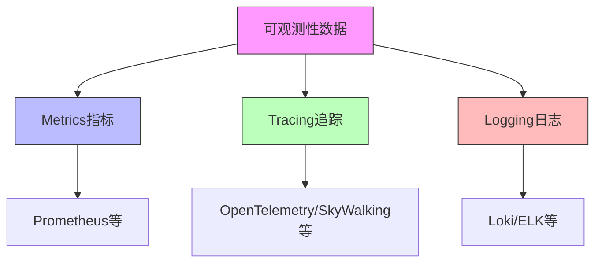
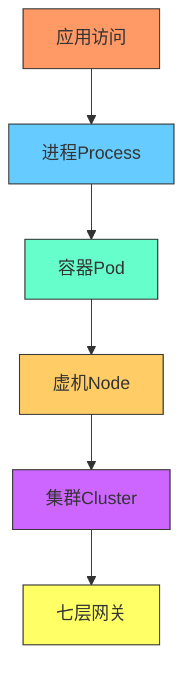
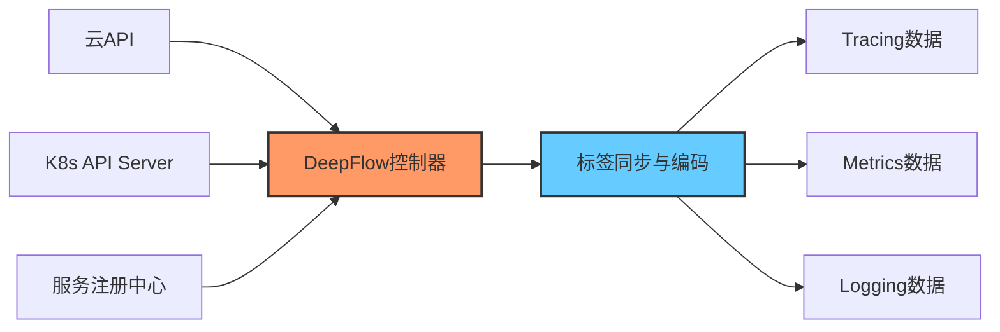
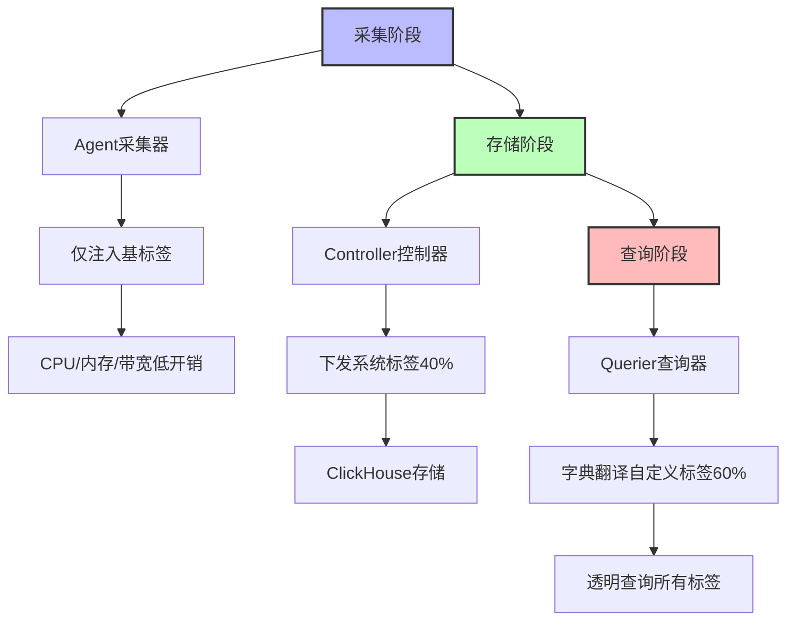
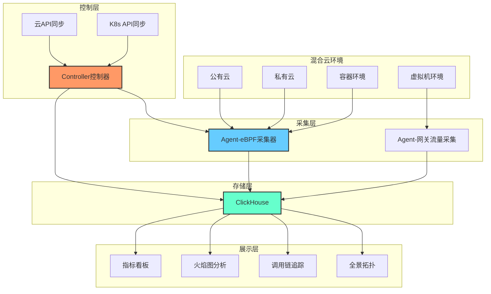
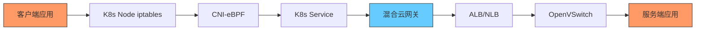
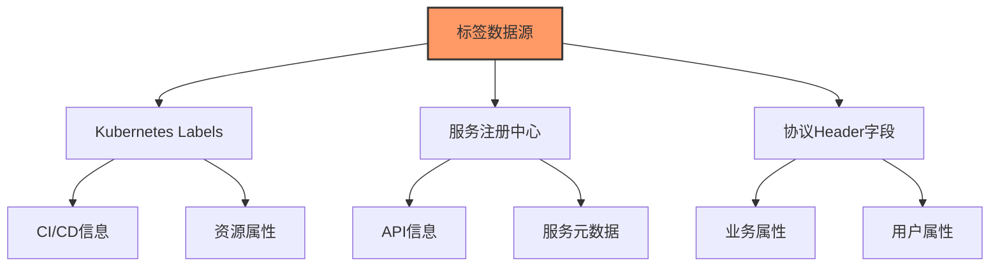
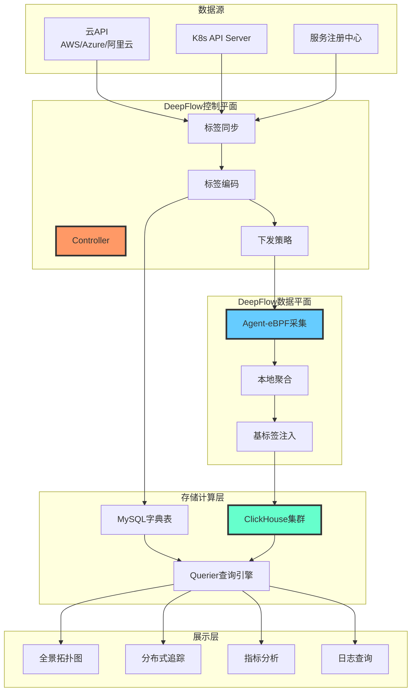
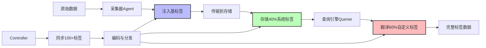

# 构建统一的云原生可观测性数据平台

> 来源：未核验 · 类型：分享 · 状态：draft

## 分享概述

本次分享聚焦于在混合云场景下，如何构建统一的云原生应用可观测性数据平台。由云杉网络DeepFlow产品团队分享在金融、运营商、能源等行业的落地实践经验，重点解决数据孤岛和资源开销两大核心挑战。

## 议题核心要点

### 1. 如何利用eBPF等技术实现数据的零侵入采集

### 2. 如何实现云原生应用零侵入的全栈、全链路追踪能力

### 3. 如何实现可观测性数据平台的统一标签、统一查询能力

### 4. 如何结合强大的开源生态构建企业的零侵入可观测性平台

---

## 一、混合云可观测性面临的核心挑战

### 1.1 可观测性的数据分类

根据Peter Bourgon的经典理论，可观测性数据分为三大类：

- **Metrics（指标）**: 时序性的度量数据
- **Tracing（追踪）**: 分布式调用链路数据
- **Logging（日志）**: 结构化或非结构化的事件记录

### 1.2 核心挑战一：数据孤岛

**问题表现：**

- 不同可观测方案（追踪派、指标派、日志派）看到的世界不一样
- 同类型数据间也存在差异（如Telegraf和Prometheus生成的指标数据格式不同）
- 开发者排查问题时需要在多个页面跳转，数据无法关联
- 前一个页面的筛选条件无法带到下一个页面

**六大数据孤岛场景：**

1. **Request Scope Metrics与非Request Scope Metrics的关联**

   - 问题：某个请求的响应时延与该实例的GC次数、CPU、内存等指标无法关联
   - 影响：难以定位请求慢与系统资源的因果关系
2. **应用层、系统层、网络层Metrics之间的关联**

   - 问题：应用Service的QPS/IOPS与底层虚机/容器的CPU/内存无法关联
   - 影响：纵向分析能力受限
3. **Metrics与非Aggregated Log的关联**

   - 问题：QPS降低与进程Error日志、系统日志无法快速关联
   - 影响：根因分析效率低
4. **日志内部的关联**

   - 问题：应用日志Error与系统日志的关联关系不清晰
   - 影响：问题定界困难
5. **非Request Scope Log与Trace的关联**

   - 问题：系统日志异常与Request响应时延增大的关系难以发现
   - 影响：混合云场景下问题定位复杂
6. **Trace内部的关联**

   - 问题：代码层Trace与网络路径Trace（iptables、CNI、网关、LB等）割裂
   - 影响：云原生场景下全链路追踪不完整

### 1.3 核心挑战二：资源开销

**问题表现：**

- 高基数字段（High Cardinality Tag）需要排除或转换
- Tracing和Logging数据没有聚合，体量巨大
- 后端存储压力大，常需要采样来降低成本
- 标签注入工作量大（两个微服务通信可能涉及上百个标签）

**资源消耗痛点：**

- CPU开销：每笔数据都需要编码处理
- 内存开销：标签数据占用大量内存
- 磁盘开销：字符串标签存储占用空间是编码后的10-20倍
- 带宽开销：采集器与存储间的数据传输

---

## 二、Auto Tag技术：解决数据孤岛

### 2.1 OpenTelemetry的标签体系借鉴

OpenTelemetry通过Context上下文机制关联Metrics、Trace、Log：

- **静态标签**：服务名称、Region、AZ、工作负载等
- **动态标签**：HTTP请求属性、业务自定义属性等
- **关联机制**：通过Trace ID、Span ID在指标和日志中追加ID实现关联

**局限性：**

- 标签覆盖不全面（如缺少请求相关的API级别属性）
- 无法覆盖非Request Scope的场景
- 云原生环境下的网络路径追踪能力不足

### 2.2 混合云场景下的完整标签体系

**资源层标签（静态）：**

微服务间访问需要穿越的资源层级：

- Region/AZ（区域/可用区）
- 资源池
- VPC（虚拟私有云）
- 子网
- 宿主机
- 虚拟机/容器
- Pod/进程
- 七层网关/负载均衡

**Kubernetes体系标签：**

- Cluster（集群）
- Namespace（命名空间）
- Deployment/StatefulSet（工作负载）
- Pod（容器组）
- Container（容器）
- Service（服务）
- 10+个系统定义标签

**自定义标签：**

- CI/CD相关：Commit ID、Deploy ID、Stage
- 业务相关：Owner、Team、Environment
- 典型客户环境中自定义标签可达60+个
- **双端标签总数可达100+**（客户端+服务端，系统定义40个+自定义60个）

### 2.3 Auto Tag实现机制

**核心思路：**
从已有数据源自动同步标签，避免开发者手动注入

**数据源：**

1. 云厂商API（公有云/私有云）
2. Kubernetes API Server
3. 服务注册中心（逐步扩展）

**标签注入流程：**

**单端标签 vs 双端标签：**

- **单端标签**：在某个Pod上采集的数据，打上该Pod的服务和资源标签（相对简单）
- **双端标签**：需要查找对端信息，对端可能是IP、Service、LB等（难度上升）

**混合云多租户场景：**

- IP重叠问题：通过VPC结合来标注
- 对等连接：感知VPC对等连接，精准找到对端
- 依赖SDN深厚积累，能处理复杂网络拓扑

### 2.4 Auto Tag效果展示

**多维度拓扑自动绘制：**

- 按VPC维度
- 按宿主机维度
- 按Cluster维度
- 按Pod/IP/进程维度
- 按Service维度

**知识图谱构建：**

- 标签间关联关系清晰
- 支持立体化、图形化展现
- 任意点击可查看完整关联标签
- 支持任意维度的聚合、下钻、跳转

**六大孤岛场景的打通：**
所有Metrics、Trace、Log数据打上统一标签后，六种数据孤岛场景可无缝关联，每份数据都具备更好的切分和下钻能力。

---

## 三、多阶段编解码技术：解决资源开销

### 3.1 挑战：100+标签的资源消耗

如果直接注入100个标签，每个标签平均50-60字节：

- 存储空间：字符串存储占用巨大
- CPU开销：每笔数据编码消耗高
- 内存开销：标签数据占用大
- 带宽开销：采集器到存储的传输量大

**必须解决：如何在注入丰富标签的同时，不造成资源消耗飙升？**

### 3.2 三阶段编解码架构

#### 3.2.1 采集时编码（Agent阶段）

**核心概念：基（Key）**

- 标签间存在推导关系，找到"基"标签即可推导其他标签
- 混合云场景：VPC + IP 可推导租户、对端虚机等
- 服务场景：API URL 可匹配HTTP路径，Service Name + Method可推导服务信息

**只注入基标签：**

- 采集器只需注入极少量关键标签
- 通过控制器下发的关键标签解决歧义问题
- 其他标签在后续阶段通过推导获得

**效果：**

- CPU开销：1个单位（基准）
- 内存开销：最小化
- 带宽开销：不侵占工作负载资源

#### 3.2.2 存储时编码（Controller & Storage阶段）

**系统标签存储（40%）：**

- 资源层标签：Region、AZ、VPC、Subnet、Host、VM等
- Kubernetes标签：Cluster、Namespace、Deployment、Pod、Service等
- 这些标签覆盖所有粒度，可推导自定义标签

**自定义标签不存储（60%）：**

- Environment（开发/生产环境）可关联到K8s Cluster
- Commit ID 可关联到Deployment
- 自定义标签可通过系统标签推导

**ClickHouse字典机制：**

- 数据中存储标签ID，不存字符串
- 字典表存储 ID ↔ Name 映射关系
- 集群每个节点同步字典表（通过MySQL或文件）
- 查询时通过字典表JOIN

**效果：**

- CPU开销：采集阶段已编码，存储阶段无需重复计算
- 磁盘开销：相比字符串存储降低10-20倍

#### 3.2.3 查询时解码（Querier阶段）

**字典翻译：**

- ClickHouse字典机制：ID → Name 映射
- 性能优于传统JOIN（字典表小，可常驻内存）

**自定义标签映射：**

- 通过Querier组件实现标签值翻译
- 贪心映射原则：映射到最大范围资源
  - Cluster级标签 → 映射到Cluster
  - Namespace级标签 → 映射到Namespace
  - Pod级标签 → 映射到Pod

**映射示例：**

- 过滤条件 `env=production` → 翻译为 `k8s_cluster=prod-cluster-1`
- 分组条件 `GROUP BY env` → 翻译为 `GROUP BY k8s_cluster`

**效果：**

- 上层使用透明：查询就像所有标签都存在一样
- 实际只存40%标签，60%通过映射获得
- 某些场景下查询性能反而提升（扫描数据量更小）

### 3.3 性能对比测试

**测试场景：写入标签数据**

| 方案                                                    | CPU开销 | 磁盘开销 | 说明                    |
| ------------------------------------------------------- | ------- | -------- | ----------------------- |
| **Multi-Stage Encoding**``（DeepFlow方案） | 1x      | 1x       | 采集时编码+部分标签存储 |
| **Low Cardinality**``（存储时编码）        | 10x     | 2-3x     | 每笔数据存储时编码      |
| **String存储**``（直接存字符串）           | 5x      | 10-20x   | 最朴素方案              |

**生产环境数据：**

- 监控规模：600个K8s节点，8000个Pod
- 消耗资源：6台同规格虚机（负载约50%）
- 写入速率：**每秒100万条数据**
- 每行数据：**100-150列**（包含Tag和Metrics）
- 资源消耗占比：**生产集群的1%**

**性能提升倍数：**

- 指标数据（Metrics）和四层流日志：10-20倍提升
- 七层应用日志（HTTP等）：数倍提升（日志内容占比较大）

---

## 四、基于eBPF的零侵入采集技术

### 4.1 eBPF技术优势

**零侵入特性：**

- 无需修改应用代码
- 无需注入Agent或SDK
- 无需重启应用

**全语言覆盖：**

- 支持任何编程语言（Java、Go、Python、C++、Node.js等）
- 支持任何中间件、存储、消息队列

**全栈追踪：**

- 应用层协议解析（HTTP、gRPC、MySQL、Redis、Kafka等）
- 网络层追踪（TCP、UDP流量）
- 系统层追踪（系统调用、进程、文件IO）

### 4.2 DeepFlow架构

**组件说明：**

- **Agent**：部署在工作负载上，基于eBPF零侵入采集
- **Controller**：同步20+主流云平台和K8s的元数据
- **Storage**：基于ClickHouse实时数仓
- **Querier**：处理查询请求，标签映射翻译

### 4.3 全链路追踪能力

**云原生场景的完整链路：**

**追踪覆盖：**

- 代码层：函数调用、方法执行
- 容器层：Pod间通信、Service访问
- 网络层：iptables规则、CNI网络插件、负载均衡
- 基础设施层：物理/虚拟网络、网关、防火墙

---

## 五、统一标签的最佳实践原则

### 5.1 标签来源的标准化

**原则：标签应该存在于正确的数据源，避免重复注入**

**1. Kubernetes Labels（K8s场景）**

- 部署时通过CI/CD注入：Commit ID、Deploy ID、Stage、Owner等
- 利用K8s原生Label机制
- 自定义标签充分利用

**2. 服务注册中心**

- 服务注册时带上：API URL、服务相关信息
- 适用于非K8s环境或K8s补充

**3. 协议Header字段**

- HTTP/gRPC Header：业务标签（地域、平台、版本等）
- 示例：iOS/Android区分、地域统计
- eBPF自动捕获协议通信，获取Header标签

### 5.2 开发者最佳实践

**懒人原则：**

- 标签已经存在，不要重复创建
- 遵循标准化，避免重复工作
- 标准带来自由

**推荐做法：**

1. 上线服务时，在K8s中充分打标签
2. 服务注册时，带上丰富的元数据
3. 业务标签通过协议Header传递
4. 让自动化机制处理标签注入

**避免做法：**

- 在观测数据生成时手动注入标签（重复劳动）
- 在多个地方维护同一标签（不一致风险）
- 使用非标准化的标签注入方式

### 5.3 DeepFlow的理念

**让观测更加自动：**

- 减少开发者工作负担
- 自由选择框架和语言
- 自由选择可观测方案
- 多派别方案联动（与SkyWalking、Prometheus等生态兼容）

---

## 六、实践案例与落地思考

### 6.1 落地行业与场景

**主要行业：**

- 金融行业（银行、证券、保险）
- 运营商
- 能源行业
- 互联网企业

**典型场景：**

- 私有云环境
- 混合云环境（公有云+私有云）
- 容器化云原生应用
- 传统虚机与容器混合

### 6.2 与主流开源生态集成

**可集成的开源方案：**

| 数据类型 | 主流方案                  | 集成方式     |
| -------- | ------------------------- | ------------ |
| Metrics  | Prometheus、Telegraf      | 统一标签关联 |
| Tracing  | SkyWalking、OpenTelemetry | Trace ID关联 |
| Logging  | Loki、ELK                 | 标签关联     |

**DeepFlow的定位：**

- 追踪派（基于eBPF的零侵入追踪）
- 未来以数据源方式集成其他派别数据
- 统一展现所有可观测数据

### 6.3 问题排查效率提升

**传统方式：**

1. 在APM中发现请求慢
2. 跳转到指标系统查看CPU/内存（手动筛选实例）
3. 跳转到日志系统查看错误日志（手动输入条件）
4. 来回跳转，筛选条件无法传递

**统一标签后：**

1. 在APM中发现请求慢
2. 一键下钻到该实例的所有系统指标（自动带上所有标签）
3. 一键关联到该实例、该时间段的所有日志（自动过滤）
4. 任意维度分组对比分析（Pod、Service、Cluster等）

**效率提升关键：**

- 自动关联，无需手动跳转
- 自动过滤，无需重复输入条件
- 多维下钻，任意粒度分析

---

## 七、关键技术总结

### 7.1 Auto Tag核心价值

✅ **解决数据孤岛**

- 统一标签体系
- 六大孤岛场景打通
- 任意数据间无缝关联

✅ **提升分析能力**

- 多维度下钻
- 细粒度切分
- 知识图谱构建

✅ **降低运维负担**

- 零手动注入
- 自动同步标签
- 开发者友好

### 7.2 Multi-Stage Encoding核心价值

✅ **极致性能**

- 存储空间降低10-20倍
- CPU开销降低到1/10
- 支持100+维度标签

✅ **分阶段优化**

- 采集时：最小化开销
- 存储时：选择性存储
- 查询时：透明翻译

✅ **使用透明**

- 上层无感知
- 查询体验一致
- 性能反而提升

### 7.3 eBPF零侵入核心价值

✅ **全栈覆盖**

- 应用层（HTTP、gRPC、数据库等）
- 网络层（TCP、UDP流量）
- 系统层（系统调用、进程）

✅ **零侵入**

- 无需修改代码
- 无需注入SDK
- 支持所有语言

✅ **完整链路**

- 代码层追踪
- 容器网络追踪
- 云网络追踪

---

## 八、技术架构图

### 8.1 整体架构

### 8.2 标签处理流程

---

## 九、Q&A精选

### Q1: 业界主流数据分析工具有哪些特点？

**指标派（Metrics）：**

- **Prometheus**：云原生时代的王者，K8s生态标配
- **Telegraf + Grafana**：轻量级组合，灵活性高

**追踪派（Tracing）：**

- **SkyWalking**：600+ Contributor的大型社区，Java生态强大
- **OpenTelemetry**：标准化追踪协议，多语言支持

**日志派（Logging）：**

- **Loki**：Index-Free理念，通过标签检索，成本低
- **ELK**：传统强大方案，全文检索能力强

**商业化产品：**

- 云厂商监控（AWS CloudWatch、阿里云监控等）
- 独立SaaS服务（Datadog、New Relic等）
- DeepFlow等专注云原生场景

### Q2: DeepFlow与传统网管软件（思科、IBM）的差异？

**DeepFlow：**

- 面向云原生应用
- 没有云就没有DeepFlow
- 聚焦应用层和业务层问题

**传统网管：**

- 面向传统网络设备
- 聚焦网络层流量监控
- SDN流量监控有部分重叠，但不是同一领域

### Q3: 如何处理敏感数据？

**常见敏感数据：**

- HTTP Body中的用户信息
- 数据库查询中的具体值
- 交易码、身份信息等

**处理方法：**

1. **直接抹除**：替换为问号或星号
2. **哈希替换**：MD5或简单哈希，保留识别效果
3. **不采集Body**：只采集Header和元数据

**示例：**

- MySQL监控：采集SQL语句，参数值替换为 `?`
- HTTP监控：采集URL和Method，不采集Body

### Q4: 大量读取同一时间段数据如何优化？

**优化方案：**

1. **Cache层**：ClickHouse本身有Cache
2. **上层Cache**：在查询引擎上构建Cache层
3. **查询结果缓存**：相同查询直接返回缓存结果

### Q5: 可以直接部署在EKS等托管K8s上吗？

**完全支持：**

- EKS（AWS）
- AKS（Azure）
- ACK（阿里云）
- 各类K8s发行版

**部署方式：**

- 后端组件：通过Helm一键部署到K8s集群
- Agent采集器：
  - K8s环境：通过DaemonSet部署
  - 虚机环境：二进制进程部署（无依赖库）

---

## 十、核心收获

### 1. 如何利用eBPF实现数据零侵入采集

- **eBPF内核技术**：无需修改应用代码，自动捕获系统调用和网络数据包
- **协议解析**：自动识别HTTP、gRPC、MySQL、Redis等20+应用协议
- **全语言支持**：Java、Go、Python、C++等任何语言，任何中间件
- **本地处理**：在Agent端聚合为指标，降低传输和存储开销

### 2. 如何实现零侵入的全栈、全链路追踪

- **代码层追踪**：通过eBPF获取函数调用栈
- **容器网络追踪**：捕获Pod间通信、Service访问
- **云网络追踪**：感知iptables、CNI、负载均衡、网关等路径
- **自动关联**：通过统一标签体系，代码层与网络层Trace自动关联

### 3. 如何实现统一标签、统一查询

- **Auto Tag技术**：从云API、K8s API、服务注册中心自动同步100+标签
- **标签分类**：资源标签、容器标签、服务标签、自定义标签
- **统一注入**：所有Metrics、Trace、Log打上相同标签体系
- **透明查询**：上层查询无感知，所有标签统一过滤、分组、下钻

### 4. 如何结合开源生态构建零侵入平台

- **DeepFlow核心**：基于eBPF的零侵入采集 + Auto Tag + Multi-Stage Encoding
- **开源存储**：ClickHouse实时数仓，高性能字典机制
- **生态集成**：与Prometheus、SkyWalking、OpenTelemetry、Loki等兼容
- **统一展现**：所有数据源通过统一标签关联，一个平台查看全部可观测数据

---

## 附录：技术名词对照

| 英文术语             | 中文译名             | 说明                               |
| -------------------- | -------------------- | ---------------------------------- |
| Observability        | 可观测性             | 通过外部输出推断系统内部状态的能力 |
| Metrics              | 指标                 | 时序性的度量数据                   |
| Tracing              | 追踪/链路追踪        | 分布式系统中请求的调用链路         |
| Logging              | 日志                 | 结构化或非结构化的事件记录         |
| eBPF                 | 扩展的伯克利包过滤器 | Linux内核技术,可零侵入观测系统     |
| Auto Tag             | 自动标签             | 自动从数据源同步并注入标签的技术   |
| Multi-Stage Encoding | 多阶段编解码         | 分阶段优化标签存储和查询的技术     |
| High Cardinality     | 高基数               | 标签值的种类非常多,难以枚举        |
| ClickHouse           | -                    | 开源列式数据库,适合实时分析        |
| Request Scope        | 请求作用域           | 与单个请求相关的数据               |
| Knowledge Graph      | 知识图谱             | 数据间关联关系的图形化表示         |

---

## 总结

构建统一的云原生可观测性数据平台需要解决两大核心挑战：**数据孤岛**和**资源开销**。DeepFlow通过**Auto Tag技术**实现了100+标签的自动注入和统一关联，打通了Metrics、Tracing、Logging之间的六大孤岛场景。通过**Multi-Stage Encoding技术**，在采集、存储、查询三个阶段进行编解码优化，实现了10-20倍的性能提升，同时保持上层使用的透明性。结合**eBPF零侵入采集技术**，实现了全语言、全栈、全链路的自动化追踪能力。

这套技术方案的核心理念是**让标签无处不在，让开发者无需手动注入**，通过标准化和自动化，降低可观测性平台的建设和运维成本，提升问题排查效率。
