# 从Zabbix传统监控到应用可观测平台的演进之路

> 来源：未核验 · 类型：分享 · 状态：draft

## 目录

- [一、可观测性的理解](#一可观测性的理解)
- [二、传统设备监控的瓶颈](#二传统设备监控的瓶颈)
- [三、引入Prometheus带来的改变](#三引入prometheus带来的改变)
- [四、以应用为中心重构观测视角](#四以应用为中心重构观测视角)
- [五、应用可观测平台的未来展望](#五应用可观测平台的未来展望)
- [六、Q&amp;A精选](#六qa精选)

---

## 一、可观测性的理解

### 1.1 核心概念

**可观测性（Observability）** 描述的是系统状态可以被感知到的程度，它是系统的一种属性，类似于可用性、可靠性等。

**监控（Monitoring）** 是用来感知系统状态的其中一种运维手段。

> 💡 **关键区别**：可观测性是系统的属性，监控是实现可观测性的手段之一。

---

## 二、传统设备监控的瓶颈

### 2.1 传统监控金字塔模型

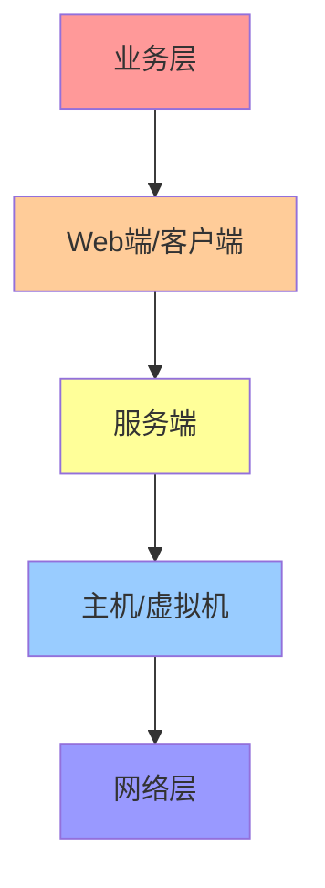

#### 各层关注指标

| 监控层级               | 关注指标                           | 分类     |
| ---------------------- | ---------------------------------- | -------- |
| **网络层**       | 联通性、带宽、丢包率               | 基础监控 |
| **主机/虚拟机**  | 存活状态、负载、存储使用情况       | 基础监控 |
| **服务端**       | 请求耗时、成功率、错误日志         | 业务监控 |
| **Web端/客户端** | 卡顿、闪退、延迟                   | 业务监控 |
| **业务层**       | 注册成功率、登录成功率、充值成功率 | 业务监控 |

### 2.2 初期场景与Zabbix的适配

**初期监控场景特征：**

- 核心机房：1个
- 监控主机数量：千级别
- 数据上报粒度：1分钟/点
- 每分钟指标量级：10万级别
- 告警规则数量：百级别

> ✅ 在这种场景下，Zabbix基本可以满足监控和告警需求，工作良好。

### 2.3 云原生化带来的挑战

#### 2.3.1 容器化技术的影响

**部署方式变化：**

- 从主机/VM → 容器部署
- 从直接服务调用 → Service Mesh网格调用

**监控对象数量激增：**

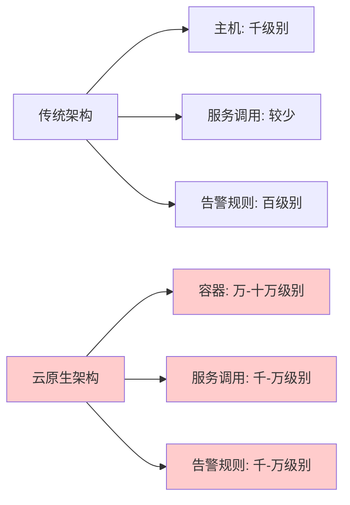

#### 2.3.2 多机房混合云部署挑战

**架构演进：**

- 单机房 → 多机房海内外部署
- 单一云商 → 混合云架构
- 需要考虑专线成本

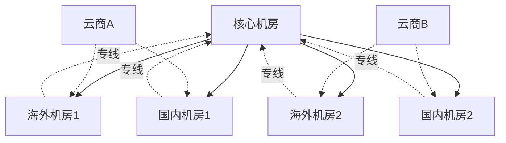

### 2.4 核心瓶颈总结

#### 三大核心问题：

1. **容器化支持不足**

   - Zabbix对容器化项目的指标采集缺少便捷的处理方式
2. **时间线膨胀**

   - 时间线从10万级别增长到1000万级别
   - Zabbix难以承受如此大的量级
3. **跨集群方案缺失**

   - 在混合云多机房场景下，缺乏跨集群、跨机房的集群方案

#### 需要解决的三个核心问题：

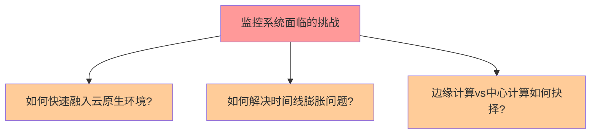

---

## 三、引入Prometheus带来的改变

### 3.1 为什么选择Prometheus？

#### 三大核心优势：

1. **云原生友好**

   - 支持Kubernetes Service Discovery配置
   - 自动发现Node、Pod、Service、Ingress等5类K8s资源
2. **丰富的生态支持**

   - 支持多种Remote Write Adapter
   - 便于数据转发到自研平台进行二次处理
3. **活跃的开源社区**

   - 版本迭代快速
   - 问题容易得到社区关注和解决

### 3.2 解决时间线膨胀问题

#### 3.2.1 理解时间线（Time Series）

**时间线产生示例：**

假设有指标 `server_response_time`，包含2个标签：

- `status_code`：5种可能取值
- `method`：2种可能取值

**结果：** 产生 5 × 2 = **10条时间线**

**生产环境复杂场景：**

- 标签数量：20+个
- 服务间调用五元组：源服务 + 目标服务 + 源IP + 目标IP + 调用接口
- **时间线数量：轻松达到2000万级别**

#### 3.2.2 Prometheus内存占用

| 时间线数量 | 内存占用                 |
| ---------- | ------------------------ |
| 30万       | 3 GB                     |
| 100万      | 40 GB                    |
| 1000万+    | 单实例难以支撑，需要分片 |

#### 3.2.3 解决方案：流计算维度收缩

**核心思路：** 通过大数据平台的流计算能力，实现时间线在维度上的收缩。

**架构设计：**

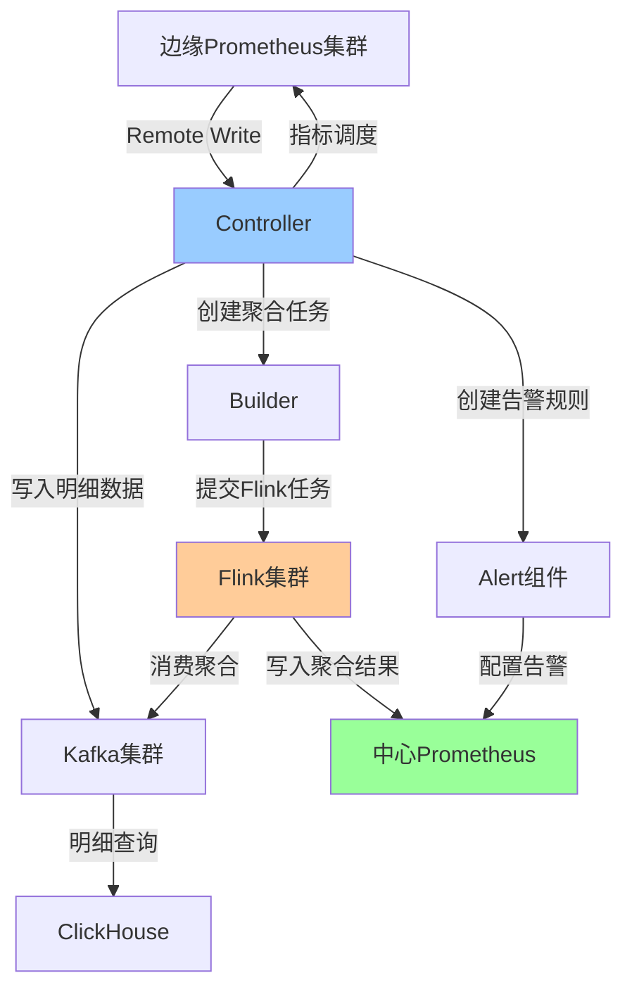

**三大核心组件：**

1. **Controller（控制器）**

   - 调度所有Prometheus节点
   - 指定哪些指标需要Remote Write到中心集群
   - 实现指标的按需采集（非全量采集）
2. **Builder（构建器）**

   - 创建流计算聚合任务
   - 提交任务到Flink集群
3. **Alert（告警组件）**

   - 创建告警规则
   - 提交给Prometheus完成告警功能

**数据流转：**

1. 边缘Prometheus采集指标 → Remote Write到Kafka
2. Flink消费Kafka数据 → 维度聚合计算
3. 聚合结果写入中心Prometheus
4. 明细数据存储在ClickHouse供后续查询

### 3.3 边缘计算 vs 中心计算

#### 3.3.1 对比分析

| 维度               | 边缘计算                    | 中心计算                        |
| ------------------ | --------------------------- | ------------------------------- |
| **专线成本** | ✅ 无成本                   | ❌ 成本较高                     |
| **存储成本** | ❌ 需存储全量数据，成本较高 | ✅ 仅存储聚合数据，成本较低     |
| **查询延迟** | ✅ 无延迟                   | ⚠️ 有延迟（等待时间窗口聚合） |
| **全局视角** | ⚠️ 仅支持部分场景         | ✅ 支持全部场景                 |

#### 3.3.2 混合计算方案

**采用策略：** 中心调度下的混合计算

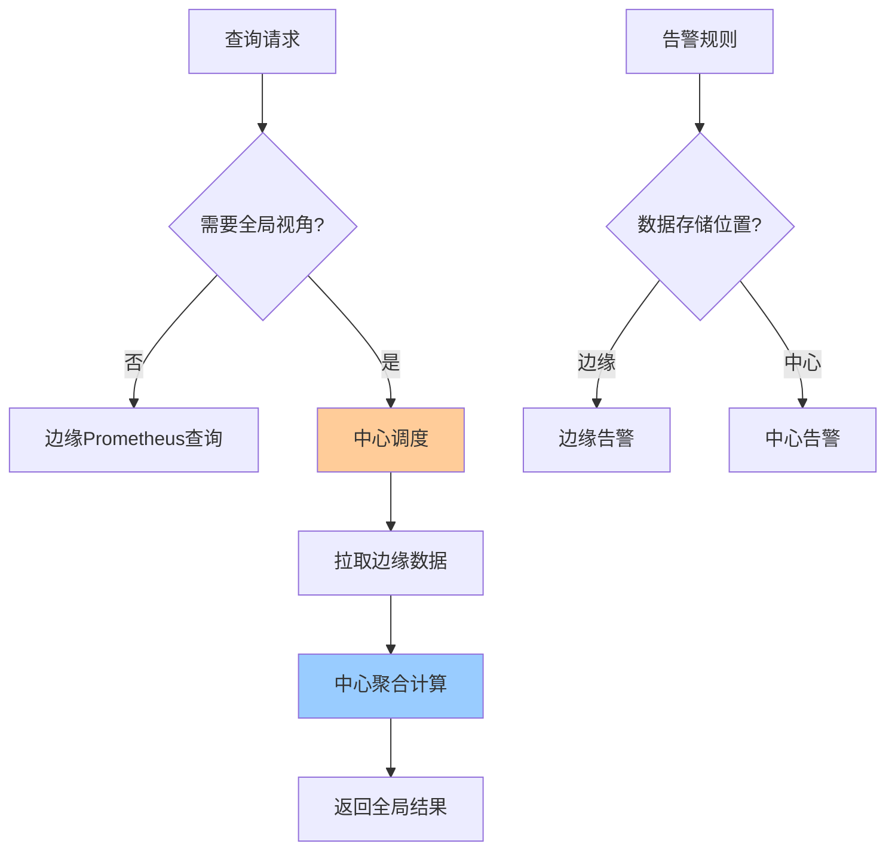

**核心原则：**

- 常规场景：使用边缘Prometheus查询
- 全局视角：数据从边缘拉取到中心进行聚合计算
- 告警策略：**计算在哪里，告警就在哪里**
- 关键能力：**中心调度能力**

---

## 四、以应用为中心重构观测视角

### 4.1 问题背景

传统监控系统的痛点：

- 每一层都是独立系统（网络监控、基础监控、服务端监控等）
- 故障排查需要在多个系统间切换
- 缺乏统一的排查方法论
- 排查效率低下

### 4.2 以应用为中心的观测模型

#### 4.2.1 核心指标：应用SLI

**核心指标：**

- QPS（请求量）
- 请求耗时
- 成功率/失败率

#### 4.2.2 三层扩展模型

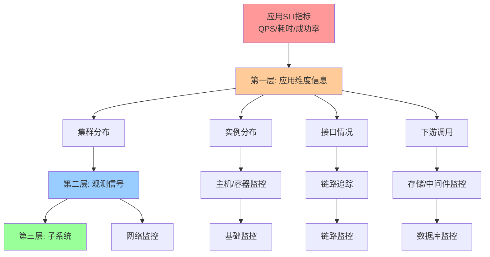

**三层结构说明：**

1. **第一层：应用维度信息**

   - 集群分布
   - 实例分布
   - 接口情况
   - 下游调用关系
2. **第二层：观测信号**

   - 主机/容器监控信号
   - 链路追踪信号
   - 日志信号
   - 网络监控信号
3. **第三层：子系统**

   - 基础监控系统
   - 链路监控系统
   - 网络监控系统
   - 数据库监控系统

### 4.3 信号关联：案例一（基础设施问题）

#### 排查流程

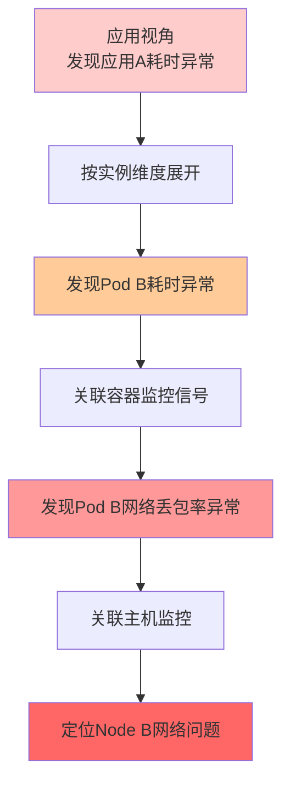

**详细步骤：**

1. **应用视角** → 发现应用A请求耗时异常
2. **实例维度展开** → 对比Pod A、Pod B、Pod C的指标
3. **发现异常实例** → Pod B耗时明显高于其他实例
4. **关联容器监控** → 查看Pod B的CPU、内存、网络指标
5. **发现网络异常** → Pod B网络丢包率异常
6. **关联主机监控** → 定位到Node B主机网络问题

**信号转换路径：** 应用指标 → 容器指标 → 主机指标

### 4.4 信号转换：案例二（应用逻辑问题）

#### 排查流程

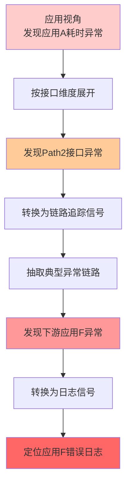

**详细步骤：**

1. **应用视角** → 发现应用A请求耗时异常
2. **接口维度展开** → 对比Path1、Path2、Path3的指标
3. **发现异常接口** → Path2接口耗时明显异常
4. **转换为链路信号** → 根据应用+路径+时间范围查询调用链
5. **抽取典型链路** → 自动识别异常链路
6. **发现下游异常** → 应用A依赖的应用F出现异常
7. **转换为日志信号** → 查询应用F在该时间段的错误日志
8. **定位根因** → 找到应用F的具体错误原因

**信号转换路径：** 应用指标 → 链路追踪 → 日志

### 4.5 元数据中心：支撑信号关联

#### 4.5.1 挑战

- 需要快速的元数据查询能力
- 指标量级：每分钟2000万+
- 传统方式直接从存储捞取元数据，性能不足

#### 4.5.2 解决方案：图数据库

**为什么选择图数据库？**

- 监控数据具有典型的拓扑结构
- 层与层之间存在包含关系
- 图数据库擅长节点连接和关系查询

**拓扑层次结构：**

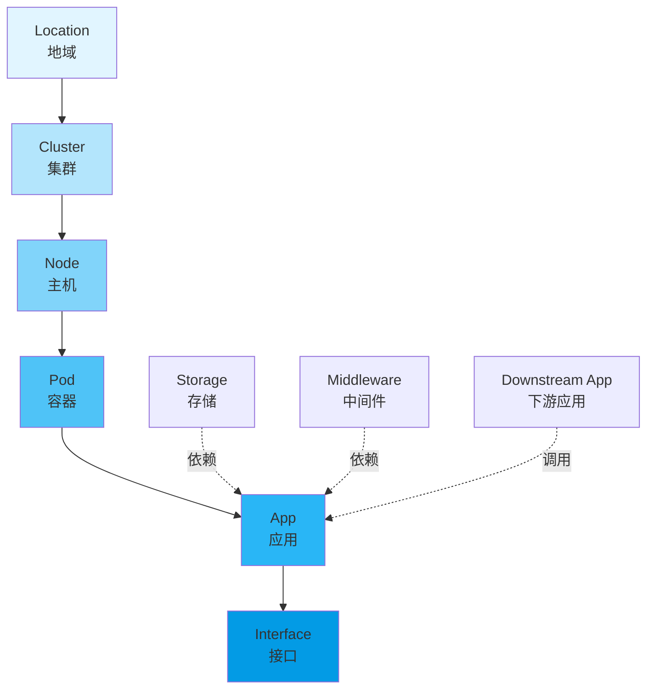

**图数据库存储方案：**

1. **分层存储**

   - 每一层存储同类型元数据
   - 上下层建立归属关系
2. **关系建模**

   - App → 部署在 → Pod
   - Pod → 运行在 → Node
   - Node → 属于 → Cluster
   - Cluster → 位于 → Location
3. **性能优化**

   - 查询效率提升：**10倍+**
   - 支持快速生成动态拓扑结构
   - 使用布隆过滤器优化写入
     - 内存缓存：80-200MB布隆过滤器
     - 过滤已存在的元数据，避免重复写入
     - 仅写入新增元数据

---

## 五、应用可观测平台的未来展望

### 5.1 AI能力接入

#### 5.1.1 自动阈值调整

- 通过AI自动学习历史数据
- 在不同时间段动态设置告警阈值
- 减少误报和漏报

#### 5.1.2 自动故障定位

- 通过根因分析（Root Cause Analysis）
- 自动识别故障发生位置
- 缩短MTTR（平均修复时间）

#### 5.1.3 自动抽取典型链路

- 在排查问题时自动识别异常链路
- 提取有代表性的异常调用链
- 提升问题排查效率

#### 5.1.4 曲线模式识别与无阈值告警

**实现方式：**

- 学习指标在过去一周/一个月的波动范围
- 绘制正常波动区间
- 识别超出正常范围的异常

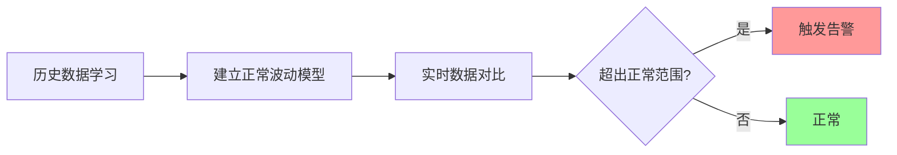

### 5.2 基于eBPF的探索

#### 5.2.1 eBPF的优势

**核心能力：** 在内核中完成可观测性数据采集

**探索方向：**

1. **调度层面可观测**

   - CPU调度延迟
   - 进程调度分析
2. **内存层面可观测**

   - 内存分配追踪
   - 内存泄漏检测
3. **网络层面可观测**

   - 网络包追踪
   - 网络延迟分析
4. **链路追踪**

   - **无侵入式链路追踪**
   - 无需修改应用程序代码
   - 极低的性能开销

#### 5.2.2 优秀开源项目

**推荐项目：** [Pixie](https://px.dev/)

- 基于eBPF的安全可观测能力
- 无需更改应用程序
- 极低开销实现深度可观测性

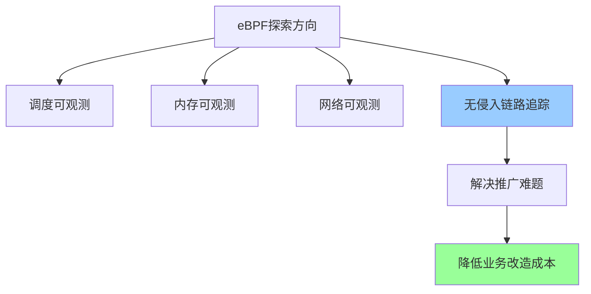

---

## 六、Q&A精选

### Q1: Prometheus数据缺少副本，如何避免数据丢失？

**A:** 两种方案：

1. **Remote Storage方案**

   - 使用Prometheus的Remote Storage功能
   - 支持S3、ClickHouse等第三方存储
   - 将本地数据转存到持久化存储
2. **Thanos方案**

   - 使用Thanos实现高可用
   - 自动处理数据备份和长期存储

### Q2: 业务或数据达到什么规模时适合引入Prometheus？

**A:** 主要看监控对象数量：

| 监控对象类型 | 数量级        | 建议方案            |
| ------------ | ------------- | ------------------- |
| 主机/虚拟机  | 千级别        | Zabbix可满足        |
| 容器         | 万~十万级别   | 建议Prometheus      |
| 服务间调用   | 百万~千万级别 | 必须Prometheus+分片 |

### Q3: 数据跨区调度如何保证一致性？

**A:**

- 通过专线方式进行数据传输
- 单一数据源，避免多源冲突
- 中心集群保存原始数据副本用于对比验证
- 实践中专线传输一致性问题不大

### Q4: Prometheus集群化和水平扩展如何实现？

**A:**

- Prometheus严格意义上不支持集群化
- **采用分片方案：**
  - 多个Prometheus实例分别采集部分时间线
  - 每个实例处理1/4或1/5的采集任务
  - 使用Thanos等方案实现联合查询

**挑战：**

- 存在数据倾斜问题（某些节点任务特别重）
- 目前没有完美的解决方案

### Q5: 元数据变更如何处理？

**A:** 使用布隆过滤器优化：

- 服务层内存维护布隆过滤器（80-200MB）
- 缓存时间线的存在状态
- 仅写入新增元数据到图数据库
- 大幅降低写入量，避免打爆图数据库

### Q6: 边缘计算和中心计算如何选择？

**A:** 根据场景选择：

**边缘计算适用场景：**

- 数据量不大
- 查询延迟要求高
- 不需要全局视角

**中心计算适用场景：**

- 需要跨集群聚合查询
- 例如：查询同一服务在3个集群的整体耗时
- 需要全局视角的指标

**实践建议：**

- 默认使用边缘计算
- 需要全局视角时拉取数据到中心聚合
- 通过Flink或物化视图实现中心聚合

### Q7: 现在遇到最头疼的问题是什么？

**A:** 主要挑战：

1. **告警风暴**

   - 每天产生几十万条告警
   - 需要告警收敛和智能降噪
2. **业务侵入性**

   - 链路追踪推广困难
   - 需要业务方改造服务
   - 探索eBPF等无侵入方案

### Q8: 可观测性技术选型：自研 vs 开源 vs 商业？

**A:** 具体问题具体分析：

| 场景规模         | 建议方案                   |
| ---------------- | -------------------------- |
| 小规模           | Zabbix或Prometheus开源方案 |
| 中等规模         | Prometheus + 部分自研组件  |
| 大规模、复杂场景 | 自研 + 开源结合            |

**核心原则：** 没有通用方案，根据业务规模和复杂度选择

### Q9: Logs、Metrics、Trace打通有开源方案吗？

**A:**

- 开源社区正在推进（关注Grafana生态）
- 推荐关注官方进展
- 内部也在自研实现

---

## 总结

### 核心要点

1. **可观测性 ≠ 监控**

   - 可观测性是系统属性
   - 监控是实现手段
2. **云原生带来的挑战**

   - 监控对象数量激增（千级 → 万级 → 千万级）
   - 需要新的技术栈支撑
3. **Prometheus的价值**

   - 云原生友好
   - 丰富的生态
   - 活跃的社区
4. **混合计算架构**

   - 边缘计算处理常规查询
   - 中心计算支撑全局视角
   - 中心调度是关键
5. **以应用为中心**

   - 统一观测视角
   - 信号关联与转换
   - 提升排查效率
6. **未来方向**

   - AI赋能（自动阈值、根因分析）
   - eBPF探索（无侵入可观测）

### 架构演进路径

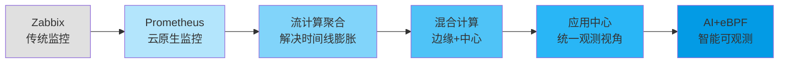

---

> 📝 **文档说明**：本文档根据TT语音张家欣的技术分享整理而成，内容涵盖从传统监控到现代可观测平台的完整演进路径，适合SRE、运维及稳定性保障工程师参考学习。
