# 转转一体化监控系统搭建实战

> 来源：未核验 · 类型：分享 · 状态：draft


## 分享嘉宾

**袁通** - 转转架构部存储小组负责人

主要负责:
- RocksDB 二次开发与运维
- Mix 监控系统落地
- Redis、KV 存储及基础服务

## 一、背景与问题

### 1.1 监控系统的重要性

监控系统在企业内承担着核心角色,具备以下能力:
- 实时采集反馈数据
- 提前预知故障告警
- 辅助问题定位
- 辅助性能调优
- 辅助容量规划
- 辅助自动化运维

### 1.2 转转原有监控系统现状

转转之前存在多套监控系统,各自服务不同场景:

| 监控系统 | 面向对象 | 特点 |
|---------|---------|------|
| 自研监控系统 | 业务使用 | 应用最广泛,提供简单API(Sum/Max/Min/Avg),按分钟维度聚合,存储使用MySQL |
| Open-Falcon | 运维机器资源 | - |
| Zabbix | 运维机器资源 | 数据重叠 |
| Prometheus | TiDB监控 | - |
| 数据库平台 | MySQL监控 | - |
| Redis监控平台 | Redis监控 | - |
| 云平台监控 | Kafka、PTS监控 | - |
| 服务管理平台 | RPC调用 | 监控调用方与服务方的耗时、QPS、成功率、失败率 |
| Graphite | 机器资源与MySQL | - |
| CAT | 机器资源与业务指标 | - |

### 1.3 存在的问题

#### 业务端问题

1. **监控系统散乱**: 查看一次请求异常需要找遍多个监控系统,经常出现错看、漏看、不知道怎么看的问题
2. **功能较弱**: 很多监控系统功能单一,无法满足监控需求(如无法监控QPS、P99等)
3. **UI体验差**: 自研系统由后端开发,缺乏前端资源,UI经常被吐槽
4. **学习成本高**: 每个监控系统都需要重新学习

#### 架构端问题

1. **维护成本高**: 每个监控系统都需要专人维护
2. **缺乏前端资源**: 架构部没有前端人员
3. **缺乏统一规划**: 监控数据无法一体化

### 1.4 需求梳理

#### 业务需求

- **一体化**: 一个监控系统解决所有监控需求
- **功能丰富**: 满足各种场景的监控需求
- **UI美观**: 提升用户体验
- **简单易用**: 降低学习成本

#### 架构需求

- **低维护成本**: 借助开源社区持续迭代
- **简单易用**: 降低运维复杂度
- **统一规划**: 对监控进行统一管理

## 二、技术选型

### 2.1 方案对比

面临两条路:

**方案一: 保持原状,资源迭代**
- 缺点: 人力有限,迭代慢,维护成本高,需要重新设计API(难以推动)
- 优点: 用户习惯保持不变

**方案二: 搞一套新的一体化平台** ✅ 最终选择
- 优点: 甩掉历史包袱,统一规划,借助开源社区力量
- 缺点: 用户习惯需要迁移

### 2.2 监控系统调研

| 系统 | 特点 | 结论 |
|-----|------|------|
| CAT | 更适合链路监控与日志监控 | ❌ |
| 夜莺 v4 | 简易版 Prometheus+Grafana,侧重资源监控,告警模块人性化 | 参考告警设计 |
| 自研监控 | 简单但不够强大,不够灵活 | ❌ |
| **Prometheus** | 灵活的查询语言PromQL,丰富的Exporter生态 | ✅ 最终选择 |

### 2.3 Prometheus 架构

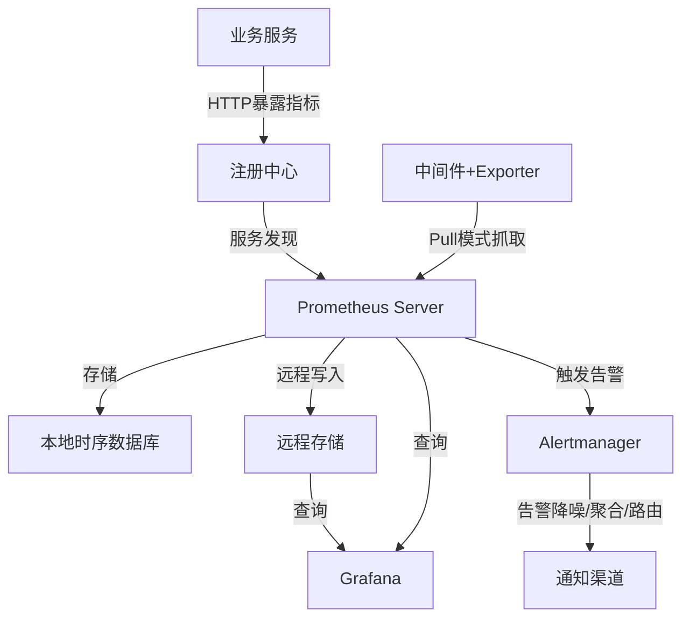

#### Prometheus 优点

1. **生态完善**: 丰富的Exporter生态,覆盖常见中间件
2. **PromQL强大**: 数据只需上报一次,可做任意过滤、聚合、计算
3. **社区活跃**: 持续迭代更新
4. **扩展性高**: 完整的监控解决方案

#### Prometheus 问题

**存储问题**: 自带单机时序库不够用

**解决方案**: 选择 M3DB 作为远程存储

### 2.4 M3DB 存储方案

**M3DB 简介**:
- Uber 开源的分布式时序数据库
- 专为 Prometheus 设计
- 支持 Prometheus 读写协议
- 高数据压缩比
- 夜莺(滴滴)强烈推荐

**M3DB 架构**:

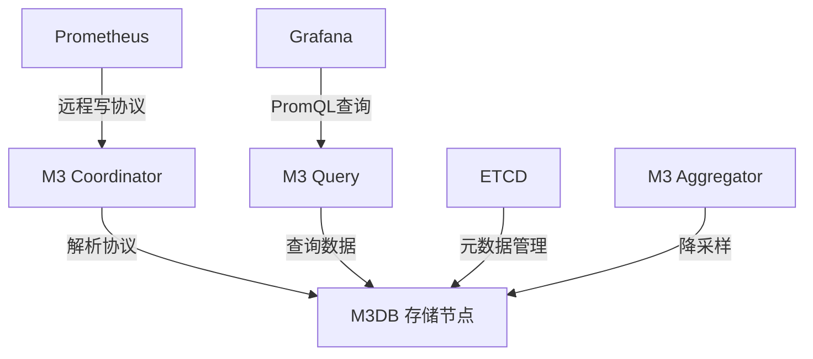

**降采样策略**:
- 原始采样: 15秒采集一次,保留1个月
- 1分钟降采样: 保留3个月
- 5分钟降采样: 保留1年

## 三、架构设计与优化

### 3.1 传统架构的问题

传统 Prometheus 架构链路复杂:

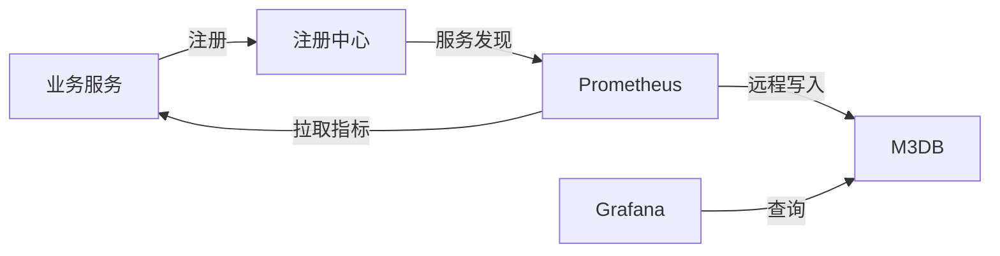

**问题**:
1. 业务服务链路复杂(注册中心→服务发现→指标抓取→远程存储)
2. 中间件需要手动配置IP地址

### 3.2 优化后的架构

**核心优化思路**:
1. **业务服务**: Pull模式改为Push模式,直接推送到远程存储
2. **中间件**: 继续使用Pull模式,但利用HTTP服务发现对接CMDB实现自动化

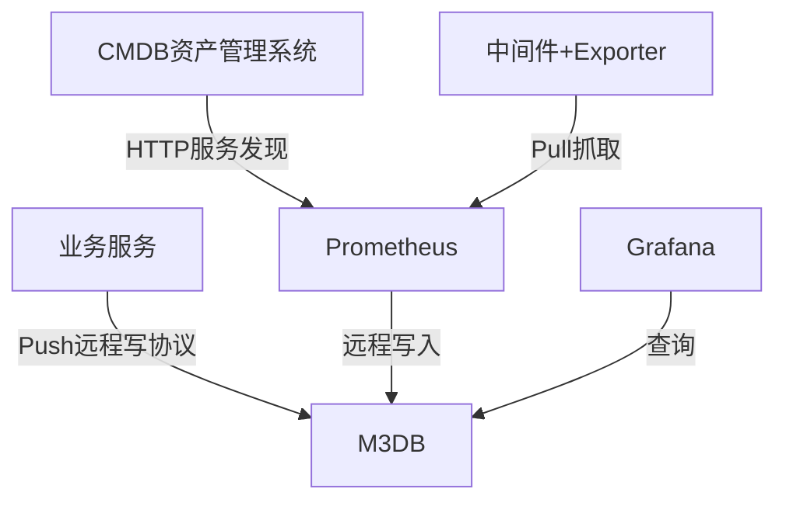

**优势**:
- SDK非常清爽,去掉注册中心依赖
- 链路简单,运维成本低
- 省略注册中心和Prometheus采集环节

### 3.3 SDK设计

基于 Prometheus 原生客户端进行轻量改造:

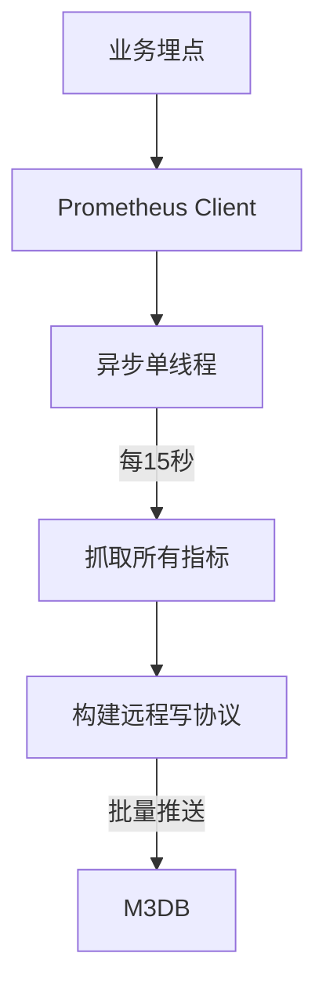

**特点**:
- 基于 Protobuf + Snappy 压缩
- 近乎零依赖
- 兼容原生客户端API
- 高性能: QPS千万级,耗时纳秒级
- 内存占用低,取决于标签数量

### 3.4 中间件自动化采集

**对接CMDB实现自动化**:


**优势**: 增减Exporter实例只需修改CMDB,无需修改Prometheus配置

## 四、Grafana看板规划

### 4.1 看板目录结构

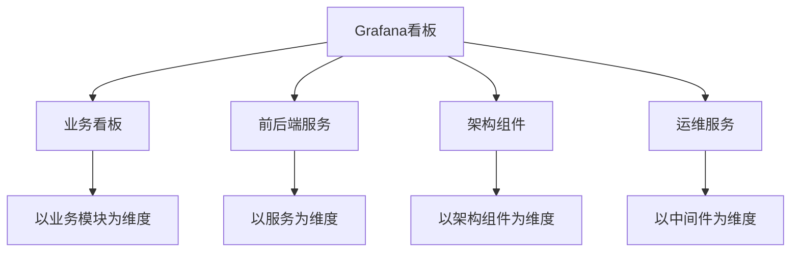

| 看板类型 | 维度 | 内容 | 初始化方式 |
|---------|------|------|-----------|
| 业务看板 | 业务模块 | 核心监控指标 | 手动初始化 |
| 前后端服务 | 服务 | 服务内所有监控 | 自动初始化 |
| 架构组件 | 基础组件 | 组件监控 | 手动初始化 |
| 运维服务 | 中间件 | MySQL、Redis等 | 手动初始化 |

### 4.2 服务看板自动化

**对接服务信息管理系统,为每个服务自动初始化看板**

**看板变量**:
1. **环境**: 测试/生产环境切换
2. **服务器IP**: 服务部署的IP列表
3. **聚合维度**: 控制看板如何聚合(按服务/按IP等)

### 4.3 中间件看板自动化

**自动识别并创建中间件监控看板**:

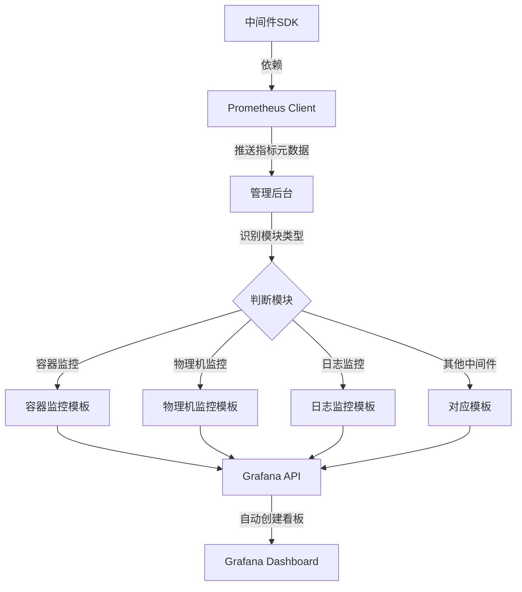

**实现原理**:
1. 中间件SDK依赖Prometheus客户端
2. 客户端推送指标元数据到管理后台
3. 管理后台识别指标所属模块
4. 提前为每个模块初始化好JSON模板
5. 通过Grafana API将模板插入到Dashboard的panels中

**Grafana Dashboard JSON结构**:
```json
{
  "dashboard": {
    "rows": [
      {
        "title": "行标题",
        "panels": [
          // 这里插入中间件模板
        ]
      }
    ]
  }
}
```

### 4.4 认证与权限管理

**认证方案**: 基于 OAuth Proxy

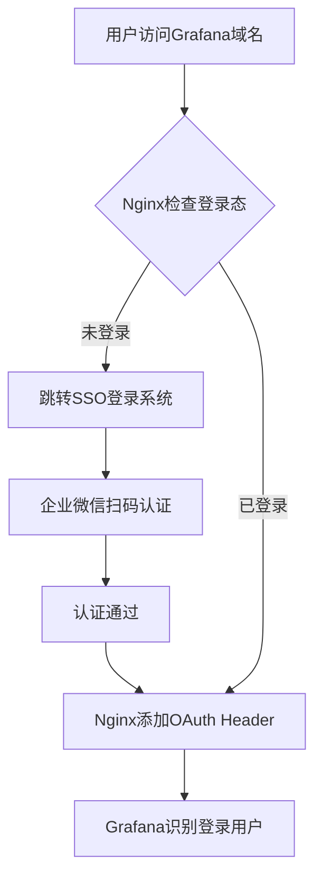

**权限管理**:
- 对接内部员工系统
- 同步服务开发人员权限
- 初始化到Grafana权限系统

## 五、降本增效

### 5.1 业务指标自动创建看板

**目标**: 消除业务同学学习PromQL和Grafana配置的成本

**实现方式**: 根据指标类型自动创建对应看板

#### Counter 类型

**常见监控场景**: QPS、数量、总数量

**自动创建看板**:
- QPS趋势图
- 累计数量
- 时间段总数量

**示例**: 上传图片数指标自动生成3个看板

#### Gauge 类型

**常见监控场景**: 监控原始值(配置、状态等)

**自动创建看板**:
- 实时值趋势图

#### Histogram 类型

**常见监控场景**: 数据分布统计

**自动创建看板**(以用户年龄分布为例):
1. 调用QPS(上报数据频率)
2. 调用次数
3. 年龄分布折线图(各桶曲线)
4. 环形图(各桶占比)
5. 上报总次数
6. 平均值(sum/count)
7. P99延迟
8. 热力图(颜色深浅表示分布)

**实现流程**:

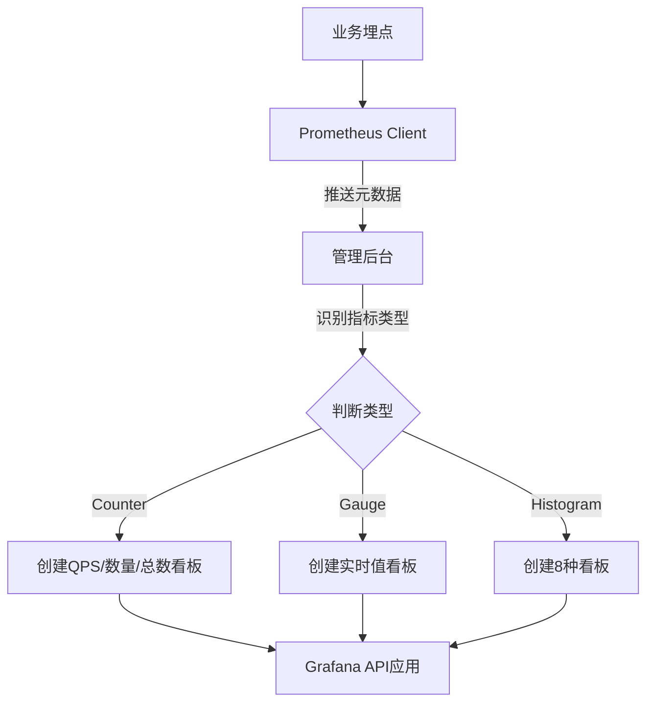

### 5.2 样板间

提供常用看板图形的样板间,业务同学可以:
- 简单复制
- 稍微修改
- 快速完成看板展示

## 六、告警系统

### 6.1 Grafana Alerting 的问题

**Grafana 8.0+ 推出 NG Alert**

**存在的问题**:
1. **学习成本高**: 业务需要手写PromQL
2. **理解成本高**: 需要了解内置指标名称、标签含义
3. **性能瓶颈**: 测试时约8000个告警就会崩溃(2022年7月测试)
4. **不支持变量**: 无法使用Dashboard变量做关联查询

**关联查询问题示例**:
```promql
# 查询当前服务使用的所有物理机负载需要关联查询
# 先查询服务实例IP,再关联物理机负载
# 这种关联查询代价大,告警中不可接受
```

### 6.2 自研告警系统

**设计参考**: 夜莺告警设计与部分源码

**架构设计**:

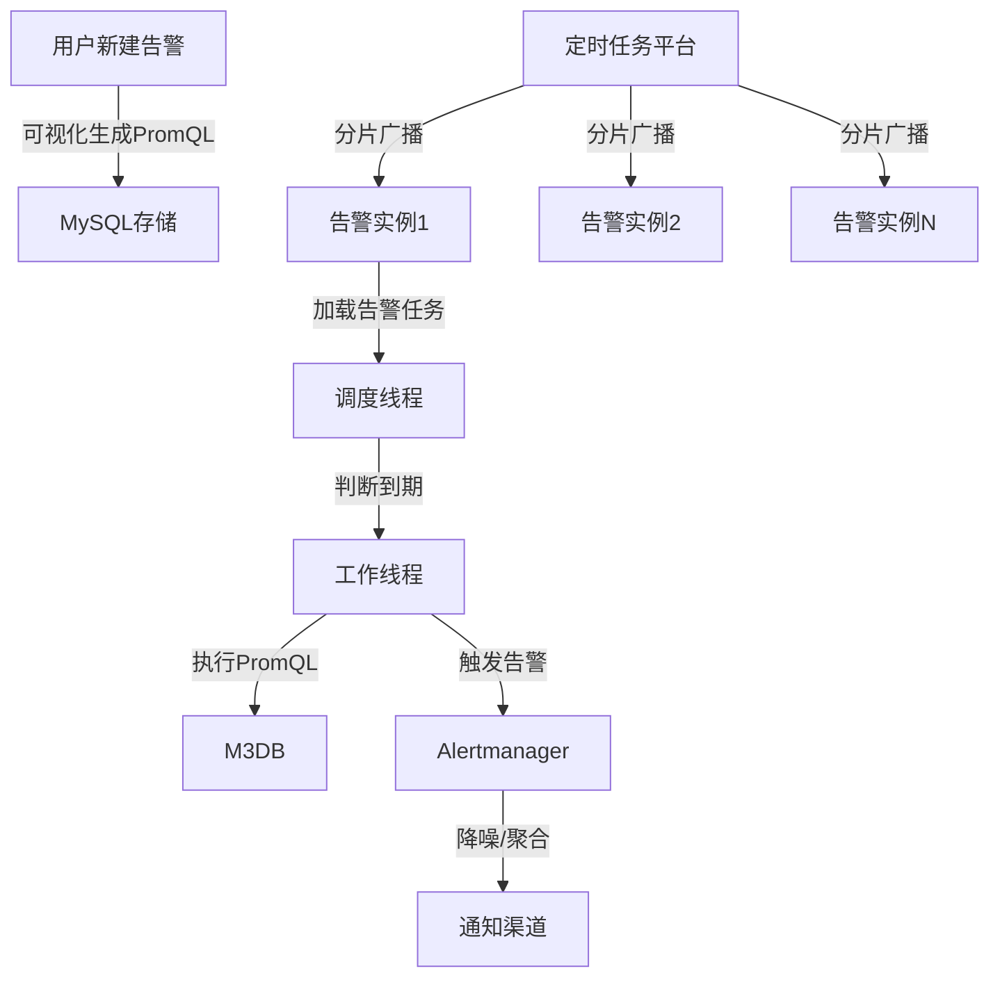

**核心特性**:
- **自动负载均衡**: 基于XXL-Job分片广播,增减实例自动balance
- **错峰执行**: 任务均匀调度,避免瞬时压力
- **性能稳定**: 告警执行QPS稳定在400左右

### 6.3 告警可视化配置

**业务指标告警**: PromQL可视化

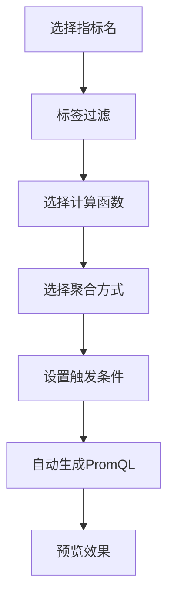

**配置步骤**:
1. 选择指标名称
2. 指定标签过滤条件
3. 选择计算方式(不同指标类型有不同函数)
4. 选择聚合维度
5. 设置触发条件(阈值、持续时间等)
6. 预览PromQL和触发条件

**中间件指标告警**: 极简配置

- 只需填写阈值即可
- 无需了解指标名称和标签含义
- 点点点完成告警设置

**默认告警**: 自动初始化

系统为每个服务自动初始化默认告警:
- 服务宕机次数
- Redis请求异常次数
- 线程池拒绝任务数
- 异常日志数量
- 等等

### 6.4 告警降噪

**对接 Alertmanager 实现告警降噪**

**降噪策略**:

1. **告警分级**: P0-P5 六个等级
   - 高等级(P0): 及时发出
   - 低等级: 减少打扰

2. **告警合并**: 同一分组内的告警自动合并
   - 识别多个IP的相同告警
   - 合并为一条通知展示

3. **公共标签提取**: 不同告警提取公共标签
   - 直观展示告警原因
   - 关联告警一起推送

**告警合并示例**:
```
原始告警:
- IP1: Android日志量异常
- IP2: Android日志量异常

合并后:
Android日志量异常
- 受影响IP: IP1, IP2
- 原因: Druid执行售后处理导致
```

## 七、落地效果

### 7.1 使用数据

| 指标 | 数据 |
|-----|------|
| 接入服务数 | 1000+ |
| 接入实例数 | 3500+ |
| 接入物理机 | 1000+ |
| 总数据量 | 13TB |
| 指标批量写入QPS | 500 |
| 样本写入QPS | 450K |

### 7.2 看板展示

#### 业务服务视角

**服务维度监控**,包含:
- JVM监控
- 日志监控(INFO/ERROR/WARN)
- 容器监控(宿主机负载、CPU、内存)
- MQ监控
- 业务指标监控

#### 架构中间件视角

**中间件维度监控**,包含:
- 数据库连接池监控
- Redis连接池监控
- 日志监控
- 分布式锁监控
- 全公司服务使用情况
- 精细化过滤和聚合

#### 运维视角

**运维中间件监控**,包含:
- ES监控
- MQ监控
- 容器监控
- 物理机监控
- Nginx监控
- Redis集群监控

#### 业务大盘

**业务模块维度监控**,包含:
- 部门服务看板(异常日志汇总)
- 具体业务模块看板(售后申请量、通过量、取消量)
- RPC监控看板(服务质量详情)
- 短信服务看板(花费、模板、计费、送达率)

### 7.3 用户反馈

- 得到业务广泛好评
- 公司内部电视大盘展示
- 开箱即用的一体化监控平台

## 八、技术亮点总结

### 8.1 架构简化

**问题**: 传统Prometheus架构链路复杂

**解决方案**:
- **业务服务**: 直接Push到远程存储,省略注册中心和Prometheus采集
- **中间件**: 继续使用Pull模式,利用HTTP服务发现对接CMDB实现自动化

**效果**:
- SDK清爽,链路简单
- 运维成本低
- 性能优秀

### 8.2 Grafana看板规划

**问题**: 看板散乱,错看漏看不知道怎么看

**解决方案**:
- **四维度划分**: 业务大盘、业务服务、架构组件、运维服务
- **自动创建服务看板**: 对接服务信息管理系统
- **自动创建中间件看板**: 识别指标元数据,自动应用模板
- **认证与权限管理**: 基于OAuth Proxy和员工系统

**效果**:
- 看板结构清晰
- 自动化程度高
- 权限隔离完善

### 8.3 降本增效

**问题**: 业务学习成本高(PromQL + Grafana配置)

**解决方案**:
- **业务指标自动创建看板**: 根据指标类型自动生成对应看板
- **样板间**: 提供常用图形模板
- **零学习成本**: 只需埋点,无需学习PromQL和Grafana

**效果**:
- 业务同学只需埋点
- 自动拥有完整监控
- 学习成本为零

### 8.4 告警管理

**问题**: Grafana Alerting难以落地(学习成本高、性能问题、不支持变量)

**解决方案**:
- **业务指标告警**: PromQL可视化配置
- **中间件指标告警**: 极简配置,只需填写阈值
- **默认告警**: 自动初始化常见告警
- **告警降噪**: 对接Alertmanager,实现分级、合并、公共标签提取

**效果**:
- 点点点完成告警设置
- 告警执行稳定(QPS 400左右)
- 降噪效果好,减少打扰

## 九、待完成工作

1. **接入Kafka监控**: 已完成,测试中
2. **接入Dubbo调用**: 进行中
3. **接入Alertmanager做告警降噪**: 测试中

## 十、Q&A精选

### Q1: 业务写入M3DB失败会影响业务吗?

**A**: 不会影响。写入M3DB是异步过程,失败不会对业务造成任何影响。

### Q2: 没有K8s环境,Prometheus比Zabbix有优势吗?

**A**: 
- Zabbix存储使用MySQL,对于监控数据不适合,指标量大会有性能瓶颈
- Prometheus有完善的时序数据库生态
- 我们正是因为没有K8s环境,所以采用主动Push模型
- 如果有K8s环境,可以利用K8s注册中心做服务发现

### Q3: 如何对接CMDB?

**A**: 
- CMDB维护各个中间件的部署IP
- Exporter端口是固定的
- Prometheus通过HTTP服务发现周期性调用CMDB接口
- 获取IP后拼接固定端口,完成自动化采集

### Q4: 默认告警指标包含哪些?

**A**: 
- 日志异常告警(ERROR日志数量)
- 服务宕机告警
- 主要针对服务的默认告警
- 推送给业务同学

### Q5: 业务看板是业务同学自己设计指标吗?

**A**: 
- 业务同学只需做埋点
- 系统提取指标的help描述作为看板标题
- 根据指标类型(Counter/Gauge/Histogram)自动创建对应看板

### Q6: 告警合并后,不同组的运维都能收到吗?

**A**: 
- Alertmanager第一步先基于人员分组
- 然后才是告警合并
- 不同组只收到自己组的告警

### Q7: ETCD用来存储什么?

**A**: 
- M3DB的元数据中心
- 存储数据分片信息
- 每台M3DB负责哪个分片的内部管理信息

### Q8: 如何实现PromQL可视化?

**A**: 
- 提取三个核心要素: 标签过滤、计算函数、聚合方式
- 根据指标类型提供对应的计算函数
- 自动生成PromQL
- 再加上阈值和触发条件完成告警配置

### Q9: 定时任务平台是什么?

**A**: 使用XXL-Job的分片广播功能

### Q10: 为什么服务用Push不用Pull?

**A**: 
- Pull需要注册中心、暴露HTTP端口、服务发现等复杂链路
- 有些服务不是HTTP服务,强制暴露端口不合理
- Push直接推送到存储,链路简单
- Prometheus仅做指标采集,反而带来负担

### Q11: 错误日志和异常日志分类是SDK埋点统计的吗?

**A**: 
- 以Logback为例
- 利用Logback的Filter功能
- 为每个服务添加全局Filter
- Filter识别日志级别(INFO/WARN/ERROR)
- 自动埋点上报

### Q12: M3DB的历史数据降采样是自带功能吗?

**A**: 是的,M3DB自带降采样功能,这是时序数据库的常见功能。

### Q13: 业务如何直接把数据推送到M3DB?

**A**: 
- Prometheus对接远程存储有统一规范(远程写协议)
- 按照规范实现即可(HTTP + Protobuf + Snappy)
- 模拟Prometheus的Push行为

### Q14: M3DB比InfluxDB等时序数据库有哪些优势?

**A**: InfluxDB开源版分布式功能收费,不在考虑范围内。

## 十一、核心价值

### 对业务的价值

1. **一体化监控**: 一个系统解决所有监控需求
2. **开箱即用**: 自动初始化看板和告警,零配置
3. **零学习成本**: 只需埋点,无需学习PromQL和Grafana
4. **体验优秀**: UI美观,功能丰富

### 对架构的价值

1. **低维护成本**: 借助开源社区力量,持续迭代
2. **架构简单**: 链路清晰,运维成本低
3. **统一规划**: 监控数据一体化管理
4. **自动化程度高**: 看板、告警自动创建

### 技术创新点

1. **Push模型改造**: 业务服务直接推送到远程存储,简化架构
2. **自动化看板**: 根据指标元数据自动创建看板
3. **PromQL可视化**: 降低告警配置门槛
4. **告警降噪**: 分级、合并、公共标签提取

---

**分享完毕,感谢阅读!**

