# B站面向故障的应急响应中心建设

> 来源：未核验 · 类型：分享 · 状态：draft


## 分享嘉宾

**洪鹏** - B站资深SRE工程师

**工作经历**：

- 曾就职于京东和360
- 多年运维开发经验
- 2019年加入B站

**负责领域**：

- 稳定性体系平台开发
- SLO质量运营体系
- 多活管控
- 面向故障的应急响应体系建设

## 一、线上故障的挑战

### 1.1 核心认知

> **重要观点**：再优秀的业务架构都无法保证系统100%可用，故障在线上环境中是不可避免的。

### 1.2 典型故障案例（过去一年）

#### 1.2.1 变更类故障

**案例1：研发发版导致视频播放故障**

- **时间**：3月5日
- **原因**：研发发版
- **影响**：APP UGC视频无法播放

**案例2：网关变更导致服务不可用**

- **时间**：7月31日
- **原因**：评论网关变更
- **影响**：服务不可用

#### 1.2.2 操作规范类故障

**案例：弹性伸缩变更导致国际站不可用**

- **时间**：4月2日
- **原因**：阿里云弹性伸缩变更
- **影响**：整个国际站不可用

#### 1.2.3 第三方故障

**案例：CDN异常导致多业务受损**

- **时间**：8月4日
- **原因**：华为CDN异常
- **影响**：多个业务受损

### 1.3 稳定性保障的三大困局

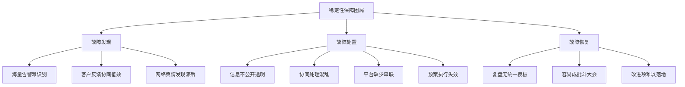

## 二、故障发现的挑战

### 2.1 告警覆盖率问题

#### 2.1.1 原因类告警泛滥

**为了提高告警覆盖率，会加入大量原因类告警**：

**系统维度**：

- CPU使用率
- 内存使用率
- I/O性能

**中间件维度**：

- MySQL慢查询
- 主从同步延时
- Redis大Key

**日志维度**：

- 错误日志告警

#### 2.1.2 带来的问题

**核心痛点**：

- ✅ SRE每天收到海量告警
- ✅ 需要人工识别哪些告警会导致故障
- ✅ 需要判断哪些需要高优处理
- ❌ 工作效率特别低
- ❌ 日常On-Call同学都在处理告警
- ❌ 没有精力关注其他稳定性问题

### 2.2 客户反馈渠道问题

#### 2.2.1 传统流程

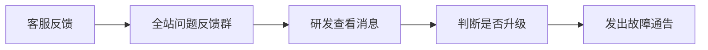

#### 2.2.2 存在的问题

**协同效率低**：

- 消息量非常多
- 容易遗漏核心功能客诉
- 研发需要与客服大量沟通
  - 进线用户地域是否集中
  - APP版本信息
  - 大量细节确认

**依赖人工**：

- 整个流程强依赖人
- 效率低下

### 2.3 网络舆情发现

**特点**：

- 占比非常少
- 发现时影响面已经很大
- 研发和商业介入时已经晚了

## 三、故障处置的挑战

### 3.1 信息不公开透明

**常见现象**：

- 服务异常时，大家默默处理
- 没有及时通报
- 等依赖方找过来才进行故障通告

### 3.2 协同处理混乱

#### 3.2.1 大型故障的特点

**参与人员多**：

- 通常拉起在线会议
- 大型故障可能有几十个人参与

**处理过程混乱**：

- 你说一句他说一句
- 分工不明确
- 缺少故障指挥官角色
- 缺少统一决策和任务分配

### 3.3 平台缺少串联

**定位和止损阶段需要同时打开多个平台**：

- 监控平台
- 日志平台
- 链路追踪
- 变更平台

**问题**：

- 平台之间缺少信息串联
- 切换成本高

### 3.4 预案执行失效

**核心问题**：

- 定位到问题后执行预案
- 发现预案已经失效
- 预案没有保鲜

**后果**：

- 导致MTTR特别长

## 四、故障恢复的挑战

### 4.1 复盘难点

**大家都会吐槽：复盘太难了**

#### 4.1.1 缺少统一模板

**问题**：

- 不知道复盘需要关注哪些内容
- 没有统一的复盘模板

#### 4.1.2 容易成批斗大会

**特别是跨部门故障**：

- 各团队互相甩锅
- 复盘效果差

#### 4.1.3 改进项难以落地

**核心问题**：

- 改进项难以落地
- 验收deadline一拖再拖

## 五、故障生命周期与应急响应目标

### 5.1 故障生命周期


### 5.2 应急响应目标（1-3-5-10）

**B站内部目标**：

- **1分钟**：发现问题
- **3分钟**：响应
- **5分钟**：定界定位
- **10分钟**：恢复

### 5.3 核心概念辨析

#### 5.3.1 定界 vs 定位

**定界（Boundary）**：

- 确定故障原因的大致范围
- 为更准确的应急决策提供依据

**定位（Root Cause）**：

- 找到故障的具体原因
- 找到问题根源

**案例说明**：

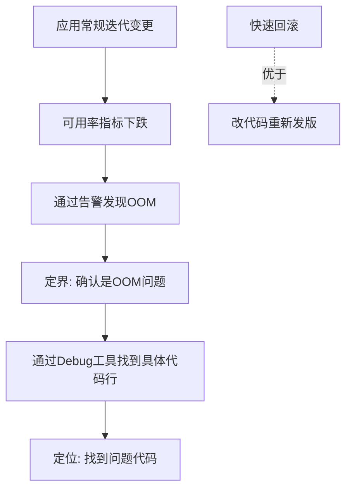

**关键理解**：

- 定界后可以快速决策（如回滚）
- 不用等定位到具体代码再处理
- 避免走完整的MR、构建、发版流程

#### 5.3.2 止损 vs 恢复

**止损（Mitigation）**：

- 目的：防止故障扩散
- 方法：选择更快的处置行为
- 目标：将业务恢复到用户可接受的状态

**恢复（Recovery）**：

- 目标：业务完全恢复到故障之前的状态

**案例说明**：

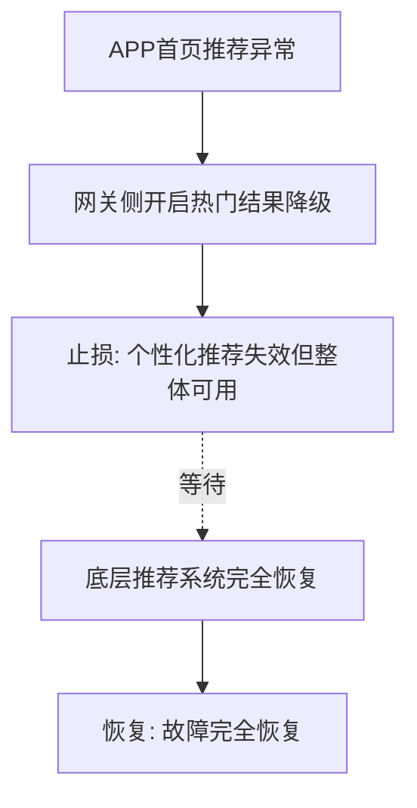

### 5.4 ERC的设计目标

**ERC（Emergency Response Center）应急响应中心**

**核心目标**：

1. **快速恢复不能预防的问题**

   - 降低MTTR
2. **保证已发生的问题不再重复发生**

   - 通过有效复盘
   - 改进措施落地

**设计原则**：

- 围绕故障生命周期设计
- 覆盖故障发现、处置、恢复全流程

## 六、高效故障发现方案

### 6.1 什么是故障？

**故障的定义**：

> 产品体验受损，无法按照预期提供服务。

**重要推论**：

- 原因类指标不是最重要的
- 原因类指标加不完
- 单台机器异常对分布式系统影响微乎其微
- 除非所有实例全部异常，最终会反映到结果指标

**核心结论**：

> 只需要关注结果类指标，因为结果类指标是可以枚举的。

### 6.2 结果类指标分类

#### 6.2.1 技术指标

**定义**：反映系统技术层面的健康度

**示例**：

- L0/L1服务的可用率
- 核心场景的可用率
- 接口响应时间
- 错误率

#### 6.2.2 业务指标

**定义**：反映业务层面的健康度

**示例**：

- 直播在线人数
- 分钟发弹幕数
- 投稿量
- 播放量

#### 6.2.3 核心原则

**判断标准**：

> 技术指标 + 业务指标 = 结果指标
>
> 如果结果指标发生异常，一定表示线上发生了故障，SRE需要立刻介入处理。

### 6.3 客服类故障发现优化

#### 6.3.1 传统流程 vs 新流程

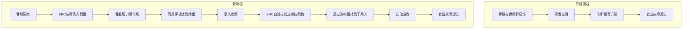

#### 6.3.2 关键优化点

**1. 客服系统对接ERC**

- 客服平台内嵌ERC故障录入页面
- 客服经过内部培训
- 客服判断同类客诉达到阈值后录入故障

**2. 自动化流程**

- ERC自动拉起应急协同群
- 通过影响面自动找到干系人
- 自动进群
- 自动发出故障通告

**3. 效率提升**

- 客服类故障发现效率大幅提升
- 全自动化流程

#### 6.3.3 技术细节

**客服分类与服务树映射**：

**问题**：

- 客服分类与内部服务树组织业务节点不完全一致

**解决方案**：

- 建立客服分类和服务树的关系映射
- 准确拉取故障干系人

**特殊节点支持**：

- 支持配置固定支持人员
- 例如：研发关注在线业务稳定性，但服务不是他负责
- 可在固定支持人员里配置

### 6.4 基于SLO的故障发现

#### 6.4.1 为什么需要SLO？

**客服来源的局限性**：

- 用户找客服时，影响面已经非常大
- 用户处于无法容忍的状态才会客诉
- 只能作为辅助手段

**需要更高效的发现方式**：

- 基于SLO升级
- SLO用来度量业务稳定性
- 基于错误预算做故障升级
- 能够准确判断故障发生

#### 6.4.2 覆盖范围的探索

**初期做法（踩坑）**：

- 覆盖线上L0和L1的全部应用
- 灰度期间召回很多故障
- 但很多故障是无效的

**问题分析**：

- 底层服务抖动
- 业务网关侧有重试、降级逻辑
- 对用户无影响
- 通过告警处理更合理
- 没必要升级为故障

**优化后的覆盖范围**：

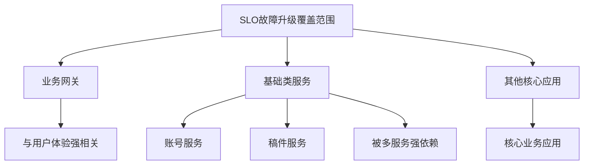

#### 6.4.3 故障风暴抑制

**问题场景**：

- 基础组件或基础设施异常
- 大量业务受影响
- 同时拉起大量应急协同群（10-20个）
- 出现故障风暴

**抑制策略**：

**1. 业务域收敛**

- 同一业务域（如社区）
- 包含：弹幕、评论、点赞等
- 5分钟内SLO异常收敛到一个故障

**2. 同业务不同应用收敛**

- 同一业务的不同应用
- 例如：弹幕interface、弹幕job
- 收敛到一个故障

**3. 支持人工合并**

- 平台支持人工合并故障

#### 6.4.4 SLO升级实践

**示例配置**：

- **应用SLO目标**：三个九（99.9%）
- **故障阈值**：95%
- **含义**：一分钟消耗了50分钟的错误预算

**计算逻辑**：

```
SLO目标: 99.9%
允许错误率: 0.1%
故障阈值: 95%（可用率）
可容错率: 5%

5% / 0.1% = 50倍
即：1分钟消耗了50分钟的错误预算
```

**判断标准**：

> 此时SRE需要立刻介入处理

### 6.5 业务指标监控

#### 6.5.1 技术指标的局限性

**SLO只能发现服务不可用问题**

**无法发现的问题**：

- 逻辑异常
- 用户频繁掉登录
- 用户充值失败
- 功能异常但服务可用

**结论**：

> 需要业务指标来发现这类问题

#### 6.5.2 业务指标选择标准

**核心原则**：

- ✅ 能够描述业务稳定性
- ✅ 指标异常一定表示功能受损
- ❌ 不要什么指标都加

#### 6.5.3 业务指标实施流程

**前置工作**：

- 业务SRE对业务深入摸排
- 与业务方共同选择指标

**指标分类**：

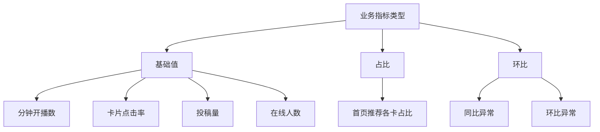

**数据来源**：

- 少部分：存储在日志
- 大部分：打点上报到Prometheus

#### 6.5.4 平台能力建设

**核心能力**：

1. **指标定义**

   - 支持多基础值组合
   - 支持不同类型组合
   - 降噪能力
2. **异常检测**

   - 同比异常检测
   - 环比异常检测
   - 阈值告警

**实际案例**：

- 稿件业务视频审核指标
- 同比/环比异常上涨或下跌
- 都认为是故障

### 6.6 其他故障发现方式

#### 6.6.1 人工录入优化

**优化点**：

- 优化交互逻辑
- 简化录入流程
- 减少信息割裂

#### 6.6.2 Open API对接

**提供Open API**：

- 供第三方系统对接
- 减少信息割裂

**使用场景**：

- CIS团队：基础设施类异常故障通告
- 监控团队：告警一键升级故障

**防止滥用**：

- 仅对SRE团队和监控团队开放
- 约定好使用场景
- 避免误升级（非故障升级为故障）

### 6.7 故障发现效果

**当前成效**：

- ✅ **故障自动召回率**：80%以上
- ✅ **故障有效率**：80%以上

## 七、高效协同处理机制

### 7.1 自动拉群机制

#### 7.1.1 拉群策略

**自动触发故障**：

- 一个故障对应一个应急协同群
- ERC自动拉群

**固定群支持**：

- 业务有专门故障处理群
- 信息同步到固定群

#### 7.1.2 群内信息推送

**第一条消息**：

- TC制定的故障处理标准流程
- 加强先止损意识

**持续推送**：

- 故障首次通告
- 故障进展更新
- 故障完结通知

**关联信息推送**：

- 错误分析
- 影响的可用区
- 具体的Pass Code及错误数
- 可观测链接

**价值**：

- 帮助SRE和研发快速判断
- 快速决策

### 7.2 角色分工机制

#### 7.2.1 两大核心角色

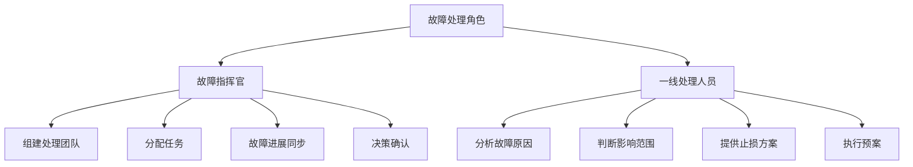

#### 7.2.2 协作流程

**故障指挥官职责**：

- 组建处理团队
- 分配任务
- 故障进展同步更新
- 做决策

**一线处理人员职责**：

- 分析故障原因
- 判断影响范围
- 提供止损方案
- 待指挥官确认后执行预案

**价值**：

> 各司其职，更高效协同处理

### 7.3 故障升级机制

#### 7.3.1 背景

**B站特点**：

- 没有7x24小时团队
- 故障经常发生在非工作时间
- 需要提高非工作时间响应效率

#### 7.3.2 升级策略

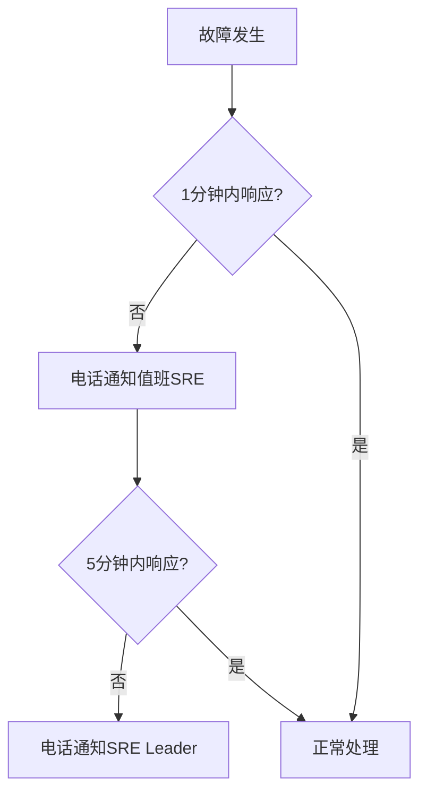

**升级规则**：

- **1分钟无响应**：电话通知值班SRE
- **5分钟无响应**：电话通知SRE Leader

#### 7.3.3 响应效果

**当前成效**：

> 线上故障100%在3分钟内完成响应

### 7.4 移动端办公能力

#### 7.4.1 痛点场景

**SRE无法7x24小时在电脑旁**：

- 上下班路上
- 出差过程中
- 地铁里

**传统处理方式的痛点**：

- 需要拿电脑
- 需要连VPN
- 地铁里需要下车找地方处理
- 非常不方便

#### 7.4.2 移动端能力

**核心功能**：

- 故障响应
- 故障查看
- 快速决策
- 预案执行

**价值**：

- 更高效响应故障
- 随时随地处理故障

## 八、快速定界定位能力

### 8.1 可观测能力

**依赖的能力**：

- 可观测平台
- 根因定位能力

### 8.2 根因定位方法

**层级下钻分析**：

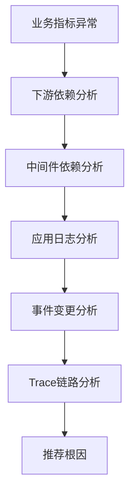

**分析维度**：

- 业务指标
- 下游依赖
- 中间件依赖
- 应用日志
- 事件变更
- Trace链路

**输出**：

- 给出推荐根因

## 九、止损恢复机制

### 9.1 预案三板斧

**最常见的止损方式**：

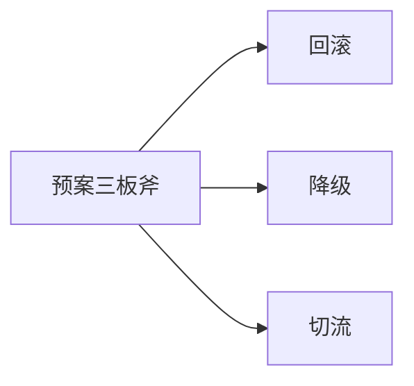

**核心原则**：

> 一切以恢复业务为最高优先级

### 9.2 其他止损手段

**扩展方法**：

- 限流
- 扩容
- 重启

**特点**：

- 都是止损恢复的利器

## 十、有效复盘机制

### 10.1 复盘的重要性

**核心问题**：

> 故障恢复后是不是就完事了？如何避免此类故障再次发生？

**答案**：

> 通过有效复盘

### 10.2 优秀复盘的模块

#### 10.2.1 故障处理过程回溯

**内容**：

- 时间线梳理
- 什么时间点
- 哪位同学
- 做了什么操作

**目的**：

- 让复盘参与人员了解完整时间线

#### 10.2.2 故障影响分析

**内容**：

- 影响摘要描述
- 故障影响面
- 影响线上服务时长

#### 10.2.3 反思总结

**架构编码层面**：

- 是否暴露问题
- 架构设计缺陷
- 代码质量问题

**变更类问题**（70%故障由变更导致）：

- 能否在灰度过程中发现
- 发布时能否有指标阻断
- 能否在变更过程中拦截

**处理过程优化**：

- 1-3-5-10是否有优化空间
- 发现环节能否更快
- 响应环节能否更快
- 定位环节能否更快
- 恢复环节能否更快

#### 10.2.4 定级定责

**统计内容**：

- 客诉量
- 舆情影响
- 资损
- PV损失

**输出**：

- 故障定级
- 明确责任方

#### 10.2.5 改进措施

**遵循SMART原则**：

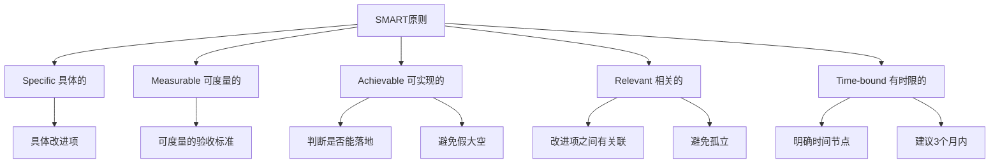

**关键要素**：

- 具体改进项描述
- 确定完成时间
- 待办负责人
- 验收人
- 优先级
- 改进措施完成时间

**注意事项**：

- 避免假大空
- 避免落地不了
- 如需很长时间，最好拆分
- 一般3个月内比较好

### 10.3 复盘平台优化

#### 10.3.1 优化前的问题

**痛点**：

- 复盘与故障缺少关联
- 是单独模块
- 用户填写成本高
- 故障信息需要重新填一次

#### 10.3.2 优化后的方案

**核心改进**：

- 复盘变成故障的一个状态
- 故障恢复后可开启复盘
- 故障状态变为"复盘中"
- 信息自动串联

**富文本支持**：

- 解决方案支持富文本
- 原因分析支持富文本
- 支持图文模式
- 不会只有文字难以理解

**在线文档托管**：

- 支持在线文档复盘
- 适合大型故障
- 适合习惯用在线文档的团队

## 十一、运营数据与度量

### 11.1 统计方式选择

#### 11.1.1 两种统计方式对比

**累加统计**：

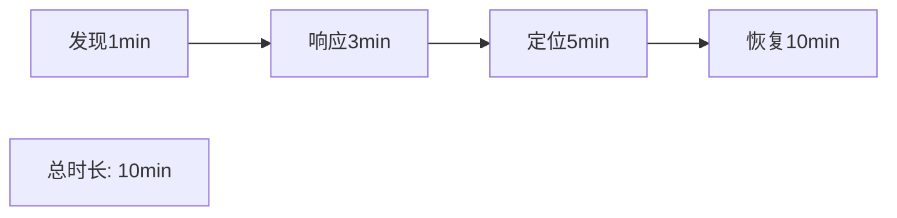

**优势**：

- 统计方便

**劣势**：

- 每个阶段耗时不直观
- 不利于持续优化

**分段统计**：

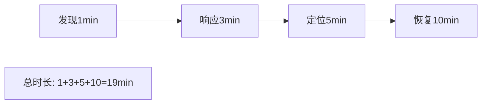

**优势**：

- 每个阶段时长清晰
- 有助于针对性改进

**劣势**：

- 统计稍微复杂

#### 11.1.2 B站的选择

**采用分段统计**：

- 有助于推动每个阶段的改进工作
- 针对性优化

### 11.2 核心运营指标

#### 11.2.1 1-3-5-10达成情况

**统计维度**：

- 整体达成率趋势图
- 90分位时间

**为什么用90分位？**

- 去掉长尾故障
- 有些故障确实发现、定位、恢复时间长
- 需要去掉长尾影响

#### 11.2.2 故障数量趋势

**统计内容**：

- 每周故障数趋势图
- 故障类型分布

#### 11.2.3 故障质量指标

**关注指标**：

- 故障有效率
- 故障准确率

**目的**：

- 评估故障发现质量
- 持续优化召回策略

## 十二、Q&A精选

### Q1: 定位是依赖监控工具做人工判断，还是有故障决策工具？

**答**：

- 由可观测团队提供能力
- 通过AIOps做关联分析
- 通过指标下钻
- 不是人工判断

### Q2: 自动召回如何保证准确率？会不会有误触发？

**答**：

- 初期覆盖L0/L1全部业务，准确率低
- 优化后只覆盖业务网关和基础服务
- 去除限流-509等用户预期内的错误码
- 不统计在可用率计算中
- 持续优化提升准确率

### Q3: 怎么把控故障在各个环节的时间长短，做到1-3-5-10？

**答**：

- 1-3-5-10是长远目标
- 不是每个故障都要达到
- 具体分析每个故障
- 看各环节花费时间
- 有没有改进措施
- 通过持续运营达到目标

### Q4: 1分钟发现是强依赖监控系统，平台这里做什么？

**答**：

- 大部分强依赖监控系统
- 监控系统与ERC联动
- SLO升级和业务指标在告警侧生成规则
- 触发告警推到MQ
- ERC消费MQ数据
- 根据应急场景匹配规则
- 匹配上则拉起应急协同群
- 进行后续故障处理流程

### Q5: 主要建立了几种故障恢复预案？

**答**：

- 需要与各业务沟通
- 每个业务预案不一样
- 例如：搜索、推荐有网关侧兜底降级方案

### Q6: 1分钟消耗50分钟错误预算如何计算？

**答**：

```
应用SLO: 三个九（99.9%）
允许错误率: 0.1%
故障阈值: 95%（可用率）
可容错率: 5%

计算: 5% / 0.1% = 50倍
即: 1分钟消耗了50分钟的错误预算
```

### Q7: SLO核心指标梳理命中后，自动启动应急？

**答**：

- 是的，目前是自动启动

### Q8: 核心SLO梳理是业务方提供的吗？

**答**：

- 选择应用层和核心场景
- 很多服务有标准框架
- 上报标准metrics
- 统一标准metrics全量刷
- Python/C++等非标准框架
- 由业务自定义
- SRE与业务方确认

### Q9: 即时通讯工具用的什么？

**答**：

- 企业微信

### Q10: 故障自愈有制定场景吗？

**答**：

- 话题很大
- 服务层面：单节点异常，注册中心自动踢掉
- 机房级别：CDN侧支持可用区切换

### Q11: IM工具不支持响应操作？

**答**：

- 平台自己做的
- 推出卡片
- 卡片里有链接
- 点击链接表示已响应

### Q12: 应急演练怎么做的？

**答**：

- 有一个过程
- 一开始在UAT做
- 目前通过混沌演练方式
- 有计划在生产做
- 生产演练才能模拟真实故障
- UAT/预发没有真实流量

### Q13: ERC使用的工具都是自研的吗？跟企业微信做了集成吗？

**答**：

- 使用工具都是自研
- 用企业微信Open API
- 拉群、拉干系人进群等
- 通过企业微信API实现

### Q14: 应急体系建设涉及哪些团队？

**答**：

- 主要是SRE
- 研发
- 可观测团队

### Q15: 怎么做到故障不会在客服前线停留太长时间？

**答**：

- 靠客服内部培训
- 形成共识
- 同类问题客诉量大于阈值
- 在客服平台录入故障

### Q16: 业务会被SLO指标扫吗？

**答**：

- 在公司内部不会
- SLO指标更多是研发和SRE关注

### Q17: SRE有没有人员配置方面的基本要求？

**答**：

- 需要了解基础知识（系统、网络、中间件）
- 不需要是专家，但要有基础概念
- 要有Google SRE方法论认知
- 从质量、成本、效率方面提升稳定性
- 要具备平台开发能力

### Q18: 什么样的故障可以免责？

**答**：

- 主要对事不对人
- 第三方故障可以免责
- 变更类导致的线上故障会有处罚

### Q19: 应急会分业务预案和基础架构预案吗？

**答**：

- 会分
- CDN、SLB、MySQL、Redis等技术组件要有预案
- 每个业务也要有预案
- 推荐、搜索等都有预案

### Q20: 应急五板斧的使用场景和策略选择标准是什么？

**答**：

- 第一要素：尽快恢复线上问题
- 减少故障对线上的影响
- 根据具体故障原因
- 定位到问题后选择应急预案

### Q21: 基础架构部门和业务部门维护的预案，可以互相维护和查看吗？

**答**：

- 最好有统一预案管理平台
- 做预案维护和保鲜
- 预案权限隔离没必要
- 执行预案时要有权限隔离
- 查看预案无所谓

## 十三、核心架构图

### 13.1 ERC整体架构

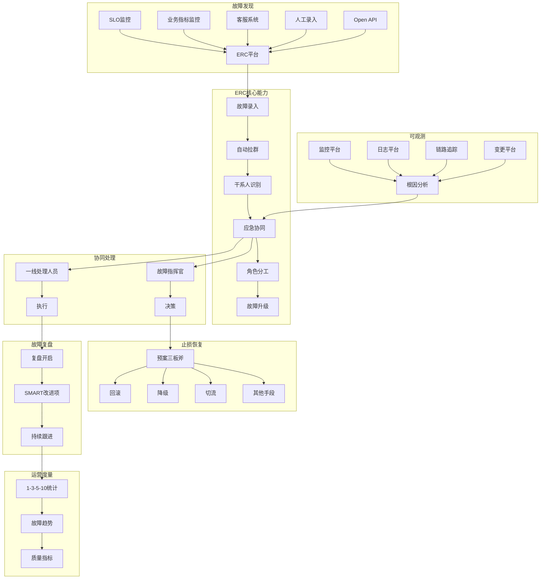

### 13.2 故障生命周期流程

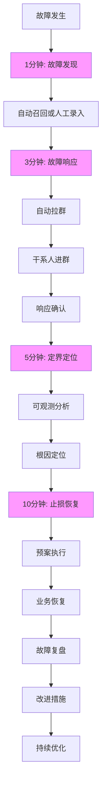

## 十四、关键成果总结

### 14.1 故障发现

**成效**：

- ✅ 故障自动召回率：**80%+**
- ✅ 故障有效率：**80%+**

**关键手段**：

- SLO升级（业务网关 + 基础服务）
- 业务指标监控
- 客服系统对接
- 故障风暴抑制

### 14.2 故障响应

**成效**：

- ✅ **100%**故障在**3分钟**内完成响应

**关键手段**：

- 自动拉群
- 故障升级机制（1分钟/5分钟）
- 移动端办公能力

### 14.3 协同处理

**关键机制**：

- 角色分工（指挥官 + 一线人员）
- 信息透明（群内推送）
- 可观测串联

### 14.4 复盘改进

**关键要素**：

- SMART原则
- 改进项跟踪
- 持续运营

## 十五、最佳实践建议

### 15.1 故障发现层面

1. **关注结果类指标，而非原因类指标**

   - 结果类指标可枚举
   - 原因类指标加不完
2. **技术指标 + 业务指标 = 完整覆盖**

   - 技术指标：SLO、可用率
   - 业务指标：业务健康度
3. **精准覆盖，避免噪音**

   - 覆盖业务网关和基础服务
   - 不要全量覆盖所有应用
4. **建立抑制机制**

   - 业务域收敛
   - 同业务应用收敛
   - 支持人工合并

### 15.2 协同处理层面

1. **建立明确角色分工**

   - 故障指挥官
   - 一线处理人员
2. **信息公开透明**

   - 自动拉群
   - 实时推送
   - 关联信息串联
3. **建立升级机制**

   - 保证非工作时间响应
   - 电话通知机制
4. **提供移动端能力**

   - 随时随地处理故障

### 15.3 复盘改进层面

1. **遵循SMART原则**

   - 具体、可度量、可实现、相关、有时限
2. **复盘与故障关联**

   - 信息自动串联
   - 降低填写成本
3. **持续跟进改进项**

   - 明确负责人和验收人
   - 设定时间节点（建议3个月内）

### 15.4 运营度量层面

1. **采用分段统计**

   - 每个阶段时长清晰
   - 便于针对性优化
2. **关注核心指标**

   - 1-3-5-10达成率
   - 故障数量趋势
   - 故障质量指标
3. **持续优化**

   - 基于数据分析
   - 针对性改进

## 十六、总结与展望

### 16.1 核心价值

**ERC（应急响应中心）的核心价值**：

1. **快速发现**

   - 从被动到主动
   - 从人工到自动
   - 从滞后到实时
2. **高效协同**

   - 从混乱到有序
   - 从分散到集中
   - 从低效到高效
3. **快速恢复**

   - 从长MTTR到短MTTR
   - 从经验驱动到数据驱动
   - 从救火到预防
4. **持续改进**

   - 从形式复盘到有效复盘
   - 从口头承诺到落地跟踪
   - 从单次故障到体系优化

### 16.2 建设思路总结

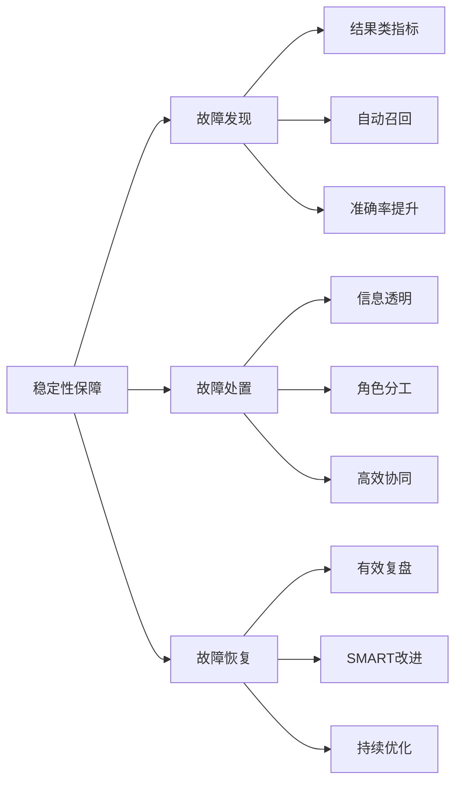

### 16.3 关键指标

| 指标       | 目标   | 当前成效   |
| ---------- | ------ | ---------- |
| 故障发现   | 1分钟  | 持续优化中 |
| 故障响应   | 3分钟  | 100%达成   |
| 定界定位   | 5分钟  | 持续优化中 |
| 故障恢复   | 10分钟 | 持续优化中 |
| 自动召回率 | -      | 80%+       |
| 故障有效率 | -      | 80%+       |

### 16.4 未来方向

1. **智能化提升**

   - AIOps能力增强
   - 根因分析准确率提升
   - 自动化止损能力
2. **覆盖面扩展**

   - 更多业务指标接入
   - 更精准的故障识别
   - 更完善的预案体系
3. **效率持续优化**

   - 缩短各环节时间
   - 提升自动化程度
   - 降低人工介入

---

## 附录：关键术语

| 术语 | 全称                              | 说明           |
| ---- | --------------------------------- | -------------- |
| ERC  | Emergency Response Center         | 应急响应中心   |
| SRE  | Site Reliability Engineering      | 站点可靠性工程 |
| SLO  | Service Level Objective           | 服务等级目标   |
| MTTR | Mean Time To Repair               | 平均修复时间   |
| OOM  | Out Of Memory                     | 内存溢出       |
| CDN  | Content Delivery Network          | 内容分发网络   |
| MQ   | Message Queue                     | 消息队列       |
| UAT  | User Acceptance Testing           | 用户验收测试   |
| VPN  | Virtual Private Network           | 虚拟专用网络   |
| API  | Application Programming Interface | 应用程序接口   |

