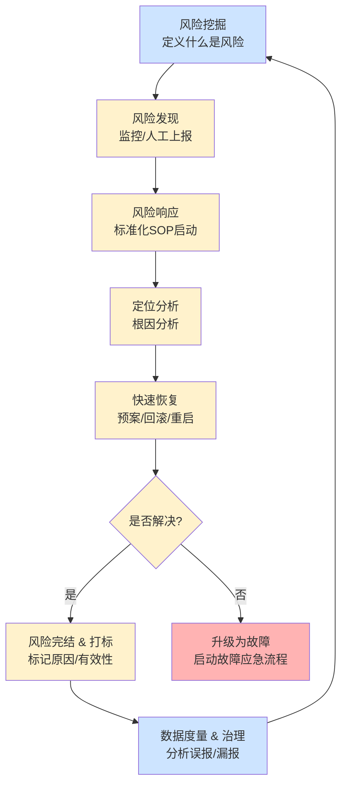
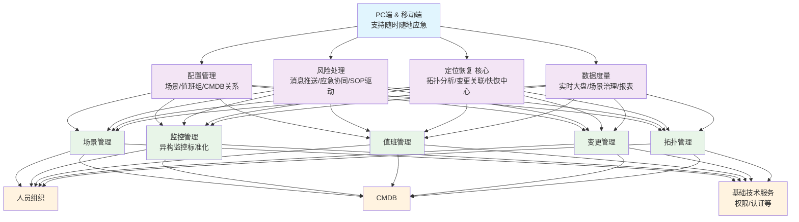

# B站风险预警的架构设计及落地实践

> 来源：未核验 · 类型：分享 · 状态：draft

## 议题核心价值

本次分享的核心在于B站如何从混乱的传统告警模式，演进到一套以**"风险"为中心**、具备标准化SOP、数据驱动闭环和平台化整合能力的现代化预警体系。其最终目标是通过主动的风险管控，将问题扼杀在摇篮中，有效防控故障（Prevent Faults），而不仅仅是被动响应。

## 一、传统告警的困局与痛点

传统告警模式对研发、SRE和管理者都带来了巨大的挑战，是构建新体系的根本原因。

### 1.1 四大核心问题

| 问题 | 描述 | 影响 |
|------|------|------|
| **告警疲劳** | 告警过多过于复杂，用户选择静默 | 重要告警遗失 |
| **孤军奋战** | 缺乏协同机制，不知道告警是否被处理 | 信息不同步 |
| **信息偏差** | 人员维护不准确，新员工未收到告警 | 责任不清 |
| **数据离散** | 无法统计告警有效性，缺乏数据度量 | 治理无从下手 |

### 1.2 三大角色的痛点

| 角色 | 核心痛点 |
|------|----------|
| **研发工程师** | • 告警疲劳：多渠道告警信息嘈杂 • 孤军奋战：缺乏协同机制 • 信息偏差：告警接收人员不准 • 功能单一：无法协同处理 |
| **SRE/稳定性负责人** | • 无法感知风险：缺乏风险态势感知 • 协同困难：缺乏统一应急协同平台 • 度量缺失：无法量化关键指标 • 精准联系困难：无法快速定位负责人 |
| **管理者** | • 风险黑盒：无法感知业务风险水平 • 稳定性不可度量：缺乏数据支撑 • 无法梳理业务场景：告警偏技术化 |

### 1.3 传统告警处理流程的缺陷

**核心问题：** 缺乏标准的SOP、平台工具分散（观测、变更、协同工具来回切换）、信息不同步、事后无数据度量，导致应急效率低下，小问题容易演变成大故障。

## 二、核心理念：重新定义"风险"

### 2.1 风险与故障的本质区别

| 概念 | 定义 | 处理方式 | 目标 |
|------|------|----------|------|
| **故障 (Fault)** | 已对业务可用性产生严重影响的事件 | 行政管控和奖惩机制 | 快速恢复业务 |
| **风险 (Risk)** | 可能影响业务，但尚未扩大化、严重化的事件 | 产品化能力，赋能研发自闭环 | 防控故障发生 |

### 2.2 风险的全生命周期闭环

### 2.3 风险场景分类

**中间件异常：**
- 数据库连接池打满、突发高QPS
- 缓存满、RT过高
- 更偏向研发和SRE关注

**基础设施异常：**
- 网络异常、容器异常
- 宿主机异常、磁盘异常
- 可能影响业务，需要关注

**业务异常：**
- 业务稳定性出现问题
- 业务可能受损
- 研发、SRE、老板、稳定负责人都需关注

## 三、核心实践：风险预警产品化落地

### 3.1 三大核心实体

通过结构化的配置，将责任、场景和人员明确绑定，实现精准触达和事前治理。

#### 预警节点 (CMDB Node)
- 风险所属的业务单元、应用或服务
- 定义业务边界和责任范围

#### 值班组 (On-call Group)
- **"谁来处理"** - 定义负责的人员
- 协同的企业微信群
- 升级策略（如5分钟无人接收则@Leader）

#### 风险场景 (Risk Scene)
- **"处理什么"** - 最核心的抽象
- 定义一类具体的风险

**风险场景包含：**
- **规则表达式：** 对风险的业务定义（如API成功率 < 99.5% 持续1分钟）
- **监控指标/告警：** 规则表达式背后的技术实现
- **预案/快回手册：** 绑定可执行的恢复操作

**关系：** 一个预警节点下，由N个值班组负责处理M个风险场景的预警

### 3.2 标准化SOP处理流程

当风险场景被触发后，平台会驱动一套标准的线上处理流程，这一切都在企业微信群内以卡片消息的形式协同完成。

#### 统一推送
- 所有来源（监控系统、人工上报）的风险都以标准化卡片推送到指定的值班群
- 卡片包含关键信息和操作按钮

#### 行为同步
- 任何操作（接手、转交、录入进展、标记无效、完结）都会实时同步到群里
- 所有人都能看到事件状态，避免信息孤岛

#### 详情页聚合
点击卡片进入预警详情页，聚合了所有相关信息：
- **技术指标图表：** 如SLO曲线、错误码分布等
- **智能诊断信息：** 情报中心能力
- **快回/预案操作入口：** 一键直达或执行恢复操作
- **列表视图：** 快速查看当前所有未完结的风险列表

### 3.3 四大覆盖能力建设

这是风险预警平台的核心技术竞争力，旨在帮助工程师快速定位根因。

#### 变更覆盖
- 对接公司所有发布、配置变更平台
- 结构化存储所有变更记录（谁在何时对哪个实体做了什么变更）

#### 监控覆盖
- 对接并标准化所有监控系统（前端、后端、中间件、SLO等）
- 统一数据模型，实现异构监控系统同构化

#### 拓扑覆盖
- 结合CMDB（静态拓扑）和实时流量分析（动态拓扑）
- 构建应用、中间件、基础设施间的依赖关系图谱

#### 快恢覆盖
- 建立标准化的恢复操作库
- 回滚、重启、限流、预案执行等

### 3.4 智能诊断案例

当服务A触发"RPC成功率下降"的风险时，系统会自动进行分析：

1. **自身变更分析：** 查询服务A在风险发生前后是否有发布或配置变更
2. **依赖链路分析：** 基于拓扑图，检查其上游或下游服务是否也出现异常或近期有变更
3. **诊断信息推送：** 将分析结果（如"检测到下游服务B在5分钟前有一次发布，且其健康度异常"）追加推送到预警群内

## 四、整体架构设计

平台采用分层解耦的微服务架构，具备良好的扩展性。

### 4.1 技术架构特点

- **模块化可插拔设计：** 支持更多平台接入
- **PaaS能力：** 监控标准化
- **解耦式设计：** 支持外部系统诊断推送
- **横向和纵向扩展性：** 满足不同用户诉求

## 五、核心度量指标

### 5.1 四个核心指标

| 指标 | 定义 | 价值 |
|------|------|------|
| **接受时长** | 从告警到接手的响应时间 | 衡量响应速度 |
| **接受率** | 告警被接手的比例 | 衡量覆盖度 |
| **完结时长** | 从接手到完结的处理时间 | 衡量处理效率 |
| **完结率** | 告警被完结的比例 | 衡量完成度 |

### 5.2 场景治理

- **正召回：** 误告识别和治理
- **负召回：** 遗漏告警的发现和补充

## 六、产品价值与业务价值

### 6.1 业务价值

1. **防控故障** - 主要目标，将问题扼杀在摇篮中
2. **风险挖掘** - 主动发现风险点
3. **信息聚合** - 统一信息渠道
4. **风险闭环** - 完整生命周期管理
5. **平台整合** - 解决业务痛点
6. **多能运营** - 提升运营效率

### 6.2 技术价值

1. **标准化SOP驱动** - 统一处理流程
2. **模块化可插拔设计** - 支持更多平台接入
3. **PaaS能力** - 监控标准化
4. **解耦式设计** - 支持外部系统诊断推送

## 七、给SRE和运维工程师的启示

### 7.1 从"救火"到"防火"
真正的稳定性建设在于事前。将"风险"从"故障"中剥离出来，进行更低门槛、更前置的管理，是降低故障率的有效手段。

### 7.2 SOP是效率的保障
依赖个人英雄主义的应急模式不可靠。将最佳实践固化为平台驱动的SOP，能极大提升应急效率，并降低对个人经验的依赖。

### 7.3 上下文是定位的关键
孤立的告警毫无意义。告警 + 变更 + 拓扑 = 快速定位的线索。大力投入元数据（CMDB）、变更和拓扑的建设，是实现智能诊断的基石。

### 7.4 数据度量是治理的抓手
没有度量就无法改进。通过度量告警有效率、MTTA、MTTR等指标，可以反向驱动告警规则的优化和无效告警的治理，形成良性循环。

### 7.5 平台化整合是终极形态
将观测、协同、操作等能力整合到一个平台，减少应急过程中的"上下文切换"，能显著提升处理效率和降低操作风险。

## 八、总结

B站风险预警体系的核心创新在于：

1. **理念创新：** 将"风险"从"故障"中分离，实现更前置的管控
2. **产品创新：** 通过三大实体和标准化SOP，实现精准触达和协同处理
3. **技术创新：** 四大覆盖能力建设，提供强大的智能诊断和快速恢复能力
4. **架构创新：** 分层解耦设计，支持平台化整合和持续扩展

这套体系不仅解决了传统告警的痛点，更重要的是建立了一套可持续、可度量、可治理的风险管控机制，为企业的稳定性建设提供了新的思路和实践路径。
