# B站SRE数据资产体系建设

> 来源：未核验 · 类型：分享 · 状态：draft


## 分享嘉宾

**袁帅** - B站SRE工程师
- 2020年加入B站
- 先后从事大数据运维平台研发
- 数据库运维平台研发
- 运维作业平台负责人
- CMDB资产化平台建设负责人

## 分享大纲

1. 认识数据资产
2. 数据治理方法论
3. 资产化平台建设方法论
4. B站资产化平台建设实践

---

## 一、认识数据资产

### 1.1 什么是数据资产

在数据资产化建设之前，数据存在的问题：
- 数据处于**离散状态**
- 数据的生产和消费**不统一**
- 容易出现**数据孤岛**或**数据冗余**

数据资产化建设后的改进：
- 整合不同渠道的数据
- 构造统一的数据源
- 统一数据采集、存储、分析流程链路
- 统一数据结构和关系
- 统一消费出口

**核心价值**：将运维产生的数据进行采集整理后，可用于服务自身决策和业务流程支撑。

### 1.2 数据资产的三要素

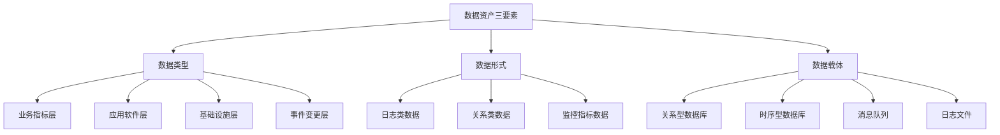

#### 1.2.1 数据类型（运维场景）

**业务层面**：
- 交易耗时
- 订单量
- 业务指标

**应用层面**：
- 用户IP
- 接口调用情况
- 应用性能指标

**基础设施层面**：
- 网络丢包率
- 内存占用
- CPU使用率

**事件层面**：
- 变更事件
- 发布事件
- 紧急变更数量

#### 1.2.2 数据形式

- **日志类数据**：应用日志、系统日志
- **关系类数据**：配置信息、资源关系
- **监控类数据**：指标、告警数据

#### 1.2.3 数据载体

根据数据形式选择合适的存储方式：
- 关系型数据库（MySQL、PostgreSQL）
- 时序型数据库（InfluxDB、Prometheus）
- 消息队列（Kafka）
- 日志文件

### 1.3 数据资产化的商业价值

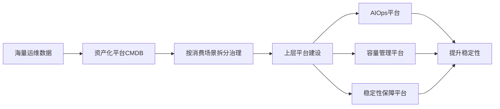

**价值体现**：
1. 通过CMDB平台将海量运维数据按消费场景拆分和治理
2. 快速构建和迭代上层关注的平台（AIOps、容量管理等）
3. 持续挖掘数据价值，提升SRE关注的稳定性

---

## 二、数据治理方法论

### 2.1 运维数据标准化面临的问题

运维数据标准化问题与大数据场景的数据质量问题类似：

| 问题类型 | 具体表现 |
|---------|---------|
| 数据孤岛 | 数据分散在各个系统，无法统一管理 |
| 数据质量不高 | 准确性、完整性、一致性存在问题 |
| 数据不可知 | 缺乏数据目录和元数据管理 |
| 数据服务不足 | 消费场景难以快速迭代 |
| 开发周期长 | 获取数据的开发过程漫长 |

**资源投入不足的影响**：
- 人力资源不足
- 服务器资源不足
- 中间件资源不足
- 对数据标准化建设产生灾难性影响

**运维数据的天然特性**：
- 运维数据天生不标准（日志、监控、配置存储方式各异）
- 需要在有限资源下最大化产出
- 缺乏成熟的全面数据建模方法论

### 2.2 运维数据治理模型

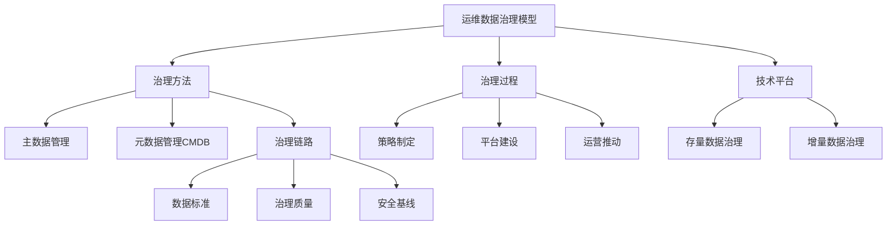

#### 2.2.1 治理方法

**主数据管理**：
- 管理核心资源实体（主机、宿主机、CRD等）
- 具有完整的生命周期管理
- 通过闭环上报流程进入CMDB

**元数据管理（CMDB）**：
- 以CMDB模式为代表
- 向上层提供数据支撑
- 统一的数据视图

**治理链路三个维度**：
1. **数据标准**：定义数据规范和格式
2. **治理质量**：设定质量目标和度量指标
3. **安全基线**：确定变更基线要求

#### 2.2.2 治理过程

- **策略**：制定治理策略和规范
- **建设**：建设平台和工具
- **运营**：持续运营和优化

#### 2.2.3 技术平台

通过工具支撑存量数据和增量数据的治理。

### 2.3 数据治理的关键要素

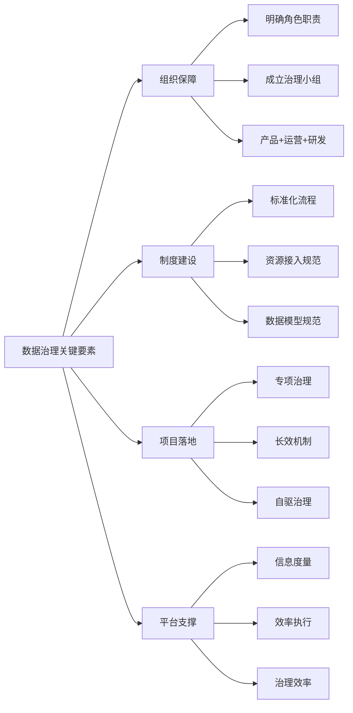

#### 2.3.1 组织保障

- 明确成员角色和职责分工
- 建立数据治理专项团队
- 团队组成：产品 + 运营 + 研发

#### 2.3.2 制度建设

- 制定标准化流程
- 资源接入规范
- 资源开发规范
- 数据模型规范

#### 2.3.3 项目落地

**重要理念**：数据治理是长效过程，不是运动式作战

- **短期**：专项小组运动式作战，紧急修复数据质量问题
- **长期**：通过产品和平台手段，驱动数据责任方自驱治理

#### 2.3.4 平台支撑

- 信息度量
- 效率执行
- 治理效率体现

---

## 三、CMDB平台建设方法论

### 3.1 什么是CMDB

**CMDB（Configuration Management Database）**：配置管理数据库

核心功能围绕四个方面：
1. **基础资源台账**：资源清单和基本信息
2. **详细资源属性**：资源的完整属性信息
3. **资源关联关系**：资源之间的依赖和关联
4. **消费图谱**：数据消费场景和流向

**建设要点**：
- 分层建立业务模型
- 通过自动化感知或标准化流程实时推送配置动态
- 可视化界面激发协作力量
- 通过API或离线方式促进数据消费

### 3.2 CMDB在IT时代的定位

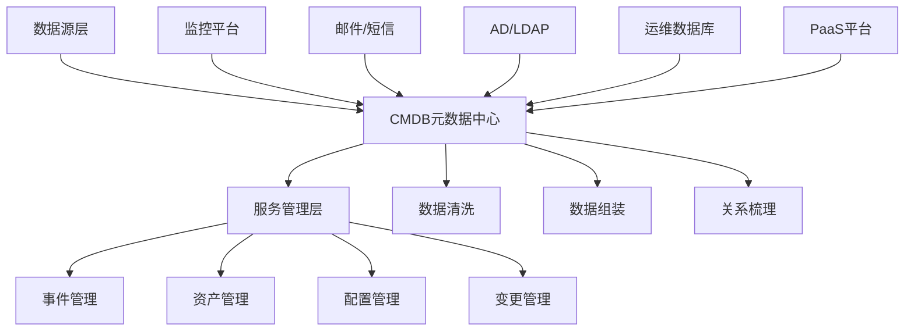

**CMDB作为元数据中心**：
- 整合组织、人员、策略、权限、流程数据
- 对接多个底层平台（监控、邮件、AD、数据库、PaaS）
- 向上层服务管理平台提供数据支撑

### 3.3 以应用为中心的CMDB建设

#### 3.3.1 为什么要以应用为中心

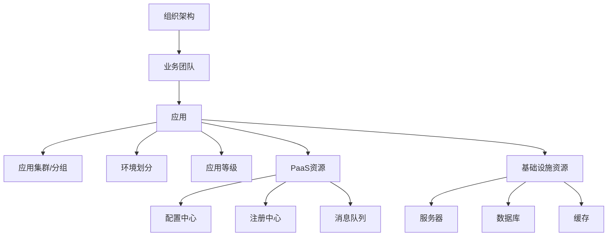

**微服务架构下的优势**：
1. 研发和运维视角从基础设施转向服务/应用
2. 应用成为问题分析和排查的主要维度
3. 应用管理思路对标公司组织架构

**应用层级结构**：
- 组织架构 → 业务团队 → 应用
- 应用下有分组（Group）概念
- 应用有环境划分（UAT、Pre、Prod）
- 应用有机房划分
- 应用有等级划分（保障优先级）

#### 3.3.2 以应用为中心的应用场景

**监控场景**：
- 监控机器维度、微服务维度、作业维度数据
- 告警通过应用关联找到责任人
- 应用绑定职责人员，实现精准推送

**CI/CD场景**：
- 应用关联构建配置
- 应用关联运行时资源（集群、机器）
- 实现从构建到部署的完整流程

**微服务框架场景**：
- 应用等同于微服务
- 服务注册、服务发现基于应用
- 路由管理基于应用

### 3.4 应用与元数据中心的关系

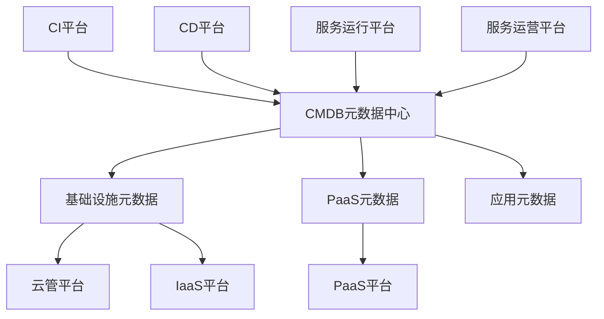

**价值体现**：
1. 为应用全生命周期提供基础数据支撑
2. 支持运行时资源、调用关系、拓扑的实时展示
3. 支持根因分析、告警场景
4. 支持影响面分析（扩缩容、单机房故障）
5. 贯穿应用全生命周期：创建 → 构建发布 → 扩容计费 → 下线回收

### 3.5 CMDB建设的四大阶段

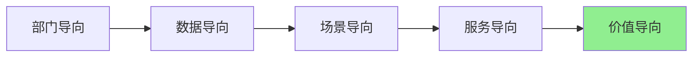

#### 阶段一：部门导向
- 各部门独立维护配置信息
- 信息孤立，跨部门协作困难
- 可能没有统一的CMDB系统

#### 阶段二：数据导向
- 建设共享型CMDB
- 采用业界标准数据模型
- 各部门数据统一纳管
- **问题**：消费场景不明确，生产成本与消费价值失衡

**B站经验**：
- 数据生产成本不高，但消费场景定制需求多
- 对外暴露300多个API，维护困难

#### 阶段三：场景导向
- 面向特定场景做标准化数据支撑
- **问题**：生产成本提高，但消费价值未显著提升

#### 阶段四：服务导向（B站当前阶段）
- 使用场景随业务扩展越来越多
- 引入多元化存储方式
- 引入多元化数据生产和消费手段
- 平衡数据生产与消费成本

#### 阶段五：价值导向（B站建设中）
- SRE相关平台建设
- 容量管理
- 可用性管理
- 稳定性保障

### 3.6 CI模型构建方法

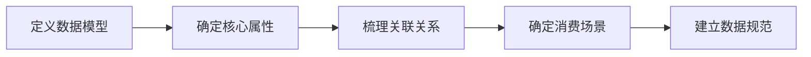

#### 3.6.1 定义数据模型

**什么是数据模型**：
- 主机、交换机、应用、配置文件等都可以作为数据模型
- 需要调研确定模型的必要性和范围

#### 3.6.2 确定核心属性

以主机为例：
- Hostname
- IP地址
- 序列号
- 机房位置
- 云厂商

#### 3.6.3 梳理关联关系

**关系类型定义**：

| 关系类型 | 说明 | 示例 |
|---------|------|------|
| 依赖 | A依赖B才能运行 | 应用依赖配置 |
| 包含 | A包含多个B | K8s集群包含组件 |
| 运行 | A运行在B上 | 容器运行在宿主机 |
| 安装 | A安装在B上 | 数据库安装在服务器 |
| 连接 | A连接到B | 服务器连接交换机 |

**关系梳理示例**：
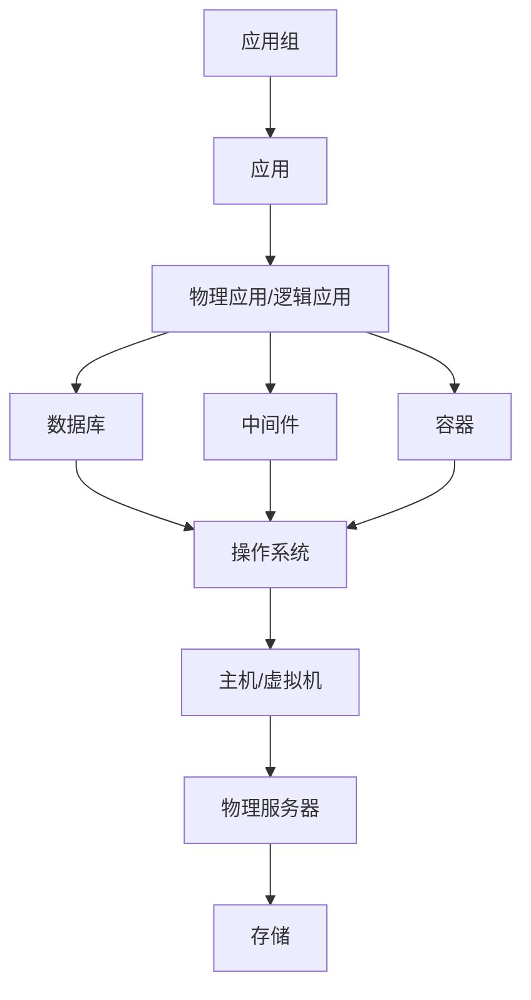

#### 3.6.4 确定消费场景

- CD阶段：选择机型、集群部署
- 运维作业：按应用维度执行操作
- 监控告警：按应用维度推送
- 容量管理：按应用维度统计

#### 3.6.5 建立数据规范

**生命周期管理**：
- 创建 → 运行 → 变更 → 删除
- 平台如何感知状态变化
- 如何保障数据实时性和准确性

**总结**：
- 以数据全生命周期为出发点
- 确定属性
- 理清关系
- 明确消费场景
- 通过自动化流程保障数据质量

### 3.7 CMDB实施框架

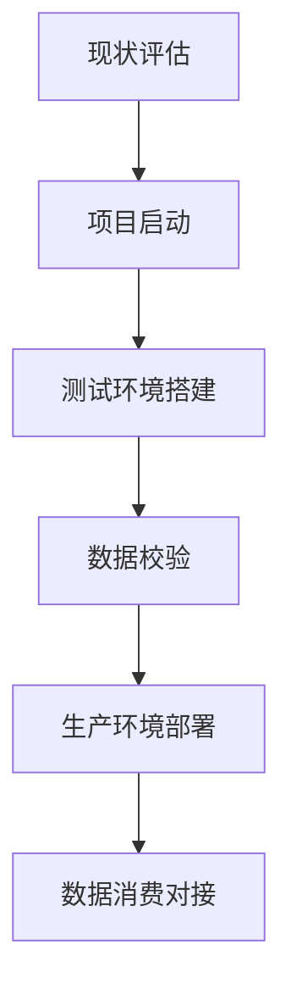

#### 第一阶段：现状评估
- 是否已有CMDB平台
- 平台接入程度
- 数据质量现状
- 组织架构和技术架构评估
- 资源状况评估

#### 第二阶段：项目启动
- 定义接入资源的CI模型
- 定义关系模型
- 确定消费场景
- 确定数据来源
- 明确责任方

#### 第三阶段：测试环境搭建
- CI数据实例化检测
- 导入CI模型
- 导入实例化数据
- 数据校验和质量检查

#### 第四阶段：生产环境部署
- 生产环境建设
- 数据迁移
- 状态确认

#### 第五阶段：数据消费对接
- 对接运营平台
- 对接SRE相关平台
- 验证消费场景

### 3.8 标准化先行思路

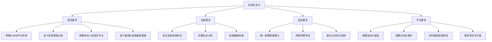

#### 规范要求
- 明确CMDB平台作用和调用关系
- 明确资源管理过程、责任人和责任平台
- 明确资源基线标准和偏差管理办法
- 从服务业务场景角度规划配置管理能力

#### 流程要求
- 真实反映资源状况
- 完整包含调用关系和资源关系
- 作为权威数据来源

#### 组织要求
- 统一配置管理能力
- 各业务团队明确配置消费责任
- 形成配置管理的讨论、优化、需求收集机制

#### 平台要求
- 实现配置自动化发现和维护
- 实时跟踪资源状态和变化
- 模型足够灵活，支持扩展
- 配置可视化

### 3.9 配置全生命周期闭环

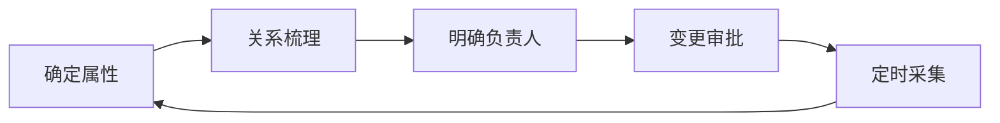

**以应用为例的生命周期**：

1. **确定应用属性**：
   - 应用英文/中文名称
   - 应用等级
   - 应用唯一ID
   - 归属业务线

2. **关系梳理**：
   - 应用与其他CI的关系

3. **明确负责人**：
   - 应用负责人
   - 研发人员
   - SRE人员

4. **变更管理**：
   - 构建、发布等变更
   - 变更审批流程

5. **定时采集**：
   - 保障数据准确性
   - 自动化采集任务

### 3.10 配置自动化发现和更新

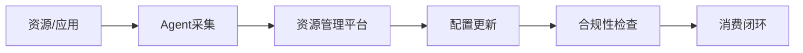

**目标**：
- 建立完善的配置采集能力
- 杜绝人工维护（尽可能）
- 自动发现资源和应用配置信息
- 对接流程管理平台
- 动态更新配置状态
- 建立资源配置使用规范
- 通过CMDB建设合规性检查
- 推动配置自动发现和消费闭环

---

## 四、B站资产化平台建设实践

### 4.1 服务树（Service Tree）概述

**什么是服务树**：
- B站持续建设约5年的平台
- 以应用为中心的数据信息配置管理系统
- 描述B站各个组织层级关系
- 包括业务线、中台、架构等层级
- 各层级owner可根据业务模型向下拆分

**目标**：解决B站所有业务线的资产管理问题

### 4.2 服务树的定位

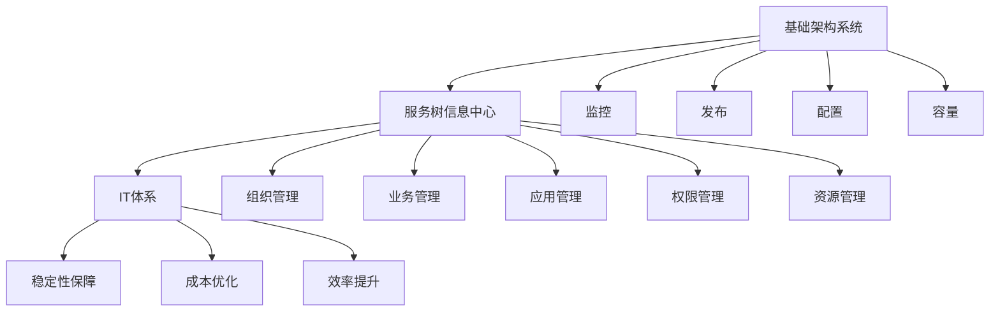

**核心定位**：
- 服务元信息中心
- 信息流转枢纽

**主要职责**：
- 负责组织、业务、应用、权限、资源的管控
- 支撑IT体系和基础架构系统之间的信息构建和流转

### 4.3 服务树的业务场景

#### 4.3.1 面向业务方的资源管理

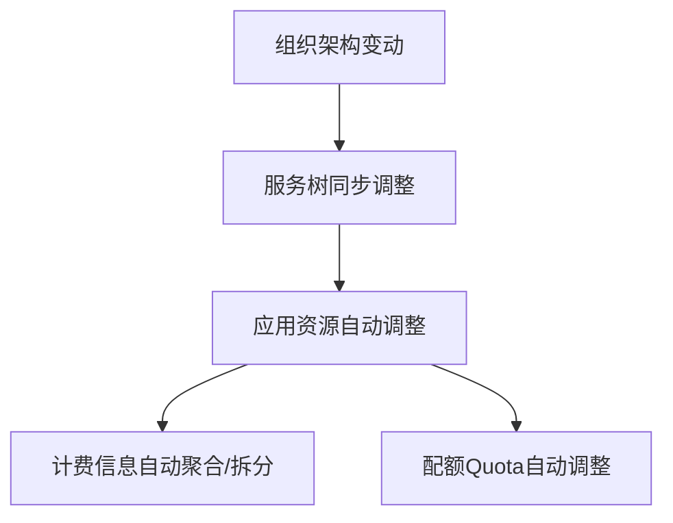

**核心能力**：
1. **贴合组织架构**：
   - 对接公司组织架构
   - 随组织架构调整而调整
   - 产品、项目资源归属管理

2. **批量资源管理**：
   - 针对不同层级（单个/多个）
   - 针对不同资源（单个/多个）
   - 支持新建、删除、配置、迁移等操作

3. **资源利用率统计**：
   - 以业务视角统计
   - 以组织架构视角统计
   - 帮助业务方提升资源效率和优化成本

4. **AIOps信息统计**：
   - 面向用户的稳定性保障
   - 统计应用和业务维度指标
   - 发送给对应负责人或变更人

5. **权限管控**：
   - 基于层级的权限继承
   - 每层节点绑定角色
   - 角色绑定人员
   - 基于IAM实现灵活认证鉴权机制

#### 4.3.2 面向资源提供方的统一资源交付

**核心能力**：
1. **租户管理**：
   - 资源提供方作为租户接入
   - 注册资源信息
   - 资源挂载和回收时校验管理权限
   - 租户间资源隔离

2. **账单推送**：
   - 商品化资源定时推送账单
   - 检测租户身份
   - 推送给正确的业务方

3. **资源模型构建**：
   - 基于服务树构建资源模型
   - 支持配额、预算、资源利用率、ROI等维度

### 4.4 服务树的核心概念

#### 4.4.1 AppID构成

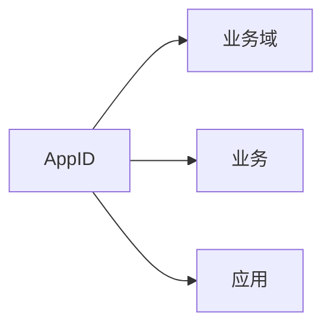

**AppID特点**：
- 由业务域、业务、应用三个层级组成
- 各层级命名有约束条件，不能重复
- 业务域下不允许同名业务
- 业务下不允许同名应用
- 保证AppID唯一性

#### 4.4.2 核心概念定义

**业务域（Domain）**：
- 一系列联系紧密的业务集合
- 业务对象的高度抽象
- 用于管理业务和应用

**业务（Business）**：
- 为公司或组织达到某个目的而产生价值的一系列活动
- 示例：大会员业务、电商业务
- 可进一步细分（如电商：订单、库存、发货）

**应用（Application）**：
- 在既有业务范围内，为每个能力或相关能力定义的应用
- B站组成业务的最小单元

**组织（Organization）**：
- 完全对标OA体系
- 组织架构下组织资源、搭建流程、开展业务

**产品（Product）**：
- 财务视角关注的拆分粒度
- 层级：大于业务，小于组织
- 支持按不同视角构建树视图

#### 4.4.3 多视角树视图

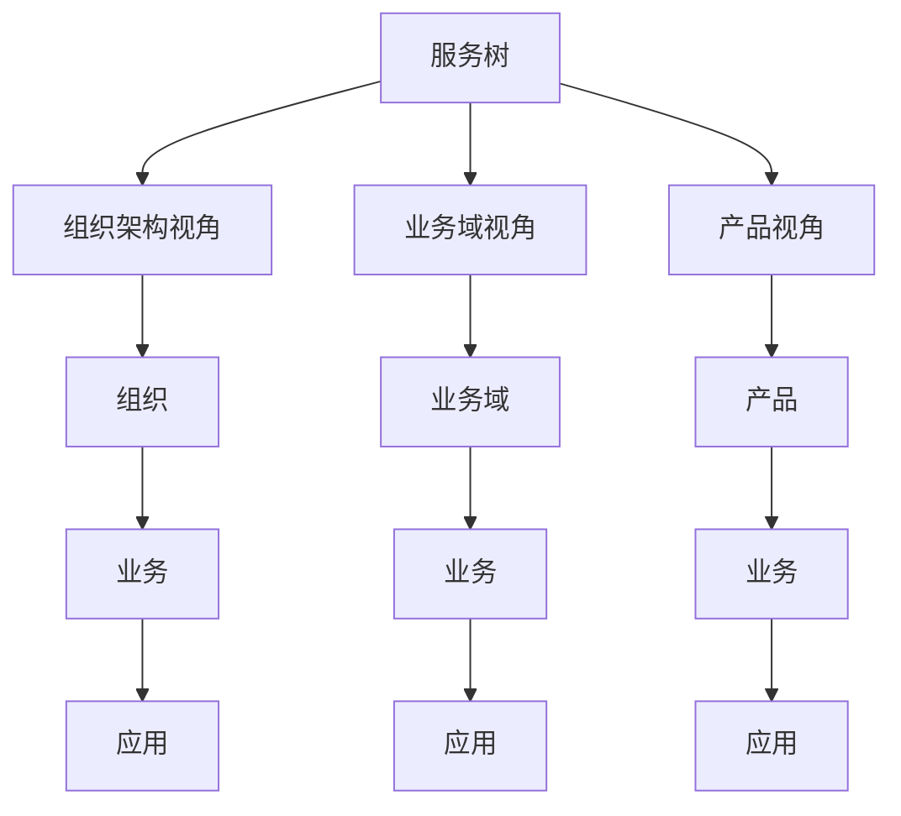

### 4.5 应用结构模型

#### 4.5.1 业务层级模型

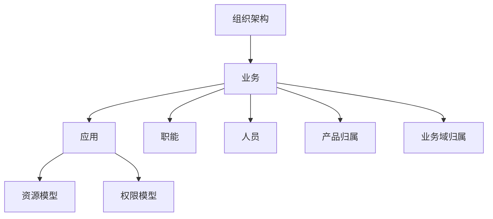

**层级结构**：
- 主视图：组织架构 → 业务 → 应用
- 业务层级可关联：职能、人员、产品、业务域
- 应用层级关联：资源、权限

#### 4.5.2 资源权限模型

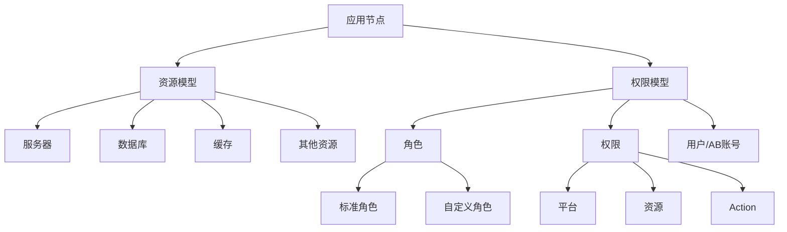

**资源模型**：
- 应用节点挂载各类资源
- 资源类型：服务器、数据库、缓存等

**权限模型**：
- 应用节点绑定角色
- B站定义5大标准角色 + 支持自定义角色
- 权限模型：平台 + 资源 + Action
- 权限可授予角色或直接授予用户/AB账号
- 实现基于节点的资源控制

### 4.6 应用详细信息展示

#### 4.6.1 应用基础信息

```mermaid
graph TD
    A[应用详情] --> B[基础信息]
    A --> C[归属关系]
    A --> D[特征信息]
    A --> E[构建部署信息]
    A --> F[运行时参数]
    A --> G[资源信息]
    
    B --> B1[创建人]
    B --> B2[负责人]
    B --> B3[语言类型]
    B --> B4[等级类型]
    
    C --> C1[组织]
    C --> C2[业务]
    C --> C3[应用]
    C --> C4[产品]
    
    D --> D1[是否容器化]
    D --> D2[是否多活]
    D --> D3[是否高可用]
    
    E --> E1[构建地址]
    E --> E2[部署信息]
    
    F --> F1[端口]
    F --> F2[内存占用]
    F --> F3[CPU占用]
    
    G --> G1[服务器]
    G --> G2[容器]
    G --> G3[数据库]
    G --> G4[缓存]
    G --> G5[CLB]
```

### 4.7 CI模型定义

#### 4.7.1 CI类型定义

```mermaid
graph LR
    A[CI类型定义] --> B[唯一名称]
    A --> C[父类型]
    A --> D[属性列表]
    
    D --> D1[属性名称]
    D --> D2[属性类型]
    D --> D3[是否唯一]
    D --> D4[是否建索引]
    D --> D5[默认值]
```

**CI模型组成**：
1. **CI类型定义**：
   - 唯一名称
   - 父类型（公共属性复用）
   - 属性列表（1到N个属性）

2. **属性定义**：
   - 属性名称
   - 属性类型（仅支持基础数据类型）
   - 是否唯一
   - 是否建索引（用于创建Tag、点、边索引）
   - 默认值

**技术选型**：
- 图引擎：采用开源方案
- 仅支持基础数据类型

#### 4.7.2 关系定义

```mermaid
graph TD
    A[关系定义] --> B[唯一名称]
    A --> C[关系维度]
    A --> D[属性列表]
    
    C --> C1[生命周期一致]
    C --> C2[生命周期独立]
```

**关系维度**：

1. **生命周期一致**：
   - 示例：数据库集群与数据库实例
   - 集群销毁，实例必然销毁
   - 强依赖关系

2. **生命周期独立**：
   - 示例：主机与机房
   - 主机下架，机房仍存在
   - 弱依赖关系

#### 4.7.3 应用资源模型示例

```mermaid
graph TD
    A[应用模型] --> B[应用属性]
    A --> C[容器模型]
    
    C --> D[容器属性]
    C --> E[关系定义]
    
    E --> E1[应用运行依赖]
    E --> E2[容器组成关系]
    
    B --> F[应用运行时资源拓扑]
    D --> F
    E --> F
```

**建模步骤**：
1. 定义应用模型及其属性
2. 定义容器模型及其属性
3. 定义关系（如：应用运行依赖、容器组成）
4. 资源实例化时按模型存储
5. 形成应用运行时资源拓扑

### 4.8 权限控制模型

```mermaid
graph TD
    A[IAM权限体系] --> B[成员Member]
    A --> C[角色Role]
    A --> D[权限Permission]
    A --> E[授权Authorization]
    
    B --> B1[OA员工]
    B --> B2[三方/外包员工]
    B --> B3[合作公司员工]
    
    C --> C1[平台标准角色]
    C --> C2[自定义角色]
    
    D --> D1[Provider]
    D --> D2[Resource]
    D --> D3[Action]
    
    E --> E1[成员绑定角色]
    E --> E2[角色包含权限]
```

#### 4.8.1 四大组成部分

**成员（Member）**：
- OA员工
- 三方或外包员工
- 三方合作公司员工
- 不同成员有不同权限控制

**角色（Role）**：
- 平台提供标准化角色
- 各平台可自定义角色
- 角色决定可操作的资源

**权限（Permission）**：
- 格式：Provider + Resource + Action
- 示例：某某节点可创建
- 权限不能直接赋予成员，需绑定到角色

**授权（Authorization）**：
- 将一个或多个成员绑定到角色
- 定义谁对该节点资源有访问权限

#### 4.8.2 权限控制流程

```mermaid
graph LR
    A[权限点] --> B[角色]
    B --> C[节点]
    C --> D[成员]
    D --> E[资源访问控制]
```

### 4.9 数据治理实践

#### 4.9.1 节点权限治理（案例）

**背景**：服务树是5年老项目，存在数据治理问题

**治理组织**：
- 产品 + 运营组成治理团队
- 明确节点负责人职责
- 节点负责人对本节点权限规范程度负责

**治理方式**：
- 短期：运动式作战 + 地推方式
- 长期：平台化 + 自驱化

**规范建立**：
1. 权限申请和添加准入规范
2. 权限审批人对授权负责
3. 数据运营保障

**数据运营保障**：
```mermaid
graph TD
    A[数据运营] --> B[大盘监控]
    A --> C[数据报表定时推送]
    A --> D[应用画像权限评分]
    
    B --> B1[实时推送TOP20]
    B --> B2[权限覆盖程度]
    
    D --> D1[权限腐败程度打分]
    D --> D2[治理触发机制]
```

**平台支持**：
- 节点负责人维度的资质治理
- 应用运营大盘
- 实时推送TOP20权限覆盖程度
- 应用画像权限腐败程度打分

### 4.10 应用画像体系

#### 4.10.1 什么是应用画像

**概念类比**：
- 用户画像：是否大会员、是否UP主、投稿数、点赞率等
- 应用画像：针对单个应用进行维度关联分析

**分析维度**：
```mermaid
graph TD
    A[应用画像] --> B[语言信息]
    A --> C[CI/CD信息]
    A --> D[运行情况]
    A --> E[资源信息]
    A --> F[调用信息]
    A --> G[稳定性信息]
```

**输出内容**：
1. 应用分析雷达图（六边形图）
2. 应用标准属性
3. 应用标签

#### 4.10.2 应用画像六维度雷达图

```mermaid
graph TD
    A[应用画像雷达图] --> B[活跃度]
    A --> C[健康度]
    A --> D[复杂度]
    A --> E[负载]
    A --> F[成本衡量]
    A --> G[权限衡量]
```

**六个维度详解**：

| 维度 | 说明 | 指标 | 得分含义 |
|-----|------|------|---------|
| 活跃度 | 应用变更和构建频率 | 近3天/7天变更人次 | 越高越活跃 |
| 健康度 | 性能瓶颈和稳定性风险 | 告警数量、服务健康状态 | 越高越健康 |
| 复杂度 | 使用场景和中间件特性 | 依赖中间件数量和类型 | 越高越复杂 |
| 负载 | 应用运行情况 | CPU使用率、内存使用率 | 反映资源使用 |
| 成本衡量 | 应用成本 | 对接资源运营平台 | 成本规模 |
| 权限衡量 | 权限规范程度 | 权限腐败程度 | 低于阈值需治理 |

**数据来源**：
- 打通周边平台数据
- 大数据离线/实时分析
- 智能分析和指标建设

**应用场景**：
- 根因分析：取近3天变更人进行高频推送
- 风险评估：识别性能瓶颈和稳定性风险
- 影响面分析：评估改动影响范围
- 权限治理：触发权限治理流程

#### 4.10.3 应用标签服务化流程

```mermaid
graph LR
    A[标签体系设计] --> B[数据源确认]
    B --> C[数据生产]
    C --> D[离线计算]
    D --> E[数据验证]
    E --> F[标签生产]
    F --> G[业务消费]
```

**当前进度**（B站）：
- 已完成：标签体系设计 → 数据源确认 → 数据生产 → 离线计算 → 数据验证
- 进行中：标签生产
- 待完成：业务消费

**实施要点**：
1. 与周边平台沟通数据源可用性
2. 数据进入离线库/时序库
3. 离线计算生成标签
4. 数据验证确保质量
5. 标签生产和发布
6. 提供给业务方消费

---

## 五、总结与展望

### 5.1 核心要点总结

1. **数据资产化价值**：
   - 整合离散数据
   - 统一生产和消费
   - 支撑上层平台建设
   - 提升稳定性保障能力

2. **数据治理关键**：
   - 组织保障：明确角色和职责
   - 制度建设：标准化流程和规范
   - 项目落地：长效机制 + 自驱治理
   - 平台支撑：度量、效率、治理

3. **CMDB建设核心**：
   - 以应用为中心
   - 分阶段建设（部门→数据→场景→服务→价值）
   - CI模型规范化
   - 配置全生命周期管理
   - 自动化发现和维护

4. **B站实践经验**：
   - 服务树作为元数据中心
   - 多视角树视图（组织、业务域、产品）
   - 基于IAM的权限体系
   - 应用画像六维度评估
   - 数据治理持续优化

### 5.2 未来展望

1. **应用画像深化**：
   - 完成标签服务化
   - 提供业务消费能力
   - 智能推荐和决策支持

2. **价值导向建设**：
   - 深化SRE平台建设
   - 容量管理优化
   - 可用性保障提升

3. **智能化演进**：
   - 基于画像的智能分析
   - 自动化根因分析
   - 预测性运维

---

## Q&A 精选

### Q1: 模型建设是否要遵循数据库范式？

**A**: B站使用多种存储引擎：
- 关系数据库：存储人员信息等
- MongoDB：存储文档数据
- 图数据库：构建关系图谱

所有数据库操作由DBA团队维护，必须经过平台审计，**必须严格遵守规范**。

### Q2: CMDB对外提供数据怎么保证安全？

**A**: 
1. **数据质量保障**：更关注数据质量而非安全
2. **权限控制**：
   - 与内审、外审沟通确定数据公开范围
   - 敏感数据（如职级、电话）加密处理
   - 需要使用敏感数据需邮件申请审批
3. **内部透明原则**：组织架构对内部完全透明

### Q3: 有必要建运维数据中台吗？

**A**: 看公司建设思路，**B站认为有必要**：
- 上层业务平台基于数据中台建设
- 技术架构部微服务依赖数据中台
- 统一数据源提升效率

### Q4: CMDB与ITSM的服务目录、知识库关系如何界定？

**A**: 
- **CMDB**：不存知识库，只存应用相关信息（配置、运行信息）
- **知识库**：由事件管理平台承载
- 后续会有专门分享

### Q5: 运维数据怎么保证实时性？

**A**: 
- **资产类数据**：通过配置采集和闭环流程保证
- **日志类数据**：由专门团队负责（作为消费方使用）

### Q6: 运维知识图谱与CMDB的关系？

**A**: **依赖关系**
- 知识图谱基于CMDB数据构建
- CMDB是知识图谱的数据消费场景之一

### Q7: 数据资产对SRE的意义？

**A**: 以限流场景为例：

**无资产化平台**：
- 监控平台查看接口情况
- 调用链平台查看上下游
- 检查QPS是否符合预期
- 各平台查看依赖资源（缓存）告警
- 需要在多个平台间跳转分析

**有资产化平台**：
- 一个平台打通根因分析链路
- 企业微信直接推送根因分析推荐
- 快速完成稳定性保障

### Q8: 如何保证数据的实时性和一致性？

**A**: 
1. **配置规则和监控**：针对不同数据源定义准确性要求
2. **数据推送**：不准确数据推送给责任方
3. **数据大盘**：
   - 展示总量数据
   - 展示存量数据
   - 展示准确率
   - 标记不准确数据
4. **过滤机制**：交付时可过滤不准确数据

### Q9: 时序数据库用于哪些场景？

**A**: 
- 日志存储
- 用户行为分析

---

## 附录：关键架构图汇总

### 数据资产化整体架构

```mermaid
graph TD
    A[数据源层] --> B[数据采集层]
    B --> C[CMDB资产化平台]
    C --> D[数据消费层]
    
    A --> A1[监控数据]
    A --> A2[日志数据]
    A --> A3[配置数据]
    A --> A4[事件数据]
    
    B --> B1[Agent采集]
    B --> B2[API对接]
    B --> B3[流程上报]
    
    C --> C1[数据治理]
    C --> C2[模型管理]
    C --> C3[关系管理]
    C --> C4[权限管理]
    
    D --> D1[AIOps平台]
    D --> D2[容量管理]
    D --> D3[CI/CD平台]
    D --> D4[监控告警]
```

### B站服务树整体架构

```mermaid
graph TD
    A[服务树核心] --> B[组织架构树]
    A --> C[业务域树]
    A --> D[产品树]
    
    B --> E[应用层]
    C --> E
    D --> E
    
    E --> F[资源层]
    E --> G[权限层]
    
    F --> F1[服务器]
    F --> F2[容器]
    F --> F3[数据库]
    F --> F4[缓存]
    F --> F5[中间件]
    
    G --> G1[IAM权限体系]
    G1 --> G11[成员]
    G1 --> G12[角色]
    G1 --> G13[权限]
    G1 --> G14[授权]
    
    E --> H[应用画像]
    H --> H1[六维雷达图]
    H --> H2[应用标签]
```

---

**关注B站技术公众号，获取更多技术分享！**

---

*文档整理时间：2024年*
*分享来源：DBA+ 社群技术分享*

