# B站保障业务稳定性的SRE落地实践

> 来源：未核验 · 类型：分享 · 状态：draft

## 一、背景介绍

### 1.1 分享人背景

- **加入时间**: 2017年加入B站
- **团队经历**: 运维、研发、中间件、SRE团队
- **核心贡献**:
  - 构建统一作业引擎
  - 构建流程引擎和健全服务
  - 主导数据库和缓存中间件资源落地
- **当前工作**: SRE体系化和产品化规划建设和落地实践

### 1.2 B站业务概况

#### 1.2.1 公司发展

- **创办时间**: 2009年
- **业务范围**: 游戏、直播、电商、漫画、影业制作、演出活动
- **线上活动**: S11赛事、跨年晚会、拜年祭
- **线下活动**: BW（BilibiliWorld）、BML（BilibiliMacroLink）

#### 1.2.2 用户数据（2021年Q3财报）

- **月均活跃用户**: 接近3亿
- **35岁及以下用户**: 占比86%
- **用户特点**: 相当年轻化

## 二、稳定性保障的痛点案例

### 2.1 案例一：厂商发布会直播故障

#### 2.1.1 故障时间线

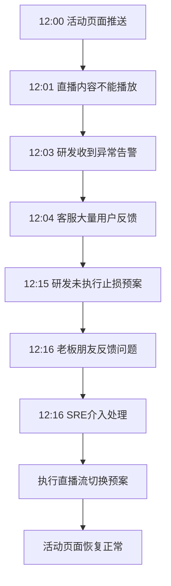

#### 2.1.2 暴露问题

1. **告警通知问题**: 告警未通知到足够多的对的人
2. **升级机制缺失**: 没有在适当时机进行职能性升级
3. **预案执行问题**: 一线同学沉迷查找问题原因，未及时执行预案止损

### 2.2 案例二：深夜全线告警故障

#### 2.2.1 故障时间线

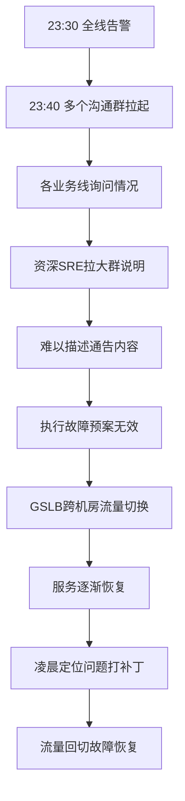

#### 2.2.2 暴露问题

1. **进展同步问题**: 缺少统一的故障进展同步方式，靠人拉群打电话
2. **协调人缺失**: 大型故障缺少协调人，没有人能拿到故障全貌
3. **关联分析缺失**: 缺乏故障关联分析能力，各业务线自查问题
4. **复盘困难**: 故障处理信息零散，复盘成本极高

### 2.3 问题总结

#### 2.3.1 事前阶段问题

- 告警信息量大、杂乱
- 变更信息分散在多个平台
- 客服反馈靠人工转达
- 舆情信息难以感知

#### 2.3.2 事中阶段问题

- 一线同学过于关注技术点，沉迷问题解决
- 多团队协作困难
- 最新进展消息无法及时传递
- 参与人员多时缺少协调，职责不清晰
- 有人"凑热闹"，帮不上忙

#### 2.3.3 事后阶段问题

- 故障处理信息零散（群、电话、口头）
- 缺乏平台工具支持
- 处理时间线繁琐，易遗漏
- 缺少结构化复盘流程
- 待办改进事项无统一记录和跟进
- 改进项是否完成缺少验证

## 三、应急响应核心理念

### 3.1 应急响应定义

#### 3.1.1 信息安全应急响应定义

> 组织为了应对突发重大信息安全事件的发生所做的准备，以及在事件发生后所采取的措施

#### 3.1.2 日常故障应急响应定义

> 一个组织为了应对各种意外事件的发生所做的准备，以及在事件发生后所采取的措施和行为，通常用来减少和阻止故障/事件带来的负面影响和破坏后果

### 3.2 应急响应核心要素

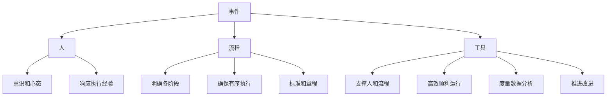

#### 3.2.1 人（核心主体）

**角色定位**: 参与和执行操作的角色和主体

**要求**:

- **意识和心态**: 故障来临时稳若泰山，不慌张
- **应急经验**: 具备熟练的响应执行经验

#### 3.2.2 流程（执行标准）

**目标**: 明确应急响应各个阶段

**作用**:

- 确保人员按照约定顺序和流程执行
- 按照章程标准有序执行
- 不凭感觉处理问题

#### 3.2.3 工具（效率保障）

**目标**: 支撑人和流程高效顺利运行

**功能**:

- 支撑应急响应全流程
- 度量各阶段数据
- 后置分析和运营
- 推进人和流程改进

## 四、事件生命周期管理

### 4.1 事件生命周期

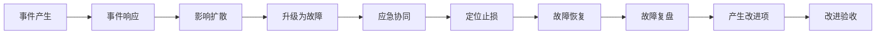

#### 4.1.1 事件来源

- **监控系统**: Prometheus、告警系统
- **发布系统**: CD发布系统
- **变更系统**: 变更管理系统
- **客诉**: 客服反馈
- **人工录入**: On-Call工单平台
- **舆情**: 互联网舆情

#### 4.1.2 事件形态变化

- **事前**: 告警、变更、客诉、On-Call、舆情
- **事中**: 事件可能升级为故障
- **事后**: 以复盘和改进形式存在

### 4.2 时间阶段度量

#### 4.2.1 MTBF（平均无故障时间）

**细分阶段**:

- **Pre（前置）**: 故障防御阶段
- **Post（后置）**: 复盘、改进、混沌工程、压测

#### 4.2.2 MTTR（平均故障恢复时间）

**细分指标**:

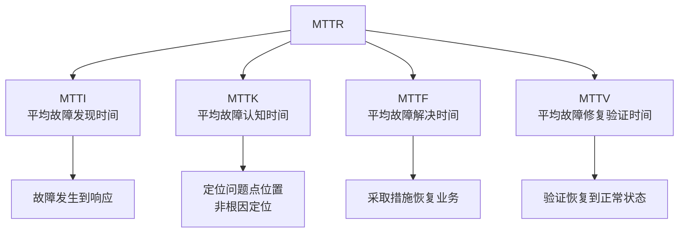

### 4.3 关键时间节点

#### 4.3.1 事件时间节点

- 创建时间
- 响应时间
- 处理时间
- 解决时间
- 关闭时间

#### 4.3.2 故障时间节点

- 创建时间
- 响应时间
- 确认时间
- 升级时间
- 定位时间
- 恢复时间
- 复盘时间
- 改进时间
- 关闭时间

**价值**:

- 对各阶段进行度量
- 发现过程中问题点
- 精准优化
- 量化考核

## 五、人员管理：On-Call系统

### 5.1 On-Call系统必要性

#### 5.1.1 常见问题

- **总找一个人**: 盯着熟人找，处理问题快
- **总找不到人**: 不知道该找谁，问题转多手
- **平台找不到人**: 流程系统无法找到当值人员

#### 5.1.2 目标定位

> 在正确的时间，为正确的事儿找到正确的人

### 5.2 三维合一模型

#### 5.2.1 核心概念

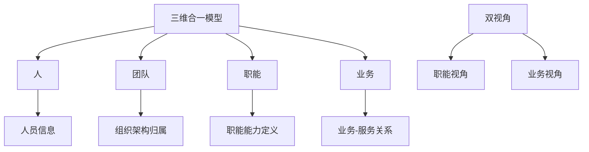

#### 5.2.2 双视角设计

**职能视角**:

- **树形结构**: 职能 → 组织 → 覆盖范围 → 值班表
- **适用场景**: 基础架构服务（SRE、DBA、微服务、监控）
- **查询方式**: 通过职能查找当值人员

**业务视角**:

- **树形结构**: 组织 → 业务 → 职能 → 值班表
- **适用场景**: 业务服务（直播、支付等）
- **查询方式**: 通过业务查找相关职能当值人员

**数据打通**: 两个视角的职能数据交叉打通，自动同步

### 5.3 On-Call系统功能

#### 5.3.1 排班管理

- **班组管理**: 支持多班组管理
- **日历排班**: 基于日历的排班
- **储备角色**: 班组设置储备On-Call角色
- **自动排班**: 基于时段自动生成排班计划
- **混合排班**: 多班组混排（白天/晚上不同人员）
- **换班功能**: 支持覆盖排班和换班

**混排场景示例**:

- DBA白天：10:00-21:00 一组人值班
- DBA晚上：21:00-次日10:00 另一组人值班

#### 5.3.2 通知方式

- **企业微信**: 主要通知渠道
- **电话通知**: 紧急情况
- **虚拟号码**: 保护员工隐私，避免直接打私人电话

#### 5.3.3 周边生态集成

- **告警系统**: 只通知当值人员
- **流程系统**: 流程审批找当值人员
- **企业微信服务号**: H5页面嵌入，快速找人
- **平台内嵌卡片**: 各平台内嵌On-Call卡片，一键找当值人

### 5.4 On-Call系统价值

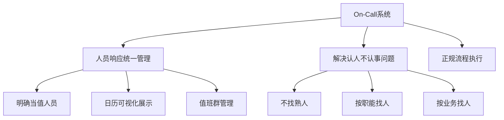

## 六、事件运营平台

### 6.1 平台定位

#### 6.1.1 理念基础

- **ITIL v3**: IT服务管理
- **ITIL v4**: IT服务管理
- **SRE**: 站点可靠性工程
- **信息安全应急计划**: 事件管理体系

#### 6.1.2 核心定位

> 一站式SRE事件运营平台，实现信息在线、数据在线、协同在线，提升业务稳定性

#### 6.1.3 目标

- **提升MTBF**: 提高平均无故障时间
- **降低MTTR**: 降低平均故障恢复时间
- **提升SLA**: 提高服务可用性

### 6.2 平台架构

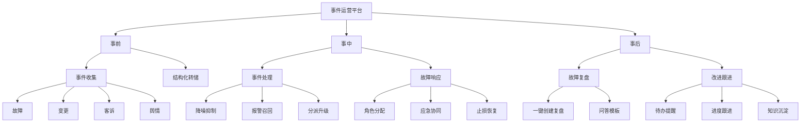

### 6.3 事件模型设计

#### 6.3.1 标准化事件模型

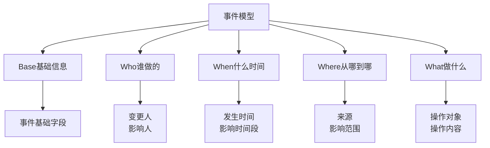

#### 6.3.2 关联字段预埋

- 事件之间建立关联关系
- 支持关联分析
- 实现降噪和聚类

### 6.4 降噪聚类机制

#### 6.4.1 横向降噪

**定义**: 单个来源事件通过规则收敛

**示例**:

- 某业务/服务/场景持续报警N条
- 在持续阶段内收敛到一个事件

#### 6.4.2 纵向抑制

**定义**: 底层系统故障导致的上层告警收敛

**场景**:

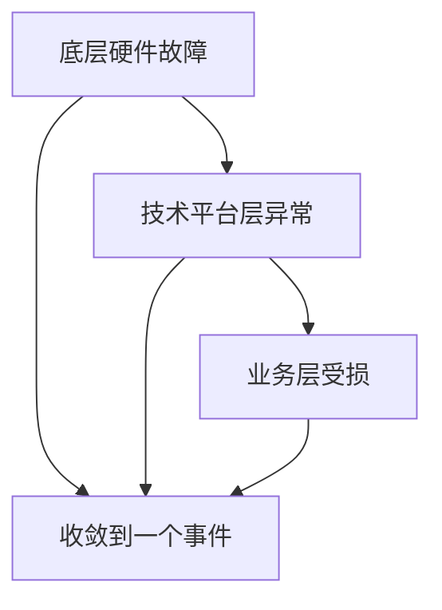

**价值**: 避免大量告警混淆视听

### 6.5 协同在线

#### 6.5.1 故障管理面板

**展示内容**:

- 当前处理人
- 关联业务和服务
- 关联组件和系统
- 进展信息
- 时间线

#### 6.5.2 应急响应群

**功能**:

- **一键创建**: 自动拉取On-Call相关人员
- **故障订阅**: 感兴趣的人可订阅故障
- **进展通知**: 自动推送最新进展
- **角色明确**: 展示指挥官和处理人

**解决问题**: 不再靠人工拉群、打电话、面对面找人

### 6.6 生命周期闭环

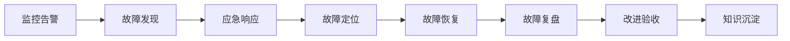

**价值**:

- 全阶段平台承载
- 不完全依赖人的经验
- 流程标准化

### 6.7 核心功能

#### 6.7.1 故障响应

- **全局应急通告**: 多种通告方式
- **实时信息同步**: 避免人工同步遗漏延误
- **信息完整性**: 避免着急处理问题时信息不全

#### 6.7.2 故障跟踪

- **实时展示**: 最新故障进展
- **影响面展示**: 故障影响范围
- **阶段展示**: 当前处置阶段
- **时间统计**: 各阶段花费时间

#### 6.7.3 故障复盘

- **结构化复盘**: 定义好的复盘过程
- **问题不遗漏**: 该问的问题必须回答
- **确认点全覆盖**: 关键点必须确认

#### 6.7.4 故障改进

- **平台录入**: 改进项录入系统
- **责任方关联**: 明确改进责任人
- **验收方关联**: 明确改进验收人
- **有效执行**: 确保改进落实
- **避免流于形式**: 开会讲完就忘

## 七、功能展示

### 7.1 协同功能

#### 7.1.1 故障创建自动化

- 自动关联业务组件和基础设施On-Call人员
- 可能是SRE，也可能是研发
- 记录人员响应状态
- 记录角色信息（指挥官/一线处理人）

#### 7.1.2 应急响应群管理

- 及时拉起故障协同群
- 第一时间发送故障最新情况
- 发送故障页面信息链接
- 受邀人员收到通知和电话

### 7.2 知识沉淀

#### 7.2.1 故障响应页面

**展示内容**:

- 最近24小时相关变更
- 关键操作记录簿
- 阶段更新
- 相似事件推荐

**价值**: 方便故障定位和查询

#### 7.2.2 记录簿功能

**作用**: 记录事件故障处理过程关键操作

**解决问题**:

- 不再靠群聊记录
- 不再靠电话口头沟通
- 避免信息丢失

#### 7.2.3 阶段更新

**预制阶段**:

- 故障发现
- 故障响应
- 故障定位
- 故障恢复
- 故障复盘
- 改进验收

### 7.3 复盘功能

#### 7.3.1 结构化复盘

**包含内容**:

- 复盘人员组织
- 影响情况
- 处置过程
- 根因分析（六问法）
- 改进措施

#### 7.3.2 复盘效率

**效率提升**:

- 默认关联故障信息
- 避免重复填写
- 时间线自动生成
- 变更自动关联

## 八、落地挑战与解决方案

### 8.1 挑战一：元信息不统一

#### 8.1.1 问题描述

- 涉及上下游系统众多（几十个）
- 各系统对人、业务、职能的定义不一致
- 缺少统一数据基准
- 平台无法自动运转
- 平台间缺少数据共识

#### 8.1.2 解决方案

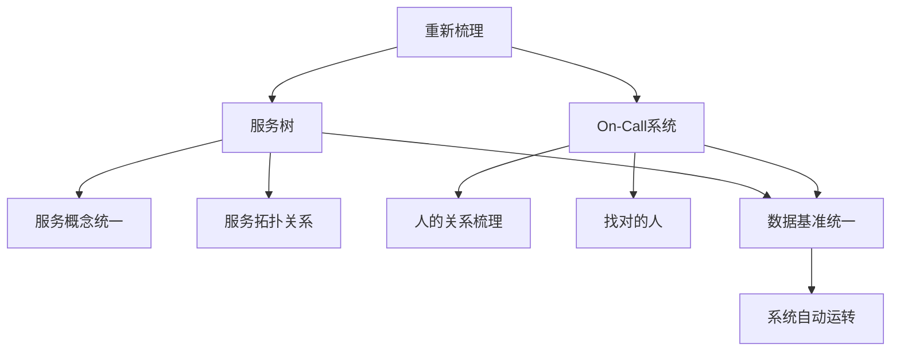

**核心工作**:

- 重新梳理服务树
- 统一服务概念
- 梳理On-Call系统
- 理清人的关系
- 确保找人找服务准确

### 8.2 挑战二：工作模式改变

#### 8.2.1 变化对比

| 传统模式       | 新模式             |
| -------------- | ------------------ |
| 依赖人         | 依赖系统           |
| 手动拉群打电话 | 系统自动关联邀请   |
| 群里随意沟通   | 平台阶段性进展同步 |
| 人工升级       | 平台定时自动升级   |
| 非正式流程     | 标准化正式流程     |

#### 8.2.2 带来问题

- **压迫感**: 10分钟不处理升级leader，15分钟升级大老板
- **不适感**: 流程变得严肃和标准
- **顺序冲突**: 群已拉起再创建故障，顺序反了

#### 8.2.3 解决方案

**系统优化**:

- 优化文案描述
- 优化交互逻辑
- 适应旧习惯（如现有群关联）

**持续宣讲**:

- 定期宣讲新流程
- 平台使用方法培训
- 帮助适应新模式

## 九、实施收益

### 9.1 核心收益

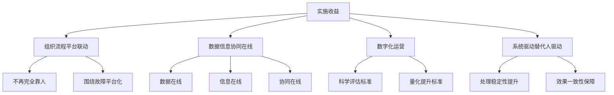

### 9.2 具体成果

#### 9.2.1 组织流程平台强效联动

- 围绕故障/事件实现平台化
- 不再完全靠人驱动

#### 9.2.2 三个在线实现

- **数据在线**: 事件故障数据在线化
- **信息在线**: 进展信息实时在线
- **协同在线**: 协同过程平台化

#### 9.2.3 数字化运营稳定性

- 建立科学有效的稳定性评估标准
- 建立量化的提升标准

#### 9.2.4 系统驱动

- 由人驱动变成系统驱动
- 不因人的不稳定性导致处理效果不一致

## 十、人员保障措施

### 10.1 应急响应白皮书

#### 10.1.1 内容规范

- **流程明确**: 明确响应流程
- **角色定义**: 基于事件大小定义参与角色
- **职责明确**: 每个角色的具体职责
- **SOP标准**: 周边子系统SOP制定标准
- **通告模板**: 对外通告内容模板
- **升级策略**: 故障处理升级策略

#### 10.1.2 目的

- 平台化产品化转化基础
- 统一标准规范

### 10.2 培训体系

#### 10.2.1 周期性宣讲

- **部门内部**: 定期宣讲
- **事业部**: 各BU宣讲
- **确保掌握**: 参与On-Call同学学习掌握

#### 10.2.2 新人培训

- **入职培训**: 作为必修课程
- **应急响应**: 应急响应流程培训
- **平台使用**: 平台工具使用培训

### 10.3 混沌工程演练

#### 10.3.1 目的

- 让新同学实操参与故障处理
- 避免真实故障时手足无措
- 积累故障处理经验

#### 10.3.2 场景

- 校招同学入职半年未遇故障
- 通过演练获得实战经验

## 十一、SRE团队建设

### 11.1 团队结构

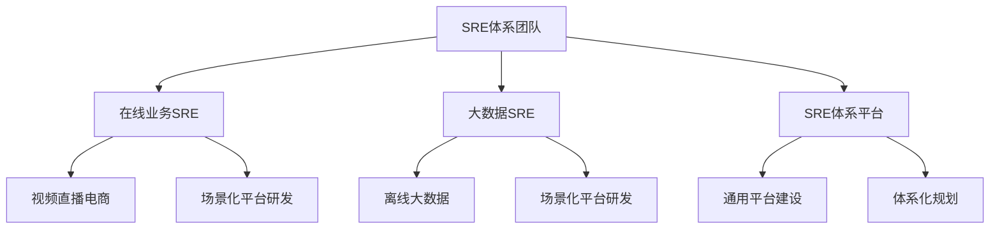

### 11.2 工作目标

#### 11.2.1 研发时间占比

- **目标**: 50%时间用于研发工作
- **参考**: Google的50/50原则
- **现状**: 业务SRE和大数据SRE约30%+，体系团队约80%

#### 11.2.2 On-Call系统价值

- 非值班时间可以专心研发工作
- 避免经常被人找打断工作节奏

### 11.3 技术栈

#### 11.3.1 Trace系统

- **标准**: Go Trace标准
- **方式**: 自研实现
- **协议**: 标准协议互通

#### 11.3.2 可观测性

- **标准**: OpenTelemetry
- **参考**: 业界白皮书
- **构建**: 整体可观测性体系

## 十二、Q&A精选

### 12.1 关于新技术投入

**问题**: 容器等新技术投入是否能提升SLA指标？

**回答要点**:

- 新技术引入要看应用场景
- 考虑技术成熟度
- 考虑团队能力是否hold住
- 稳定性保障方法论与技术无关，是相通的

**举例**:

- 3-4年前容器技术不成熟，全面容器化可能降低SLA
- 2022年容器技术成熟，有靠谱的人，可以提升SLA

### 12.2 关于SLA管理

**问题**: 云环境下如何定义存储服务SLA？

**回答要点**:

- 业务分级定义体系（L0/L1/L2/L3）
- 不同级别服务SLA要求不同
- 对内称为SLO（Service Level Objective）
- 保障手段相通，但对外承诺不同
- L0服务可能独立部署，L3服务可能混部

### 12.3 关于监控指标

**问题**: 监控指标是否分层？与SLA如何结合？

**回答要点**:

- 有专门SLO平台
- 基于组织-业务-服务树
- 每个服务可关联接口信息
- 围绕传统指标：耗时、可用率、错误率
- 基于接口落地相关SLO

### 12.4 关于故障发现

**问题**: 故障发现有什么好的方式？

**回答要点**:

- 传统监控手段
- **业务场景抽象**: 监控指标做业务层抽象
- **场景域设计**: 形成场景域概念
- **黄金指标**: Google SRE的北极星指标
- **多指标组合**: 多个指标组合成业务概念
- **自动产生故障**: 业务场景受损时自动创建故障

### 12.5 关于预案执行

**问题**: 如何确保预案执行而非查根因？

**回答要点**:

- **制度约束**: 必须有红线要求
- **培训宣导**: 持续培训让大家知道正确做法
- **平台强制**: 必须使用系统（如必须配监控）
- **参考阿里**: 故障1分钟不处理是红线

**关键点**:

- 专业运维/SRE必须按流程来
- 这是根本性要求

### 12.6 关于定位与恢复

**问题**: 更新定位和故障恢复是否冲突？

**回答要点**:

- **根因定位**: 放在最后（如代码问题）
- **定界**: 大概知道问题范围即可执行预案
- **定位问题**: 定边界，不是根本原因

**举例**:

- 服务器故障摘流：定位到服务器问题，执行摘流预案
- 不需要知道是代码问题还是配置问题
- 大概定位后即可执行高层次方案

### 12.7 关于故障指挥官

**问题**: On-Call值班人员是否轮值业务人员？指挥官如何指定？

**回答要点**:

**On-Call人员**:

- 基于自己负责的事儿值班
- 直播研发值直播的班
- 负责直播的SRE值直播相关的班

**故障指挥官**:

- **Google方式**: 第一个发现故障的人
- **B站方式**: 专门虚拟小组（故障指挥IIC）
- **原因**: 修故障的人没时间指挥
- **触发**: 故障范围扩大时介入
- **职责**: 接管故障整个指挥工作
- **参考**: 其他公司NOC或ECC团队

### 12.8 关于业务影响评估

**问题**: 能举例说明事件业务影响评估吗？

**回答要点**:

- **场景聚合**: 设计监控指标场景时评估
- **服务定级**: L0服务受损影响评估高
- **场景定级**: L0场景（如视频播放、直播打赏）影响高
- **人工评估**: 故障完结后基于PV、营收、数据损失评估

### 12.9 关于混沌工程

**问题**: B站混沌工程和故障演练如何做？

**回答要点**:

- 与业界做法类似
- 差异点在于如何结合B站业务形态
- 结合内部系统联动
- 基本是业界常规理论做实践

### 12.10 关于预案维护

**问题**: 预案的执行维护是怎么做的？

**回答要点**:

- **专项平台**: 针对重要专项（多活切流、CDN等）
- **作业系统**: 做上层抽象
- **阶段拆分**: 多阶段预案
- **不同动作**: 不同阶段不同动作
- **通用化**: 下一步要做的工作

## 十三、核心总结

### 13.1 核心理念

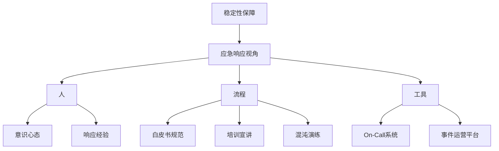

### 13.2 关键成功因素

#### 13.2.1 三维合一模型

- 人、团队、职能、业务关系理清
- 双视角设计（职能视角/业务视角）
- 底层模型概念清晰

#### 13.2.2 事件生命周期管理

- 事前：事件收集、结构化
- 事中：降噪聚类、应急协同
- 事后：复盘改进、知识沉淀

#### 13.2.3 标准化

- 事件模型标准化
- 响应流程标准化
- 复盘流程结构化
- 改进跟进规范化

### 13.3 实践价值

#### 13.3.1 效率提升

- 故障发现时间缩短（降低MTTI）
- 故障恢复时间缩短（降低MTTR）
- 复盘效率提升
- 改进落实有保障

#### 13.3.2 质量提升

- 信息不遗漏
- 流程标准化
- 职责清晰化
- 效果一致性

#### 13.3.3 体系化

- 从人驱动到系统驱动
- 从经验依赖到平台支撑
- 从碎片化到体系化
- 从定性到定量

### 13.4 适用场景

本方案适用于：

- **中大型互联网公司**: 系统复杂度高，故障影响面大
- **微服务架构**: 服务众多，依赖关系复杂
- **多团队协作**: 需要跨团队高效协同
- **追求高可用**: 对SLA有较高要求的业务

## 十四、附录

### 14.1 相关资源

- **哔哩哔哩技术公众号**: 有更详细的故障指挥IIC介绍
- **Google SRE书籍**: 应急响应相关章节
- **ITIL v3/v4**: IT服务管理框架

### 14.2 关键术语

| 术语             | 英文 | 说明                       |
| ---------------- | ---- | -------------------------- |
| 平均无故障时间   | MTBF | Mean Time Between Failures |
| 平均故障恢复时间 | MTTR | Mean Time To Recovery      |
| 平均故障发现时间 | MTTI | Mean Time To Identify      |
| 平均故障认知时间 | MTTK | Mean Time To Know          |
| 平均故障解决时间 | MTTF | Mean Time To Fix           |
| 平均故障验证时间 | MTTV | Mean Time To Verify        |
| 服务水平协议     | SLA  | Service Level Agreement    |
| 服务水平目标     | SLO  | Service Level Objective    |
| 故障指挥官       | IIC  | Incident Commander         |

---

**注**: 本文档基于B站SRE稳定性保障技术分享整理，旨在为SRE、运维及稳定性保障工程师提供应急响应体系建设的实践参考。

