# 云原生时代如何加速建设运维技术保障体系

> 来源：未核验 · 类型：分享 · 状态：draft

> 分享者：趣丸科技运维团队  
> 受众：SRE、运维及稳定性保障工程师

## 一、核心概念解读

### 1.1 三个关键词

本次分享围绕三个核心关键词展开：

- **时代**：明确我们所处的大背景和技术环境
- **加速**：如何选择关键技术要素和趋势实现快速发展
- **技术**：技术不是目的，用技术解决业务问题才是目标

### 1.2 公司背景

趣丸科技是一家基于兴趣社交的公司，核心理念是"基于兴趣连接人与人，消除孤独"。旗下拳头产品为TT语音，拥有丰富的兴趣社交产品矩阵。

## 二、运维趋势与挑战

### 2.1 VUCA时代的应对

**VUCA定义**：
- **V**olatility（易变性）
- **U**ncertainty（不确定性）
- **C**omplexity（复杂性）
- **A**mbiguity（模糊性）

VUCA概念源于90年代初冷战结束后的军事领域，后逐步应用于商业和经济领域。在当前环境下，黑天鹅事件（小概率事件）和灰犀牛事件（大概率风险）频发。

**应对策略**：

#### 适应性能力构建

> "能够生存下来的生物不是最强的，而是最有适应性的。" —— 达尔文《物种起源》

适应性的三个关键要素：

1. **快速迭代**
   - 基于对未来最有可能的假设
   - 设置投资或举措
   - 用最小投入验证假设
   - 形成闭环循环，不断迭代

2. **灰犀牛应对**
   - 全球化趋势
   - 多云架构
   - 降本增效（在增量趋于饱和的情况下做好节流）

3. **确定性建设**
   - 在不确定性中寻找确定性
   - 构建稳定的技术保障体系

### 2.2 核心概念关系梳理

#### ITIL、DevOps、SRE、云原生的关系

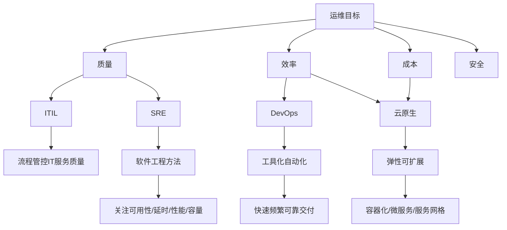

#### 各概念核心要点

**ITIL（IT服务管理）**
- 核心：通过流程方式管控IT服务质量
- 方法：流程 + 人工审批
- 问题：效率低下，审批流于形式

**DevOps**
- 目标：快速、频繁、可靠地交付软件
- 理念：打破部门墙，共同面向最终用户价值
- 手段：工具化、自动化提升交付效率

**云原生（CNCF定义）**
- 目标：构建和运行可弹性扩展的应用
- 核心特征：弹性、可扩展、高可用
- 五大关键技术：
  - 容器化
  - 微服务化
  - 服务网格
  - 不可变基础设施
  - 声明式API

**SRE（Site Reliability Engineering）**
- 本质：用软件工程方法解决运维问题
- 关注点：可用性、延时、性能、容量
- 能力要求：
  - 程序设计能力
  - 数据库能力
  - 软件开发能力
  - 系统设计能力
  - 掌握ITIL、云原生、DevOps理念

> **SRE是对传统运维的转型升级，要求运维工程师具备更强的软件工程能力。**

## 三、技术战略选型

### 3.1 技术架构分层

技术架构可抽象为两层：

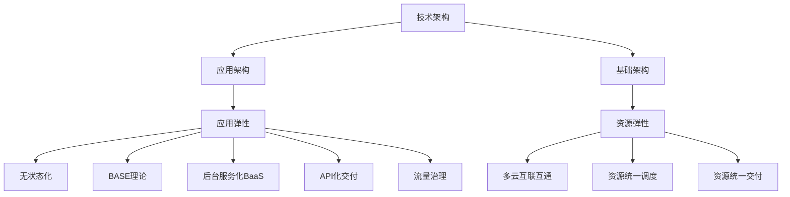

### 3.2 应用架构关键要素

#### 应用弹性四要素

1. **无状态化**：应用层面实现无状态设计
2. **BASE理论**：基本可用、软状态、最终一致性
3. **后台服务化（BaaS）**：所有存储、中间件作为服务调用
4. **API化交付**：统一API接口标准
5. **流量治理**：微服务环境下的核心能力

### 3.3 基础架构关键技术

#### 资源弹性三要素

1. **多云互联互通**
   - 可靠性保障
   - 商务灵活性
   - 前提：一定规模体量

2. **资源统一调度与交付**
   - 提升资源利用率
   - 增强稳定性
   - 降低成本

3. **关键技术点**
   - **数据中心互联互通**：网络基础设施
   - **Kubernetes**：容器编排标准（未使用K8s的公司技术相对落后）
   - **Istio服务网格**：
     - 杀手级特性：语言无关
     - 兼容任何编程语言
     - 统一服务治理（限流、熔断、路由等）
     - 成熟度持续提升

#### 可观测性体系

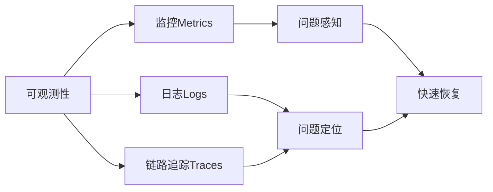

**核心理念**：
- 先感知问题（可观测）
- 再定位问题
- 最后快速恢复

**用户体验视角**：
- 从技术指标（资源利用率、接口成功率）
- 转向用户体验指标（C端用户实际体验）
- 向产品经理证明价值提升

## 四、组织架构设计

### 4.1 康威定律与团队拓扑

#### 康威定律核心观点

> "组织架构决定系统架构"

- 有什么样的组织架构，就会产生什么样的系统
- 需要什么样的系统，就应该设计什么样的组织架构
- 底层目标：提升团队协作效率，降低认知负载

#### 认知负载管理

类比OSI七层模型或TCP/IP四层模型：
- 层与层之间定义标准API交互
- 每层内部实现可以多样化
- 层与层之间的人员协作认知负载低
- 不需要关心对方实现细节

### 4.2 四种基本团队类型

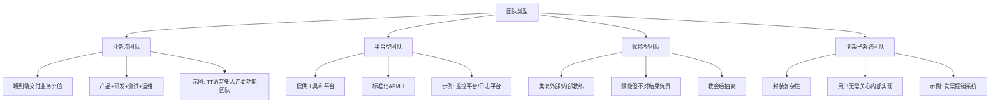

#### 1. 业务流团队（Stream-Aligned Team）

**定义**：端到端交付用户价值的团队

**特征**：
- 包含产品、研发、测试、运维等多角色
- 共同协作交付线上功能
- 直接面向最终用户

**案例**：TT语音多人连麦功能团队

#### 2. 平台型团队（Platform Team）

**定义**：提供工具和平台服务的团队

**特征**：
- 提供标准化API或UI
- 服务于内部用户
- 降低其他团队的认知负载

**案例**：监控平台、日志平台、运维平台

#### 3. 赋能型团队（Enabling Team）

**定义**：类似教练角色，帮助团队提升能力

**特征**：
- 教会团队如何做
- 不对最终结果负责
- 赋能完成后抽离

**应用场景**：
- 新技术引入
- 最佳实践推广
- 专项能力提升

#### 4. 复杂子系统团队（Complicated Subsystem Team）

**定义**：封装复杂性，提供简单接口

**特征**：
- 处理高度复杂的专业领域
- 对外提供简化接口
- 用户无需关心内部实现

**案例**：发票报销系统（用户只需提交发票，无需关心与税务系统的对接细节）

### 4.3 三种交互模式

团队之间的协作方式：
1. **协作（Collaboration）**：紧密合作
2. **X-as-a-Service**：服务提供模式
3. **引导（Facilitation）**：赋能辅导模式

> **注意**：即使在平台型团队内部，也可能存在这四种团队结构。组织架构设计应根据业务价值交付的沟通顺畅性进行调优。

## 五、技术文化与价值观

### 5.1 岗位职责定义

#### 运维团队的双重角色

**1. 稳定性第一负责人**

核心理念：
- 线上任何问题，运维团队第一时间响应
- 第一个冲在一线
- 连接人、协调人、解决问题

深层含义：
- 即使是研发团队的bug，运维也不能轻松对待
- 任何线上问题都是驱动系统变得更好的机会
- 从战略运维角度持续改进

**2. 产品经理角色**

背景问题：
- 人肉运维不可持续
- 需要构建工具系统
- 平台开发团队对运维场景理解不深
- 资深运维专家做独立产品经理投入成本高

解决方案：
- 运维同学兼任部分产品经理职责
- 深度参与平台产品设计
- 与平台团队共同打造工具
- 类似赋能型团队的协作模式

### 5.2 团队协作机制

#### 目标一致原则

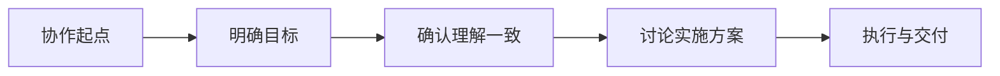

**核心要求**：
1. 先讲清楚要达到什么目标
2. 确保所有人理解一致
3. 在目标一致基础上讨论做什么、怎么做
4. 避免目标不清导致的无效协作

### 5.3 复盘改进文化

#### 复盘的本质

> **复盘是面向未来的，不是追责的**

**核心理念**：
- 关注如何做得更好
- 不是定责会议
- 避免团队间拉扯
- 将故障视为学习机会

#### 故障复盘实践

**不做的事**：
- ❌ 不定义故障责任人
- ❌ 不追究个人或团队责任
- ❌ 不进行相互指责

**要做的事**：
- ✅ 用5Why等方法深挖根因
- ✅ 区分表因、过渡因、根因
- ✅ 设计短期和长期改进措施
- ✅ 改进措施责任到人、责任到团队
- ✅ 跟踪改进措施落地

**复盘维度**：

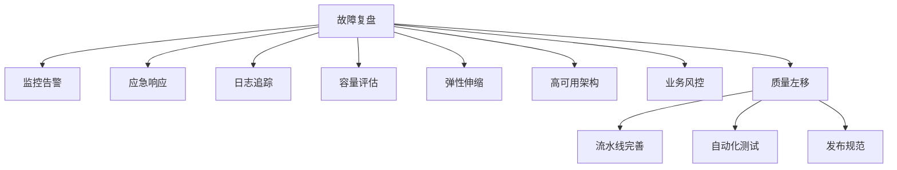

**效果**：
- 复盘氛围越来越好
- 团队持续改进意识增强
- 系统稳定性不断提升

### 5.4 技术卓越追求

**核心观点**：技术团队要有技术追求

**实践方向**：
- 云原生技术探索
- AIOps实践
- AIGC应用
- 鼓励创新尝试

**团队激励**：
- 创造条件让同学探索新技术
- 提供技术成长机会
- 搭建分享平台（如本次DBA+分享）
- 增强团队凝聚力和粘性

### 5.5 开放连接理念

#### 拥抱开源与云生态

**背景**：
- 基础技术不断完善
- 云平台能力快速迭代
- 开源技术发展迅速

**策略**：
- 站在行业视角看技术建设
- 充分利用行业已有能力
- 不仅是甲乙方关系

#### 与云厂商共创共建

**合作模式**：
- 构建合作伙伴关系
- 合作共赢
- 共创产品能力

**优势**：
- 云厂商资源投入大
- 技术能力深厚
- 基于共同方向共创
- 加速能力建设

## 六、具体实践路径

### 6.1 全球云专网建设

#### 背景与挑战

**原有问题**：
- 多云环境（国内A云、T云、H云等，海外多云）
- 多个VPC互联，配置复杂
- 增加网段需要多处配置
- 容易漏配、错配
- 漏配导致业务交付延迟
- 错配导致灾难性故障

#### 解决方案

**目标**：全球任何地方的资源一上线就互联互通

**架构设计**：

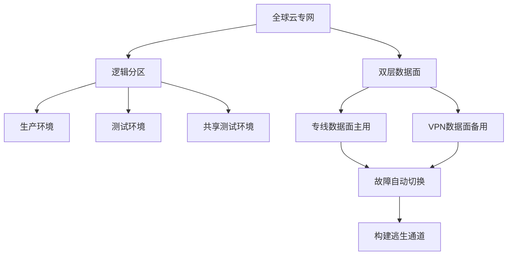

**核心特性**：
1. **全球互联互通**：任何AZ（可用区）都能互通
2. **逻辑分区**：生产、测试、共享环境隔离
3. **双层数据面**：
   - 主用：专线数据面
   - 备用：VPN数据面
   - 专线故障时自动切换到VPN
   - 构建逃生通道保障可用性

**价值**：
- 简化网络配置
- 提升交付效率
- 降低故障风险
- 全球十分钟内资源交付

### 6.2 统一资源交付

#### 背景问题

**多云环境挑战**：
- 每个云平台界面不同
- 配置方式各异
- 账号分散，安全风险高
- 交付效率低

#### 解决方案

**统一交付平台**：
- 统一交付界面
- 屏蔽底层云差异
- 集中账号管理
- 安全可控

**目标**：全球任何资源十分钟内交付

### 6.3 统一资源调度

#### 背景与目标

**现状**：
- 主机部署和容器化部署并存
- 资源池分散
- 利用率不均

**目标**：
- 统一资源池
- 统一调度
- 提升整体算力利用率

#### 实践策略

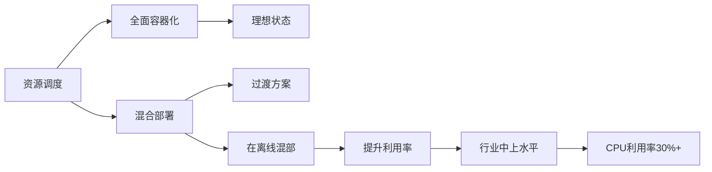

**实践方向**：
1. **全面容器化**（理想状态）
2. **混合部署**（过渡方案）
   - 在线业务与离线任务混部
   - 提升资源利用率
3. **统一调度平台**
   - 基于Kubernetes
   - 智能调度算法

**成果**：
- CPU利用率达到30%+
- 达到行业中上水平

### 6.4 应用交付能力

#### 核心理念

**以应用为中心**：
- 用户是研发者/开发者
- 构建应用视角的平台能力

#### CMDB建设：三个ONE原则

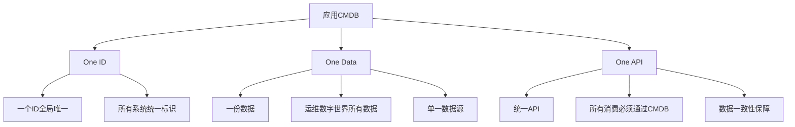

**One ID**：
- 一个ID在所有系统中唯一
- 全局统一标识
- 跨系统追踪

**One Data**：
- 运维场景所有数据集中存储
- 单一数据源（Single Source of Truth）
- 避免数据不一致

**One API**：
- 所有数据消费通过统一API
- 强制数据规范
- 保障数据质量

#### 数据质量保障

**核心观点**：
> "数据准不准不重要，数据被消费才重要"

**逻辑链**：
1. 没有场景消费 → 数据准不准无所谓
2. 有场景消费 → 必然发现数据问题
3. 发现问题 → 驱动数据修正
4. 持续消费 → 数据质量提升

**实践策略**：
- 基于场景驱动平台建设
- 基于动作驱动数据完善
- 平台底层驱动数据质量

**目标**：
- **一次编译，随处运行**
- 基于容器镜像化交付
- 真正实现跨环境一致性

### 6.5 可观测能力建设

#### 三大支柱

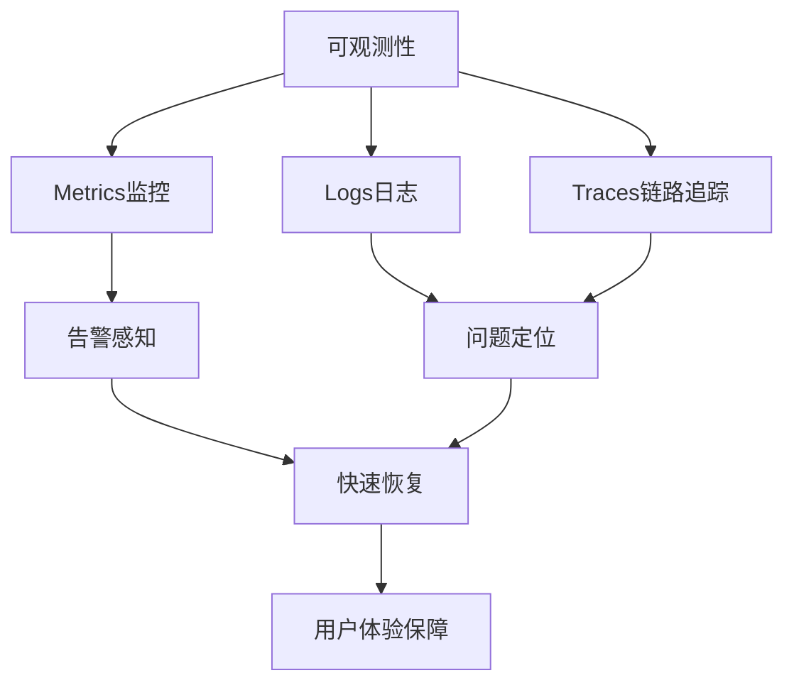

**标准组合**：
1. **监控（Metrics）**：问题告警
2. **日志（Logs）**：问题排查
3. **链路追踪（Traces）**：调用链分析

#### 用户视角建设

**用户关注点**（运维、研发）：
1. 平台稳不稳定
2. 平台好不好用
3. 平台性能怎么样

#### 建设策略

**关键决策**：
- 日志和链路追踪直接采用成熟外部方案
- 不自建，快速落地

**决策考量**：
1. **成本对比**
   - 自建：开发成本 + 维护成本 + 试错成本
   - 外部方案：采购成本
   - 需要完整的成本模型对比

2. **稳定性保障**
   - 自建需要海量验证
   - 外部方案已经过大规模验证
   - 避免踩坑

3. **效率优势**
   - 快速上线
   - 专注核心业务
   - 降低人力投入

**建议**：
- 非核心竞争力的基础设施优先采用成熟方案
- 核心业务能力可以自建
- 做好成本效益分析

### 6.6 故障复盘能力

#### 复盘理念

**核心原则**：
- 重视每一次复盘
- 当做深入学习的机会
- 关注改进而非追责

#### 复盘维度

**全链路检查**：

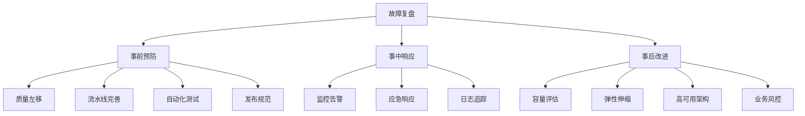

**检查项**：
1. **监控告警**：是否及时准确
2. **应急响应**：是否快速有效
3. **日志追踪**：是否完善可查
4. **容量评估**：是否提前预判
5. **弹性伸缩**：是否自动应对
6. **高可用架构**：是否有效防护
7. **业务风控**：是否有降级预案
8. **质量左移**：
   - 流水线是否完善
   - 自动化测试是否充分
   - 发布规范是否遵守

#### 面向未来改进

**目标**：
- 从每次故障中学习
- 持续完善技术能力
- 构建更强的防护体系

## 七、愿景与目标

### 7.1 核心能力愿景

#### 资源交付能力
- **随时随地资源交付**
- **随时随地无限算力**
- 全球十分钟内资源就绪

#### 应用交付能力
- **一次编译，随处运行**
- 基于容器镜像化交付
- 跨环境一致性保障

#### 质量保障能力
- **用户体验可度量、可改进**
- 从技术指标到用户体验
- 持续优化用户感知

#### 故障管理能力
- **把每一次故障当成机会**
- 注意：不是主动制造故障
- 事前风险治理
- 事后复盘改进

### 7.2 团队文化愿景

**文化特征**：
1. **开放连接合作**
   - 拥抱开源
   - 与云厂商共创
   - 行业交流分享

2. **关注改进不追责**
   - 面向未来
   - 持续学习
   - 团队成长

3. **风险主动识别和规避**
   - 事前预防
   - 主动治理
   - 降低故障率

## 八、总结与实践

### 8.1 核心框架

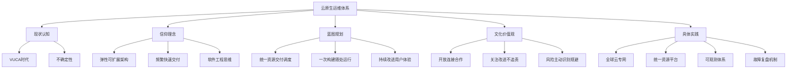

### 8.2 实践原则

#### 业务价值驱动

**核心理念**：
- 围绕业务价值做事
- 对业务没有价值的不做
- 不为技术卓越而技术卓越
- 技术服务于业务目标

#### 成效度量改进

**OKR实践**：
- 明确可度量的指标
- 围绕指标做改进
- 持续跟踪效果
- 迭代优化目标

**OKR颗粒度**：
- 取决于团队角色和资源范围
- 取决于阶段性核心目标
- 可大可小，关键是聚焦

**案例**：
- O（目标）：大幅降低故障感知时长
- KR（关键结果）：
  - 用户反馈感知时间 < X分钟
  - 基础设施问题感知时间 < Y分钟
  - 应用服务问题感知时间 < Z分钟
  - CDN/第三方问题感知时间 < W分钟

### 8.3 关键成功要素

#### 1. 技术战略清晰
- SRE + ITIL + DevOps + 云原生融合
- 应用架构与基础架构协同
- 关键技术选型正确

#### 2. 组织架构匹配
- 遵循康威定律
- 降低认知负载
- 四类团队合理配置
- 三种交互模式灵活运用

#### 3. 文化价值观引导
- 岗位职责明确
- 协作机制顺畅
- 复盘改进常态化
- 技术追求与开放连接

#### 4. 实践路径落地
- 全球网络互联互通
- 资源统一交付调度
- 应用交付标准化
- 可观测能力完善
- 故障复盘机制健全

## 九、Q&A精选

### Q1: 运维角度怎么持续改善用户体验？

**回答要点**：

1. **定义用户体验指标**
   - 不是运维单方面定义
   - 拉上产品、研发、运维三方
   - 形成共同语言

2. **指标映射关系**
   - 可能不是直接的运营指标（如充值成功率）
   - 但是强相关的技术指标
   - 建立映射关系

3. **运维驱动改进**
   - 牵头推动用户体验改善
   - 驱动各方坐在一起
   - 定义并签署指标

4. **技术层面改进**
   - 梳理业务流程架构
   - 识别关键环节
   - 针对性优化：
     - 网络延迟
     - 架构合理性
     - 流程优化

5. **SLO/SLI建设**
   - 定义服务等级目标（SLO）
   - 定义服务等级指标（SLI）
   - 例如：99%的时间充值成功率达标

### Q2: OKR基于什么样的颗粒度、工程方案或demo？

**回答要点**：

1. **颗粒度理解**
   - 颗粒度即目标大小
   - 取决于团队角色和资源范围
   - 取决于阶段性核心目标

2. **目标设定示例**
   - 团队级：提升整体故障时长
   - 细分维度：
     - 故障感知时长
     - 故障定位时长
     - 故障恢复时长

3. **关键结果设计**
   - 基于当前最重要的问题
   - 例如：大幅降低故障感知时长
   - 分解为具体维度：
     - 用户反馈感知
     - 基础设施问题感知
     - 应用服务问题感知
     - 第三方服务问题感知

4. **实践建议**
   - 识别当前最重要的问题
   - 聚焦核心目标
   - 设定可度量的关键结果
   - 持续迭代优化

---

## 附录：关键概念速查

### 技术概念

| 概念 | 核心要点 | 关键技术 |
|------|----------|----------|
| **云原生** | 弹性、可扩展、高可用 | 容器、微服务、服务网格、不可变基础设施、声明式API |
| **DevOps** | 快速频繁可靠交付 | 工具化、自动化、CI/CD |
| **SRE** | 软件工程方法解决运维问题 | 可用性、延时、性能、容量管理 |
| **ITIL** | 流程管控IT服务质量 | 流程化、标准化 |

### 组织概念

| 团队类型 | 职责 | 特征 |
|----------|------|------|
| **业务流团队** | 端到端交付业务价值 | 多角色协作、面向用户 |
| **平台型团队** | 提供工具和平台 | 标准化API/UI、服务内部用户 |
| **赋能型团队** | 提升团队能力 | 教练角色、不对结果负责 |
| **复杂子系统团队** | 封装复杂性 | 简化接口、专业领域 |

### 文化理念

| 理念 | 核心内容 |
|------|----------|
| **稳定性第一负责人** | 运维第一时间响应所有线上问题 |
| **产品经理角色** | 运维深度参与平台产品设计 |
| **目标一致** | 先明确目标，再讨论方案 |
| **面向未来复盘** | 关注改进不追责 |
| **技术卓越** | 鼓励探索新技术 |
| **开放连接** | 拥抱开源、与云厂商共创 |

---

**分享总结**：

本次分享从云原生时代的大背景出发，系统阐述了如何加速建设运维技术保障体系。核心是在VUCA时代构建适应性能力，通过技术战略选型、组织架构匹配、文化价值观引导，最终落地到全球云专网、统一资源调度、应用交付、可观测性、故障复盘等具体实践。

关键成功要素是：
1. **清晰的技术理念**：融合SRE、DevOps、云原生、ITIL
2. **匹配的组织架构**：遵循康威定律，降低认知负载
3. **正确的文化价值观**：开放连接、关注改进、技术追求
4. **扎实的实践落地**：从网络到资源到应用的全链路建设

最终目标是实现：**随时随地资源交付、一次编译随处运行、用户体验持续改进、把故障当成机会**。

---

> 本文档整理自趣丸科技运维团队的技术分享，内容涵盖云原生时代运维体系建设的完整方法论和实践经验。

