# 云原生下的SRE进化之路

> 来源：未核验 · 类型：分享 · 状态：draft


## 一、SRE的起源与发展

### 1.1 个人经历分享

#### 史军田老师的SRE之路

**职业演进轨迹**：

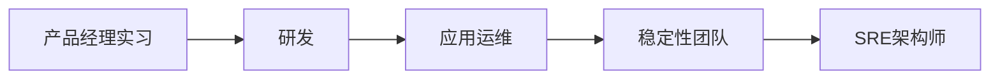

**关键转折点**（2018年左右）：

- 从传统运维中剥离出稳定性应急团队
- 接触Google SRE概念，找到职业定位
- 团队边界、职责、目标明确化
- 企业愿意为SRE团队买单

**个人感悟**：

> "纯运维确实稍微有点无聊，碰到Google的定义后，发现可以给自己套个帽子，把整个SRE的概念折腾起来。有了这个概念，团队的边界、职责和要做的事情就明确了。"

#### 刘浩老师的SRE启蒙

**接触时间**：2015-2016年

**启蒙来源**：

- Google SRE第一本书（孙宇聪老师翻译）
- 广州线下分享会《Google运维解密》

**行业背景**：

- 当时行业主要关注DevOps
- 大会主要讲流水线、交付、运维自动化平台
- 缺乏更高层次的职业定位
- 稳定性未被显性化提及

**价值认知**：

> "SRE给运维这个职业提供了一个高大更宏伟的目标，有一套科学的体系化架构设计，明确了在哪些层面做好保障工作。"

### 1.2 SRE的本质定义

**Google的经典定义**：

```
class SRE implements interface DevOps
```

**理解要点**：

- DevOps是接口（理念）
- SRE是实现类（实践）
- 各公司可根据需求重写实现方法
- 需要结合组织差异、基础设施差异、市场环境差异

## 二、Google SRE方法论的适配性分析

### 2.1 可取之处

#### ✅ 高度推荐实践

**1. On-Call轮值系统**

- 明确应急响应机制
- 控制团队规模增长
- 科学可控的管理方法

**2. 应急响应机制**

- 标准化响应流程
- 快速止损能力

**3. 混沌工程**

- 主动故障演练
- 提升系统韧性

**4. 软件工程思维**

- 用代码解决运维问题
- 平台化、自动化能力建设
- 提升工作效率

**5. 50% On-Call目标**

- 平衡运维与研发工作
- 避免纯救火模式

**6. 可观测性体系**

- 日志、指标、链路追踪三大支柱
- 全面监控能力

### 2.2 不可取之处

#### ❌ 实践难点较大

**1. 错误预算（Error Budget）**

**问题分析**：

- 可作为数据佐证
- 团队沟通施压时有用
- **但在国内很难真正执行**
- 不可能因为错误预算用完就停止变更

**适用场景**：仅作为参考指标，不能作为硬性约束

**2. PRR（Production Readiness Review）生产就绪审查**

**问题分析**：

- 极其耗费人力
- 需要大量人手才能做好
- 团队规模受限时很局促
- 容易流于表面形式

**B站实践**：

- 实施了BP（Business Partner）制度
- 1-2名同学专门协助事业部
- 参与业务研发评审
- 效果有限，但有一定价值

**3. 纯软件工程师组建团队**

**背景差异**：

- Google在2003年组建SRE时，国外可能没有成熟的运维岗位
- 更多是系统管理员（System Administrator）
- 中国互联网2010年后爆发，运维岗位起步已不同

**实践问题**：

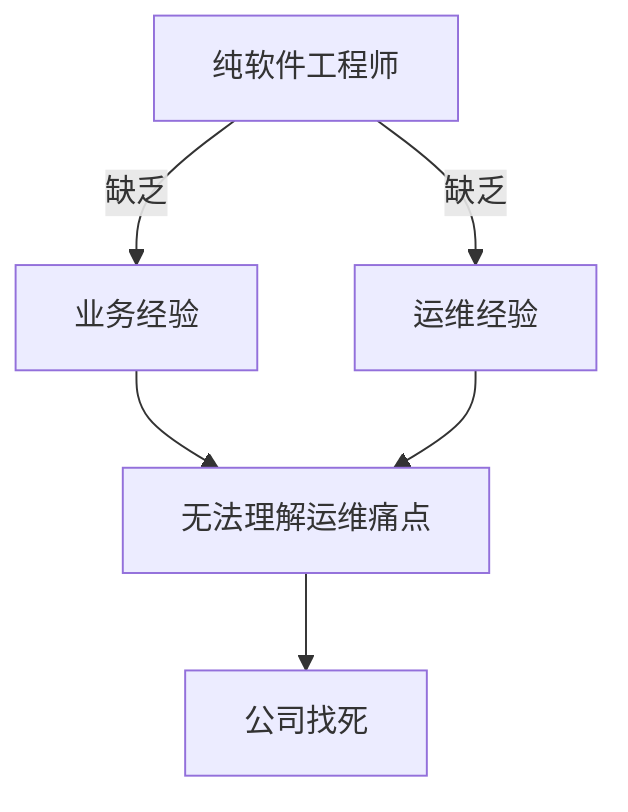

**正确做法**：

- 0到1阶段可用软件工程师
- 1到10阶段需要老带新
- 建立培训机制和平台保障
- 需要企业有足够培养能力

### 2.3 适配建议

**核心原则**：

1. **按需获取，不求大求全**

   - 基于当前急需改善的问题点切入
   - 不能全盘推翻现有体系
   - 不能上头，盲目追求先进
2. **构建顶层设计框架**

   - 先设计整体架构
   - 逐步落地能解决问题的点
   - 柔和渐进式改革
3. **结合企业现状**

   - 组织文化程度
   - 团队现状
   - 基础设施成熟度
   - 混合云复杂度

## 三、业界SRE落地实践现状

### 3.1 浙江移动SRE实践

#### 3.1.1 发展历程

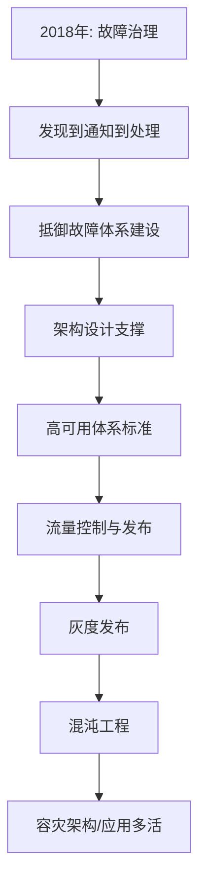

#### 3.1.2 当前重点方向

**1. 应用多活架构**

- 容灾架构建设
- 参考阿里应用多活平台
- 结合混沌工程和故障演练

**2. 架构治理标准化**

- 企业架构标准化
- 平台工具建设
- 流程体系完善

**3. 技术选型主导**

- 参与项目立项
- 架构设计决策权
- 组件选型话语权
- 非功能设计主导

#### 3.1.3 SRE职责范围

**全生命周期参与**：

- ✅ 项目立项参与
- ✅ 架构设计决策
- ✅ 技术选型主导
- ✅ 组件选型决定
- ✅ 集成工程负责
- ✅ 非功能设计落地
- ✅ CI/CD全流程
- ✅ 上线后运维保障

> "SRE从项目立项就可以参与，架构设计、技术选型都有决策权，集成工程都是SRE搞定，开发啥都不用管。"

### 3.2 B站SRE实践

#### 3.2.1 体系架构

**完整SRE体系**：

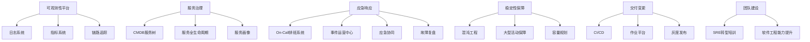

#### 3.2.2 核心平台

**1. 可观测性三大支柱**

- 日志系统
- 指标系统
- 链路追踪系统

**2. CMDB服务树**

- 服务全生命周期管理
- 服务画像
- 为周边系统提供元信息和上下文

**3. 事件运营中心**

- 稳定性指标数字化和在线化
- 应急响应、协同、通告平台化
- 故障全生命周期管理（发生前-中-后）

**4. 混沌工程平台**

- 故障演练
- 系统韧性验证

**5. 作业平台**

- 变更管理
- 降低人工变更风险
- 提升变更效率

#### 3.2.3 组织架构特点

**基础架构部定位**：

- 提供标准化组件
- 强制使用内部组件（TC技术委员会要求）
- 避免业务团队重复造轮

**业务团队压力**：

- 产品和运营盯得紧
- 更愿意投入业务迭代
- 依赖基础架构部提供能力
- 通过周例会提需求

**协作模式**：

- 业务架构师主动沟通
- 基于现有能力设计架构
- 需求驱动能力建设

### 3.3 共同特点总结

**1. 全流程覆盖**

- 从立项到运维的完整生命周期
- 不仅是运维，更是全栈保障

**2. 平台化能力**

- 大量自研平台工具
- 标准化流程和规范

**3. 与业务深度融合**

- 不是独立团队
- 与研发、架构紧密协作

**4. 强调产品思维**

- SRE需要具备产品经理能力
- To B平台的设计和运营

## 四、SRE与DevOps的关系

### 4.1 概念辨析

**DevOps**：

- 是一种理念（Interface）
- 强调研发运维一体化
- 目标是快速、高效、方便

**SRE**：

- 是DevOps的一种实现（Implementation）
- 更强调稳定性保障
- 具有更大的权限和职责范围

### 4.2 SRE的独特价值

**为什么需要SRE？**

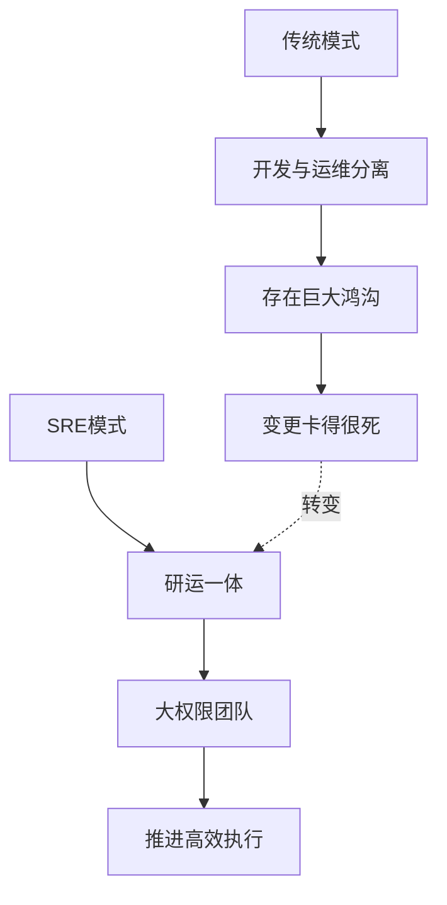

**SRE的权限范围**：

- 从项目立项开始参与
- 架构设计决策权
- 技术选型话语权
- 组件选型决定权
- 非功能设计主导
- CI/CD全流程负责
- 线上运维保障

**对研发的价值**：

- ✅ 帮助干活
- ✅ 加快项目进度
- ✅ 包揽上线后所有事情
- ✅ 研发只需关注业务逻辑

### 4.3 本质理解

**刘浩老师观点**：

> "我们本质是业务研发，但我们的业务范畴是运维这个领域。就像做支付研发必须懂支付领域，做运维研发必须懂运维领域。"

**核心能力要求**：

1. **懂业务**（运维业务）

   - 理解运维行业
   - 知道运维解决什么问题
   - 了解价值流和挑战
2. **有技术**（软件工程）

   - 研发能力
   - 平台化思维
   - 架构设计能力
3. **会产品**（产品思维）

   - 以客户为中心
   - 运营理念
   - 价值驱动

## 五、SRE的认知误区与正确理解

### 5.1 常见误区

#### 误区1：SRE = 懂运维的资深开发

**部分正确，但不全面**

**正确理解**：

- ✅ 需要**足够懂**运维（有沉淀，不是知道）
- ✅ 需要理解运维行业本质
- ✅ 需要知道价值流和挑战
- ✅ 需要评估当下最适合做什么
- ✅ 需要补齐正确的平台化能力

**错误理解**：

- ❌ 会写代码就能做SRE
- ❌ 做个界面和增删改查就够了
- ❌ 不需要深入理解运维

#### 误区2：SRE门槛低，容易转型

**实际情况**：

> "SRE门槛特别高，需要多领域的涉猎和具体经验积累。"

**转型挑战**：

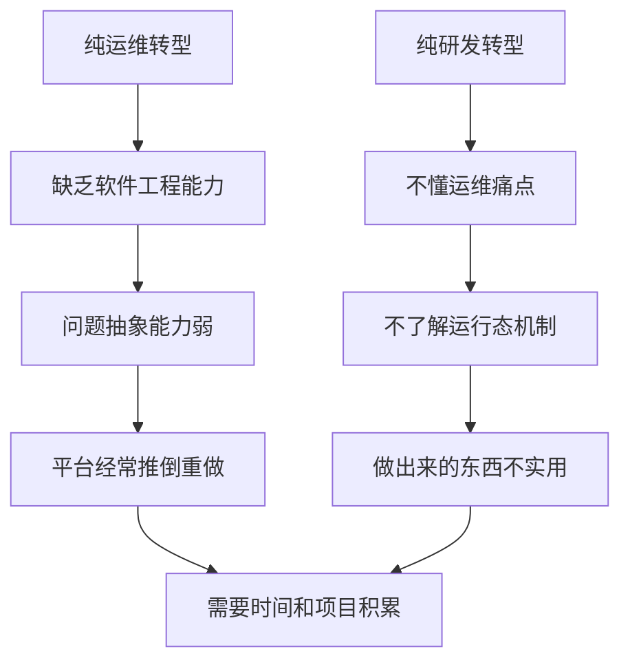

**常见问题**：

- 工具思维 vs 平台思维
- 需求导向 vs 体系思维
- 头疼医头 vs 系统设计

#### 误区3：SRE只是换个名字的运维

**本质区别**：

| 维度       | 传统运维 | SRE            |
| ---------- | -------- | -------------- |
| 职责范围   | 线上运维 | 全生命周期     |
| 技能要求   | 运维技能 | 运维+研发+产品 |
| 工作方式   | 手工操作 | 平台化、自动化 |
| 职业天花板 | 相对较低 | 相对较高       |
| 薪资水平   | 一般     | 较高           |
| 决策权     | 较小     | 较大           |

### 5.2 正确的SRE定位

#### 5.2.1 SRE的三大分类

**1. 基础设施SRE**

- 偏底层
- 商业化维度操作空间不大

**2. 平台SRE**

- 中间件等
- 平台化能力建设

**3. 业务SRE**（最多）

- 从传统运维转型
- 与开发容易混淆
- 侧重技术架构

#### 5.2.2 与开发的区别

**开发关注**：

- 业务逻辑实现
- 功能开发
- 需求实现

**SRE关注**：

- 技术架构
- 分层模型
- 技术方案
- 组件框架选型
- 集成方案
- 非功能设计

**协作模式**：

- SRE搭建标准化地基
- 开发在上面实现业务逻辑

#### 5.2.3 必备能力模型

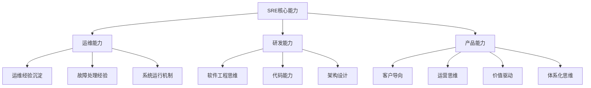

**关键理念**：

- Make things work（让系统运转）
- How things work（理解运作原理）
- 0.5（运维）+ 0.5（研发）= 1（SRE）

### 5.3 职业价值重塑

**传统运维痛点**：

- 感觉工作low
- 天花板有限
- 薪资不高
- 职业认同感低

**SRE带来的改变**：

- ✅ 新的职业价值感
- ✅ 自我实现途径
- ✅ 成长梯度明确
- ✅ 听起来有逼格
- ✅ 更高的薪资水平
- ✅ 更大的决策权

> "SRE满足了运维当中一些研发的梦想。以前很多运维干两三个月就走了，觉得不够高端。现在条件高了，天花板也高了，薪资报酬也高了。"

## 六、SRE团队建设与转型

### 6.1 团队组建策略

#### 6.1.1 人员构成

**不推荐**：

- ❌ 纯软件工程师
- ❌ 纯运维人员
- ❌ 简单组合两类人

**推荐**：

- ✅ 有运维经验的人员
- ✅ 具备一定研发能力
- ✅ 有产品思维的人
- ✅ 建立培训机制
- ✅ 老带新模式

#### 6.1.2 转型路径

**从运维转型**：

**初期挑战**：

- 缺乏软件工程背景
- 问题抽象能力弱
- 缺乏专业教育背景
- 路子走得比较坎坷

**成长路径**：

- 需要时间积累
- 需要项目经验
- 需要高人指导
- 需要系统培训

**从研发转型**：

**初期挑战**：

- 不懂底层运行机制
- 不了解JVM、数据库、网络
- 与业务开发沟通困难
- 缺乏运维经验

**成长路径**：

- 学习运维知识
- 参与故障处理
- 理解系统运行态
- 建立运维思维

### 6.2 B站实习生培养案例

#### 6.2.1 培养背景

**为什么招实习生？**

- 团队已经成熟
- 具备培养能力
- 软件工程专业学生
- 从零培养SRE思维

#### 6.2.2 成长阶段

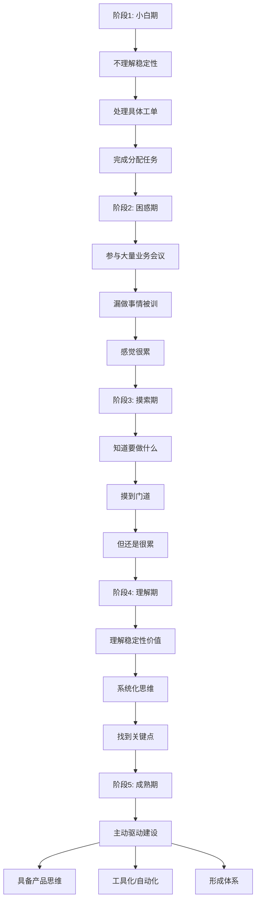

#### 6.2.3 关键转变

**从被动到主动**：

- 接报警 → 主动发现问题
- 陪大促 → 建设保障机制
- 救火 → 预防火灾

**从工具到体系**：

- 解决单点问题 → 系统化思考
- 头疼医头 → 建立机制
- 临时方案 → 长期规划

**从执行到设计**：

- 执行任务 → 规划方案
- 使用工具 → 建设平台
- 应对问题 → 预防问题

### 6.3 招聘难点

**现状**：

> "目前业界一个靠谱的SRE真的特别难招，比研发难招多了。"

**原因分析**：

- 需要多领域能力
- 需要实战经验
- 需要产品思维
- 市场供给不足

**应对策略**：

- 内部培养为主
- 建立培训体系
- 老带新机制
- 从实习生开始培养

## 七、SRE的工作准则与标准

### 7.1 核心准则体系

#### 7.1.1 On-Call标准

**轮值机制**：

- On-Call与Off-Call对应关系
- 50% On-Call目标
- 轮值排班系统

**应急响应标准**（业务室标准）：

- **1分钟**：接警
- **5分钟**：响应
- **10分钟**：止损处理

#### 7.1.2 故障处理流程

**完整流程**：

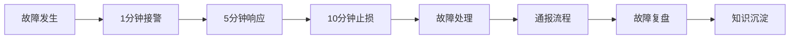

**关键环节**：

- 快速接警
- 及时响应
- 快速止损
- 标准通报
- 深度复盘

#### 7.1.3 变更标准

**变更类型**：

- 日常变更
- 重大变更
- 紧急变更

**变更管控**：

- 变更审批流程
- Double Check机制
- 关键节假日封禁窗口
- 封禁逻辑

### 7.2 全流程标准

#### 7.2.1 研发阶段

**代码审查**：

- 代码扫描
- 安全扫描
- 规范检查

**架构设计**：

- 总体架构设计
- 技术方案评审
- 非功能设计

#### 7.2.2 测试阶段

**测试工程**：

- 单元测试
- 集成测试
- 性能测试

**压测标准**：

- 非生产环境压测
- 性能基线建立
- 容量评估

#### 7.2.3 上线阶段

**上线前**：

- 演练验收
- 预案准备
- 回滚方案

**上线中**：

- 灰度发布
- 监控观察
- 快速回滚

**上线后**：

- 监控告警
- 故障应急
- 持续优化

### 7.3 交付标准

**交界点管理**：

- 每个环节都有交界点
- 两个团队的交付过程
- 明确交付标准

**流水线思维**：

- 上一道工序的输出
- 下一道工序的输入
- 质量门禁

**参考标准**：

- 信通院稳定性体系评测
- 行业最佳实践
- 企业自身细化

## 八、稳定性、效率、成本的平衡

### 8.1 三者关系

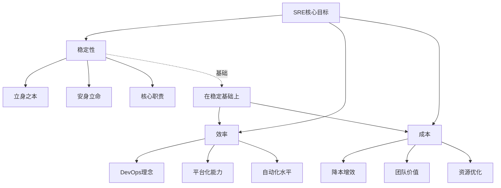

### 8.2 稳定性指标体系

#### 8.2.1 核心指标

**顶层指标**：

- **MTTR**（Mean Time To Repair）：平均修复时间
- **MTBF**（Mean Time Between Failures）：平均故障间隔时间
- **MTTI**（Mean Time To Identify）：平均识别时间

#### 8.2.2 分层指标

**业务层**：

- 用户可用性
- 业务成功率
- 办理成功率
- 访问量
- 耗时

**应用层（黄金四指标）**：

- Latency（延时）
- Errors（错误率）
- Traffic（流量）
- Saturation（饱和度）

**PaaS层**：

- 基础组件可用性
- 容器云控制面指标
- 中间件性能指标

**基础设施层**：

- 硬件健康度
- 网络质量
- 存储性能

### 8.3 成本优化策略

#### 8.3.1 成本分析维度

**资源成本**：

- 资源使用总量
- 单位资源使用率
- 容量规划决策

**人力成本**：

- 团队规模控制
- 自动化替代人工
- 效率提升

#### 8.3.2 容量规划

**核心价值**：

- 直接关联成本
- 保障业务稳定性
- 涉及多角色协作

**管理要素**：

- 资源容量管理
- 快速引导协作
- SRE、研发、预算、财务参与

**服务分级**：

- L0高优服务：足够资源和人力
- L3低优服务：可降低标准
- 混部集群降低成本

### 8.4 效率提升路径

#### 8.4.1 效率指标

**集成效率**：

- CI/CD流水线速度
- 自动化程度

**发布效率**：

- 发布频次
- 发布成功率
- 回滚时间

**系统运行效率**：

- 性能指标
- 资源利用率

**需求上线效率**：

- 需求积压天数
- 上线周期

#### 8.4.2 平台化能力

**作业平台**：

- 避免人工变更低效
- 降低变更风险
- 提升变更稳定性
- 降低人力成本

**规模效应**：

- 服务器1万 vs 10万
- 人力投入完全不同
- 平台化是关键

### 8.5 动态平衡策略

#### 8.5.1 不同阶段的优先级

**业务快速增长期**：

- 稳定性优先
- 适当增加成本
- 保障业务发展

**业务稳定期**：

- 成本优化优先
- 降本增效
- 资源运营

**技术债务期**：

- 效率提升优先
- 平台化建设
- 自动化改造

#### 8.5.2 服务分级策略

| 服务等级   | 可用性要求 | 资源投入 | 人力投入 | 成本策略 |
| ---------- | ---------- | -------- | -------- | -------- |
| L0核心服务 | 6个9或5个9 | 充足     | 充足     | 独立集群 |
| L1重要服务 | 4个9       | 适中     | 适中     | 标准集群 |
| L2一般服务 | 3个9       | 较少     | 较少     | 共享集群 |
| L3低优服务 | 2个9       | 最少     | 最少     | 混部集群 |

#### 8.5.3 价值度量

**成本中心的价值体现**：

- 稳定性提升
- 效率提升
- 成本降低
- 业务价值传导

**度量方法**：

- 集成频次
- 发布频次
- 需求上线周期
- 推导业务价值

> "技术团队是成本中心，如何从成本中心体现反向利润？看你的度量体系怎么设计。"

## 九、稳定性运营意识构建

### 9.1 运营意识的内涵

**核心定义**：

> 面对各种复杂工程时，对稳定性提升和保障的思考下意识。

**意识组成**：

- 应急响应机制
- 可观测性思维
- 可控性意识
- 容量规划思维
- 变更准则意识
- On-Call模式
- 协同模式
- 大促保障机制

### 9.2 意识培养路径（实习生案例）

#### 9.2.1 第一阶段：懵懂期

**特征**：

- Get不到稳定性是什么
- 只会处理工单
- 完成分配的具体任务

**工作方式**：

- 被动接收任务
- 点对点解决问题
- 缺乏全局观

#### 9.2.2 第二阶段：忙碌期

**特征**：

- 参与大量业务会议
- 漏做事情被训
- 感觉很累很忙

**困惑**：

- 为什么这么多会
- 为什么总是漏事
- 为什么比研发还着急

#### 9.2.3 第三阶段：理解期

**特征**：

- 知道要做什么
- 摸到门道
- 但还是很累

**典型场景**：

- 负责电商业务
- 大促前压测陪着
- 大促时熬夜陪着
- 混沌工程陪着
- 天天接报警

#### 9.2.4 第四阶段：成长期

**特征**：

- Get到稳定性运营价值
- 系统化思维
- 找到关键点和抓手

**能力提升**：

- 做稳定性基线
- 识别重点和抓手
- 结合业务特点

**业务差异认知**：

- 主站 vs 直播 vs 电商
- 不同团队策略不同
- UT环境 vs 线上环境

#### 9.2.5 第五阶段：成熟期

**特征**：

- 主动驱动建设
- 具备产品思维
- 形成完整体系

**主动性**：

- 主动思考问题
- 主动建设平台
- 主动优化流程

**工具化思维**：

- 用工具解决重复问题
- 用自动化替代人工
- 用平台化提升效率

**体系化能力**：

- 建立稳定性机制
- 建立提效机制
- 形成完整体系

**轮岗适应**：

- 快速适应新团队
- 找到合适切入点
- 开展提升工作

### 9.3 运营意识的价值

**个人价值**：

- 职业成长路径清晰
- 能力体系完整
- 适应能力强

**团队价值**：

- 稳定性持续提升
- 效率不断优化
- 成本有效控制

**业务价值**：

- 业务稳定运行
- 快速迭代能力
- 风险可控

## 十、业务团队与SRE的协作

### 10.1 浙江移动模式：深度融合

#### 10.1.1 协作方式

**从立项开始**：

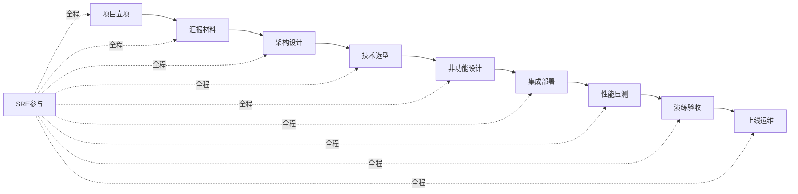

#### 10.1.2 不需要刻意支持

**原因分析**：

- SRE已成为不可或缺的环节
- 业务团队离不开SRE
- 整个过程融为一体

**业务团队获益**：

- 标准化体系保障
- 后续运维无需操心
- 项目进度更快
- 上线风险更低

**软件认知同步**：

- 从起点一起走
- 认知在同一水位线
- 除了业务代码，其他都了解

> "业务团队很乐意走SRE的标准化体系，反正是按你的走的，后面肯定也不用我掺和了。"

#### 10.1.3 成熟阶段的特点

**SRE能力成熟**：

- 对外提供能力成熟
- 内部培养体系完善
- 不需要外部特别支持

**组织架构清晰**：

- 团队分工明确
- 职责边界清晰
- 协作流程标准

### 10.2 B站模式：共识与分工

#### 10.2.1 两大核心原则

**1. 共识（Consensus）**

**稳定性共识**：

- 大家对稳定性提升有共识
- 业务是核心受益方
- 不是为了运维团队不被裁

**目标一致性**：

- 共同目标：业务稳定性
- 基于共识做分工
- 大是大非上认同

**2. 分工（Division）**

**职能分工**：

- 基于不同职能
- 涉及OKR和KPI
- 边界清晰但不冲突

**协作领域**：

- 应急响应
- 度量监控
- 服务治理
- 多活建设

#### 10.2.2 组织架构影响

**基础架构部定位**：

- 提供标准化组件
- 强制使用规范
- 技术委员会把控

**业务团队特点**：

- 业务压力重
- 不愿重复造轮
- 依赖基础能力

**协作机制**：

- 周例会沟通
- 需求提给基础架构部
- 压力传导机制

#### 10.2.3 深度协作场景

**多活建设**：

- SRE串联整个方案
- 业务方积极配合
- 担心走弯路
- 希望SRE主导

**架构设计**：

- 业务架构师主动沟通
- 基于现有能力设计
- 需要先知道手里有什么
- 不能脱离实际

**服务治理**：

- 代码质量
- 技改项目
- 服务拆分

### 10.3 共生关系

#### 10.3.1 多方协作

**协作团队**：

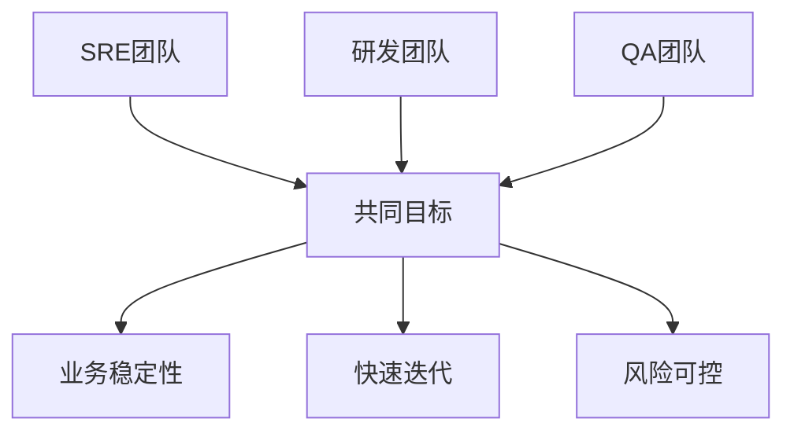

**协作紧密度**：

- SRE与研发
- SRE与QA
- SRE与业务架构

#### 10.3.2 双赢或多赢

**业务团队获益**：

- 稳定性保障
- 快速迭代能力
- 技术风险降低
- 专业能力支持

**SRE团队获益**：

- 职业价值实现
- 技术能力提升
- 影响力扩大
- 成就感

**企业获益**：

- 业务稳定运行
- 技术债务减少
- 团队效率提升
- 成本优化

### 10.4 初创阶段的支持

**需要支持的场景**：

- 企业从零开始建设SRE
- SRE团队刚成立
- 能力尚未成熟

**需要的支持**：

- 职责分工明确
- 组织架构调整
- 部门间约束机制
- 强制推行标准

**成长路径**：

- 初期需要约束
- 逐步建立能力
- 最终自然融合

> "刚开始还是需要一些职责上的分工，包括组织架构上的约束，去做一些相应的支持。这样会迫使SRE慢慢成长起来。"

## 十一、SRE的未来发展方向

### 11.1 能力提升重点

#### 11.1.1 产品思维

**为什么重要？**

- SRE平台属于To B平台
- 不是简单的增删改查
- 需要理解用户需求
- 需要运营思维

**Google的不足**：

- Google内部系统也很一般
- 底层系统（如Borg）做得强
- SRE相关系统也一般
- 不要神化和过度解读

**实践建议**：

- 理解SRE思想和目标
- 结合公司实际情况
- 结合自己理解和实践
- 对职业发展帮助更大

#### 11.1.2 软件工程能力

**抽象能力**：

- 问题抽象
- 架构抽象
- 系统设计

**Kubernetes的启示**：

- 优秀的软件抽象设计
- 对不同底层硬件抽象
- 系统级别抽象
- SRE思维的体现

**平台化思维**：

- 不是工具思维
- 不是需求导向
- 系统化设计
- 可扩展性

#### 11.1.3 架构能力

**技术架构**：

- 分层模型设计
- 技术方案选择
- 组件框架选型
- 集成方案设计

**从部署架构到技术架构**：

- 不只关注机器和IP
- 抽象运行过程
- 架构分层
- 模型搭建

#### 11.1.4 体系化思维

**不仅是Make things work**：

- 让系统运转
- 理解How things work
- 知道为什么这样工作
- 建立完整体系

**体系建设**：

- 稳定性体系
- 效率提升体系
- 成本优化体系
- 运营体系

### 11.2 技术方向

#### 11.2.1 云原生技术

**容器化**：

- Kubernetes
- Docker
- 容器编排

**服务网格**：

- Istio
- Service Mesh
- 流量治理

**可观测性**：

- OpenTelemetry
- 统一可观测标准

#### 11.2.2 混沌工程

**故障演练**：

- 主动注入故障
- 验证系统韧性
- 提升恢复能力

**演练平台**：

- 自动化演练
- 场景化演练
- 常态化演练

#### 11.2.3 AIOps

**智能运维**：

- 异常检测
- 根因分析
- 智能告警

**注意事项**：

- 不要过度神化
- 结合实际场景
- 逐步落地

### 11.3 组织发展

#### 11.3.1 团队规模

**控制增长**：

- 业务快速增长
- 团队规模可控
- 平台化是关键

**效率提升**：

- 自动化替代人工
- 平台化提升效率
- 工具化降低成本

#### 11.3.2 影响力扩大

**从被动到主动**：

- 从支撑到引领
- 从执行到决策
- 从工具到平台

**话语权提升**：

- 架构设计决策权
- 技术选型话语权
- 标准制定主导权

## 十二、关键观点总结

### 12.1 SRE的本质

1. **SRE = DevOps的一种实现**

   - DevOps是理念（接口）
   - SRE是实践（实现类）
2. **SRE = 运维 + 研发 + 产品**

   - 0.5（运维）+ 0.5（研发）= 1（SRE）
   - 必须具备产品思维
   - 需要多领域能力
3. **SRE的核心使命**

   - 保障系统稳定性（立身之本）
   - 提升研发效率（DevOps理念）
   - 优化成本（降本增效）

### 12.2 Google方法论的适配

**可取之处**：

- ✅ On-Call轮值系统
- ✅ 应急响应机制
- ✅ 混沌工程
- ✅ 软件工程思维
- ✅ 可观测性体系

**不可取之处**：

- ❌ 错误预算（难以执行）
- ❌ PRR生产就绪审查（耗费人力）
- ❌ 纯软件工程师组建（缺乏经验）

**适配原则**：

- 按需获取，不求大求全
- 构建顶层设计框架
- 结合企业现状
- 柔和渐进式改革

### 12.3 团队建设要点

1. **人员构成**

   - 有运维经验 + 研发能力
   - 建立培训机制
   - 老带新模式
   - 可从实习生培养
2. **转型挑战**

   - 纯运维：缺软件工程能力
   - 纯研发：缺运维经验
   - 需要时间和项目积累
3. **招聘难点**

   - 靠谱的SRE特别难招
   - 内部培养为主
   - 建立完整培训体系

### 12.4 协作模式

**浙江移动模式**：

- 深度融合
- 全生命周期参与
- 不需要刻意支持
- 自然协作

**B站模式**：

- 共识 + 分工
- 基础架构部提供能力
- 业务团队依赖使用
- 周例会机制

**共同点**：

- 目标一致
- 分工明确
- 深度协作
- 双赢或多赢

### 12.5 未来方向

1. **能力提升**

   - 产品思维
   - 软件工程能力
   - 架构能力
   - 体系化思维
2. **技术方向**

   - 云原生技术
   - 混沌工程
   - AIOps（不要神化）
3. **组织发展**

   - 控制团队规模
   - 扩大影响力
   - 提升话语权

## 十三、实践建议

### 13.1 对企业的建议

**初创阶段**：

1. 明确SRE职责边界
2. 建立组织架构支持
3. 制定标准和规范
4. 强制推行机制

**成长阶段**：

1. 建立培训体系
2. 完善平台能力
3. 标准化流程
4. 积累最佳实践

**成熟阶段**：

1. 自然融合协作
2. 持续优化改进
3. 输出方法论
4. 行业影响力

### 13.2 对个人的建议

**运维转型SRE**：

1. 学习软件工程
2. 培养产品思维
3. 提升架构能力
4. 建立体系思维

**研发转型SRE**：

1. 深入理解运维
2. 积累故障经验
3. 学习系统运行机制
4. 建立运维思维

**通用建议**：

1. 不要神化Google
2. 结合实际情况
3. 持续学习提升
4. 建立完整体系

### 13.3 对团队的建议

**招聘策略**：

1. 内部培养为主
2. 从实习生开始
3. 建立培训机制
4. 老带新模式

**能力建设**：

1. 平台化能力
2. 自动化水平
3. 标准化流程
4. 体系化思维

**文化建设**：

1. 稳定性文化
2. 工程师文化
3. 产品思维
4. 持续改进

## 十四、Q&A精选

### Q1: SRE与架构师如何合作？

**浙江移动实践**：

- 立项时共同参与
- 共同讨论非功能设计
- SRE主导组件选型
- 方案共同评审
- 领导最终决策

**示例**：多活架构中的引流组件

- 项目架构师提议：阿里开源方案
- SRE提议：自研Nginx多活平台
- 最终选择：SRE方案（更熟悉、更适合）

### Q2: 如何提高CMDB准确性？

**技术手段**：

- 通用Agent自发现能力
- 定时脚本扫描
- 自动提交和比对
- 发现变化自动更新

**管理手段**：

- 约束各专业部门
- 投产后N个工作日内必须更新
- 保证监控有效性

### Q3: 业界靠谱的SRE为什么难招？

**原因**：

- 需要多领域能力
- 需要实战经验积累
- 需要产品思维
- 市场供给严重不足

**应对**：

- 内部培养为主
- 从实习生开始培养
- 建立完整培训体系
- 老带新机制

---

## 附录：关键术语

| 术语    | 全称                                      | 说明             |
| ------- | ----------------------------------------- | ---------------- |
| SRE     | Site Reliability Engineering              | 站点可靠性工程   |
| DevOps  | Development and Operations                | 开发运维一体化   |
| MTTR    | Mean Time To Repair                       | 平均修复时间     |
| MTBF    | Mean Time Between Failures                | 平均故障间隔时间 |
| MTTI    | Mean Time To Identify                     | 平均识别时间     |
| On-Call | -                                         | 值班待命         |
| PRR     | Production Readiness Review               | 生产就绪审查     |
| BP      | Business Partner                          | 业务伙伴         |
| TC      | Technical Committee                       | 技术委员会       |
| OKR     | Objectives and Key Results                | 目标与关键成果   |
| KPI     | Key Performance Indicator                 | 关键绩效指标     |
| QA      | Quality Assurance                         | 质量保障         |
| AIOps   | Artificial Intelligence for IT Operations | 智能运维         |

---

**文档整理**：基于浙江移动史军田老师和B站刘浩老师在DBA+社群的技术分享
**分享时间**：2022年6月
**目标受众**：SRE、运维及稳定性保障工程师
**核心主题**：云原生下的SRE进化之路
