# 提升网站运维可靠性的探索和实践

> 来源：未核验 · 类型：分享 · 状态：draft


> 分享者: eBay 运维流量管理团队 Leader  
> 主题: 网站运维自动化与可靠性保障的实践经验  
> 受众: SRE、运维及稳定性保障工程师

## 一、背景与挑战

### 1.1 网站运维的核心特点

网站运维面临着**复杂性高、风险度高**的双重挑战:

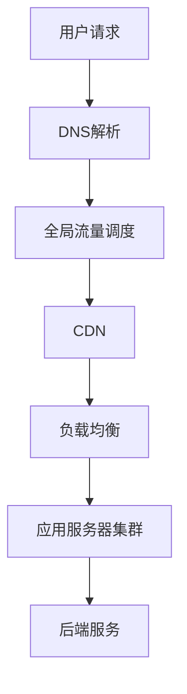

**技术栈复杂度体现在:**

- **客户端层面**: 多种浏览器、友好/非友好爬虫、反爬虫机制
- **CDN层面**: 缓存策略、证书管理、静态/动态内容区分、预热策略
- **源站层面**: 数据中心设计、内部架构、多地域部署
- **变更风险**: 大部分故障都与变更相关,而非硬件故障

### 1.2 运维面临的核心矛盾

#### 1.2.1 人性与变更的矛盾

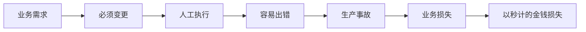

**关键问题:**
- 人必须做变更
- 人天然容易犯错
- 人的状态不稳定(疲劳、情绪波动、注意力分散)
- 高强度、重复性工作导致疲劳

#### 1.2.2 系统熵增问题

系统会随时间自然从有序走向无序:

- 代码依赖库版本变化
- 外部API接口变化
- 人员流动导致知识流失
- 长假后遗忘关键变更步骤
- 没有"血泪教训"就容易忽视运维规则

#### 1.2.3 自动化开发困境

虽然团队都在推进自动化,但面临诸多问题:

- **开发成本高**: SOP步骤多,开发任务重
- **基础能力缺失**: 依赖的组件和API不完善
- **通用性不足**: 针对单一场景定制开发,难以复用
- **迭代速度快**: 云化、虚拟化导致需求碎片化、长尾化
- **信念问题**: 是否真的相信所有工作都可以自动化?

### 1.3 挑战总结

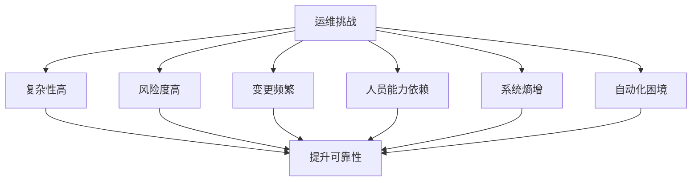

---

## 二、运维自动化战略

### 2.1 战略目标与方法论

#### 核心理念

**目标决定方法**: 
- 目标 50% 自动化 vs 90% 自动化 vs 100% 自动化,采取的策略完全不同
- **我们的目标**: 把所有能识别的手工变更全部自动化

#### 扬长避短的策略

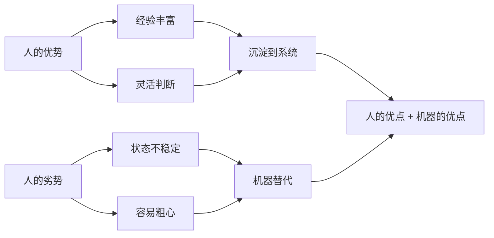

**核心思路:**
- **用足人的优势**: 将小张、小李的经验沉淀成文档,进而转化成代码
- **避免人的劣势**: 用机器的稳定性、精确性替代人工执行

### 2.2 关注基础能力而非表面结果

#### API完备度优先

不要只关注"哪个变更类型最多",而要综合考虑:

1. **变更数量维度**: 优先处理高频变更
2. **API基础能力维度**: 优先建设通用基础能力

**案例**: 某类型变更量不大,但依赖的API很重要,应优先开发

#### 归纳共性基础能力

- 将共性能力抽象成 API
- 避免依赖链中断(如存储团队没有API,只能提工单)
- 基础能力就位后,后续开发如虎添翼

### 2.3 通用型平台选型原则

#### 选型要求

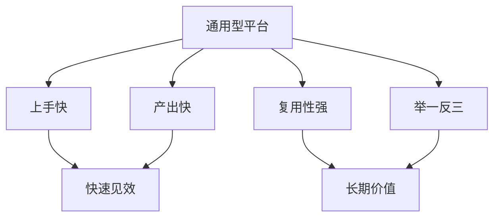

**关键特征:**
- **通用性**: 做一件事能方便后续多件事
- **快速上手**: 不能太复杂,战线不能拉太长
- **快速产出**: 及时展示成果,建立团队信心
- **高复用**: 基于复用模块构建新的自动化

#### 积木式开发理念

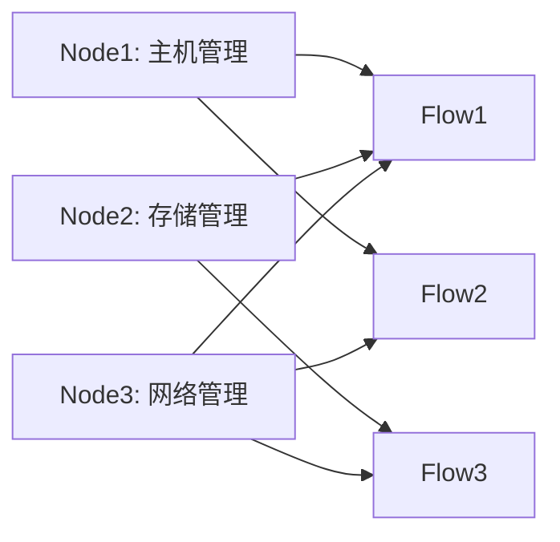

**核心思想:**
- 每个 Node 是一个标准化的基础能力模块
- 不同 Node 的排列组合形成不同的自动化流程
- 就像乐高积木,标准化、可组合、可创造

**示例**: 
- Flow3 = Node1 + Node2 + Node3
- Flow2 = Node1 + Node3  
- Flow1 = Node2 + Node3

### 2.4 多角度多维度策略

#### 不搞形式主义

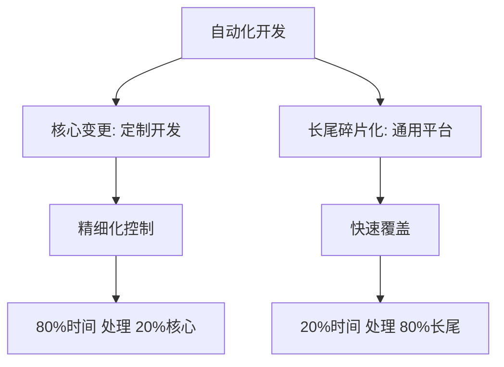

**二八原则应用:**
- **核心变更(20%)**: 使用已有的定制开发系统,经过十多年打磨,改造成本高
- **长尾变更(80%)**: 使用通用平台快速开发,提高覆盖率

**技术选型示例:**
- 团队选择了腾讯开源的**蓝鲸系统**(可根据自身情况选择其他平台)
- 也可以考虑低代码平台(如 Excel + Google Sheets 串联等)

### 2.5 借事修人,能力提升

**团队成长:**
- **Team Leader**: 提升认知高度
- **工程师**: 通过技术解决组织问题,获得成就感
- **新人**: 从简单开发入手,逐步成长

**全员开发化:**
- 所有运维人员都可以开发组件
- 降低门槛,让没有开发经验的同学也能参与

### 2.6 止血与造血并重

#### 避免陷入无限循环

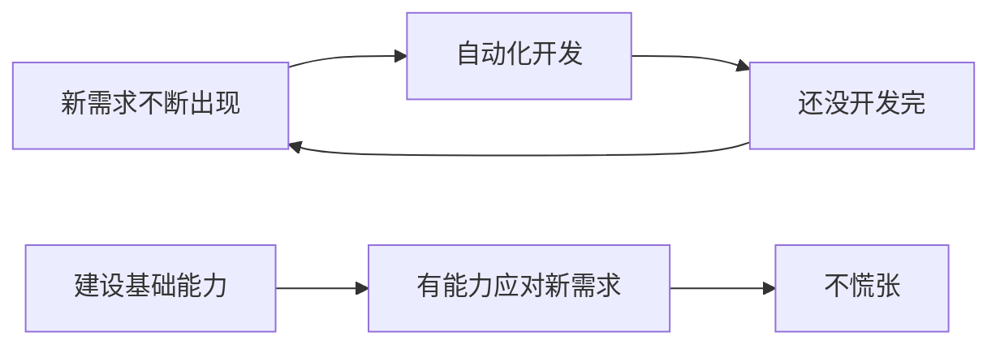

**三大原则:**

1. **基于组件开发**: 基础能力在手,新需求来了不慌
2. **不轻易承诺手工**: 等自动化就位后再开放,避免脏数据和技术债
3. **从小成功做起**: 不要一上来就做特别大的项目

### 2.7 快速开发实践

#### 开发速度对比

- **传统定制开发**: 几周甚至几个月
- **通用平台开发**: 几天甚至几小时(理想情况下)
- **中小规模场景**: 通常 1 天可以产出

#### 前提条件

**底层依赖已经成为系统中可用的基础模块**, 然后基于它做上层编排

---

## 三、自动化运维的安全保障机制

### 3.1 核心理念

**开发一个功能不难,保证它不产生负面作用才是关键**

运维自动化的特点:
- 安全是第一位
- 不能产生边界情况导致站点故障
- 双刃剑: 快了可能杀人也快,自杀也快

### 3.2 Region by Region 策略

#### 强制性要求

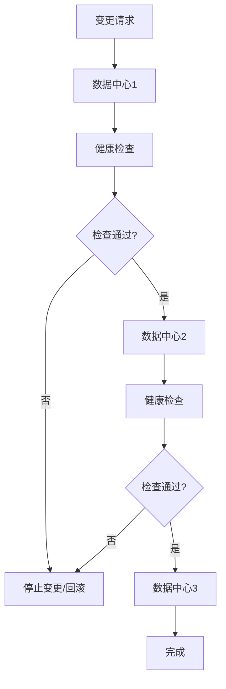

**核心原则:**
- 一个数据中心一个数据中心地执行
- 一个集群一个集群地执行
- 在自动化体系中**强制贯彻**这一原则

**双保险机制:**
- 第一层: 自动化系统本身要实现 Region by Region
- 第二层: 所有变更都经过基础服务审核,检查是否遵循此原则

### 3.3 健康检查机制

#### 三层检查体系

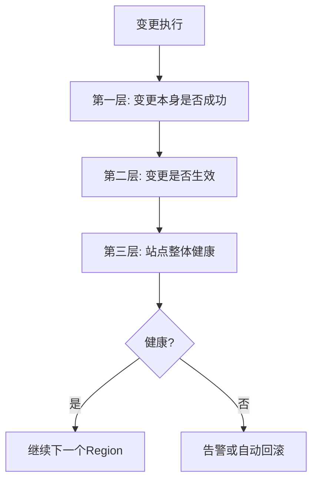

**医生打针类比:**
- 不是看针有没有打进去
- 而是看病人的反应如何
- 要看业务影响,如交易量、订票量、上架量等

**健康检查内容:**
- 控制面板数据波动监控
- 集成 AIOps 智能检测
- 自动化系统自动判断: 正常通过,异常告警/回滚

### 3.4 经验下沉到系统

#### 避免依赖个人能力

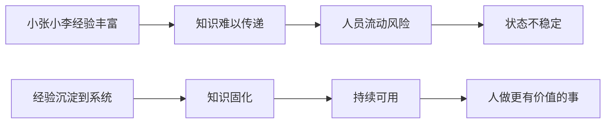

**反模式:**
- 小张小李特别靠谱,就让他一直做
- 容易造成单点依赖和知识流失

**正确做法:**
- 将经验文档化、代码化
- 让人维护系统、改进系统
- 让系统承担重复性、易出错的工作

#### 真实案例: 删除域名保护

**场景描述:**

工单要求删除某个"孤立域名" `abc.example.com`

**风险点:**

域名可能并非真正孤立,可能还有 member 在服务中

**人工操作风险:**
- 经验丰富的人会检查是否有流量
- 新人或状态不好的人可能忽略检查
- 直接删除会导致正在服务的站点下线

**系统保护机制:**

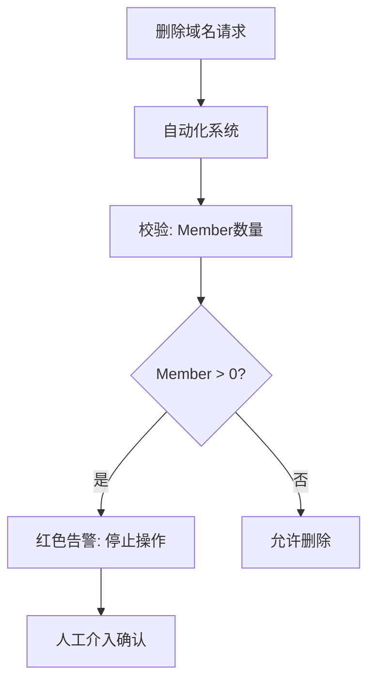

**实现方式:**
- 集成校验节点: `member_count_check`
- 如果 member 为空,允许删除
- 如果 member 不为空,红色告警,停止流程

**价值:**
- 即使人忘记检查,机器也会检查
- 防止误删正在服务的站点
- 多一道保险

---

## 四、高可靠的技术架构

### 4.1 架构设计理念

**双保险体系:**
- 第一道: 自动化系统的安全保障机制
- 第二道: 基础架构的容灾能力(兜底)

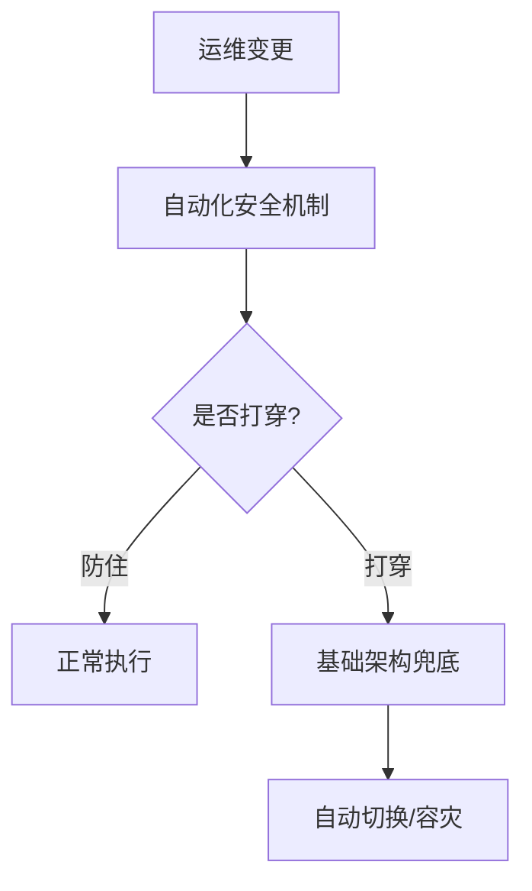

### 4.2 全球化多POP点架构

#### 架构优势

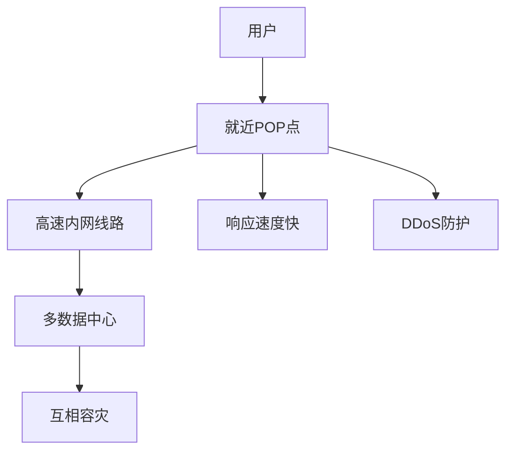

**核心能力:**
- **就近接入**: 离用户更近,响应速度快
- **互相容灾**: 巴黎挂了,阿姆斯特丹可以接管(距离不远,影响小)
- **DDoS防护**: 多个点分散流量,提升防护能力

### 4.3 内部高可用设计

#### 流量分配策略

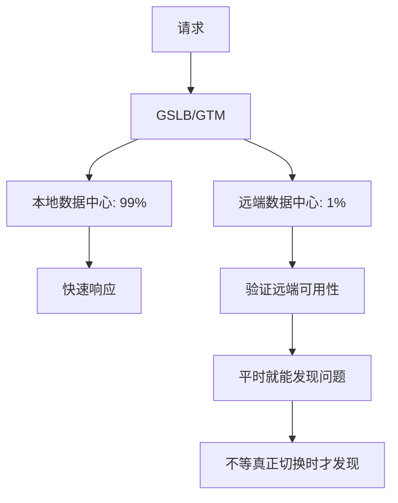

**策略优势:**
- **99% 本地**: 保证性能
- **1% 远端**: 
  - 持续验证远端可用性
  - 比例够小,用户几乎无感知
  - 一旦本地故障,远端可立即接管

#### 状态剥离与松耦合

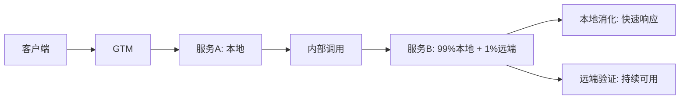

**设计原则:**
- 流量组件状态剥离
- 松耦合关系
- 本地优先,远端验证

### 4.4 多AZ设计

#### 细粒度隔离

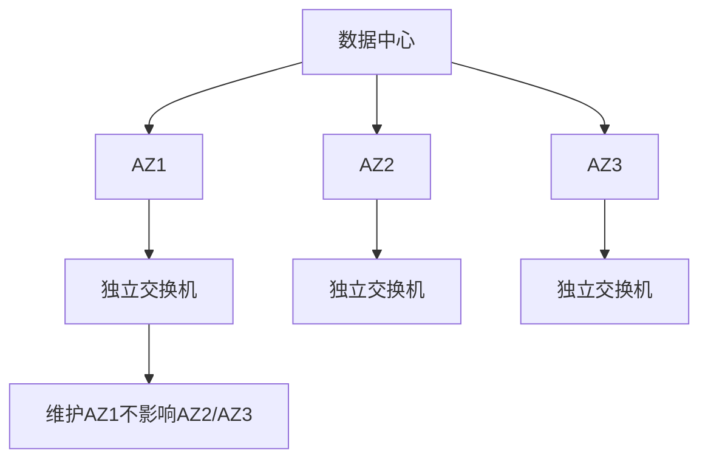

**优势:**
- 维护某个 AZ 的交换机、防火墙时,只影响该 AZ
- 其他 AZ 继续服务
- 不用关闭整个数据中心

### 4.5 容灾实战案例

#### 场景: 误删服务节点

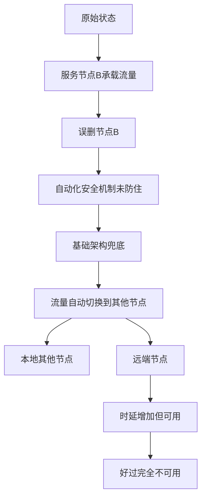

**容灾过程:**
1. 节点 B 被误删(橘色节点)
2. 由于有多个成员,流量自动分配到其他节点
3. 本地节点优先接管
4. 本地不够,远端节点接管(时延会增加)

**代价与收益:**
- 代价: 远端响应时间变长
- 收益: 好过完全服务不可用
- 给修复争取时间

---

## 五、实施成效与经验总结

### 5.1 自动化覆盖率

#### 进展数据

- **起点**: 自动化率约 70-80%
- **目标**: 100% 自动化(年底目标基本实现)
- **难度**: 越到后面越难,从 80% 到 99% 比从 0 到 50% 更难

**成效显著性:**

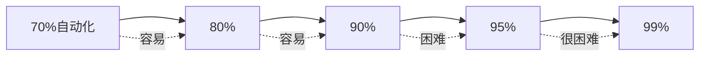

### 5.2 效能提升

#### 培训周期缩短

- **之前**: 新人 3-6 个月才敢做重要变更
- **现在**: 有自动化保护体系,新人可以更快产生价值

#### 人均效能提升

- 自动化后,人均产出明显提高
- 压力减小,可以关注更有价值的工作

### 5.3 安全生产

#### 故障率下降

**对比维度:**
- 统计每年运维变更引起的故障数量
- 统计故障导致的宕机时长

**示例:**
- 去年: 引起 1 小时宕机
- 今年: 引起 0.5 小时宕机
- 用数据说话

#### 机器 vs 人

- **机器**: 一定会执行检查,不会遗忘
- **人**: 可能忘记检查,状态不稳定

---

## 六、实施建议与最佳实践

### 6.1 如何选择优先切入项目

#### 选型策略

**不推荐:**
- ❌ 最核心、风险最高的项目(难度太大)
- ❌ 一年做不了几次的项目(效果不明显)

**推荐:**
- ✅ 风险次要的项目
- ✅ 数量不多不少的项目
- ✅ 2-3 周可以完成的项目

#### 成功故事打样

**第一个项目示例:**

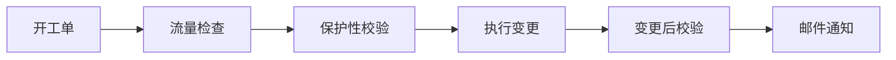

**包含节点:**
1. 自动开工单
2. 流量健康检查
3. 保护性机制校验(关键!)
4. 执行实际变更
5. 变更后再次校验
6. 自动发邮件通知

**全流程自动化,无需人工干预**

### 6.2 平台选型参考

#### 团队选择: 蓝鲸系统

- 开源平台,腾讯出品
- 使用其中的"标准运维"模块
- 适合长尾碎片化运维工作

#### 选型原则

**根据自身情况选择:**
- 如果有开发能力,可以自研
- 一般情况下,开源平台更合适
- 可以考虑低代码平台

**注意事项:**
- 不用把所有模块都用上
- 选择适合的部分即可
- 与现有系统(如 CMDB)对接

### 6.3 基础能力建设

#### API 化原则

- 将共性能力抽象成 API
- 通过 RESTful API 对接
- 编写可复用的 Node 节点

#### 示例: CMDB 对接

- 不使用蓝鲸自带的 CMDB
- 自己编写对接代码
- 作为可复用 Node 供团队使用

### 6.4 团队协作模式

#### 全员参与

- 5-6 人参与项目(起初是 1 人试验性项目)
- 不同程度参与
- 借事修人,共同成长

#### 代码复用文化

- 写好的 Node 供团队复用
- 同组同事可用
- 跨组同事也可用(如果在同一平台)

---

## 七、关键经验与反思

### 7.1 哲学思考

#### 人性与变更

**核心矛盾:**
- 人必须做变更
- 人天然容易犯错

**解决方案:**
- 不是把人修炼成圣人
- 不是靠惩罚或奖励改变人性
- 而是把经验沉淀到系统,用机器替代人工执行

#### 系统熵增

**客观规律:**
- 有序系统会自然走向无序
- 不维护就会混乱

**应对策略:**
- 持续投入维护
- 自动化系统本身也要维护
- 基础能力持续建设

### 7.2 避免形式主义

#### 灵活应对

- 不要硬性要求所有东西都用通用平台
- 已有的成熟定制系统可以继续使用
- 根据场景选择最合适的方式

#### 平衡投入产出比

```mermaid
graph TD
    A[变更类型] --> B{评估}
    B --> C[核心/复杂: 定制开发]
    B --> D[长尾/碎片化: 通用平台]
    
    C --> E[20%精力处理20%核心]
    D --> F[80%精力处理80%长尾]
```

### 7.3 持续迭代

#### 新技术适配

- Kubernetes 出现,需要适配
- 将来可能被新技术取代,继续适配
- 不能刻舟求剑

#### 新需求应对

- 今天实现 100% 自动化,明天可能出现新类型
- 关键是有应对能力(人 + 平台)
- 快速跟进,不断迭代

---

## 八、Q&A 精选

### Q1: 运维平台告警准确率有多高?

**A:** 
- 单点故障(如服务器宕机): 100% 准确
- 业务指标(成交率、支付量等): 
  - 之前靠人工看监控
  - 现在通过 AIOps 预警机制
  - 准确率在 **90% 以上**
  - 监控部门有在技术论坛分享过相关内容

### Q2: 是否用了蓝鲸组件对接公司内部 CMDB?

**A:**
- 对接了,但不是用蓝鲸特定能力
- 蓝鲸的 Node 是可以自己开发的
- 编写代码实现对接逻辑(RESTful API)
- 不使用蓝鲸自带的 CMDB,使用自己的
- 复用 Node,团队其他成员也可以调用

### Q3: 网站自动化变更应该从哪些项目优先切入?

**A:**

**不建议:**
- ❌ 最核心、风险最高的(第一个项目难度太大)
- ❌ 一年做不了几次的(效果不明显,难获支持)

**建议:**
- ✅ 风险次要
- ✅ 数量适中
- ✅ 2-3 周可以完成

**示例流程:**
1. 开工单
2. 流量检查
3. 保护性校验
4. 执行变更
5. 变更后校验
6. 邮件通知

**目标:** 打造一个成功故事,建立团队信心

### Q4: 贵司目前自动化运维达到多少?覆盖哪些业务?

**A:**
- 代表个人小团队,不代表整个公司
- 团队负责: 网站运维变更(流量管理相关)
- 当前覆盖率: **约 99%**
- 目标: 100% 自动化
- 团队对此很有信心

**备注:**
- 永远会有新的变更类型出现
- 关键是有能力快速跟进

### Q5: 运维平台建立以来,成功规避哪些重大风险?

**A:**

**运维的矛盾:**
- 做得好 = 默默无闻,深藏功与名
- 做得差 = 人尽皆知(可能还没被开除)

**关键机制规避风险:**
- Region by Region 机制
- 健康检查机制  
- 安全校验机制

**数据对比建议:**
- 统计 2020、2021 年每年变更引起的故障数
- 统计宕机时长
- 实施自动化后再看数据
- 用数据说话: 去年 1 小时宕机,今年 0.5 小时 → 有进步

---

## 九、核心观点总结

### 9.1 三个核心问题的解答

#### 问题一: 如何解决网站运维复杂度高且风险度高、运维工作长尾化且碎片化这一核心矛盾?

**解决方案:**

1. **目标明确**: 追求 100% 自动化,而非部分自动化
2. **通用平台**: 选择通用型自动化平台(如蓝鲸标准运维),快速覆盖长尾碎片化工作
3. **积木式开发**: 将基础能力封装成可复用的 Node,通过编排组合形成不同的自动化流程
4. **二八原则**: 20% 精力通过通用平台处理 80% 长尾工作,80% 精力定制开发 20% 核心变更
5. **良性循环**: 基础能力建设 → 快速应对新需求 → 持续积累能力 → 更强的应对能力

```mermaid
graph TD
    A[长尾碎片化] --> B[通用平台快速开发]
    B --> C[积木式Node复用]
    C --> D[2-3周甚至1天产出]
    D --> E[快速覆盖80%长尾]
    E --> F[基础能力持续积累]
    F --> G[应对新需求不慌]
    G --> A
```

#### 问题二: 如何沉淀运维经验至自动化系统?如何在提高通用化能力和效率的同时减少风险?

**经验沉淀方法:**

1. **扬长避短策略**:
   - 人的优势(经验、判断力) → 文档化 → 代码化 → 沉淀到系统
   - 人的劣势(易出错、状态不稳定) → 机器替代执行

2. **保护性校验机制**:
   - 在自动化流程中加入校验节点
   - 示例: 删除域名前检查是否有 member
   - 即使人忘记检查,机器也会检查

3. **经验案例化**:
   - 识别容易出错的步骤(如 SOP 第二步特别容易掉坑)
   - 在系统中对该步骤进行加强保护
   - 老同事的经验变成所有人的能力

**降低风险的三层机制:**

```mermaid
graph TD
    A[运维变更] --> B[第一层: Region by Region]
    B --> C[一个数据中心一个数据中心执行]
    C --> D[第二层: 三层健康检查]
    D --> E[变更成功 + 变更生效 + 站点健康]
    E --> F[第三层: 基础架构兜底]
    F --> G[多POP点 + 内部高可用 + 多AZ]
```

**关键原则:**
- 所有自动化流程必须实现 Region by Region
- 基础服务双重审核,确保遵循规则
- 集成 AIOps 智能健康检查,自动告警/回滚

#### 问题三: 如何突破"自动化开发速度永远赶不上新任务出现速度"怪圈?

**破局策略:**

1. **关注基础能力而非表面结果**:
   - 不只看"哪个变更类型最多"
   - 综合考虑 API 基础能力的完备度
   - 先建设共性基础能力,再基于它开发上层自动化

2. **造血能力建设**:
   - 像建设地铁施工队,而非找外包做一条地铁
   - 团队有能力 + 基础软件 API 就位 → 新需求来了不慌
   - 类比: 上海有地铁施工能力,想建就建

3. **三大原则防止陷入怪圈**:
   - ✅ **基于组件开发**: 基础能力在手,举一反三
   - ✅ **不轻易承诺手工**: 等自动化就位再开放,避免技术债
   - ✅ **从小成功做起**: 快速见效,建立信心

4. **全员开发化**:
   - 所有运维人员都能开发组件
   - 降低门槛,5-6 人协作
   - 借事修人,共同成长

5. **持续迭代文化**:
   - 新技术出现(如 K8s) → 快速适配
   - 新需求出现 → 基于现有能力快速开发
   - 不刻舟求剑,拥抱变化

```mermaid
graph LR
    A[新需求不断] --> B[基础能力就绪]
    B --> C[快速开发 1-3天]
    C --> D[又产生新基础能力]
    D --> B
    
    E[造血能力] --> F[应对能力]
    F --> G[不陷入怪圈]
```

### 9.2 最终效果

通过以上策略:

- **自动化率**: 从 70% 提升到 99%
- **开发周期**: 从几周缩短到几天甚至几小时
- **培训周期**: 从 3-6 个月缩短到更快产生价值
- **故障率**: 显著下降(用数据说话)
- **团队信心**: 相信可以实现 100% 自动化

---

## 十、延伸阅读与资源

### 技术平台

- **蓝鲸**: 腾讯开源的运维自动化平台
- **低代码平台**: 更适合非技术人员的自动化方案

### 关注渠道

- eBay 技术公众号: 技术文章分享
- 监控团队: AIOps 相关分享

### 团队覆盖领域

- 运维(流量管理)
- 数据
- 框架
- 支付
- 风控

---

## 总结

网站运维可靠性的提升是一个系统工程,需要:

1. **战略层面**: 明确 100% 自动化目标,选择通用型平台
2. **战术层面**: 积木式开发、基础能力优先、二八原则应用
3. **安全层面**: Region by Region、健康检查、经验沉淀
4. **架构层面**: 多 POP 点、内部高可用、多 AZ 容灾
5. **文化层面**: 全员开发、借事修人、持续迭代

**核心理念: 人的优点 + 机器的优点,而非人的缺点 + 机器的缺点**

通过自动化将人从重复性、易出错的工作中解放出来,去做更有价值的事情,最终实现运维可靠性的持续提升。

---

> 文档整理: 基于 eBay 运维流量管理团队 Leader 的技术分享  
> 分享时间: 约 60 分钟  
> 核心关键词: 运维自动化、可靠性保障、Region by Region、蓝鲸平台、经验沉淀、基础能力建设

