# 服务稳定性建设高可架构与多活治理

> 来源：未核验 · 类型：分享 · 状态：draft

> 分享嘉宾: 吉祥 - 哔哩哔哩基础架构部
> 负责方向: 主站、直播、OTT等在线业务SRE工作,业务多活推进和多活管控治理

## 一、高可用多活架构概述

### 1.1 多活方案定义

多活架构是指在同城或异地数据中心,建立一套与本地生产系统部分或完全对应的服务,通过流量调度将所有可用区的应用同时对外提供服务。当灾难发生时,多活业务可以快速实现流量切换,用户无感知或轻微感知故障影响。

**典型方案类型:**

- **同城多活**: 解决机房级故障容灾
- **异地多活**: 解决城市级故障容灾

### 1.2 同城多活方案

**核心特点:**

- 机房间网络延时控制在5毫秒以内
- 数据层具备主从同步和切换能力
- 通信质量好,追求数据最终一致性
- 可实现跨机房级别容灾且不丢失数据

**主要优势:**

- 架构方案相对简单
- 核心解决底层数据双活
- 网络延时低,业务改造成本小

**挑战与劣势:**

- 流量接入层和数据库写主库存在跨机房调用
- 复杂业务场景下频繁跨机房调用会增加耗时
- 可能影响用户体验

### 1.3 异地多活方案

**核心特点:**

- 机房间耗时可能达到30毫秒以上
- 难以用单集群模式提供服务
- 多集群模式下存在数据一致性复杂度

**行业解决方案:**

1. **单元化改造**

   - 业务具备单元数据分片能力
   - 单元间进行数据双向同步
2. **读写分离模式**

   - 主可用区支持读写
   - 异地建立只读单元,支持读流量分流

**主要优势:**

- 具备城市级故障容灾能力(地震、火灾等)
- 解决单机房容量上限问题
- 实现快速扩容
- 解决跨机房服务调用和数据库读写问题
- 核心依赖和存储在本机房完成,跨机房访问延时低

**挑战:**

- 业务改造成本较高
- 核心思想: 业务高内聚,单元间低耦合
- 需将核心依赖部署到单元可用区内

### 1.4 多活类型定义(CRG模型)

B站引入蚂蚁CRG多活概念,分为三种模式:

#### C纵模式(集中模式)

- **特性**: 用户间数据可共享
- **适用场景**: 平台侧数据
- **案例**: 视频播放、番剧播放、稿件信息、直播间等

#### R纵模式(单元化模式)

- **特性**: 用户侧流水型数据
- **适用场景**: 具有用户属性的流水数据
- **案例**: 评论、弹幕、动态、支付等

#### C纵模式(混合模式)

- **特性**: 介于集中和单元化之间,用户间数据共享
- **能力**: 支持当地可用区内可读可写
- **容忍度**: 接受一定数据延迟和不一致性

## 二、B站同城多活架构设计

### 2.1 数据中心规划

以上海机房为例:

- **4个机房** 划分为 **2个可用区**
- 用于C纵服务部署
- 可用区间网络延时约1毫秒
- 江苏机房作为R纵服务部署
- 验证华南或L2/L3边缘机房做异地多活

### 2.2 整体架构

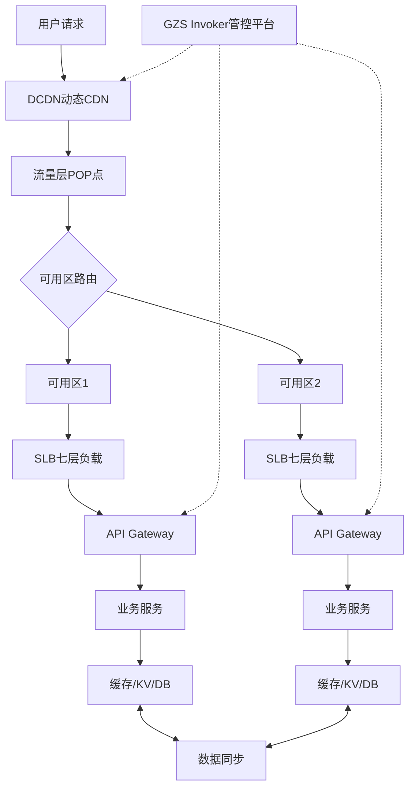

### 2.3 组件分层架构

**分层结构:**

1. 流量接入层
2. 缓存层
3. 消息层
4. 数据和存储层
5. 多活管控层

## 三、基础组件多活能力优化

### 3.1 流量接入层

#### 南北向流量(用户侧到内部服务)

**DCDN(动态CDN)**

- 基于边缘CDN节点实现动态最佳路由
- 自研PICK模块支持:
  - 基于用户MID或设备ID哈希到不同可用区
  - 支持多机房动态权重调整(如99:1或50:50)
  - 灵活的流量分配策略

**SLB(七层负载均衡)**

- 基于Nginx+Etcd实现
- 通过服务发现多可用区下游服务和API Gateway节点
- 支持API降级和全局限流能力

**API Gateway**

- 容器化部署
- 支持发现多可用区服务节点
- 位于南北向和东西向流量衔接层
- 核心能力:
  - 单可用区服务故障重试
  - API降级、熔断、限流
  - 与客户端联动流控,避免故障时疯狂重试
  - 支持HPA弹性扩容应对流量突增

#### 东西向流量(内网服务间调用)

**Service Discovery(服务发现)**

服务注册与发现流程:

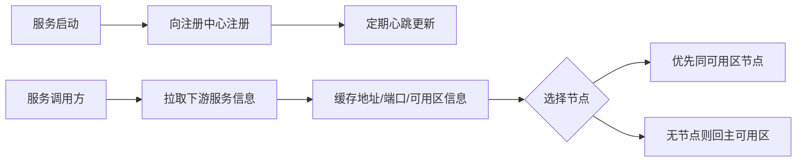

**核心能力:**

- 服务启动后向注册中心注册并定期心跳
- 拉取下游依赖信息(HTTP/gRPC地址、端口、可用区)
- SDK层面默认选取同可用区节点
- 下游未部署时自动回主可用区调用
- 支持东西向流量权重管理和灰度验证

**多活场景要求:**

- 服务支持本地完整处理写请求
- 强依赖必须本地部署
- 弱依赖允许跨专线回主机房调用

### 3.2 缓存层

#### 缓存接入方案

**统一Proxy接入:**

- 避免业务直连缓存实例
- 解决各语言SDK不统一问题
- 避免短链接风暴导致性能下降
- Proxy维护长链接到缓存实例
- 支持Sidecar和Proxy-less SDK部署模式

#### 缓存一致性方案

**场景一: DB/KV + 缓存(Cache Aside模式)**

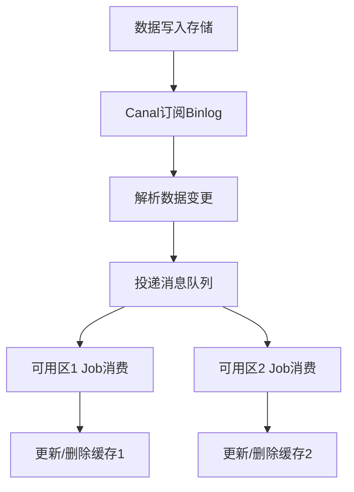

- 数据最终落到存储
- 通过Canal订阅存储Binlog
- 投递消息队列
- 业务Job解析处理后更新或删除缓存
- 维护缓存数据最终一致性

**Canal组件说明:**

- 模拟MySQL从库订阅数据源
- 定期从主库拉取Binlog
- 解析Binlog获取数据变更
- 投递消息队列供下游消费

**场景二: 纯缓存场景**

1. **热数据场景**

   - 通过定时Job从DB或离线数据源拉取
   - 存放到缓存中
   - 多活情况下在两个可用区独立部署
   - Job定时更新
   - 目标: 业务和缓存调用在单可用区内闭环
2. **缓存当存储使用(不推荐)**

   - 性能考虑,缓存不支持持久化
   - Redis Cluster模式下大规模故障会导致数据丢失
   - 建议改造为Cache Aside模式或使用KV存储

**场景三: 分布式锁/幂等处理**

**推荐方案: 使用KV存储**

- KV支持CAS命令
- 数据持久化(存储在SSD)
- 支持跨可用区同步
- 支持Redis协议和常用命令
- 适用于QPS < 10万的场景

**KV存储特点:**

- B站自研分布式KV存储系统
- 数据存储在SSD,性能略低于Redis内存
- 支持机房多活
- 支持跨可用区数据同步

### 3.3 消息层

#### 核心原则

- **单可用区内自产自销**
- **跨机房投递或消费由组件支持双向同步**

#### 三种消息模式

**模式一: 自产自销(Local模式)**

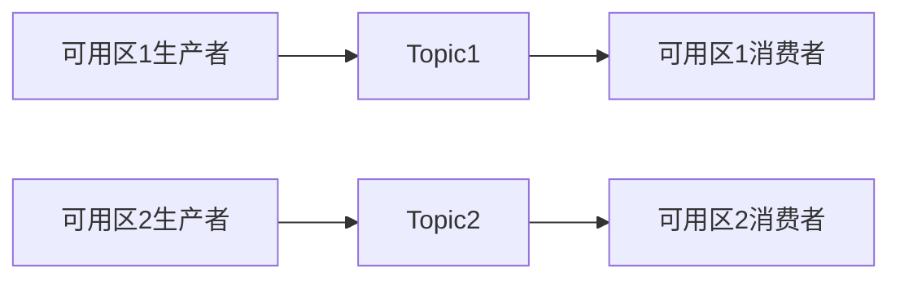

- Topic间不做消息同步
- 生产端投递本可用区Topic
- 本可用区下游直接消费
- **适用场景**: Service到Job异步消息、Service A到已多活的Service B

**模式二: 全量消费(Global模式)**

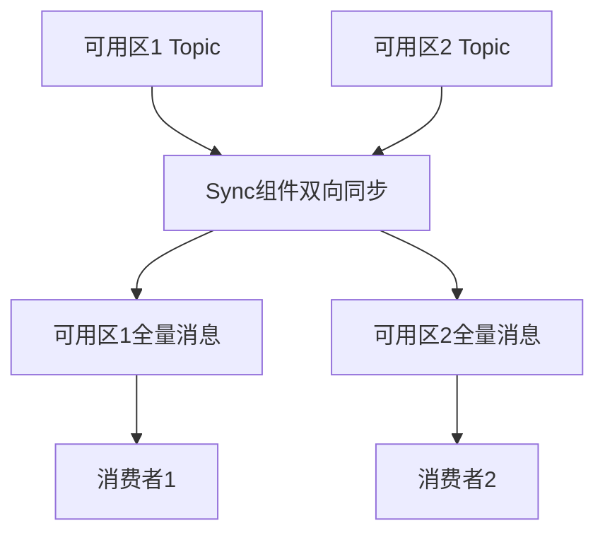

- 通过Sync组件进行消息双向同步
- 每个Topic包含两个可用区的全量消息
- **适用场景**: Service A投递给未多活的下游Service B(如离线、大数据)

**模式三: 单边消费(Global-Single模式)**

- 基于Global模式衍生
- 选择任一可用区不进行消费
- **适用场景**: Binlog全量数据触发的消息
- **要求**: 可用区2下游需考虑消费幂等处理
- **优势**: 故障时可通过切换消费模式快速恢复消息层消费

**注意事项:**

- 三种模式设置与Topic间消息同步不做绑定
- 多活过程中与业务共同梳理场景
- 确定涉及的消息队列和相关下游
- 制定合适的消费模式

### 3.4 数据存储层

#### 统一Proxy接入

**支持的存储类型:**

- MySQL Proxy
- TiDB Proxy
- 泰山(KV) Proxy

**核心能力:**

- 多可用区路由能力
- 拓扑自动发现
- 动态切换能力

#### 同城双活场景(一主多从模式)

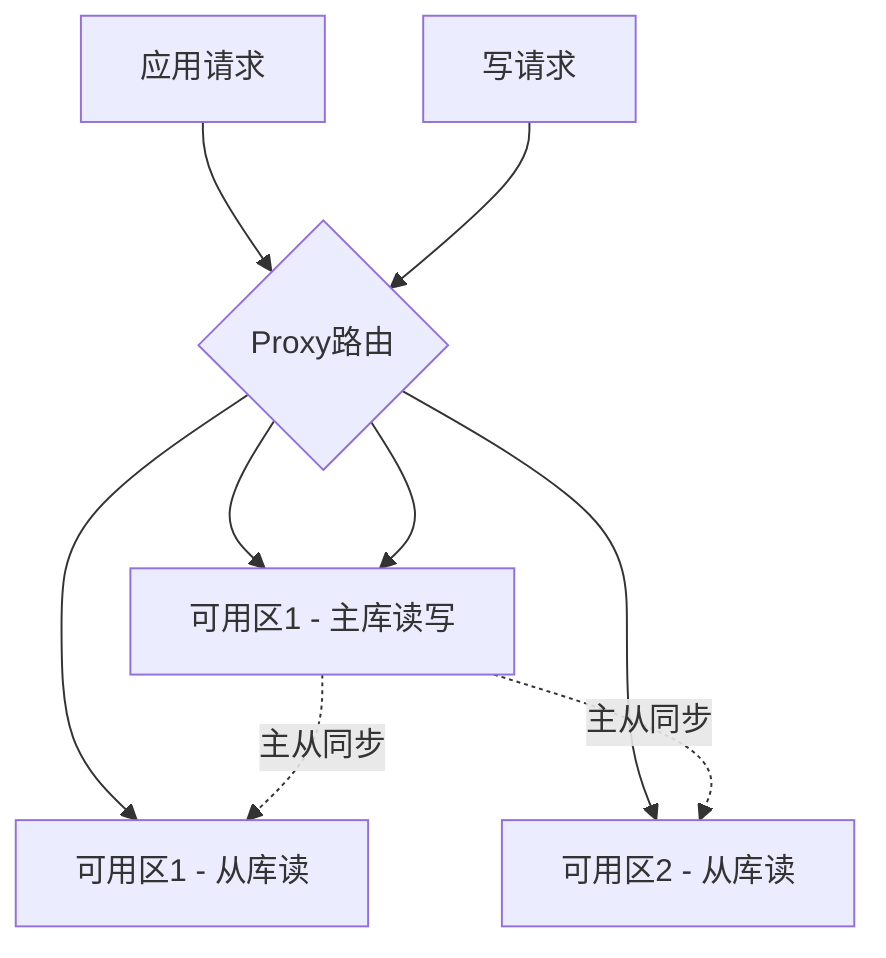

**数据存储方案:**

- 主可用区: 服务可读写集中存储
- 可用区2: 以从实例形态存在
- Proxy将写路由回源到主机房
- 读请求可在本可用区从库执行

**强一致性场景:**
支持通过以下方式强制读主库:

- SQL Hint级别
- 连接串配置
- 请求头增加master/primary标识

#### 单元化场景(R纵模式)

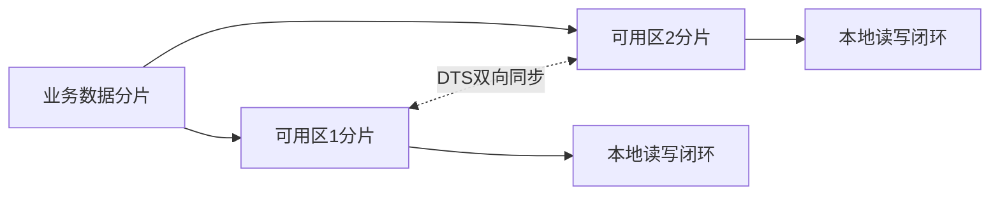

**核心要求:**

- 业务进行数据分片
- 分片数据双向同步
- 本可用区分片实现读写操作闭环

**DTS组件特性:**

- 支持数据双向复制
- 整体延时 < 10秒
- 提供冲突检测能力
- 支持暂停同步或异步通知
- 投递队列由业务处理冲突
- 支持同步覆盖策略

## 四、B站业务多活演进

### 4.1 业务多活划分

#### C端业务(单元化/双向同步模式)

- **特点**: 流量大,故障直接影响用户体验
- **要求**: 单机房内闭环解决,通过切流快速恢复
- **场景**: 弹幕、评论、收藏、订单、电商等

#### B端业务(集中模式)

- **特点**: 全局信息,更新操作少
- **容忍度**: 可接受一定读延时
- **场景**: 创作中心、视频、直播、商品等

### 4.2 多活演进历程

#### 阶段一: 单活模式

- 服务只在单个可用区部署
- 无Proxy支持
- 缓存和DB大部分客户端直连
- 业务发布需在SLB和CDN分别配置规则

#### 阶段二: 读多活模式(过渡方案)

- 服务在另一个可用区部署
- 流量层只支持读接口切流
- 接口通过CDN或SLB转发
- 部分组件(缓存、消息队列)未做多活改造
- 存在跨机房调用

#### 阶段三: 同城多活模式(当前主推)

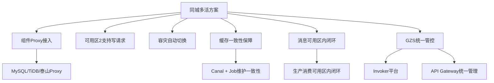

**核心改进:**

- 各类组件提供Proxy接入支持
- 可用区2支持处理写请求
- Proxy支持容灾自动切换
- 缓存一致性: Canal + Job维护
- 消息生产消费可用区内闭环
- 引入GZS组件统一管控
- Invoker平台 + API Gateway统一管理服务接口发布

### 4.3 异地多活方案(验证中)

#### 设计思路

- 基于同城多活方案衍生
- 现阶段单元化改造成本高,收益不大
- 采用渐进式异地多活架构

#### 华南可用区架构

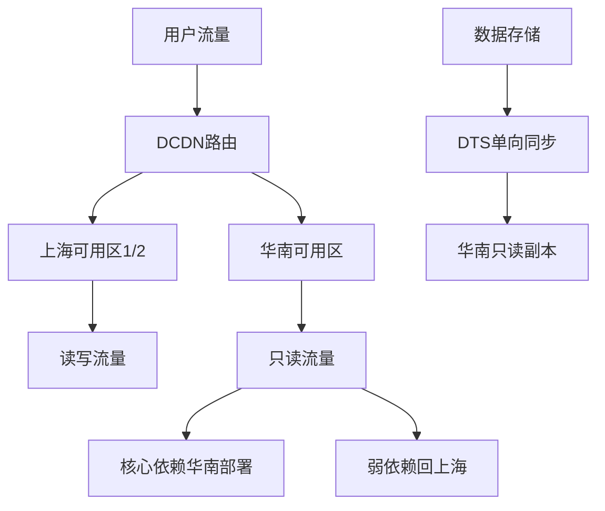

**方案特点:**

- 华南可用区对标可用区2读多活模式
- 承接部分读流量
- 核心依赖在华南完整部署,实现当前可用区调用
- 弱依赖可回上海可用区调用

**技术实现:**

- **服务发现**: Discovery组件实现
- **数据同步**: 使用DTS单向同步(原生同步组件不满足远距离需求)
- **缓存**: 遵循最终一致性原则
- **消息**: 遵循自产自销原则

**挑战:**

- 上海-江苏距离近,无法模拟远端异地高延时
- 地域近导致容灾能力不足
- 需要更远的华南或L2/L3边缘机房验证

## 五、多活管控与治理

### 5.1 多活管控平台 - Invoker

#### 设计背景

- 多活建设带来架构和运维复杂度提升
- 需要统一管控能力支持
- 原CDN规则非标,存在大量正则规则

#### 核心功能

**1. 多活元信息治理**

- 对多活源信息规则进行治理
- API Gateway接入采用应用前缀路由模式
- 便于后续统一切流管理
- 保留部分非标多活规则,支持自定义规则录入(前端、外部端)
- 非多活规则继续在CDN层面管理(回源、缓存规则)

**2. 平台依赖与高可用**

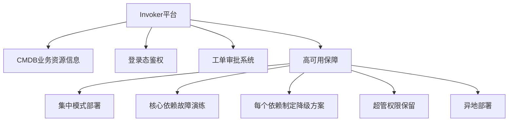

**高可用措施:**

- 集中模式部署
- 核心依赖故障演练
- 每个依赖制定降级方案
- 保留超管权限
- 异地部署保障故障时平台可用

### 5.2 多活编排接入流程化

#### 功能模块

**1. 多活编排定义**

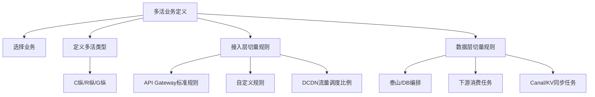

**编排内容:**

- 基于CMDB选择业务
- 定义多活类型(C纵/R纵/G纵)
- 服务分布的地域和可用区
- 接入层切量规则:
  - API Gateway标准前缀规则
  - 自定义规则录入
  - DCDN层面流量调度比例
- 数据层切量规则:
  - 泰山和DB编排录入
  - 下游消费任务(Canal、KV同步任务)切换
- 消息层消费模式切换
- Discovery东西流量切量编排

**2. 切量申请与执行**

切量配置项:

- 选择业务
- 切流维度
- 切流比例
- 是否同时切换存储
- 执行切流的规则
- 切量对象选择

**3. 切流预检与可视化**

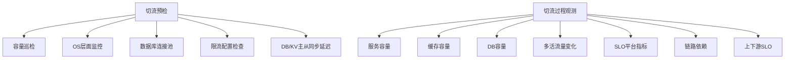

**预检项目:**

- 容量巡检
- OS层面监控
- 数据库连接池状态
- SLB/Quota平台限流配置
- DB/KV主从同步延迟

**过程观测:**

- 服务、缓存、DB容量情况
- 多活流量变化
- SLO平台相关指标
- 链路依赖情况
- 整体链路上下游SLO

### 5.3 多活有效性验证

#### 验证思路

同城多活核心要求: **单机房内实现读写流量处理,故障时快速恢复**

#### 验证流程

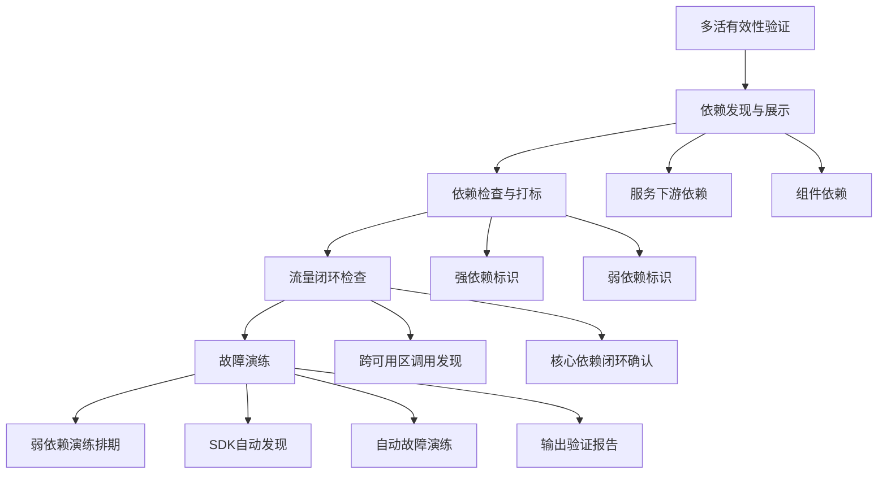

**1. 依赖发现与展示**

- 展示服务下游依赖
- 展示组件依赖
- 利用Trace能力

**2. 依赖检查与打标**

- 标识强依赖
- 标识弱依赖

**3. 流量闭环检查**

- 多活切量后进行检查
- 结合打标和依赖发现信息
- 发现跨可用区调用
- 确认核心依赖在可用区内闭环

**4. 故障演练**

- 弱依赖要求业务排期演练
- 业务大仓SDK支持:
  - 依赖自动发现
  - 自动故障演练
  - 输出验证报告
- 不符合预期则改造后再演练

## 六、经验总结与最佳实践

### 6.1 多活收益

**故障快速恢复:**

- B站2021年经历大故障,已做多活的业务恢复最快
- 即使只做读多活,也能大大缓解用户焦虑和客诉
- 读场景快速恢复对用户感知影响显著

### 6.2 成本控制

#### 资源成本

- 同城多活机房服务在线提供服务,无资源空跑浪费
- 日常资源冗余应对突发和高峰
- 通过资源弹性和在离线混部降低成本增加

#### 运维成本

- Invoker平台大幅降低运维成本
- 人工操作转化为平台功能
- 故障时一键执行切流

**成本收益平衡:**
将成本和收益放在一起综合评估

### 6.3 数据一致性策略

**同城场景:**

- 写主库模式
- 追求最终一致性

**异地场景:**

- 单元化改造: 数据分片 + 双向同步
- 读写分离: 主可用区读写,异地只读
- 尽量不在异地中心放写流量(物理延时无法避免)
- 根据业务场景选择合适的多活方案

**缓存一致性:**

- 追求最终一致性
- 订阅DB变更信息(Binlog)
- 高一致性要求: 直接删除缓存,通过Cache Miss回填
- 低一致性要求: 通过Binlog更新缓存

### 6.4 关键设计原则

1. **业务高内聚,单元间低耦合**
2. **单可用区内自产自销**(消息层)
3. **核心依赖本地部署,弱依赖允许跨区**
4. **基础组件设计之初就考虑多活**
5. **管控平台本身也要高可用**

### 6.5 技术选型建议

**存储选择:**

- MySQL: 主流场景
- TiDB: 分布式,大型社区业务
- KV: 分布式KV系统,适合QPS < 10万场景

**性能考量:**
根据业务体量选择合适的技术方案

## 七、Q&A精选

**Q1: 同城双活架构下应用层做了双活,基础架构层还有必要做双活吗?**

A: 有必要。业务多活基于组件本身的高可用。所有基础组件在设计时就要考虑双活模式,包括Invoker平台、存储层等。管控平台的依赖(鉴权、工单审批)都需要考虑多活设计,确保故障时能够登录平台实现多活管控。

**Q2: 核心系统多地多活架构中怎么实现数据强一致同步?**

A: 分两方面看:

- **一致性要求高且更新频繁**: 适合全局多活(同城多活集中模式),基于数据组件主从同步能力,写回源主库,读在当前可用区处理
- **远端异地**: 业务层面必须接受短期不一致但最终一致

**Q3: 多活成本如何把控?投入收益如何考虑?**

A:

- **收益**: 故障发生时才能真正体现价值,快速恢复降低用户感知和客诉
- **资源成本**: 同城多活服务在线提供服务,无空跑浪费;通过弹性和混部降低冗余成本
- **运维成本**: 通过Invoker等平台化工具大幅降低
- **综合评估**: 将成本和收益放在一起看
