# 去哪儿网基于Trace的根因分析实践

> 来源：未核验 · 类型：分享 · 状态：draft


## 分享嘉宾
梁老师 - 去哪儿网SRE工程师
- 所属团队：基础架构基础平台团队
- 工作内容：CI/CD、可观测性等相关工作
- 主要成果：
  - 参与去哪儿网容器化落地
  - 完成监控系统Watcher 2.0升级
  - 秒级监控建设
  - 根因分析平台和预案平台落地

## 分享大纲
1. 背景介绍
2. 架构设计
3. 模型验证
4. 应用实践
5. 未来规划

---

## 一、背景介绍

### 1.1 故障快速恢复体系

去哪儿网建立了"1-5-10"故障快速恢复目标：
- **1分钟**：发现故障
- **5分钟**：定位问题
- **10分钟**：恢复服务

围绕这个目标，在四个阶段进行建设：

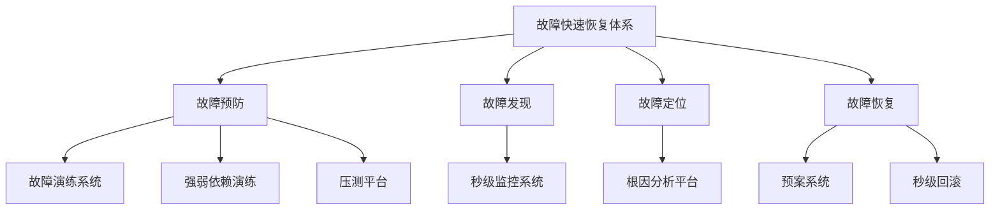

### 1.2 建设背景

随着云原生、微服务等技术的大量应用，业务调用链路越发复杂，线上定位问题耗时越来越长。

### 1.3 故障定位慢的原因分析

通过统计今年的故障数据，发现定位慢的四大原因：

#### 1.3.1 信息量大（占比57%）
- 链路交互复杂，链路长
- 信息多
- 异常多

#### 1.3.2 信息差
- 中间件的影响未感知
- 单机问题未感知
- 其他应用的事件和变更未感知
- 查问题工具不熟悉

#### 1.3.3 不可控因素
- 节假日因素
- 人为因素

#### 1.3.4 短期问题
- 回滚时间长
- 容器切换慢

### 1.4 问题占比分析

统计发现以下问题占比达57%：
- 链路分析不清晰
- 未定位到DB问题
- 未定位到单机问题
- 未关注到异常增长

### 1.5 解决方案

| 问题类型 | 解决方案 |
|---------|---------|
| 回滚时间长 | 秒级回滚 |
| 发现时间晚 | 秒级监控系统 |
| 人为因素 | 规范流程（发布流程、值班流程） |
| 信息量大（60%） | **根因分析系统** |

### 1.6 根因分析系统整体思路

基于可观测性三要素MTL进行分析和建模：

**Metric（指标）**
- 提供量化的系统内外部各维度指标
- 是对关注事件的聚合
- 可根据指标设置报警

**Trace（链路追踪）**
- 提供请求从接收到处理完毕整个生命周期的跟踪路径
- 分布式链路追踪

**Log（日志）**
- 提供系统进程最精细化的信息
- 记录关键变量、事件、访问记录等
- 问题排查取证的依据

---

## 二、架构设计

### 2.1 模型构建思路

模拟人工排查故障的思维过程：

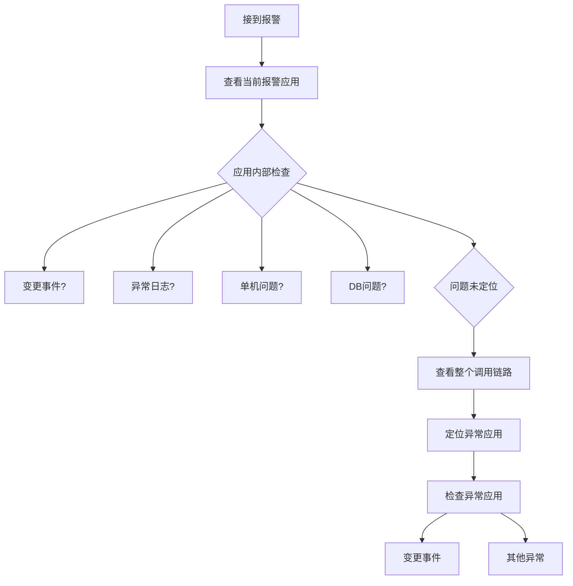

### 2.2 核心思路抽象

基于人工排查思路，抽象出根因分析模型构建的核心步骤：

1. **定位范围**
2. **异常断言**
3. **关联挖掘**
4. **加权排序**
5. **结果输出**

### 2.3 模型构建步骤

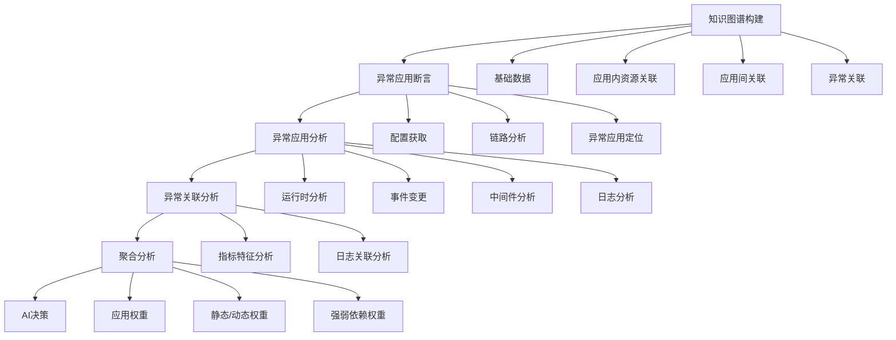

---

## 三、知识图谱构建

### 3.1 基础数据

去哪儿网的统一基础设施（根因分析的基石）：
- 统一事件中心
- 日志平台
- Trace平台（QTracer）
- 监控指标和告警（Watcher）

### 3.2 资源关联关系

#### 应用内部资源依赖
- MySQL
- Redis
- 其他中间件

#### 物理拓扑感知
- 应用容器
- KVM运行的宿主机
- 网络环境

### 3.3 应用间关联关系

- 应用调用链路
- 应用强弱依赖关系

### 3.4 异常间关联关系

- 通过异常指标精确快速找到对应的Trace和Log
- 异常告警之间的关联关系挖掘

---

## 四、异常应用断言

### 4.1 报警和故障体系

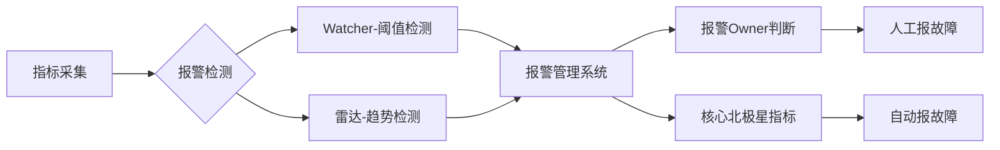

**Watcher（阈值检测系统）**
- 设定固定阈值
- 如：连续3分钟大于/小于某值

**雷达（趋势检测系统）**
- 智能化告警
- 检测指标趋势突增或突降

### 4.2 指标与Trace关联

这是根因分析的核心技术之一。

#### 4.2.1 关联原理

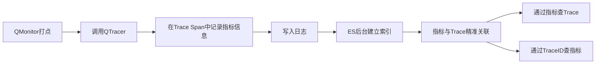

#### 4.2.2 技术实现
- QMonitor（自研指标打点）
- QTracer（自研链路追踪）
- QMonitor Client打点时调用QTracer接口
- 在Trace Span中记录指标信息
- ES后台通过实时日志建立索引
- 实现指标与Trace的精准关联

**优势**：
- 对性能几乎无影响
- 可以精确查出打指标时的垂直链路

### 4.3 Trace收敛

报警时根据指标查询Trace，数量级通常为万级，需要进行收敛。

#### 4.3.1 漏斗型收敛（三步）

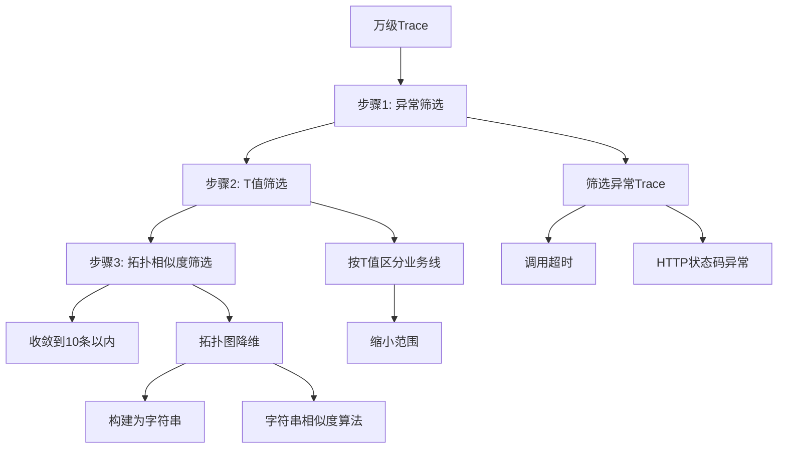

**步骤1：异常筛选**
- QTracer记录链路时标记异常调用
- 超时或HTTP状态码异常标记为异常Trace
- 优先分析异常Trace

**步骤2：T值筛选**
- T值（QORT）：去哪儿网大客户端概念
- 用于区分各业务线服务
- 不同T值对应不同业务
- 进一步缩小范围

**步骤3：拓扑相似度筛选**
- 拓扑图降维
- 根据特定规则构建为字符串
- 使用字符串相似度算法

**最终效果**：筛选到10条以内的Trace

### 4.4 异常应用定位

#### 4.4.1 定位步骤

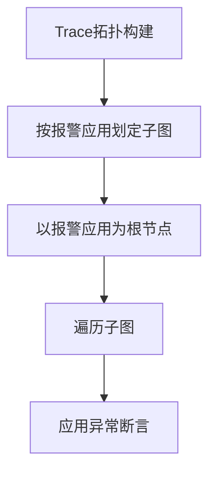

#### 4.4.2 异常应用判定条件

满足以下**任一条件**即标记为异常应用：

1. **Trace链路标记为异常**
   - HTTP状态码异常
   - 调用超时

2. **报警浓度高于阈值**
   - 或存在P1/P2级别报警

3. **存在发布或核心配置变更事件**

4. **异常日志同比环比高于阈值**

5. **API异常率指标高于阈值**

---

## 五、异常应用分析

### 5.1 应用内部分析（四个维度）

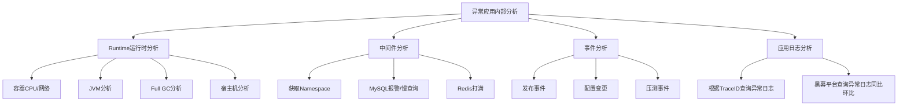

#### 5.1.1 Runtime（运行时分析）
- **容器层面**：CPU、网络分析
- **JVM层面**：Full GC分析
- **宿主机层面**：宿主机异常分析

#### 5.1.2 中间件分析
- 根据应用获取Namespace
- 检查MySQL报警或慢查询（同比环比判定）
- 检查Redis打满情况

#### 5.1.3 事件分析
- 发布事件
- 配置变更
- 压测事件

#### 5.1.4 应用日志分析
- **方式1**：根据筛选的TraceID从ES查询异常日志
- **方式2**：从黑幕平台查询异常日志同比环比
  - 黑幕：异常日志平台
  - 提供异常日志类型、总量、同比环比等

### 5.2 异常关联分析（三个维度）

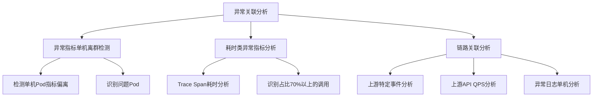

#### 5.2.1 异常指标单机离群检测
- 用于单机问题分析
- 检测某个Pod的指标是否明显偏离其他Pod
- 识别有问题的单机Pod

#### 5.2.2 耗时类异常指标分析
- 当报警关联的异常指标是耗时类时触发
- 进行Trace Span耗时分析
- 找出占整个调用链路70%以上的调用
- 认定为异常调用

#### 5.2.3 链路关联分析（应用间异常分析）
- **上游特定事件分析**
- **上游API QPS分析**
  - QPS暴增
  - 上游应用事件变更导致
- **异常日志单机分析**
  - 依托黑幕异常日志平台
  - 识别异常量较高的Pod

---

## 六、聚合分析

### 6.1 权重体系

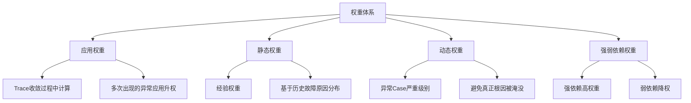

#### 6.1.1 应用权重
- **定义**：当前故障或报警中此应用的异常所占权重比
- **含义**：表示此应用影响当前故障或报警的概率大小
- **计算**：在Trace收敛过程中计算
  - 对多次出现的异常应用进行升权
  - 例如：多个Trace中C应用都有问题，则C应用权重升高

#### 6.1.2 静态权重
- **定义**：经验权重
- **来源**：根据近期故障原因分布设置
- **维度**：
  - 事件
  - 运行时
  - 中间件
  - 日志等

**故障原因统计示例**：
- 从故障系统获取历史故障原因
- 进行概率统计
- 设置各类原因的静态权重

#### 6.1.3 动态权重
- **定义**：具体分析到的异常Case的权重
- **目的**：根据各个根因的严重级别进行升权，避免真正根因被淹没

**示例**：
- **运行时**：CPU使用率90%和100%影响程度不同，动态调权
- **事件**：发布事件比其他事件权重更高
- **时间因素**：越接近故障/报警发生时间，权重越大
- **中间件**：根据DBA团队的MySQL/Redis报警分级动态调整

#### 6.1.4 强弱依赖权重
- **用途**：用于减权
- **场景**：当应用B和应用C都有异常Case时
  - A调B的接口是弱依赖
  - A调C的接口是强依赖
  - 则倾向于认为A的告警是由C的异常造成的

**维护方式**：
- 通过强弱依赖演练维护
- 各业务线定期进行强弱依赖演练
- 针对接口级演练
- 接口挂掉对整个服务无影响 → 弱依赖
- 接口挂掉对整个服务有影响 → 强依赖

### 6.2 AI Summary

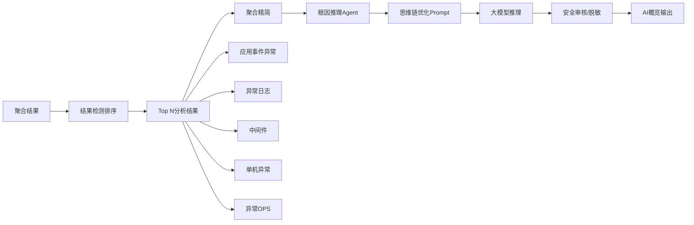

#### 6.2.1 AI决策流程
1. 获取Top N分析结果
2. 聚合精简
3. 调用根因推理Agent
4. 使用思维链优化Prompt
5. 大模型推理（GPT-3.5 Turbo / GPT-4）
6. 安全审核和脱敏
7. 输出AI概览

#### 6.2.2 实际案例

**故障场景**：单机异常导致的故障

**AI推理结果**：
- **根因判断**：单机异常
- **推理过程**：
  - 实例异常的可能性最高
  - 与多个异常日志相关联
  - 表明单机问题导致了其他异常
- **处理结果**：业务线同学删除重建该单机后，故障恢复

---

## 七、结果输出

### 7.1 分析报告页面

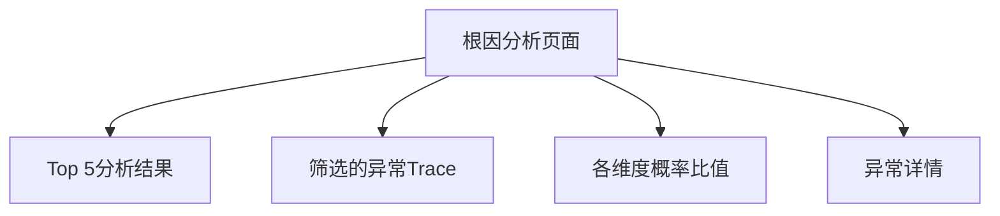

**页面组成**：
- **上部**：Top 5概率最高的分析结果
- **中部**：筛选到的异常Trace
- **右侧**：各维度所占概率比值
- **下部**：异常详情

### 7.2 可视化系统

#### 7.2.1 开发背景
业务线同学反馈：
- 只看分析报告不够直观
- 想看报警/故障期间整个链路的调用关系
- 想看应用上的异常信息

#### 7.2.2 可视化功能

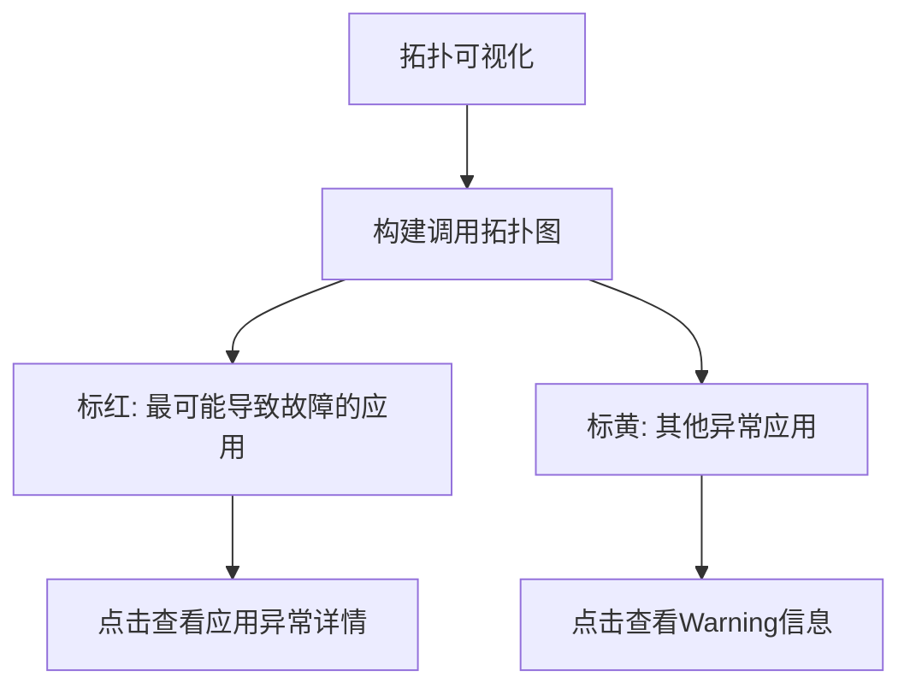

**特点**：
- 构建完整的调用拓扑图
- **红色**：最可能导致故障的应用，点击查看异常详情
- **黄色**：其他异常应用（Warning）
- 更直观的展示方式

---

## 八、整体架构

### 8.1 系统架构图

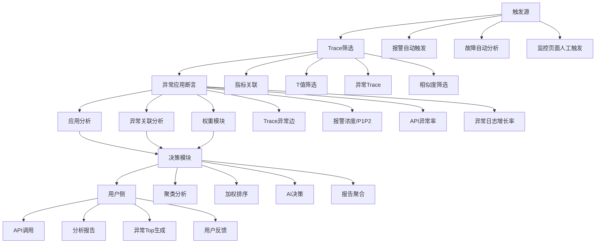

### 8.2 触发源
- **报警自动触发**
- **故障自动分析**
- **监控系统页面人工触发**

### 8.3 Trace筛选
- 指标关联
- T值筛选
- 异常Trace筛选
- 相似度筛选

### 8.4 异常应用断言
- Trace异常边
- 报警浓度/P1P2报警
- API异常率（Nail指标）
- 异常日志增长率

### 8.5 决策模块
- 聚类分析
- 加权排序
- AI决策
- 报告聚合

### 8.6 用户侧
- **API调用**：支持对外API调用，多个系统接入
- **分析报告**：完整的根因分析报告
- **异常Top生成**：Top N异常列表
- **用户反馈**：分析结果正确性反馈，用于统计和学习

---

## 九、模型验证

### 9.1 验证方法

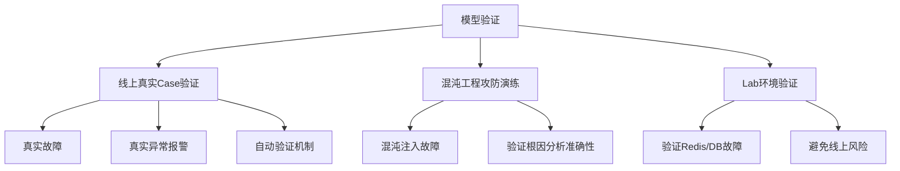

#### 9.1.1 线上真实Case验证
- **最有价值的第一手材料**
- 真实故障验证
- 真实异常报警验证

**自动验证机制**：
- 线上真实故障存储到ES平台
- 包括真实故障原因和分析到的原因
- 每次大调整或优化时自动跑一遍
- 对比效果是否提升

#### 9.1.2 混沌工程攻防演练
- 结合故障演练系统
- 通过混沌注入故障
- 验证根因分析准确性
- 检验能否分析出注入的故障原因

#### 9.1.3 Lab环境验证
- **目的**：验证Redis、DB等不敢在线上测试的故障
- 搭建独立Lab环境
- 验证能否发现和分析这些异常

### 9.2 验证覆盖范围

**六大类故障**：
1. 事件变更
2. 异常日志
3. DB
4. Redis
5. 单机
6. GC

**十八种场景**：
- **DB场景**：
  - 连接超时
  - 连接数不够
  - 宿主机关键指标告警
  - 慢查询
  
- **Redis场景**：
  - 关键指标告警
  - 查询大Key

**验证数量**：
- 已验证200+个Case
- 持续迭代和验证中

### 9.3 Lab环境验证示例

注入MySQL线程异常，通过分析链路验证能否分析到该异常。

---

## 十、应用实践

### 10.1 业务报警接入

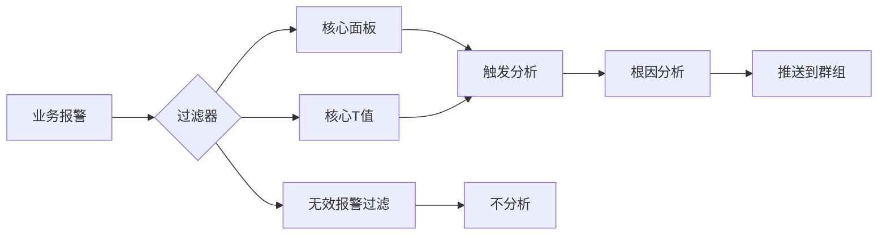

#### 10.1.1 过滤器机制
由于业务报警较多，需要过滤以降低干扰：

**过滤条件（可配置）**：
1. **核心面板**：只分析核心面板的报警
2. **核心T值**：Trace中包含核心T值才分析
3. **无效报警**：
   - 几天内连续报警8-9次
   - 未触发故障或重要问题
   - 认定为无效报警，不分析

#### 10.1.2 推送机制
- 分析后推送到不同群组（可配置）
- 业务线同学关注核心报警群
- 及时发现和解决问题

#### 10.1.3 实际案例
**五一期间案例**：
- 报警触发，自动分析
- 分析出DB慢查询
- 业务线同学及时处理
- **成功规避了一次故障**

### 10.2 故障根因推送

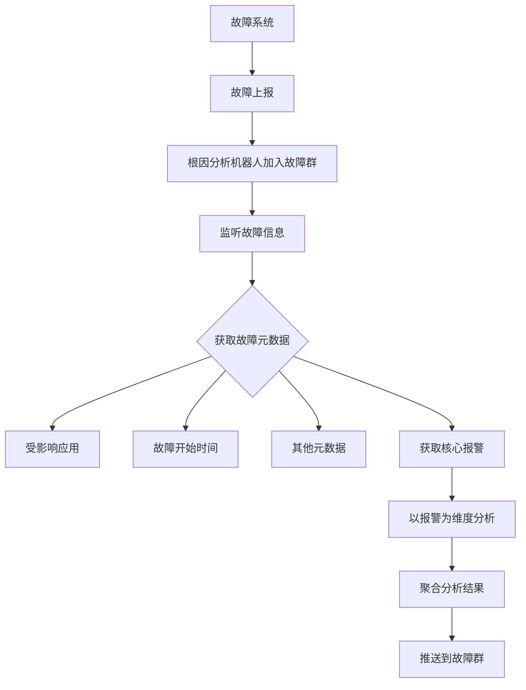

#### 10.2.1 工作流程
1. 业务线同学报故障
2. 故障系统将根因分析机器人拉入群
3. 机器人监听故障信息填写
4. 获取故障元数据：
   - 受影响应用
   - 故障开始时间
   - 其他信息
5. 根据应用和时间获取核心报警
6. 以报警为维度进行根因分析
7. 聚合分析结果
8. 推送到故障群

#### 10.2.2 实际案例

**配置变更导致的故障**：
- **AI概览**：某应用发布了配置文件
- **推理过程**：
  - 配置文件发布时间最接近问题发生时间
  - 概率较高
  - 可能导致Namespace异常告警
  - 其他应用异常与此无直接关联
- **处理结果**：业务线确认配置变更，及时回滚，故障恢复

---

## 十一、预案系统联动

### 11.1 预案系统设计

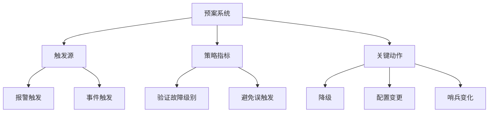

### 11.2 设计背景
- 原有SOP分散在各业务线Wiki中
- 需要统一沉淀和管理
- 开发预案系统统一管理

### 11.3 核心组件

#### 11.3.1 触发源
- 报警触发
- 事件触发

#### 11.3.2 策略指标
- 报警可能比较敏感，未达故障级别
- 通过策略指标进行二次验证
- 触发源和策略指标都满足才推送SOP

#### 11.3.3 关键动作
- **降级**
- **配置变更**
- **哨兵变化**
- 等可执行动作

### 11.4 与根因分析联动

**联动方式**：
- 根因分析识别到高概率原因
- 动态生成预案
- **不自动执行**（安全考虑）
- 业务线同学手动确认执行

**支持的预案类型**：
1. **发布回滚**
   - 识别到发布导致故障
   - 生成回滚预案
   - 支持秒级回滚（1分钟内完成，即使上百个Pod）

2. **单机重建**
   - 识别到单机问题
   - 生成重建预案

3. **配置回滚**
   - 识别到配置变更导致故障
   - 生成配置回滚预案

---

## 十二、技术细节补充

### 12.1 指标与Trace关联详解

**实现原理**：
- QMonitor和QTracer都是自研系统
- QMonitor Client打点时调用QTracer接口
- 将Metric信息与当前Trace Span结合
- 信息写入日志（对性能几乎无影响）
- ES后台通过实时日志建立关联索引

**查询能力**：
- 通过Metric查询Trace
- 通过TraceID查询Metric
- 双向精准关联

### 12.2 强弱依赖维护

**维护方式**：
- 各业务线定期进行强弱依赖演练
- 根据T值和链路进行演练
- 针对接口级别演练

**判定标准**：
- 接口挂掉，整个服务无问题 → **弱依赖**
- 接口挂掉，整个服务有问题 → **强依赖**

### 12.3 核心指标定义

**核心指标来源**：
- 业务线整理的核心链路指标
- 包含业务逻辑

**示例**：
- **酒店业务**：生单流程指标
- **机票业务**：生单、售后、退款、下单等指标

**秒级监控**：
- 只接入核心指标
- 确保1分钟内发现故障

### 12.4 告警风暴处理

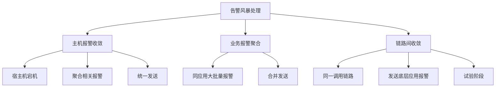

**处理策略**：

1. **主机报警收敛**
   - 宿主机宕机时
   - 聚合所有相关报警
   - 统一告知宿主机宕机

2. **业务报警聚合**
   - 同一应用大批量报警
   - 合并后发送

3. **链路间收敛**（试验中）
   - 确认所有应用在同一调用链路
   - 倾向于发送底层应用报警

### 12.5 多应用同时告警的根因判定

**判定原则**：
- 基于调用链路关系
- 上下游关系中，倾向于认为**下游**是根因
- 结合强弱依赖关系
- 强依赖的异常概率更高

---

## 十三、运营机制

### 13.1 准确率统计

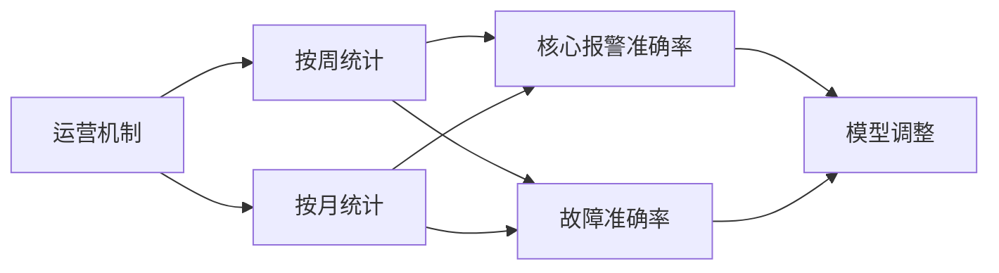

### 13.2 反馈机制
- 用户反馈分析结果正确性
- 如果不正确，收集正确原因
- 用于统计和学习
- 持续优化模型

### 13.3 自动验证
- 存储历史故障和分析结果
- 模型调整后自动跑历史Case
- 对比效果是否提升
- 确保模型优化方向正确

---

## 十四、未来规划

### 14.1 权重体系优化

**当前问题**：
- 权重体系不够完整
- 静态权重维护成本高

**优化方向**：
- 引入AI大模型
- 自动学习和调整权重
- 提升权重准确性

### 14.2 覆盖更多异常场景

**计划新增场景**：

1. **Pod重启分析**
   - 分析重启原因
   - OOM、Crash等

2. **线程池异常**
   - 线程池满
   - 线程死锁等

3. **其他运行时异常**
   - 持续扩展异常场景覆盖

### 14.3 持续优化

- 提升分析准确率
- 降低误报率
- 优化分析速度
- 增强可视化能力

---

## 十五、核心价值总结

### 15.1 技术价值

1. **指标与Trace关联**
   - 创新性地实现Metric与Trace精准关联
   - 为根因分析提供坚实基础

2. **多维度分析**
   - Runtime、中间件、事件、日志四维度
   - 全方位覆盖故障场景

3. **智能权重体系**
   - 应用权重、静态权重、动态权重、强弱依赖权重
   - 科学的加权排序机制

4. **AI赋能**
   - 大模型推理
   - 思维链优化
   - 提供智能决策

### 15.2 业务价值

1. **提升定位效率**
   - 目标：5分钟定位问题
   - 解决57%的定位慢问题

2. **降低故障影响**
   - 及时发现潜在故障
   - 提前规避故障发生

3. **减轻人力负担**
   - 自动化分析
   - 降低对个人经验依赖

4. **知识沉淀**
   - 故障原因统计
   - 经验转化为系统能力

### 15.3 实践效果

- **验证覆盖**：6大类故障，18种场景，200+个Case
- **实际应用**：成功规避多次故障
- **准确率提升**：持续优化中
- **系统接入**：多个系统接入API调用

---

## 十六、关键技术点

### 16.1 可观测性三要素

| 要素 | 作用 | 在根因分析中的应用 |
|------|------|-------------------|
| Metric | 量化指标，设置报警 | 触发根因分析，关联Trace |
| Trace | 分布式链路追踪 | 定位异常应用，分析调用链路 |
| Log | 精细化事件记录 | 异常日志分析，问题取证 |

### 16.2 核心创新点

1. **Metric与Trace精准关联**
   - 解决了从报警到链路的精准定位
   - 对性能影响极小

2. **Trace收敛算法**
   - 三步漏斗：异常筛选 → T值筛选 → 拓扑相似度
   - 万级Trace收敛到10条以内

3. **多维度权重体系**
   - 四维权重科学加权
   - 避免根因被淹没

4. **AI决策引擎**
   - 思维链优化
   - 提供推理过程
   - 增强可解释性

### 16.3 系统集成

```mermaid
graph TD
    A[根因分析系统] --> B[监控系统]
    A --> C[故障系统]
    A --> D[预案系统]
    A --> E[混沌工程]
    
    B --> B1[Watcher]
    B --> B2[雷达]
    B --> B3[秒级监控]
    
    C --> C1[自动分析]
    C --> C2[故障复盘]
    
    D --> D1[动态生成预案]
    D --> D2[秒级回滚]
    
    E --> E1[故障演练]
    E --> E2[强弱依赖演练]
```

---

## 十七、Q&A精选

### Q1: 预案平台设计了哪些场景？有没有结合根因分析联动预案做自动执行？

**A**: 
- 预案系统沉淀了各业务线的SOP
- 包括触发源、策略指标、关键动作
- 与根因分析有联动，但**不自动执行**（安全考虑）
- 根因分析识别高概率原因后，动态生成预案
- 业务线同学手动确认后执行
- 支持发布回滚、单机重建、配置回滚等
- 秒级回滚：1分钟内完成，即使上百个Pod

### Q2: 强弱依赖关系是怎么维护的？

**A**:
- 通过强弱依赖演练维护
- 各业务线定期进行演练
- 根据T值和链路进行接口级演练
- 接口挂掉对整个服务无影响 → 弱依赖
- 接口挂掉对整个服务有影响 → 强依赖

### Q3: AI模型用的是GPT-3.5 Turbo吗？

**A**:
- 由算法组封装
- 包含安全审核和关键信息脱敏
- 主要使用GPT-3.5 Turbo和GPT-4

### Q4: 根因的概率是怎么计算的？

**A**:
- 基于权重体系计算
- 包括应用权重、静态权重、动态权重、强弱依赖权重
- 综合评判得出概率
- 结合AI决策判定最可能的原因

### Q5: 指标和Trace是怎么结合的？

**A**:
- QMonitor Client打点时调用QTracer接口
- 将Metric信息与Trace Span结合
- 信息写入日志
- ES后台通过实时日志建立索引
- 实现双向精准关联
- 对性能几乎无影响

### Q6: 这一整套部署起来需要多少硬件？

**A**:
- 依赖完善的基础设施
- 统一事件中心
- 日志平台
- Trace平台
- 监控指标和告警系统
- 完善的基建是根因分析成功的基石

### Q7: 重要的指标都有哪些？

**A**:
- 由业务线整理的核心链路指标
- 包含业务逻辑
- 例如：生单流程、售后、退款、下单等
- 秒级监控只接入核心指标

### Q8: 针对告警风暴有好的建议吗？

**A**:
- **主机报警收敛**：宿主机宕机时聚合相关报警
- **业务报警聚合**：同应用大批量报警合并发送
- **链路间收敛**（试验中）：同一调用链路发送底层应用报警

### Q9: 多应用同时告警产生告警风暴，如何界定哪个是根因，哪个是被影响？

**A**:
- 基于调用链路关系
- 上下游关系中，倾向于认为下游是根因
- 结合强弱依赖关系判断

### Q10: 是不是有运营机制？

**A**:
- 按周、按月统计核心报警和故障的准确率
- 分析是否是真正导致故障的原因
- 如果不是，及时调整模型
- 持续优化和迭代

---

## 总结

去哪儿网基于Trace的根因分析实践，通过创新性地将Metric与Trace精准关联，结合多维度分析、智能权重体系和AI决策引擎，构建了一套完整的故障根因分析系统。该系统不仅提升了故障定位效率，还成功规避了多次潜在故障，为"1-5-10"故障快速恢复目标提供了有力支撑。

**核心亮点**：
- ✅ Metric与Trace精准关联技术
- ✅ 三步漏斗Trace收敛算法
- ✅ 四维智能权重体系
- ✅ AI赋能的决策引擎
- ✅ 完整的验证和运营机制
- ✅ 与预案系统的有效联动

**实践成果**：
- 解决57%的故障定位慢问题
- 验证覆盖6大类故障、18种场景、200+个Case
- 成功规避多次线上故障
- 多个系统接入使用

这是一套值得借鉴的SRE体系建设实践，为业界提供了宝贵的经验参考。

