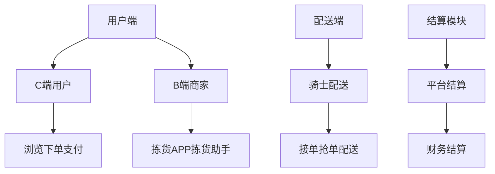
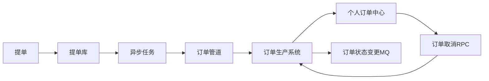
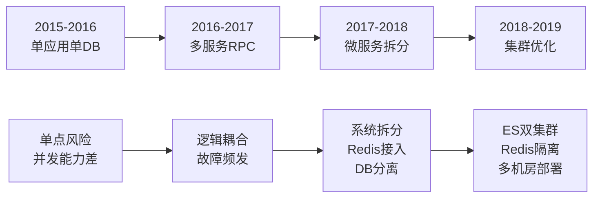
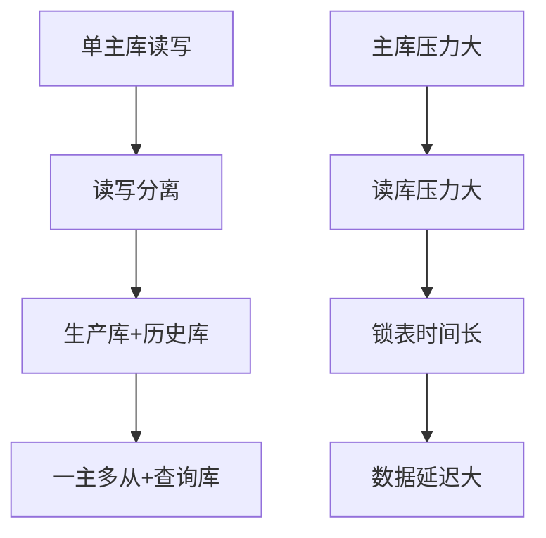
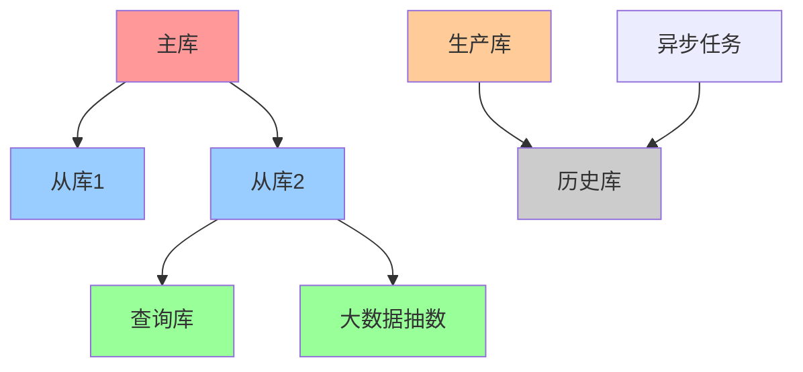
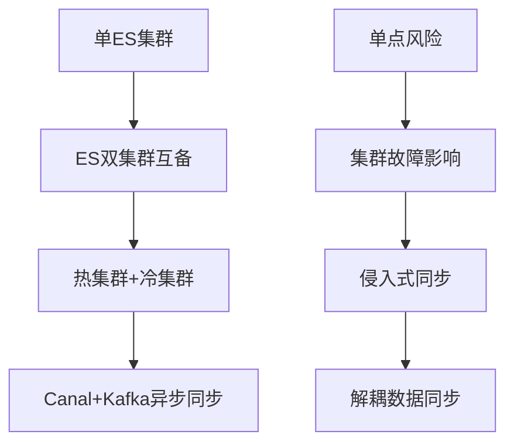
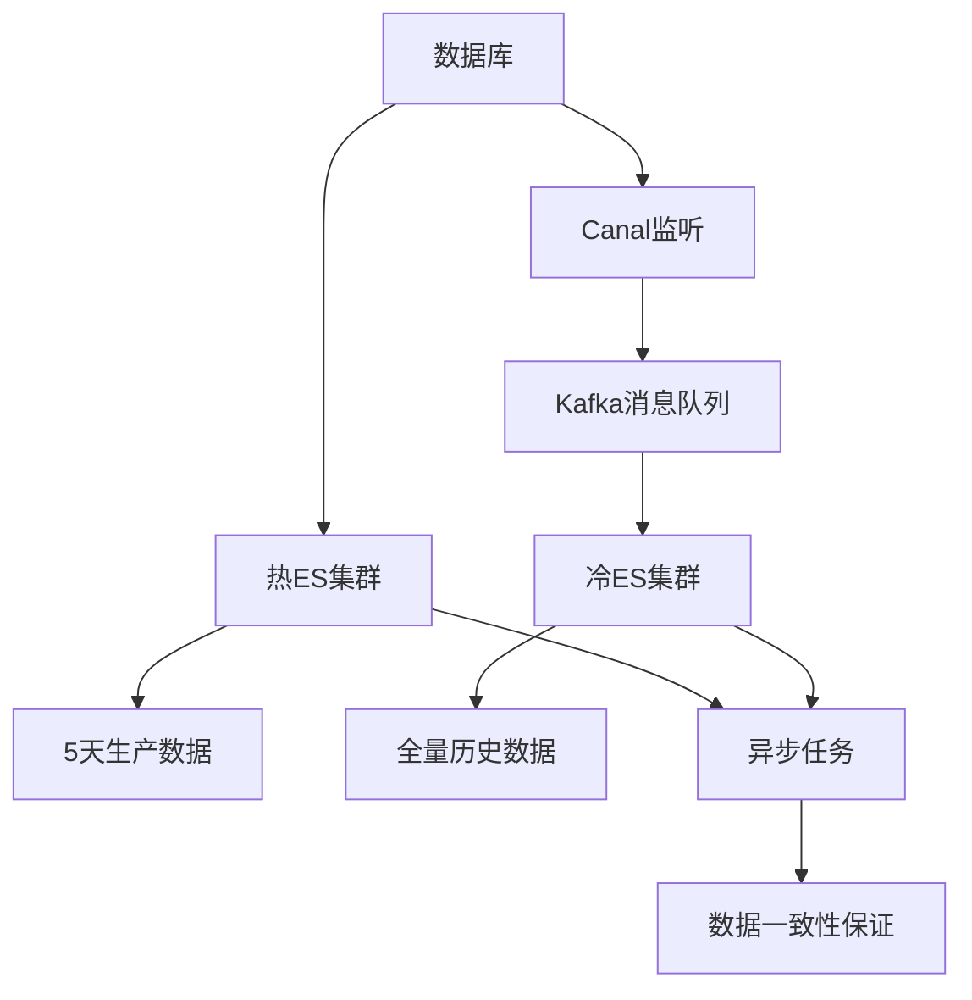
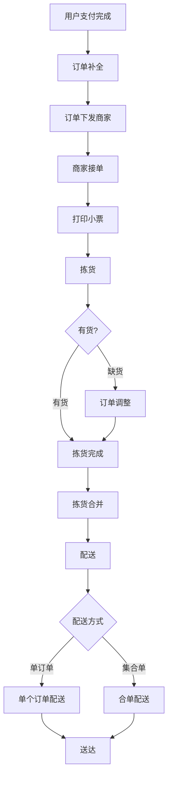
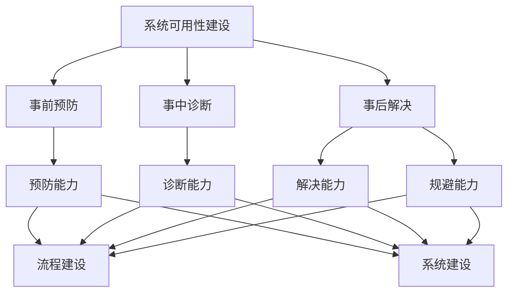
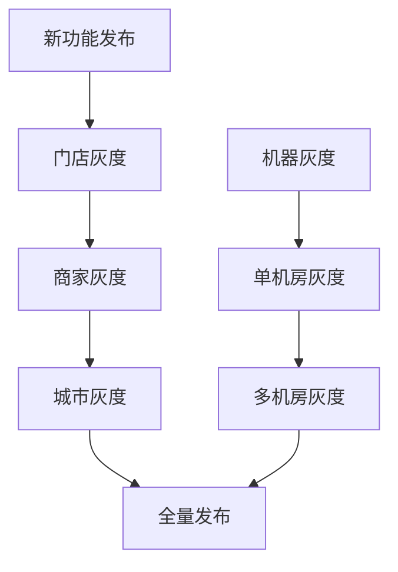

# 京东到家订单系统高可用架构的迭代实战

> 来源：未核验 · 类型：分享 · 状态：draft

## 分享概述

## 一、京东到家系统架构概览

### 1.1 业务架构

京东到家业务主要分为四大模块：

### 1.2 系统架构组成

#### 1.2.1 用户端支撑系统

- **C端**: 京东到家APP后端业务支撑
- **B端**: 商家履约系统（接单、拣货、召唤配送）
- **配送端**: 骑士抢单、上门取货、配送送达

#### 1.2.2 运营支撑系统

- **商家管理**: 商家入驻、合同管理、资质审核、门店设置
- **CMS管理**: 内容管理、活动楼层、首页引导页
- **营销管理**: 单品促销、优惠券、满减促销、首单优惠
- **财务管理**: 台账查询、退款审核、计费结算、财务报表
- **运营数据**: 苍穹云智、运营中心数据、商家中心数据

#### 1.2.3 基础服务支撑

- **业务系统**: 首页、门店页、购物车、结算页、提单系统、支付、个人订单
- **基础服务**: 库存、商品、门店、价格等核心服务
- **业务支撑**: 用户系统、定位系统、地址库、运费系统、推荐系统、搜索、收银台、风控

### 1.3 数据流转架构

**关键设计要点**:

- 提单库做分库处理
- 通过异步任务分布式下发，防止大促时对订单生产系统造成压力
- 个人订单DB基于用户分库分表，与订单生产系统不同维度
- 订单状态变更通过MQ异步同步
- 订单取消通过RPC实时调用保证一致性

## 二、订单系统架构演进历程

### 2.1 演进阶段概览

### 2.2 各阶段详细演进

#### 2.2.1 2015-2016年：单应用单DB架构

**架构特点**:

- 所有业务耦合在一个应用
- 单点数据库
- 系统发布短暂停

**存在问题**:

- 单点风险
- 并发能力差
- 接口超时严重

#### 2.2.2 2016-2017年：多服务RPC架构

**架构特点**:

- 引入RPC框架
- 故障自动下线
- 多服务支撑

**存在问题**:

- 系统逻辑耦合严重
- 改动影响面大
- 线上问题频发

#### 2.2.3 2017-2018年：微服务拆分

**架构演进**:

- 按领域拆分不同APP应用
- 系统无单点，负载均衡，横向扩展
- 引入Redis（分布式锁、缓存、有序队列、定时任务）
- 数据库分离（生产库+历史库）
- 引入ES解决复杂查询

**解决的问题**:

- 系统复杂度降低
- 独立部署运行
- 提高扩展性
- 解决数据量大的锁表问题
- 提升查询性能

#### 2.2.4 2018-2019年：集群优化

**架构优化**:

- ES双集群互备（热集群+冷集群）
- Redis业务隔离（核心业务+非核心业务）
- 多机房多实例部署

### 2.3 微服务拆分理论

#### 2.3.1 微服务优势

- **降低系统复杂度**: 按领域拆分，单一职责
- **独立部署**: 独立开发测试部署，不影响其他业务
- **提高扩展性**: 独立扩容升级，应对性能瓶颈

#### 2.3.2 拆分原则

- 按业务领域拆分
- 按系统边界拆分
- 单一职责原则

## 三、数据库架构演进

### 3.1 主从架构演进

### 3.2 最终数据库架构

**架构特点**:

- **深色部分**: 生产业务数据完全隔离
- **灰色部分**: 保证高可用，主库故障时从库快速顶替
- **异步归档**: 夜间业务低峰时从生产库转历史库

### 3.3 数据库优化策略

#### 3.3.1 冷热数据分离

- **生产库**: 只保留生产需要的数据
- **历史库**: 归档历史数据
- **优势**: 减少锁表时间，提高性能

#### 3.3.2 读写分离优化

- **主库**: 承载写流量
- **从库**: 承载读流量
- **查询库**: 专门用于复杂查询和大数据抽数

## 四、ES架构演进

### 4.1 ES架构演进历程

### 4.2 最终ES架构

**架构特点**:

- **热集群**: 保存5天生产数据，19个节点，24个分片（8主+16副本）
- **冷集群**: 全量历史数据，25亿文档，24个节点，41个分片（19主+22副本）
- **异步同步**: 通过Canal监听数据库变更，Kafka消息队列异步同步
- **数据一致性**: 异步任务保证最终一致性

### 4.3 ES优化措施

#### 4.3.1 分片优化

- 调整分片数量（一主两从）
- 优化查询方式
- 提升整体查询和写入能力

#### 4.3.2 查询优化

- 使用聚合查询和明细查询
- 设计宽表结构，避免JOIN操作
- 每天处理上亿次查询

## 五、订单业务流程

### 5.1 订单履约流程

### 5.2 商家对接模式

#### 5.2.1 KA商家（有开发能力）

- 通过开放平台对接
- API接口集成

#### 5.2.2 小商家

- 商家中心Web
- 经营管家APP

### 5.3 拣货业务场景

#### 5.3.1 拣货模式

- **分区拣货**: 按区域划分
- **合单拣货**: 多订单合并
- **前置仓拣货**: 前置仓模式

#### 5.3.2 配送模式

- **单订单配送**: 单个订单独立配送
- **集合单配送**: 相近地址订单合并配送

## 六、系统稳定性保障实践

### 6.1 可用性建设框架

### 6.2 容灾能力建设

#### 6.2.1 集群互备

- **ES集群**: 热集群+冷集群互备
- **Redis集群**: 核心业务+非核心业务隔离
- **数据库集群**: 主从架构+多机房部署

#### 6.2.2 接口降级

**核心操作**（不可降级）:

- 更新DB和ES
- 发送MQ消息

**非核心操作**（可降级）:

- 推送消息
- 发送短信
- 异步处理

#### 6.2.3 灰度发布策略

**灰度维度**:

- **业务维度**: 门店 → 商家 → 城市 → 全量
- **技术维度**: 单机器 → 单机房 → 多机房

### 6.3 容量能力建设

#### 6.3.1 容量评估

- **场景压测**: 单业务压测
- **全链路压测**: 端到端压测

#### 6.3.2 容量优化

- **冗余备份**: 集群数据备份
- **垂直拆分**: 冷热数据分离
- **归档策略**: 历史数据归档

### 6.4 预警能力建设

#### 6.4.1 监控体系（UMP）

**接口层面监控**:

- 接口可用率
- 响应时间
- 调用量（异常流量检测）

**应用层面监控**:

- JVM监控（GC次数、频率）
- 堆内存增长
- CPU使用率
- 线程数监控

**基础设施监控**:

- CPU使用率
- 系统负载
- 内存使用
- 读写IO
- 磁盘使用
- TCP连接数

#### 6.4.2 关键监控指标

**MQ积压监控**:

- 异步任务积压（正常1分钟1000个）
- 订单支付状态积压（超过300个需人工介入）

**自定义报警**:

- 关键字报警
- 调用链监控
- 异常流量检测

## 七、技术架构总结

### 7.1 架构师职责

#### 7.1.1 核心职责

- **技术驱动业务**: 长期关注技术对业务的驱动作用
- **明确领域边界**: 明确系统领域职责与边界
- **考虑投入产出**: 架构演进过程考虑投入产出比
- **复杂问题简化**: 把复杂业务简单化，拆分为简单问题

#### 7.1.2 架构设计原则

- **迭代演进**: 架构设计是迭代过程，不是一次性设计
- **业务适配**: 每个系统都是迭代过程，保证适合业务
- **持续优化**: 随着业务规模增长，持续优化架构

### 7.2 架构演进经验

#### 7.2.1 演进策略

1. **识别瓶颈**: 识别当前架构的主要瓶颈
2. **分步优化**: 分阶段解决不同问题
3. **风险控制**: 通过灰度发布控制风险
4. **监控保障**: 建立完善的监控体系

#### 7.2.2 技术选型考虑

- **业务特性**: 根据业务特点选择合适技术
- **团队能力**: 考虑团队技术栈和能力
- **成本效益**: 评估技术投入和收益
- **可维护性**: 考虑长期维护成本

## 八、实践案例总结

### 8.1 关键数据指标

#### 8.1.1 ES集群规模

- **热集群**: 几千万数据，19个节点，24个分片
- **冷集群**: 25亿数据，24个节点，41个分片
- **查询量**: 每天上亿次查询

#### 8.1.2 技术栈

- **RPC框架**: 京东自研GSF（类似Dubbo）
- **数据库代理**: MySQL自带读写分离
- **异步任务**: 阿里TBSchedule
- **消息队列**: Kafka
- **数据同步**: Canal

### 8.2 架构演进成果

#### 8.2.1 性能提升

- 解决了单点风险
- 提升了系统并发能力
- 优化了查询性能
- 实现了故障自动恢复

#### 8.2.2 稳定性保障

- 多机房部署
- 集群互备
- 灰度发布
- 完善监控

## 九、总结与展望

### 9.1 核心收获

1. **架构演进是持续过程**: 需要根据业务发展不断优化
2. **微服务拆分要合理**: 按领域和边界拆分，避免过度拆分
3. **数据架构要分层**: 冷热数据分离，读写分离
4. **监控体系要完善**: 多维度监控，及时发现问题
5. **灰度发布要谨慎**: 多维度灰度，控制发布风险

### 9.2 架构设计要点

- **业务驱动**: 架构设计要服务于业务需求
- **技术选型**: 选择合适的技术栈，避免过度设计
- **风险控制**: 通过多种手段控制架构演进风险
- **持续优化**: 建立持续优化的机制和流程

### 9.3 未来发展方向

- **云原生架构**: 向容器化、微服务化演进
- **智能化运维**: 引入AI技术提升运维效率
- **数据驱动**: 基于数据驱动的架构优化
- **自动化**: 提升系统自动化程度

---

**注**: 本文档基于京东到家订单系统架构演进技术分享整理，旨在为SRE、运维及稳定性保障工程师提供高可用架构设计实践指导。

