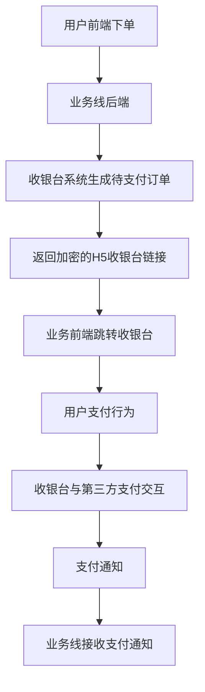
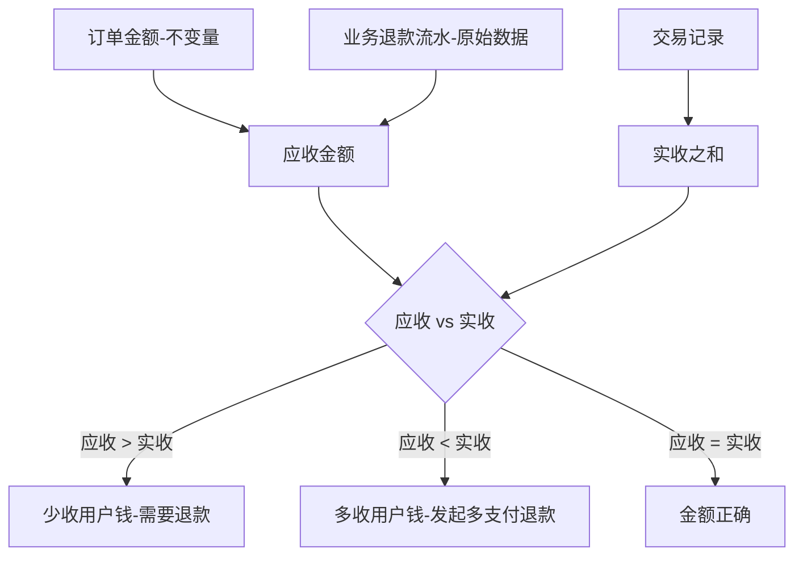
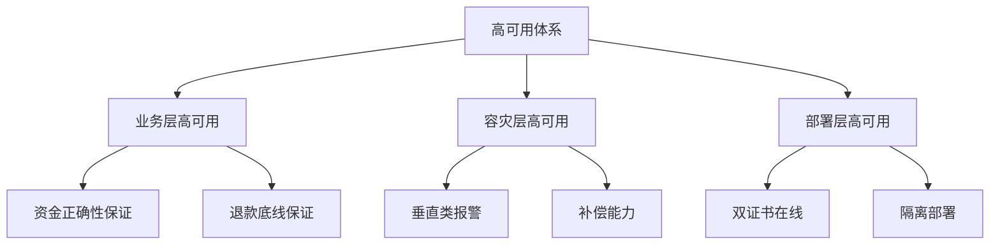
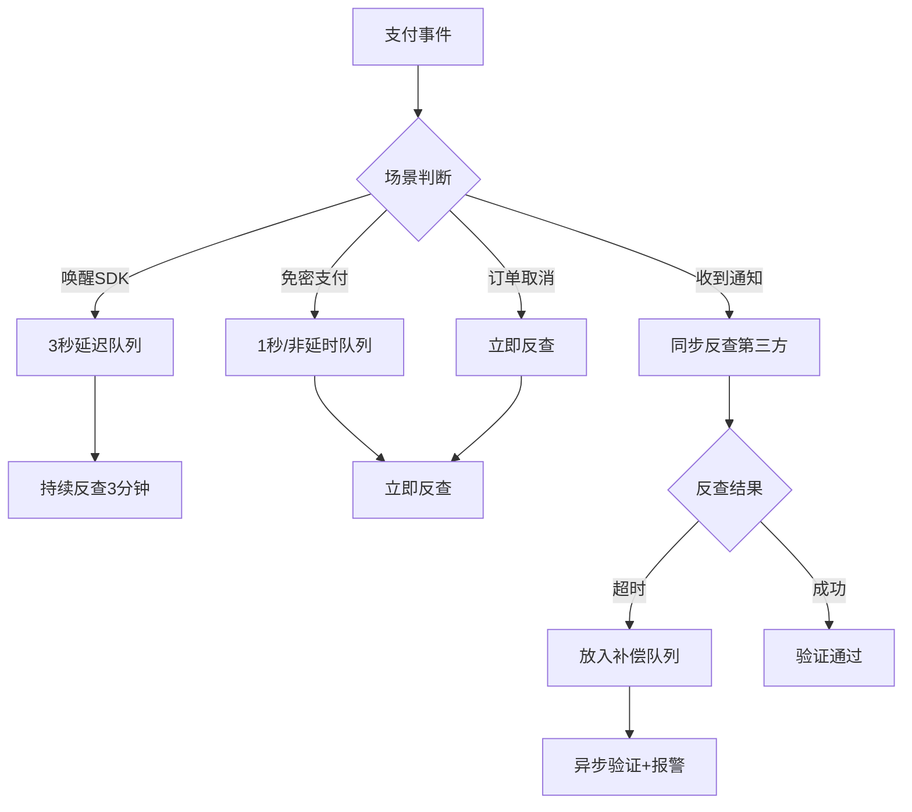
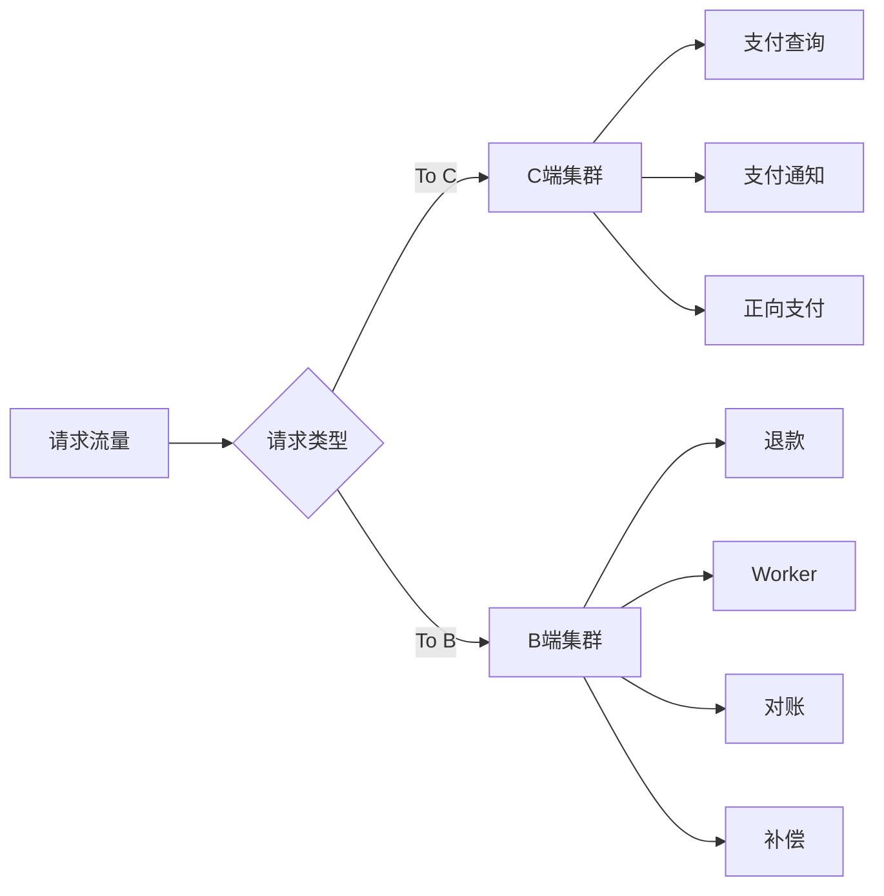
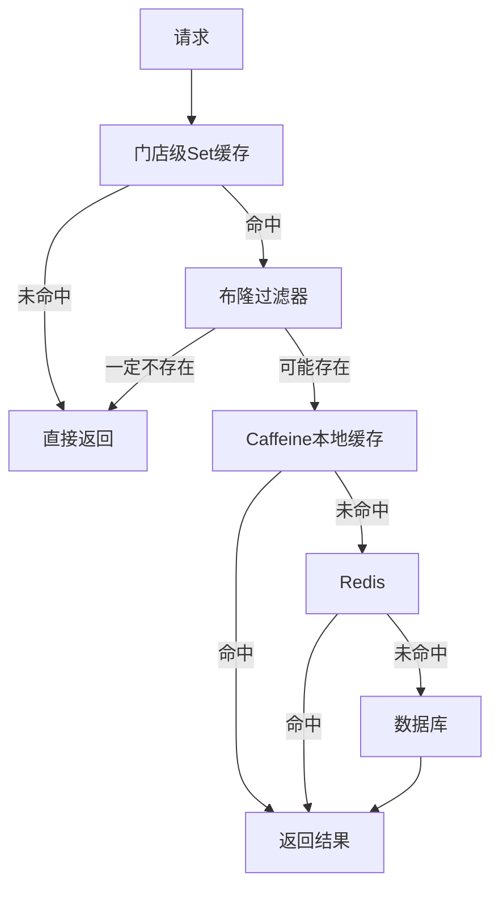
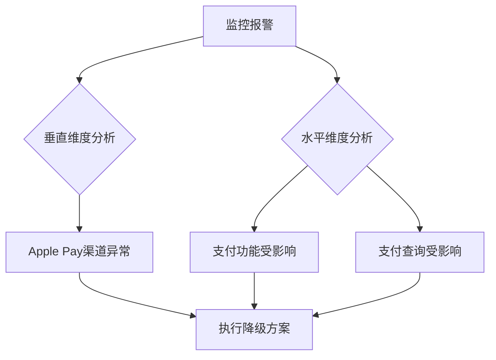
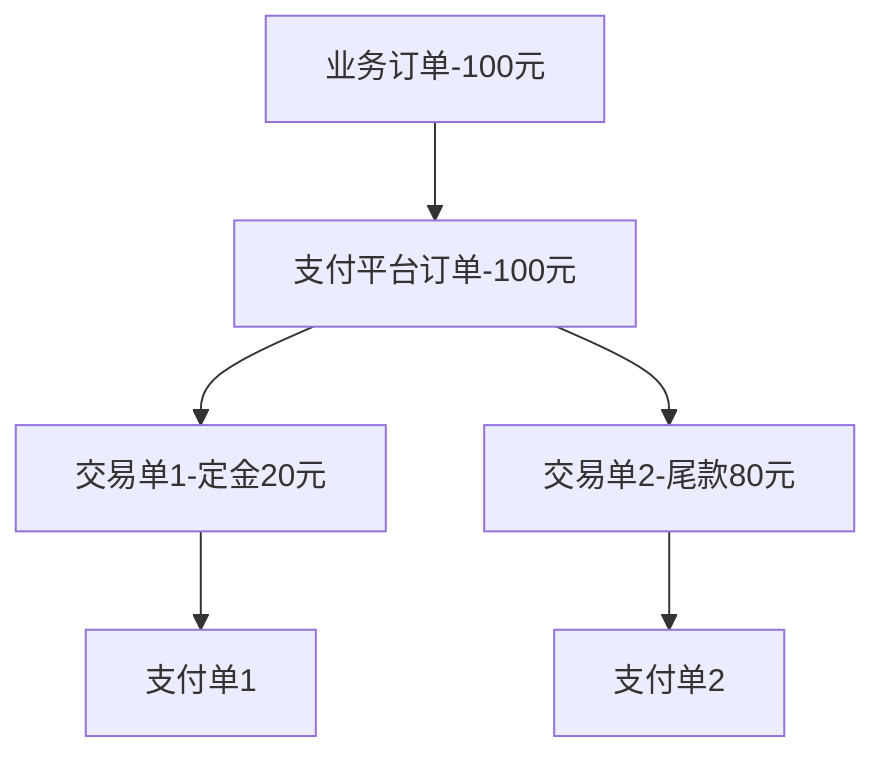

# 京东到家支付平台的高可用架构设计实践

> 来源：未核验 · 类型：分享 · 状态：draft

## 一、概述

### 1.1 支付系统的核心目标

支付平台作为交易系统的核心组件,必须满足三个关键目标:

1. **金额正确性** - 最重要的目标

   - 金融系统中,即使平台少支付一分钱,在大规模交易下也会造成巨大损失
   - 必须反复验证金额相关代码逻辑
2. **安全性**

   - 证书安全管理,避免泄露导致非法退款
   - 防止伪造通知
   - 避免信息明文传输
3. **稳定性**

   - 在线支付已成为生活必需品
   - 对于O2O电商,订单履约时长不到1小时
   - 支付延迟会严重影响用户体验(如外卖场景)

### 1.2 业务背景

- **业务线**: 10余个业务线,主要包括到家业务、闪购业务、快递业务及线下自助收银
- **订单特点**: 配送时效性高、高并发、营销限量
- **技术挑战**: 多端支付场景、异步通知、网络不确定性

## 二、支付平台整体架构

### 2.1 五大支付产品

根据不同业务形态,抽象出五种支付产品:

| 支付产品 | 应用场景   | 特点                       |
| -------- | ---------- | -------------------------- |
| 收银台   | 通用场景   | 具备多种支付能力的综合产品 |
| 直接支付 | 单一渠道   | 如微信小程序仅支持微信支付 |
| 代扣     | 周期性扣款 | 会员场景                   |
| 代付     | 好友代付   | 订单分享支付               |
| 协议支付 | 便捷支付   | 免密支付、快捷支付         |

### 2.2 核心能力

**支付能力**:

- 普通支付
- 定金支付(预售场景的两阶段支付)
- 组合支付(零钱+第三方支付)
- 大额支付(分多次支付)

**退款能力**:

- 全额退款
- 部分退款
- 人工退款
- 多支付退款(自动触发)

**营销能力**:

- 白条免息(3C类商品)
- 区域性支付引流(如北京地区推荐北京银行、招商银行活动)

### 2.3 接入的支付平台

- 主流支付: 微信支付、京东支付、京东白条、支付宝
- 小程序支付: 头条小程序、百度小程序
- 多渠道支持: APP支付、H5支付、小程序支付、线下刷卡

### 2.4 业务交互流程

**接入优势**:

- 业务线参与度低,改造成本小
- 仅需提供: ①生成订单接口 ②接收支付通知接口

### 2.5 收银台配置化

**配置维度**: 最小粒度按支付渠道配置

- **渠道级配置**: 到家APP、京东RN、微信小程序、快手APP等
- **支付方式过滤**: 根据风控能力和业务要求定制

  - 到家APP可能不支持支付宝
  - 百度小程序仅支持百度支付
- **商户号选择**: 根据订单属性动态选择

  - 3C类产品: 选择有营销活动的商户号
  - 虚拟订单(充话费): 选择无营销活动的商户号(风控考虑)
  - 实物订单: 选择费率较低的商户号

## 三、多端支付场景的强一致性设计

### 3.1 支付单生命周期

### 3.2 多端支付场景定义

**多端场景的两个维度**:

1. **多设备并发支付**

   - 唤醒支付SDK后,无法干预和感知用户支付行为
   - 同一订单可能在多台手机上使用多种支付方式同时支付
   - 典型场景: 代付时分享给多个好友,多人同时支付
2. **异步通知延迟**

   - 支付是天然的异步场景
   - 支付通知可能延迟到任何环节
   - 可能在订单完成、退款等任何阶段收到延迟的支付通知

### 3.3 台账机制 - 四个关键字段

支付平台维护一个台账,记录四个核心金额字段:

| 字段 | 说明           | 变化时机                 |
| ---- | -------------- | ------------------------ |
| 应收 | 应该收到的金额 | 订单创建、业务退款时变化 |
| 应退 | 应该退款的金额 | 多支付、业务退款时变化   |
| 实收 | 实际收到的金额 | 收到支付通知时变化       |
| 实退 | 实际退款的金额 | 退款到账时变化           |

**对账公式**: `应收 + 应退 = 实收 + 实退`

### 3.4 多端支付场景案例分析

#### 场景: 20元订单的多支付处理

| 阶段                  | 应收 | 应退 | 实收 | 实退 | 说明                     | 对账结果         |
| --------------------- | ---- | ---- | ---- | ---- | ------------------------ | ---------------- |
| 1. 入单               | 20   | 0    | 0    | 0    | 初始状态                 | 20+0 = 0+0 ❌    |
| 2. 多支付             | 20   | 0    | 60   | 0    | 微信、京东、代付同时到账 | 20+0 ≠ 60+0     |
| 3. 发起多支付退款     | 20   | 40   | 60   | 0    | 系统自动发起退款40元     | 20+40 = 60+0 ✓  |
| 4. 多支付退款到账     | 20   | 40   | 20   | 40   | 退款完成                 | 20+40 = 20+40 ✓ |
| 5. 业务退款申请       | 10   | 50   | 20   | 40   | 业务发起10元退款         | 10+50 = 20+40 ✓ |
| 6. 待支付通知延迟到达 | 10   | 70   | 40   | 40   | 又收到20元支付           | 10+70 = 40+40 ✓ |
| 7. 所有退款完成       | 10   | 70   | 10   | 70   | 最终状态                 | 10+70 = 10+70 ✓ |

**关键机制**:

- 每次收到支付通知都进行一次对账
- 实收 > 应收时,自动发起多支付退款
- 整个过程中账目始终保持平衡

### 3.5 金额正确性的底线保障

虽然台账公式能保证大部分场景,但为了应对可能的逻辑bug,设计了底线保障机制:

**底线原则**: 确保不会产生多退款

- 用户多退一分钱,可能不会立即反馈
- 用户少退一分钱,会立即投诉

**底线公式**: `应收金额 >= 实收金额`

**验证思路**: 通过不变量和不需要加工的数据验证变量

**三重验证机制**:

1. 台账对账: `应收 + 应退 = 实收 + 实退`
2. 底线验证: `订单金额 - 业务退款流水 = 应收金额 >= 实收之和`
3. 第三方对账: 实收记录与第三方支付平台对账

## 四、高可用实践

### 4.1 高可用三个维度

### 4.2 支付时效性保障

#### 线上场景特征

- **配送时效性**: 订单整体时效1小时,支付不能延迟超过1分钟
- **高并发**: 银行营销活动力度不亚于秒杀场景
- **营销限量**: 优惠由银行承担,支付延迟导致订单取消会引发投诉

#### 线下场景特征

- **群体性压力**: 收银台排队,一人支付问题影响所有人
- **网络环境不可控**: 对支付时效性要求更高
- **不能让用户提前离开**: 必须等待订单完成确认

### 4.3 查询补偿机制

#### 旧方案问题

- 扫描数据库所有待支付订单
- 对数据库压力大
- 需要设计反查任务worker

#### 新方案: 基于事件通知(GMQ)

根据不同触发场景,选择不同的反查时机:

| 场景                  | 延迟策略           | 说明                       |
| --------------------- | ------------------ | -------------------------- |
| 需要用户参与(唤醒SDK) | 3秒延迟队列        | 前3分钟内持续反查          |
| 协议支付(免密)        | 非延时/1秒延迟队列 | 无需用户输入密码,立即反查  |
| 订单取消              | 取消时触发         | 防止取消前已支付但通知延迟 |
| 收到支付通知          | 同步查询           | 防止证书泄露和伪造通知     |

**超时处理策略**:

- 不阻碍用户体验,暂时放过验证
- 放入补偿队列异步处理
- 业务方看到已完成订单
- 如果查到未支付,触发反向报警

### 4.4 高可用部署架构

#### 集群隔离策略

将服务分为两个集群,按请求类型隔离:

**To C集群** (RT要求高):

- 支付查询
- 支付通知
- 正向支付场景

**To B集群** (资源消耗大):

- 退款(事务较大)
- Worker任务
- 对账
- 补偿

**隔离目标**: 避免非业务消耗导致RT升高

#### RT升高的三大原因

1. **池化资源不足**

   - 处理请求线程池资源不足
   - Redis连接池资源不足
   - 数据库连接池资源不足
2. **CPU竞争**

   - Worker大量执行抢占CPU
   - CPU分配相对公平,需按业务重要程度隔离
3. **GC压力**

   - 对账时产生大量数据
   - 频繁GC影响正常请求

### 4.5 多级缓存架构 - 白条3C营销活动案例

#### 业务需求

- **参与活动**: SKU级别,不到百万量级
- **响应时间**: 5毫秒以内
- **峰值QPS**: 10万/秒

#### 演进过程

**第一阶段**: 纯Redis

- 问题: 需要大量副本才能扛住10万QPS
- 实际场景下Redis性能不如理想(跨机房等因素)

**第二阶段**: 增加本地缓存(Caffeine)

- 通过增量广播MQ同步到服务器集群
- 使用Caffeine热缓存框架
- 问题: 到家SKU是亿级别,活动SKU不到百万,大量无效请求穿透到Redis

**第三阶段**: 增加布隆过滤器

- 解决无效SKU穿透问题
- 错误率设置为3%(可接受)
- 问题: 百万级别数据需要3次哈希,消耗CPU

**第四阶段**: 增加门店级缓存

**最终架构优势**:

- 第一层(门店Set): 几千个门店,内存占用少,过滤大部分无效请求
- 第二层(布隆过滤器): 3%错误率,防止无效SKU穿透
- 第三层(Caffeine): 热点SKU缓存
- 第四层(Redis): 分布式缓存
- 命中率: 达到97%

**实际效果**:

- 平常4000台机器,每台QPS 130左右
- 本地缓存命中率达到97%
- 成功支撑618大促活动

### 4.6 监控体系

> "没有度量就没有管理"

#### 机器层面监控

| 监控类型 | 关键指标                    |
| -------- | --------------------------- |
| 系统指标 | CPU使用率、负载、内存使用率 |
| 网络指标 | TCP连接数、重传场景         |
| 磁盘指标 | 磁盘使用量、繁忙度          |
| 容器指标 | 线程数量、线程使用情况      |

#### 应用层面监控

1. **自定义层面**

   - 非预期逻辑(第三方平台文档不详尽)
   - Bug监控(定期搜索Exception)
2. **业务维度监控**

**垂直维度监控**(最核心):

- 按业务方维度: 到家、闪购、快递等
- 按支付渠道维度: 微信、支付宝、Apple Pay等

**水平维度监控**(功能性):

- 支付、退款、营销、通知等功能

#### 监控案例分析

某次Apple Pay故障:

- **垂直维度**: 快速定位是Apple Pay渠道问题
- **水平维度**: 识别影响了支付、支付查询等功能
- **快速响应**: 从容执行降级方案

## 五、关键技术细节

### 5.1 幂等性保障

#### 退款幂等

**问题场景**:

- 业务方发起10元退款
- 网络中断导致重试
- 可能导致退20元

**解决方案**:

- 业务方提供退款唯一标识
- 数据库唯一索引保证幂等
- 优先使用Redis悲观锁(扛并发能力强)
- 乐观锁在高并发下对数据库不友好(大量锁冲突)

### 5.2 金额数据类型选择

**不推荐**: Float、Double

- 存在精度问题
- 即使有工具类,也容易用错

**推荐方案**:

- **一般系统**: 使用Long,以分为单位(1元=100)
- **支付系统**: 使用Decimal,以元为单位(小数点后两位)

**支付系统特殊性**:

- 第三方支付平台统一使用BigDecimal,单位到元
- 避免系统内部频繁类型转换
- 入参统一要求Decimal类型

### 5.3 预售/分阶段支付

**业务场景**:

- 定金20元 + 尾款80元
- 支付营销(支付99元优惠)

**实现方案**:

**关键设计**:

- 支付平台重新生成支付订单
- 初始金额100元,应收100元
- 根据标识(定金/尾款)生成不同交易单
- 定金支付成功后,订单处于"半对账"状态
- 预留扩展场景: 组合支付、大额支付

### 5.4 风控策略

1. **虚拟订单**(充话费等)

   - 不暴露过多支付方式
   - 避免营销活动
   - 防止利用银行卡报销
2. **证书安全**

   - 双证书在线
   - 防止证书泄露
3. **支付反查**

   - 防止伪造通知
   - 同步验证第三方

## 六、容灾与扩展

### 6.1 弹性伸缩

**当前方案**: 基于监控的人工扩容

- CPU使用率报警阈值: 40-50%
- 正常使用率: 20-30%
- 应急扩容时间: 5分钟内完成部署

**大促场景**:

- 提前降低To B集群资源消耗
- 延迟退款任务执行
- 优先保障To C集群

### 6.2 数据一致性

**缓存与数据库同步**:

- 活动生效前: 同步到数据库
- 活动生效后: 通过增量MQ同步到本地缓存
- 允许5分钟延迟(业务可接受)
- 活动开始前5分钟提前同步缓存

**库存扣减**:

- 下单时预扣缓存
- 订单失败时回滚缓存
- 使用两阶段提交保证一致性
- 先记录待扣权益到数据库
- 最后更新完结状态

## 七、总结与最佳实践

### 7.1 核心设计原则

1. **通过简单公式验证复杂场景**

   - 台账对账公式
   - 底线保障公式
2. **用不变量验证变量**

   - 订单金额(不变)
   - 业务退款流水(原始数据)
   - 验证实收实退(变量)
3. **多重验证机制**

   - 不依赖单一验证手段
   - 三重验证保障金额正确性
4. **隔离部署**

   - 按业务重要性隔离
   - 避免资源竞争

### 7.2 关键技术选型

| 技术点     | 选型          | 理由                  |
| ---------- | ------------- | --------------------- |
| 消息队列   | GMQ(京东自研) | 支持延迟消费          |
| 本地缓存   | Caffeine      | 高性能热点缓存        |
| 分布式缓存 | Redis         | 成熟稳定              |
| 数据库     | MySQL         | 事务支持              |
| 金额类型   | Decimal       | 精度保证,与第三方统一 |
| 锁机制     | Redis悲观锁   | 高并发场景友好        |

### 7.3 重构建议

如果要重构支付系统,重点关注:

1. **应用隔离部署** - To B和To C集群分离
2. **支付反查机制** - 安全性和时效性保障
3. **营销场景支持** - 预留扩展能力
4. **金额底线保障** - 多重验证机制
5. **支付方式配置化** - 灵活的渠道配置
6. **监控体系** - 垂直+水平双维度

### 7.4 经验教训

1. **金额正确性是底线**

   - 宁可少收,不能多退
   - 多重验证机制保障
2. **支付是异步场景**

   - 必须考虑通知延迟
   - 在任何环节都可能收到延迟通知
3. **多端支付不可避免**

   - 不要限制用户只能支付一次
   - 通过对账机制自动处理多支付
4. **监控至关重要**

   - "没有度量就没有管理"
   - 垂直维度监控快速定位问题
5. **预留扩展能力**

   - 组合支付
   - 大额支付
   - 预售场景
   - 营销活动

## 八、Q&A精选

**Q: 如何避免重复支付?**
A: 不避免重复支付,而是通过对账机制自动处理多支付场景,自动发起多支付退款。限制用户只能支付一次会严重影响用户体验。

**Q: 幂等性如何保证?**
A: 业务方提供唯一标识,数据库唯一索引+Redis悲观锁保证幂等。

**Q: 如何处理分阶段支付?**
A: 支付平台重新生成支付订单,根据标识(定金/尾款)生成不同交易单,维护应收总额不变。

**Q: 为什么使用Decimal而不是Long?**
A: 第三方支付平台统一使用Decimal(元为单位),避免系统内部频繁转换。一般系统推荐用Long(分为单位)。

**Q: 延迟队列如何实现?**
A: 使用GMQ支持的延迟消费功能,配置不同延迟时间(3秒、6秒、3分钟等)。RabbitMQ和RocketMQ也支持类似功能。

