# 京东在大规模运维场景下的SRE实践

> 来源：未核验 · 类型：分享 · 状态：draft


> 分享单位：京东云  
> 受众人群：SRE、运维及稳定性保障工程师  
> 核心主题：SRE金字塔体系与大规模运维实践

## 目录

- [一、SRE概述](#一sre概述)
- [二、京东与SRE](#二京东与sre)
- [三、SRE金字塔体系实践](#三sre金字塔体系实践)
- [四、大促保障实践](#四大促保障实践)
- [五、Q&A精选](#五qa精选)

---

## 一、SRE概述

### 1.1 从一个故事开始

**哥伦比亚号航天飞机事故（2003年）：**
- 7名宇航员在事故中殉难
- 恰好是SRE诞生的那一年

> **启示：** 在工程和软件过程中，无论是运维方面的事情，都类似于守护高可用的飞机。任何一个小的失误问题，都可能危及生命。我们要保持敬畏之心。

### 1.2 什么是SRE

**SRE（Site Reliability Engineering）- 站点可靠性工程**

**起源：**
- 始创于Google（2003年）
- 从软件和运维的角度出发
- 运维与开发的合一视角

**两大工作方向：**

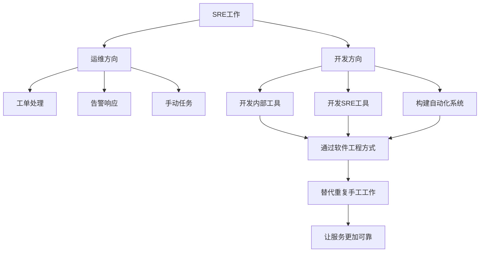

**核心理念：**
- 聚焦服务的可靠性
- Automate Everything（自动化一切）
- 通过软件工程方式开发自动化系统

**团队规模：**
- Google拥有约2500人的SRE团队

> **Google前SRE的描述：** "我们的工作就像是世界上最紧张的维护队员，我们的工作如同给时速100公里行驶的赛车换轮胎一样。"

### 1.3 理想与现实

**理想工作：**
- 构建完美架构
- 系统稳定运行
- 零故障

**现实工作：**
- 各种突发问题
- 系统复杂性
- 不可预测的故障

### 1.4 SRE技能要求

**技术栈覆盖面：**

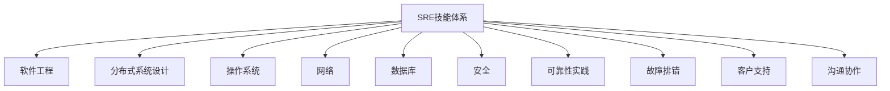

**能力要求：**
- **既要全又要精**
- **复合能力特别强**
- 多方面系统技能都要具备
- 通常需要丰富的软件工程或运维积累

> **Google SRE实践指南：** 很多SRE是做过非常多的软件工程或运维积累之后，才会转成SRE。

### 1.5 SRE工具栈

**庞大的工具生态：**

| 类别 | 工具示例 |
|------|---------|
| 源码管理 | Git、GitLab、SVN |
| 配置管理 | Ansible、Terraform、Chef |
| 容器编排 | Kubernetes、Docker Swarm |
| 监控工具 | Prometheus、Grafana、Zabbix |
| 运维编排 | Jenkins、GitLab CI/CD |
| 智能化工具 | AIOps平台、机器学习工具 |

**与DevOps的关系：**
- SRE工具栈与DevOps有部分重叠
- 很多工具是共通的

### 1.6 SRE与琐事

**什么是琐事？**

**不算琐事的工作：**
- 参加会议
- 写报告
- 电子邮件
- 通勤

**真正的琐事：**
- 维护应用和服务器的重复性工作
- 大量无价值的工单
- 繁琐的重复操作

**SRE目标：消除琐事**

### 1.7 SRE时间分配

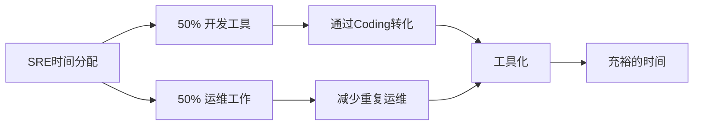

**理想状态：**
- 至少50%时间开发工具
- 通过Coding方式转化重复工作
- 保障SRE时间更加充裕

### 1.8 DevOps vs SRE

#### 1.8.1 DevOps五项基本原则

1. **减少组织孤岛**
2. **正常接受失败**
3. **逐步实施**
4. **利用工具和自动化**
5. **用技术手段衡量一切可衡量的**

**关系定位：**
> SRE是Class的DevOps - SRE是依托于DevOps基础框架衍生出来的工种

#### 1.8.2 DevOps与SRE对比

| 维度 | DevOps | SRE |
|------|--------|-----|
| **目标** | 交付速度 | 服务高可用性 |
| **聚焦点** | 快速交付 | 运维视角 |
| **核心工作** | CI/CD集成、基础环境构建、配置管理、IaC、Serverless | 运维工作、事件响应、事件反思、监控告警、容量规划 |
| **视角** | 开发侧 | 运维侧 |

### 1.9 Google SRE书籍推荐

Google提供了多本开源电子书籍：
- 《Site Reliability Engineering》
- 《The Site Reliability Workbook》
- 《Building Secure and Reliable Systems》

部分书籍有中文汉化版，建议阅读学习。

---

## 二、京东与SRE

### 2.1 京东云的定位

**组织架构：**
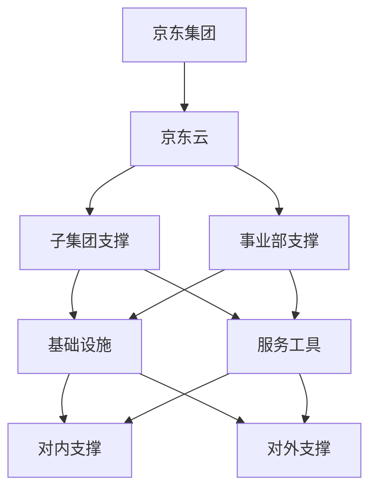

**团队规模：**
- 公司至少有**上千个运维方向的工种**

### 2.2 SRE在京东的组织架构

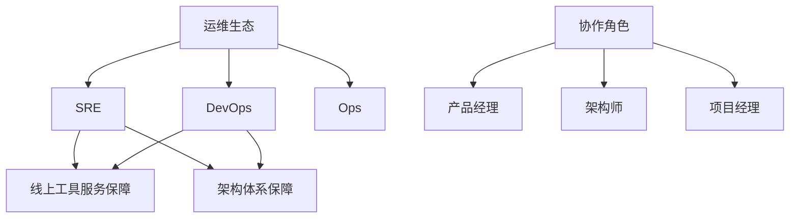

**角色定位：**
- SRE与DevOps属于平行角色
- SRE与开发和Ops更紧密
- 提供线上工具服务保障
- 提供整体架构保障体系

### 2.3 项目管理模式

**大型项目组织：**

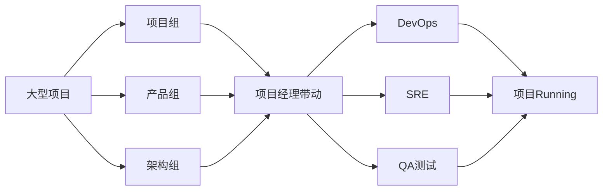

**评审流程：**
- 架构评审
- 产品评审
- 项目评审

**SRE角色：**
- 担当重要支撑角色
- 保障项目上线和交付的稳定性

### 2.4 京东的工具市场

**庞大的轮子市场：**

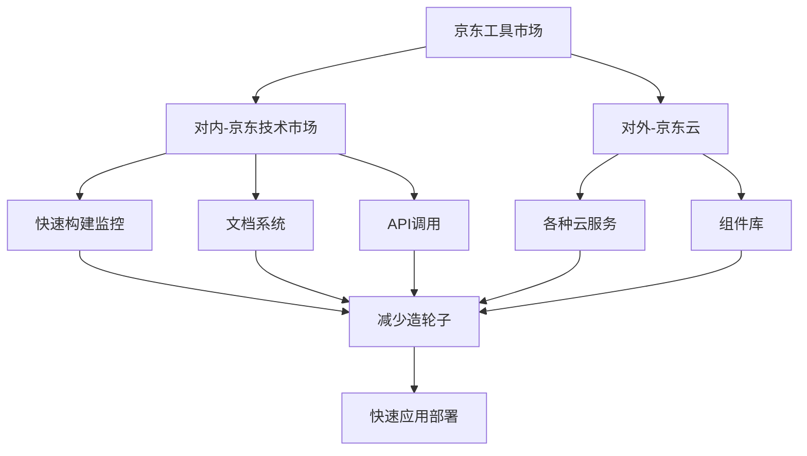

**核心价值：**
- 解放劳动力
- 类似军火库角色
- 快速构建各种服务和组件
- 借力而非造轮子
- Open API设计理念

---

## 三、SRE金字塔体系实践

### 3.1 SRE金字塔理论

**来源：**
- Google SRE工程师Mikey
- 基于SRE团队十年实践
- 形成七层金字塔理论

**七层架构：**

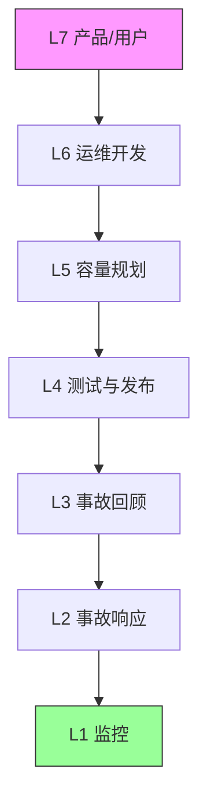

**全面保障服务高可用性的七个层面：**
1. **监控（Monitoring）** - 基础层
2. **事故响应（Incident Response）**
3. **事故回顾（Postmortem）**
4. **测试与发布（Testing & Release）**
5. **容量规划（Capacity Planning）**
6. **运维开发（Development）**
7. **产品/用户（Product）** - 顶层

---

### 3.2 L1层：监控 - 服务的眼睛

#### 3.2.1 为什么监控是最底层

> **监控就是系统的眼睛。如果没有眼睛，就看不到所有你要看的东西。**

**现代定义：服务可观测性（Observability）**

**核心能力：**
- 洞察服务健康状态
- 跟踪系统可用性
- 观察系统内部变化
- 从宏观或微观角度观察服务和应用

#### 3.2.2 监控的关键要素

**两个关键点：**
1. **确定质量标准**
   - 定义什么是好的
   - 衡量合理范围

2. **系统性持续监控**
   - 不是定时任务
   - 持久化衡量业务

**三大能力：**
1. 完整的指标采集
2. 海量设备与异构环境支持
3. 监控存储和分析聚合能力

#### 3.2.3 三种监控采集方式

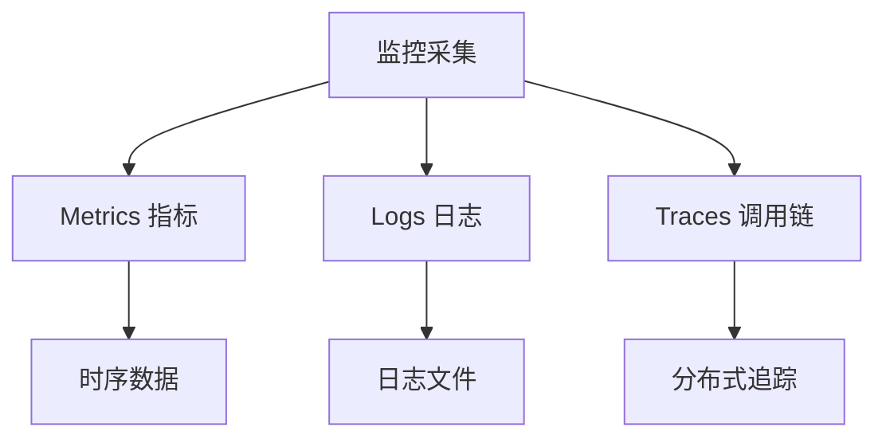

**京东内部监控系统：**

| 类型 | 内部系统 | 外部开源方案 |
|------|---------|-------------|
| Metrics | MDC、京东云 | Prometheus、Zabbix、OpenFalcon |
| Logs | LogBook | ELK、Loki |
| Traces | UMP、GEX、PFinder | Jaeger、Zipkin、SkyWalking |

#### 3.2.4 监控指标体系

**白盒监控 - Google黄金指标：**

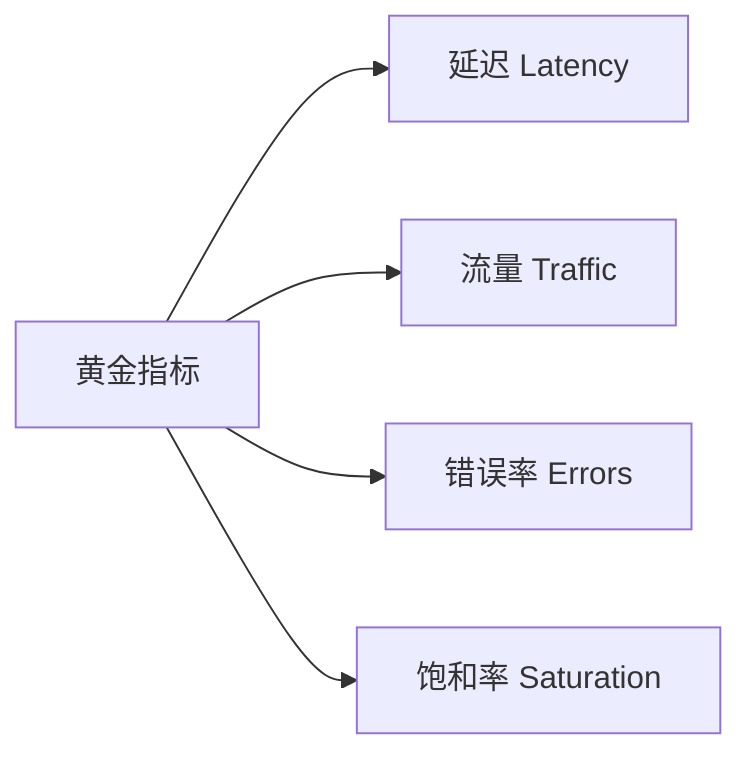

**覆盖范围：**
- 机器存活
- 基础指标
- 服务端口指标

**黑盒监控：**
- 基于域名的功能拨测
- 业务功能页监控
- 产品页监控
- 接口监控
- 基于用户角度发现问题

#### 3.2.5 京东监控系统架构

**MDC监控系统：**

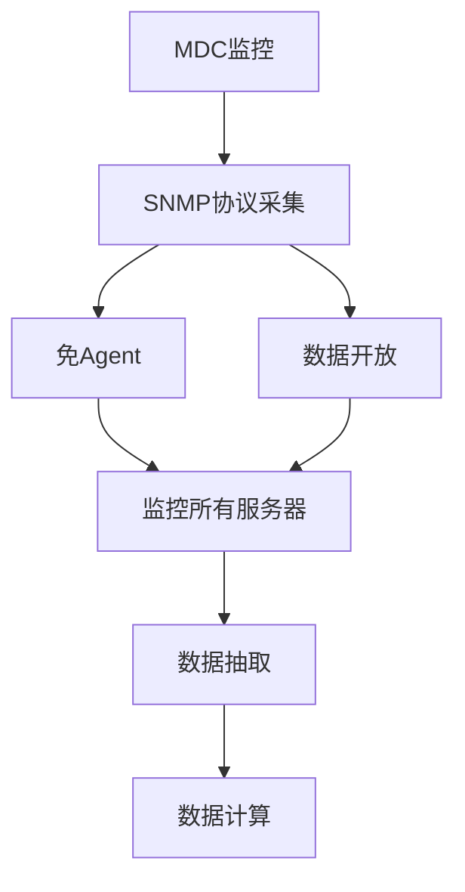

**特点：**
- 基于SNMP协议（虽然古老但免Agent）
- 数据完全开放
- 可进行数据抽取和计算

**京东云监控架构：**

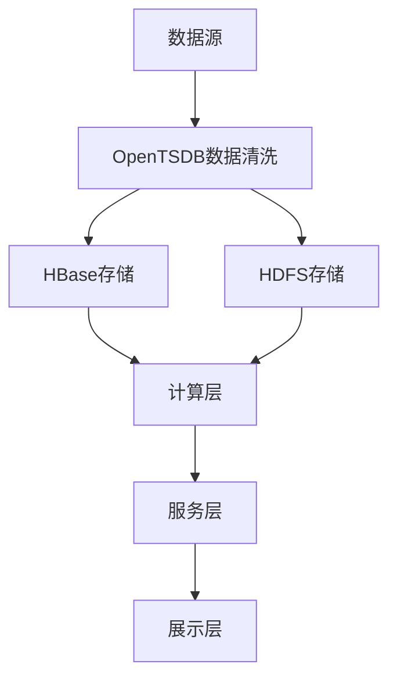

**UMP调用链系统：**

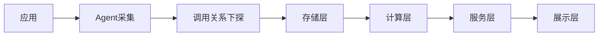

**技术基础：**
- 基于Google论文开发
- Agent方式采集
- 下探所有应用调用关系

**LogBook日志系统：**

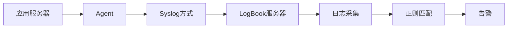

**功能特性：**
- 每台机器挂载Agent
- 通过Syslog方式传输
- 支持任意文件和正则关联匹配
- 支持告警功能

---

### 3.3 L2层：事故响应

#### 3.3.1 三种交流方式

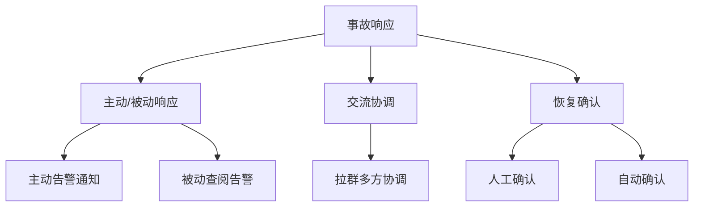

**完整链条：**
1. 告警发生
2. 告警通知
3. 问题处理
4. 恢复告警
5. 确认（人工或自动）

#### 3.3.2 告警的三个层次

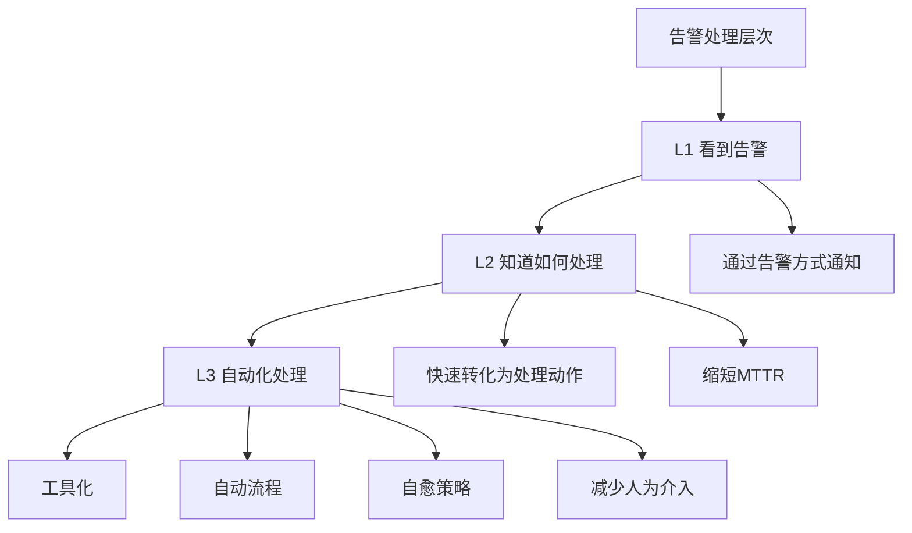

**第一层：看到告警**
- 当发生异常时通过告警通知

**第二层：知道处理**
- 快速转化为处理动作
- 最小化缩短MTTR（故障恢复时间）

**第三层：自动化**
- 通过自动化方式
- 抽象成工具化
- 自动流程或自愈策略
- 减少人为操作和介入

#### 3.3.3 告警规则配置

**三种常见规则：**

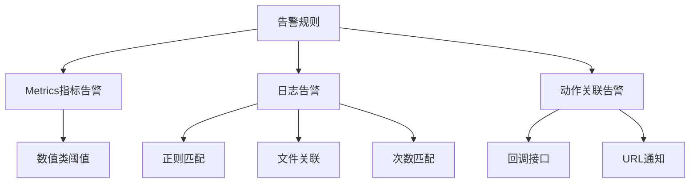

#### 3.3.4 告警管理的两个关键

**1. 告警有效性**
- 控制和管理告警
- 避免成为垃圾制造机
- 防止告警排斥心理

**2. 告警及时性**
- 不要全员广播
- 精准发送给相关人员
- 避免重要告警被淹没
- 防止告警懈怠

#### 3.3.5 海量告警处理

**告警压缩流程：**

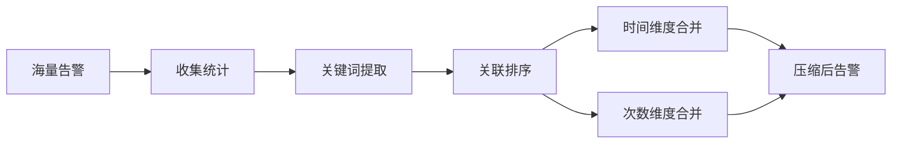

**处理方式：**
- 通过K值统计
- 关联排序
- 时间维度或次数维度合并

#### 3.3.6 告警处理机制

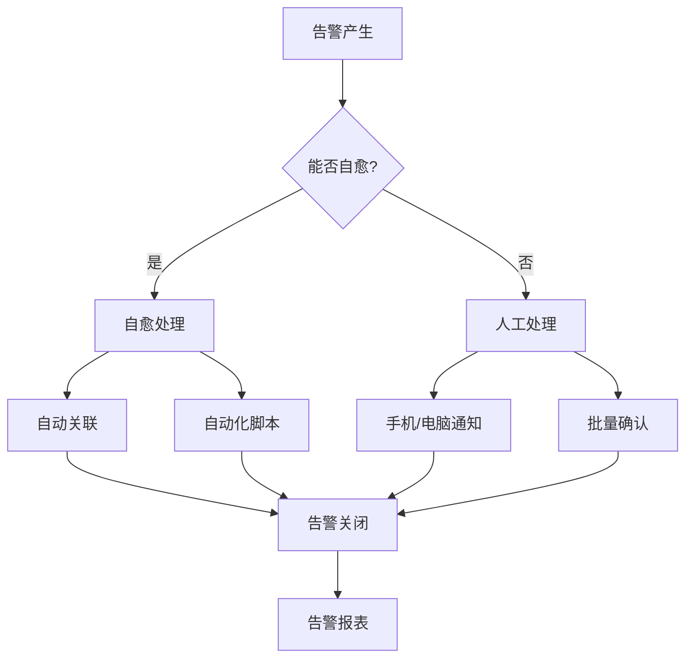

**核心原则：**
> 每一条告警都需要被人工或自动处理。如果告警没有人关注，没有人处理，那么这个告警是没有任何意义的。

**告警报表：**
- 收集各渠道告警
- 关联分析聚合
- 每天/每周推送
- 保证对告警的敬畏和关注

#### 3.3.7 SLI/SLO/SLA体系

**概念关系：**

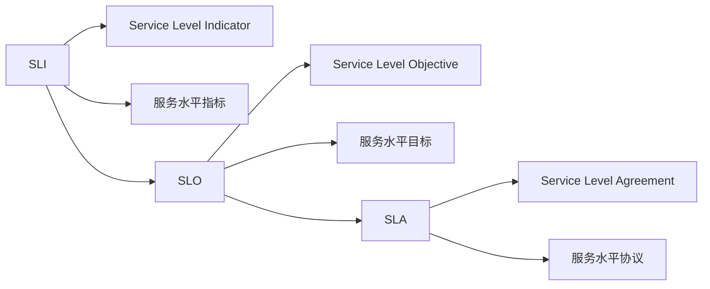

**转换关系：**
- **SLI**：基础指标（如首页95线）
- **SLO**：SLI转换成百分比（如99.9%、99.99%）
- **SLA**：多个SLO组合形成协议

**时间换算（年度可用性）：**

| SLA | 年度停机时间 | 月度停机时间 |
|-----|------------|------------|
| 99% | 3.65天 | 7.2小时 |
| 99.9% | 8.76小时 | 43.2分钟 |
| 99.99% | 52.56分钟 | 4.32分钟 |
| 99.999% | 5.26分钟 | 25.9秒 |

**京东实践：**
- 基础服务都做了SLI/SLO/SLA绑定
- 服务抖动后基于SLO波动关注
- 波动点形成事故报告
- SRE和产品关注SLO
- 销售更关注SLA

#### 3.3.8 MTTX指标体系

**核心指标：**
- **MTTF**（Mean Time To Failure）：平均故障时间
- **MTTR**（Mean Time To Repair）：平均修复时间
- **MTBF**（Mean Time Between Failures）：平均故障间隔

**应用场景：**
- 业务高可用保障期间
- 统计核心业务故障时间
- 统计故障处理时间
- 保障团队横向稳定性

#### 3.3.9 故障自愈系统

**自愈流程：**

```mermaid
graph LR
    A[告警产生] --> B[日志匹配]
    B --> C[自愈规则库]
    C --> D[规则匹配]
    D --> E[Workflow工作流]
    E --> F[自愈动作执行]
    F --> G[作业中心]
    G --> H[脚本执行]
    H --> I[消息通知]
```

**架构设计：**

```mermaid
graph TD
    A[告警源] --> B[自愈规则库]
    
    B --> C{规则匹配}
    
    C --> D[生效时间判定]
    C --> E[执行时间判定]
    
    D --> F[作业中心]
    E --> F
    
    F --> G[Shell脚本]
    F --> H[Ansible]
    
    G --> I[执行结果]
    H --> I
    
    I --> J[消息通知]
    
    K[Redis控制] --> L[频率控制]
    K --> M[上下线控制]
    K --> N[生效时间控制]
```

**控制机制：**
- 通过Redis控制频率
- 控制上下线
- 控制生效时间
- 避免自愈成为危害线上的工具

**开源方案：**
- StackStorm - 可实现类似流程

---

### 3.4 L3层：事故回顾

#### 3.4.1 事故回顾的意义

**目标：**
> 对过去异常的服务中断情况进行回顾和总结，确保相同的问题不再犯。

**传统vs SRE：**
- **传统运维**：事故回顾 = 甩锅大会
- **SRE实践**：构建无指责的事故文化

#### 3.4.2 无指责事故文化

**四大原则：**

```mermaid
graph TD
    A[无指责事故文化] --> B[无指责透明]
    A --> C[接受不完美]
    A --> D[无惩罚机制]
    A --> E[故障中成长]
    
    B --> F[还原问题本质]
    C --> F
    D --> F
    E --> F
    
    F --> G[不要怕]
    F --> H[不羞耻]
    
    G --> I[深刻改进]
    H --> I
```

**核心理念：**
1. **无指责透明的事故文化** - 还原本质
2. **接受服务的不完美** - 还原问题本质
3. **无惩罚的事故文化** - 永远没有人会明知有故障而制造故障
4. **故障中积累成长** - 形成不怕和不羞耻的行为

> **每一次宝贵的故障都是一笔财富。**

#### 3.4.3 故障改进维度

**通过故障改进的方面：**
- 监控告警
- 降级预案
- 架构优化
- 自动化能力
- 流程规范

#### 3.4.4 京东事故报告

**报告结构：**

```mermaid
graph TD
    A[事故报告] --> B[故障等级]
    A --> C[事故描述]
    A --> D[事故影响]
    A --> E[处理过程]
    A --> F[事故原因]
    A --> G[触发条件]
    A --> H[解决方案]
    A --> I[提升方案]
    A --> J[应急预案]
```

**管理方式：**
- 使用Confluence记录
- 月度故障盘点
- 不断提升服务高可靠性

#### 3.4.5 故障分级体系

**五个等级：**
- P0 - 最高级别
- P1 - 严重故障
- P2 - 一般故障
- P3 - 轻微故障
- P4 - 提示级别

**评级维度：**

```mermaid
graph LR
    A[故障评级] --> B[资金损失]
    A --> C[订单损失]
    A --> D[用户体验]
    A --> E[重新发版]
    A --> F[影响时长]
    
    B --> G[减分项计算]
    C --> G
    D --> G
    E --> G
    F --> G
    
    G --> H[最终定级]
```

**定级团队：**
- 客服团队
- 架构团队

**定级应用：**
- 生成定级报表
- 横向/纵向对比业务稳定情况
- 事故预算成本管理
- 上线抑制机制

---

### 3.5 L4层：测试与发布

#### 3.5.1 矛盾与平衡

**矛盾点：**
```mermaid
graph LR
    A[测试] --> B[需要更多时间]
    B --> C[服务更稳定]
    
    D[发布] --> E[希望更快速度]
    E --> F[领先市场]
    
    C -.矛盾.- F
```

**SRE的平衡之道：**
- DevOps的CI/CD工具
- SRE的监控告警
- 架构的不断优化
- 保障快速、可靠的服务交付

#### 3.5.2 京东的自主化发布

**自主化程度：**
- 开发可实现80%-90%自主化服务发布和测试
- 解放大量劳动力

#### 3.5.3 T-One发布系统

**定位：**
- 主要的Java应用发布平台

**架构：**

```mermaid
graph LR
    A[开发] --> B[Git代码仓库]
    B --> C[构建包]
    C --> D[提测]
    D --> E[申请发布]
    E --> F[T-One平台]
    
    F --> G[Jenkins集成]
    F --> H[底层框架]
    
    G --> I[测试环境]
    G --> J[预发环境]
    G --> K[生产环境]
    
    I --> L[LogBook Agent]
    J --> L
    K --> L
    
    I --> M[应用监控Agent]
    J --> M
    K --> M
```

**特点：**
- Java + Git + Jenkins长流程打通
- 集成LogBook Agent
- 集成应用监控Agent
- 保障发布期间监控覆盖和数据可靠性

#### 3.5.4 JDOS发布系统

**定位：**
- 零售团队提供技术支持
- 纯容器化Kubernetes云管理系统

**架构：**

```mermaid
graph TD
    A[JDOS 2.0] --> B[Kubernetes生态]
    
    B --> C[多语言支持]
    B --> D[持续集成]
    B --> E[负载创建]
    B --> F[存储管理]
    
    C --> G[Git仓库]
    D --> G
    
    G --> H[Jenkins]
    H --> I[容器镜像]
    
    I --> J[K8s集群]
```

**能力：**
- 不同编程语言的持续集成和发布
- 负载创建
- 存储管理
- 持续代码集成打通

**规模：**
- 双十一峰值：**百万容器**体量
- JDOS 3.0版本持续开发中

---

### 3.6 L5层：容量规划

#### 3.6.1 容量规划的重要性

**面临的挑战：**
- 不是几百台、几千台机器
- 可能是**上万台应用**在运行

**三大价值：**

```mermaid
graph TD
    A[容量规划价值] --> B[预测未来]
    A --> C[发现瓶颈]
    A --> D[成本控制]
    
    B --> E[业务增长预测]
    C --> F[系统瓶颈识别]
    D --> G[资源充分利用]
```

#### 3.6.2 容量规划能力

**核心能力：**
1. 查看当前容量
2. 预测何时达到容量上限
3. 如何更改服务器执行容量规划
4. 计算容量成本
5. 多维度容量数据可视化

#### 3.6.3 容量计算公式

**基于CPU维度的应用容量计算：**

```
容量值 = 昨天CPU最高值 / 机器数量
```

**示例：**
```
应用A：
- 昨天CPU最高值：80%
- 机器数量：10台
- 容量值 = 80% / 10 = 8%/台
```

#### 3.6.4 容量报表体系

```mermaid
graph TD
    A[容量报表] --> B[每周报表]
    
    B --> C[应用维度]
    B --> D[部门维度]
    B --> E[事业部维度]
    
    C --> F[横向对比]
    D --> F
    E --> F
    
    F --> G[容量使用情况]
```

#### 3.6.5 账单与成本系统

**阿基米德账单系统：**

```mermaid
graph LR
    A[账单系统] --> B[容量数据]
    B --> C[容量预警]
    
    A --> D[成本核算]
    D --> E[月度花销]
    
    C --> F[应用容量情况]
    E --> F
```

**功能：**
- 关联容量预警
- 多维度数据抽取
- 成本换算
- 月度花销统计

#### 3.6.6 容量评分标准

**评分公式：**

```mermaid
graph LR
    A[机器实例] --> B[CPU评分]
    A --> C[内存评分]
    A --> D[容量规格评分]
    
    B --> E[综合评分]
    C --> E
    D --> E
    
    E --> F[异常判定]
    F --> G[扩缩容建议]
```

**应用场景：**
- 通过分值异常进行扩缩容
- 保证资源被充分利用

#### 3.6.7 容量阈值管理

**告警阈值：**

| 服务类型 | 容量阈值 | 处理动作 |
|---------|---------|---------|
| 运营类服务器 | < 30% | 资源下线 |
| 线上业务 | < 75% | 容量调整 |

**弹性伸缩：**
- 核心服务配置水平Auto Scale
- 资源不可用时自动调配
- 人工触发资源扩充

---

### 3.7 L6层：运维开发

#### 3.7.1 运维开发的意义

**核心理念：**
> 一个工作如果重复到三次，就可以进行相关的工具开发了。

**价值：**
```mermaid
graph TD
    A[运维开发] --> B[提升效率]
    A --> C[标准化操作]
    A --> D[经验沉淀]
    A --> E[系统可靠]
    
    B --> F[减少重复劳动]
    C --> F
    D --> F
    E --> F
    
    F --> G[驱动业务稳定性]
```

**时间分配：**
- 尽量保证50%时间进行Coding
- 通过工具开发提升效率

#### 3.7.2 开源框架参考

**蓝鲸开源框架：**

```mermaid
graph TD
    A[蓝鲸平台] --> B[配置平台CMDB]
    A --> C[作业平台]
    A --> D[容器管理平台]
    A --> E[监控平台]
    A --> F[日志平台]
    
    B --> G[运维能力]
    C --> G
    D --> G
    E --> G
    F --> G
    
    G --> H[业务稳定性]
```

#### 3.7.3 京东云运维平台

**召云翼平台：**
- 面向京东云产品的运维平台
- 持续开发保障系统稳定性

**设计原则：**
- 根据业务场景构建
- 每个公司场景不同
- 依托自有资源和外部资源
- 结构调整和框架设计
- 不同阶段满足不同需求

#### 3.7.4 Kitty商城工具系统

**功能特性：**

```mermaid
graph LR
    A[开发者] --> B[开发工具]
    B --> C[Push到商城]
    
    D[使用者] --> E[商城浏览]
    E --> F[工具安装]
    F --> G[唤醒机器程序]
    
    C --> E
```

**价值：**
- 自主运维工具开发
- 快速集成接入
- 工具共享
- 释放工作资源

#### 3.7.5 XPP工作流系统

**定位：**
- 内部Workflow系统
- 流程化配置

**功能：**

```mermaid
graph TD
    A[XPP系统] --> B[工单申请]
    A --> C[流程申请]
    A --> D[自动化回调]
    
    B --> E[资源申请]
    C --> E
    D --> E
    
    E --> F[资源调度]
    E --> G[机器修复]
```

**架构：**

```mermaid
graph LR
    A[表单填写] --> B[流程配置]
    B --> C[处理流程]
    C --> D[API回调]
    
    D --> E[系统串接]
    E --> F[自动化流程]
```

**开源替代：**
- Airflow（Python开发）
- 可实现类似功能

#### 3.7.6 可视化开发

**数据大屏系统：**
- 快速制作大屏系统
- 下载前端项目
- 集成后端API
- 填写数据
- 快速部署

**开源方案：**
- ECharts
- DataV
- Grafana

---

### 3.8 L7层：产品/用户

#### 3.8.1 用户体验的核心地位

**终极目标：**
> 我们做的一切，都是为了提供更好的服务和用户体验，实现产品的价值。

**SRE体系强调：**
```mermaid
graph TD
    A[SRE核心] --> B[保障用户体验]
    A --> C[保障产品价值]
    
    B --> D[开发自动化]
    C --> D
    
    D --> E[运维数据驱动]
    
    E --> F[应用业务连续性]
```

**与传统运维的区别：**
- 以用户体验和产品为核心
- 以开发自动化和运维数据为手段
- 通过技术转化释放重复劳动力
- 提升服务稳定性和可靠性

#### 3.8.2 京东了解用户的三种方式

**1. 客服听线**

```mermaid
graph LR
    A[员工] --> B[客服听线]
    B --> C[一线用户反馈]
    
    C --> D[了解产品问题]
    C --> E[了解用户想法]
    
    D --> F[工作中更深刻理解]
    E --> F
```

**频率：**
- 入职培训
- 每年定期

**价值：**
- 以客服视角了解产品
- 了解客户想法和问题
- 深刻理解问题对用户的影响

**2. 用户报障**

```mermaid
graph LR
    A[京东APP] --> B[用户投诉]
    B --> C[技术相关]
    
    C --> D[生成技术工单]
    D --> E[关联后端技术团队]
    E --> F[快速响应]
```

**流程：**
- 用户在APP下单投诉
- 与后端技术关联
- 生成技术工单
- 快速响应用户问题

**3. 服务压测**

```mermaid
graph TD
    A[压测类型] --> B[功能拨测]
    A --> C[性能压测]
    
    B --> D[功能页测试]
    C --> E[系统稳定性测试]
    
    D --> F[保障系统稳定]
    E --> F
```

#### 3.8.3 用户体验的多维度

**涉及方面：**
- 安全与认证
- 产品道德高度
- 服务质量
- 响应速度
- 功能完整性

**需要协同：**
- 与公司体系协同
- 与客服体系协同
- 达成更多关联

---

## 四、大促保障实践

### 4.1 618与双十一大促

**大促节奏：**
- 每年两次大型备战
- 提前2个月启动项目
- 全流程保障

### 4.2 大促备战流程

```mermaid
graph TD
    A[项目启动] --> B[容量预估]
    A --> C[流量预估]
    A --> D[薄弱点改造]
    A --> E[系统梳理]
    
    B --> F[全链路压测]
    C --> F
    D --> F
    E --> F
    
    F --> G[预演军演]
    G --> H[资源扩充]
    
    H --> I[流量预估修正]
    
    I --> J[周例会调整]
    J --> K[大促开始]
```

**关键环节：**

**1. 前期准备（提前2个月）：**
- 容量预估
- 流量预估
- 薄弱点改造
- 系统梳理

**2. 压测阶段：**
- 全链路压测
- 预演军演

**3. 资源准备：**
- 资源扩充
- 流量预估调整

**4. 持续调整：**
- 每周例会
- 根据市场反馈调整
- 根据用户反馈修正

### 4.3 大促期间保障

**保障机制：**

```mermaid
graph LR
    A[大促期间] --> B[7x24小时值班]
    A --> C[全面封网]
    
    B --> D[关注指标数据]
    C --> D
    
    D --> E[随时响应]
    D --> F[随时操作]
    
    E --> G[每日数据报表]
    F --> G
    
    G --> H[业务系统稳定]
```

**关键措施：**
- **7×24小时保障**
- **完全封网** - 禁止任何线上操作
- **关注各种指标和数据**
- **随时响应和操作**
- **每日数据报表和整理**

### 4.4 大促结束后

**收尾工作：**

```mermaid
graph LR
    A[大促结束] --> B[应用下线]
    B --> C[缩容]
    C --> D[大促总结]
    
    D --> E[发现问题]
    D --> F[不足分析]
    
    E --> G[第二次清洗清理]
    F --> G
    
    G --> H[改进措施]
    H --> I[下次大促准备]
```

### 4.5 大促改造方向

**四大模块：**

```mermaid
graph TD
    A[大促改造] --> B[服务部署备份]
    A --> C[自动容灾]
    A --> D[服务兜底]
    A --> E[动态链路]
    
    B --> F[扩容]
    C --> F
    D --> F
    E --> F
```

**变更管控：**
- 特殊上线需要大流程评审
- 架构委员会评审
- 任何代码改动严格审查
- 确保不影响上游、下游或其他面

### 4.6 扩缩容算法

**基于CPU的业务场景计算：**

```
扩容计算公式：
需要实例数 = (预估峰值QPS × 单次请求CPU耗时) / (单台CPU核数 × CPU目标使用率 × 1000)

示例：
- 预估峰值QPS：10万
- 单次请求CPU耗时：10ms
- 单台CPU核数：16核
- CPU目标使用率：70%
- 需要实例数 = (100000 × 10) / (16 × 0.7 × 1000) ≈ 89台
```

**适用场景：**
- 秒杀系统
- 高并发业务
- 弹性伸缩场景

---

## 五、Q&A精选

### Q1：引入SRE后应该如何提升团队能力，组织架构应该如何匹配？

**A：**

**能力要求：**
- SRE必须兼顾开发能力
- 招聘环节：开发技能是基础（Coding OK）

**成长路径：**
```mermaid
graph LR
    A[初级SRE] --> B[运维工作为主]
    B --> C[事务性工作]
    
    A --> D[Coding工作]
    
    C --> E[技术水平提升]
    D --> E
    
    E --> F[高级SRE]
```

**团队建设：**
- 初级SRE：更多运维工作，但也要Coding
- 保障整个团队Coding技术水平不断提升

---

### Q2：你们有没有无指责的故障复盘机制？过程中真的能做到无指责吗？

**A：**

**现实情况：**
- 100%做到确实比较难

**实践方式：**
- 内部团队不指责到具体某个人
- 大的事务上：部门担当责任
- 不会因为一次错误操作就开除或降薪
- 目前没有惩罚措施

**理念：**
> 一个人也不希望犯错，可能是工具流程没有做好，导致的错误。

---

### Q3：在稳定性技术体系建设上做了大量工作，为什么还是故障频发？单纯的技术保障不够吗？

**A：**

**根本原因：**
```mermaid
graph TD
    A[系统在变化] --> B[问题就会发生]
    
    C[减少故障] --> D[运维工具完善]
    C --> E[开发理念引入]
    
    D --> F[监控覆盖]
    E --> F
    
    F --> G[线上稳定性理念]
```

**解决方案：**
- 更多运维工具
- 让开发引入监控和线上稳定性理念
- 让开发更多关注线上问题

**京东实践：**
- 开发有Owner角色
- 与SRE一起关注线上问题
- 主动查看告警、发现问题
- 主动联系SRE

**核心：**
> 更多的是一种文化上的建设。

---

### Q4：封网是什么？

**A：**

**定义：**
- 整个IDC机房和线上机器的操作完全封禁
- 不让做任何线上操作

**目的：**
- 保障服务稳定

**理念：**
> 变更就可能产生问题。

---

### Q5：这么多组件功能，只有一个部门相互承担协调吗？还是各个线条野蛮生长后再组织？

**A：**

**实际情况：**
- 各个事业部都在开发各种工具
- 确实是横向或野蛮生长

**竞争机制：**
```mermaid
graph LR
    A[各团队开发工具] --> B[谁强谁好用]
    B --> C[更多团队使用]
    
    C --> D[京东技术市场]
    D --> E[Open共享]
```

**特点：**
- 工具上传到京东技术共享仓库
- Open的使用方式
- 引入Open API设计
- 大家愿意使用好工具

---

### Q6：你们有专门的SRE团队吗？部门内运维和运维开发是怎么定义的？

**A：**

**团队结构：**
- 有专门的SRE团队
- 有专门的DevOps团队

**角色定位：**

| 角色 | 侧重点 | 主要工作 |
|------|--------|---------|
| SRE | 运维侧 | 运维+开发，偏运维<br>写线上工具和运维系统<br>支撑业务团队 |
| DevOps | 开发侧 | 写CI/CD持续集成工具<br>保障服务和业务稳定 |

---

### Q7：我们是比较小的公司，没有专门做运维工具开发的。哪些开源工具是直接方便引用的？

**A：**

**Google的经验：**
> Google SRE也是从几个人开始做，做到现在2500人的团队。

**开源工具选型：**
- 网上有很多开源工具集
- 关注运维群或公众号
- GitHub上有大量工具
- 根据需求引入和集成

**注意事项：**
- 有些工具改造起来会比较繁琐
- 需要评估改造成本

---

### Q8：SRE范围太广，从哪方面入手建设会比较好？

**A：**

**建议路径：**

```mermaid
graph TD
    A[SRE建设] --> B[L1 监控]
    B --> C[L2 事故响应]
    C --> D[L3 事故回顾]
    D --> E[L4 测试发布]
    E --> F[L5 容量规划]
    F --> G[L6 运维开发]
    G --> H[L7 产品用户]
    
    style B fill:#9f9,stroke:#333
```

**从下往上做：**
1. **先从监控开始** - 非常重要
2. **发布系统** - 让开发团队能正常开发
3. **逐步完善各个方面**
4. **一定要分清主次**

**避免陷阱：**
> SRE涉及面特别广，有时候会在一个点上过多投入，会迷失自己。

---

### Q9：容量规划这方面，公司是如何做到不浪费和服务器不过载的？

**A：**

**容量管理：**

**避免浪费：**
- 定期盘点容量报表
- 设置容量告警线
- 运营类服务器：CPU < 30%告警，资源下线
- 线上业务：CPU < 75%告警，容量调整

**避免过载：**
```mermaid
graph LR
    A[核心服务] --> B[水平Auto Scale]
    B --> C[弹性配置]
    
    C --> D[资源不可用时]
    D --> E[自动调配容量]
    
    F[人工触发] --> G[资源扩充]
```

**阈值标准：**
- 运营类服务器：约30%负载
- 线上业务：约75%负载

---

### Q10：开发运维跟运维开发的区别？

**A：**

**对比表：**

| 维度 | DevOps（开发运维） | SRE（运维开发） |
|------|------------------|----------------|
| **侧重** | 开发侧 | 运维侧 |
| **主要工作** | CI/CD工具<br>配置管理<br>交付工具 | 监控告警<br>事件响应<br>事故反思<br>容量规划 |
| **目标** | 让开发更快、更方便、更开心Coding | 让服务更可靠、更安全 |
| **工具** | 部分交织 | 部分交织 |
| **关系** | 两个方向，没有互斥 | 两个方向，没有互斥 |

---

### Q11：请问您对历史的非容器应用转化成云原生应用有哪些经验和建议？

**A：**

**关键考虑：**

```mermaid
graph TD
    A[上云评估] --> B{应用类型}
    
    B -->|动态应用| C[易于上云]
    B -->|静态应用| D[需要改造]
    
    C --> E[单实例计算]
    C --> F[自由调度]
    
    D --> G[强依赖环境]
    D --> H[存储绑定]
    D --> I[逻辑绑定强]
```

**评估维度：**
- 业务是否支持动态应用
- 是否融入单实例计算
- 应用是否可自由调度
- 是否有强依赖环境

**京东经验：**
- 进行了很多服务改造
- 上云难度不大
- 可以在云、容器、虚拟机之间切换

---

### Q12：有些比较复杂的监控怎么处理？比如网络抖动，有时候会导致故障，有时候又影响比较小，这种疑难杂症怎么办？

**A：**

**解决思路：**

```mermaid
graph TD
    A[网络抖动问题] --> B[基础网络监控]
    A --> C[OS层面指标]
    A --> D[应用监控]
    
    B --> E[TCP指标]
    C --> E
    D --> E
    
    E --> F[Nginx 5xx监控]
    E --> G[异常波动监控]
    
    F --> H[覆盖越全]
    G --> H
    
    H --> I[查问题方式越多]
    I --> J[问题定位越方便]
```

**监控覆盖：**
- 基础网络监控
- OS层面各种TCP指标
- 应用指标
- Nginx 5xx/4xx异常波动监控

**核心原则：**
> 覆盖越多越全，查问题的方式和手段就会多。尤其是分布式系统。

---

### Q13：麻烦问一下京东的灰度发布是怎么做的？是否有平台支撑？是否每个版本都会灰度发布？数据库的灰度发布有什么好策略？

**A：**

**发布系统：**
- 京东云自己的发布系统
- 各业务线也有自己的发布系统
- 研发和运维选择友好的平台

**灰度策略：**
```mermaid
graph LR
    A[发布流程] --> B[测试环境]
    B --> C[预发环境]
    C --> D[生产环境]
    
    D --> E[流量切换]
    D --> F[AB测试]
```

**发布方式：**
- 基本都是灰度发布
- 支持多版本发布
- 大型应用：流量切换 + AB测试
- 小型组件：可能全量推送

**数据库灰度：**
- MySQL数据库
- 小库：建镜像库先发布
- 再推到各个DB
- 具体细节可线下咨询

---

### Q14：告警太多，有没有好的告警事件聚合工具？

**A：**

**解决方案：**

**1. 开源方案：**
- GitHub上有告警网关
- 通过告警网关聚合折叠

**2. 自研方案：**
```mermaid
graph LR
    A[海量告警] --> B[聚合脚本]
    B --> C[Redis聚合]
    C --> D[折叠展示]
```

**实现方式：**
- 自己写聚合脚本
- 通过Redis聚合告警
- 可线下交流具体方案

---

### Q15：你们的分布式全链路是怎么做的？

**A：**

**UMP系统：**
- 内部系统名称：UMP
- 基于Google论文开发
- 结合开源项目集成

**技术栈：**
- Google Dapper论文
- OpenTracing标准
- 相关开源项目

**团队：**
- 大的团队进行开发
- 每个系统都有专门团队
- 偏业务线或基础设施团队

**理念：**
> 不可能每个工具都自己写，难度和人力投入都太大。更多是利用现有轮子和工具，快速集成维护应用。

---

### Q16：监控阈值都是自动设置的吗？如何避免告警风暴？

**A：**

**阈值设置：**
- 主要通过模板绑定
- 手动设置
- 特殊监控：机器学习方式学习告警基线
- 基线类设置：用于非核心业务

**避免告警风暴：**
```mermaid
graph LR
    A[告警风暴预防] --> B[写脚本聚合]
    A --> C[写工具聚合]
    
    B --> D[告警压缩]
    C --> D
```

---

### Q17：SNMP监控网络设备会有性能问题吗？

**A：**

**性能考虑：**
- 网络设备SNMP都会做Cache
- 7-8台机器抓SNMP都是抓Cache数据
- 基本不会对设备性能影响特别大

**京东经验：**
- 上千台网络设备监控
- 暂时没遇到监控瓶颈

---

## 六、总结与感悟

### 6.1 核心价值观

```mermaid
graph TD
    A[SRE核心价值] --> B[修炼内功]
    A --> C[借助外力]
    
    B --> D[技术能力]
    C --> D
    
    D --> E[努力点燃技能]
    E --> F[转化成真正成就]
    F --> G[实现自身价值]
```

**理念：**
> 无论你有什么本事，唯有努力才能点燃那些技能，然后把这些技能转化成真正的成就，才能实现我们自身的价值。

### 6.2 持续改进

**改善方向：**
- 提升自我
- 提升服务质量
- 不断优化系统
- 保持敬畏之心

### 6.3 SRE的挑战与乐趣

**挑战：**
- SRE体系涉及面特别大
- 想把它做好是一件比较难的事情

**乐趣：**
> 因为难，所以这件事又显得非常有趣。

---

## 七、附录

### 7.1 关键术语表

| 术语 | 英文 | 解释 |
|------|------|------|
| SRE | Site Reliability Engineering | 站点可靠性工程 |
| SLI | Service Level Indicator | 服务水平指标 |
| SLO | Service Level Objective | 服务水平目标 |
| SLA | Service Level Agreement | 服务水平协议 |
| MTTR | Mean Time To Repair | 平均修复时间 |
| MTTF | Mean Time To Failure | 平均故障时间 |
| MTBF | Mean Time Between Failures | 平均故障间隔 |
| SNMP | Simple Network Management Protocol | 简单网络管理协议 |
| QPS | Queries Per Second | 每秒查询数 |

### 7.2 Google SRE书籍

**推荐阅读：**
1. 《Site Reliability Engineering》
2. 《The Site Reliability Workbook》
3. 《Building Secure and Reliable Systems》

**获取方式：**
- Google官方提供电子版
- 部分有中文汉化版

### 7.3 京东SRE关键数字

| 指标 | 数值 |
|------|------|
| 运维工种人数 | 1000+ |
| Google SRE团队 | 2500人 |
| JDOS双十一峰值 | 百万容器 |
| 开发自主化程度 | 80%-90% |
| SRE Coding时间 | 至少50% |
| 运营类服务器容量阈值 | 30% |
| 线上业务容量阈值 | 75% |

### 7.4 SRE金字塔七层总结

| 层级 | 名称 | 关键词 | 核心工具 |
|------|------|--------|---------|
| L7 | 产品/用户 | 用户体验、产品价值 | 客服听线、用户报障、压测 |
| L6 | 运维开发 | 工具开发、自动化 | 蓝鲸、XPP、Kitty商城 |
| L5 | 容量规划 | 成本控制、资源优化 | 阿基米德、容量报表 |
| L4 | 测试与发布 | CI/CD、快速交付 | T-One、JDOS |
| L3 | 事故回顾 | 无指责文化、持续改进 | Confluence、故障报告 |
| L2 | 事故响应 | 告警处理、快速恢复 | 自愈系统、SLI/SLO/SLA |
| L1 | 监控 | 可观测性、服务眼睛 | MDC、UMP、LogBook |

---

> **文档说明**  
> 本文档根据京东云SRE实践分享整理而成，全面介绍了SRE金字塔七层体系在京东大规模运维场景下的落地实践。  
> 核心亮点：上千人运维团队、百万容器规模、完整的SRE体系、618/双十一大促保障经验。  
> 适用对象：SRE工程师、运维工程师、稳定性保障工程师、技术管理者


