# 云上千万级可观测Agent SRE实践

> 来源：未核验 · 类型：分享 · 状态：draft

> 分享嘉宾：于涛  
> 主题：阿里云iLogtail千万级采集器的可靠性工程实践  
> 受众：SRE、运维及稳定性保障工程师

## 一、背景与挑战

### 1.1 SRE话题持续升温的原因

当前形势下，SRE备受关注主要源于三方面因素：

#### （1）市场竞争加剧
- **公有云市场变化**：2021-2023年整体规模虽在增长，但增速快速下滑
- **竞争白热化**：蓝海市场快速变为红海，新玩家不断加入
- **生存压力**：企业只能依靠更低成本和更高质量立足

#### （2）降本增效成为趋势
- 互联网行业近两年降本增效成为主旋律
- 去年发生大量故障，暴露出以往靠人力堆砌的稳定性难以为继
- 运动式的稳定性建设被证实不可持续
- 推动企业寻求更科学高效的手段提升软件质量和稳定性

#### （3）产业升级转型
- **ToC转ToB**：获客成本更高，客户终身价值更大
- **容忍度更低**：ToB客户对低质量问题容忍度更低
- **集成复杂**：用户常将软件集成到自己系统中
- **响应速度慢**：客户响应速度相对互联网企业偏慢，要求更高的质量管理

### 1.2 iLogtail简介

**iLogtail** 是阿里云主要的可观测数据采集器，具有以下特点：

- **开源软件**：已开源，可运行在主机、Kubernetes、Docker等环境
- **广泛使用**：
  - 集团内部：蚂蚁、淘宝、高德等默认采集器
  - 阿里云：服务上万家客户
  - 部署量：千万级
  - 数据量：每天采集数十PB数据
- **使用场景**：开发、运维、运营人员用于排查线上问题、分析运营指标、监测安全态势等

### 1.3 千万级Agent的稳定性挑战

#### 挑战一：业务发展快，环境复杂多变
- 新业务数据源、新输入下游、新处理方法需求不断
- 运行环境持续变化：新系统发布、Docker运行时更迭、Kubernetes版本升级等

#### 挑战二：客户端软件特性
- **版本难收敛**：版本发布后很难召回，客户可能很久不升级
- **带Bug版本影响持久**：会导致持续不断的工单
- **未知因素多**：客户环境中的操作系统裁剪、特殊发行版等
- **不可控因素**：操作人员、配置、数据都由用户提供

#### 挑战三：部署规模巨大
- **影响面大**：没有良好发布手段，问题影响面可能很大
- **托管实例多**：集团内大量托管安装实例，发布需特别谨慎
- **自动拉取最新版**：新起容器、弹性ECS扩容会自动拉取最新版本

#### 挑战四：云端管控风险
- **便捷性与风险并存**：可通过云控制台管控海量Agent
- **连锁影响**：管控服务出问题可能影响区域内百万级Agent配置

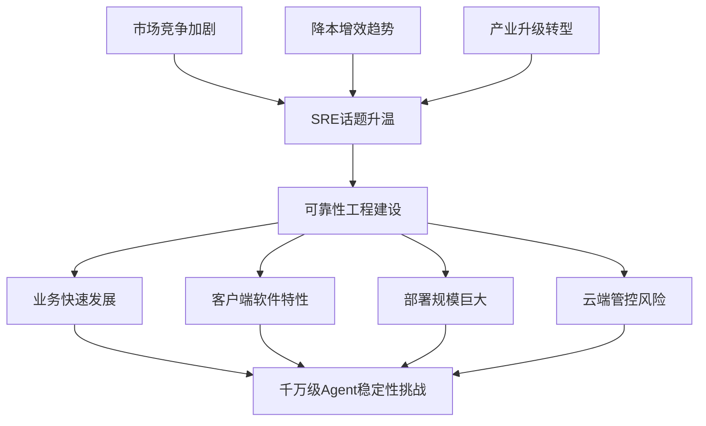

## 二、可靠性建设思考

### 2.1 三大核心原则

#### 原则一：质量第一，不可妥协
- **软件开发201原则第一讲**：无论如何定义软件质量，客户都不会接受低质量软件
- **避免短视行为**：因排期过紧而牺牲软件质量，看似政治正确，中长期看无异于自杀
- **ToB领域尤其重要**：质量第一是原则，没有妥协余地

#### 原则二：技术提效，而非降低质量
- **平衡而非妥协**：平衡交付时间和质量，但不等于降低质量
- **提效手段**：
  - 自动化手段
  - AI辅助
  - 流程优化
- **目标**：更高效率、更低成本保障软件质量

#### 原则三：高质量软件是设计出来的
- **前置质量保障**：后续阶段发现问题代价巨大
- **重视设计阶段**：在开发之前解决问题
- **设计优先**：避免返工和后期修复成本

### 2.2 Agent质量目标

#### 目标一：数据完整性
- 准确无误采集所有数据
- 即使出现上下游短暂故障或环境变化
- 故障恢复后继续上报期间数据

#### 目标二：稳定性
- 任何条件下持续工作
- 高负载、异常输入、异常配置下不崩溃
- 作为非核心业务采集器，不影响核心系统

#### 目标三：资源控制
- CPU、内存、磁盘、网络带宽保持在合理范围
- 不导致主程序崩溃或受影响

#### 目标四：实时性
- 及时处理数据，支持实时分析和决策
- 新功能通过性能测试，保证性能
- 老功能不发生意外性能退化

### 2.3 可靠性工程达成要素

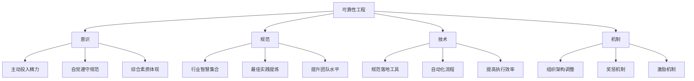

#### （1）意识
- 软件开发不仅是编程，还包括测试、沟通等
- 高质量软件开发是综合素质体现
- 良好意识驱动在设计、测试等阶段主动投入可靠性建设
- 自觉遵守规范制度

#### （2）规范
- 如同灯塔，凝聚行业智慧
- 最佳实践的提炼和总结
- 超越单个工程师的视野和水平
- 各环节制定规范，培训工程师提升水平

#### （3）技术
- 帮助规范落地的技术手段
- 自动化工具限制不符合规范的行为
- 提高流程流畅度和执行效率

#### （4）机制
- 确保规范和工具有效落实
- 组织架构调整
- 奖惩机制、激励机制
- 促使规范落地、工具有效使用
- 不断提高员工高质量建设意识

### 2.4 行业方法论积累

#### 开发规范
- **设计前置**：开发前进行设计
- **设计模板**：帮助工程师思考接口、测试等是否有遗漏
- **设计评审制度**：凝聚团队智慧，为设计完备性加保险

#### 编码规范
- 编码规范
- 分支合入规范
- 准入门槛设置

#### 测试规范
- **单元测试**：验证单个功能
- **功能测试**：验证功能正确性
- **集成测试**：验证模块间协作
- **回归测试**：验证整体软件正确性
- **环境兼容性测试**：保证各端兼容
- **安全测试**：新兴测试方法

#### 发布规范
- **变更规范**：规定发布时间
- **灰度发布**：控制故障风险
- **A/B测试**：验证新功能效果

#### 运维规范
- 工单处理规范
- 监控大盘建设模板
- 完备运维体系
- **故障定级**：分配处理资源，最短时间解决故障

#### 技术工具支撑
- **文档管理**：飞书、钉钉、语雀
- **CI/CD系统**：Git、云效等
- **监控工具**：Prometheus、Grafana等
- **灰度发布**：Sentinel、Istio等云原生工具
- **综合平台**：SREWorks等集成平台

## 三、iLogtail团队SRE实践

### 3.1 团队特点
- 团队规模：不到10人
- 工作范围：研发、发布、部分前端、运维、工单处理、文档撰写
- 核心目标：不断提高团队人效

### 3.2 SRE实践全景图

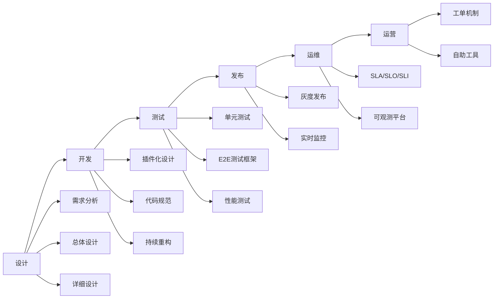

## 四、设计阶段实践

### 4.1 设计阶段划分

#### （1）需求分析
- 明确目标，做正确的事
- 将精力投入到正确的方向

#### （2）总体设计
- 模块划分
- 接口定义

#### （3）详细设计
- 算法设计
- 数据结构
- 测试用例等细节

### 4.2 典型案例：数据处理需求

**挑战**：数据处理需求千变万化，如何减少变更和版本发布？

**解决方案**：

#### 方案一：插件化设计
- 采集流水线插件化
- 不同采集插件可编排
- 通过插件组合完成绝大部分数据处理需求

#### 方案二：可编程化设计
- 流处理语言（SPL）
- 用户在插件中编写SPL脚本
- 完成复杂数据处理流程

**效果**：
- 极强的数据处理能力
- 覆盖千变万化的需求
- 减少变更动作，降低风险

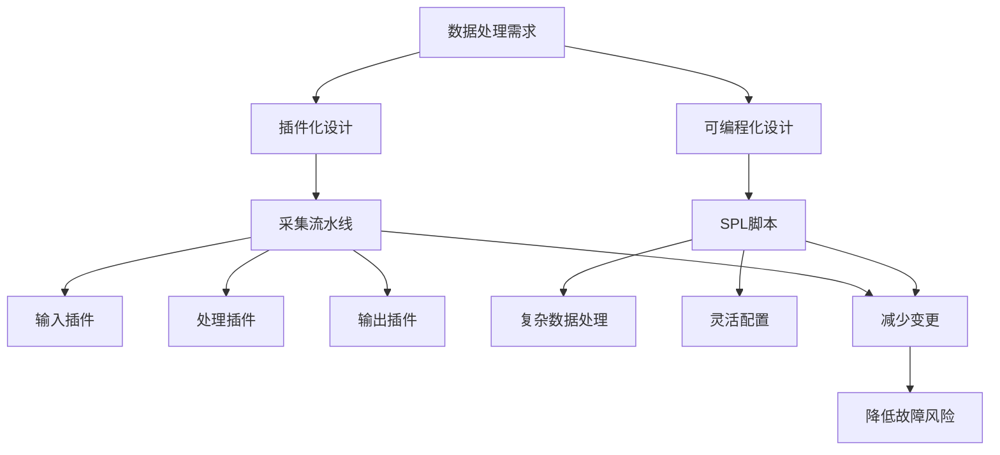

### 4.3 设计文档策略

- **简单需求**：不需要面面俱到，无需使用模板
- **复杂需求**：越吃不准的地方越要详细，问题拦截在源头

## 五、开发阶段实践

### 5.1 双版本分支策略

#### 开源版与商业版差异

| 维度 | 开源版 | 商业版 |
|------|--------|--------|
| 目标 | 功能开发 | 稳定性 |
| 节奏 | 敏捷开发 | 快速修复问题 |
| 要求 | 保证主干可用性 | 版本稳定性 |
| 分支模式 | 分支开发，主干合并和发布 | 版本分支，Bug Fix在分支上修复 |

#### 分支策略

**开源版**：
- 分支开发
- 主干合并和发布
- 随时可能被Fork，保证主干可用性

**商业版**：
- 从开源版合入代码后拉出版本分支
- Bug Fix在版本分支上修复
- 新功能不阻碍快速修复

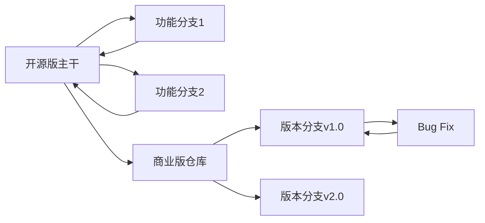

### 5.2 代码风格统一

**技术栈**：C++和Go双语言开发

**统一方案**：
- VS Code开发镜像内置
- 内置clang-format和gofmt工具
- 所有开发者使用相同开发镜像
- 自动保持代码风格一致

### 5.3 持续改进与重构

**增熵定律**：系统没有外力作用会随时间越来越混乱

**应对措施**：
- 必须不断对代码进行重构
- **iLogtail 1.0到2.0重构**：
  - 模块化和插件化
  - 从核心模块剥离组件
  - 运用设计模式减少代码重复度
  - 清理大量无用代码
  - 直接删除而非注释（有版本管理工具）

### 5.4 拥抱AI时代

- 使用通义灵码等AI工具
- 解决新语言特性不熟悉问题
- 提升代码效率

## 六、测试阶段实践

### 6.1 iLogtail测试痛点

#### 痛点一：功能多，参数组合庞大
- 功能繁多
- 参数组合呈指数级增长
- 难以全面测试

#### 痛点二：输入不受控
- 非预期输入
- 非法配置
- 容易产生问题

#### 痛点三：上下游依赖重
- 测试需要搭建上下游环境
- 环境搭建成本高

#### 痛点四：运行环境多样
- Linux、Windows
- 主机、容器
- 配置热加载
- 容器增删
- 运行时升级

#### 痛点五：双版本测试
- 开源版和商业版都需测试
- 测试工作量翻倍

### 6.2 测试方法综合运用

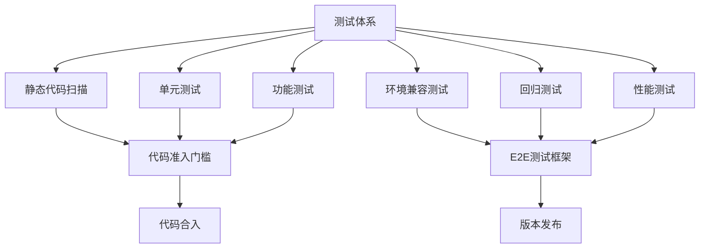

**准入门槛**（资源占用有限）：
- 静态代码扫描
- 单元测试
- 功能测试
- 通过后才能合入代码

**深度测试**（资源占用较大）：
- 环境兼容测试
- 回归测试
- 性能测试
- 基于E2E测试框架

### 6.3 单元测试实践

#### 解决参数多和输入不可控问题

**方法一：正交矩阵**
- 列出参数组合
- 完整覆盖测试
- 避免测试用例指数级爆炸

**方法二：构造非预期输入**
- 主动构造异常输入进行测试
- 社区帮助发现问题（如配置循环依赖）
- 发现后立即加入单元测试
- 保证类似问题不再发生

**特点**：
- 运行快速
- 不依赖外部环境
- 针对单个功能测试

### 6.4 E2E测试框架

#### 框架设计

针对上下游依赖、环境多样、环境动态变化等痛点，自研E2E测试框架。

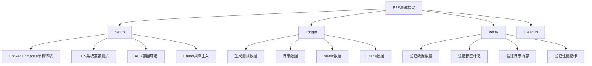

#### 四大组成部分

##### （1）Setup - 环境构建
- **单机环境**：Docker Compose生成容器和第三方依赖
- **系统兼容测试**：购买ECS，部署不同系统镜像
- **容器环境**：构建ACK环境
- **故障注入**：使用ChaosBlade模拟Kubernetes故障、磁盘故障、网络故障

##### （2）Trigger - 数据生成
- 生成测试数据
- 不同格式日志
- Metric数据
- Trace数据

##### （3）Verify - 结果验证
- 验证数据数量
- 验证标签标记是否正确
- 验证日志内容一致性
- 性能测试时验证CPU、内存指标和日志延迟

##### （4）Cleanup - 环境清理
- 清理测试环境
- 释放资源

#### 测试类型组合

**功能测试**：
- Setup：搭建下游组件
- 验证输出到下游的Flush功能

**环境兼容测试**：
- Setup：构建不同主机和容器环境
- 验证各系统运行正常

**回归测试**：
- Setup：组合各种配置和环境
- 模拟环境变化
- 异常注入
- 全面验证

### 6.5 精准测试策略

#### 问题：版本过多
- 操作系统版本众多
- JDK版本众多
- 探针框架小版本繁多
- 穷举测试不经济

#### 解决方案：精准测试

**策略**：
- 保证大版本测试
- 技术手段确保版本间兼容
- 只测试其中某一个版本即可
- 不兼容版本单独拉出测试

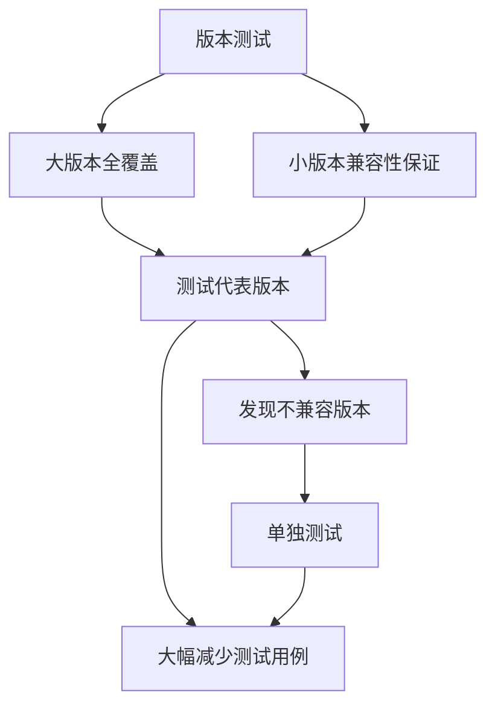

**效果**：
- 只测试部分版本
- 覆盖所有小版本
- 保证兼容性

### 6.6 准入和测试流程

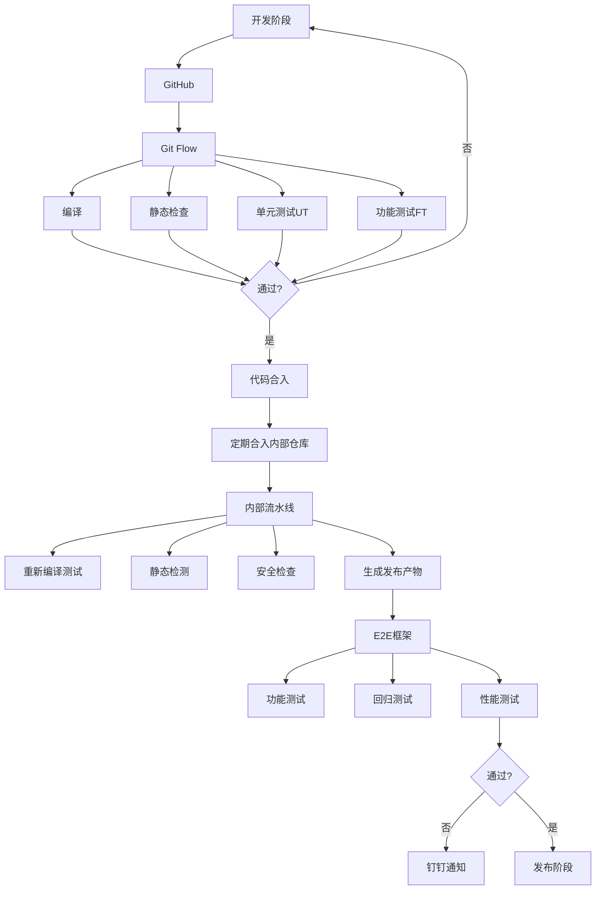

**流程说明**：

1. **GitHub开源仓库**：
   - Git Flow运行
   - 编译、静态检查
   - UT（单元测试）、FT（功能测试）
   - 作为合入门槛

2. **内部仓库**：
   - 定期从开源仓库合入
   - 包含商业版代码
   - 完全重走流程
   - 额外静态检测、安全检查
   - 生成发布产物

3. **E2E测试框架**：
   - 功能测试
   - 大规模回归测试
   - 性能测试
   - 发现问题自动钉钉通知

## 七、发布阶段实践

### 7.1 灰度发布的必要性

**墨菲定律**：软件一定会有Bug，迟早会发生故障

**应对策略**：通过灰度流程控制故障在有限范围内

### 7.2 灰度发布策略

#### 灰度维度

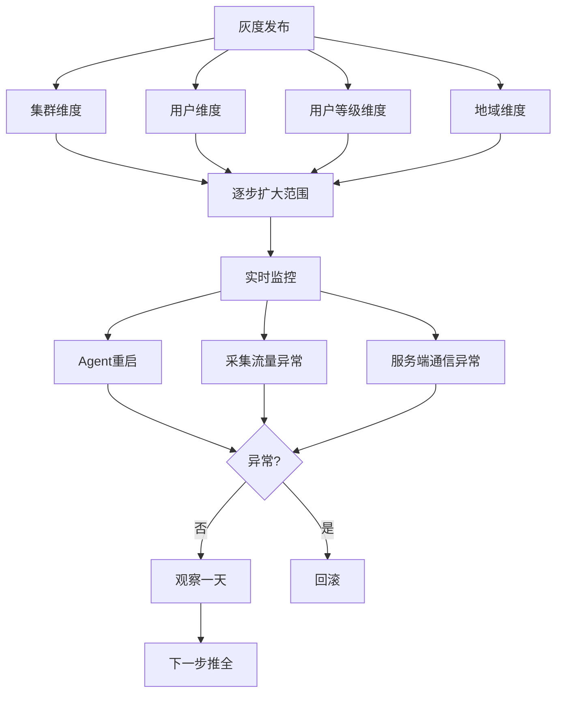

#### 监控指标
- Agent是否发生重启
- 采集流量是否异常
- 与服务端通信是否异常

#### 发布流程
1. 按维度灰度发布
2. 实时监控新版本Agent指标
3. 观察一天无问题
4. 进行下一步推全

### 7.3 灰度发布设计要点

**挑战**：
- 用户配置随时变化
- 机器部署发生变化
- 很多指标难以稳定监控

**解决方案**：
- 重点关注大客户
- 大客户部署相对稳定
- 按用户维度或用户分层维度灰度
- 针对性监控特定用户指标数据

## 八、运维阶段实践

### 8.1 SLA/SLO/SLI体系

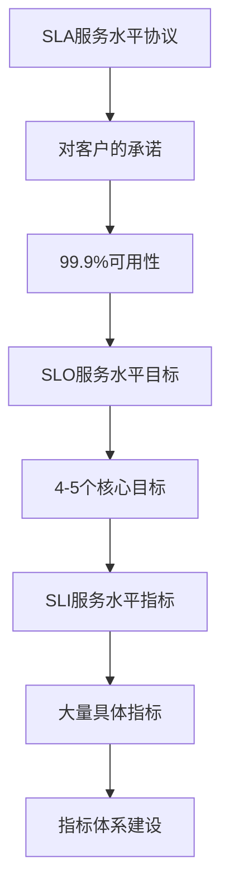

**关系**：
- **SLA**：对客户承诺（如99.9%）
- **SLO**：服务水平目标（4-5个）
- **SLI**：服务水平指标（大量具体指标）

### 8.2 监控体系五层模型

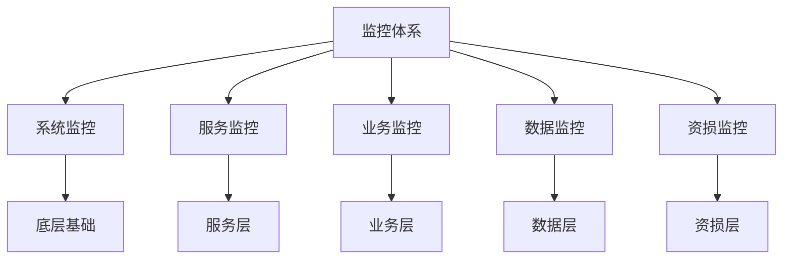

**五个维度**（从底层到业务层）：
1. **系统监控**：基础设施层
2. **服务监控**：服务健康度
3. **业务监控**：业务指标
4. **数据监控**：数据质量
5. **资损监控**：资金损失

### 8.3 自建可观测平台

**基于日志服务（SLS）能力**：
- 数据采集
- 实时计算
- 数据存储
- 查询能力
- 可视化
- 报警

**平台内容**：
- 稳定性大盘
- 重保用户大盘
- Agent稳定性监控
- 其他监控大盘

**优势**：
- 一站式平台
- 结合指标、日志、Trace
- 大幅提升问题排查效率

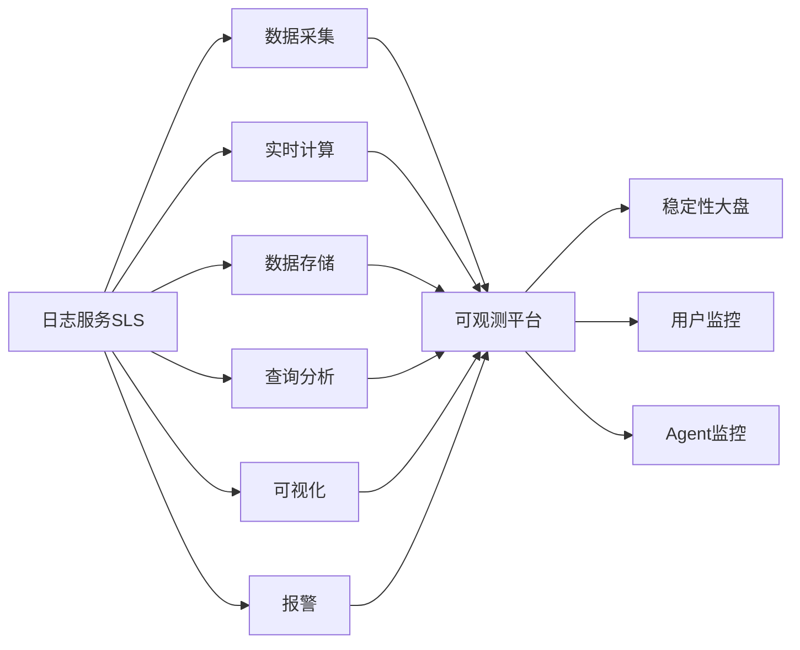

## 九、运营阶段实践

### 9.1 工单处理机制

#### 工单流转流程

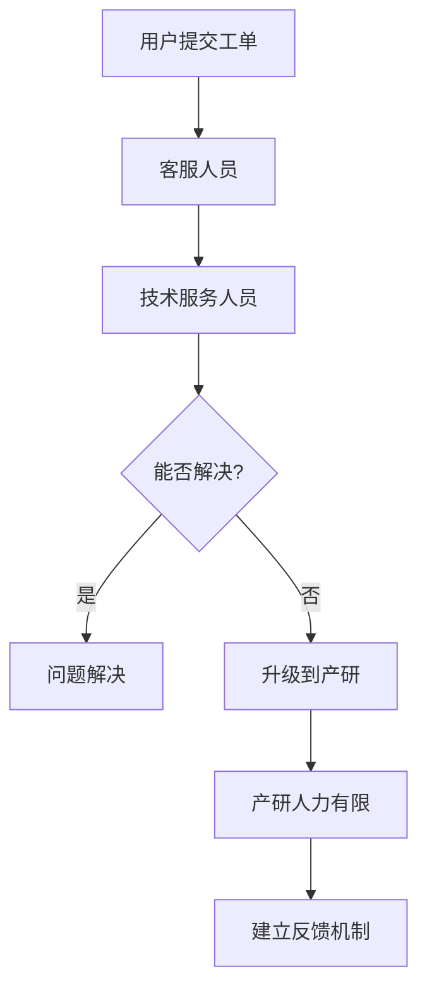

#### 反馈机制

**技术服务部反馈**：
- 最想知道的问题
- 需要的工具

**产研提供**：
- 技术支持
- 定期培训
- 提升技术服务能力

**共建内容**：
- 知识库
- 排查手册
- 工具使用指南
- 处理流程与规范
- 升级标准

### 9.2 自助排查工具

#### 工具一：CloudLens for SLS

**功能**：
- 客户端整体分布情况
- 各版本分布
- 重启次数统计
- 快速概览全局

**自助能力**：
- 端上错误信息直观展示
- 关键错误信息查看
- 关联最佳实践
- 关联排查手册
- 客户自行解决问题
- 减少工单

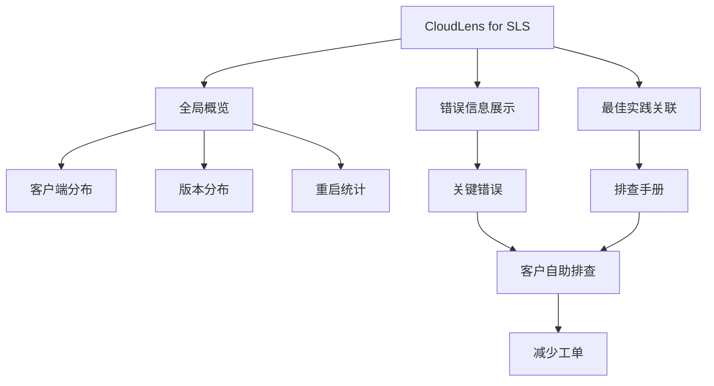

#### 工具二：容器原生性预览

**背景**：
- Kubernetes/Docker场景下配置问题占工单50%
- 容器筛选配置错误
- 路径配置错误
- 容器组名称和容器名称混淆

**功能**：
- 可视化显示配置匹配的容器
- 显示不匹配的容器
- 显示不匹配原因
- 用户自助解决配置问题

**效果**：
- 大幅减少配置类工单
- 提升用户体验

### 9.3 用户界面优化

#### 采集配置界面改版

**原有问题**：
- 配置相对复杂
- 大量参数配置咨询工单

**优化措施**：
- 相关功能聚合
- 分组使配置条理清晰
- 相关参数更加内聚
- 解开参数依赖
- 每个配置定义明确

**效果**：
- 整体接入效率提升30%
- 从源头解决工单问题

## 十、实践效果总结

### 10.1 完整闭环

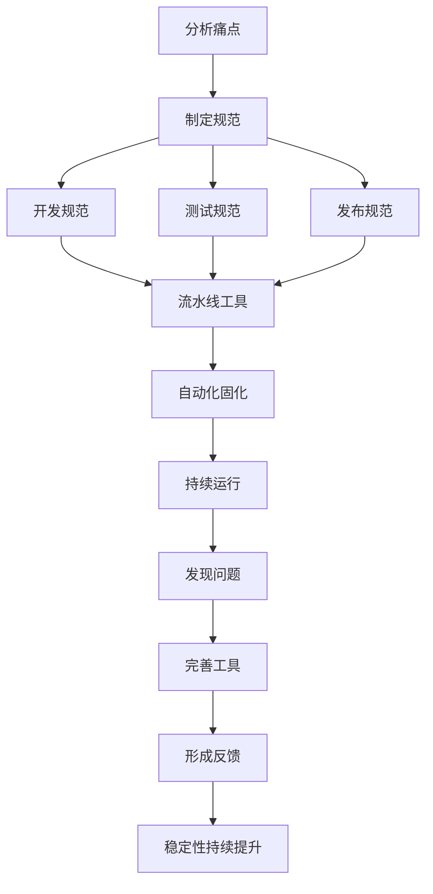

**闭环要素**：
1. 针对痛点制定规范
2. 通过流水线工具固化规范
3. 实现自动化
4. 持续发现问题
5. 不断完善工具
6. 形成反馈循环

### 10.2 量化效果

#### 质量提升
- ✅ **线上问题拦截率提升80%**
- ✅ **完全杜绝操作系统兼容性问题**

#### 运营效率
- ✅ **工单收敛30%**
- ✅ **心跳类工单收敛80%**
- ✅ **SLS Lens帮助大量客户自主排查问题**

#### 客户价值
- ✅ **大客户基于SLS能力构建自己的监控体系**
- ✅ **接入效率提升30%**

## 十一、未来展望

### 11.1 大模型应用

**期待**：
- 大模型广泛使用
- 可观测技术革命性变化
- AI辅助问题分析和决策

### 11.2 可观测数据优化

**目标**：
- 不断完善Agent可观测数据
- 为根因分析、大模型提供更好数据支持
- 减少故障定位时间

### 11.3 自动化接入

**目标**：
- 更自动化的接入流程
- 大幅降低数据接入门槛
- 避免人为配置错误
- 减少稳定性问题

### 11.4 全栈化运维能力

**目标**：
- 工具和人员具备全栈化运维能力
- 打通整条链路
- 为Lens、根因分析提供更好数据支持
- 端到端可观测性

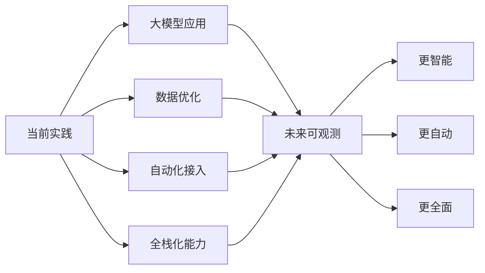

## 十二、核心要点总结

### 12.1 千万级Agent质量挑战

1. **业务快速发展**：需求多变、环境复杂
2. **客户端特性**：版本难收敛、未知因素多
3. **部署规模大**：影响面广、风险高
4. **云端管控**：便捷性与风险并存

### 12.2 提高软件质量的关键要素

1. **意识**：综合素质，主动投入
2. **规范**：行业智慧，最佳实践
3. **技术**：自动化工具，提高效率
4. **机制**：组织保障，激励落实

### 12.3 多种测试方法

1. **单元测试**：正交矩阵、异常输入
2. **E2E测试框架**：Setup、Trigger、Verify、Cleanup
3. **精准测试**：大版本全覆盖，小版本兼容性保证
4. **准入门槛**：静态检查、UT、FT
5. **深度测试**：环境兼容、回归、性能

### 12.4 灰度发布与监控策略

1. **灰度维度**：集群、用户、用户等级、地域
2. **监控指标**：重启、流量、通信
3. **发布流程**：灰度→监控→观察→推全
4. **设计要点**：关注大客户，针对性监控

## 十三、Q&A精选

### Q1：如何设计灰度发布策略？

**回答**：
- Agent配置和部署可能随时变化，很多指标难以稳定监控
- 重点关注大客户，其部署相对稳定
- 按用户维度或用户分层维度灰度
- 针对性监控特定用户指标数据

### Q2：业务迭代和质量控制矛盾如何平衡？

**回答**：
- 更倾向于质量控制
- 需求有优先级，保证核心功能交付
- 次要功能可延后交付
- 重要功能质量不可妥协
- 次要功能可标记为Beta版，设定客户预期
- 通过技术手段提效

### Q3：如何支持业务快速发展同时保持稳定性？

**回答**：
- 关键在于设计阶段投入
- 每个设计都要想清楚
- 避免过于定制化，保证可演进性
- 设计无法覆盖所有问题
- 需要大量精力写测试、跑回归

### Q4：云管平台监控Agent对被监控对象有什么影响？

**回答**：
- **日志和指标采集**：影响微乎其微
- **已知问题**：Page Cache影响（已修复）
  - K8s环境采集容器日志
  - Page Cache被记入业务容器内存
  - 看起来像内存泄漏
- **Java探针/eBPF**：有一定影响
  - 主要体现在CPU开销
  - 测试表明影响不大，约0.1核

---

**分享总结**：本次分享系统介绍了阿里云iLogtail团队在千万级Agent可靠性工程方面的实践经验，从设计、开发、测试、发布到运维运营全流程，展示了如何通过规范、技术、机制的结合，实现高质量软件的持续交付和稳定运行。核心理念是质量第一、技术提效、设计前置，通过自动化和工具化固化最佳实践，形成持续改进的良性循环。
