# 平安银行分布式单元化架构的运维实战

> 来源：未核验 · 类型：分享 · 状态：draft · 原始线索：分享人 李宗元-平安银行数据库团队


> 分享人：李宗元 - 平安银行数据库团队  
> 议题类型：SRE运维实践  
> 核心系统：信用卡A+系统（国内首个从大型机到分布式架构转型的银行核心系统）

## 一、项目背景与建设目标

### 1.1 信用卡A+系统概述

平安银行信用卡A+系统作为银行的AAA+级核心系统，于2010年左右上线，基于传统的IOE架构（IBM大型机、Oracle数据库、EMC存储）建设。经过十余年的发展，传统架构逐渐成为业务发展的瓶颈。

**项目时间线：**
- **2018年10月-12月**：启动新系统建设项目
- **2020年10月底**：顺利上线投产
- **2021年至今**：已稳定运行一年，经历双十一、618、春节等大促考验

### 1.2 建设目标

项目建设围绕六大核心目标展开：

1. **发卡量突破**：支撑更大规模的用户增长
2. **服务与风控能力提升**：增强业务服务和风险控制能力
3. **自主可控**：摆脱对国外厂商的依赖
4. **快速创新**：提升业务需求响应速度
5. **性能提升**：满足高并发、低延迟要求
6. **成本优化**：降低整体TCO（总拥有成本）

## 二、分布式单元化架构设计

### 2.1 单元化架构核心理念

单元化架构是将业务拆分成若干个小的独立模块（单元），每个单元采用**两地三中心**部署，单元内部独立完成全部或大部分业务逻辑。

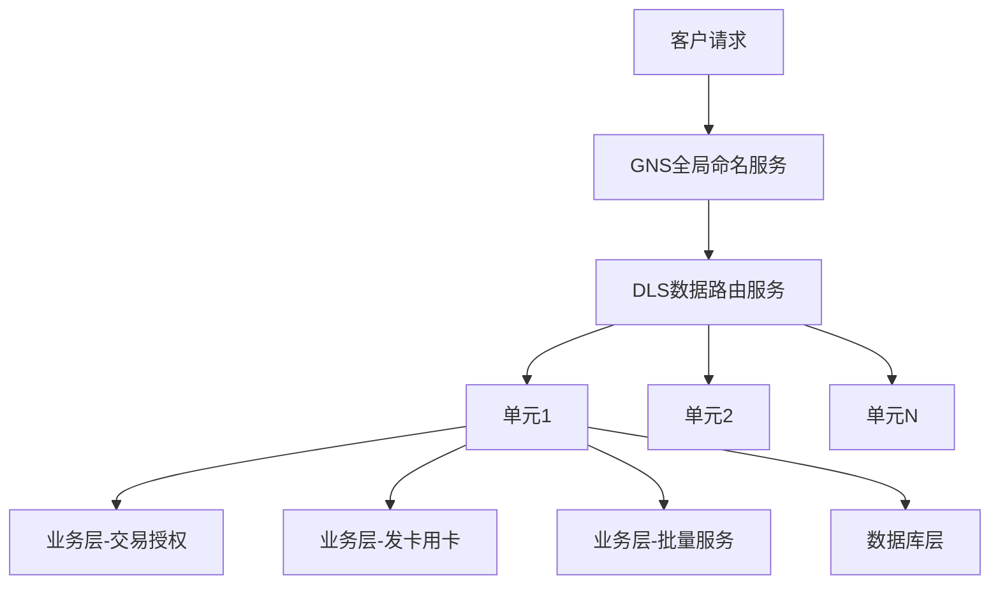

### 2.2 分片设计逻辑

**客户维度三要素：**
- 客户号
- 账号
- 卡号

**分片流程：**


**关键特性：**
- 支持权重设置，便于后续扩缩容
- 单元内业务自包含
- 分片信息由GNS（全局命名服务）统一管理
- DLS（数据路由服务）负责业务层访问路由

### 2.3 数据同步与分析架构

针对分析类和聚合查询需求，设计了两层数据同步架构：

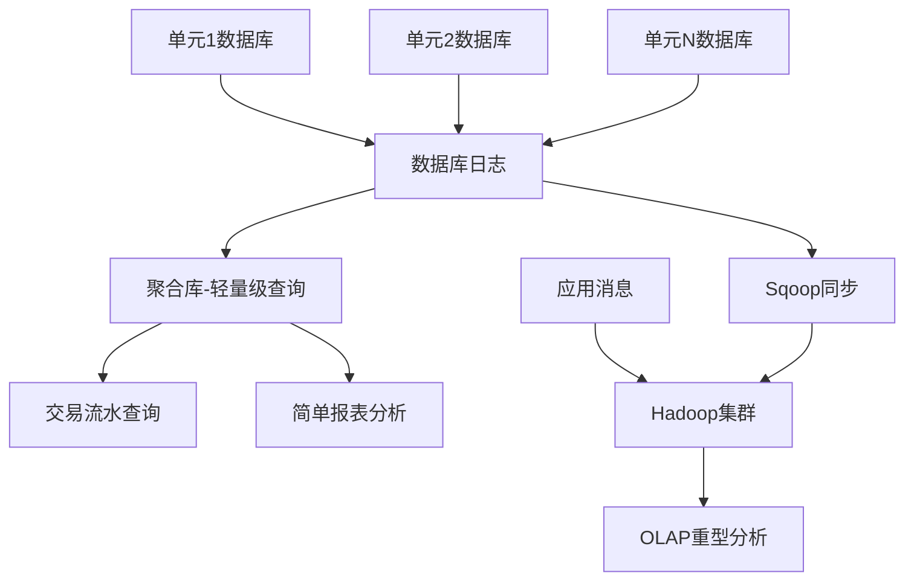

**两层架构说明：**

1. **聚合库层**（轻量级查询）
   - 通过数据库日志全量/增量同步
   - 支持交易流水明细查询
   - 支持简单报表分析

2. **大数据平台层**（重型分析）
   - 通过Sqoop同步数据库数据
   - 通过消息队列同步应用数据
   - 在Hadoop集群进行复杂OLAP分析

## 三、自动化运维体系建设

### 3.1 两地三中心部署架构

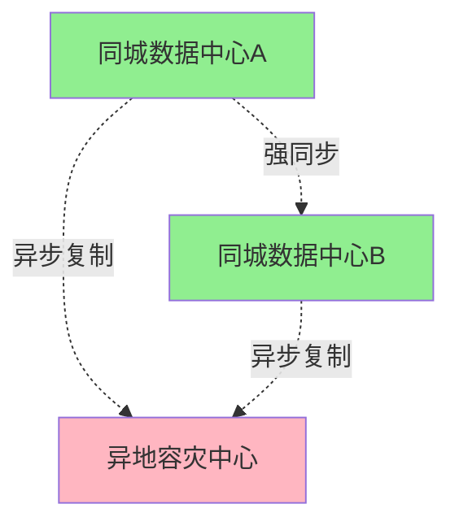

**高可用指标：**

| 指标类型 | 同城 | 异地 |
|---------|------|------|
| **复制模式** | 强同步 | 异步复制 |
| **RPO** | 0（零数据丢失） | 约2-5分钟（日常）<br>30分钟（极限压测） |
| **RTO** | 30-40秒（正常）<br>90秒（极端情况） | 按需切换 |
| **切换方式** | 一键自动切换 | 手动切换 |

**聚合库策略：**
- 数据可再生，SLA要求相对较低
- 无需高可用部署
- 异常时可快速在其他位置重建

### 3.2 分布式运维的挑战与应对

#### 运维复杂度对比

| 架构类型 | 运维特点 | 难度系数 |
|---------|---------|---------|
| **集中式架构** | 如同"放牛"，一个人甚至一个小孩就能管理 | ⭐⭐ |
| **分布式架构** | 如同"赶鸭子"，节点数量激增，需要自动化工具 | ⭐⭐⭐⭐⭐ |

**故障频率变化：**
- **传统大型机**：一年基本不出问题
- **分布式架构**：每月约1-2台服务器出现故障

#### 运维四大基石

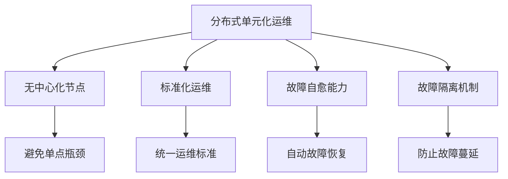

### 3.3 自动化运维工具体系

#### 3.3.1 查询工具

**核心功能：**
- ✅ 单个分片查询
- ✅ 多个/全量分片查询
- ✅ 基于客户信息定位所属单元
- ✅ 数据脱敏（非业务人员查询自动脱敏）
- ✅ 防误操作设置

**使用场景：**
```
应用问题 → 获取流水号/客户号 → 查询工具定位单元 → 快速排查
```

#### 3.3.2 发布工具

**发布流程：**

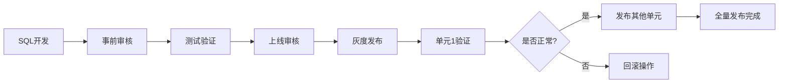

**关键特性：**

1. **双重审核机制**
   - 事前审核：开发/测试阶段的规范检查
   - 上线审核：风险识别与控制

2. **灰度发布策略**
   - 先发布部分单元验证
   - 验证通过后再全量发布
   - 最小化故障影响范围

3. **DML脚本管理**
   - 自动备份
   - 异常判断
   - 一键回滚能力

#### 3.3.3 数据比对工具

**比对维度：**
- 表结构一致性
- 索引结构一致性
- 环境间差异检测（生产/测试/开发）
- 单元间差异检测

**告警机制：**
- 发现不一致自动告警
- 防止漏发或发布失败

#### 3.3.4 容量管理工具

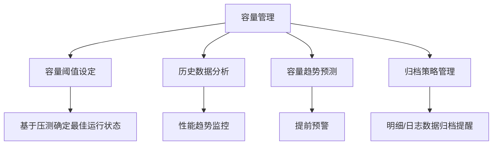

#### 3.3.5 DBA自动化运维工具

**核心能力：**

1. **主备同步切换**
   - 自动切换
   - 一键手动切换

2. **流量管理**
   - 集群化部署的负载均衡
   - 故障自动隔离
   - 快速扩容能力（应对促销活动）

3. **强同步模式切换**

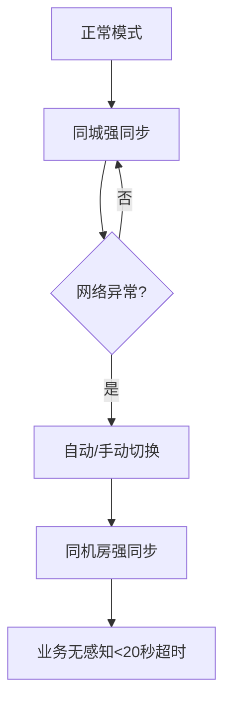

**切换场景：**
- 同城IDC间网络故障（如光纤被挖断）
- 主动切换：业务无感知
- 被动切换：约20秒超时

4. **一键扩容**
   - 应对突发流量
   - 快速增加计算资源

5. **多源数据同步管理**
   - 单元数据同步到分布式数据库
   - 一键故障处理
   - 一键异常恢复

6. **容灾演练**
   - 已完成两轮演练
   - 第一轮：2小时
   - 第二轮：全天演练
   - 基本无需人工干预

### 3.4 稳定运行的两大基石

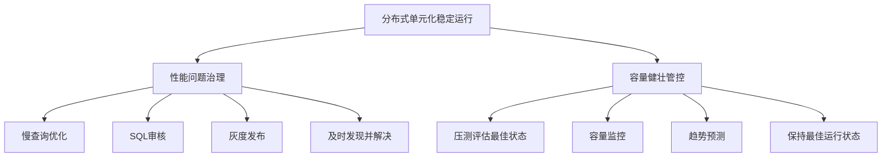

**关键策略：**

1. **性能问题防范**
   - 单元内的性能问题容易蔓延到所有单元
   - 通过审核和灰度发布提前发现
   - 及时解决避免全网影响

2. **容量健壮管控**
   - 上线前压测确定最佳运行状态
   - 持续监控保持在最佳状态
   - 系统运行完全可控

### 3.5 运维能力总结

通过工具体系实现三大能力：

| 能力维度 | 实现方式 | 效果 |
|---------|---------|------|
| **风险管控** | 查询工具 + 发布工具 + 数据比对 | 一致性运维 |
| **高效运行** | 容量管控平台 | 系统保持最佳状态 |
| **经验屏蔽** | DBA自动化工具 | 降低对个人经验依赖，快速故障恢复 |

**核心价值：**
- 访问一个数据库 = 访问全部数据库
- 管控一个数据库 = 管控全部数据库
- 故障处理无需或仅需简单判断即可快速恢复

## 四、弹性扩容策略

### 4.1 扩容方向

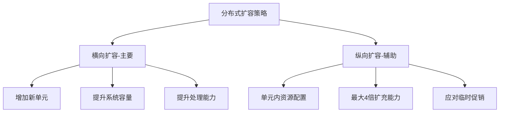

### 4.2 纵向扩容能力

**设计思路：**
- 初始单元使用 **1/4 服务器资源**
- 预留 **4倍纵向扩容空间**
- 通过增加节点和配置提升单个单元资源

**适用场景：**
- 临时促销活动
- 交易量短期提升
- 快速响应需求

### 4.3 单元容量管理原则

**核心原则：** 既然做了分布式，每个单元容量应在规划范围内，**尽可能不突破**。

#### 以防为主策略

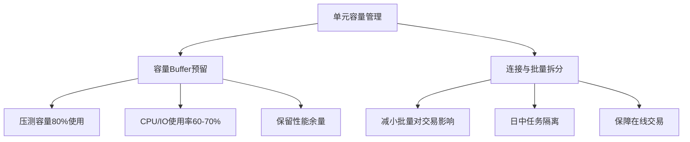

**Buffer预留示例：**
- 压测单元可存500万账户
- 实际使用约400万（80%）
- 批量期间资源使用率控制在60-70%

#### 以治为辅策略

1. **硬件升级**
   - 采用更高配置服务器
   - 结合纵向扩容能力
   - 提供4倍扩容空间

2. **存量数据迁移**
   - 具备迁移能力
   - 但应尽量避免使用
   - 仅作为最后手段

### 4.4 横向扩容流程


**关键特性：**
- ✅ 无需存量数据迁移
- ✅ 无需停机维护
- ✅ 增量客户按比例分配到新单元
- ✅ 业务无感知

## 五、单元化架构优缺点分析

### 5.1 三大核心优势

#### 优势一：高可用性提升

**可用性对比：**

| 架构类型 | 可用性 | 说明 |
|---------|-------|------|
| **传统IBM大型机** | 4个9（99.99%） | 故障少但解决时间长 |
| **分布式单元化** | 5个9（99.999%） | 故障自愈能力强 |

**实现路径：**

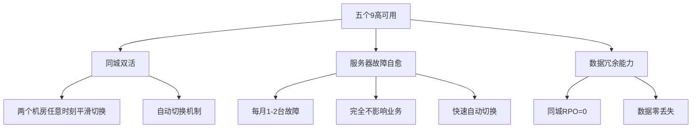

#### 优势二：技术自主可控

**自主可控层次：**

1. **基础设施层**
   - 去除IOE设备
   - 使用国产服务器

2. **数据库与中间件层**
   - 采用国产数据库
   - 应用自研或开源组件

3. **业务层**
   - **最大收益**：需求快速交付
   - **传统架构**：国外厂商需求响应3-6个月
   - **新架构**：业务需求可快速开发交付

#### 优势三：横向扩展能力


**实战验证：**
- ✅ 双十一
- ✅ 618
- ✅ 春节
- ✅ 元旦
- 系统可无人值守稳定运行

### 5.2 三大主要弊端

#### 弊端一：应用改造工作量大

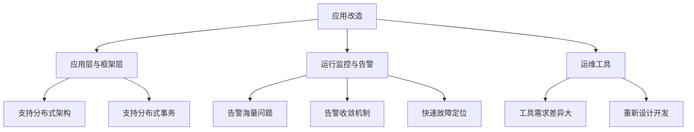

**上线初期痛点：**
- 公共组件告警海量级
- 告警淹没真实问题
- 需要优化告警收敛机制
- 快速诊断异常组件

#### 弊端二：过度单元化问题

**两种过度场景：**

1. **上下游业务不均衡导致的被动单元化**

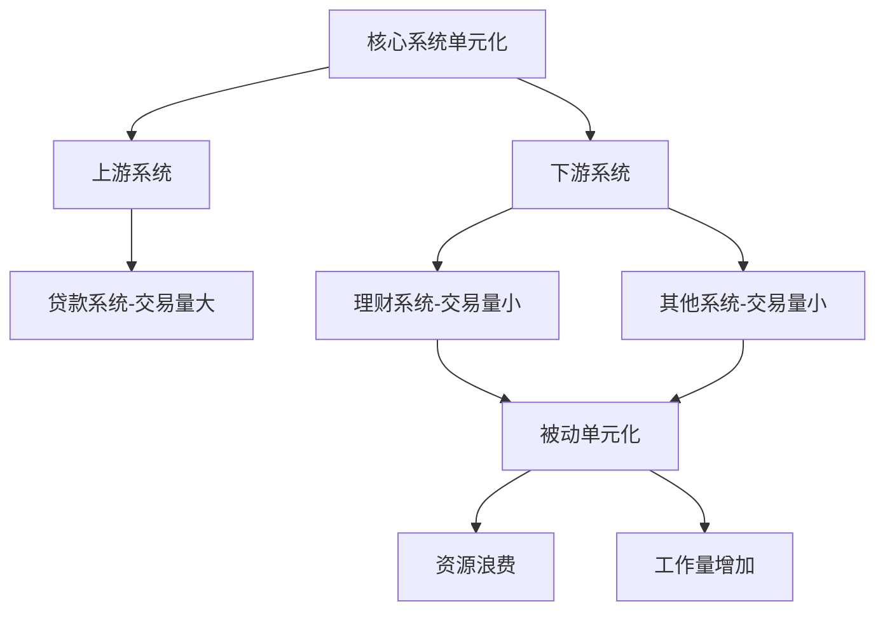

2. **数据库与应用层数量激增**
   - 资源使用率保证难度增加
   - 高可用保障复杂度提升
   - 高性能维护挑战增大

#### 弊端三：单元化失控风险（最危险）

**失控表现：**

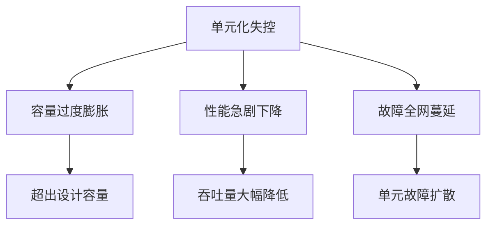

**管控措施：**
- ✅ 严格控制单元容量
- ✅ 监控性能和吞吐量
- ✅ 故障隔离机制
- ✅ 防止故障蔓延

## 六、单元化架构关键要素

### 6.1 四大关键要素

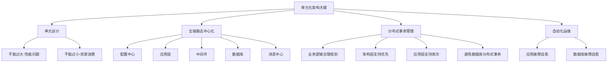

### 6.2 分布式事务处理原则

**优先级排序：**

1. **最优**：业务逻辑规划避免分布式事务
2. **次优**：架构层支持分布式事务
3. **可选**：应用层支持分布式事务
4. **避免**：数据库层分布式事务

**原因分析：**
- 国产数据库分布式事务尚不成熟
- 使用数据库分布式事务会强依赖特定数据库
- 降低架构灵活性

### 6.3 自动化运维的灵魂地位

**核心能力要求：**

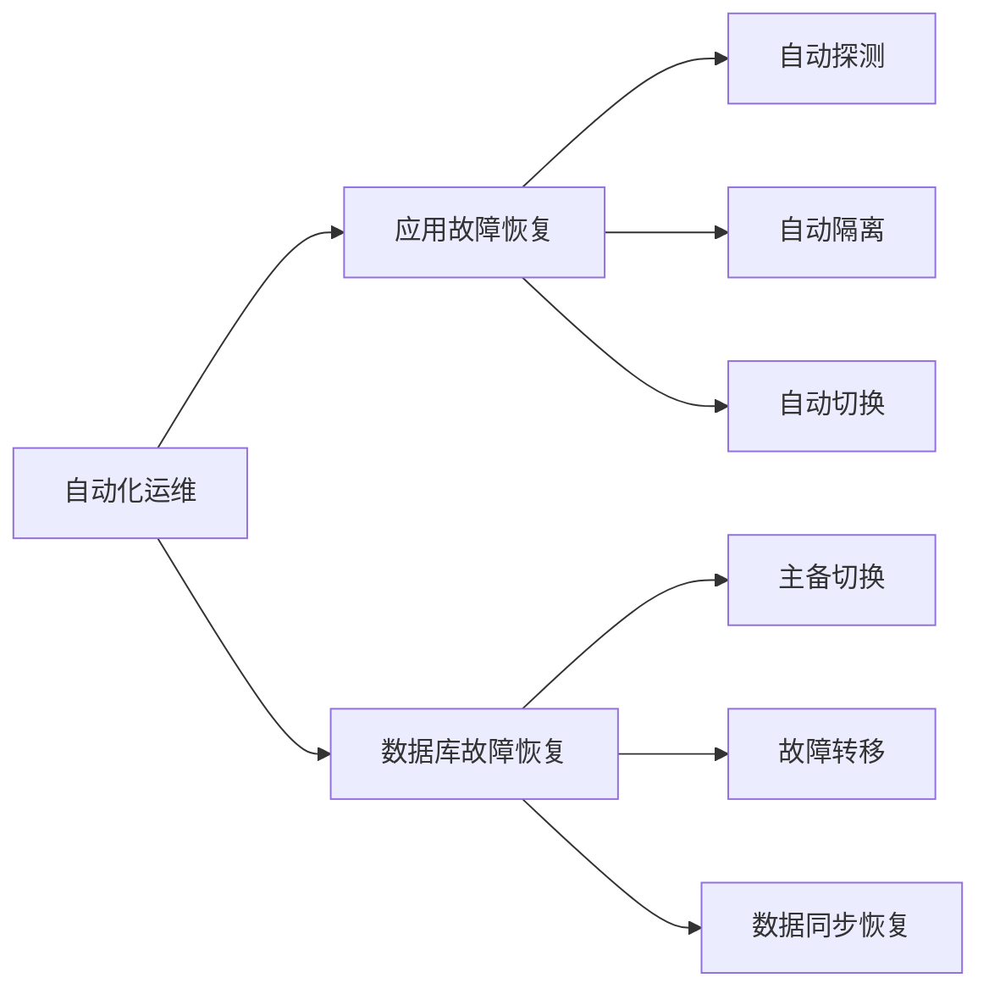

## 七、单元化适用场景

### 7.1 三大适用场景

#### 场景一：基于维度拆分

**拆分维度示例：**
- 客户维度（如平安银行信用卡系统）
- 交易信息维度
- 账户维度

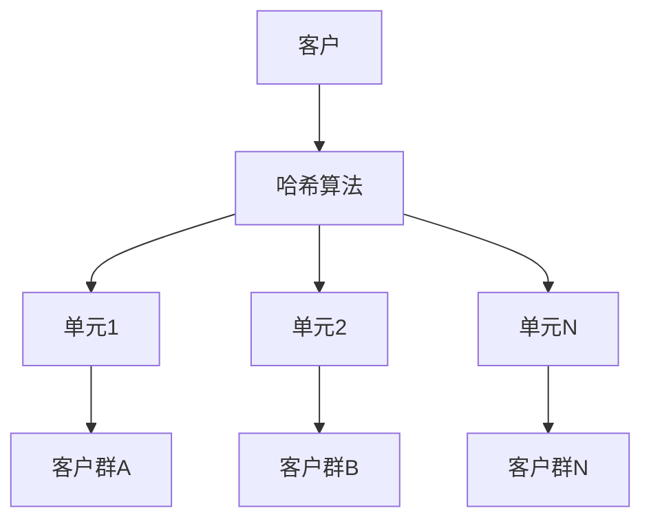

#### 场景二：地域或子公司拆分

**案例：** 中国银行采用此架构

```mermaid
graph TD
    A[总行] --> B[华东区域]
    A --> C[华南区域]
    A --> D[华北区域]
    A --> E[西南区域]
    
    B --> F[单元集群1]
    C --> G[单元集群2]
    D --> H[单元集群3]
    E --> I[单元集群4]
```

#### 场景三：业务自包含

**关键要求：**
- ✅ 单元内业务逻辑完整
- ✅ 单元间容量均衡
- ✅ 单元间性能均衡
- ✅ 避免个别单元过大或过小

### 7.2 适用性评估

**适合单元化的特征：**

| 评估维度 | 要求 |
|---------|------|
| **业务特性** | 可按维度清晰拆分 |
| **数据特性** | 数据关联性低，易于隔离 |
| **容量特性** | 各单元容量可均衡分布 |
| **业务逻辑** | 单元内可自包含完成 |
| **扩展需求** | 有明确的容量增长需求 |

## 八、总结与展望

### 8.1 核心成果

平安银行信用卡A+系统作为**国内首个从大型机到分布式架构转型的银行核心系统**，成功实现了：

1. **可用性飞跃**：从4个9提升到5个9
2. **技术自主**：实现全栈国产化替代
3. **弹性扩展**：具备理论无限扩展能力
4. **成本优化**：大幅降低TCO
5. **快速创新**：业务需求响应速度大幅提升

### 8.2 关键经验

```mermaid
graph TD
    A[单元化成功要素] --> B[合理的单元设计]
    A --> C[完善的自动化运维]
    A --> D[严格的容量管控]
    A --> E[有效的故障隔离]
    
    B --> F[避免过大过小]
    C --> G[降低人工依赖]
    D --> H[保持最佳状态]
    E --> I[防止故障蔓延]
```

### 8.3 运维实践价值

**对SRE的启示：**

1. **思维转变**：从"放牛"到"赶鸭子"，需要工具化、自动化
2. **能力建设**：自动化运维是分布式架构的灵魂
3. **风险管控**：通过工具和流程管控风险，而非依赖个人经验
4. **持续优化**：容量管理、性能优化需要持续关注

**运维能力进化：**

| 传统运维 | 分布式运维 |
|---------|-----------|
| 依赖个人经验 | 依赖自动化工具 |
| 手工操作为主 | 自动化为主 |
| 故障响应慢 | 故障自愈快 |
| 难以规模化 | 可线性扩展 |

### 8.4 未来展望

随着银行业数字化转型深入，单元化架构将成为核心系统改造的重要趋势。关键在于：

- 🎯 合理评估业务适用性
- 🎯 做好充分的技术准备
- 🎯 建设完善的自动化运维体系
- 🎯 持续优化和演进

---

> **议题要点回顾：**
> 1. ✅ 深入拆解了单元化架构的优缺点和痛难点
> 2. ✅ 剖析了银行业单元化架构的适用场景和典型问题规避
> 3. ✅ 基于平安银行实战案例，分享了分布式单元化架构下的运维实践

**分享人：** 李宗元 - 平安银行数据库团队  
**整理时间：** 2021年  
**系统状态：** 已稳定运行一年，成功经历多次大促考验


