# 平安银行容灾切换平台建设的探索与实践

> 来源：未核验 · 类型：分享 · 状态：draft

## 一、背景介绍

### 1.1 项目背景

平安银行从2020年开始建设覆盖所有关键业务的容灾切换平台相关工具体系。本次分享主要从以下五个方向展开:

- 容灾切换平台建设背景
- 方案设计过程中的思考
- 预案一键切换能力
- 运行可观测性
- 演练线上化
- 平台上线后对业务连续性能力的影响

### 1.2 业务连续性的重要性

在银行业,业务连续性是一个非常重要的领域:

- **资金损失风险**: 业务系统大规模中断会产生资金损失
- **品牌形象影响**: 影响公司形象和客户信任
- **民生影响**: 金融系统与老百姓生活紧密相关(转账、支付等)
- **监管要求**: 监管机构高度重视,定期开展巡检

因此,很多银行都建立了**两地三中心**的容灾能力。

### 1.3 现状与挑战

虽然很多银行具备了基础架构层面的容灾能力,但在实际故障场景中,通过同城切换来实现故障恢复的案例非常少。主要原因包括:

#### 问题1: 容灾能力与实战能力的差距

- **环境不一致**: 生产机房与同城机房可能存在部署环境或配置不一致
- **预案维护滞后**: 架构变化快,预案新鲜度和准确度不够
- **演练覆盖度低**: 演练本身生产风险高,覆盖度不足
- **有效性验证缺失**: 对预案、流程、人员操作的有效性缺乏验证

**结论**: 有了容灾基础能力,距离"随时能切、想切就切"的实战能力还有距离。

#### 问题2: 业务场景快速切换能力

业务场景切换过程分为三个阶段:

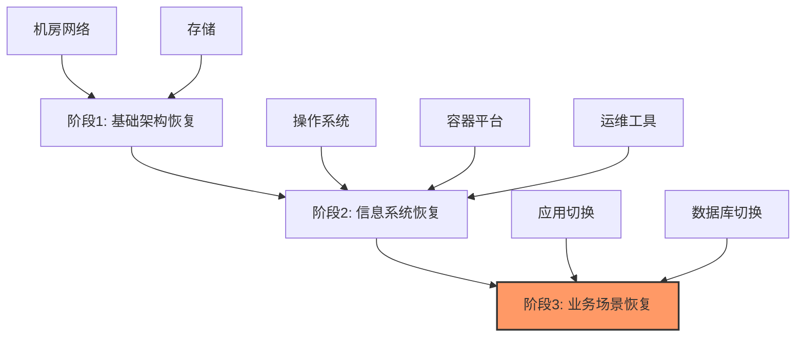

**挑战**:
- 阶段3(业务场景恢复)耗时最久
- 切换对象数量多
- 业务场景与应用数据库关系复杂
- 预案维护成本高
- 预案不准确导致故障恢复时长增加

**解决方案**:
- 定期梳理全行业务,识别关键业务(故障后产生大量客诉或重大资金损失)
- 不对所有业务建设双活(成本考虑)
- 梳理关键业务的业务场景
- 识别业务场景依赖的子系统
- 通过子系统切换实现业务场景快速恢复

## 二、方案设计思考

### 2.1 IT架构层次

银行IT架构分为三个层次:

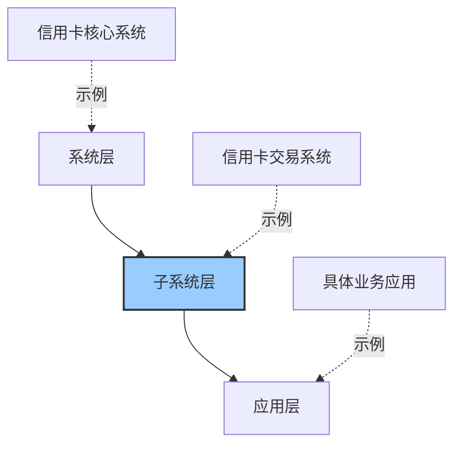

- **系统**: 如信用卡核心系统
- **子系统**: 实现特定业务功能,如信用卡交易系统
- **应用**: 实现特定业务逻辑

### 2.2 选择子系统作为容灾最小单位

**为什么选择子系统?**

#### 管理层面考虑:

1. **业务关联性强**: 子系统实现特定业务功能,容易与业务场景建立联系
2. **人员配套完善**: 已有子系统开发负责人、运维负责人、架构负责人
3. **规模可控**: 子系统数量约几百个,相比应用(几千个)维护成本可控

#### 架构层面考虑:

1. **架构管理单位**: 子系统是架构管理的基本单位,定期评估IT架构和高可用能力
2. **流量入口明确**: 子系统间访问有明确流量入口,实现高内聚、松耦合
3. **数据库独立**: 避免共库,子系统独立使用数据库
4. **故障隔离**: 天然具备故障隔离能力,如泳池泳道,彼此独立

### 2.3 子系统切换架构

子系统切换需要将故障机房的服务全部拉出,将流量和服务切换到正常的同城机房。

#### 完成改造的子系统服务分为三层:

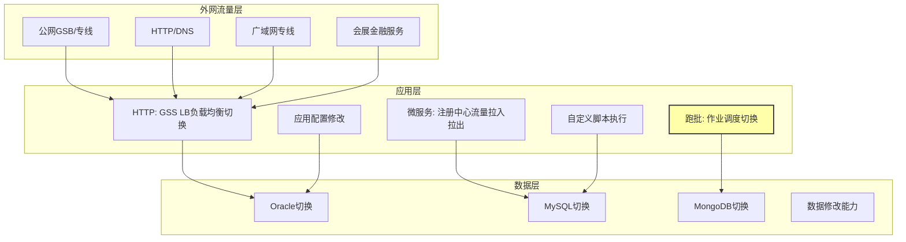

**特殊说明 - 跑批系统**:
- 银行特有的服务模式
- 晚上对当天交易进行复核
- 跑批结果直接影响第二天能否开门营业
- 需要对作业调度机制进行切换控制

#### 灵活切换能力

针对非标系统(双活改造成本高或老旧外购系统),提供更灵活的切换能力:

- 应用配置修改
- 虚机上执行自定义脚本
- 数据库层面数据修改
- 提高应急切换效率

## 三、核心能力建设

### 3.1 预案一键切换能力

#### 3.1.1 原子预案设计

**原子预案定义**: 每一个类型的切换称为一个原子预案。

**预案编排模式**:

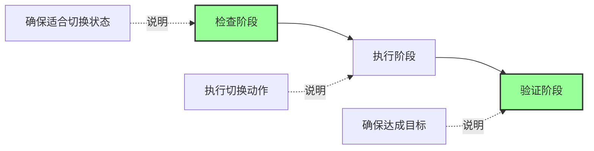

**能力提供方式**:
- 具体能力由平台架构、数据库团队、技术架构团队的自动化系统提供
- 切换平台通过HTTP方式进行快速编排
- 检查-执行-验证模式让切换更标准化、更安全

**切换与回切**:
- **切换**: 从双活变为单活
- **回切**: 故障恢复后,从单活恢复到双活
- 回切也需要检查-执行-验证的编排

**预案评审**:
- 原子预案风险大(如Oracle切换)
- 预案发布前需要领域专家评估、评审、测试
- 确保预案效果和安全性

#### 3.1.2 子系统预案编排

**四大关键能力**:

1. **故障场景区分**
   - 预案包含应用、数据库、网络操作
   - 根据故障场景(如单机房发布异常)只执行相关切换动作
   - 降低切换范围

2. **串并行编排**
   - 默认并行切换提升效率(切换对象独立)
   - 支持串行依赖(如有状态系统需先关闭流量)
   - 提供串并行结合的编排能力

3. **架构变化感知**
   - 工具捕获架构变化
   - 同步信息给预案维护人
   - 实时更新预案,避免预案滞后

4. **预案状态管理**
   - 预案维护后处于"未验证"状态
   - 完成演练后变为"安全有效"状态
   - 未演练预案会提示切换风险

#### 3.1.3 业务场景编排

基于子系统预案能力,业务场景编排相对简单:

- 明确业务场景包含的子系统
- 编排切换顺序(如有优先级或依赖要求)
- 提供预案执行看板:
  - 切换耗时
  - 执行成功与否
  - 各类组件切换进度和状态
- 支持下钻查看报错原因
- 自助问题解决(运维、DBA、演练执行人)

### 3.2 工具高可用性设计

**工具可用性要求高于业务系统**: 故障时需要通过工具恢复业务,工具不能同时故障。

#### 3.2.1 三地部署架构

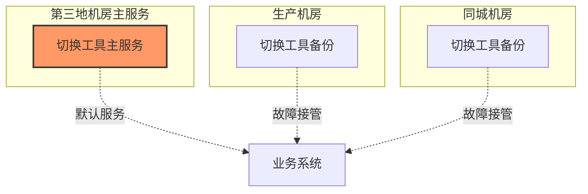

**优势**: 同城和生产机房出现问题时,第三地工具无需切换,快速接管服务。

#### 3.2.2 依赖管理

**强依赖/关键依赖**:
- 切换工具核心能力的依赖
- 定期进行容灾切换演练
- 故障时不能出现问题

**弱依赖**:
- 登录、可观测性、流程能力
- 通过故障注入或主动降级进行演练
- 确保弱依赖故障时核心切换功能不受影响

#### 3.2.3 性能管理

**原子预案性能测试**:
- 上线前提供性能测试基准
- 明确并行度
- 明确对应并行度下的SLA
- 工具进行流控,保证切换稳定性

### 3.3 运行可观测性

#### 3.3.1 切换成功标准

**演练切换成功标准**:
- 业务关键指标无明显波动
- 目标机房承载100%生产流量
- 应用层和基础层服务能力满足SLA要求

#### 3.3.2 信息汇聚能力

为演练实施人提供信息汇聚:

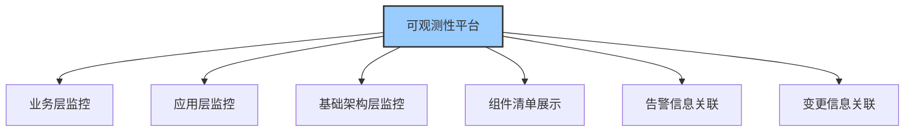

**分层展示**:
- 正常情况: 只看服务清单和状态
- 异常情况: 下钻查看关系、部署信息、告警、变更

#### 3.3.3 运维数据中台

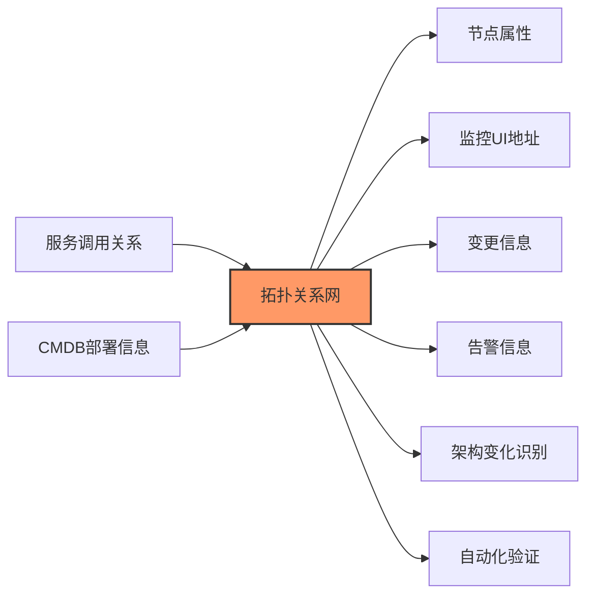

**能力支撑**:
- 识别架构变化
- 自动化验证切换目标达成
- 提供可观测性数据服务

### 3.4 演练线上化

#### 3.4.1 演练的必要性

有了一键切换和可观测性能力,还需要通过演练达到实战能力:

- 验证人员有效性
- 验证预案有效性
- 验证流程有效性
- 锻炼能力
- 解决问题

**演练定位**: 子系统层面的中高风险生产变更。

#### 3.4.2 方案层面风险控制

**工具化风险识别**:

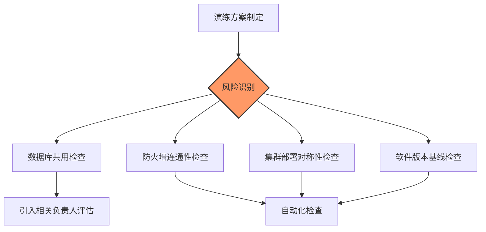

**风险控制措施**:
- 识别数据库共用,引入相关系统负责人共同评估
- 工具自动检查防火墙连通性
- 巡检集群部署信息对称性
- 检查软件架构/框架版本是否符合基线

#### 3.4.3 流程控制层面

**完整流程的价值**:
- 降低演练风险
- 提升演练质量
- 演练报告填写促进复盘
- 问题管理流程跟进持续解决

**流程线上化改造**:

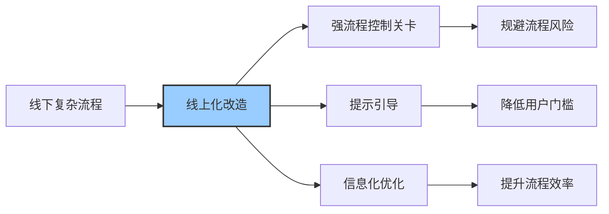

#### 3.4.4 效率提升措施

**1. 方案制定协同优化**

- **线下方式**: 组织会议、邮件反复沟通、重新开会确认(耗时长)
- **线上方式**: 工具识别相关人员 → 系统录入评估结果 → 完成检查清单 → 负责人Review确认

**2. 系统集成**

- **线下方式**: 在不同系统(变更管控、问题管理、审批)提交材料、翻转流程
- **线上方式**: 演练工具对接各系统,在演练流程中完成所有工作

**3. 验证材料自动生成**

**痛点**: 
- 一个子系统30-40个AppID
- 需要截取流量、响应时间、错误率截图
- 填写每个AppID的演练结论
- 耗时3-4小时以上

**解决方案**:
- 工具自动生成验证截图和材料
- 基于监控数据和成功标准自动判断
- 自动打上"验证通过/不通过"标签
- 大幅降低实施人填写成本和审批人审批成本

**4. 数字化埋点分析**

- 演练流程数字化埋点
- 分析子系统切换时效
- 分析流程翻转效率
- 评估演练质量和效率

#### 3.4.5 效率提升成果

**单次演练时长**: 从3天缩短到2小时

**效率提升价值**:
- 成本从3天降到2小时
- 几百个子系统可在1-2年内覆盖
- **常态化演练条件形成**
- 大幅提高演练覆盖率

#### 3.4.6 模拟执行能力

**用途**: 验证人员有效性和流程有效性

**特点**:
- 用户操作与真实演练一致
- 不对生产系统做真正变更
- 减少变更风险
- 提升一线同事对切换和流程的熟悉度
- 验证流程有效性

#### 3.4.7 指挥大屏

**大规模演练需求**: 业务场景切换涉及多个子系统,产生指挥层面需求。

**指挥大屏展示内容**:

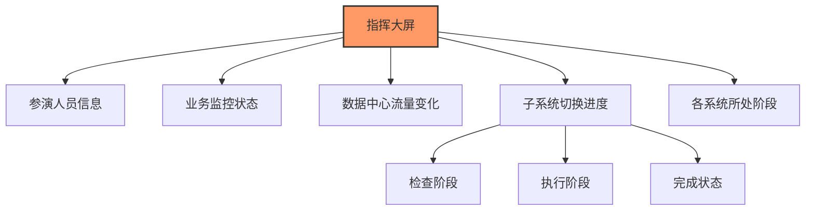

## 四、平台价值与收益

### 4.1 业务连续性能力提升

#### 4.1.1 RTO大幅降低

**切换时长**:
- 子系统端到端切换RTO: **约10分钟**
- 监管要求(A类系统): 30分钟
- **明显低于监管要求**

**应用类切换**:
- RTO: **几秒钟**
- 成本主要在不同系统间操作
- 按预案批量执行,时效极低

#### 4.1.2 业务场景快速恢复能力

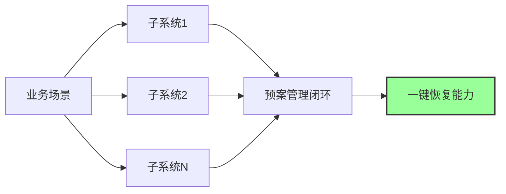

- 建立业务场景与子系统关系
- 子系统完成预案管理闭环
- 具备业务场景一键恢复能力

#### 4.1.3 应急处置方式丰富

**传统三板斧**:
- 重启
- 扩容
- 回滚

**新增切换能力**:
- 快速切换恢复服务
- 更快速的单机房回滚
- **经过验证,更加安全**

### 4.2 额外收益

#### 4.2.1 支持技术架构变更

**场景**: 机房改造、核心交换机替换等高风险变更

**传统方式**: 应用运维和技术架构同事担心产生大规模故障

**有切换能力后**:

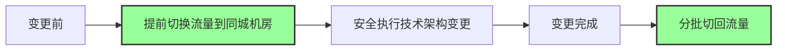

**价值**: 大大增加变更安全系数

#### 4.2.2 支持白天发版

**传统发版**:
- 时间: 周二、周四凌晨2-3点
- 痛点: 时间短、运维人员疲劳

**有切换能力后**:
- 关键业务试点白天发版
- 通过流量灰度实现部分节点发布
- 故障时快速切换回来
- 变更风险大大降低

### 4.3 演练规模

**演练频率**: 
- 要求: 两年内覆盖所有核心系统
- 实际: **每年几百场演练**

**容灾范围**:
- 同城容灾: 高频演练(数据实时复制,双机房有流量,切换安全性高)
- 异地灾备: 低频演练(仅在两个同城机房都不可用时使用)

**部署模式**:
- 生产与同城机房: **1:1部署**
- 流量分配: **1:1比例**

## 五、Q&A精选

### Q1: 是否有必要进行以存储为中心的容灾演练?

**A**: 容灾切换不仅做应用层,也做数据层,是应用+数据库的整体切换。存储层面由技术架构团队单独实施。

### Q2: 演练前如何确保两边数据一致?

**A**: 
- 应用层: 巡检机制定期检查,切换前做检查
- 确保生产机房与同城机房处于"可切换状态"
- 数据库: 通过主备复制实现

### Q3: 切换后增量数据如何恢复?

**A**: 
- **演练**: 使用Switchover方式,尽可能避免数据丢失(RPO最小化)
- **应急**: 使用Failover方式,可能有数据丢失,由开发和DBA事后修复数据

### Q4: 演练是停机进行的吗?

**A**: 不是停机演练,是在线切换。

### Q5: 容灾切换能解决所有故障吗?

**A**: 
- **适用场景**: 单机房故障(节点问题、物理设备问题、单机房PaaS服务问题)
- **不适用场景**: 应用容量问题等(切换无法解决)
- 容灾切换有特定的故障场景适用范围

## 六、总结

平安银行容灾切换平台通过以下核心能力建设,实现了从"有容灾能力"到"想切就切"的跨越:

1. **预案一键切换**: 原子预案 → 子系统预案 → 业务场景预案的三层编排体系
2. **工具高可用**: 三地部署、依赖分级管理、性能测试基准
3. **运行可观测**: 运维数据中台支撑的全方位监控和自动化验证
4. **演练线上化**: 从3天降到2小时,实现常态化演练

**核心价值**:
- RTO从30分钟降到10分钟(子系统级)、秒级(应用级)
- 每年几百场演练,覆盖所有核心系统
- 丰富应急处置手段,提升故障恢复安全性
- 支持技术架构变更和白天发版等额外场景

**关键成功因素**:
- 选择合适的容灾最小单位(子系统)
- 架构设计支持故障隔离(高内聚、松耦合、数据库独立)
- 工具化降低人工成本和错误
- 流程线上化提升效率和质量
- 常态化演练验证能力

---

*本文档整理自平安银行容灾切换平台建设技术分享*

