# 故障视角下的安全生产体系建设

> 来源：未核验 · 类型：分享 · 状态：draft


## 目录

- [一、安全生产的背景与挑战](#一安全生产的背景与挑战)
- [二、安全生产的整体框架](#二安全生产的整体框架)
- [三、技术层面的安全生产实践](#三技术层面的安全生产实践)
- [四、安全生产意识提升](#四安全生产意识提升)

---

## 一、安全生产的背景与挑战

### 1.1 行业事故频发现状

近一两年，互联网行业事故频发，多家公司因重大故障登上微博热搜，B站也经历了多次生产事故。通过对内部重大事故的分析，发现典型问题包括：

- **配置变更风险**：服务在两个可用区同时发布变更，未严格灰度或观测时间过短，导致多活失效
- **容灾能力缺失**：商业CDN故障穿透源站，暴露出图片服务容灾只做了服务端，缺少全链路（CDN+端）的高可用设计
- **数据链路问题**：DTS同步组件异常导致业务数据延迟，定位能力欠缺
- **网络层面故障**：多次网络故障暴露出业务多活覆盖不足、跨机房依赖不合理等问题
- **架构设计不完善**：特殊情况下大量慢查询导致DB过载，业务异常

### 1.2 事故频发的深层原因

通过内部反思和行业分析，总结出以下根本原因：

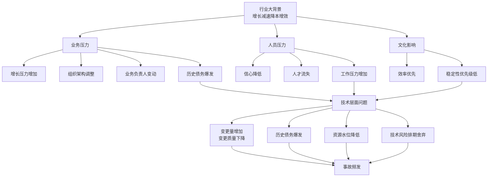
```mermaid
graph TD
    A[行业大背景<br/>增长减速降本增效] --> B[业务压力]
    A --> C[人员压力]
    A --> D[文化影响]
  
    B --> B1[增长压力增加]
    B --> B2[组织架构调整]
    B --> B3[业务负责人变动]
    B --> B4[历史债务爆发]
  
    C --> C1[信心降低]
    C --> C2[人才流失]
    C --> C3[工作压力增加]
  
    D --> D1[效率优先]
    D --> D2[稳定性优先级低]
  
    B4 --> E[技术层面问题]
    C3 --> E
    D2 --> E
  
    E --> E1[变更量增加<br/>变更质量下降]
    E --> E2[历史债务爆发]
    E --> E3[资源水位降低]
    E --> E4[技术风险排期舍弃]
  
    E1 --> F[事故频发]
    E2 --> F
    E3 --> F
    E4 --> F
```

**关键洞察**：

- B站近四年故障数量统计显示，2022-2023年重大事故明显增加
- **"没崩可能只是运气好，欠的债早晚要还"**
- Google SRE理念：**"系统正常只是该系统无数异常情况下的一种特例"**

### 1.3 安全生产的系统性思维

安全生产类比"安全驾驶"，需要多维度综合实践：

| 安全驾驶          | 安全生产           |
| ----------------- | ------------------ |
| 制度红线          | 变更红线、流程制度 |
| 专业执法          | 安全生产团队       |
| 监督设备          | 变更监控、风险巡检 |
| 准入门槛          | 变更考核、发布门槛 |
| 更好的车+驾驶能力 | 安全生产平台+意识  |
| 定期年检保养      | 风险预防、风险运营 |
| 事故判责保险      | 故障快恢、故障兜底 |

**核心观点**：安全生产不是某一个平台或某一个人能做好的，而是**人、组织、技术、团队多方面的综合实践**。

---

## 二、安全生产的整体框架

### 2.1 四个阶段的建设历程

B站安全生产能力建设分为四个阶段：

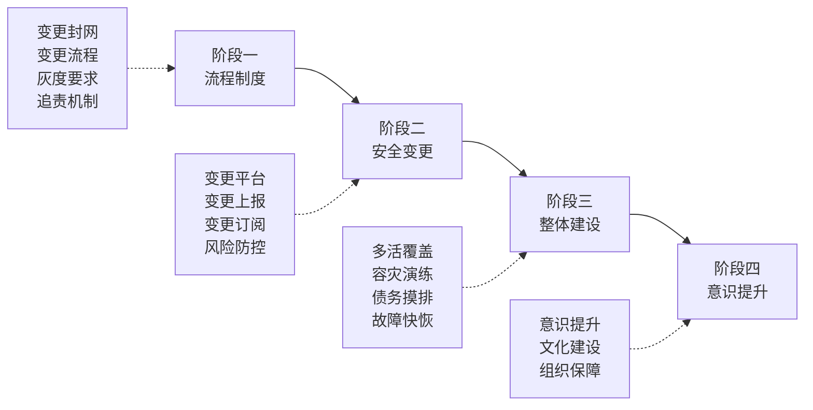
```mermaid
graph LR
    A[阶段一<br/>流程制度] --> B[阶段二<br/>安全变更]
    B --> C[阶段三<br/>整体建设]
    C --> D[阶段四<br/>意识提升]
  
    A1[变更封网<br/>变更流程<br/>灰度要求<br/>追责机制] -.-> A
    B1[变更平台<br/>变更上报<br/>变更订阅<br/>风险防控] -.-> B
    C1[多活覆盖<br/>容灾演练<br/>债务摸排<br/>故障快恢] -.-> C
    D1[意识提升<br/>文化建设<br/>组织保障] -.-> D
```

**阶段选择说明**：

- 有统一CTO管理的组织：可将阶段一和阶段四前置，通过强制度+意识快速推进
- B站采用TC（技术委员会）模式：先做技术建设，再强调意识提升和奖惩措施

### 2.2 安全生产整体框架

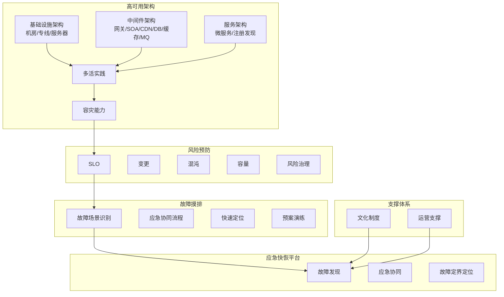
```mermaid
graph TB
    subgraph 支撑体系
        Z1[文化制度]
        Z2[运营支撑]
    end
  
    subgraph 应急快恢平台
        Y1[故障发现]
        Y2[应急协同]
        Y3[故障定界定位]
    end
  
    subgraph 故障摸排
        X1[故障场景识别]
        X2[应急协同流程]
        X3[快速定位]
        X4[预案演练]
    end
  
    subgraph 风险预防
        W1[SLO]
        W2[变更]
        W3[混沌]
        W4[容量]
        W5[风险治理]
    end
  
    subgraph 高可用架构
        V1[基础设施架构<br/>机房/专线/服务器]
        V2[中间件架构<br/>网关/SOA/CDN/DB/缓存/MQ]
        V3[服务架构<br/>微服务/注册发现]
        V4[多活实践]
        V5[容灾能力]
    end
  
    V1 --> V4
    V2 --> V4
    V3 --> V4
    V4 --> V5
  
    V5 --> W1
    W1 --> X1
    X1 --> Y1
  
    Z1 --> Y1
    Z2 --> Y1
```

**核心目标**（参考阿里GOC模式）：

- **1分钟发现**
- **3分钟响应**
- **5分钟定界**
- **10分钟恢复**

**总体目标**：

1. 防止能预见的问题
2. 快速恢复不能预防的问题
3. 不再重复已经发生的问题

---

## 三、技术层面的安全生产实践

### 3.1 高可用架构：同城双活

#### 3.1.1 多活架构设计

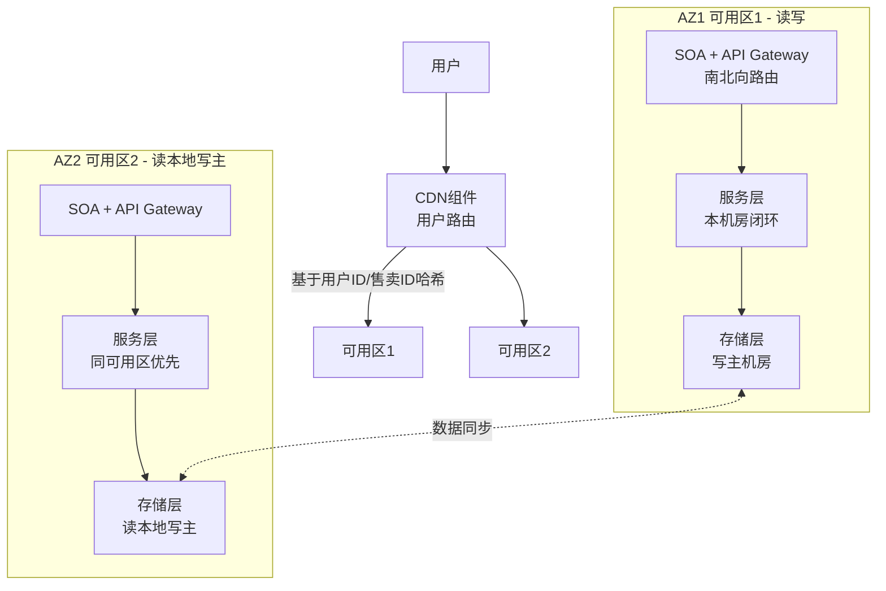
```mermaid
graph TB
    User[用户] --> CDN[CDN组件<br/>用户路由]
    CDN --> |基于用户ID/售卖ID哈希| AZ1[可用区1]
    CDN --> AZ2[可用区2]
  
    subgraph AZ1 可用区1 - 读写
        SOA1[SOA + API Gateway<br/>南北向路由]
        SOA1 --> Service1[服务层<br/>本机房闭环]
        Service1 --> Storage1[存储层<br/>写主机房]
    end
  
    subgraph AZ2 可用区2 - 读本地写主 
        SOA2[SOA + API Gateway]
        SOA2 --> Service2[服务层<br/>同可用区优先]
        Service2 --> Storage2[存储层<br/>读本地写主]
    end
  
    Storage1 <-.数据同步.-> Storage2
```

**关键设计原则**：

1. **路由层面**

   - CDN根据用户ID/售卖ID做哈希，决定用户访问哪个机房
   - SOA（基础网关）+ API Gateway（业务网关）做南北向路由精细处理
2. **服务发现**

   - 同可用区优先
   - 可用区内无服务时可跨可用区访问
   - 支持东西向流量灰度、切量
3. **服务侧要求**

   - 强依赖服务在本地部署，本机房闭环
   - 核心链路支持本地可读可写
   - 弱依赖可以回主机房
4. **存储层面**

   - 写操作回主机房
   - 缓存组件：支持直接更新或通过Binlog订阅回刷
   - 消息队列：提供Global消息模式，一处写两处可消费
   - 存储接入层：根据业务所在可用区，自动路由读写请求

#### 3.1.2 多活管控中心

**核心功能**：

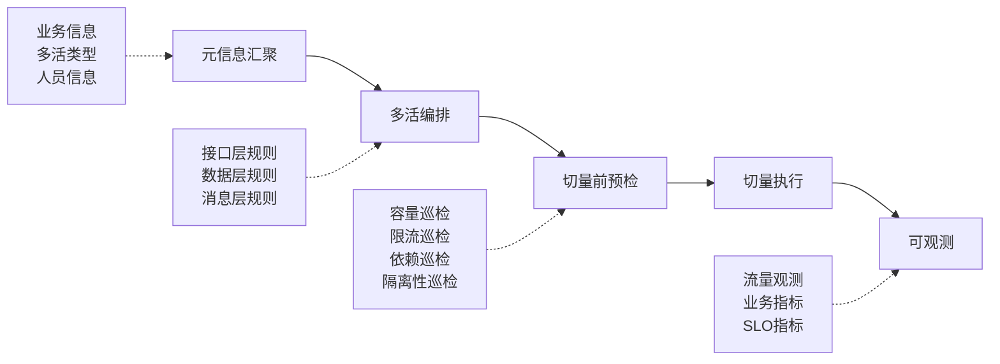
```mermaid
graph LR
    A[元信息汇聚] --> B[多活编排]
    B --> C[切量前预检]
    C --> D[切量执行]
    D --> E[可观测]
  
    A1[业务信息<br/>多活类型<br/>人员信息] -.-> A
    B1[接口层规则<br/>数据层规则<br/>消息层规则] -.-> B
    C1[容量巡检<br/>限流巡检<br/>依赖巡检<br/>隔离性巡检] -.-> C
    E1[流量观测<br/>业务指标<br/>SLO指标] -.-> E
```

**预检能力**：

- **容量巡检**：检查服务CPU水位、限流配额是否安全
- **依赖巡检**：检测跨可用区强依赖
- **配置巡检**：检查多活配置合理性
- **隔离性和延迟巡检**：同城双活场景下延迟影响较小

**可观测能力**：

- 巡检指标实时观测
- 两个可用区流量比例观测
- 核心业务指标和应用SLO指标实时观测

#### 3.1.3 容灾治理：从可切到能切

> **行业案例**：唯品会、滴滴、美团、B站（2021年7月3日事故）都曾在重大故障时多活未切换成功

**容灾治理两大方向**：

**1. 管控面容灾**

问题：机房故障时，管控系统（VPN、跳板机、切量平台、可观测系统）是否可用？

解决方案：

- 管控面做多活架构
- 强依赖演练：精简架构、去除循环依赖
- 断网演练：基于混沌工程，模拟跨机房专线不可用

成果：

- 20+管控系统验证通过
- 常态化自动断网演练（保鲜机制）
- 切量效率提升至5分钟
- 累计切量数百次

**2. 业务容灾**

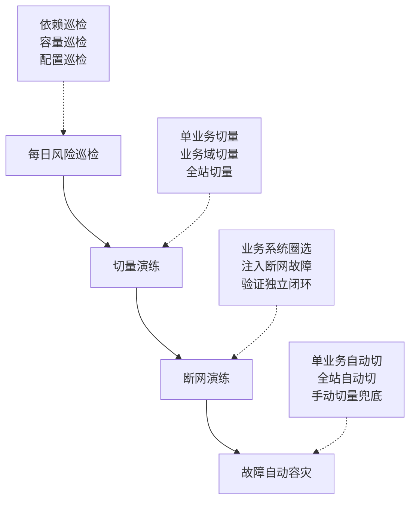
```mermaid
graph TD
    A[每日风险巡检] --> B[切量演练]
    B --> C[断网演练]
    C --> D[故障自动容灾]
  
    A1[依赖巡检<br/>容量巡检<br/>配置巡检] -.-> A
    B1[单业务切量<br/>业务域切量<br/>全站切量] -.-> B
    C1[业务系统圈选<br/>注入断网故障<br/>验证独立闭环] -.-> C
    D1[单业务自动切<br/>全站自动切<br/>手动切量兜底] -.-> D
```

**风险巡检内容**：

- **依赖巡检**：跨机房服务依赖、中间件依赖
- **容量巡检**：CPU水位、缓存内存、限流配额
- **配置巡检**：多活配置合理性（消息队列同机房消费、数据库读本地写跨机房）

**切量演练策略**：

- 每周选择业务进行完整切量演练
- 验证一个完整晚高峰后恢复
- 发现问题：依赖服务容量不足、缓存过期导致回源DB等

**故障自动容灾**：

- 单业务故障：API Gateway层面流量平滑重试到另一机房
- 全站故障：CDN层面核心业务自动容灾
- 非自动容灾规则：手动按优先级切换

### 3.2 风险预防体系

#### 3.2.1 SLO：统一的可靠性度量标准

**核心理念**：

> SLO告警是"果"的告警，其他告警是"因"的告警

**为什么需要SLO？**

- 服务CPU抖动、容器挂掉时，是否需要立即跟进？
- 答案：只要SLO未受损，可以异步跟进
- SLO提供统一度量标准，避免大量底层指标告警

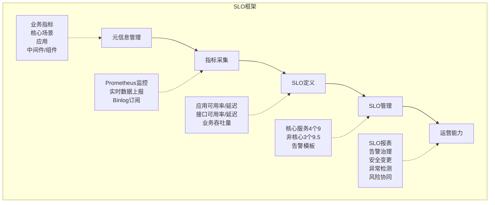
```mermaid
graph TB
    subgraph SLO框架
        A[元信息管理] --> B[指标采集]
        B --> C[SLO定义]
        C --> D[SLO管理]
        D --> E[运营能力]
    
        A1[业务指标<br/>核心场景<br/>应用<br/>中间件/组件] -.-> A
    
        B1[Prometheus监控<br/>实时数据上报<br/>Binlog订阅] -.-> B
    
        C1[应用可用率/延迟<br/>接口可用率/延迟<br/>业务吞吐量] -.-> C
    
        D1[核心服务4个9<br/>非核心3个9.5<br/>告警模板] -.-> D
    
        E1[SLO报表<br/>告警治理<br/>安全变更<br/>异常检测<br/>风险协同] -.-> E
    end
```

**SLO覆盖维度**：

1. **业务指标**：播放量、在线人数、订单量等业务KPI
2. **核心场景**：播放接口、评论接口、直播进房等核心功能的可用率和延迟
3. **应用维度**：所有微服务的可用率、延迟、QPS
4. **中间件/组件**：缓存、数据库、消息队列等基础组件的SLO

**SLO告警策略**：

```
告警条件 = 时间窗口内可用率低于阈值 AND 最近1分钟错误量大于阈值
```

分为两类：

- **紧急告警**：错误率高，快速触发（如可用率降至3个9，错误量>10）
- **非紧急告警**：低速流血问题，按天巡检（如一天下来SLO不达标）

**告警降噪思路**：

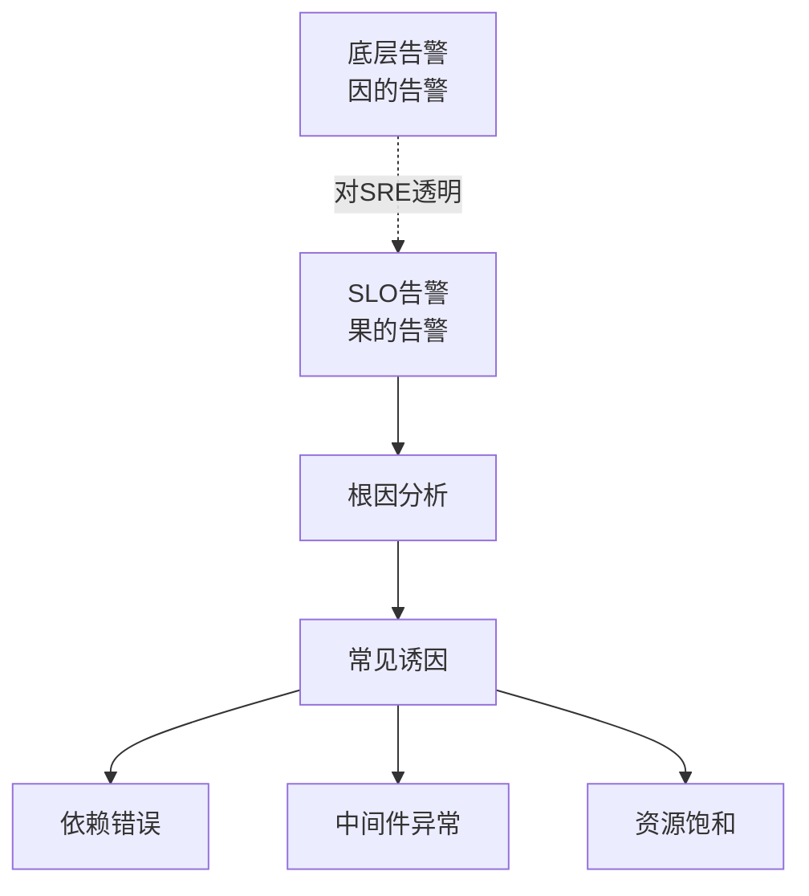
```mermaid
graph TB
    A[SLO告警<br/>果的告警] --> B[根因分析]
    B --> C[常见诱因]
  
    C --> C1[依赖错误]
    C --> C2[中间件异常]
    C --> C3[资源饱和]
  
    D[底层告警<br/>因的告警] -.对SRE透明.-> A
```

- SRE只关注SLO告警
- SLO触发后，通过根因分析下钻找到具体原因
- 底层告警（CPU、内存、GC等）对上层透明

**实践效果**：

- 微服务覆盖率：95%+
- 每日召回SLO风险：~20个
- 告警有效率：>95%
- 有效避免多次线上故障：代码bug、限流配置、服务预热超时、依赖组件错误、慢查询等

#### 3.2.2 风险分类与治理

**风险分类**：

| 类型               | 特点       | 跟进方式 | 示例                          |
| ------------------ | ---------- | -------- | ----------------------------- |
| **动态风险** | 可自恢复   | 告警流   | SLO下跌、资源负载、饱和度告警 |
| **静态风险** | 不可自恢复 | 任务流   | 架构改进、组件优化、事故待办  |

**静态风险细分**：

1. **架构改进**

   - 服务标准化
   - SDK框架升级
   - 强依赖优化
   - 缓存/DB使用姿势优化
2. **组件层面**

   - 中间件接入方式升级
   - 权限泛滥治理
3. **事故待办**

   - 历史事故遗留问题

**风险跟进机制**：

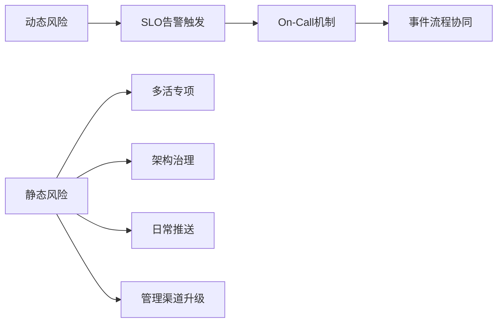
```mermaid
graph LR
    A[动态风险] --> A1[SLO告警触发]
    A1 --> A2[On-Call机制]
    A2 --> A3[事件流程协同]
  
    B[静态风险] --> B1[多活专项]
    B --> B2[架构治理]
    B --> B3[日常推送]
    B --> B4[管理渠道升级]
```

**建设中**：风险治理中心，统一风险定义、上报、流转、运营和报表

#### 3.2.3 变更管控：防止70%的故障

**背景数据**：

- Google SRE：70%的故障由变更导致
- B站去年：所有重大事故均由变更导致

**目标**：可灰度、可观测、可恢复

**变更管控框架**：

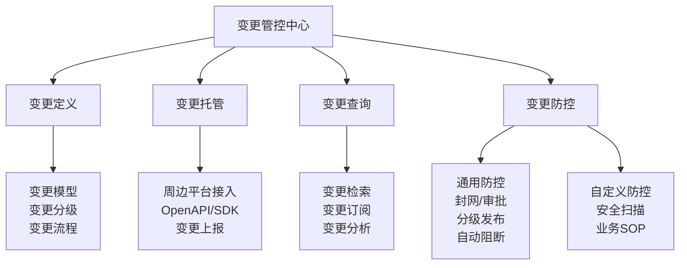
```mermaid
graph TB
    A[变更管控中心] --> B[变更定义]
    A --> C[变更托管]
    A --> D[变更查询]
    A --> E[变更防控]
  
    B --> B1[变更模型<br/>变更分级<br/>变更流程]
  
    C --> C1[周边平台接入<br/>OpenAPI/SDK<br/>变更上报]
  
    D --> D1[变更检索<br/>变更订阅<br/>变更分析]
  
    E --> E1[通用防控<br/>封网/审批<br/>分级发布<br/>自动阻断]
    E --> E2[自定义防控<br/>安全扫描<br/>业务SOP]
```

**变更防控关键措施**：

1. **封网审批**

   - 周末、节假日、重大时政期间封网
   - 需要审批才能发布
2. **分级发布**

   - 核心服务：4-5个批次
   - 每批次强制等待5分钟（最少）
   - 完整发布需要20+分钟
3. **发布观测**

   - 集成告警信息
   - 可观测面板
   - 可用率过低自动阻断
4. **多活顺序发布**

   - 优先在一个可用区发布
   - 观测无问题后再发布另一个可用区

**阻断配置**：

- 用户自定义拦截指标和阈值
- 示例：可用率低于95%/90%触发拦截

**绿色通道机制**：

- 触发阻断意味着线上故障
- 故障时需要降级、回滚、扩容
- 提供短时间内豁免所有防控能力的绿色通道

**接入模式**：

- **观察模式**：触发检测但不干预
- **执法模式**：触发阻断即拦截变更
- 核心平台（应用发布、配置中心、网关）强制执法模式

**实践效果**：

- 接入60+平台
- 400+变更场景
- 每天~1000次变更
- 每天拦截上百次风险
- 不再出现低级变更事故（两个可用区同时发布等）

### 3.3 故障摸排：1-3-5-10方法论

> 参考阿里GOC的1-3-5-10方法论体系

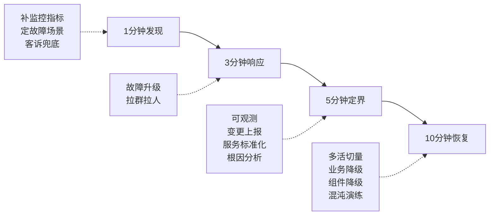
```mermaid
graph LR
    A[1分钟发现] --> B[3分钟响应]
    B --> C[5分钟定界]
    C --> D[10分钟恢复]
  
    A1[补监控指标<br/>定故障场景<br/>客诉兜底] -.-> A
    B1[故障升级<br/>拉群拉人] -.-> B
    C1[可观测<br/>变更上报<br/>服务标准化<br/>根因分析] -.-> C
    D1[多活切量<br/>业务降级<br/>组件降级<br/>混沌演练] -.-> D
```

#### 3.3.1 1分钟发现

**故障发现的四种方式**：

1. **业务KPI指标**

   - 订单量、在线人数、播放量、弹幕量等
2. **核心场景SLO下跌**

   - 视频详情页可用率下跌
   - 评论列表可用率下跌
   - 直播房间可用率下跌
   - 大概率影响用户体验
3. **客诉突发**

   - 一定时间内客诉超过阈值
   - 自动拉起故障应急
4. **微博舆情**

   - 外部舆情监控

**摸排方法**：

- 检查业务故障能否被发现
- 检查故障能否被召回
- 不能发现 → 补监控指标
- 不能召回 → 定故障场景
- 都没有 → 客诉兜底

#### 3.3.2 3分钟响应

**要求**：故障产生后能否及时通知并升级到人

**故障应急协同能力**：

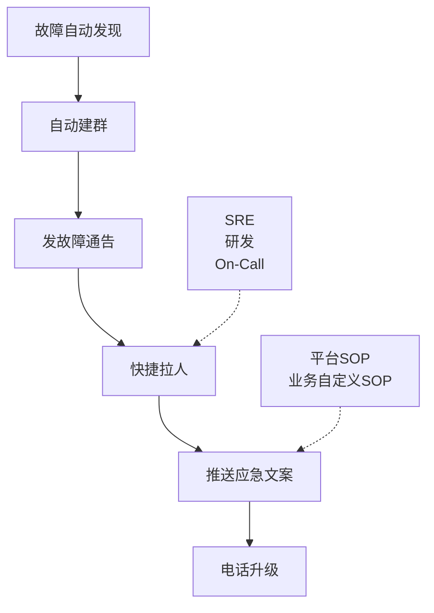
```mermaid
graph TD
    A[故障自动发现] --> B[自动建群]
    B --> C[发故障通告]
    C --> D[快捷拉人]
    D --> E[推送应急文案]
    E --> F[电话升级]
  
    D1[SRE<br/>研发<br/>On-Call] -.-> D
    E1[平台SOP<br/>业务自定义SOP] -.-> E
```

**手动通告能力**：

- 业务无指标、无SLO覆盖时使用
- 不建议常态化使用

#### 3.3.3 5分钟定界

**要求**：快速定位故障诱因或初因

**定位能力汇聚**：

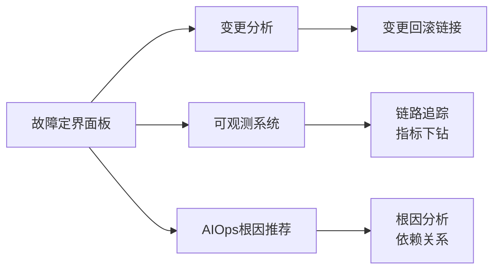
```mermaid
graph LR
    A[故障定界面板] --> B[变更分析]
    A --> C[可观测系统]
    A --> D[AIOps根因推荐]
  
    B --> B1[变更回滚链接]
    C --> C1[链路追踪<br/>指标下钻]
    D --> D1[根因分析<br/>依赖关系]
```

**前置条件**：

- 业务接入完整可观测能力
- 变更上报能力
- 服务标准化

**分析能力**：

- 基于LPS的根因分析
- 上下游依赖分析
- 组件故障分析
- 容量问题分析
- 变更导致的故障

#### 3.3.4 10分钟恢复

**要求**：定位后快速恢复

**预案能力**：

| 场景           | 预案           |
| -------------- | -------------- |
| 做了多活的业务 | 多活切量       |
| 未做多活的业务 | 业务降级       |
| 依赖组件故障   | 组件降级和切换 |

**预案保障**：

- 基于混沌工程做强依赖演练
- 多活自动切量演练
- H5能力保证预案三板斧不依赖VPN

**摸排案例流程**：

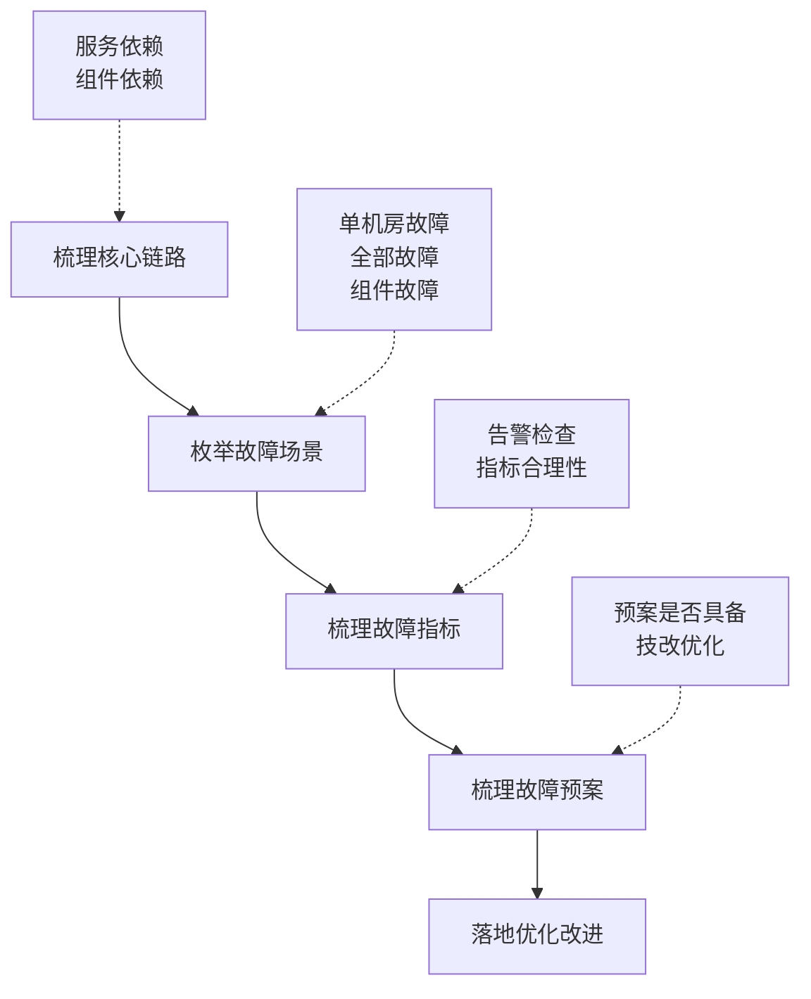
```mermaid
graph TD
    A[梳理核心链路] --> B[枚举故障场景]
    B --> C[梳理故障指标]
    C --> D[梳理故障预案]
    D --> E[落地优化改进]
  
    A1[服务依赖<br/>组件依赖] -.-> A
    B1[单机房故障<br/>全部故障<br/>组件故障] -.-> B
    C1[告警检查<br/>指标合理性] -.-> C
    D1[预案是否具备<br/>技改优化] -.-> D
```

### 3.4 应急快恢平台

**传统故障应急响应流程的问题**：

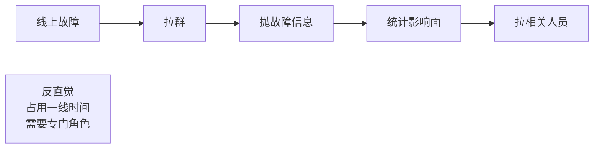
```mermaid
graph LR
    A[线上故障] --> B[拉群]
    B --> C[抛故障信息]
    C --> D[统计影响面]
    D --> E[拉相关人员]
  
    问题[反直觉<br/>占用一线时间<br/>需要专门角色]
```

**新的自动化应急协同**：

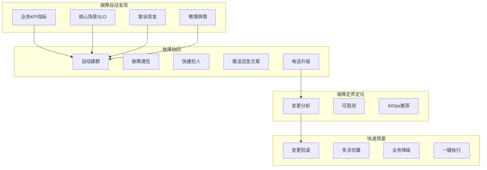
```mermaid
graph TB
    subgraph 故障自动发现
        A1[业务KPI指标]
        A2[核心场景SLO]
        A3[客诉突发]
        A4[微博舆情]
    end
  
    subgraph 故障协同
        B1[自动建群]
        B2[故障通告]
        B3[快捷拉人]
        B4[推送应急文案]
        B5[电话升级]
    end
  
    subgraph 故障定界定位
        C1[变更分析]
        C2[可观测]
        C3[AIOps推荐]
    end
  
    subgraph 快速预案
        D1[变更回滚]
        D2[多活切量]
        D3[业务降级]
        D4[一键执行]
    end
  
    A1 --> B1
    A2 --> B1
    A3 --> B1
    A4 --> B1
  
    B5 --> C1
    C1 --> D1
```

**核心价值**：

- 一线同学聚焦故障止损和问题排查
- 自动化完成协同和通告
- 所有定位信息汇聚到一个面板
- 常见预案集成一键执行

---

## 四、安全生产意识提升

### 4.1 意识问题的常见表现

1. **流程抵触**

   - 觉得服务不重要，不想触发审批
   - 不需要观测
2. **责任规避**

   - 不是有意触发故障，不想担责
   - 跨部门跨团队事故追责难
3. **优先级错位**

   - 业务优先，稳定性排期低
   - 认为稳定性是基架的事，与业务无关

### 4.2 规章制度建设

**两份核心制度**：

1. **安全变更门禁**

   - 明确不允许发布的时间范围
   - 封禁操作规范
   - 绿色通道豁免方式
2. **系统变更管理规范**

   - 可灰度、可观测、可恢复要求
   - 不同服务等级的分级发布批次
   - 可观测等待阶段下限
   - 多可用区发布环境顺序

### 4.3 组织保障：安全生产委员会

**为什么需要横向组织？**

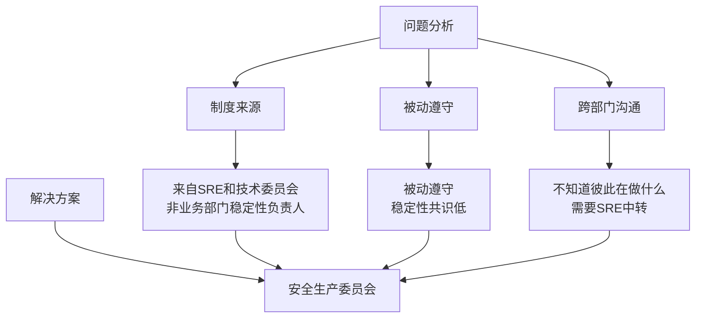
```mermaid
graph TB
    A[问题分析] --> A1[制度来源]
    A --> A2[被动遵守]
    A --> A3[跨部门沟通]
  
    A1 --> A1a[来自SRE和技术委员会<br/>非业务部门稳定性负责人]
    A2 --> A2a[被动遵守<br/>稳定性共识低]
    A3 --> A3a[不知道彼此在做什么<br/>需要SRE中转]
  
    B[解决方案] --> B1[安全生产委员会]
  
    A1a --> B1
    A2a --> B1
    A3a --> B1
```

**安全生产委员会职责**：

1. **全局决策规划**

   - 统筹全局多活演练
   - 统筹全局故障演练
   - 稳定性工作规划
2. **立法与司法**

   - Review规章制度
   - 制定安全生产标准
3. **应急协同**

   - 全局应急响应
4. **文化培养**

   - 安全生产文化宣发

**组成人员**：

- TT（技术委员会）+ SRE
- 各业务部门稳定性负责人

### 4.4 文化宣传举措

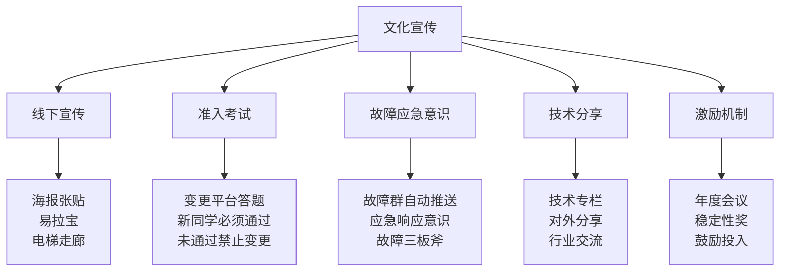
```mermaid
graph TB
    A[文化宣传] --> B[线下宣传]
    A --> C[准入考试]
    A --> D[故障应急意识]
    A --> E[技术分享]
    A --> F[激励机制]
  
    B --> B1[海报张贴<br/>易拉宝<br/>电梯走廊]
  
    C --> C1[变更平台答题<br/>新同学必须通过<br/>未通过禁止变更]
  
    D --> D1[故障群自动推送<br/>应急响应意识<br/>故障三板斧]
  
    E --> E1[技术专栏<br/>对外分享<br/>行业交流]
  
    F --> F1[年度会议<br/>稳定性奖<br/>鼓励投入]
```

**故障三板斧**：

1. 限流
2. 回滚
3. 降级

**应急响应原则**：

- 先通报
- 再止损
- 后定位

---

## 五、实践效果总结

### 5.1 量化成果

| 维度               | 成果                                                |
| ------------------ | --------------------------------------------------- |
| **多活容灾** | 20+管控系统验证通过 ``切量效率5分钟``累计切量数百次 |
| **SLO覆盖**  | 微服务覆盖率95%+``每日召回20个风险``告警有效率>95%  |
| **变更管控** | 接入60+平台 ``400+变更场景``每天拦截上百次风险      |
| **组织建设** | 安全生产委员会成立``各业务部门稳定性负责人参与      |

### 5.2 关键能力建设

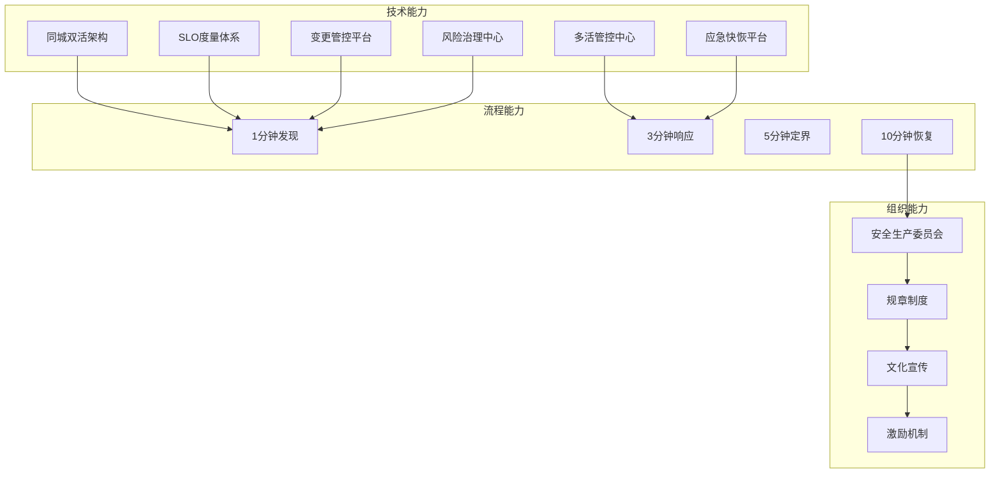
```mermaid
graph TB
    subgraph 技术能力
        A1[同城双活架构]
        A2[多活管控中心]
        A3[SLO度量体系]
        A4[变更管控平台]
        A5[应急快恢平台]
        A6[风险治理中心]
    end
  
    subgraph 流程能力
        B1[1分钟发现]
        B2[3分钟响应]
        B3[5分钟定界]
        B4[10分钟恢复]
    end
  
    subgraph 组织能力
        C1[安全生产委员会]
        C2[规章制度]
        C3[文化宣传]
        C4[激励机制]
    end
  
    A1 --> B1
    A2 --> B2
    A3 --> B1
    A4 --> B1
    A5 --> B2
    A6 --> B1
  
    B4 --> C1
    C1 --> C2
    C2 --> C3
    C3 --> C4
```

### 5.3 核心经验总结

**1. 分阶段建设思路**

- 有强组织保障：制度+意识优先
- 无强组织保障：技术能力先行，再做意识提升

**2. 高可用架构是基础**

- 架构越好，越不容易出故障
- 出故障时越容易自愈

**3. 多活不仅要做，更要能切**

- 管控面容灾
- 业务容灾
- 常态化演练保鲜

**4. SLO是可靠性核心**

- 统一度量标准
- 抓果不抓因
- 告警降噪利器

**5. 变更是最大风险源**

- 70%故障来自变更
- 必须做强管控
- 可灰度、可观测、可恢复

**6. 自动化应急协同**

- 减少人工协调
- 让一线聚焦止损
- 信息汇聚提效

**7. 意识比技术更重要**

- 但意识需要技术做支撑
- 组织保障是关键
- 文化氛围需长期建设

---

## 六、传统运维转型SRE建议

### 6.1 B站SRE转型历程

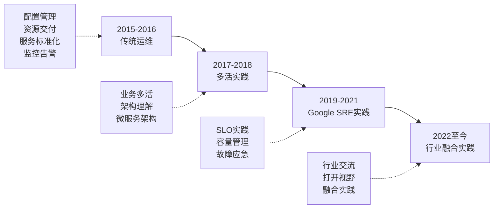
```mermaid
graph LR
    A[2015-2016<br/>传统运维] --> B[2017-2018<br/>多活实践]
    B --> C[2019-2021<br/>Google SRE实践]
    C --> D[2022至今<br/>行业融合实践]
  
    A1[配置管理<br/>资源交付<br/>服务标准化<br/>监控告警] -.-> A
  
    B1[业务多活<br/>架构理解<br/>微服务架构] -.-> B
  
    C1[SLO实践<br/>容量管理<br/>故障应急] -.-> C
  
    D1[行业交流<br/>打开视野<br/>融合实践] -.-> D
```

### 6.2 能力补充建议

**1. 架构能力**

- 微服务架构
- 中间件架构
- 基础设施架构
- 能理解和推动多活改造

**2. 云原生能力**

- Kubernetes
- 可观测性
- 云原生生态

**3. 开发能力**

- 具备一定编码能力
- 能开发工具和平台

**4. 业务理解**

- 深入理解业务逻辑
- 识别核心链路和场景

**5. 数据驱动**

- 指标体系建设
- 数据分析能力

---

## 七、Q&A精选

### Q1：基于果的告警需要创建基于因的告警的告警组吗？

A：告警组用的是同一套，不需要区分。某个应用的告警，不管是基于因的告警还是基于结果的告警，都发给负责这个应用的研发团队。

### Q2：一个SLO可能有多个底层组件支持，如何只关注SLO告警？

A：这正是SLO的价值所在。一个应用可能用到缓存、数据库、消息队列，底层每个组件故障都会导致SLO下跌。从结果角度抓SLO告警，不会漏过任何服务异常，然后再从结果反推原因。如果基于因的角度，需要关注所有底层组件，关注点非常多。

### Q3：有哪些业务指标适合评价SRE的工作成果？

A：从稳定性层面看，有三个维度：

1. **故障数**：最直观，但有运气因素
2. **SLO达标率**：更客观，一个月挂一小时可能全年SLO不达标
3. **1-3-5-10指标**：故障应急能力的客观量化
   - 1分钟发现率
   - 3分钟响应率
   - 5分钟定界率
   - 10分钟恢复率

三个维度综合来看，能客观评价稳定性工作成果。

### Q4：分级发布如何划分批次？

A：两个角度：

**环境流程**：测试环境 → UAT → 灰度环境/预发 → 生产

**生产批次**（单可用区内）：

- 第1批：1个节点
- 第2批：10%
- 第3批：30%
- 第4批：50%
- 第5批：100%

每批次最少等待5分钟（底线要求）。部分业务要求更严格，需要跨天灰度。

### Q5：服务SLO都有哪些指标？

A：三种类型：

1. **业务KPI指标**：评论量、点赞量、订单量等业务层面的量指标
2. **核心场景技术指标**：发评论接口可用率、延迟、流量（可做同环比下跌告警）
3. **服务维度指标**：所有微服务的可用率、延迟、流量（核心场景未覆盖的服务兜底）

### Q6：可观测系统基于SLO下降找原因，是自研的吗？

A：是自研的。实现方案与行业常规AIOps方案类似：

- 基于链路拓扑
- 基于Trace数据
- 基于CMDB数据
- 链路下钻分析异常
- 关联变更和告警

### Q7：SRE体系从理论到落地花了多长时间？

A：从2022年开始快速补齐SRE整体稳定性体系能力，大概花了近两年时间。

### Q8：SLO指标通过什么监控组件承接？

A：

- **技术指标**：Prometheus
- **业务指标**：数据库Binlog订阅、实时数据上报流（端上埋点）

### Q9：混沌工程在B站的应用情况？

A：分两部分：

**1. 业务系统内部架构混沌**

- 服务间强弱依赖演练
- 服务对组件依赖合理性验证（缓存挂了是否降级）
- 微服务依赖是强依赖还是弱依赖

**2. 多活架构层面混沌**

- 断网场景演练
- 圈一个可用区的服务
- 注入跨可用区网络不可达
- 模拟专线故障
- 验证单可用区独立闭环能力
- 全站级别流量自动转移能力

---

## 八、关键启示

### 8.1 对SRE团队的启示

1. **安全生产是系统工程**：技术、流程、组织、文化缺一不可
2. **架构是稳定性的基础**：投入架构建设ROI最高
3. **自动化是方向**：减少人工介入，提升效率
4. **数据驱动决策**：SLO、变更数据、故障数据指导工作
5. **持续演练保鲜**：能力需要常态化验证

### 8.2 对技术管理者的启示

1. **自上而下推动需要组织保障**：安全生产委员会模式
2. **意识提升需要技术支撑**：先有能力，再提要求
3. **跨部门协作需要横向组织**：打破部门墙
4. **激励机制很重要**：年度稳定性奖等
5. **长期投入才有效果**：两年时间建设体系

### 8.3 对业务团队的启示

1. **稳定性不只是基架的事**：业务需要深度参与
2. **欠的债早晚要还**：技术风险不能一直拖
3. **变更要敬畏**：70%故障来自变更
4. **SLO是共同语言**：统一度量标准
5. **预案要演练**：关键时刻才能用得上

---

## 九、后续关注

B站技术公众号将持续分享：

- 多活容灾治理详细实践
- 故障应急响应平台建设
- 风险治理中心建设
- 更多安全生产实践

---

> **核心理念**：防止能预见的问题，快速恢复不能预防的问题，不再重复已经发生的问题。

> **Google SRE 经典语录**：系统正常只是该系统无数异常情况下的一种特例。

---

**文档整理说明**：本文档基于B站SRE团队负责人吴安闯老师在DBA+直播间的分享整理而成，内容涵盖安全生产体系建设的完整框架、技术实践和管理经验，适合SRE、运维及稳定性保障工程师学习参考。
