# 去哪儿网故障演练系统与稳定性建设

> 来源：未核验 · 类型：分享 · 状态：draft

## 一、分享概述

本次分享主要围绕去哪儿网故障演练系统的建设历程、技术架构、实践经验以及稳定性保障进行深入剖析，内容涵盖从0到1的建设过程、基于ChaosBlade的混沌工程落地实践，以及系统对业务稳定性的价值体现。

## 二、故障演练系统的背景与价值

### 2.1 建设背景

**行业背景**

- **Facebook宕机事故**：2021年Facebook发生约7小时宕机事故，次日市值蒸发60亿美金
- **微服务复杂性**：现代微服务架构调用链路极其复杂，任一环节故障可能导致全链路问题

**公司内部痛点**

1. 微服务架构复杂，故障频发
2. 缺乏统一的故障演练工具
3. 2019年携程宕机事故敲响警钟（五一促销前夕发生，社会影响恶劣）
4. 作为携程子公司，亟需建立故障演练体系

### 2.2 核心价值

故障演练通过模拟真实故障场景，实现以下目标：

- ✅ 验证系统弱点和脆弱环节
- ✅ 完善故障应急预案和处理体系
- ✅ 增强对故障的抵御信心
- ✅ 提升团队应急响应能力

## 三、故障演练系统演进历程

去哪儿网故障演练系统经历了三个主要阶段的演进：

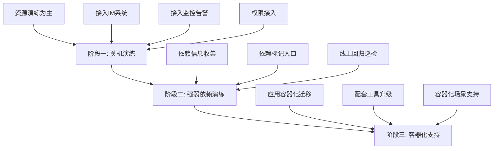

### 3.1 阶段一：关机演练（资源层面）

**核心目标**

- 验证单机房宕机时流量正常切换
- 核心服务能够正常运行
- 弱依赖不影响主流程
- 验证中间件和存储高可用性

**技术能力**

- 单次演练支持1000+节点关机

### 3.2 阶段二：强弱依赖演练（应用层面）

**建设内容**

- 应用间依赖信息收集
- 依赖强弱关系标记
- 接入线上回归巡检

### 3.3 阶段三：容器化支持

**背景**

- 2020年底开始应用容器化迁移
- 配套故障演练工具需要适配容器场景

## 四、技术选型与架构设计

### 4.1 开源工具选型

**候选方案对比**

| 维度         | ChaosBlade  | ChaosMonkey | Netflix Chaos |
| ------------ | ----------- | ----------- | ------------- |
| 开源情况     | 完全开源    | -           | 仅开源工具集  |
| 虚拟机支持   | ✅ 支持     | ❌ 不支持   | -             |
| K8s支持      | ✅ 支持     | -           | -             |
| 语言级别支持 | Java/Go/C++ | -           | -             |
| 场景丰富度   | 更丰富      | 一般        | -             |
| 社区活跃度   | 活跃        | 活跃        | -             |
| 控制平台     | 需自研      | 完整平台    | -             |

**最终选择：ChaosBlade**

**选择理由**

1. 公司底层资源以虚拟机为主，虚拟机场景为主要演练对象
2. 后端服务80-90%为Java技术栈，ChaosBlade更契合
3. 提供强大的Agent能力和丰富的故障注入场景
4. 2021年加入CNCF Sandbox项目

### 4.2 ChaosBlade介绍

**核心组件**

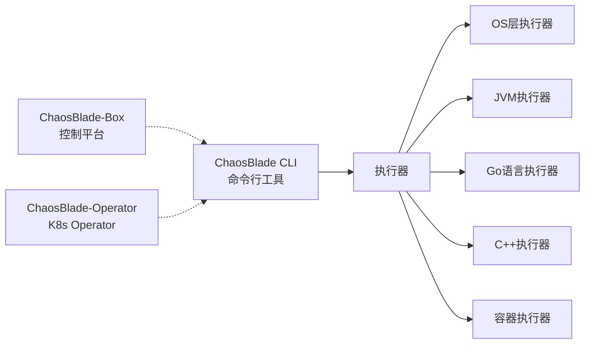

**故障注入能力覆盖**

- 基础资源层：CPU、内存、磁盘、网络
- 应用服务层：进程、JVM、应用调用
- 云原生层：Pod、容器、K8s资源
- 云平台集成

### 4.3 关机演练架构设计

**设计考量**

1. **机房信息聚合**

   - 整合应用PASS平台
   - 提供机房信息、DB信息查询页面
2. **IM系统集成**

   - 演练前自动拉群
   - 实时推送演练进度（开始、告警、结束）
   - 支持问题沟通
3. **差异化关机策略**

   - **虚拟机**：直接关机（一机一服务）
   - **物理机**：Kill进程模拟关机（多服务共用）
4. **监控告警集成**

   - 告警事件关联推送
   - 及时通知到群和平台
5. **自动恢复机制**

   - 虚拟机开机后自动服务上线

**关机演练时序图**

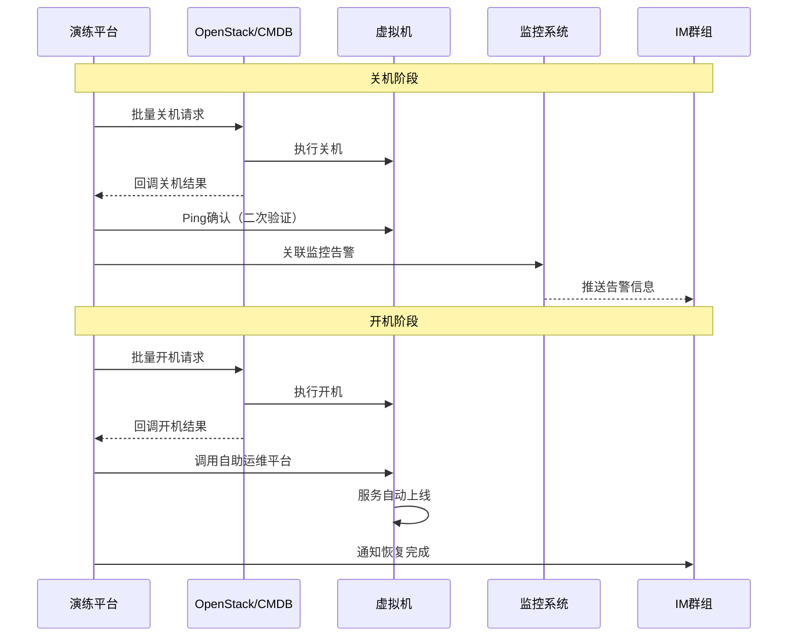

**物理机关机演练流程**

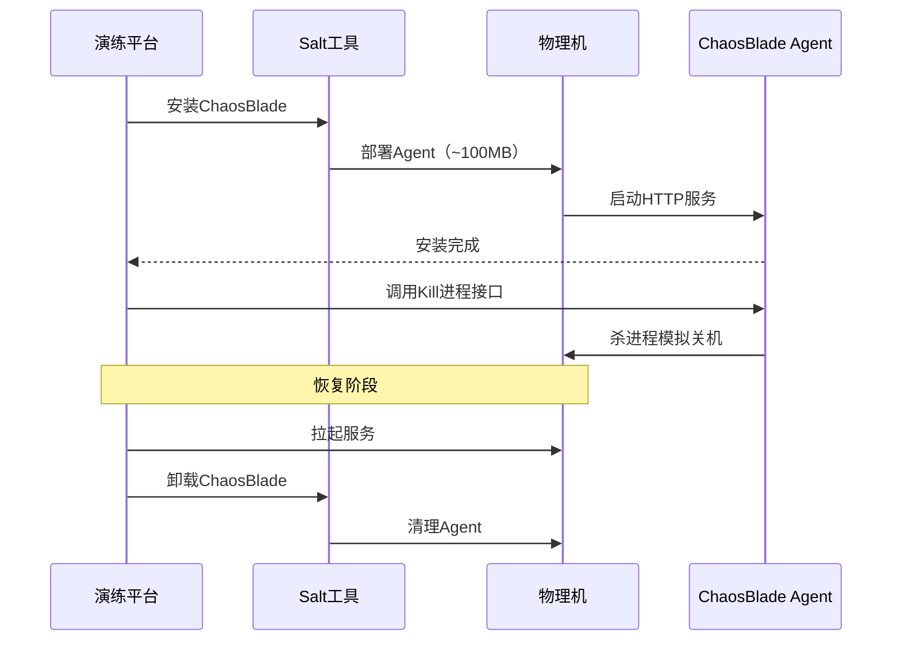

**关键经验总结**

⚠️ **注意事项**

1. **异步任务管理**：必须设置超时，长时间未完成需人工兜底
2. **网络限速**：ChaosBlade安装包约100MB，千兆网卡环境需考虑限速
3. **超时与重试**：关机回调需二次确认，超时任务需单个重试

## 五、用户演练流程

### 5.1 整体流程设计

演练流程类似学校考试体系：**复习 → 自测 → 统考**

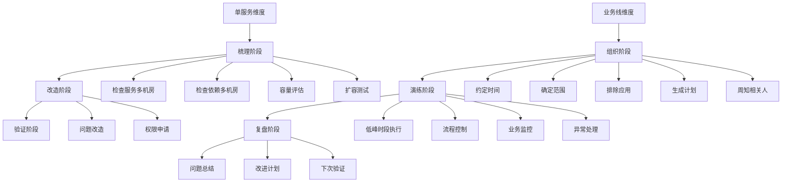

### 5.2 Check List清单

**服务梳理Check List**

- [ ] 服务是否多机房部署
- [ ] 依赖的中间件是否多机房
- [ ] 依赖的存储是否多机房
- [ ] 依赖的其他服务是否多机房
- [ ] 核心系统容量评估是否完成
- [ ] 应急扩容是否测试验证
- [ ] 扩容所需权限是否就绪

### 5.3 演练执行要点

**组织阶段**

- 约定演练时间（通常选择低峰时段）
- 确定演练范围和参与应用
- 排除不能参加演练的应用
- 生成演练计划并周知

**演练阶段**

- 负责人控制演练流程（开启/结束/恢复）
- 业务负责人或QA关注业务状况
- 发现业务抖动及时沟通是否终止

**复盘阶段**

- 应用层面：发现了哪些问题
- 平台层面：使用过程中的改进点
- 制定改进和验证计划

**人力投入变化**

- 首次演练：数十人参与
- 验证性演练：1-2人可完成上千节点演练

## 六、强弱依赖演练

### 6.1 概念定义

**强弱依赖判断标准**

| 依赖类型         | 定义                                 | 示例                                   |
| ---------------- | ------------------------------------ | -------------------------------------- |
| **弱依赖** | 依赖服务异常时，核心流程仍正常运行   | 服务A调用服务B，B异常时A主流程不受影响 |
| **强依赖** | 依赖服务异常时，核心流程无法正常运行 | 服务A调用服务B，B异常时A主流程失败     |

### 6.2 建设背景

**微服务治理痛点**

- 弱依赖超时设置不合理
- 熔断机制不符合预期
- 弱依赖异常未正常处理
- 强依赖过多，缺少降级方案

**数据管理痛点**

- 缺乏统一的依赖管理平台
- 依赖关系梳理分散在各团队
- 强弱依赖标记无统一记录
- 影响问题排查、故障分析、全链路压测等场景

### 6.3 依赖关系收集

**技术栈收敛特点**

- DB访问：MySQL
- 服务调用：HTTP、Dubbo

**依赖数据来源**

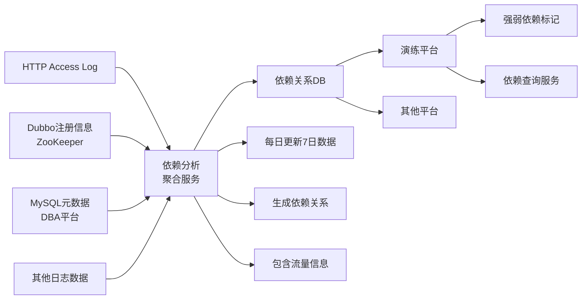

**数据来源优劣分析**

| 来源     | 优势               | 劣势                             |
| -------- | ------------------ | -------------------------------- |
| 日志     | 包含真实调用量数据 | 数据处理量大                     |
| 注册中心 | 数据结构清晰       | 可能存在过期数据（注册但不调用） |

### 6.4 服务上下游关系

**概念说明**

- 服务A依赖服务B的接口
- 服务A是服务B的**上游**
- 服务B是服务A的**下游**

**故障注入位置**

- 在**上游服务A**进行故障注入
- 注入点：HTTP Client或Dubbo Provider

**故障类型**

1. **异常注入**：抛出异常响应
2. **延迟注入**：正常50ms → 延迟100ms

### 6.5 故障演练编排

**编排策略**

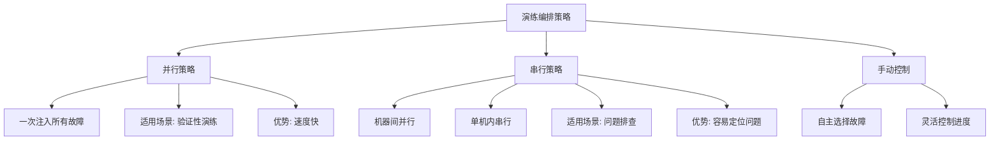

**Agent工作流程**

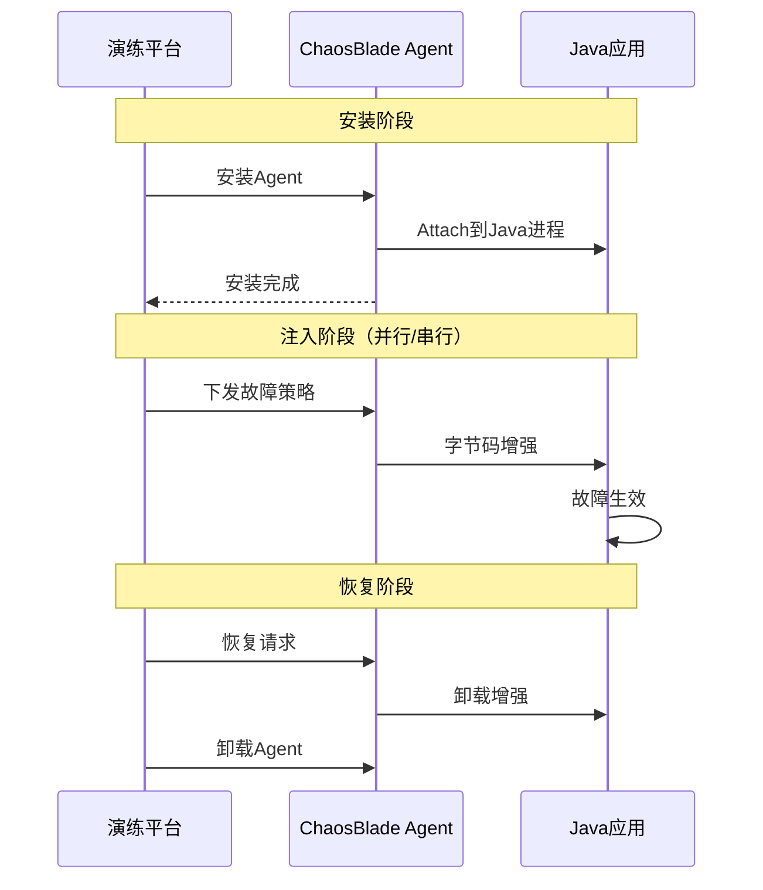

### 6.6 演练使用流程

**闭环流程**

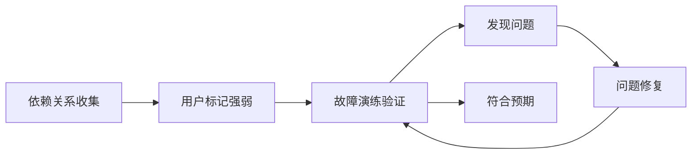

**演练执行步骤**

1. **准备阶段**

   - 选择演练应用
   - 确定演练策略（并行/串行/手动）
   - 生成演练计划
   - 周知相关人员
2. **演练阶段**

   - 安装Agent并Attach到Java进程
   - 注入故障策略
   - **验证流量来源**：
     - 模拟流量：自动化测试Case、人工操作
     - 真实流量：线上流量、流量Copy
   - 观察日志和监控指标
   - 影响线上服务时及时终止
3. **恢复阶段**

   - **人工恢复**：演练完成后手动恢复
   - **超时恢复**：设置超时时间（30分钟/1小时）自动恢复
   - **告警熔断**：核心告警触发时自动恢复
   - 卸载Agent
4. **复盘阶段**

   - 记录演练流水
   - 问题总结
   - 改进计划

## 七、技术难点与解决方案

### 7.1 ChaosBlade Agent问题

#### 问题1：插件支持不足

**问题描述**

- ChaosBlade提供部分开源组件插件（HTTP Client、Dubbo等）
- 公司自研中间件无法支持
- 部分开源组件也未覆盖

**解决方案**

- 按规范自行开发插件
- 开发后的插件提交给官方社区
- 开发自定义功能：
  - **调用点支持**：通过类名+方法名在调用链路上匹配并注入故障
  - **Trace Context匹配**：基于链路追踪信息筛选流量，实现精细化故障注入

#### 问题2：功能缺失

**问题描述**

- HTTP Client的Delay场景支持不足（特别是异步场景）

**解决方案**

- 自行实现功能
- 提交PR并已合并到官方

#### 问题3：Agent冲突

**冲突场景1：与测试工具冲突**

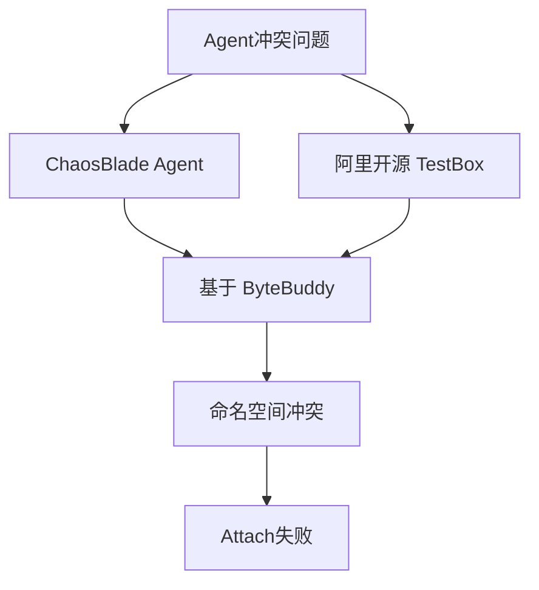

**解决方案**

- 使用ByteBuddy 3.0+版本
- 启动时指定不同的命名空间

**冲突场景2：与监控Agent冲突**

- 公司内部APM Agent（类似SkyWalking）
- 全链路压测Agent
- 基于Byte Buddy开发的Agent可能出现切面增强失效

**现象**

- 故障策略下发成功
- 但故障实际不生效（切面未生效）

**解决方案**

- 参考社区解决方案调整Agent加载顺序
- 确保字节码增强顺序正确

#### 问题4：性能影响

**问题描述**

- Agent Attach时CPU和Load飙高
- 原因：需要对Java进程进行字节码增强

**解决方案**

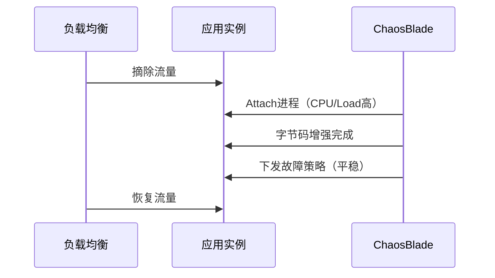

**注意**：故障策略下发阶段对CPU和Load影响较小，主要是Attach阶段

#### 问题5：服务异常重启

**问题描述**

- 某次演练中，几台Tomcat应用
- 演练完成、Agent卸载后
- 一段时间后Tomcat进程挂掉

**解决方案**

- 未找到根本原因
- **保险措施**：演练完成后重启服务

### 7.2 容器化改造方案对比

**方案一：完全使用ChaosBlade Operator**

❌ **问题**

- 无法提供HTTP服务交互能力
- 需单独开发K8s API交互流程
- 故障定义需要重新映射
- 开发量大

**方案二：Sidecar方案**

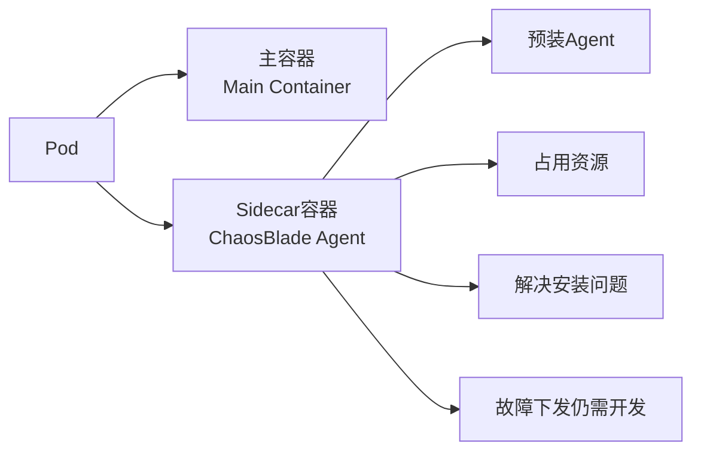

❌ **问题**

- 所有服务都需要Sidecar，资源占用大
- 仅解决Agent安装问题
- 故障下发流程仍需开发

**方案三：折中方案（最终选择）**

✅ **方案设计**

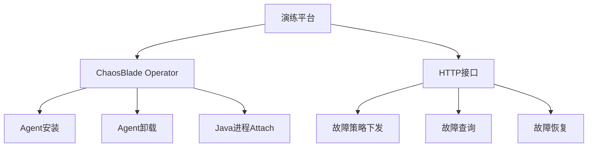

**优势**

- 用Operator替代Salt工具部分
- 故障交互流程保持不变
- 改造成本小

**实现内容**

- Kill Pod功能
- Java应用故障注入
- 网络故障暂未支持（权限问题）

## 八、完整架构设计

### 8.1 整体架构图

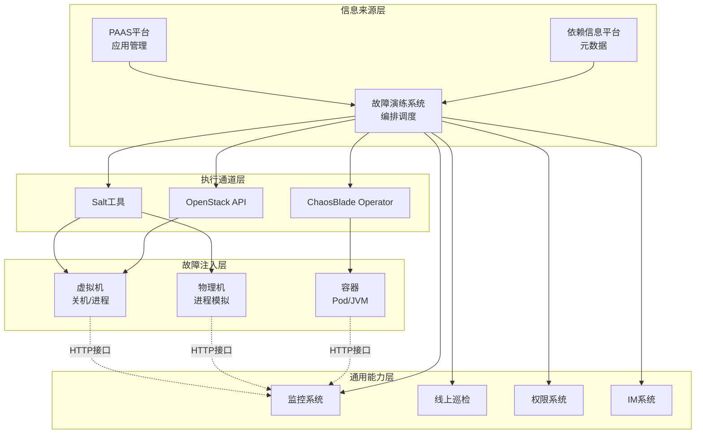

**架构分层说明**

| 层级                 | 职责                             | 核心组件                      |
| -------------------- | -------------------------------- | ----------------------------- |
| **信息来源层** | 提供应用信息、依赖关系、演练编排 | PAAS平台、依赖平台、演练系统  |
| **执行通道层** | 故障注入命令下发                 | Salt、OpenStack API、Operator |
| **故障注入层** | 执行具体故障注入                 | 虚拟机、物理机、容器          |
| **通用能力层** | 提供监控、巡检、权限、通信能力   | 监控、巡检、权限、IM          |

### 8.2 数据流转

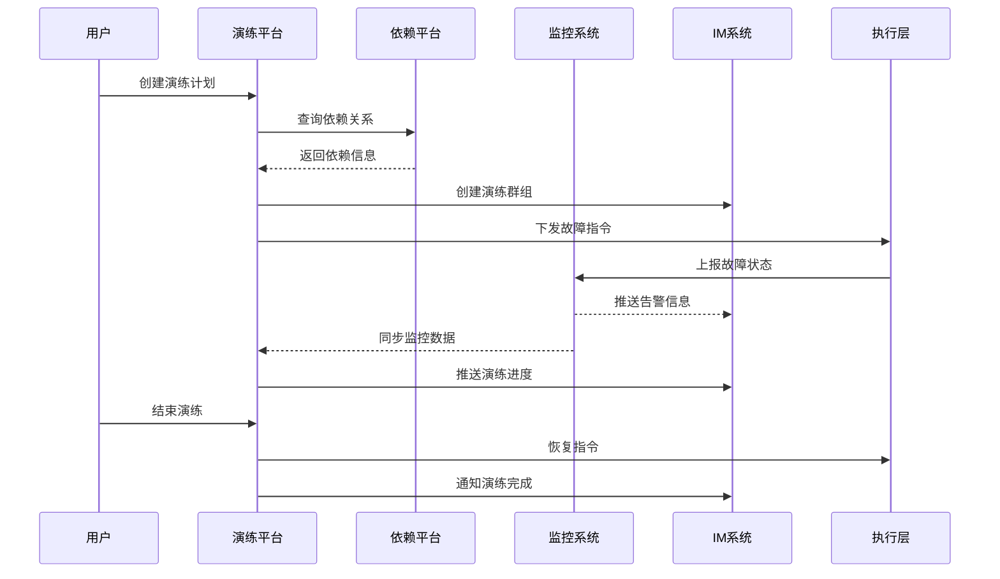

## 九、收益与效果

### 9.1 发现的风险类型

**典型问题分类**

| 风险类型               | 具体表现                       |
| ---------------------- | ------------------------------ |
| **依赖处理不当** | 强依赖未降级、弱依赖影响主流程 |
| **超时不合理**   | 超时时间设置过长或过短         |
| **告警不合理**   | 告警阈值不准确、告警缺失       |
| **容量问题**     | 单机房容量不足、扩容失败       |
| **降级未生效**   | 降级开关失效、降级逻辑错误     |
| **无用代码**     | 发现已废弃但未清理的代码       |

### 9.2 量化收益

**核心指标**

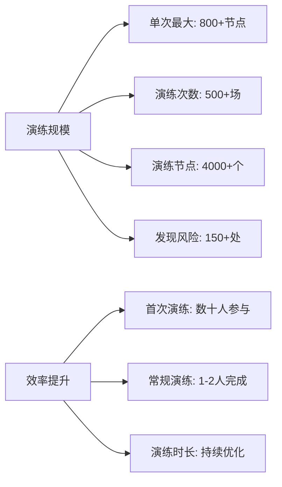

**数据总结**

- ✅ 单次关机演练支持 **800+** 服务节点
- ✅ 累计完成 **500+** 场演练
- ✅ 演练覆盖 **4000+** 节点
- ✅ 发现并修复 **150+** 处风险
- ✅ 人力投入降低 **90%+**（数十人 → 1-2人）

## 十、混沌工程与故障演练

### 10.1 概念区别

| 维度               | 故障演练                       | 混沌工程              |
| ------------------ | ------------------------------ | --------------------- |
| **核心目标** | 测试验证为主                   | 通过实验发现系统问题  |
| **执行环境** | 测试环境 → 线上环境（渐进式） | 强调线上随机化演练    |
| **执行方式** | 定期组织演练                   | 自动化、持续性演练    |
| **文化理念** | 应急演练文化                   | 混沌工程文化 + DevOps |
| **组织形式** | 人工组织为主                   | 深度集成到研发流程    |

### 10.2 关系定位

- 故障演练是混沌工程的**工程实践**
- 故障演练提供**底层能力**（故障注入）
- 混沌工程是更**高层次的方法论**

## 十一、未来规划

### 11.1 强弱依赖自动标记

**实现思路**

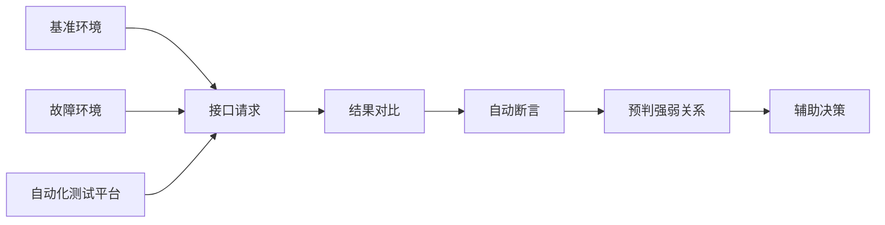

**目标**

- 利用接口自动化测试平台
- 对比基准环境和故障环境响应
- 自动预判强弱依赖关系
- 处理新增依赖和存量依赖

### 11.2 线上随机演练

**技术方案**

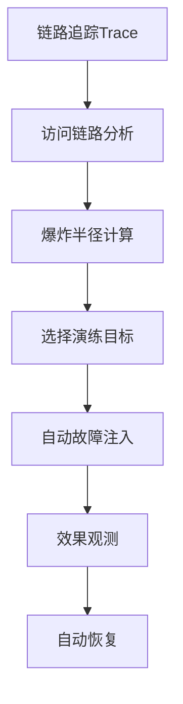

**核心能力**

- 结合Trace链路信息
- 计算故障爆炸半径
- 针对访问链路应用进行随机演练
- 自动化执行和恢复

### 11.3 开源共建

**社区贡献**

- 已提交的HTTP Client异步支持
- 持续与ChaosBlade社区深度交流
- 保持合作关系，共同推进项目发展

### 11.4 平台能力增强

**可观测性提升**

- Agent日志透明化
- 故障注入信息可视化
- 完善监控指标

**参数固化**

- 演练参数模板化
- 支持周期性自动演练
- 减少重复配置工作

## 十二、Q&A精选

### Q1：如何获取服务依赖的强弱关系图？

**A：** 主要通过两个来源获取依赖关系：

1. **日志数据**：HTTP Access Log等
2. **注册中心**：服务注册信息（如ZooKeeper）
3. **DB元数据**：通过DBA平台获取

**强弱关系**目前仍依赖人工标记，未来计划通过自动化测试对比实现自动预判。

### Q2：有没有从线下到生产的渐进式方式？

**A：** 遵循循序渐进的原则：

**环境维度**

1. 测试环境验证
2. 仿真环境验证
3. 线上环境演练

**流量维度**

1. 人工触发流量
2. 线上拷贝流量
3. 真实线上流量

### Q3：如何实现全链路精准故障注入？

**A：** 通过扩展ChaosBlade Java Agent，实现基于Trace上下文的流量匹配：

- C端流量携带入口标识
- 根据Trace信息进行流量筛选
- 实现精准的流量级故障注入

### Q4：如何判定稳态是否改变？

**A：** 主要依赖两个平台：

1. **监控告警平台**：常规指标监控
2. **雷达平台**：基于异常检测的智能监控

**特殊处理**：针对故障演练场景，对监控指标进行分组，重点关注特定指标。

### Q5：K8s集群中有状态/无状态服务，从哪入手？

**A：** 建议从**无状态应用**入手：

- 无状态应用更简单，容易积累经验
- 可以快速串通整个流程
- 去哪儿网的演练也主要针对无状态应用

**有状态服务**（如中间件、数据库）：

- 通常由专门团队负责
- 依赖自身测试手段保证高可用
- 较少使用通用演练平台

### Q6：调用关系图是否使用Trace全链路追踪？

**A：**

- **依赖关系收集**：主要从日志和注册中心获取（较粗略）
- **精细化演练**：在线上随机演练场景才结合Trace信息
- 两者数据来源和使用场景不同

### Q7：监控和可观测性有什么不同？

**A：** 可观测性包含三大支柱：

1. **Metrics**（指标监控）
2. **Logging**（日志）
3. **Tracing**（链路追踪）

监控只是可观测性的一部分，可观测性范围更广。

### Q8：开发人员如何部署混沌工程实验？

**A：**

- **理想方式**：自上而下的支持，建立统一平台
- **轻量级方案**：直接使用ChaosBlade的部分功能，进行简单的故障注入测试验证
- ChaosBlade本身能力就很强，可以满足基本的故障验证需求

## 十三、总结

### 核心要点回顾

1. **从0到1建设**

   - 背景驱动：Facebook事故、携程事故敲响警钟
   - 三阶段演进：关机演练 → 强弱依赖 → 容器化
   - 技术选型：ChaosBlade + 自研控制平台
2. **技术架构**

   - 四层架构：信息来源层、执行通道层、故障注入层、通用能力层
   - 差异化策略：虚拟机关机、物理机Kill进程、容器化支持
   - 编排能力：并行、串行、手动控制
3. **实践经验**

   - Agent冲突解决：命名空间隔离
   - 性能优化：摘流量后Attach
   - 渐进式演练：测试 → 仿真 → 线上
4. **业务价值**

   - 发现150+处风险隐患
   - 完成500+场演练
   - 人力成本降低90%+
5. **未来方向**

   - 智能化：自动标记强弱依赖
   - 自动化：线上随机演练
   - 社区化：开源共建

### 关键成功因素

✅ **技术选型合理**：ChaosBlade契合公司技术栈
✅ **架构设计灵活**：支持多种资源类型和场景
✅ **流程规范化**：类似考试体系的演练流程
✅ **持续改进**：从定期演练向混沌工程演进
✅ **开源共建**：回馈社区，共同成长

---

> **议题核心收获**
>
> 1. 系统化的故障演练平台建设方法论
> 2. ChaosBlade在大规模生产环境的落地实践经验
> 3. 从故障演练到混沌工程的演进路径
> 4. 完整的技术选型、架构设计和问题解决方案
> 5. 可量化的业务价值和稳定性提升效果

**分享人简介**：刘志志，2019年加入去哪儿网技术平台，主要参与CI/CD平台建设，负责故障演练平台开发工作。
