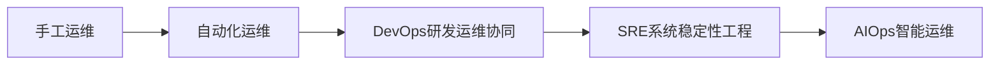
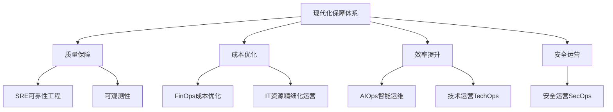
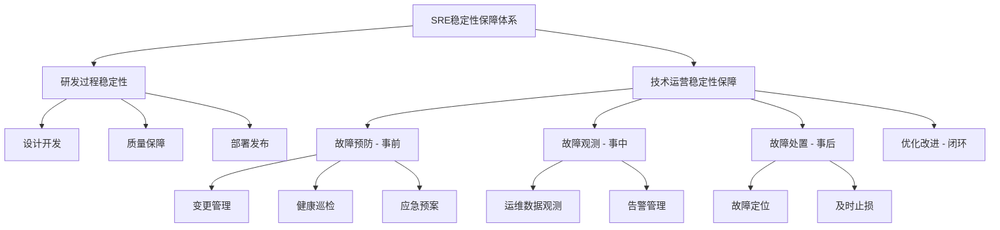
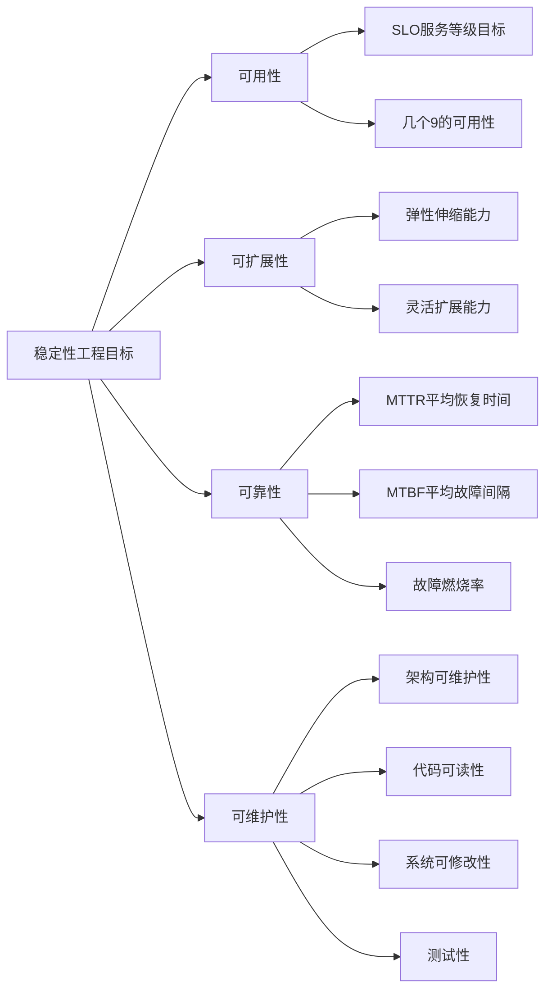
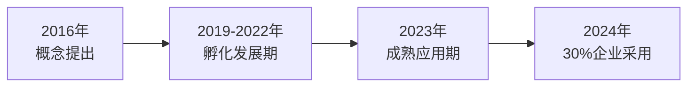
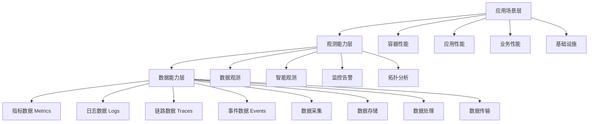
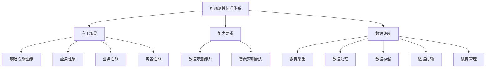
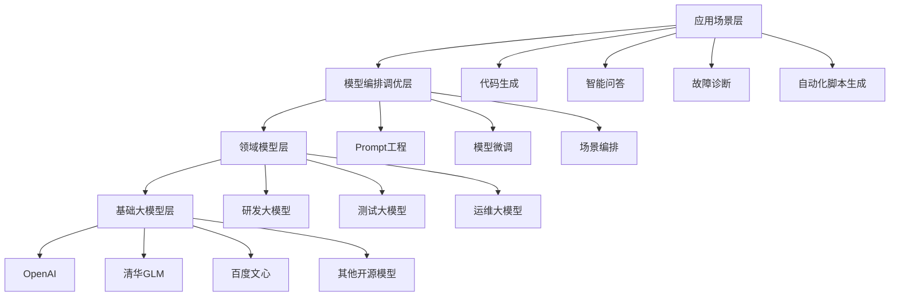
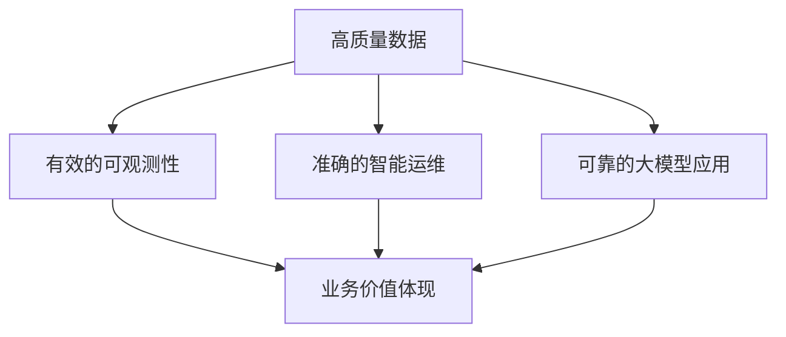
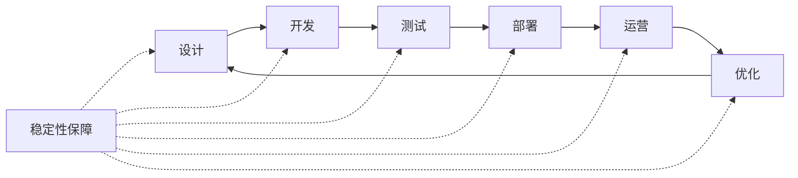

# 新时代研发运营体系下的系统可靠性与可观测性能力实践

> 来源：未核验 · 类型：分享 · 状态：draft

> 分享嘉宾：白璐 - 中国信息通信研究院云计算与大数据研究所工程师

## 嘉宾简介

白璐老师专注于IT研发运营领域研究，研究方向包括：
- DevOps研发运维协同
- AIOps智能运维
- SRE可靠性工程
- 可观测性
- 基础设施运营
- FinOps成本优化

主要成果：
- 参与编制《中国AIOps现状调查报告(2023)》
- 参与编制《中国FinOps现状调查报告(2023)》
- 参编《智能运维可观测性能力要求》
- 参编《IT基础资源运营成熟度模型》
- 参编《企业架构数字化治理》等多项标准

## 一、现代化运维保障体系概述

### 1.1 背景与发展历程

中国信息通信研究院(简称"信通院")成立于1957年，原为邮电部下的邮电科学研究院，2008年组建工信部，2014年正式更名为中国信息通信研究院。

**单位定位**：
- 国家高端智库
- 向上：部委支撑(政策文件、项目支撑)
- 向下：产业赋能

**典型案例**：通信大数据行程卡
- 由信通院牵头，联合三大运营商开发
- 积累了大规模系统稳定性保障经验
- SRE理论体系形成的重要实践基础

### 1.2 运维演进路径

运维领域的发展经历了以下阶段：

### 1.3 现代化保障体系框架

现代化保障体系围绕**质量、成本、效率、安全**四个核心维度构建：

**核心能力体系**：

1. **SRE(可靠性工程)**：保障系统稳定性和可靠性
2. **技术运营(TechOps)**：运维赋能业务，向运营转型
3. **AIOps(智能运维)**：AI技术助力运维提效
4. **可观测性(Observability)**：利用可观测性技术赋能传统运维
5. **FinOps(成本优化)**：精细化资源运营，降本增效
6. **运维工具能力**：支撑各项能力建设的工具平台
7. **运维大模型**：大模型赋能研发运维全生命周期
8. **运维数据治理**：运维数据能力的底层支撑

## 二、系统可靠性(SRE)能力建设

### 2.1 为什么需要关注系统稳定性

#### 2.1.1 典型故障案例(2023年)

| 时间 | 企业 | 事件 | 影响 |
|------|------|------|------|
| 1月 | 微软 | 服务中断 | 重大经济损失 |
| 11月 | 阿里云 | 系统重大故障 | 大量客户无法正常登录 |
| - | 滴滴 | 底层故障 | 无法打车、无法定位 |

#### 2.1.2 政策层面要求

**《关键信息基础设施安全保护条例》(2021)**：
- 明确要求建立固定流程保证关键信息基础设施安全稳定运行

#### 2.1.3 新环境下的挑战

**技术层面**：
- 技术架构日趋复杂
- 用户规模持续增长
- 企业规模不断扩大
- 技术迭代速度加快

**管理层面**：
- 稳定性不仅是技术问题，更是协同问题
- 涉及跨团队沟通与管理
- 需要体系化的保障机制

### 2.2 行程卡案例：高并发场景的稳定性保障

#### 2.2.1 面临的挑战

- **高并发压力**：春运期间单日查询量超过3亿次
- **关键时间节点**：节假日、春运等大规模人员流动时期
- **国家级服务水平**：远超单个企业级别的访问量

#### 2.2.2 保障措施

1. **优化技术架构**：提升系统容量
2. **建立机制流程**：标准化故障处理流程
3. **持续优化改进**：形成稳定运行能力

### 2.3 SRE标准体系框架

#### 2.3.1 标准体系结构

SRE标准从**研发过程**和**技术运营**两个维度构建：

#### 2.3.2 研发过程稳定性能力

**1. 设计开发阶段**
- SLA/SLO指标设定
- 架构设计的稳定性考量
- 前置化稳定性校验

**2. 质量保障阶段**
- 单元测试
- 集成测试
- 功能测试
- 性能测试
- 多维度确保系统稳定性和可靠性

**3. 部署发布阶段**
- 标准化部署发布流程
- 减少人为错误和手动干预
- 提升自动化部署能力
- 提高部署成功率

#### 2.3.3 技术运营稳定性能力

**故障预防能力**：
- 变更管理
- 健康巡检
- 应急预案

**故障观测能力**：
- 运维数据观测
- 告警管理

**故障处置能力**：
- 故障定位
- 及时止损

**优化改进能力**：
- 持续优化机制
- 形成闭环能力

### 2.4 SRE能力成熟度评估

#### 2.4.1 成熟度分级

根据国际通用成熟度分析方法，将SRE能力分为五级：

| 等级 | 名称 | 阶段 | 特征 |
|------|------|------|------|
| L1 | 初始级 | 起步阶段 | 基础能力建设 |
| L2 | 发展级 | 发展阶段 | 能力体系化 |
| L3 | 稳健级 | 优化阶段 | 成熟企业对标水平 |
| L4 | 引领级 | 领先阶段 | 行业标杆 |
| L5 | 卓越级 | 卓越阶段 | 业界最佳实践 |

#### 2.4.2 稳定性工程四大目标

**1. 可用性(Availability)**
- 核心指标：SLO(Service Level Objective)
- 目标：达到几个9的服务可用性

**2. 可扩展性(Scalability)**
- 提高系统灵活性
- 支持业务快速增长

**3. 可靠性(Reliability)**
- MTTR(Mean Time To Repair)：平均恢复时间
- MTBF(Mean Time Between Failures)：平均故障间隔
- 故障燃烧率等指标

**4. 可维护性(Maintainability)**
- 架构层面：易于维护的系统设计
- 工具层面：完善的工具能力
- 代码层面：可读性、可修改性、测试性

## 三、可观测性(Observability)能力建设

### 3.1 可观测性发展现状

#### 3.1.1 发展历程

**市场预测**：
- 2024年：30%的企业通过可观测性提升数字化业务运行能力
- 2023年：全球可观测性市场规模达到164.94亿美元

#### 3.1.2 可观测性定义

可观测性是指**观察系统内部状态、行为和性能的能力**，让团队能够：
- 更好地理解系统内部运作情况
- 快速分析和定位问题
- 支持数据驱动的决策

**核心特征**：打通三大数据类型(Metrics、Logs、Traces)

### 3.2 可观测性实践现状(2023年调研数据)

#### 3.2.1 能力建设现状

- **50%以上**的企业已开始建设可观测性
- 可观测性已进入企业视野，成为主流实践

#### 3.2.2 重点关注场景(Top 3)

1. **应用性能监控(APM)**
2. **业务性能监控**
3. **容器性能监控**

### 3.3 可观测性实践路径

#### 3.3.1 建设路径三层架构

**底层能力**：数据能力
- 打通指标数据(Metrics)
- 打通日志数据(Logs)
- 打通链路数据(Traces)
- 打通事件数据(Events)

**中层能力**：观测能力
- 监控能力
- 报表展示
- 链路分析
- 拓扑结构
- 智能分析

**上层能力**：场景赋能
- 容器性能观测
- 应用性能观测
- 业务性能观测
- 基础设施观测

#### 3.3.2 可观测性与监控的区别

可观测性 > 监控：
- **监控**：被动告警，问题发现
- **可观测性**：主动洞察，横向打通，全景视图

**核心价值**：
- 业务全过程透明化
- 实现全景监控
- 支持智能运维
- 实现自愈修复

### 3.4 可观测性标准体系

#### 3.4.1 标准架构

#### 3.4.2 四大应用场景能力要求

**1. 基础设施性能**
- 支持基础架构可视化展示
- 展示资源间调用链路
- 展示资源依赖关系
- 基础资源监控
- 网络带宽监控

**2. 应用性能(APM)**
- 支持告警规则配置
- 应用性能异常告警
- 基于指标和基线的智能告警
- 应用调用链路追踪
- 性能瓶颈分析

**3. 业务性能**
- 业务趋势预测
- 业务健康度评估
- 业务多维度下钻分析
- 业务价值体现
- 业务与技术关联

**4. 容器性能**
- 容器资源监控
- 动态容量扩缩容
- 容器编排可观测
- K8s集群监控

#### 3.4.3 能力成熟度分级

同样采用L1-L5五级成熟度模型：
- **L1 初始级**：基础监控能力
- **L2 发展级**：数据打通，基础可观测
- **L3 稳健级**：全栈可观测，场景化应用
- **L4 引领级**：智能化可观测，业务深度融合
- **L5 卓越级**：自适应可观测，全自动化

### 3.5 可观测性建设成效

根据调研数据，企业通过可观测性建设实现：

**1. 降低故障率**
- 通过全栈观测能力，提前发现潜在问题
- 减少生产环境故障发生

**2. 提升监控覆盖率**
- 监控覆盖率达到100%
- 消除监控盲区

**3. 缩短故障定位时间**
- MTTR显著降低
- 快速定位问题根因

**4. 赋能业务透明化**
- 业务与技术打通
- 技术价值可量化

### 3.6 可观测性建设关键成功要素

根据2023年中国AIOps现状调查报告，可观测性建设的关键要素包括：

#### 3.6.1 建设必要性认知

**最高优先级**：数据融合与关联能力(得票率最高)

#### 3.6.2 先决条件(Top 2)

1. **统一的数据平台**
   - 统一数据采集
   - 统一数据存储
   - 统一数据分析
   - 统一数据展示

2. **数据关联能力**
   - Metrics、Logs、Traces关联
   - 业务与技术数据关联
   - 跨域数据关联

**核心结论**：优秀的可观测性建设必须基于高质量的数据平台支撑

#### 3.6.3 期望解决的问题(Top 2)

1. **加快故障定位和解决**
   - 提升故障响应效率
   - 缩短MTTR

2. **支持数据分析和挖掘**
   - 业务洞察
   - 价值体现

## 四、智能运维(AIOps)与大模型赋能

### 4.1 AIOps智能运维体系

#### 4.1.1 智能运维定义

通过AI技术赋能传统运维，让运维变得更加：
- **轻量化**：减少人工操作
- **智能化**：自动分析决策
- **高效化**：提升运维效率

#### 4.1.2 运维面临的挑战(2023年调研)

**Top 3挑战**：

1. **运维价值难以呈现**(得票率最高)
   - 研发和测试的价值明确
   - 运维价值难以量化
   - "有事找运维，无事无运维"

2. **运维数据治理困难**
   - 数据分散
   - 数据质量参差不齐
   - 缺乏统一治理

3. **技术架构复杂度提升**

#### 4.1.3 智能运维成熟度模型

智能运维能力通过**执行、感知、分析、决策、支持、更新**五个维度进行评估：

| 等级 | 执行 | 感知 | 分析 | 决策 | 更新 | 特征描述 |
|------|------|------|------|------|------|---------|
| L1 | 系统 | 人工 | 人工 | 人工 | 人工 | 自动化执行 |
| L2 | 系统 | 系统 | 人工 | 人工 | 人工 | 基础监控 |
| L3 | 系统 | 系统 | 系统 | 人工 | 人工 | 智能分析 |
| L4 | 系统 | 系统 | 系统 | 系统 | 人工 | 智能决策 |
| L5 | 系统 | 系统 | 系统 | 系统 | 系统 | 自主运维 |

**行业现状**：
- 大部分企业处于**L2-L3**阶段
- 少数企业达到**L4**
- **L5**阶段极少(期待大模型突破)

#### 4.1.4 智能运维标准体系

信通院牵头制定了**国内和国际第一个智能运维标准**：

**1. 通用能力要求标准**
- 面向对象：企业自建智能运维能力
- 关注点：能力建设
- 内容：各阶段应具备的能力项

**2. 系统工具标准**
- 面向对象：智能运维工具平台
- 关注点：工具功能
- 内容：平台应具备的功能清单

**标准特点**：
- 联合60-70家头部企业共同编制
- 覆盖互联网、金融、通信等多个行业
- 参与单位包括：阿里、腾讯、百度、IBM、亚马逊云、工商银行、农业银行、中国移动、中国联通等

**国际标准成果**：
- 2023年在ITU(国际电信联盟)正式发布
- 基于中国实践的国际标准
- 历时3年编制完成

### 4.2 FinOps精细化运营

#### 4.2.1 FinOps兴起背景

**宏观背景**：
- 全球经济环境挑战
- 后疫情时代企业增长放缓
- 业务增长减缓但IT成本持续增加

**核心问题**：
> 业务增长减缓甚至下滑，为什么IT投入还要持续增加？

**政策导向**：
- 国资委多次提出加强成本管控
- 实现科学经济运营
- 每笔投资都要花在刀刃上

#### 4.2.2 FinOps定义与扩展

**原始定义**：云上成本优化

**扩展定义**：IT资源精细化运营
- 不仅限于云上资源
- 覆盖全部IT基础设施
- 从粗放式管理到精细化管理
- 目标：降本增效

**核心理念**：
- 不是单纯省钱
- 而是把钱花在更关键和更有效的地方
- 提升资源使用效率

#### 4.2.3 FinOps实践现状(2023年调研)

**资源浪费情况**：
- 80%的企业存在资源浪费
- 15%的企业资源过度冗余

**建设阶段分布**：
- 90%以上的企业已开始建设
- 大多数处于初期阶段
- 工具和方法相对薄弱
- 主要依赖制度和使用规范

**能力建设短板**：
- 高阶能力建设欠缺
- 自动化程度不足
- 数据驱动能力弱

#### 4.2.4 FinOps国际趋势

**Google Trends数据**：
- 2023年"FinOps"搜索量增长410倍

**CNCF云原生报告**：
- 多次提及FinOps
- 成为云原生关键实践

**Flexera云计算报告**：
- FinOps成为协同用云的最大挑战
- 十年来首次位居第一

#### 4.2.5 信通院FinOps标准体系

**两大标准**：

1. **云上FinOps标准**
   - 聚焦云资源成本优化
   - 云服务成本管理

2. **IT资源精细化运营标准**
   - 覆盖全IT生命周期
   - 融入FinOps理念
   - 从粗放化向精细化转型

**生态建设**：
- 成立FinOps产业推进方阵
- 与Linux基金会FinOps基金会合作
- 定期举办沙龙和行业调研

### 4.3 运维大模型

#### 4.3.1 大模型赋能研发运维

随着第四次信息技术变革，大模型技术为研发运维带来新机遇。

**研发运维大模型标准**：
- 目标：探索大模型赋能研发运维全生命周期
- 进展：已完成初稿，计划2024年Q3送审

#### 4.3.2 运维大模型架构

**架构层次**：

1. **基础大模型层**
   - OpenAI GPT系列
   - 清华GLM系列
   - 百度文心一言
   - 其他开源大模型

2. **领域模型层**
   - 通用研发大模型
   - 通用测试大模型
   - 通用运维大模型
   - 基于私域/公域数据训练

3. **模型编排调优层**
   - 数据准备与治理
   - 模型微调
   - Prompt工程
   - 场景编排

4. **应用场景层**
   - 赋能研发、测试、运维各环节

#### 4.3.3 运维大模型落地场景

**成熟场景**：

1. **专家知识库与智能问答**
   - 运维知识管理
   - 智能问答系统
   - 经验沉淀

2. **自动化脚本生成**
   - 运维脚本自动生成
   - 提升编写效率
   - 减少人为错误

**探索场景**：

3. **故障处理增强**
   - 故障智能定位
   - 故障预防
   - 根因分析
   - 自动化修复建议

**期望方向**：
企业最希望大模型在故障处理方面提供更强能力支持

### 4.4 运维数据治理

#### 4.4.1 数据治理的重要性

**现状**：
- 运维数据治理领域相对空白
- 理论体系不完善
- 标准规范欠缺

**重要性**：
- 数据是智能运维的基础
- 数据质量直接影响算法准确度
- 高质量数据是可观测性的前提

#### 4.4.2 标准制定计划

**目标**：
- 2024年牵头制定运维数据治理标准
- 联合产业头部企业
- 通过标准化手段规范运维数据治理
- 为企业提供参考框架

**意义**：
- 填补行业空白
- 提升数据治理水平
- 支撑上层能力建设

## 五、评估体系与产业生态

### 5.1 评估认证体系

#### 5.1.1 评估成果

**智能运维系列评估**：
- 评估时间：数年持续开展
- 通过项目：30+项目
- 行业认可度高
- 覆盖多个行业领域

#### 5.1.2 评估价值

**对企业**：
1. 能力对标：了解自身在行业中的位置
2. 差距分析：识别能力短板
3. 规划指导：明确未来建设方向
4. 最佳实践：学习行业领先经验

**对行业**：
1. 树立标杆
2. 推动标准落地
3. 促进经验交流
4. 提升整体水平

### 5.2 中国AIOps现状调查报告

#### 5.2.1 报告概况

- **发起时间**：已连续发布3年
- **2024年工作**：第四期调查已启动
- **参与方式**：开放参与，填写问卷
- **报告形式**：公开发布，电子版免费提供

#### 5.2.2 调研内容

**主要维度**：
1. 智能运维能力建设现状
2. 可观测性实践情况
3. FinOps建设进展
4. 常用工具和平台
5. 面临的挑战和需求
6. 未来建设方向

**参与价值**：
- 了解行业趋势
- 对标自身能力
- 获取完整报告
- 参与行业讨论

#### 5.2.3 2024年调查计划

- **问卷编辑**：2024年5-6月
- **正式发放**：2024年6月中旬
- **线上研讨**：定期举办
- **报告发布**：2024年底

**参与方式**：
- 关注信通院公众号
- 加入调研工作群
- 参与问卷填写
- 参加线上研讨会

### 5.3 产业合作与生态建设

#### 5.3.1 标准编制模式

**开放协同**：
- 非闭门造车
- 联合产业头部企业
- 汇聚优秀实践经验
- 形成行业共识

**参与企业类型**：
1. **互联网企业**：阿里、腾讯、百度等
2. **外企**：IBM、亚马逊云等
3. **金融机构**：工商银行、农业银行等
4. **运营商**：中国移动、中国联通等
5. **其他行业**：覆盖多个领域

**标准特点**：
- 视角全面：60-70家企业共同参与
- 实践导向：基于真实落地经验
- 持续更新：跟踪技术发展趋势

#### 5.3.2 国际标准化

**成果**：
- 在ITU发布国际智能运维标准
- 中国实践走向国际
- 提升国际话语权

#### 5.3.3 生态活动

**定期活动**：
1. **Pilot领航者计划**：运维保障能力提升项目
2. **产业沙龙**：定期技术交流
3. **行业调研**：现状调查与趋势分析
4. **标准宣贯**：标准解读与培训

## 六、核心观点总结

### 6.1 关键成功要素

#### 6.1.1 数据是基础

无论是智能运维、可观测性还是大模型应用，**高质量的数据能力**是基础：

**数据能力建设要点**：
1. 统一数据采集
2. 标准化数据存储
3. 智能化数据处理
4. 全面的数据治理

#### 6.1.2 指标体系是抓手

成功的稳定性保障实践都是从**指标体系**出发：

**核心指标**：
- **SLA/SLO**：服务等级协议/目标
- **MTTR**：平均恢复时间
- **MTBF**：平均故障间隔
- **故障燃烧率**
- **变更成功率**
- **告警准确率**

#### 6.1.3 体系化建设

避免单点建设，需要**体系化、全生命周期**的思考：

#### 6.1.4 业务价值导向

技术建设最终要**服务业务**，体现价值：
- 业务透明化
- 价值可量化
- 技术赋能业务
- 业务理解技术

### 6.2 未来发展趋势

#### 6.2.1 短期趋势(1-2年)

1. **可观测性成为标配**
   - 从监控向可观测性演进
   - 数据打通成为基本要求

2. **FinOps持续升温**
   - 降本增效成为刚需
   - 精细化运营普及

3. **大模型初步应用**
   - 知识库和问答场景落地
   - 脚本生成工具普及

#### 6.2.2 中期趋势(3-5年)

1. **智能运维达到L3-L4**
   - 智能分析普及
   - 部分智能决策能力

2. **大模型深度应用**
   - 故障自动诊断
   - 智能根因分析
   - 自动化修复建议

3. **数据治理成熟**
   - 完善的治理体系
   - 高质量数据支撑

#### 6.2.3 长期愿景(5年+)

1. **自主运维(L5)**
   - 大模型推动的运维革命
   - 高度自动化和智能化

2. **业务技术深度融合**
   - 技术价值充分体现
   - 业务驱动的技术演进

3. **运维即服务**
   - 平台化、服务化
   - 运维能力对外赋能

### 6.3 给SRE工程师的建议

#### 6.3.1 能力建设方向

1. **夯实数据基础**
   - 掌握数据采集技术
   - 理解数据治理方法
   - 提升数据分析能力

2. **建立指标思维**
   - 学习SLI/SLO体系
   - 掌握可靠性指标
   - 建立度量意识

3. **拥抱新技术**
   - 学习可观测性技术
   - 了解智能运维算法
   - 关注大模型应用

4. **培养业务意识**
   - 理解业务价值
   - 学会价值表达
   - 技术服务业务

#### 6.3.2 学习资源

1. **关注信通院公众号**
   - 获取最新标准
   - 参与行业调研
   - 了解发展趋势

2. **参与评估认证**
   - 对标行业水平
   - 学习最佳实践
   - 获得能力认可

3. **加入社区生态**
   - 参与标准编制
   - 参加技术沙龙
   - 行业经验交流

## 七、Q&A精选

### Q1: 多云时代的运维保障体系该如何建设？

**A**: 建议从以下几个方面入手：

1. **研发运营全生命周期融入稳定性**
   - 设计阶段前置稳定性校验
   - 开发阶段嵌入稳定性能力
   - 测试阶段强化稳定性验证
   - 部署阶段保障稳定性

2. **建立故障管理体系**
   - 事前：预防机制（变更管理、健康巡检、应急预案）
   - 事中：观测能力（监控、告警、可观测性）
   - 事后：处置优化（快速恢复、根因分析、持续改进）

3. **建立指标体系**
   - 定义SLA/SLO
   - 跟踪MTTR、MTBF等关键指标
   - 监控故障燃烧率
   - 持续优化指标

### Q2: 可观测性建设都有哪些影响要素？

**A**: 最关键的影响要素是**数据能力**：

1. **数据质量**
   - 数据采集的完整性
   - 数据的准确性
   - 数据的及时性

2. **数据打通**
   - Metrics、Logs、Traces融合
   - 跨系统数据关联
   - 业务与技术数据关联

3. **数据平台**
   - 统一数据采集平台
   - 统一数据存储
   - 统一数据处理
   - 统一数据展示

4. **场景化应用**
   - 与容器性能结合
   - 与业务性能结合
   - 与应用性能结合

### Q3: 智能运维有哪些地方有待提升？哪些工具比较普及？

**A**: 

**有待提升的方面**：
1. **数据质量**：影响算法准确度的最大因素
2. **智能化程度**：大部分企业在L2-L3，需向L4-L5演进
3. **价值体现**：运维价值的量化和呈现
4. **跨域协同**：研发、测试、运维的协同效率

**工具普及情况**：
- 各大云厂商平台都集成了智能运维功能
- DevOps平台普遍包含智能运维模块
- 建议参与AIOps现状调查，获取详细工具清单

### Q4: 运维大模型除了专家知识库，还有哪些成熟的落地场景？

**A**: 目前相对成熟的场景包括：

1. **自动化脚本生成**
   - 根据需求自动生成运维脚本
   - 提升脚本编写效率
   - 减少语法错误

2. **智能问答**
   - 知识库智能检索
   - 运维经验问答
   - 故障案例查询

3. **故障处理增强**（探索阶段，企业最期待）
   - 故障智能定位
   - 根因分析
   - 修复建议生成
   - 故障预防

---

## 附录：联系方式与资源

### 官方公众号

**中国信通院云大所**
- 研发运营领域最新研究动态
- 标准发布与解读
- 生态活动通知

**中国信通院**
- 产业政策与趋势
- 技术白皮书发布
- 行业报告下载

### 参与方式

1. **标准编制**：联系信通院，参与标准制定
2. **能力评估**：申请智能运维/可观测性评估
3. **AIOps调研**：扫码加入2024年现状调查工作群
4. **Pilot计划**：参与领航者运维保障能力提升项目

### 相关资源

- 《中国AIOps现状调查报告(2023)》
- 《中国FinOps现状调查报告(2023)》
- 《智能运维能力成熟度模型》
- 《可观测性能力要求标准》
- 《SRE稳定性保障标准》
- 《IT资源精细化运营标准》

---

**文档整理**：基于白璐老师2024年技术分享
**整理时间**：2024年
**适用对象**：SRE工程师、运维工程师、稳定性保障工程师、技术管理者
