# 容错容灾的体系建设与实操性演练设计

> 来源：未核验 · 类型：分享 · 状态：draft


## 一、概述

### 1.1 容错容灾的背景

容错容灾源于**业务连续性管理（BCM）**的范畴，主要针对企业业务的非计划性问题产生的影响，制定业务连续性保障计划，控制企业经营风险，为客户提供优质服务。

### 1.2 容错容灾的核心理念

> **容错容灾是一种能力建设，而不是一种资源配置**

早期的误区是投入大量资源、购买设备、建设容灾机房，但真正重要的是系统能否切换、能否双活运行、能否完全承载业务。这需要以**结果导向**而非投入导向来衡量。

## 二、容错容灾体系的构成

### 2.1 三类场景分类

容错容灾体系涵盖以下三类场景：

#### 2.1.1 小概率、大影响的灾难性场景
- 主数据中心因电力、网络原因导致整体系统切换
- 需要切换到容灾中心或同城双活中心
- 概率小但影响极大

#### 2.1.2 高概率、大影响的严重故障
- 严重故障和错误场景
- 容灾不等于切换，需要强调**容错**能力
- 包括系统级故障、应用异常等

#### 2.1.3 部分客户影响场景
- 系统正常但应用程序存在逻辑bug
- 基础数据问题导致部分客户无法完成交易
- 需要针对性的容错处理机制

### 2.2 体系建设的三个核心部分

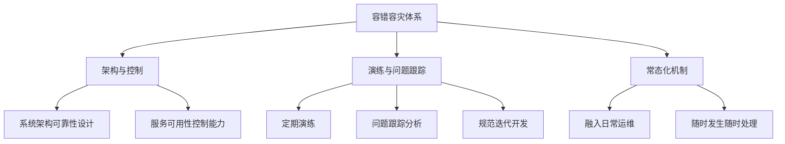

### 2.3 监控事件、容错场景与容灾场景的区别

| 类型 | 复杂度 | 影响范围 | 处置方式 | 业务参与 |
|------|--------|----------|----------|----------|
| **监控事件** | 低 | 小 | 简单处理（如重启服务、清理队列） | 无需 |
| **容错场景** | 中 | 中 | 需要人工介入+系统关联处理 | 技术主导 |
| **容灾场景** | 高 | 大 | 跨系统协同+业务流程配合 | 业务必须参与 |

## 三、容错容灾的主要场景

### 3.1 应用系统层面场景

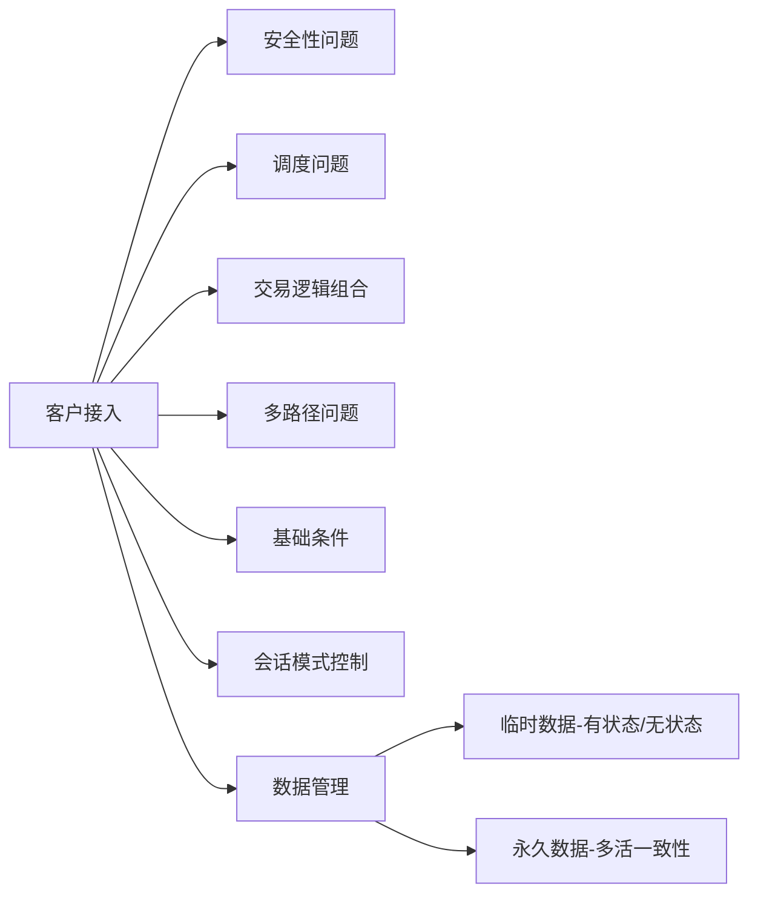

### 3.2 典型场景示例

#### 3.2.1 交易流程组合问题
- **案例**：信贷流程复杂，无法重走流程
- **解决方案**：建立错误临时处置机制

#### 3.2.2 批量交易并发问题
- **案例**：代发工资等大批量文件并发处理
- **风险**：锁机制控制不当导致重复发放
- **要求**：严格的并发控制和锁机制

#### 3.2.3 长期历史归档数据
- **要求**：容灾中心数据必须对等
- **标准**：银行数据至少保留15年
- **关键**：两个数据中心数据完全一致

## 四、可靠性设计 - 容错容灾的基础

### 4.1 可靠性设计体系

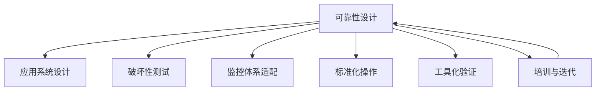

### 4.2 差异化架构设计

#### 4.2.1 接入类系统
**特点**：
- 直接面向客户（网银、手机银行）
- 高并发、需要弹性扩展

**关键设计**：
- 多活架构
- 弹性扩展能力
- 多路接入
- **会话一致性**（跨中心双活的重点）

**注意事项**：
- 负载均衡策略与应用程序开发必须配套
- 同步/异步交易的通路一致性
- 连接池化后的会话管理

#### 4.2.2 业务逻辑平台
**特点**：
- 业务逻辑一致性要求高
- 数据处理逻辑复杂

**关键设计**：
- 落地数据的多路径执行
- 共享文件系统（NAS）
- 不同业务通道的文件目录隔离

#### 4.2.3 核心系统
**特点**：
- 交易时间要求最严格
- 对可靠性要求最高

**设计原则**：
- **简单可控**
- 小型机/主机 + 简单HA
- HA资源配置最小化（仅基础组件+数据库）
- 切换时间可预期（10分钟内）
- 多次演练验证可靠性

#### 4.2.4 数据仓库类系统
**特点**：
- 非在线交易系统
- 监管报送、总账数据

**关键设计**：
- **数据来源必须与容灾切换配合**
- 数据抽取路径控制
- IP地址变更后的数据源切换
- 跨系统数据分发路径梳理

### 4.3 整体架构设计要点

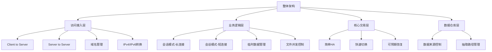

#### 4.3.1 访问接入控制
- **域名管理**：公网地址切换时的域名解析
- **端口管理**：容灾切换时的端口一致性
- **IPv4/IPv6**：协议转换的兼容性

#### 4.3.2 会话模式控制
- **长连接**：断链重连机制、协同控制
- **短连接**：多路径均衡、流量控制
- **流量配比**：根据后台系统位置动态调整

**案例**：核心系统从A中心切到B中心后，虽然二层打通但跨站点仍有延迟，需要调整前端接入层的流量配比。

#### 4.3.3 临时数据管理
- **有状态/无状态**：异步交易的状态管理
- **文件并发**：锁机制控制
- **多路径访问**：确保数据可达性

#### 4.3.4 交易类型支持

| 交易类型 | 特点 | 设计要点 |
|---------|------|----------|
| 单向联机交易 | 单向请求响应 | 简单可靠性设计 |
| 双向联机交易 | 互为端点 | 开端口+重连机制 |
| 单向批量交易 | 文件传输 | 落地文件管理 |
| 双向批量交易 | 双向文件交互 | 并发控制+锁机制 |

### 4.4 应用系统间调度控制

#### 4.4.1 负载均衡设计需求
**可靠性要求**：
- 无单点设计
- 运行状态可监测
- 单台/单中心支持最高并发

**性能要求**：
- 支持高并发场景
- 极端情况下的承载能力

**控制要求**：
- 提供标准API
- 支持自动化操作（启停、切换）
- 数据采集能力

#### 4.4.2 负载均衡策略
**短连接策略**：
- 流量配比
- 后台资源监控
- 异常处理

**长连接策略**：
- 无缝切换
- 断链重连

**跨中心策略**：
- 二层/三层网络差异处理
- 域名方式 vs IP方式
- 性能平衡

### 4.5 应用程序可靠性设计

#### 4.5.1 核心设计要点
- **用户重复访问控制**：多活多路径下的重复登录控制
- **负载均衡配套设计**：程序开发与负载均衡参数配套
- **二三层访问实现**：不同网络层的访问方式
- **业务逻辑容错**：
  - 异常中断后的断点续做
  - 正常和报错输出机制
  - 重复代发防护（锁机制）

#### 4.5.2 日志完整性控制
**日志类型**：
- 正常交易日志
- 异常报错日志（需分开）
- 标准化输出格式

**跨站点多路模式采集**：
- 异步交易进出不同通道
- 集中式日志采集
- 交易链路追踪能力
- 支持AIOps分析

### 4.6 应用系统可靠性设计

应用系统 = 应用程序 + Web Server + App Server + DB Server + 网络环境 + 负载均衡 + DNS + 访问控制 + HA

#### 4.6.1 核心要求
- **应用服务状态可监控可采集**
  - 进程监控（不够）
  - 端口监控（不够）
  - 心跳日志输出（每10-20秒输出状态）
  - 僵死检测机制

- **资源调用关系**
  - 数据库调用
  - 文件传输
  - 加解密设备
  - 调用关系的可靠性设计

- **持续运行控制**
  - 切换后的数据仓库卸数
  - 数据备份对象切换
  - 备份任务的双中心同步

**关键风险**：数据备份丢失是灾难性的，无法补救，必须确保两个中心数据完整一致。

### 4.7 数据库可靠性设计

#### 4.7.1 数据库场景分类

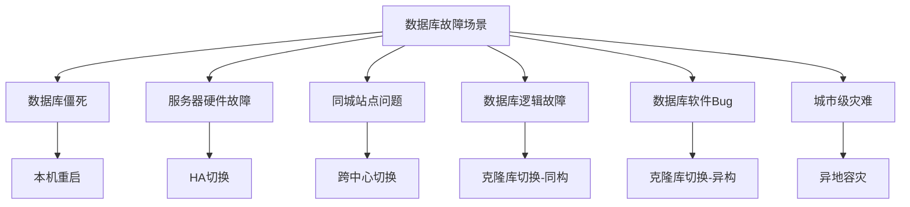

#### 4.7.2 应对策略

| 故障场景 | 应对策略 | 恢复时间 | 备注 |
|---------|---------|---------|------|
| 数据库僵死 | 本机重启 | 分钟级 | 最简单 |
| 硬件故障 | HA切换 | 10分钟内 | 需要简化HA资源配置 |
| 逻辑故障（坏块） | 同构克隆库 | 分钟级 | 防止坏块无法启动 |
| 软件Bug | 异构克隆库 | 分钟级 | 不同数据库软件 |
| 站点故障 | 跨中心切换 | 30分钟内 | 监管要求 |
| 最坏情况 | Backup恢复 | 数小时 | 必须有退路 |

**设计原则**：
- 运维必须每一步都有退路
- 日常必须做backup测试
- 确保备份可用
- HA配置要简单可控（资源最少化）

### 4.8 网络环境设计

#### 4.8.1 两地三中心架构

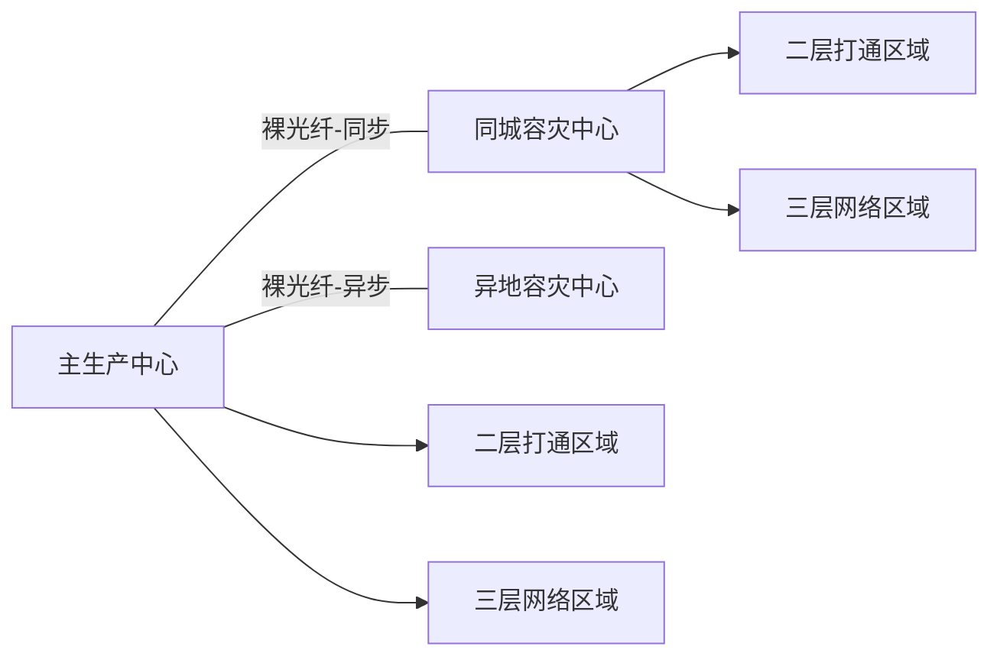

#### 4.8.2 二层网络设计
**适用系统**：核心类系统

**优势**：
- 同一IP地址段
- 切换简单
- 交易耗时小

**风险控制**：
- 控制纳入范围（主机数量少）
- 小型机为主
- 变更少
- 降低生成树风险

#### 4.8.3 三层网络设计
**适用系统**：网银、手机银行等

**要求**：
- Web/App/DB都要解决切换访问
- DNS支持或其他方案
- 应用连库的配置文件切换（A/B两套配置）

**存储网络**：
- 专门通道给存储同步
- 保证同城备份顺畅
- 不影响交易系统网络性能

### 4.9 存储资源设计

#### 4.9.1 存储类型与应用匹配

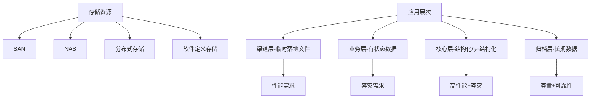

#### 4.9.2 设计要点
- 根据应用层次选择存储类型
- 结构化数据 vs 非结构化数据
- 性能要求 vs 容灾要求
- 有状态 vs 无状态
- 长期归档的对等性

### 4.10 备份与归档设计

#### 4.10.1 关键要求
- **两个中心数据必须对等**
- 备份任务耗带宽、耗流量
- 网络设计需单独二层通道
- 带宽控制
- 去重技术

#### 4.10.2 双中心备份调度

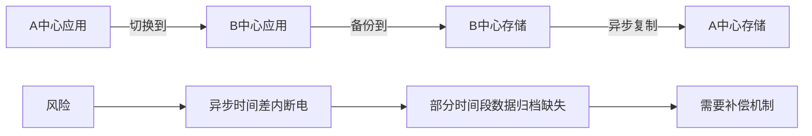

**风险控制**：
- 异步复制有时间差
- 断电可能导致部分归档缺失
- 必须有补偿机制
- 确保两中心数据完整一致

#### 4.10.3 国产化要求
早期备份软件未考虑跨中心多中心场景，需要向国产化备份软件提出功能需求：
- 跨中心管理能力
- 数据一致性保证
- 自动化调度能力

### 4.11 变更发布控制

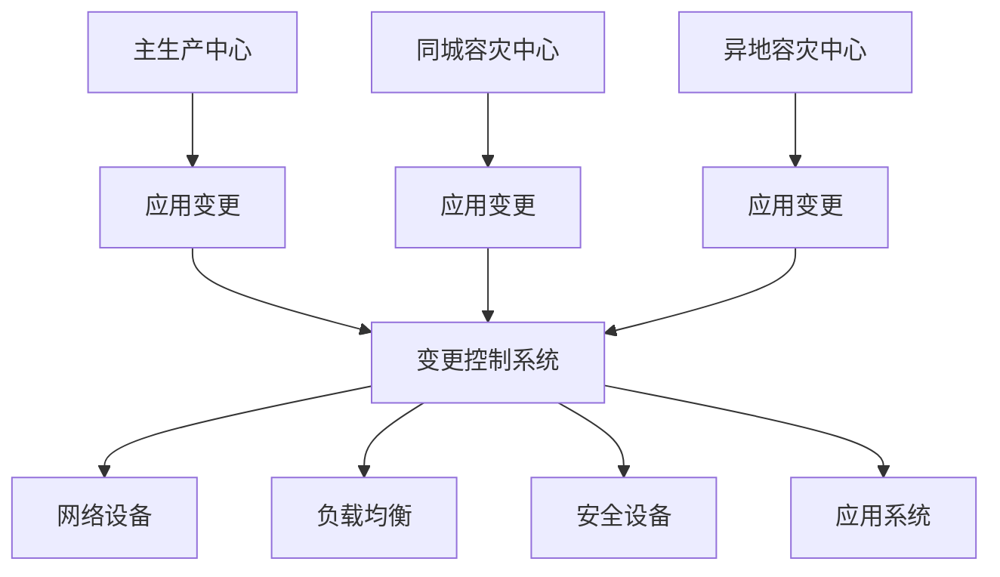

**关键风险**：
- 多活系统变更漏掉一个环节会导致逻辑错误
- 非多活系统变更漏掉，切换时才发现问题
- 涉及应用、网络、负载均衡、安全设备等多个层面

**解决方案**：
- 标准化变更流程
- 自动化运维工具
- 变更检查清单
- 配置管理数据库（CMDB）

## 五、可用性控制 - 容错容灾的核心能力

### 5.1 体系基本构成要素

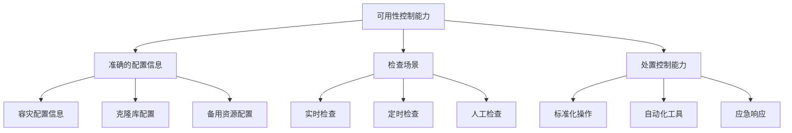

### 5.2 容灾配置管理

#### 5.2.1 配置信息内容
以应用系统为对象实体，梳理以下信息：

| 配置项 | 内容 |
|-------|------|
| 主中心环境 | 服务器列表、IP地址、用途、启停脚本、检查脚本 |
| 同城中心环境 | 对应的服务器、配置、脚本 |
| 跨中心共享资源 | 网络、存储、负载均衡等 |
| 容错环境 | 克隆库、备用资源 |

**管理方式**：
- 初期：手工维护表格
- 进阶：配置管理数据库（CMDB）
- 要求：变更后同步维护

#### 5.2.2 脚本标准化
- 放在标准目录下
- 便于运维自动化调用
- 统一的命名规范

### 5.3 场景管理

#### 5.3.1 场景定义要素
- **前提条件**：什么情况下触发
- **检查目的**：要确认什么
- **处置方法**：如何处理
- **授权机制**：谁来决策

#### 5.3.2 业务相关场景示例
**场景**：核心系统停机，客户紧急用款

**解决方案**：
- 利用克隆库查询最后时间点余额
- 建立紧急用款流程
- 授权机制
- 提供现金服务

### 5.4 容灾场景的时序控制

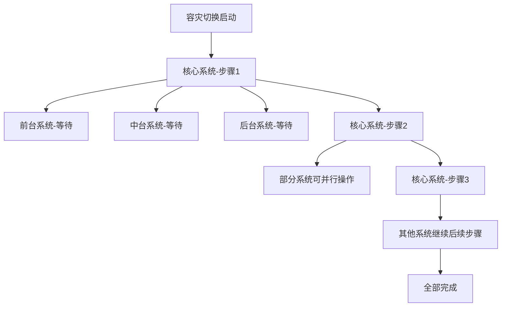

**关键点**：
- 十几个系统协同切换
- 严格的时序逻辑
- 哪些步骤可以并行
- 哪些步骤必须串行
- 依赖关系管理

### 5.5 操作标准化

#### 5.5.1 操作流程要素

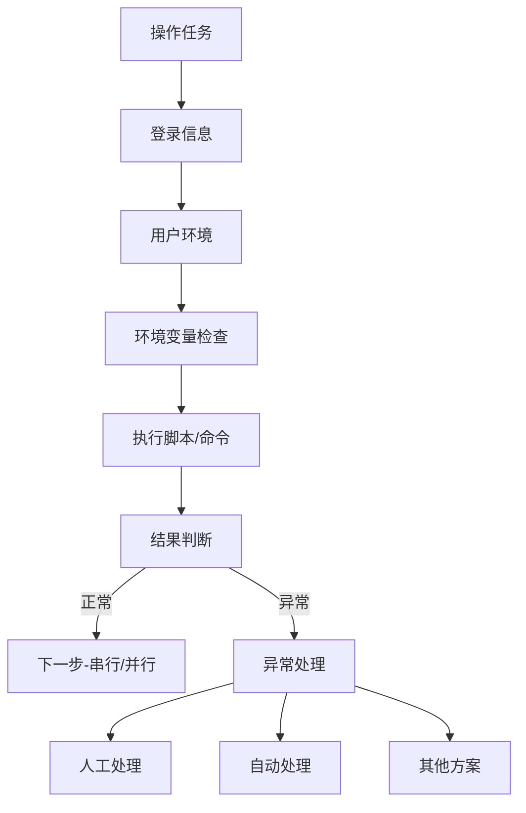

#### 5.5.2 标准化内容
- **登录信息**：IP地址、主机名
- **用户环境**：root用户或其他用户
- **环境变量**：确认环境正确
- **操作内容**：脚本名称或命令
- **结果判断**：正常输出是什么
- **后续动作**：串行还是并行
- **异常处理**：人工还是自动

**重要性**：这是工具化的基础，必须先标准化再自动化。

### 5.6 流程自动化

#### 5.6.1 三层流程设计

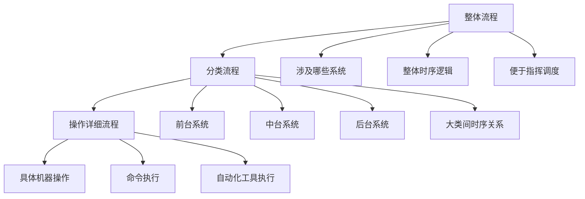

#### 5.6.2 自动化实施
- **一键式切换**：基于标准化操作
- **大量节省时间**：并行处理多台机器
- **降低人为错误**：标准化执行
- **支持非专家操作**：一线值班人员可执行

**前提条件**：
1. 标准化操作流程
2. 充分验证
3. 工具化实现

## 六、有效监控体系 - 容错容灾的基础

### 6.1 监控与控制的关系

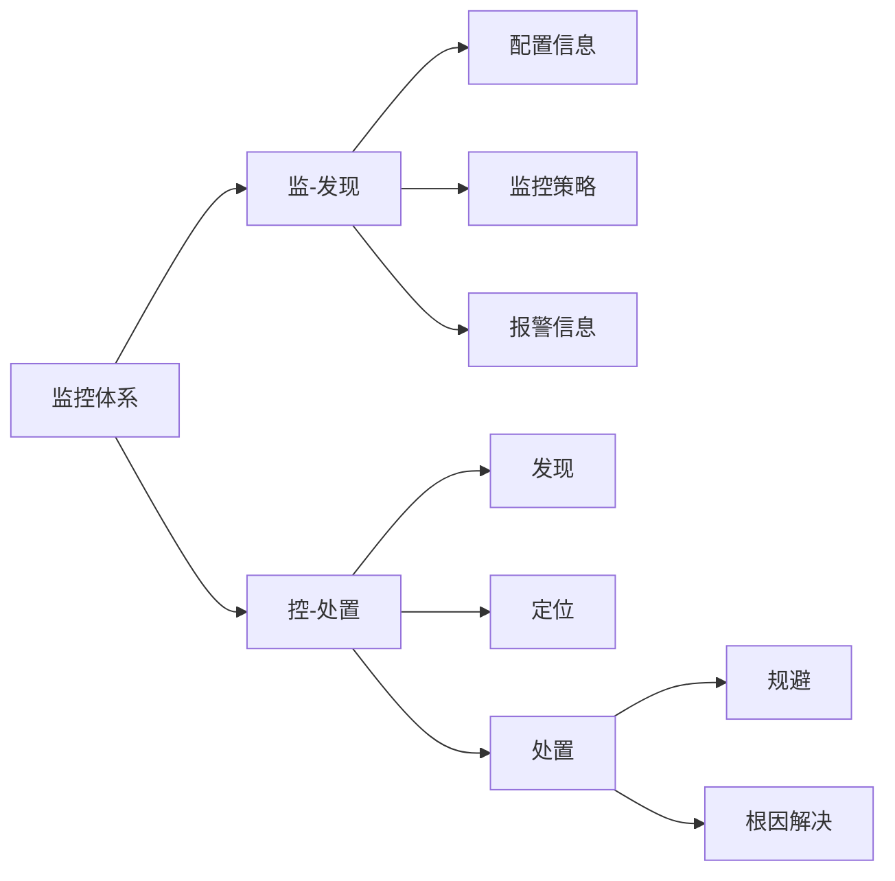

**关键理念**：
- 很多监控只做到"监"，没有"控"
- 发现问题必须能够处置
- 处置包括规避和根因解决

**规避示例**：
- 多路多活时某一路拥堵
- 直接停掉该路
- 避免客户进入堵塞通路

### 6.2 有效监控体系建设策略

#### 6.2.1 建设原则
- **以结果为导向**：能否发现故障
- **以配置为基础**：准确的配置信息
- **以有效指标衡量**：发现率、覆盖度、准确性

#### 6.2.2 有效性指标
- **发现率**：自身能发现多少故障（初期30%-40%）
- **覆盖度**：监控是否有死角
- **准确性**：减少无效报警

**持续改进**：
- 分析未发现故障的原因
- 补充监控策略
- 专家投入时间分析

### 6.3 监控配置档案

#### 6.3.1 与研发同步

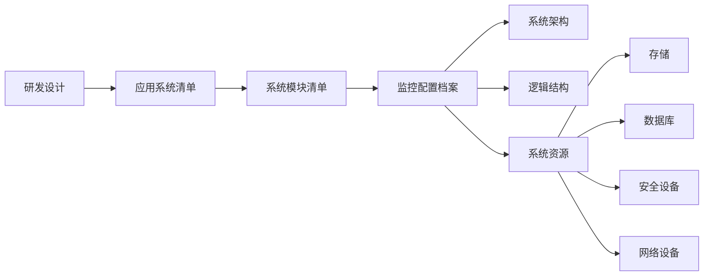

**关键问题**：
- 研发、运维、业务对系统数量认知不一致
- 必须统一系统清单
- 从设计阶段同步信息

#### 6.3.2 DevOps落地
监控配置档案是DevOps落地的基础：
- 研发与运维信息同步
- 配置管理数据库（CMDB）
- 自动化配置更新

### 6.4 监控策略设计

#### 6.4.1 策略类型
- **基础策略**：CPU、内存、磁盘、网络
- **服务策略**：进程、端口、心跳
- **业务策略**：交易量、响应时间、成功率
- **数据库策略**：连接测试（select 1）、日志报错、等待事件

#### 6.4.2 发现、定位、处置

**案例场景**：交易量归零，响应时间无穷大

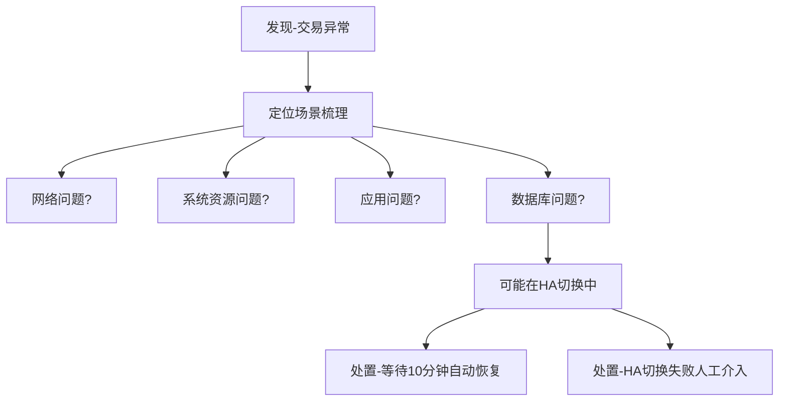

**关键点**：
- 定位场景列成表格
- 工具化自动检查
- 快速确定故障类型
- 针对性处置

### 6.5 监控与容灾管理集成

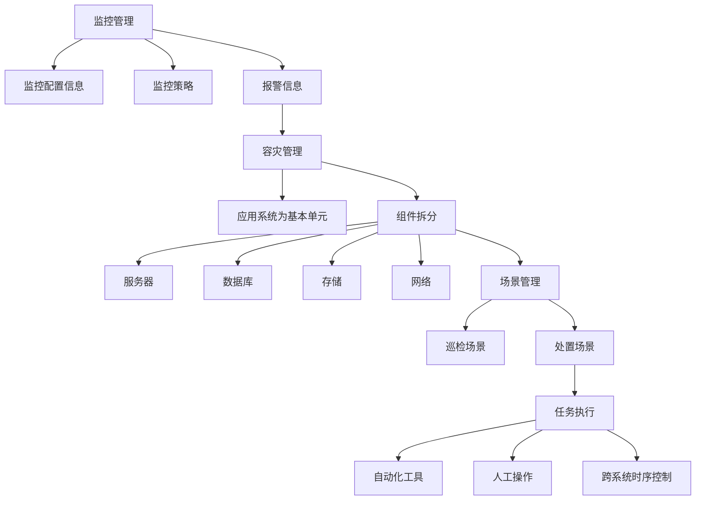

**集成要点**：
- 监控提供准确配置信息和报警
- 容灾管理以应用系统为单元
- 场景驱动的处置流程
- 跨系统协同控制

## 七、演练与实战

### 7.1 演练的目的与设计

#### 7.1.1 演练目的
- **发现问题**：不实操无法发现所有问题
- **分析原因**：找到问题根因
- **改进方法**：形成实战能力基础

#### 7.1.2 演练角色设计

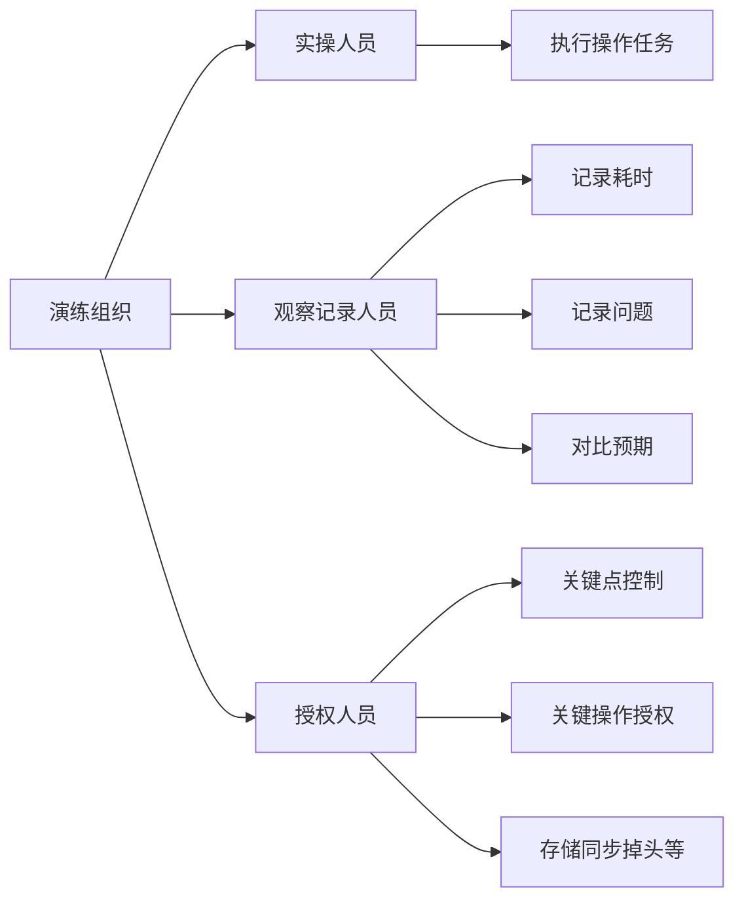

**重要提醒**：
- 必须详细记录
- 不能只记录大问题
- 细节问题也要记录
- 否则浪费演练机会

### 7.2 实操性演练验证

#### 7.2.1 性能验证
**验证目标**：切换后系统性能是否可接受

**案例**：核心系统切换到同城中心

| 指标 | 切换前 | 切换后 | 评估 |
|------|--------|--------|------|
| 响应率 | 基线 | 延迟几毫秒 | 可接受 |
| 成功率 | 基线 | 稍有下降 | 可接受 |
| 客户体验 | 2秒内 | 增加5毫秒 | 感知不明显 |

**结论**：
- 跨中心裸光纤有延迟
- 累积几十毫秒
- 在可接受范围内
- 确认容灾中心可用

#### 7.2.2 流量配比调整
- 核心系统切换后跨中心运行
- 前端接入层需要调整流量配比
- 快的路径调大
- 慢的路径调小
- 保证对外可用性

### 7.3 演练与实战的差异

#### 7.3.1 核心差异对比

| 维度 | 演练 | 实战 |
|------|------|------|
| **时间** | 有计划性，预先准备 | 不可预计，随时发生 |
| **准备** | 花费数月准备、测试 | 系统高频变更，可能未跟上 |
| **人员** | 专家操作 | 可能是一线值班人员 |
| **环境** | 所有环节经过测试 | 可能有环节未纳入控制 |
| **确定性** | 明确切换对象和关联系统 | 从小事件开始，不确定是否灾难 |
| **场景** | 确定的场景 | 随机性，不知道是哪种灾难 |

#### 7.3.2 实战挑战

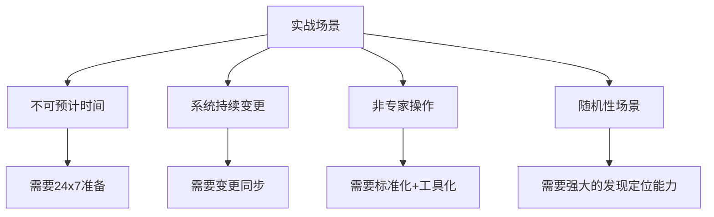

**应对策略**：
- 强大的发现、定位、处置能力
- 标准化操作流程
- 工具化支持
- 一线人员培训
- 常态化机制

### 7.4 从演练到实战能力

#### 7.4.1 持续改进循环

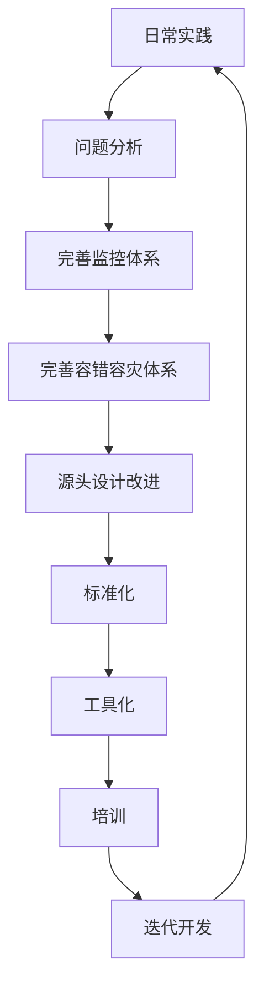

#### 7.4.2 客户问题容错处理案例
**场景**：代发工资，部分客户因数据问题无法发放

**分析原因**：
- 卡状态问题
- 历史数据问题
- 签约关系问题
- 应用bug

**解决方案**：
- 改进业务逻辑（长期）
- 开发错误处理工具（短期）
- 绕过业务逻辑特殊处理
- 确保客户利益

#### 7.4.3 实战能力建设路径
1. **标准化**：先标准化再自动化
2. **工具化**：基于标准化的自动化工具
3. **培训**：一线人员能力建设
4. **迭代**：持续改进完善
5. **常态化**：融入日常工作

## 八、常态化机制建设

### 8.1 与日常运维工作结合

#### 8.1.1 运维全生命周期集成

```mermaid
graph TD
    A[运维全生命周期] --> B[设计阶段]
    A --> C[投产阶段]
    A --> D[运维阶段]
    
    B --> B1[与研发共同设计]
    B --> B2[可靠性设计]
    
    C --> C1[投产质量控制]
    
    D --> D1[ITIL-事件管理]
    D --> D2[ITIL-问题管理]
    D --> D3[ITIL-变更管理]
    D --> D4[ITIL-配置管理]
    
    D4 --> E[配置管理数据库CMDB]
    
    E --> F[监控配置库]
    F --> G[监控工具]
    
    E --> H[容灾配置]
    H --> I[容灾管理]
    
    I --> J[场景检查]
    J --> K[场景处置]
    
    K --> L[运维自动化工具]
    L --> G
```

#### 8.1.2 配置管理流程

**CMDB核心作用**：
- 所有系统的配置信息源
- 支持监控配置生成
- 支持容灾配置管理
- 变更管理基础

**监控配置库**：
- 基于CMDB生成
- 包含所有被监控系统
- 包含所有监控策略
- 支持容灾场景识别

**容灾管理**：
- 从监控配置库获取信息
- 识别容灾相关场景
- 执行处置流程
- 调用运维自动化工具

### 8.2 变更管理与容灾同步

#### 8.2.1 变更管理要求

```mermaid
graph TD
    A[变更管理] --> B[ITIL变更流程]
    
    B --> C[标准变更]
    B --> D[常规变更]
    B --> E[紧急变更]
    
    B --> F[风险级别分类]
    
    C --> G[及时登记到CMDB]
    D --> G
    E --> G
    
    G --> H[监控管理员]
    H --> I[维护监控档案]
    I --> J[配置标准策略]
    J --> K[部署监控]
    
    G --> L[容灾管理员]
    L --> M[识别容灾场景]
    M --> N[标注容错/容灾]
    N --> O[更新配置/巡检/处置]
```

#### 8.2.2 角色职责

**应用系统管理员**：
- 遵循ITIL变更管理要求
- 及时登记变更到CMDB
- 确保配置信息准确

**监控管理员**：
- 生产对象必须维护到监控档案
- 配置标准和非标准监控策略
- 确保无死角、无漏洞

**容灾管理员**：
- 识别容灾相关部分
- 标注监控事件/容错场景/容灾场景
- 持续迭代更新验证

**系统管理员**（重要系统）：
- 识别自己系统的容错场景
- 配合容灾管理工作

### 8.3 常态化工作机制

#### 8.3.1 日常工作集成

```mermaid
graph LR
    A[日常工作] --> B[变更管理]
    A --> C[监控管理]
    A --> D[容灾管理]
    A --> E[问题管理]
    
    B --> F[CMDB更新]
    C --> F
    D --> F
    E --> F
    
    F --> G[自动触发]
    G --> H[监控更新]
    G --> I[容灾更新]
    
    H --> J[持续监控]
    I --> K[持续验证]
```

#### 8.3.2 自动化发现
- **IP资产扫描**：自动发现新增资源
- **配置变更检测**：自动发现配置变化
- **监控自动部署**：基于CMDB自动配置
- **容灾配置同步**：自动更新容灾配置

#### 8.3.3 持续验证
- **定期巡检**：自动化巡检脚本
- **场景验证**：定期验证容错场景
- **演练计划**：定期实操演练
- **问题跟踪**：持续改进机制

### 8.4 系统分级管理

#### 8.4.1 系统分级标准

**监管要求**：
- 重要系统必须报备
- RPO = 0（同城）
- RTO ≤ 30分钟

**内部分级**：

| 级别 | 业务影响 | 技术关键性 | 容灾要求 | 示例 |
|------|---------|-----------|---------|------|
| **关键系统** | 高 | 高 | 应用级容灾，两地三中心 | 核心系统、网银 |
| **重要系统** | 中 | 高 | 同城双活或2+1 | ESB、信贷平台 |
| **标准系统** | 低 | 中 | 数据备份 | 数据仓库、报表 |
| **非关键系统** | 低 | 低 | 基础备份 | 内部管理系统 |

#### 8.4.2 分级评估维度
- **业务影响度**：对客户服务的影响
- **业务损失**：潜在经济损失
- **技术关键性**：对其他系统的影响（如ESB）
- **监管要求**：合规性要求

**综合打分**：
- 达到一定分数以上配置容灾
- 根据分数确定容灾级别
- 同城双活 vs 2+1 vs 数据级

## 九、关键技术指标

### 9.1 容灾指标

| 指标 | 定义 | 同城要求 | 异地要求 |
|------|------|---------|---------|
| **RPO** | 数据恢复点目标 | 0（数据不丢失） | 分钟级（异步复制） |
| **RTO** | 恢复时间目标 | ≤30分钟（监管） | 小时级 |
| **切换时间** | 实际切换耗时 | 力求10分钟内 | - |
| **性能损失** | 切换后性能下降 | ≤5%（可接受） | - |

### 9.2 监控指标

| 指标 | 定义 | 目标 |
|------|------|------|
| **发现率** | 自动发现故障比例 | 从30%提升到90%+ |
| **覆盖度** | 监控覆盖系统比例 | 100%关键系统 |
| **准确率** | 有效报警比例 | 减少误报 |
| **响应时间** | 从发现到处置 | 分钟级 |

### 9.3 可用性指标

| 指标 | 定义 | 目标 |
|------|------|------|
| **系统可用性** | 年度可用时间比例 | 99.99%+ |
| **MTBF** | 平均故障间隔时间 | 持续提升 |
| **MTTR** | 平均修复时间 | 持续降低 |
| **成功率** | 交易成功率 | 99.9%+ |

## 十、最佳实践总结

### 10.1 核心原则

1. **容错容灾是能力建设，不是资源配置**
   - 以结果为导向
   - 注重实战能力
   - 持续迭代改进

2. **简单可控优于复杂高级**
   - 越简单越可预期
   - 越简单越可靠
   - 必须有退路

3. **标准化先于自动化**
   - 先手工标准化
   - 再工具化
   - 最后自动化

4. **监控必须有控制**
   - 不能只监不控
   - 发现必须能处置
   - 规避+根因解决

5. **常态化而非突击**
   - 融入日常工作
   - 持续验证
   - 随时准备

### 10.2 实施路线图

```mermaid
graph TD
    A[第一阶段-基础建设] --> B[第二阶段-能力建设]
    B --> C[第三阶段-常态化]
    
    A --> A1[可靠性设计]
    A --> A2[CMDB建设]
    A --> A3[监控体系]
    
    B --> B1[容灾配置]
    B --> B2[场景梳理]
    B --> B3[标准化操作]
    B --> B4[初步演练]
    
    C --> C1[工具化]
    C --> C2[自动化]
    C --> C3[定期演练]
    C --> C4[持续改进]
```

### 10.3 关键成功因素

#### 10.3.1 组织层面
- 高层重视和支持
- 跨部门协作（研发+运维+业务）
- 专职团队负责
- 充足的资源投入

#### 10.3.2 技术层面
- 架构可靠性设计
- 准确的配置管理
- 有效的监控体系
- 强大的自动化能力

#### 10.3.3 管理层面
- ITIL流程落地
- 变更管理严格
- 演练计划定期
- 问题持续跟踪

#### 10.3.4 人员层面
- 专家能力建设
- 一线人员培训
- 标准化操作
- 应急响应能力

### 10.4 常见误区

| 误区 | 正确做法 |
|------|---------|
| 只投资源不建能力 | 注重实战能力建设 |
| 只监不控 | 监控+控制+处置 |
| 只演练不实战 | 常态化验证 |
| 追求复杂高级 | 简单可控可靠 |
| 只关注工具 | 先标准化再工具化 |
| 突击式演练 | 融入日常工作 |
| 技术人员独立 | 业务+技术协同 |

### 10.5 未来发展方向

#### 10.5.1 技术演进
- **AIOps应用**：智能故障预测和处置
- **混合云容灾**：多云环境下的容灾
- **国产化替代**：国产软硬件的容灾方案
- **容器化**：云原生架构的容灾设计

#### 10.5.2 能力提升
- **自动化程度**：从部分自动到全自动
- **智能化水平**：从规则到AI
- **响应速度**：从分钟级到秒级
- **覆盖范围**：从核心系统到全系统

## 十一、Q&A精选

### Q1: 容灾可视化平台可以集成哪些指标？
**A**: 
- 跨中心双活系统的实时监控
- 各中心的流量分布
- 系统健康状态
- 配套巡检结果
- 切换演练记录

### Q2: Oracle数据库是否做跨站点双活？
**A**: 
- **不建议做跨站点双活**，原因：
  - 跨站点必然有延迟
  - 集群复杂性高
  - 故障处理复杂
  - 需要高级DBA维护
  
- **推荐方案**：
  - 单机够用就用单机
  - 简单HA（卷组切换）
  - 克隆库（1-2分钟切换）
  - 最坏情况backup恢复
  - **越简单越可预期越可靠**

### Q3: 自动化运维监控工具有什么要求？
**A**: 
- **首先明确**：
  - 哪些部件要监控
  - 监控策略是什么
  
- **工具选择**：
  - 开源工具（Zabbix等）
  - 商业工具（Tivoli等）
  - 根据需求选择
  
- **关键能力**：
  - 数据采集
  - 消息处理成结构化数据
  - **定位能力**（最重要）
  - **处置能力**（最关键）

### Q4: 同城双活建设中系统间如何互联互通？
**A**: 
- 双活系统间调用统一使用：
  - 浮动IP
  - 负载均衡
  - 域名方式
- 隔离系统间关联关系
- 实现跨中心业务互访

### Q5: 如何规避容灾应急切换的风险？
**A**: 
- **必须有退路**：B计划、C计划
- **数据库示例**：
  - A计划：HA切换
  - B计划：克隆库
  - C计划：Backup恢复（虽然慢但必须有）
- **首要原则**：业务和数据恢复优先，后果其次

### Q6: 容灾应急切换演练如何规划？
**A**: 
- **监管要求**：
  - 重要系统：RPO=0，RTO≤30分钟
  
- **分级管理**：
  - 综合打分（业务影响+技术关键性）
  - 达到分数线配置容灾
  - 根据分数确定级别
  
- **容灾级别**：
  - 同城双活
  - 2+1模式
  - 数据级容灾
  
- **投入产出平衡**：根据实际情况决策

---

## 附录：架构图示

### A1. 整体容错容灾体系架构

```mermaid
graph TD
    A[容错容灾体系] --> B[可靠性设计]
    A --> C[可用性控制]
    A --> D[演练与实战]
    A --> E[常态化机制]
    
    B --> B1[接入层设计]
    B --> B2[业务层设计]
    B --> B3[核心层设计]
    B --> B4[数据层设计]
    
    C --> C1[配置管理]
    C --> C2[场景管理]
    C --> C3[监控体系]
    C --> C4[处置能力]
    
    D --> D1[定期演练]
    D --> D2[问题分析]
    D --> D3[持续改进]
    
    E --> E1[CMDB]
    E --> E2[变更管理]
    E --> E3[自动化工具]
```

### A2. 两地三中心网络架构

```mermaid
graph TD
    A[主生产中心] -->|裸光纤同步| B[同城容灾中心]
    A -->|裸光纤异步| C[异地容灾中心]
    
    A --> A1[二层网络区-核心系统]
    A --> A2[三层网络区-渠道系统]
    A --> A3[存储专用通道]
    
    B --> B1[二层网络区-核心系统]
    B --> B2[三层网络区-渠道系统]
    B --> B3[存储专用通道]
    
    A1 -.二层打通.-> B1
    A3 -.专用通道.-> B3
```

### A3. 监控与容灾管理集成架构

```mermaid
graph LR
    A[CMDB] --> B[监控配置库]
    A --> C[容灾配置库]
    
    B --> D[监控工具]
    D --> E[报警信息]
    
    E --> F[容灾管理平台]
    C --> F
    
    F --> G[场景识别]
    G --> H[场景处置]
    
    H --> I[自动化工具]
    H --> J[人工操作]
    
    I --> K[跨系统协同]
    J --> K
```

---

**文档版本**: v1.0  
**整理日期**: 2025年  
**适用对象**: SRE、运维工程师、稳定性保障工程师、架构师  
**关键词**: 容错容灾、业务连续性、可靠性设计、可用性控制、应急演练、常态化机制

---

## 核心要点速查

### 三个核心问题的答案

#### 1. 实战与演练的区别及实施策略

**区别**：
- 演练：有计划、有准备、专家操作、确定场景
- 实战：随机发生、可能变更未跟上、一线人员、不确定场景

**实施策略**：
- 建立强大的发现-定位-处置能力
- 标准化操作流程
- 工具化支持
- 常态化验证
- 持续培训

#### 2. 可靠性设计与可用性控制的内容

**可靠性设计**：
- 差异化架构设计（接入层、业务层、核心层、数据层）
- 应用程序可靠性
- 数据库可靠性
- 网络环境设计
- 存储资源设计
- 备份归档设计
- 变更发布控制

**可用性控制**：
- 准确的配置信息
- 场景管理（检查+处置）
- 有效监控体系（监+控）
- 标准化操作
- 流程自动化

#### 3. 常态化系统质量控制能力

**融合路径**：
- CMDB作为配置信息源
- 变更管理严格执行
- 监控配置自动更新
- 容灾配置同步更新
- 定期巡检验证
- 持续迭代改进

**关键机制**：
- ITIL流程落地
- DevOps协作
- 自动化工具
- 分级管理
- 持续验证


