# SLA质量体系下的业务高可用建设

> 来源：未核验 · 类型：分享 · 状态：draft

> 分享嘉宾：李楠 - 趣丸科技业务运维负责人  
> 工作经验：10年，曾就职于畅游、联想、UC  
> 主要方向：SRE建设、高可用、容灾容错

## 目录

- [一、SLA质量体系与业务高可用的关系](#一sla质量体系与业务高可用的关系)
- [二、如何通过SLA驱动高可用建设](#二如何通过sla驱动高可用建设)
- [三、趣丸科技的实践与成效](#三趣丸科技的实践与成效)
- [四、总结与展望](#四总结与展望)

---

## 一、SLA质量体系与业务高可用的关系

### 1.1 核心关系

**用户体验的SLA是质量目标，高可用建设是达成手段**

- **SLA（服务等级协议）**：数字化驱动，可度量业务质量
- **高可用建设**：通过技术手段保障SLA目标达成
- **驱动方式**：通过数字化度量了解现状、目标和差距，指导投入方向

### 1.2 建设实践中的发现

在趣丸科技的实践中，SLA项目与高可用项目并行建设，通过SLA的数字化视角发现：

- ❌ **过度设计**：部分业务场景无需高等级的高可用建设
- ✅ **精准投入**：不同链路根据实际需求设计合适的高可用方案
- 🎯 **ROI合理**：避免资源浪费，实现投入产出比最优

### 1.3 需要回答的四个核心问题

1. 当前质量水平在哪里？
2. 目标在哪里？
3. 中间差距有多大？
4. 如何合理投入达成目标？

---

## 二、如何通过SLA驱动高可用建设

### 2.1 分层一体化架构

趣丸科技的SRE体系演进路线中，第二阶段实现了**四层分层一体化**：

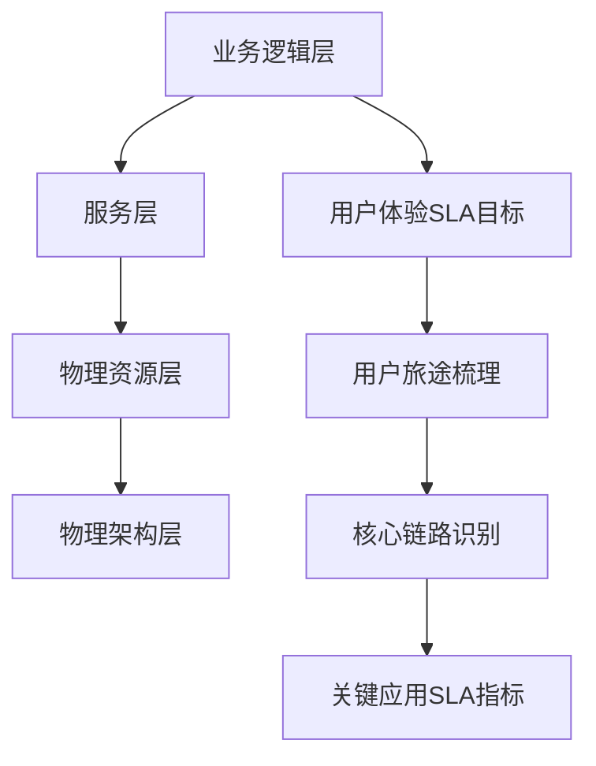

**四层架构说明：**

1. **业务逻辑层**：最上层，面向用户的业务功能
2. **服务层**：应用服务和微服务
3. **物理资源层**：计算、存储、网络资源
4. **物理架构层**：最底层的基础设施

### 2.2 SLA驱动三步走

#### 第一步：从业务前端获取用户体验SLA目标

- 明确用户可接受的服务质量标准
- 定义服务连续性要求
- 确定容忍范围（如5秒延迟）

#### 第二步：梳理用户旅途和核心链路

**案例：TT业务用户发货旅途**

用户视角的三步操作：
1. 查看礼物清单
2. 选择并下单
3. 后台发货并送达

实际涉及的交互链路：
- 客户端 ↔ 后端服务：10+ 个交互链路
- 后端服务 ↔ 第三方服务：多个依赖调用
- 已剔除非核心旁路链路

#### 第三步：横向扩展、纵向下沉

目标：**将SLA目标下沉到各个角落的功能组件**

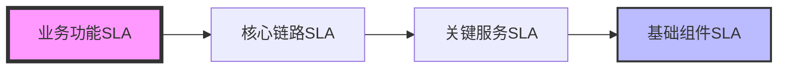

### 2.3 SLA协议体系

**SLA金字塔模型：**

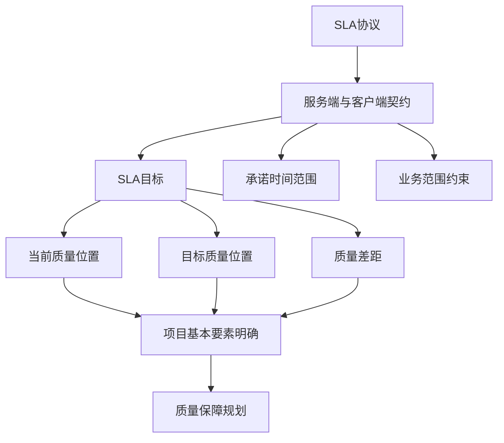

**SLA协议包含的核心要素：**

1. **SLA目标**：具体的质量指标（可用性、响应时间等）
2. **时间范围**：如Q2-Q3季度
3. **业务范围**：特定业务链路或功能模块
4. **当前质量**：baseline数据
5. **目标质量**：期望达到的水平
6. **差距分析**：需要提升的空间

### 2.4 SLA体系建设路径

**倒序建设流程：**

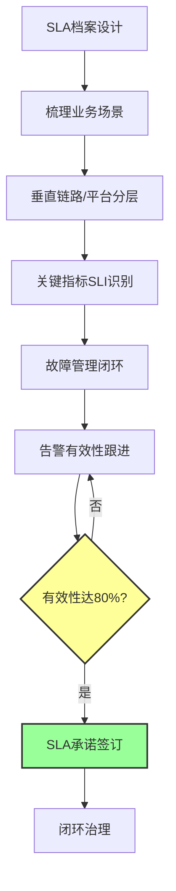

**为什么是80%有效性？**
- 80%是一个关键临界值
- 达到后可进行SLA问题闭环处理
- 保证监控告警的精准性和实时性

### 2.5 SLA黄金指标（SLI）

通过用户旅途梳理核心链路后，每个功能依赖的SLI包括：

- **可用性**：服务正常运行时间百分比
- **延迟**：请求响应时间
- **吞吐量**：单位时间处理请求数
- **错误率**：失败请求占比

这些指标纳入业务监控，进行有效性治理，支撑高可用建设。

---

## 三、趣丸科技的实践与成效

### 3.1 回答三个核心问题

#### 问题1：如何定义业务具备高可用能力？

**定义：**
> 业务具备高可用能力 = 明确高可用要素 + 在SLA目标牵引下建设 + 系统达到SLA预定目标 + 在合理ROI预期内

**三个关键点：**
1. ✅ 具备一定的要素
2. ✅ 达到SLA承诺
3. ✅ 投入产出比合理

**区别于传统高可用做法：**

| 传统做法 | SLA驱动做法 |
|---------|------------|
| 做了多云多活就是高可用 | 需要满足用户容忍范围 |
| 消除单点就是高可用 | 需要保证服务连续性 |
| 关注技术实现 | 关注用户体验和ROI |

**案例说明：**
- 用户容忍范围：5秒
- 故障切换时间：6秒
- 结论：虽然做了高可用，但用户感知到服务不连续，**高可用无效**

### 3.2 趣丸科技总结的十大高可用要素

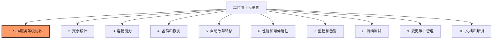

#### 要素详解

**1. SLA服务等级协议**
- 明确当前位置、目标、差距和时间
- 约束条件清晰后，确定建设程度
- 冷备、热备、多活等级对应不同恢复时效

**2. 冗余设计**
- 关键组件必须有备份
- 不能存在单点故障
- 根据SLA要求确定冗余级别

**3. 容错能力**
- 部分故障不影响整体服务
- 服务降级和熔断机制
- 故障隔离能力

**4. 备份和恢复**
- 数据备份策略
- 快速恢复机制
- 定期演练验证

**5. 自动故障转移**
- 故障自动切换
- 负载均衡策略
- 最小化人工介入

**6. 性能和可伸缩性（容量管理）**
- 线上故障的主要来源之一
- 容量规划至关重要
- 弹性伸缩能力

**7. 监控和告警**
- 监控告警精准、收敛、实时有效
- 告警出来即定位根因
- 支撑质量保障

**8. 持续测试**
- 从用户体验视角检验
- 黑盒方式验证高可用有效性
- 混沌工程实践

**9. 变更维护管理**
- 线上故障的另一大来源
- 变更流程规范化
- 灰度发布机制

**10. 文档和培训**
- 经验沉淀到文档和流程
- 工具平台化
- 知识传承

#### 问题2：逐层分析高可用建设方案

**链路分解与指标基准定义**

**物理环境假设：** 标准两地三中心

**网络可用性和延迟基准：**

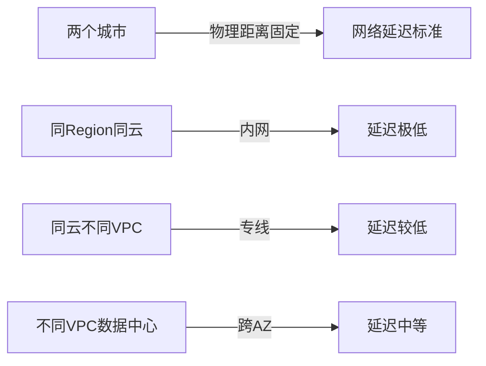

**业务逻辑分层（按请求距离数据层远近）：**

1. **接入层**：负载均衡、网关
2. **应用层**：业务服务
3. **中间件层**：缓存、消息队列
4. **数据层**：数据库、存储

**指标等级定义：**

| 等级 | 定义 | 说明 |
|------|------|------|
| 优秀 | 行业内顶尖 | 技术领先水平 |
| 良好 | 公司内优秀 | 可持续保持，转向功能迭代 |
| 及格 | SLA签订门槛 | 最低可接受标准 |
| 劣质 | 低于门槛 | 需要重新审视设计 |

**组件评估维度：**
- 影响范围
- 故障发生频次
- 故障恢复时效要求
- ROI评估

**趣丸科技技术架构：**

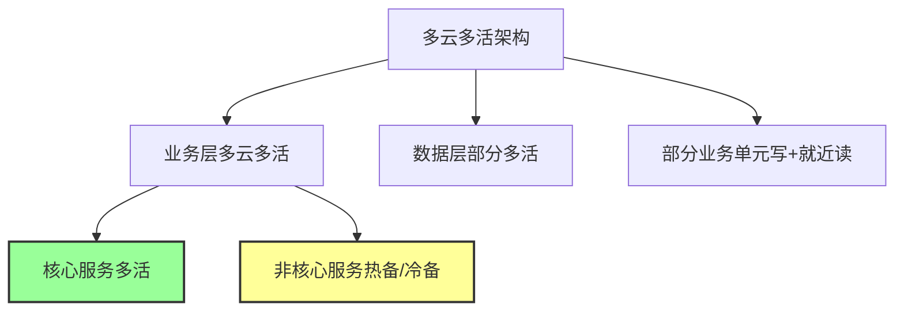

**关键发现：**
- ❌ 不是所有服务都需要多活
- ✅ 根据核心链路要求选择高可用等级
- ✅ 存储可能只需冷备即可满足恢复时效

#### 问题3：应对动态业务高峰

**挑战：**
- 传统：晚间高峰、凌晨低谷
- 现实：疫情、假期、活动等导致反常理高峰
- 问题：静态架构如何应对动态高峰？

**解决方案：基于用户体验SLA的三阶段保障**

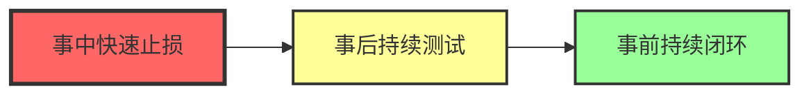

**为什么事中优先？**
- 🔥 正在发生的故障对用户影响最大
- 🚒 先救火，再建设消防工程
- ⚠️ 只救火不建设 = 重复故障
- ⚠️ 只看根因不救火 = 扩大影响

**完整生命周期管理：**

1. **事中**：快速止损和恢复能力建设
2. **事后**：持续测试验证能力有效性
3. **事前**：风险库建设和持续扫描治理

### 3.3 事中：快速止损和恢复

#### 3.3.1 冗余设计

**网络和专线容灾冗余：**

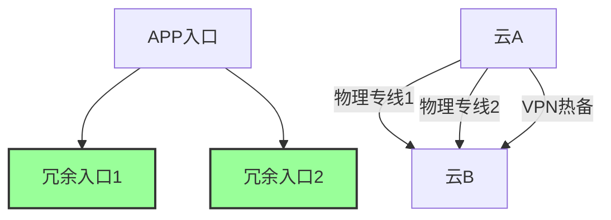

**入口冗余设计：**
- 产品最接近用户的地方
- 用户感知灵敏度最强
- 必须做最高等级高可用

**专线+VPN热备设计：**

**遇到的问题：**
- 两条物理专线看似高规格
- 但公有云专线是产品化交付
- 专线产品逻辑层故障导致双专线同时不可用
- 故障恢复时间：1-2小时

**解决方案分析：**

| 方案 | 优点 | 缺点 | 结论 |
|------|------|------|------|
| 引入第三朵云C形成环形 | 更高可用性 | 成本翻倍 | ❌ ROI不合理 |
| VPN与双专线热备 | 独立通路，成本低 | 带宽较小 | ✅ 通过多条VPN汇聚流量保障核心业务 |

#### 3.3.2 业务网关故障转移

**基于Istio的流量路由方案：**

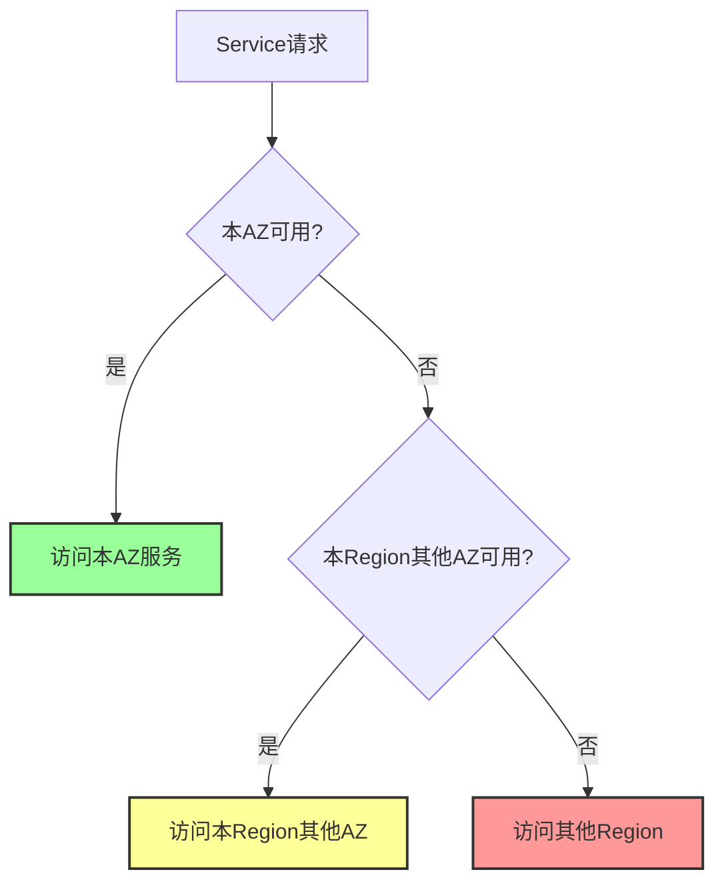

**策略配置（Service Mesh）：**
- 本地优先原则
- 逐级故障转移
- 离应用越远，响应越慢

**应用层故障转移优先级：**
1. Service级别策略
2. Namespace级别策略
3. Cluster级别策略

#### 3.3.3 容量相关高可用（多层级多维度弹性）

**多层级弹性：**

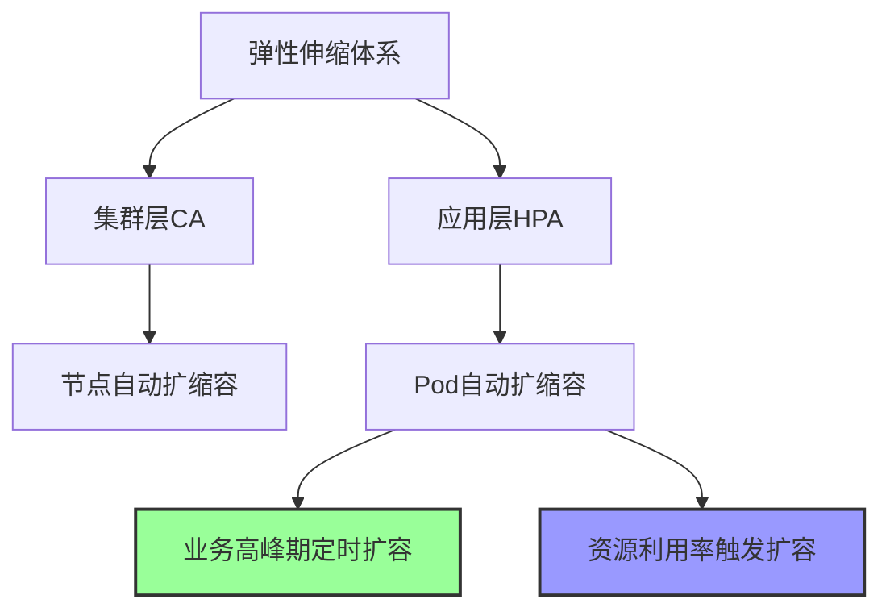

**弹性策略：**

1. **多层级**
   - K8s集群层：CA（Cluster Autoscaler）
   - Pod应用层：HPA（Horizontal Pod Autoscaler）

2. **多维度**
   - 定时伸缩：业务高峰期提前扩容
   - 资源利用率：CPU、内存使用率触发
   - 阶梯式扩容：缓解控制面压力

**实际成效：**
- 🎯 业务高峰期SLO达标
- 💰 容器集群7天平均CPU利用率：30%+
- ✅ 成本和性能双赢

#### 3.3.4 监控和告警

**面向应用的可观测能力：**

**传统 vs 云原生运维：**

| 维度 | 传统运维 | 云原生运维 |
|------|---------|-----------|
| 运维对象 | 物理资源 | 应用服务 |
| 故障处理 | 深入系统指标分析 | 优先故障转移和兜底 |
| 资源粒度 | 大规格物理机 | 微小容器 |
| 恢复方式 | 资源池调配 | 自动弹性伸缩 |

**告警有效性治理：**

**告警 vs 预警：**

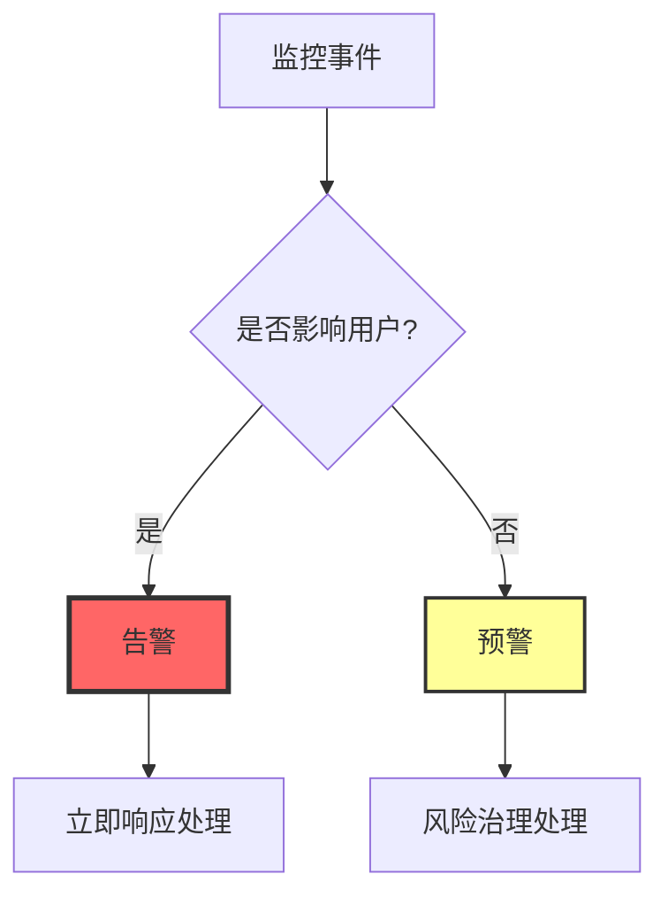

**告警两条原则：**
1. ✅ 通过问题处理使告警恢复 → 有效告警
2. ❌ 告警出来不处理 → 无效告警（需优化）

**预警处理：**
- 不需要立即关注的都属于预警
- 放入风险治理流程
- 根据优先级灵活处理

### 3.4 事后：持续测试

**混沌工程实践：**

**使用工具：** ChaosBlade（阿里开源）

**实现能力：**
- 接入统一服务网格
- 接口级别故障注入
- 轻量化故障演练
- 低成本、低门槛

**演练进展：**

| 时间 | 演练次数 | 演练级别 | 说明 |
|------|---------|---------|------|
| 2023 Q2 | 2次 | - | 初步尝试 |
| 2023 Q3 | 3次 | - | 逐步推进 |
| 2023 Q4 | 3次 | - | 常态化 |
| 2024 Q1 | 7次 | P1级别 | 仅3月一个月完成7个核心场景 |

**演练价值：**
- ✅ 验证高可用策略有效性
- ✅ 降级、恢复、兜底、熔断策略测试
- ✅ 持续验证代码迭代后的功能
- ✅ 精确把控故障影响范围

### 3.5 事前：持续闭环（风险治理）

**风险治理流程：**

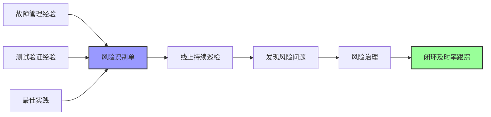

**风险 vs 故障：**

| 对比项 | 风险 | 故障 |
|--------|------|------|
| 影响 | 尚未产生影响 | 已影响用户 |
| 处理时效 | 有容忍期限 | 立即响应 |
| 处理优先级 | 灵活安排 | 最高优先级 |
| 工作方式 | 可控可规划 | 紧急救火 |

**风险闭环及时率：**
- 定义：在期限内处理的风险数 / 发现的总风险数
- 趣丸成绩：89%（2024年1-4月）

**巡检内容：**

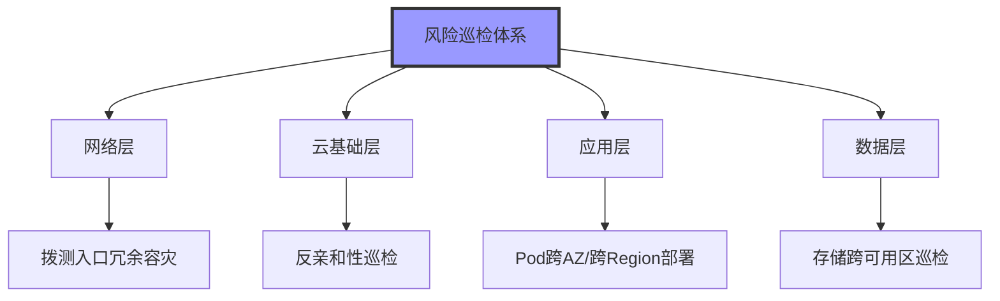

**巡检数据（2024年1-4月）：**
- 发现风险：6000+ 个（包含高中低级别）
- 及时处理：5000+ 个
- 及时处理率：89%

---

## 四、总结与展望

### 4.1 SLA牵引下高可用的四大原则

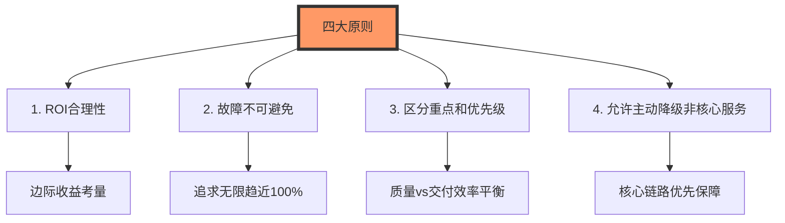

#### 原则1：ROI合理性

**投入与收益的平衡：**

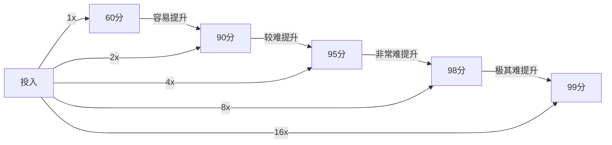

**关键点：**
- 质量提升到一定水平后，边际收益递减
- 从95分到99分，投入可能翻倍
- 用户容忍5秒，无需追求1秒恢复
- 根据实际情况设计，不盲目追求极致

#### 原则2：故障不可避免

**现实因素：**
- 微服务改造，功能迭代快速
- 人员流动频繁
- 业务逻辑复杂度提升
- 系统复杂度不断增长

**正确认知：**
- ✅ 无限趋近100%可用性
- ❌ 永远无法达到100%
- 🎯 根据实际情况确定追求程度

#### 原则3：区分重点和优先级

**质量 vs 交付效率：**

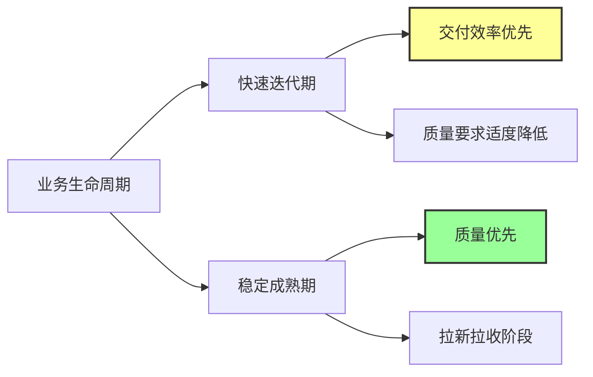

**动态调整：**
- 业务发展期：功能交付优先，质量标准适度
- 业务稳定期：质量保障优先，重视用户体验
- 资源有限：人力和物力需要动态分配

#### 原则4：允许主动降级非核心服务

**案例：王者荣耀开局**

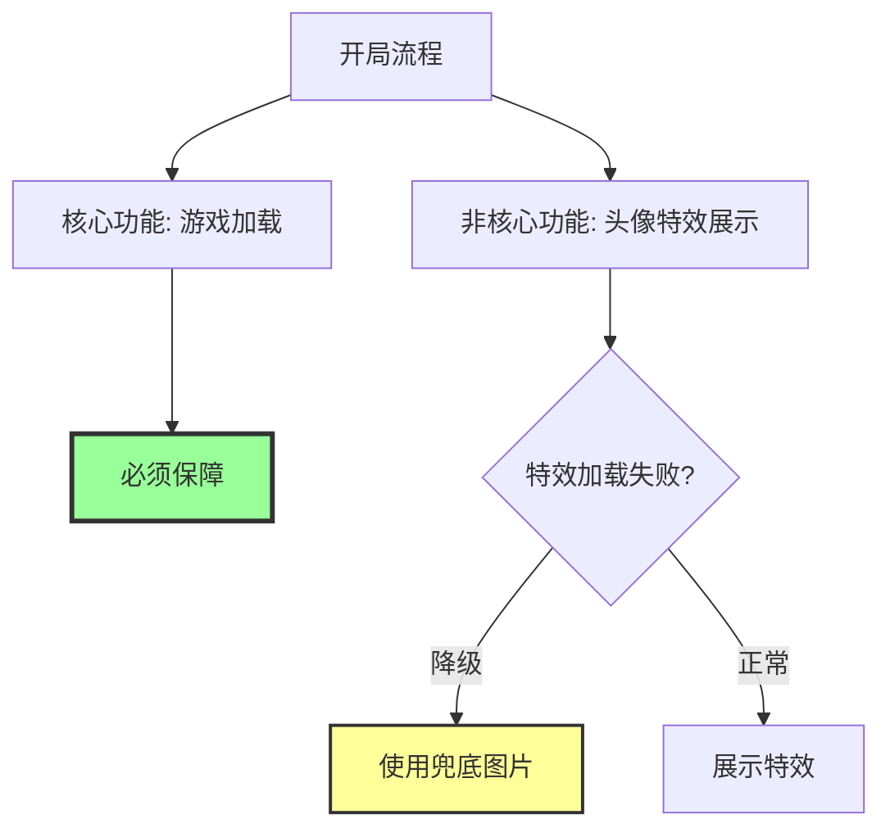

**降级策略：**
- 核心链路：必须保障，不能阻塞
- 旁路功能：允许降级，兜底处理
- 用户体验：优先保障主业务连续性

### 4.2 SLA体系演进路线

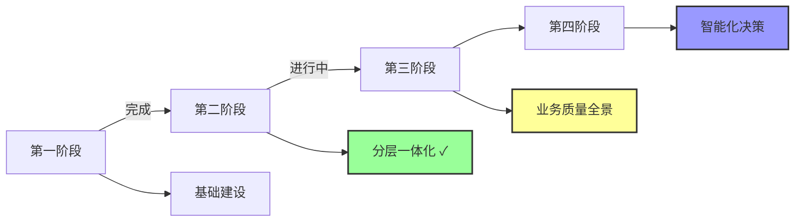

**各阶段目标：**

| 阶段 | 状态 | 主要内容 |
|------|------|---------|
| 第一阶段 | ✅ 已完成 | SLA基础体系建设 |
| 第二阶段 | ✅ 已完成 | 分层一体化架构 |
| 第三阶段 | 🚧 进行中 | 构建业务质量全景图 |
| 第四阶段 | 📅 规划中 | 引入大模型，智能巡检和精准定位 |

### 4.3 大模型在AIOps中的探索

**已实现的能力：**

1. **根因定位**
   - 告警发生时，调用历史经验库
   - 分析资源容量、网络稳定性、业务变更等
   - 汇总时间范围内的信息进行匹配
   - 成效：可引导到具体进程或应用

2. **告警收敛**
   - 关联告警自动聚合
   - 减少告警噪音

3. **告警自动升级**
   - 根据故障时长自动升级
   - 自动拉人和决策提醒

4. **主动响应**
   - 告警群中主动跟进
   - 辅助故障处理和调度
   - 主动提醒和决策建议

**未来方向：**
- 智能决策系统
- 自动化故障恢复
- 预测性告警
- 智能容量规划

### 4.4 关键成功因素总结

**1. 数字化驱动**
- SLA可度量、可跟踪
- 明确当前位置和目标
- 数据驱动决策

**2. 全生命周期管理**
- 事前：风险巡检和治理
- 事中：快速止损和恢复
- 事后：持续测试和验证

**3. 分层建设**
- 业务逻辑层 → 服务层 → 资源层 → 架构层
- 每层都有明确的SLA目标
- 层层传导，全面覆盖

**4. 工具平台化**
- 混沌工程平台
- 风险治理平台
- 监控告警平台
- 降低使用门槛，提高执行效率

**5. ROI优先**
- 避免过度设计
- 合理投入
- 边际收益考量

---

## 附录：Q&A精选

### Q1: 业务高峰期过后资源浪费如何解决？

**A:** 
- 使用定时伸缩策略
- 高峰期提前扩容，低峰期定时缩容
- 引入7天均值利用率指标
- 目标：既保障高峰，又降低低谷资源占用
- 趣丸成效：7天平均CPU利用率30%+

### Q2: 如何解决稳定性和成本之间的权衡？

**A:**
- SLA协议参照TCP协议，多次握手确认
- 客户方和服务方共同认可
- 服务方评估资源成本和团队能力
- 超出能力范围的要求需要协商
- 缩小承诺范围或延长达成时间
- 关键：有数据度量，有成效跟踪

### Q3: 业务突发高峰，流量瞬间暴涨，弹性扩容来不及怎么办？

**A:**
- 被动扩容（HPA→CA）完整流程需5-6分钟
- 秒杀场景无法满足
- 解决方案：定时伸缩（主动扩容）
  - 高峰期前20分钟第一波扩容
  - 高峰期前5分钟第二波扩容
  - 分阶梯扩容，缓解控制面压力
- CA定时要早于HPA定时
- 避免被动触发导致延迟

### Q4: 大模型在监控方面有哪些探索？

**A:**
- 根因定位：调用历史经验库，分析多维度信息
- 告警收敛：关联告警聚合
- 告警自动升级：根据时长自动升级和拉人
- 主动响应：告警群中主动跟进和决策提醒
- 成效：可引导到具体进程或应用，有效性较好

### Q5: 业务网关故障转移时效如何？

**A:**
- 取决于对客户的SLA承诺
- 冷备/热备/多活对应不同时效（天级/小时级/秒级/毫秒级）
- 优化方向：
  - 裁剪xDS协议
  - 扩容控制面
  - 提升响应灵敏度
- 具体问题具体解决

### Q6: 如何衡量ROI评估中的边际成本和边际收益？

**A:**
- 基于物理环境和业务链路分级的基准
- 结合服务的故障影响面和恢复时效要求
- 案例：
  - 及格标准：后端服务响应200ms
  - 实际能力：90ms
  - Buffer时间：110ms（用于故障转移）
- 用户容忍5秒，只需满足5秒即可
- 不必追求1秒恢复，避免过度投入

---

## 总结

本次分享从SLA质量体系的视角，系统阐述了如何驱动业务高可用建设。核心要点包括：

1. **SLA与高可用的关系**：SLA是质量目标，高可用是实现手段，数字化驱动精准投入

2. **SLA驱动方法**：分层一体化架构，从用户体验出发，逐层下钻到每个组件

3. **实践落地**：
   - 明确高可用定义和十大要素
   - 逐层分析，精准设计方案
   - 事前事中事后全生命周期保障

4. **四大原则**：ROI合理性、故障不可避免、区分优先级、允许降级

5. **未来演进**：引入大模型，实现智能巡检和决策

趣丸科技通过SLA质量体系，实现了**既保障业务稳定性，又控制成本**的双重目标，为行业提供了宝贵的实践经验。

---

> 💡 **核心启示**
> 
> 高可用建设不是技术的堆砌，而是基于用户体验的SLA目标，通过数字化度量，合理投入，精准建设，持续改进的系统工程。

