# 中小银行业务系统应急和可用性管理应用与实践

> 来源：未核验 · 类型：分享 · 状态：draft

## 一、分享背景

### 1.1 直播准备的应急保障实践

在本次直播准备过程中,主办方进行了三次模拟测试,充分体现了业务系统应急保障和可用性管理的重要性。识别的关键应急场景包括:

- **网络环境一致性**: 确保分享环境(在家/办公场所)的网络稳定性
- **声音测试**: 提前验证音频设备的可用性
- **PPT准备**: 双份备份(主办方+分享者),防止播放故障
- **干扰因素排除**: 关闭微信、QQ等弹窗提醒

这个案例说明:
- 保证服务连续性需要识别多种应急处置场景
- 必须针对识别的场景制定相应的应急预案
- 专业的应急管理体现在细节的把控上

## 二、监管要求与业务连续性指标

### 2.1 监管政策要求

#### 银保监221号文(2019年发布)
- **核心要求**: 重点银行的重要业务系统要完成真实业务的监管
- **标准极高**: 对业务连续性提出严格要求

#### 商业银行业务连续性监管指引
- **事件分级**: 明确定义四级业务连续性监管事件
  - 特别重大运营事件(BCM重大运营事件)
  - 每个事件定义包括:影响程度、影响时间、影响范围

### 2.2 关键业务指标

#### RPO与RTO指标
- **RPO**(Recovery Point Objective): 数据恢复点目标
- **RTO**(Recovery Time Objective): 恢复时间目标
  - 重要业务系统RTO要求: **30分钟以内**必须快速解决和恢复

#### 30分钟RTO的挑战
在30分钟内需要完成:
1. 事件判断
2. 问题升级
3. 应急处置
4. 事件上报
5. 工具协同
6. 现场人员配合

**关键成功因素**: 必须通过流程化和标准化工具才能实现指标要求

## 三、业务连续性建设的关键成功要素

### 3.1 监管要求持续加强

- 221号文的严格要求
- 疫情三年期间多次下发保障要求:
  - 保障民生金融服务
  - 保障现场办公
  - 保障线上办公

### 3.2 中小银行面临的困难与现状

#### 科技投入层面
- **大行与股份制银行**: 应急管理体系相对成熟
- **中小银行**: 面临较大难度
  - 资金投入相对较少
  - 受投入限制影响较大

### 3.3 容错与容灾的区分管理

#### 容错管理(日常重点)
- **定义**: 日常的容错处置和应急
- **特点**: 
  - 发生频率高
  - 影响范围相对较小
  - 需要快速响应
- **场景示例**:
  - 业务交易缓慢
  - 业务进程/服务不可用
  - 应用对象故障
  - 需要快速启动恢复

#### 容灾管理(低频高危)
- **定义**: 针对特别重大的灾难性故障
- **特点**:
  - 风险概率极低
  - 影响面特别大
  - 不得不防
- **场景示例**:
  - 整个数据中心不可用
  - 整个城市科技服务不可用
  - 需要切换到异地灾备环境

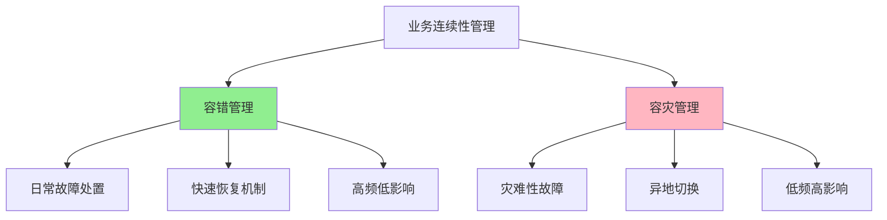

### 3.4 重要业务系统识别

#### 识别维度
1. **业务系统级别判定**: 确定哪些是重大业务系统
2. **上下游影响分析**: 关联业务系统之间的依赖关系
3. **对客影响评估**: 
   - 客户服务影响
   - 监管特别重视的小宝(小微企业保障)等
4. **BIA业务影响分析**: 
   - 对已有业务系统定期评估
   - 新上线业务系统必须评估
   - 每年回顾和再确认

### 3.5 研发运维一体化建设

#### 全生命周期管理
业务连续性管理不是简单的买设备搭建产品,而是覆盖产品全生命周期:

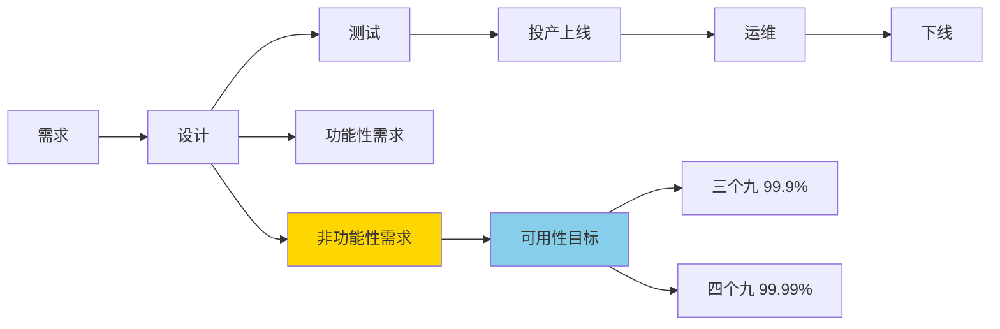

#### 投产变更的技术规范评审

**评审阶段**: 在需求设计、测试、投产上线之前的不同阶段

**评审内容**:
- 操作系统层面
- 数据库层面
- 中间件层面
- 新兴技术(云原生等)的风险评估

**评审关键**:
- 不仅要知道需要评审
- 更要明确评审哪些内容
- 识别风险点在哪里
- 如何进行有效评审

### 3.6 业务连续性指标分解与落地

通过工具实现指标落地:
1. **监控系统**: 实时监控业务连续性指标
2. **应急管理工具**: 快速响应和处置
3. **自动化工具**: 提升处置效率
4. **统一管理平台**: 实现业务连续性的统一管理

## 四、应急场景识别与应对措施

### 4.1 应急场景识别的重要性

> 没有场景识别,出现问题时就会"懵"

看似简单的操作(如信号灯关停:stop/start命令),实际涉及众多因素:

#### 关键考虑因素
1. **人员因素**:
   - 由谁处置?
   - 有哪些人可以处置?
   - 疫情/非工作时间,其他岗位人员能否处置?

2. **技能因素**:
   - 哪些岗位必须掌握该技能?
   - 是否所有人都具备操作能力?
   - 有些人遇到过,有些人没遇到过

3. **风险规避**:
   - 一线值班人员不敢操作怎么办?
   - 如何避免人工操作失误?
   - 特殊情况下的代理操作机制

### 4.2 应急场景分类

#### 技术环境层面
- **网络故障场景**
- **存储设备故障**:
  - 单控制节点故障导致IP服务不能自动切换
  - 双控制器故障
  - 存储设备不能自动切换
- **关键硬件设备故障**
- **安全设备故障**:
  - 加密机故障
  - 防火墙故障
  - IDS入侵检测系统故障

#### 应用层面
- 信号灯启停
- 应用进程/服务异常
- 业务交易缓慢
- 系统响应超时

### 4.3 应急处置工具化

#### 工具化的必要性
- **避免人工失误**: 不通过命令行手工操作
- **提升响应速度**: 一键式应急处置
- **降低技能要求**: 标准化操作流程
- **角色权限管理**: 明确不同角色的操作权限

#### 处置脚本管理
- 整理各场景的处置脚本
- 识别脚本之间的嵌套关系
- 通过工具快速检索应急脚本
- 支持值班代理人员操作

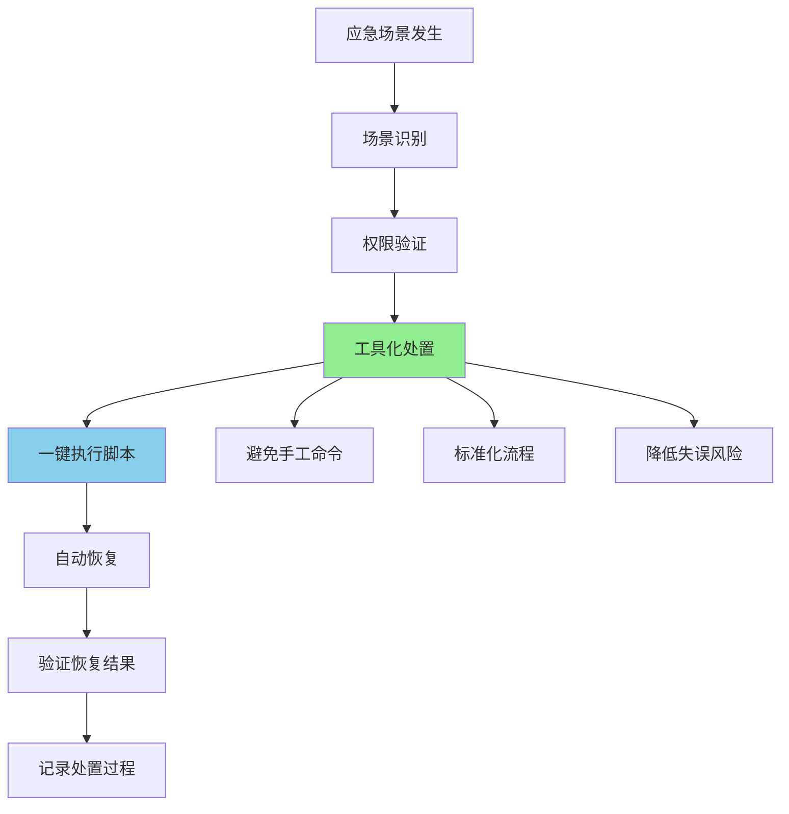

## 五、容错容灾能力建设

### 5.1 核心理念

> 容错容灾是持续的能力建设过程,而非简单的资源配置过程

### 5.2 能力建设的五个阶段

#### 1. 设计阶段

**非功能性需求设计**:
- 可观测性指标设计
- 数据库系统选型
- 技术架构安全基线建立
- 日志标准化输出规范
- 监控系统非功能需求

#### 2. 测试阶段

**破坏性测试**:
- 核心应用强杀测试(kill -9无法杀死怎么办?)
- 物理断电场景下的业务恢复
- 各类极端场景验证
- 在准生产环境充分测试

#### 3. 可用性设计

**监控指标体系**:

**标准化指标**:
- 操作系统指标
- 数据库指标
- 中间件指标
- 应用基础指标

**非标准化指标**:
- 业务系统关键进程和服务
- 日志关键字报错信息
- 业务特定的监控需求
- 硬件日志(如AIX的errpt日志)
- 应用错误代码

#### 4. 工具化实施

将应急场景和处置脚本工具化:
- 信号灯启停工具化
- 快速检索应急工具
- 一键式应急处置
- 标准化操作流程

#### 5. 培训与演练

**培训对象**:
- 各个角色人员
- 不能有遗漏

**培训重点**:
- 关键业务系统应急场景操作
- 加强一线人员应急处置能力
- 疫情等特殊时期的应急能力
- 关键岗位人员不在场时的应急机制

**培训必要性**:
- 操作虽简单但非常重要
- 发生概率低但影响大
- 有些人操作过,有些人几年没操作过
- 必须确保每个人都掌握

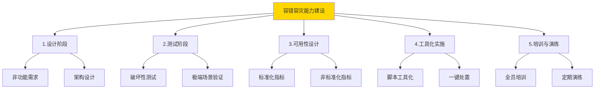

## 六、容错容灾管理工具定位

### 6.1 问题发现机制

#### 监控指标部署要求

**上线前必须完成**:
- 部署所有标准化监控指标
  - 操作系统监控
  - 数据库监控
  - 中间件监控
- 不能裸机上线(没有监控)
- 不能等出问题后才发现没有监控

#### 流程化管理

**关键点**: 通过流程固化监控部署

**监控体系化管理**:
- 明确监控需求由谁提出
- 确定监控部署时间节点
- 规范监控维护流程
- 区分标准化/非标准化指标添加流程
- 实现闭环管理

**管理目标**:
- 保证监控指标不遗漏
- 监控覆盖率高
- 可用性高

### 6.2 快速处置机制

#### 工具化处置
- 发现指标异常后快速处置
- 必须使用标准化工具
- 在短时间内(30分钟RTO)无法逐条敲命令
- 通过工具实现快速恢复

#### 容灾容错作业参考

**演练记录内容**:
- 业务系统启停的关键步骤
- 每个步骤需要的时间
- 提前准备的工作内容
- 交付的工作清单

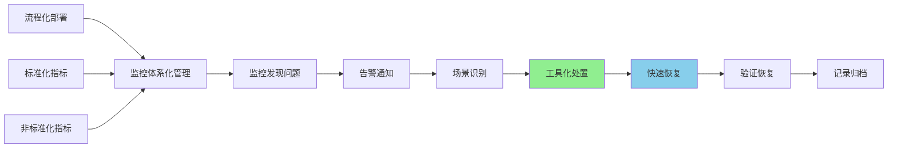

## 七、可用性管理实施策略

### 7.1 可用性管理的痛点

#### 核心问题
- 漏洞的发现与持续修补
- 如何形成体系化管理

#### 关键策略
> 形成工业化管理思路,将适合的IT技术和产品用好用透,注重细节

### 7.2 监控体系化管理

#### 流程化管理的必要性

**历史问题**:
- 系统偷偷摸摸上线
- 不知道什么时候上线
- 发现时已经没有监控

**解决方案**: 必须形成流程化管理

#### 监控需求管理流程

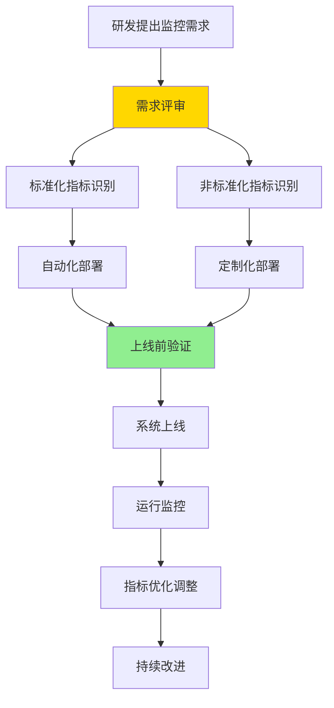

### 7.3 监控指标分类与定义

#### 标准化指标
- **操作系统**: CPU、内存、磁盘、网络等
- **数据库**: 连接数、事务、锁等
- **中间件**: 线程池、连接池、队列等
- **应用基础**: 进程、端口、服务状态

#### 非标准化指标
- **业务系统特殊监控需求**
- **硬件日志关键报警信息**:
  - AIX系统的errpt日志
  - 存储设备日志
- **应用日志关键字**:
  - 错误信息
  - 错误代码
  - 业务异常标识
- **系统日志关键信息**

**识别责任**: 研发人员和应用管理员最熟悉,由他们识别

### 7.4 监控指标级别定义

#### 级别分类
- **初始级别**: 指标首次定义的默认级别
- **特定级别**: 针对特定指标的定义
- **动态调整**: 根据实际情况调整

#### 动态调整机制

**调整依据**:
- 故障发生情况
- 日常系统运行情况
- 业务影响程度

**调整示例**:
- 当前: 四级指标,但已导致大量交易失败
- 调整: 提升为五级事件(高级别)
- 目的: 后续更快速、更准确地报警

### 7.5 多工具组合使用

#### 现状
- 监控工具和产品相对较多
- 各有特点和优势

#### 策略
- 发挥多个产品的组合效应
- 多个工具的组合利用
- 形成监控合力

### 7.6 实施方法

#### 1. 源头设计
在应用系统设计源头对可靠性、可用性进行前期设计

#### 2. 技术规范评审
在投产和运维关键过程中,通过技术规范评审:
- 保证质量过程有效
- 能够评估出风险
- 及时发现问题

#### 3. 运营管理
通过实践运营管理过程:
- 发现有业务影响的指标
- 及时识别问题
- 对业务系统指标和可用性进行回顾
- 及时调整相关指标
- 提升服务质量和能力

#### 4. 最终目标
> 确保容灾容错始终保持可实战的水平和能力

**重点**: 不能天天做演练,但真正实操时操作不了

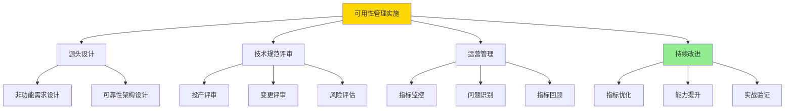

## 八、技术规范体系建设

### 8.1 技术规范覆盖范围

经过多年积累,建立了全面的技术规范体系:

#### 基础设施层面
- **操作系统规范**
- **数据库规范**
- **中间件规范**

#### 应用层面
- **应用开发规范**
- **日志标准化规范**

#### 安全层面
- **安全基线规范**
- **漏洞扫描规范**

#### 自动化层面
- **作业调度工具标准化**

### 8.2 技术规范特点

- **持续改进**: 不断迭代优化
- **约束性**: 对各层面进行规范约束
- **关键因素**: 确保监控和可用性管理持续落地实施

## 九、监控运维运营体系

### 9.1 监控核心理念

> 监控是运维和运营的核心内容

#### 核心原则
- **以结果为导向**
- **以准确配置为基础**
- **设置有效的监控指标**

### 9.2 运营指标设计

#### 指标分类
1. **重要业务系统可用性指标**
2. **非关键业务系统运营指标**

#### 指标要求

**覆盖率**:
- 覆盖所有重要业务系统
- 覆盖所有非关键业务系统

**准确性**:
- 该报警的一定要报警
- 不该报警的不能误报
- 避免"狼来了"效应

### 9.3 监控整体架构

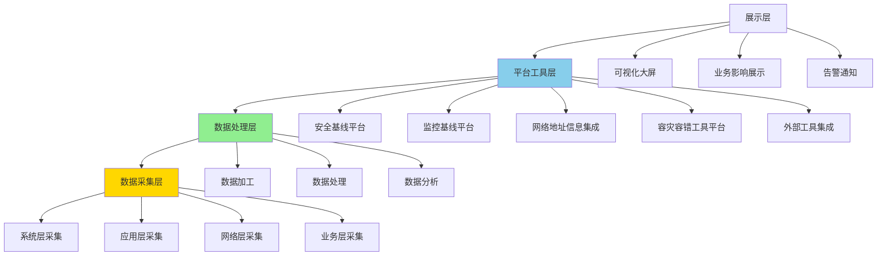

#### 架构分层

**数据采集层**(底层):
- 系统层数据采集
- 应用层数据采集
- 网络层数据采集
- 业务层数据采集

**数据处理层**(中间):
- 数据加工
- 数据处理
- 数据分析

**平台工具层**:
- 安全基线平台
- 监控基线平台
- 网络地址信息统一集成
- 容灾容错工具平台建设
- 外部工具集成

**展示层**(上层):
- 可视化展示
- 不同展示方式和方法
- 识别和监控系统问题
- 业务影响展示

### 9.4 监控配置信息管理

#### CMDB配置信息

**业务系统基本信息**:
- 业务系统架构(主备/单机/多活)
- 业务系统组件
- 服务时间
- 服务部门
- 业务逻辑模式
- 交易类型
- 交易协议
- 网络连接方式
- 物理区域

**重要性**: 不同架构的应急处理方式不同

#### 监控组件配置

- 指标层层分解
- 应用之间互联关系
- 监控策略部署
- 不同监控指标类型识别
- 下发到不同监控对象

### 9.5 前后台配置信息一致性

#### 一致性的重要性

**历史问题**:
- 各部门对业务系统名称叫法不一致
  - 业务部门的叫法
  - 研发部门的叫法
  - 运维部门的叫法
  - 数据中心的叫法
- 导致数据统计分析困难
- 应急处理困难

#### 产品目录建设

**从需求阶段确定**:
- 业务系统名称标准化
- 应用大类分类:
  - 核心类
  - 通用类
  - 渠道类
  - 线上交易类

**关键信息**:
- 业务类型名称
- 负责部门
- 业务AB角
- 传递到运维配置管理
- 传递到应急处置流程

**工具集成**:
- 保证工具名称一致性
- 保证应急处置流程名称一致性
- 避免应急过程中的差异

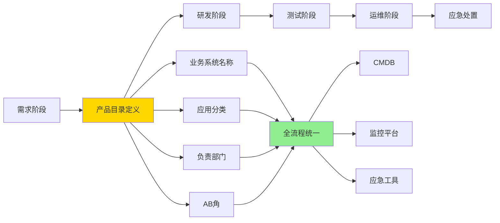

## 十、监控与控制(Monitor & Control)

### 10.1 监与控的区分

- **监(Monitor)**: 可用性指标的监控
- **控(Control)**: 应急过程中的自动化控制和处置

### 10.2 专家知识库

#### 日常巡检与故障排查

需要专家经验和知识库支持:

**应急门诊 vs 普通门诊**:
- 应急时不查常规指标(CPU、内存、文件系统)
- 这些指标不会对业务可用性产生直接影响

**关键应急指标**:
1. **网络是否通**
2. **关键进程服务是否存在**
3. **数据库进程服务和端口是否激活**

通过这些指标快速判断业务系统是否可用

### 10.3 巡检与监控的区别

#### 巡检
- **目的**: 实时或不定期获取信息
- **功能**: 看到重要业务系统是否存活
- **类比**: 应急门诊检查生命体征
- **判断**: 是否具备提供科技服务的能力
- **结果**: 业务是否可用

#### 监控
- **目的**: 根据不同指标策略持续监控
- **功能**: 确定指标的巡检范围和监控范围
- **特点**: 7×24小时持续监控

### 10.4 应急处置手册

#### 关键报错信息库

经过多年整理识别:
- **数量**: 约200多个关键重要报错信息
- **级别**: 五级事件或严重影响的事件
- **特点**: 虽然总报警数量多,但严重影响的不多

#### 应急处置文档

**场景示例**:
- 业务系统响应慢/响应超时
- 业务系统进程服务无法运行
- 信号灯需要关闭

**文档内容**:
- 详细操作过程
- 操作手册
- 标准化处置流程

**目标**:
- 快速处置
- 标准化操作
- 保障业务系统快速恢复

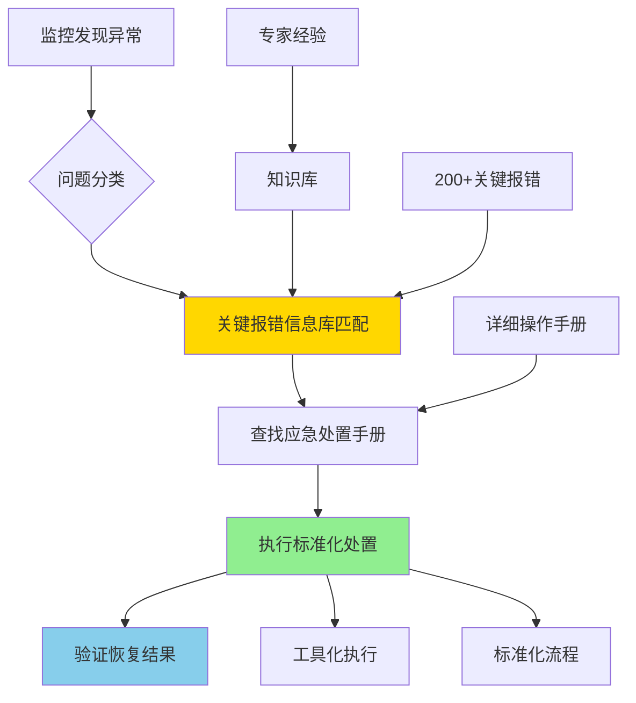

## 十一、安全性保障措施

### 11.1 容灾架构下的安全性保障

#### 上线前安全措施

**1. 漏洞扫描**
- 新系统上线前至少做两遍漏扫:
  - 第一遍: 发现漏洞
  - 第二遍: 验证修复有效性
- 监管要求越来越严
- 内部审计越来越严格
- 上线后修复难度非常大

**2. 防病毒系统**
- 提前安装和配置
- 上线前完成部署

**3. 安全指标监控**
- 关键业务指标
- 可用性指标
- 安全指标
- 确保业务系统安全性有效

### 11.2 巡检工具的价值

#### 巡检 vs 7×24监控

**问题**: 把巡检配置成7×24监控,巡检还能额外做什么?

**答案**: 巡检的独特价值

#### 监控工具的作用
- 替代原先手工巡检方式
- 自动化和高效发现业务系统状态
- 判断系统正常或异常

#### 巡检工具的额外价值

**应急情况下的专家经验**:
- 业务系统不可用时的排查经验
- 各角色、各层面专家的排查方法
- 层层排查的逻辑

**排查层次**:
1. **网络层面**: 网络是否出现问题
2. **系统层面**: 网卡是否出现问题
3. **应用层面**: 进程和服务端口是否出现问题

**工具化的必要性**:
- 人工排查进度慢
- 人员协调困难
- 效果不好
- 必须通过工具快速排查

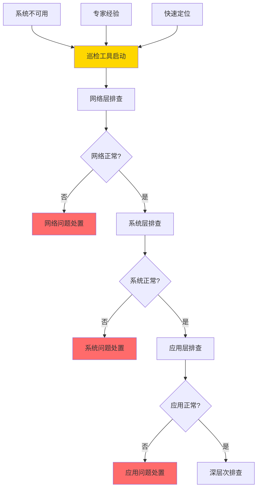

## 十二、核心要点总结

### 12.1 业务系统可用性设计

#### 设计原则
1. **源头设计**: 从设计阶段考虑可靠性和可用性
2. **非功能需求**: 与功能需求同等重要
3. **技术规范**: 建立全面的技术规范体系
4. **破坏性测试**: 上线前充分测试极端场景

#### 关键指标
- **标准化指标**: 操作系统、数据库、中间件
- **非标准化指标**: 业务特定监控需求
- **可用性目标**: 三个九(99.9%)或四个九(99.99%)

### 12.2 应急场景识别与应对

#### 场景识别
- **容错场景**: 日常高频故障
- **容灾场景**: 低频灾难性故障
- **细化场景**: 详细到具体操作步骤

#### 应对措施
- **工具化**: 一键式应急处置
- **标准化**: 标准化操作流程
- **自动化**: 减少人工干预
- **权限管理**: 明确角色和权限

### 12.3 科技服务下沉到业务一线

#### 一线能力建设
- **技能培训**: 加强一线人员应急处置能力
- **工具赋能**: 提供易用的应急工具
- **权限下放**: 一线具备应急操作权限
- **知识传递**: 专家经验工具化、知识化

#### 体系化管理
- **流程化**: 通过流程固化管理要求
- **标准化**: 统一命名、统一流程
- **工具化**: 工具支撑快速响应
- **持续改进**: 不断优化和迭代

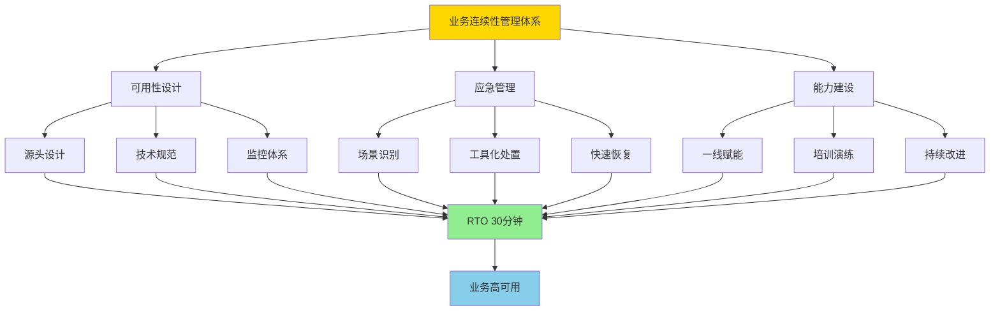

## 十三、关键成功经验

### 13.1 体系化管理思路

1. **监控体系化**: 流程化管理监控全生命周期
2. **应急体系化**: 场景识别→工具化→演练验证
3. **运维体系化**: 研发运维一体化管理

### 13.2 工具化与自动化

1. **监控工具**: 7×24小时持续监控
2. **巡检工具**: 应急场景下的专家经验工具化
3. **应急工具**: 一键式快速处置
4. **集成平台**: 多工具统一集成

### 13.3 持续改进机制

1. **指标动态调整**: 根据实际情况优化监控指标
2. **技术规范迭代**: 持续改进技术规范
3. **能力持续建设**: 确保始终保持可实战水平
4. **经验知识沉淀**: 将专家经验固化到工具和流程

### 13.4 关键成功因素

> 形成工业化管理思路,将适合的IT技术和产品用好用透,注重细节

- **流程化**: 固化管理要求
- **标准化**: 统一规范
- **工具化**: 提升效率
- **体系化**: 形成闭环

---

## 附录:关键术语

| 术语 | 全称 | 说明 |
|------|------|------|
| RTO | Recovery Time Objective | 恢复时间目标,重要系统要求30分钟内 |
| RPO | Recovery Point Objective | 数据恢复点目标 |
| BCM | Business Continuity Management | 业务连续性管理 |
| BIA | Business Impact Analysis | 业务影响分析 |
| CMDB | Configuration Management Database | 配置管理数据库 |
| SLA | Service Level Agreement | 服务级别协议 |

---

**分享者背景**: 中小银行运维负责人  
**目标受众**: SRE、运维及稳定性保障工程师  
**核心价值**: 提供中小银行在资源有限情况下,如何通过体系化、工具化、流程化手段实现业务高可用的实践经验

---

*本文档根据技术分享音频整理,部分ASR识别错误已根据上下文进行修正*

