# 浙江移动SRE转型实战

> 来源：未核验 · 类型：分享 · 状态：draft


## 一、背景介绍

### 1.1 通信网络运维的特点

#### 维护设备特征

- **专有软硬件的通信设备**

  - 程控交换机
  - 核心网
  - 路由器
  - 高端防火墙
  - 3GPP或ITU-T规范的标准网元
- **设备特点**

  - 所有软件和硬件都是定制的
  - 无法在设备内部进行开发或部署脚本
  - 需要符合国家规范和集团入网证管理

#### 运维视角

- 关注路由通信协议
- 网元之间的信令通信
- 网元参数配置（局数据）

### 1.2 日常工作内容

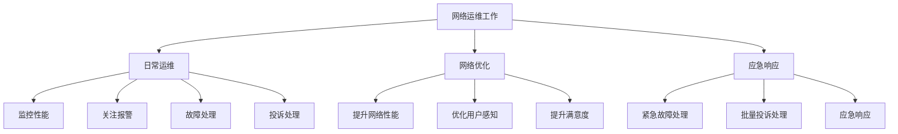

**日常运维**

- 保证网络稳定运行
- 监控性能指标
- 关注报警信息
- 处理日常故障和投诉

**网络优化**

- 提升网络性能
- 优化性能指标
- 提升用户满意度和使用感知

**应急响应**

- 处理特别紧急的故障（如光缆被挖断）
- 批量投诉处理
- 快速恢复网络服务

### 1.3 组织架构

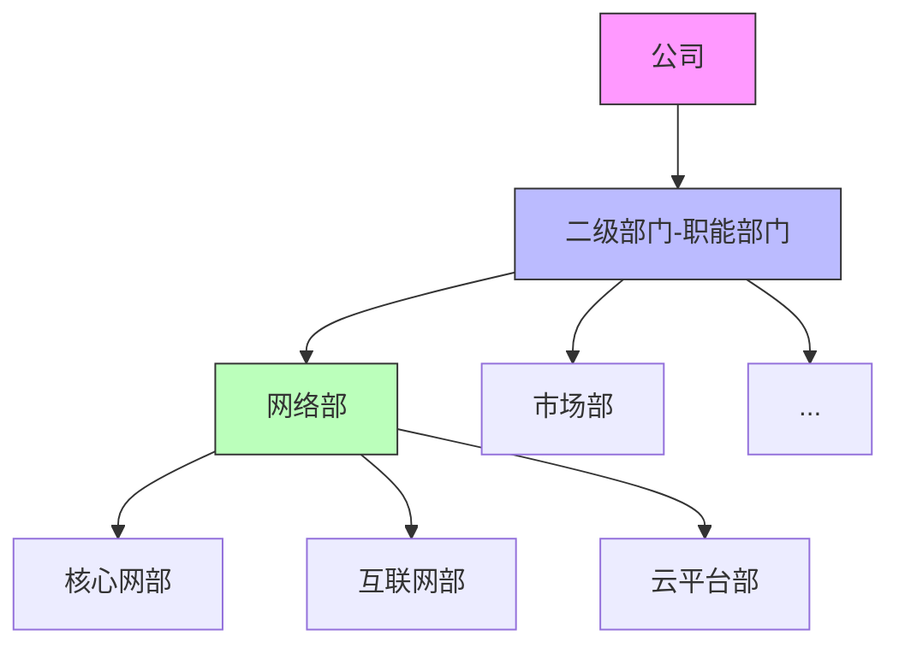

**垂直式行政架构特点**

- 三层组织结构：公司 → 二级部（职能部门） → 三级部（专业部门）
- 横向部门之间没有直属考核关系
- 所有沟通需要通过上级部门协调

**考核机制**

- 以KPI为导向的负向激励
- 不出故障是应该的，没有加分
- 一旦出故障就扣分
- 网络稳定运行是基本要求

### 1.4 团队技能现状

**现有能力**

- IT开发和设备维护能力较弱
- 几乎所有人都有编程经验（C语言、Java等基础课程）
- Linux操作、Python语言掌握较弱
- SVN或Git等工具操作经验不足

**转型意愿调查**

- 73%的同事对转型有兴趣
- 18%有较大热情

---

## 二、面临的挑战与困难

### 2.1 网络技术发展带来的压力

#### 责任越来越大

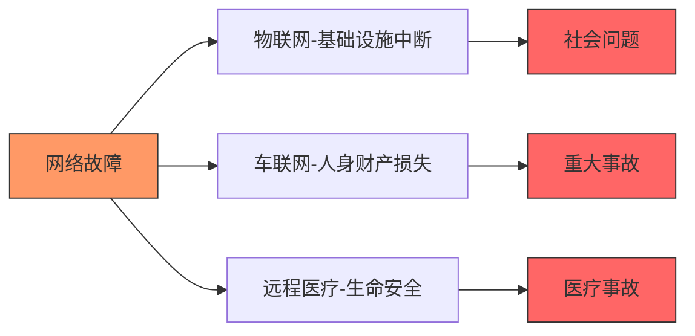

- **物联网发展**：网络断了相当于断水断电，可能引发重大社会问题
- **车联网发展**：网络故障可能造成重大人身和财产损失
- **远程医疗**：手术中断网可能危及生命安全

### 2.2 与先进互联网公司的差距

**互联网公司的优势**

- 大量运维以工具为主，释放人力
- 标准化、自动化、智能化走在前列
- DevOps研发运维模式
- SRE运维实践
- Cloud Native技术架构

**浙江移动现状**

- ✅ 标准化：业界领先
- ⚠️ 自动化：正在建设和探索
- ⚠️ 智能化：有所欠缺
- ❌ 大量工作仍处于人肉运维阶段

### 2.3 运维平台的问题

**烟囱式架构的弊端**

- 由厂家定制开发
- 开发响应慢
- 厂家不懂业务，不理解需求
- 沟通成本大
- 跨部门协作困难（垂直组织架构导致）

### 2.4 人力资源压力

**设备与人员增长不匹配**

- 2014-2019年：语音核心网网元增加80%
- 同期：运维人员仅增加12%
- 设备越来越多，人员不见增长

**工作压力**

- 工作时间不断增长
- 7×24小时待命（007模式）
- On-call期间手机不能关机
- 大量手工冗余工作

### 2.5 云化带来的新挑战

#### 设备演进

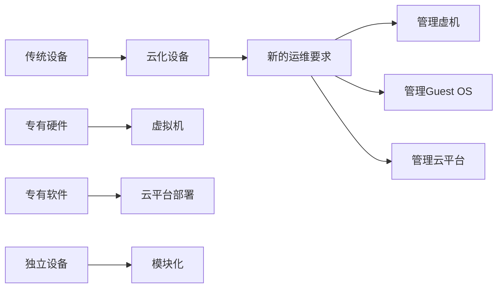

**云化架构问题**

- 复杂的云化架构导致故障难以排查
- 诡异故障无法用科学解释
- **案例**：设备运行时间变长，响应时延增加，但CPU和内存占用正常，最后只能通过定期虚机迁移规避

> "封建迷信"：运维变成拼人品

---

## 三、SRE转型之路

### 3.1 思想转变：接受SRE理念

#### SRE核心理念（来自Google）

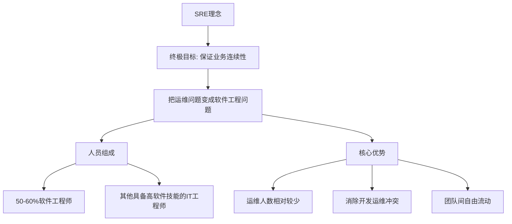

**SRE优势**

1. 运维人数相对较少
2. 开发和运维团队之间的冲突焦点消除（都是软件工程师）
3. 运维团队和开发团队技能相同，可以互相流动

**面临挑战**

- 符合SRE的人才比较难招聘
- 既要有软件经验，又要有维护经验，还愿意干维护的人确实比较少

#### SRE与DevOps的关系

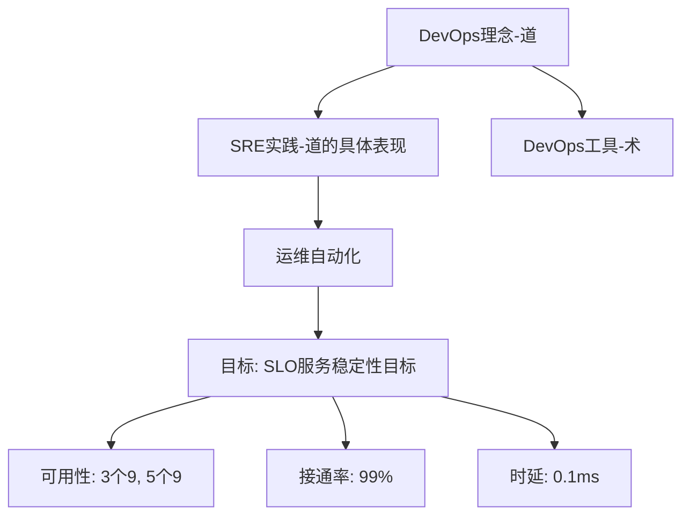

- **SRE**：DevOps理念的具体表现形式
- **DevOps和SRE**：道
- **DevOps工具**：术

#### 自动化的三种形式

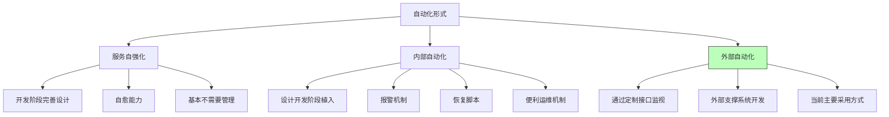

**当前采用：外部自动化**

- 设备全部是定制的
- 只能通过定制接口进行监视和操作
- 开发全部在外部支撑系统上

**未来方向：内部自动化、服务自强化**

#### 自动化带来的好处

**1. 高度一致性**

- 避免人员经验差异
- 操作标准统一
- 可量化、避免犯错

**2. 快速反应**

- 人工处理：5分钟接电话 + 开电脑 + 登内网 + 登录设备 + 处理 = 15-30分钟
- 自动化处理：检测 + 判断 + 查询 + 反应 < 10秒

**3. 完成任务损失**

- 处理繁琐工作（如BI报表）
- 批量操作（几千台和几万台设备一样）

**4. 固化经验（最重要）**

- 开发运维工具固化运维经验
- 通过代码形式部署
- 5年左右，运维平台经验可能超过运维专家
- 最终实现平等对待运维平台，信任平台完成运维工作

### 3.2 明确目标

#### 团队目标

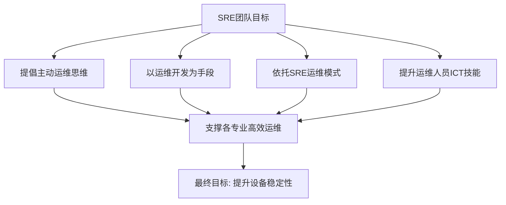

#### 人员目标：钱多活少

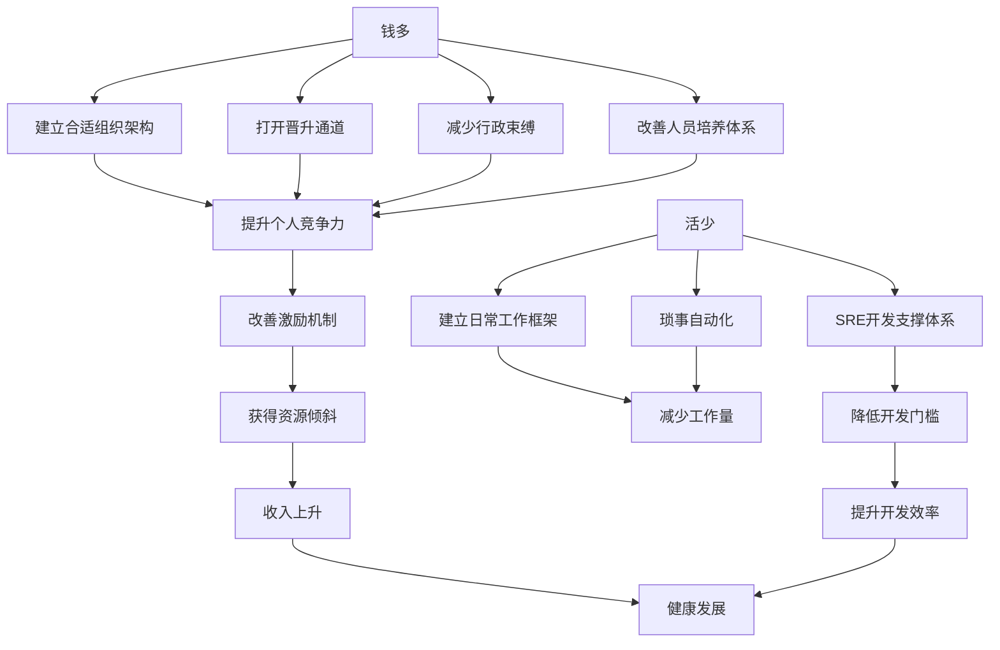

**增加收入的途径**

- 建立合适的组织架构，打开晋升通道
- 减少行政束缚
- 改善人员培养体系，提升个人竞争力
- 改善激励机制，获得资源倾斜

**减少工作量的方法**

- 建立日常工作框架支撑开发工作
- 将琐事自动化
- 通过SRE开发支撑体系降低开发门槛，提升开发效率

### 3.3 打造SRE生态圈

#### 五种手段建立工作机制

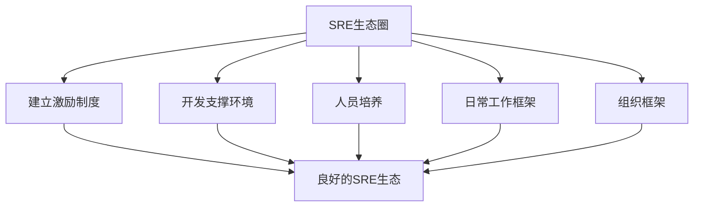

#### 3.3.1 建立组织架构

**半刚性组织架构（议事会负责制）**

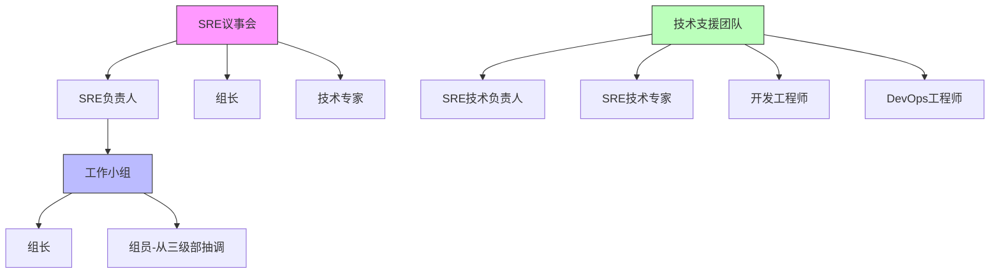

**组织结构**

**左侧：SRE议事会领导下的工作小组**

- SRE负责人统管
- 组长和组员从三级部和专业组抽调
- 根据专业相似性分组

**右侧：SRE技术支援团队**

- 研究SRE先进理念和技术
- SRE技术负责人、技术专家
- 细分专业的开发工程师
- DevOps工程师

**SRE议事会**

- 组成：负责人 + 组长 + 技术专家
- 职责：决定SRE发展方向，总结工作，制定计划
- 直接向上级领导负责

#### 3.3.2 人员分工演进

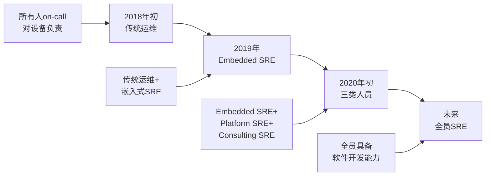

**阶段一：2018年初 - 传统运维**

- 没有SRE团队
- 所有人都是传统运维
- 对设备负责，全员on-call

**阶段二：2019年 - 嵌入式SRE**

- 成立SRE团队
- 两类人员：
  - 传统运维人员
  - **Embedded SRE**（嵌入式SRE）：仍在原运维团队，仍要值班和处理运维工作

**阶段三：2020年初 - 三类人员**

- **Embedded SRE**：负责设备，需要值班
- **Platform SRE**：负责SRE平台开发，推动平台演进，解耦烟囱式平台
- **Consulting SRE**：SRE开发专家（7人），指导和支持其他SRE工作

**当前规模**

- SRE团队：97人
- Consulting SRE：7人（开发专家）
- 专家职责：派驻到项目组，提供开发指导、需求整理、设计建议

**阶段四：未来 - 全员SRE**

- 软件开发技能提高到一定程度
- 大部分人能进行平台类开发
- 独立进行需求分析、设计和开发

#### 3.3.3 建立激励机制

**为什么是"半刚性"而非"柔性"？**

因为SRE团队拥有激励和考核权利。

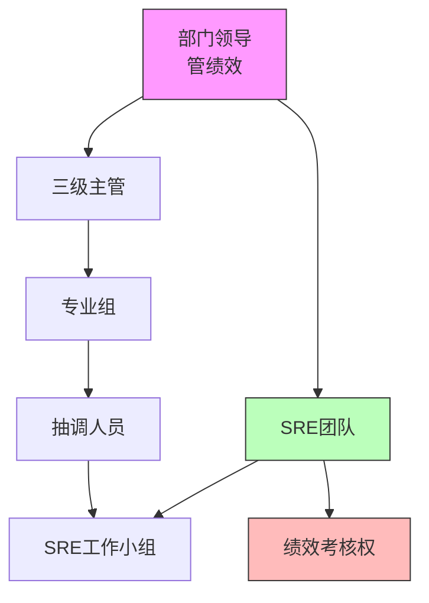

**OKR导向的正向激励**

- SRE团队和三级主管、专业主管共同管理抽调人员
- SRE团队可以对工作小组进行绩效考核
- 手里有权，团队才能发展（资源、钱、权限）

#### 3.3.4 人员培养体系

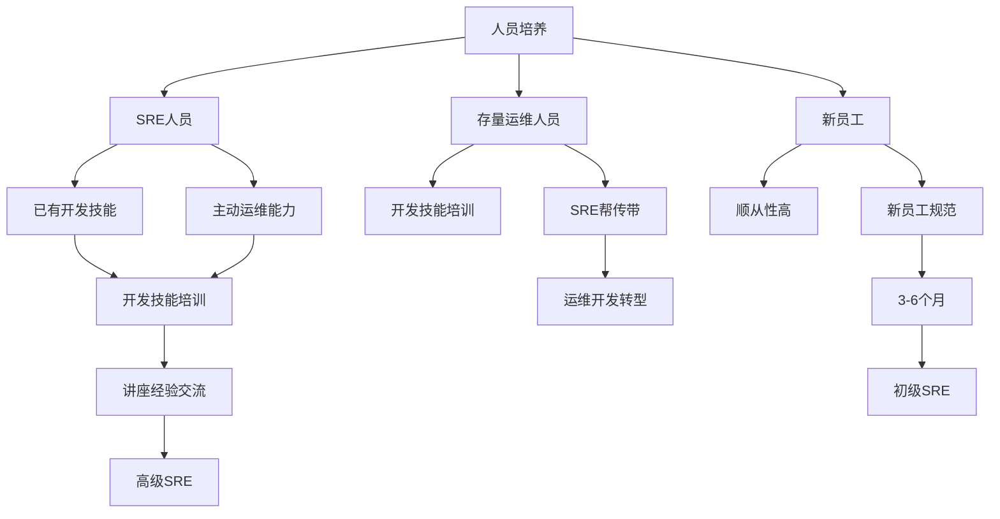

**三类人员培养策略**

1. **SRE人员**

   - 本身具有开发技能和主动运维能力
   - 进行开发技能培训
   - 讲座和经验交流
   - 向高级SRE方向提升
2. **存量运维人员**

   - 主要进行开发技能培训
   - 由SRE人员帮传带
   - 促进向运维开发转型
3. **新员工**

   - 顺从性较高
   - 制定新员工规范
   - 3-6个月内成为初级SRE

#### 3.3.5 人员画像与评估

**五个维度、21个评分项**

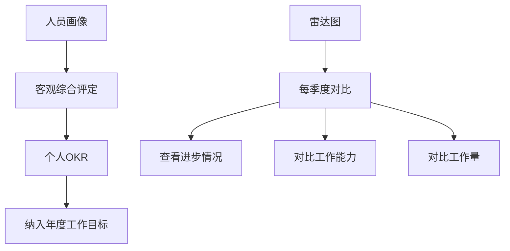

**评估闭环**

- 五个维度21个评分项评定SRE成员
- 输出个人OKR，纳入年度工作目标
- 生成雷达图
- 每季度对比，查看进步和工作量

#### 3.3.6 建立工作框架与技术规范

**从无到有建立SRE日常工作框架**

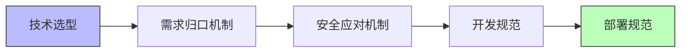

- 完成技术选型
- 建立需求归口机制
- 建立安全应对机制
- 建立开发规范
- 建立部署规范

**基于DevOps体系**

- 将SRE具体工作纳入DevOps体系
- 每一环制定相应制度
- 避免技术债务

#### 3.3.7 搭建开发支撑环境

**通过建平台、解耦合搭建SRE开发支撑环境**

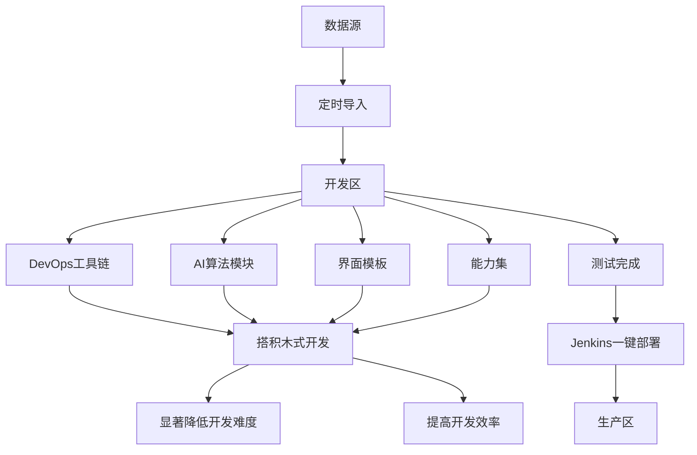

**开发区（左侧）**

- DevOps工具链
- AI算法模块
- 界面模板
- 能力集
- 搭积木式开发，降低开发难度，提高效率

**数据隔离**

- 开发区与生产区分离
- 数据源通过定时导入到开发区
- 测试完成后通过Jenkins一键部署到生产区

**生产区（右侧）**

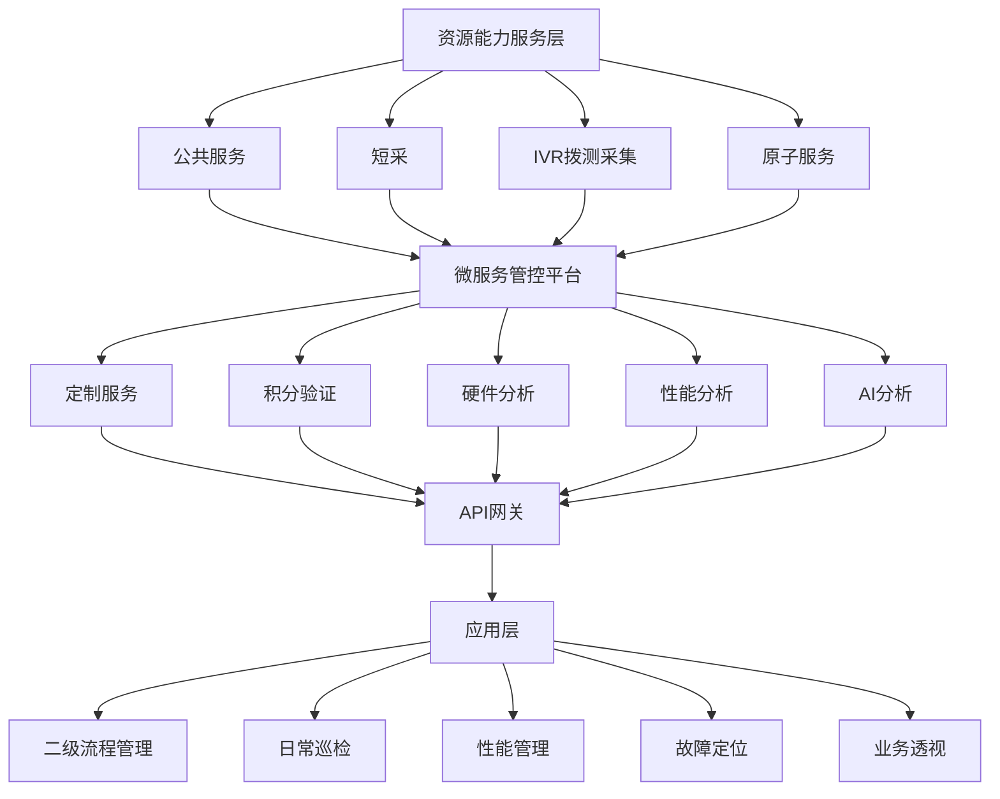

**分层架构**

1. **资源能力服务层（最底层）**

   - 公共服务：短采、IVR拨测采集等
   - 原子服务，以积木形式注册到微服务管控平台
2. **微服务管控平台（中间层）**

   - 定制服务：积分验证、硬件分析、性能分析、AI分析等
   - 注册到API网关
3. **应用层（最上层）**

   - 二级流程管理
   - 日常巡检
   - 性能管理
   - 故障定位
   - 业务透视

**开发便利性**

- 应用层和资源能力服务层都可在开发区通过一键部署加入
- 开放接口，便于集成

#### 3.3.8 推进平台解耦重构

**从烟囱式到开放式平台**

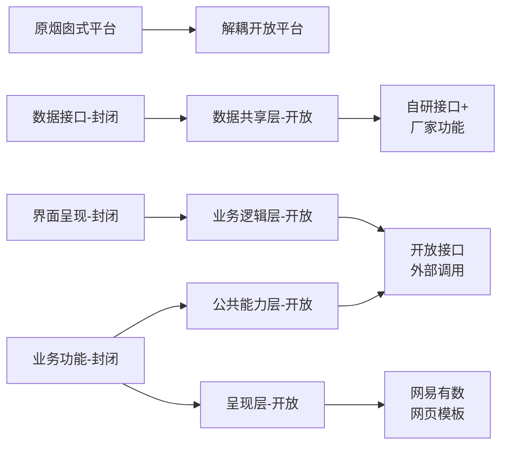

**烟囱式平台的问题**

- 厂家定制开发，完全封闭
- 数据接口、业务功能、界面呈现都是一体的
- 新需求上线平均需要41天
- 例如：增加两个字段的报表，需要2周开发时间

**已完成6个平台解耦**

**解耦后的分层架构**

1. **数据共享层**

   - 可通过自研数据接口（插件形式）与厂家功能共存
   - 新增功能便捷
   - 搭建RabbitMQ，集中零散数据
   - 形成数据字典，方便开发
2. **公共能力层**

   - 开放接口，变成外部接口
   - 可从外部调用
   - 例如：OSS 4.0能力层变成自研能力层
   - 应用到场景监控、态势感知、ICUT等系统
3. **业务逻辑层**

   - 开放接口
   - 外部可调用
4. **呈现层**

   - 引入网易有数做统一报表平台
   - 引入网页模板
   - Python脚本按规则填充数据
   - 以网页形式呈现，可嵌入其他系统

---

## 四、工作成果

### 4.1 团队规模

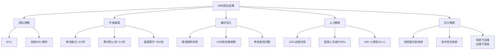

### 4.2 需求实现快

**基于开放解耦平台的搭积木式二次开发**

- **单个功能点开发**：平均仅需2小时
- **从提需求到上线部署**：平均2小时
- **速度提升**：551倍（原来41天）

### 4.3 痛点切入准

**SRE人员优势**

- 原来都是传统运维人员、网络运维专家
- 对网络痛点了然于心
- 提出的运维自动化需求特别精准

**典型应用**

- QoS劣化灵敏感知
- 节点复合异常检测
- 迅速感知异常
- 早于用户投诉15分钟发现并完成故障处理
- 保证业务稳定性

**跨省发现问题案例**

- 帮助福建和吉林发现重大问题
- 通过聚类分析发现网络指标劣化
- 在对方尚未察觉时就发现问题
- 工具精准定位到具体区域

### 4.4 人力大解放

**机器换人成果**

- 完成120+运维应用开发
- 大量运维工作自动化
- **值班人员减少80%**

**监控大厅案例**

- 原来：300+人，100+人三班倒在监控大厅
- 监控大厅规模：类似航天飞机发射场，多屏幕、大屏显示全网状态
- 现在：只剩20+人
- 人员从满满当当到三三两两

**自动驾驶目标**

- 今年目标：完成网络故障自动驾驶
- **夜间**：达到L4等级（无人监视下的网络自动化）
- **白天**：达到L3等级（有人监视、协助下的网络故障处理自动化）

**人员去向**

- 一部分转岗到其他部门
- 一部分做运维开发工作，进行转型
- 达不到要求的换人，招开发技术强的人员

**成本**

- 人力成本明显降低

### 4.5 压力大释放

**经验固化的路径**

```mermaid
graph TD
    A[运维经验] --> B[固化到系统代码]
    B --> C[系统能力超过人]
    C --> D[逐步接受和信任系统]
    D --> E[具体运维工作交给系统]
    E --> F[运维人员做主动工作]
    F --> G[最终目标:<br/>系统干运维<br/>运维干系统]
  
    style G fill:#bfb,stroke:#333,stroke-width:3px
```

**学习互联网**

- 互联网公司混沌工程：完全自动化、自动恢复、自动修复
- 代码化自动恢复

**传统通信行业现状**

- 自动化系统只给建议
- 虚机切换、网元故障、网络倒换仍需人工甚至领导下令
- 层层上报，增加时间成本
- 对SLO造成较大压力

**转变过程**

- 系统会存在bug，有些事需要人判断
- 但不信任系统、不移交权利，就不知道系统能力
- 需要逐步接受并信任系统

**理想状态**

- 具体运维工作交给自动化系统
- 释放运维人员压力
- 运维人员做积极主动的工作
- **最终目标**：系统干运维，运维干系统

---

## 五、关键问答

### Q1: 如何说服领导组成SRE团队（垂直管理企业）？

**向上管理的重要性**

- 从上而下：推动（简单）
- 从下而上：革命（非常难）
- 没有一定的社会地位和管理岗级，很难做革命

**浙江移动的做法**

- 领导层有想法，但认识不够清晰
- 时机：网络从CT（通信设备）向IT（云化设备）转型
- 运维人员和领导都在思索转型方向
- SRE理念与领导想法一拍即合
- 摸着石头过河，逐步探索

**关键因素**

- 行业转型压力
- 领导层的开放态度
- 明确的转型方向和价值

### Q2: 自动运维系统是自研还是外购？使用哪些开源技术？

**平台来源**

- 大部分自研
- 部分平台外购（如配置管理系统/局数据平台）

**解耦方式**

- 厂家提供框架和流程
- 脚本、配置、监测工具由自己控制
- 通过插件方式集成

**开源技术栈**

- Zookeeper
- Kafka
- Flink
- Ansible
- 等等（很多）

**集成商**

- 云平台集成商：中兴、华为
- 帮助完成部分自动运维工作

### Q3: 如何让外购系统厂家帮忙解耦系统？

**商务手段**

- 提需求，明确解耦要求
- 签合同，约定工作量和费用
- 验收标准写明开放程度和部署方式

**双赢局面**

- 厂家：不用做细节功能点，减少需求变更困扰
- 浙江移动：开发快速，符合使用需求
- 改善合作方式，双方都满意

**行业趋势**

- 平台解耦是大趋势
- 没有遇到厂家不愿意解耦的情况

### Q4: 需求归口管理是指业务需求吗？

**答案**：是的

- 针对运维功能点和运维工具
- 运维对于运维团队来说就是业务
- 不同于面向外部客户的业务

### Q5: 开发规范是否约定所有厂家的代码开发规范？

**答案**：不是

**开发规范的范围**

- 针对自己的SRE团队
- 针对自己平台上的开发

**厂家代码**

- 厂家平台用什么语言开发都有（PHP、Java等）
- 不回溯厂家代码，只要好用就行

**自己的代码规范**

- 注释规范
- 文档规范
- 语句书写规范
- 提高可读性
- 新员工通过看文档和代码就能学习运维经验和编程

### Q6: SRE优化了多少人？去了什么地方？

**优化人数**：约60-70人

**去向**

- 约一半：做后台支撑，做开发，做网络运维自动化
- 部分：三方同学被裁
- 大部分人实现了转型

**说明**

- 具体数值不便透露（不管人头）
- 一大半的人实现了转型

### Q7: 吉林问题案例详解

**问题发现**

- 通过QoS敏捷嗅探工具
- 发现去吉林方向返回较多错误码
- 传统手段无法发现（5000万用户中，去吉林的用户较少，错误码淹没在背景中）

**技术手段**

- 通过聚类分析
- 发现去吉林某个地区有设备问题
- 能定位到具体区域
- 在对方尚未察觉时就发现问题

**价值**

- 工具精准
- 跨省发现问题能力

---

## 六、总结与展望

### 6.1 转型关键成功因素

```mermaid
graph TD
    A[SRE转型成功因素] --> B[领导支持]
    A --> C[组织保障]
    A --> D[人员培养]
    A --> E[技术平台]
    A --> F[激励机制]
  
    B --> G[资源倾斜]
    C --> G
    F --> G
  
    D --> H[技能提升]
    E --> H
  
    G --> I[持续发展]
    H --> I
```

1. **领导支持与资源倾斜**

   - 明确的转型方向
   - 组织架构调整
   - 绩效考核权限
2. **完善的人员培养体系**

   - 分类培养策略
   - 帮传带机制
   - 持续技能提升
3. **强大的技术平台支撑**

   - 开发区和生产区分离
   - 搭积木式开发
   - 平台解耦重构
4. **有效的激励机制**

   - OKR导向的正向激励
   - 绩效倾斜
   - 晋升通道打开
5. **明确的目标导向**

   - 团队目标：高效运维
   - 个人目标：钱多活少
   - 最终目标：系统干运维，运维干系统

### 6.2 转型价值

**运维效率**

- 需求上线时间从41天缩短到2小时（551倍提升）
- 值班人员减少80%
- 120+运维应用自动化

**团队建设**

- 97人SRE团队
- 完成200+需求
- 从0到1建立完整SRE体系

**能力提升**

- 精准痛点切入
- 早于用户投诉15分钟发现故障
- 跨省发现问题能力

**成本降低**

- 监控人员从100+降到20+
- 人力成本明显下降
- 运维压力释放

### 6.3 未来展望

**短期目标（当前）**

- 完成网络故障自动驾驶
- 夜间达到L4（无人监视自动化）
- 白天达到L3（有人协助自动化）

**长期目标**

- 全员SRE
- 系统干运维，运维干系统
- 经验固化，信任系统
- 主动运维，而非被动应对

**持续探索**

- 学习互联网先进经验
- 不断完善平台能力
- 提升自动化和智能化水平
- 保障业务连续性

---

## 联系方式

如需进一步交流，欢迎添加微信（见分享PPT二维码）

---

*本文档根据浙江移动SRE转型实战技术分享整理，记录了从传统运维向SRE转型的完整历程、方法论和实践成果。*
