# Ops Roadmap 思维导图预览

> 本文件由 `scripts/build-roadmap-md.sh` 从 [`index.html`](./index.html) 的 catalog 生成，请勿手工编辑。

知识版图按 `topics/` 的实际内容组织，当前包含 **11 个分类、39 个主题、118 份标准路线图**。交互式入口见 [首页](./index.html)，完整说明见 [README 内容导航](./README.md#内容导航)。

```mermaid
flowchart LR
  root((Ops Roadmap))
  root --> cat0[系统基础]
  cat0 --> t0_0[计算机网络基础]
  cat0 --> t0_1[容器核心技术]
  cat0 --> t0_2[Linux 底层原理]
  cat0 --> t0_3[Linux 性能优化]
  cat0 --> t0_4[eBPF 运维与故障排查]
  root --> cat1[架构设计]
  cat1 --> t1_0[架构设计]
  root --> cat2[云原生]
  cat2 --> t2_0[Docker]
  cat2 --> t2_1[Helm]
  cat2 --> t2_2[Kubernetes]
  cat2 --> t2_3[Kubernetes 容器网络]
  cat2 --> t2_4[Consul]
  cat2 --> t2_5[etcd]
  cat2 --> t2_6[Terraform]
  root --> cat3[可观测性]
  cat3 --> t3_0[ELK 与 OpenSearch]
  cat3 --> t3_1[Loki]
  cat3 --> t3_2[OpenTelemetry]
  cat3 --> t3_3[Prometheus]
  cat3 --> t3_4[Kube-Prometheus]
  cat3 --> t3_5[VictoriaMetrics]
  cat3 --> t3_6[VictoriaMetrics Flags]
  cat3 --> t3_7[VictoriaMetrics PromQL]
  root --> cat4[数据系统]
  cat4 --> t4_0[MySQL]
  cat4 --> t4_1[Kafka]
  cat4 --> t4_2[RabbitMQ]
  root --> cat5[编程与自动化]
  cat5 --> t5_0[Python 运维自动化与工程实践]
  cat5 --> t5_1[Go 运维开发与云原生工程]
  root --> cat6[持续交付]
  cat6 --> t6_0[Ansible]
  cat6 --> t6_1[Jenkins]
  cat6 --> t6_2[GitOps]
  cat6 --> t6_3[Argo CD]
  cat6 --> t6_4[交付治理与容量保障]
  cat6 --> t6_5[AI 原生 SDLC]
  root --> cat7[Web 基础设施]
  cat7 --> t7_0[Nginx]
  cat7 --> t7_1[Traefik]
  root --> cat8[AI 基础设施]
  cat8 --> t8_0[GPU AI Infrastructure]
  root --> cat9[AIOps]
  cat9 --> t9_0[LLM-AIOps 中文学习路线]
  root --> cat10[AI Agent]
  cat10 --> t10_0[DeepAgent]
  cat10 --> t10_1[Claude Agent SDK]
  cat10 --> t10_2[Agent 扩展工程：Skills 与 MCP]

  classDef rootNode fill:#1d4ed8,stroke:#1e3a8a,color:#ffffff,stroke-width:3px
  classDef categoryNode fill:#dbeafe,stroke:#3b82f6,color:#172554,stroke-width:2px
  class root rootNode
  class cat0,cat1,cat2,cat3,cat4,cat5,cat6,cat7,cat8,cat9,cat10 categoryNode
```

## 分类与主题

| 分类 | 主题（路线图册数） |
| --- | --- |
| 系统基础 | [计算机网络基础](topics/systems/network-fundamentals/README.md)（3） · [容器核心技术](topics/systems/container-fundamentals/README.md)（1） · [Linux 底层原理](topics/systems/linux/README.md)（6） · [Linux 性能优化](topics/systems/linux-performance/README.md)（2） · [eBPF 运维与故障排查](topics/systems/ebpf/README.md)（1） |
| 架构设计 | [架构设计](topics/architecture/README.md)（5） |
| 云原生 | [Docker](topics/cloud-native/docker/README.md)（5） · [Helm](topics/cloud-native/helm/README.md)（4） · [Kubernetes](topics/cloud-native/kubernetes/README.md)（7） · [Kubernetes 容器网络](topics/cloud-native/kubernetes-networking/README.md)（7） · [Consul](topics/cloud-native/consul/README.md)（2） · [etcd](topics/cloud-native/etcd/README.md)（2） · [Terraform](topics/cloud-native/terraform/README.md)（1） |
| 可观测性 | [ELK 与 OpenSearch](topics/observability/elk/README.md)（4） · [Loki](topics/observability/loki/README.md)（4） · [OpenTelemetry](topics/observability/otel/README.md)（3） · [Prometheus](topics/observability/prometheus/README.md)（1） · [Kube-Prometheus](topics/observability/kube-prometheus/README.md)（1） · [VictoriaMetrics](topics/observability/victoria-metrics/README.md)（3） · [VictoriaMetrics Flags](topics/observability/victoria-metrics-flags/README.md)（1） · [VictoriaMetrics PromQL](topics/observability/victoria-metrics-promql/README.md)（1） |
| 数据系统 | [MySQL](topics/data-systems/mysql/README.md)（1） · [Kafka](topics/data-systems/kafka/README.md)（2） · [RabbitMQ](topics/data-systems/rabbitmq/README.md)（2） |
| 编程与自动化 | [Python 运维自动化与工程实践](topics/programming/python-for-operations/README.md)（4） · [Go 运维开发与云原生工程](topics/programming/go-for-operations/README.md)（5） |
| 持续交付 | [Ansible](topics/delivery/ansible/README.md)（2） · [Jenkins](topics/delivery/jenkins/README.md)（2） · [GitOps](topics/delivery/gitops/README.md)（2） · [Argo CD](topics/delivery/argo-cd/README.md)（5） · [交付治理与容量保障](topics/delivery/delivery-governance/README.md)（4） · [AI 原生 SDLC](topics/delivery/ai-native-sdlc/README.md)（1） |
| Web 基础设施 | [Nginx](topics/web/nginx/README.md)（4） · [Traefik](topics/web/traefik/README.md)（1） |
| AI 基础设施 | [GPU AI Infrastructure](topics/ai-infrastructure/gpu/README.md)（8） |
| AIOps | [LLM-AIOps 中文学习路线](topics/aiops/llm-aiops/README.md)（7） |
| AI Agent | [DeepAgent](topics/ai-agents/deepagent/README.md)（1） · [Claude Agent SDK](topics/ai-agents/claude-agent-sdk/README.md)（1） · [Agent 扩展工程：Skills 与 MCP](topics/ai-agents/agent-extensions/README.md)（2） |

## 其他内容树

`topics/` 之外还有四棵内容树，它们不参与 Roadmap 生成：

| 目录 | 内容 |
| --- | --- |
| [`cases/`](./cases/README.md) | 企业实践案例，按可靠性、可观测性、DevOps、AIOps、云原生、FinOps 与工程管理分类 |
| [`interview/`](./interview/README.md) | 面试与简历准备：面试官视角、表达方式与复盘方法 |
| [`prompts/`](./prompts/README.md) | 面向 Agentic Coding 环境的模型专项提示词参考 |
| [`learning-paths/`](./learning-paths/) | 六条岗位学习路线、配套实验室与进度记录 |

## 保留的动画版

以下两个页面是完整动画版，不参与批量生成，需要与其 `roadmap-animations/` sidecar 一起维护：

- [Linux 性能优化 · 完整动画版](./topics/systems/linux-performance/full-animated-roadmap.html)
- [Kubernetes · 完整动画版](./topics/cloud-native/kubernetes/full-animated-roadmap.html)
