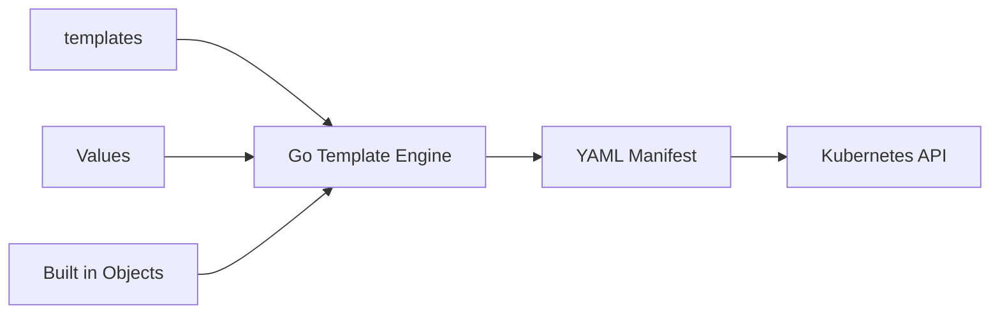
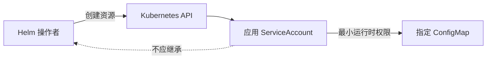
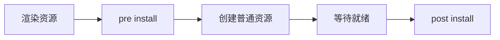

# Helm 学习笔记 · 第二册：Chart 开发与最佳实践

> **适用对象**：Chart 作者、平台工程师和负责 Kubernetes 应用标准化交付的运维人员<br>
> **学习目标**：从 Chart 结构出发，掌握 Go 模板、Values、依赖、复用、测试和生产质量约束。<br>
> **版本说明**：材料以 Helm 4 文档快照为基础；标有上游兼容提醒的功能应通过 `helm lint`、`helm template` 和真实目标集群复核。

## 第四章 · 理解并创建一个规范的 Chart

### 从目录结构认识 Chart 的组成
Chart 是遵循约定目录结构的一组文件。`helm create mychart` 可生成起点，但生产 Chart 应删除无关样例并按应用实际资源重建。

```text
mychart/
├── Chart.yaml
├── LICENSE
├── README.md
├── values.yaml
├── values.schema.json
├── charts/
├── crds/
└── templates/
    ├── _helpers.tpl
    ├── deployment.yaml
    ├── service.yaml
    ├── NOTES.txt
    └── tests/
```

| 路径 | 职责 |
| --- | --- |
| `Chart.yaml` | Chart 身份、版本、兼容性和依赖 |
| `values.yaml` | 用户可覆盖的默认配置 |
| `values.schema.json` | 对 Values 做结构与类型校验 |
| `templates/` | 渲染为 Kubernetes Manifest 的模板 |
| `charts/` | 下载或随包携带的依赖 Chart |
| `crds/` | 安装阶段优先创建、但不经过模板渲染的 CRD |

第一个模板可以只是普通 YAML；加入 `{{ .Release.Name }}` 等动作后才开始动态化：

```yaml
apiVersion: v1
kind: ConfigMap
metadata:
  name: {{ .Release.Name }}-config
data:
  mode: {{ .Values.mode | quote }}
```

#### 保留目录与普通文件的处理规则

Helm 对 `templates/`、`charts/` 和 `crds/` 有特殊语义。Chart 中其他文件会随包分发，但不会自动渲染为 Kubernetes 对象。它们可以被 `.Files` 读取，或作为 README、LICENSE 和配置片段存在。

`templates/` 下以下划线开头的文件通常用于 helper，不直接生成 Manifest；`NOTES.txt` 会被渲染但不提交给 Kubernetes；空模板和只包含注释的模板不会产生资源。

#### 从脚手架开始的正确步骤

```bash
helm create web
find web -maxdepth 3 -type f | sort
helm lint web
helm template demo web
```

脚手架只是示范，不代表生产默认值。创建后逐项检查：

- ServiceAccount 与 RBAC 是否确实需要创建。
- Service 默认类型是否应为 ClusterIP。
- Ingress API 与字段是否匹配支持的 Kubernetes 版本。
- `resources`、探针、securityContext 和 PodDisruptionBudget 是否提供合理接口。
- 测试 Pod 使用的镜像和网络访问是否适合离线环境。

#### 一个模板如何变成多文档 Manifest

Helm 会按模板文件读取内容，并在输出中加入 `# Source: CHART/templates/FILE` 注释。一个模板文件可以通过 `---` 生成多个 YAML 文档，但为了错误定位和代码审查，通常每个资源单独文件更清晰。

```yaml
---
apiVersion: v1
kind: Service
metadata:
  name: {{ include "web.fullname" . }}
---
apiVersion: apps/v1
kind: Deployment
metadata:
  name: {{ include "web.fullname" . }}
```

#### `crds/` 与 `templates/` 的顺序差异

`crds/` 中的 CRD 是普通 YAML，不能使用模板动作。安装时 Helm 先提交 CRD，等待 API 可发现，再渲染和提交其余资源。CRD 实例放在 `templates/` 中，才能使用 Values。已有 CRD 不会在普通升级中自动更新，这一边界需要独立治理。

### 正确维护 Chart.yaml、版本和类型
```yaml
apiVersion: v2
name: web-platform
description: Web platform deployment chart
type: application
version: 1.4.0
appVersion: "2.8.1"
kubeVersion: ">=1.30.0 <1.34.0"
maintainers:
  - name: platform-team
annotations:
  example.com/source-revision: abc123
```

`version` 是 Chart 自身的 SemVer，决定包名和依赖选择；`appVersion` 是应用版本信息，不参与 Chart 版本计算，建议加引号。Chart 内容发生可观察变化时应递增 `version`。`application` Chart 可安装，`library` Chart 只提供模板能力。

命名使用小写字母、数字和连字符，不用大写、下划线或点；YAML 使用两个空格，禁止 Tab。自定义元数据放进 `annotations`，不要随意增加 `Chart.yaml` 顶层字段。

#### `apiVersion`、`type` 与兼容性

现代 Chart 使用 `apiVersion: v2`，依赖直接声明在 `Chart.yaml`。`type` 缺省为 `application`；`library` Chart 只提供可复用定义，不能独立安装。把 application 改为 library 后，其中的普通资源模板不会作为对象输出。

#### 版本字段分别服务于什么

| 字段 | 约束 | 谁会读取 | 变化时机 |
| --- | --- | --- | --- |
| `version` | SemVer | Helm、仓库索引、依赖解析 | Chart 内容变化 |
| `appVersion` | 推荐字符串，可非 SemVer | 用户界面、标签和说明 | 默认应用版本变化 |
| `kubeVersion` | SemVer 约束 | 安装前兼容检查 | 支持矩阵变化 |

`appVersion: 1.0` 如果不加引号可能被 YAML 当作数字，Git SHA 也可能被误解为科学计数形式。它不应被模板当作镜像 tag 的唯一来源，除非 Chart 明确设计了这一契约。

#### 依赖条目的完整字段

```yaml
dependencies:
  - name: database
    alias: primary-db
    version: "~3.2.0"
    repository: oci://registry.example.com/charts
    condition: primaryDb.enabled
    tags: [database]
    import-values:
      - child: exports.connection
        parent: databaseConnection
```

`alias` 允许同一依赖出现多次；`condition` 和 `tags` 控制启用；`import-values` 把子 Chart 明确导出的值映射到父 Chart。这些行为应在父 Chart README 中说明，避免用户只能阅读模板猜测。

#### Chart 废弃流程

废弃不是直接删除旧包。先在新版本中设置 `deprecated: true` 并递增版本，再发布该版本，最后停止维护源码。仓库中最新版本被标为 deprecated 时，客户端才能识别整个 Chart 已废弃。已安装 Release 的迁移方案要另行说明。

### 用 README、LICENSE、NOTES 和忽略规则完善交付物
README 应说明用途、前提、Values、升级约束和示例；LICENSE 描述 Chart 模板代码的许可；`templates/NOTES.txt` 在安装、升级和 `helm status` 后输出简短的下一步操作。

```text
Thank you for installing {{ .Chart.Name }}.
Release: {{ .Release.Name }}
Namespace: {{ .Release.Namespace }}

Check status:
  helm status {{ .Release.Name }} -n {{ .Release.Namespace }}
```

`.helmignore` 防止源码元数据、临时文件或敏感材料进入包：

```gitignore
.git
.idea
*.tmp
secrets/
tests/fixtures/
```

它与 `.gitignore` 语义并不完全相同，例如材料指出 `**` 不受支持，且 `.helmignore` 不会自动忽略自身。打包后应使用 `tar -tzf` 检查实际内容。

#### README 至少回答的使用问题

1. Chart 安装什么应用，维护边界是什么。
2. 支持哪些 Helm 与 Kubernetes 版本。
3. 是否依赖 CRD、Ingress Controller、StorageClass 或外部 Secret。
4. 最小安装示例和生产 Values 示例分别是什么。
5. 哪些 Values 会创建集群级资源或改变数据持久化。
6. 如何升级、备份、回滚和卸载。
7. 已知限制、破坏性变更和安全建议是什么。

Values 表格应从源码或 Schema 自动核对，避免 README 与默认值漂移。

#### NOTES 应短而可执行

NOTES 可以根据 Service 类型、Ingress 开关和 TLS 配置输出不同命令，但不要打印 Secret 明文。它适合告诉用户如何获得访问地址、查看状态和运行测试，不适合复制整份 README。

```gotemplate
{{- if .Values.ingress.enabled }}
Open https://{{ first .Values.ingress.hosts }}
{{- else if eq .Values.service.type "LoadBalancer" }}
kubectl get svc {{ include "web.fullname" . }} -n {{ .Release.Namespace }}
{{- else }}
kubectl port-forward svc/{{ include "web.fullname" . }} 8080:80 \
  -n {{ .Release.Namespace }}
{{- end }}
```

#### 打包前检查忽略结果

`.helmignore` 使用 Go `filepath.Match` 风格，材料同时指出它与 `.gitignore` 的否定规则存在差异。最可靠的方法不是靠记忆，而是实际打包后查看归档：

```bash
helm package ./web --destination ./dist
tar -tzf ./dist/web-1.0.0.tgz | sort
```

发现私钥、`.env`、本地 Values、测试凭据或 Git 元数据时，应先修正 `.helmignore` 再发布，不能只从已经上传的仓库删除索引。

## 第五章 · 掌握 Go 模板语言与渲染上下文

### 从第一个模板理解渲染过程
模板动作放在 `{{` 与 `}}` 中。Helm 加载 Chart 和 Values，执行 `templates/` 下模板，将多个结果组成 Manifest，再提交给 Kubernetes。`helm get manifest` 可查看已发布版本，`helm template` 可查看本地渲染结果。



### 使用内置对象读取 Release、Chart、Values 与集群信息
| 对象 | 常用成员 | 用途 |
| --- | --- | --- |
| `.Release` | `Name`、`Namespace`、`Revision`、`IsInstall` | 感知发布上下文 |
| `.Values` | 用户与默认配置合并结果 | 驱动模板差异 |
| `.Chart` | `Name`、`Version`、`AppVersion` | 生成标签和说明 |
| `.Capabilities` | API 版本、Kubernetes 与 Helm 版本 | 兼容不同集群能力 |
| `.Files` | `Get`、`Glob`、`AsConfig`、`AsSecrets` | 读取 Chart 普通文件 |
| `.Template` | `Name`、`BasePath` | 定位当前模板 |
| `.Subcharts` | 子 Chart 作用域 | 从父 Chart 读取子 Chart 上下文 |

内置对象以大写字母开头。对可选配置先判断存在性，不要对空对象连续取值。

#### `.Release` 的操作感知字段

`.Release.IsInstall` 在安装时为真；`.Release.IsUpgrade` 在升级和回滚时为真。它们可以在确有兼容需要时控制资源，但如果同一 Chart 在安装与升级时生成完全不同的对象集合，会增加预测和测试难度。

```gotemplate
metadata:
  annotations:
    release-revision: {{ .Release.Revision | quote }}
    {{- if .Release.IsUpgrade }}
    operation: upgrade
    {{- else }}
    operation: install
    {{- end }}
```

#### `.Capabilities` 处理 API 差异

```gotemplate
{{- if .Capabilities.APIVersions.Has "policy/v1/PodDisruptionBudget" }}
apiVersion: policy/v1
{{- else }}
{{- fail "policy/v1 PodDisruptionBudget is required" }}
{{- end }}
```

对已经被 Kubernetes 删除的旧 API，不应永久保留双分支；应提高 `kubeVersion` 并清理历史兼容代码。`.Capabilities.KubeVersion` 适合版本约束，具体资源能力优先用 `APIVersions.Has`。

#### `.Template` 与 `.Subcharts`

`.Template.Name` 给出当前模板的命名空间路径，`.Template.BasePath` 给出当前 Chart 的模板目录，可用于计算其他模板内容摘要。`.Subcharts` 允许父 Chart 查看子 Chart 的完整作用域，但这会增强耦合；稳定共享值优先使用 `global` 或明确导入契约。

### 用函数、管道和操作符转换模板数据
管道把前一结果作为后一函数的最后一个参数：

```yaml
data:
  mode: {{ .Values.mode | default "safe" | upper | quote }}
  config.yaml: |
{{ .Values.config | toYaml | nindent 4 }}
```

常用函数族包括逻辑与比较、字符串、字典与列表、类型转换、编码、日期、加密摘要、正则、SemVer、YAML/JSON 序列化。选择原则是让输出清晰可预测，不要在模板里实现复杂业务逻辑。

`lookup` 能查询在线集群对象；普通客户端 dry-run 不连接 API Server，需要服务端 dry-run 才能验证。依赖 `lookup` 会降低离线渲染的确定性，应记录权限和失败行为。

#### 逻辑与默认值函数

模板把以下值视为假：`false`、数值 0、空字符串、`nil`、空列表和空字典。逻辑函数可以组合这些判断：

| 函数 | 作用 | 示例 |
| --- | --- | --- |
| `and` | 所有参数为真时返回最后一个参数 | `and .Values.enabled .Values.host` |
| `or` | 返回第一个非空参数 | `or .Values.host "localhost"` |
| `not` | 取反 | `not .Values.disabled` |
| `eq` / `ne` | 相等或不等比较 | `eq .Values.mode "prod"` |
| `lt` / `le` / `gt` / `ge` | 有序比较 | `ge .Values.replicas 2` |
| `default` | 输入为空时使用默认值 | `default 1 .Values.replicas` |
| `required` | 输入为空时中止渲染 | `required "host is required" .Values.host` |
| `empty` | 判断值是否为空 | `empty .Values.resources` |
| `fail` | 主动让模板失败 | `fail "unsupported mode"` |
| `coalesce` | 返回第一个非空值 | `coalesce .Values.a .Values.b "x"` |
| `ternary` | 根据布尔值二选一 | `ternary "on" "off" .Values.enabled` |

静态默认值应写进 `values.yaml`，`default` 更适合根据 Release 名称等上下文计算的默认值。`required` 的错误信息应指出完整 Values 路径和期望格式。

```gotemplate
{{- $mode := .Values.mode | default "standard" -}}
{{- if not (has $mode (list "standard" "ha")) -}}
{{- fail (printf "mode must be standard or ha, got %s" $mode) -}}
{{- end -}}
```

#### 字符串构造与清理

| 函数组 | 典型用途 |
| --- | --- |
| `print`、`printf`、`println` | 拼接名称和错误消息 |
| `trim`、`trimAll`、`trimPrefix`、`trimSuffix` | 清理用户输入 |
| `lower`、`upper`、`title`、`untitle` | 统一大小写 |
| `substr`、`trunc`、`abbrev` | 控制 Kubernetes 名称长度 |
| `contains`、`hasPrefix`、`hasSuffix` | 条件判断 |
| `replace` | 替换标签中不允许的字符 |
| `quote`、`squote` | 生成 YAML 字符串 |
| `indent`、`nindent` | 把多行输出嵌入 YAML |

```gotemplate
{{- define "web.fullname" -}}
{{- printf "%s-%s" .Release.Name .Chart.Name | trunc 63 | trimSuffix "-" -}}
{{- end -}}
```

`nindent 4` 会先添加换行再缩进四格，适合放在 `labels:` 或 `spec:` 之后；`indent 4` 只给已有各行增加缩进。二者混用不当是最常见的 YAML 损坏来源之一。

随机字符串函数包括 `randAlphaNum`、`randAlpha`、`randNumeric` 和 `randAscii`。它们每次渲染都可能产生新值，因此不要直接用于希望跨升级保持稳定的 Secret。稳定凭据应从外部 Secret、已有对象或明确持久化输入取得。

#### 字符串分割、列表和排序

```gotemplate
{{- $hosts := splitList "," (.Values.allowedHosts | default "") -}}
{{- range $host := compact $hosts | uniq | sortAlpha }}
- {{ $host | trim | quote }}
{{- end }}
```

| 函数 | 说明 |
| --- | --- |
| `splitList` | 按分隔符生成列表 |
| `join` | 把列表连接为字符串 |
| `list` | 创建列表 |
| `first` / `last` | 取首尾元素 |
| `append` / `prepend` | 返回增加元素的新列表 |
| `concat` | 合并多个列表 |
| `reverse` | 反转列表 |
| `uniq` | 去重 |
| `without` | 排除指定元素 |
| `has` | 判断元素是否在列表中 |
| `compact` | 移除空值 |
| `slice` | 取列表范围 |
| `chunk` | 切分为固定大小分组 |

许多函数还有 `mustXxx` 变体。普通变体可能在失败时返回空值或触发模板错误，`mustXxx` 会以可传播错误结束渲染。关键输入更适合显式失败，而不是悄悄生成不完整清单。

#### 字典的创建、查询和合并

Helm 模板中的字典是可变对象。`dict` 创建字典，`set` 和 `unset` 会修改它；因为函数需要返回值，通常用 `_` 接收不关心的返回值。

```gotemplate
{{- $labels := dict
      "app.kubernetes.io/name" .Chart.Name
      "app.kubernetes.io/instance" .Release.Name -}}
{{- $_ := set $labels "app.kubernetes.io/managed-by" .Release.Service -}}
{{- toYaml $labels | nindent 4 }}
```

| 函数 | 作用 |
| --- | --- |
| `get` | 按键读取，缺失时返回空值 |
| `dig` | 沿嵌套键安全下钻并提供默认值 |
| `hasKey` | 判断键是否存在 |
| `pluck` | 从多个字典提取同名键 |
| `keys` / `values` | 提取键或值列表 |
| `pick` | 保留指定键 |
| `omit` | 排除指定键 |
| `merge` | 深度合并，以目标字典为优先 |
| `mergeOverwrite` | 深度合并，右侧来源覆盖左侧 |
| `deepCopy` | 避免嵌套对象共享引用 |

合并复杂 Values 时要先确认优先方向。`merge` 与 `mergeOverwrite` 名称相似但覆盖规则不同；修改共享嵌套字典前先 `deepCopy`，否则 helper 可能意外改变后续模板看到的数据。

#### 类型检查与转换

YAML 解码后可能得到字符串、布尔、整数、浮点、列表或字典。模板函数不会自动把所有类型安全互换。

```gotemplate
replicas: {{ .Values.replicaCount | int }}
annotation: {{ .Values.buildNumber | toString | quote }}
{{- if kindIs "map" .Values.extraLabels }}
{{ toYaml .Values.extraLabels | nindent 4 }}
{{- end }}
```

| 函数 | 用途 |
| --- | --- |
| `atoi`、`int`、`int64`、`float64` | 转换数值 |
| `toString`、`toStrings` | 转成字符串或字符串列表 |
| `typeOf`、`typeIs`、`typeIsLike` | 检查 Go 类型 |
| `kindOf`、`kindIs` | 检查基础 kind |
| `deepEqual` | 深度比较复杂对象 |

类型转换失败不应靠默认零值掩盖。对公开 Values，优先用 `values.schema.json` 在模板执行前拒绝错误类型。

#### YAML 与 JSON 序列化

| 函数 | 输出 |
| --- | --- |
| `toYaml` / `toYamlPretty` | YAML 文本 |
| `fromYaml` | 把 YAML 字符串解析为对象 |
| `toJson` / `toPrettyJson` / `toRawJson` | 不同格式的 JSON |
| `fromJson` | 把 JSON 字符串解析为对象 |
| `fromYamlArray` / `fromJsonArray` | 解析数组文档 |

```gotemplate
{{- $policy := .Files.Get "policies/default.yaml" | fromYaml -}}
policy.json: |-
{{ $policy | toPrettyJson | nindent 2 }}
```

序列化结果是字符串，嵌入 YAML 时仍要正确缩进。不要把用户可控字符串直接交给 `fromYaml` 后再生成高权限资源，而不做 Schema 或键白名单校验。

#### Base64、摘要与证书函数

`b64enc` / `b64dec` 只编码和解码，不提供保密性。`sha1sum`、`sha256sum`、`adler32sum` 等可生成内容摘要；Chart 常用 `sha256sum` 把 ConfigMap 变化传播到 PodTemplate annotation。

```gotemplate
checksum/config: {{ include (print $.Template.BasePath "/configmap.yaml") . | sha256sum }}
```

材料还列出证书、密钥派生和加解密函数。它们适合受控场景，但在模板中生成随机密钥会造成升级不稳定，也难以轮换和审计。生产密钥通常交给专用 Secret 管理流程。

#### 日期、时间和持续时间

```gotemplate
generatedAt: {{ now | date "2006-01-02T15:04:05Z07:00" | quote }}
expiresAt: {{ now | dateModify "+24h" | date "2006-01-02T15:04:05Z07:00" | quote }}
```

`now` 会让每次渲染结果不同，从而引发无意义升级。只有确实需要“本次渲染时间”的资源才使用它；声明式资源更适合由发布系统传入固定时间或版本。

#### SemVer 比较

`semver` 解析版本，`semverCompare` 按约束判断。它适合处理应用或能力版本分支，但 Kubernetes API 支持优先使用 `.Capabilities.APIVersions.Has`。

```gotemplate
{{- if semverCompare ">=2.0.0" .Values.applicationVersion }}
featureMode: modern
{{- else }}
featureMode: legacy
{{- end }}
```

预发布版本的排序和约束有特定 SemVer 语义。不要用普通字符串比较版本，例如字符串 `"10.0.0"` 可能排在 `"2.0.0"` 前面。

#### 正则表达式与 URL 处理

`regexMatch`、`regexFind`、`regexFindAll`、`regexReplaceAll`、`regexSplit` 可做有限格式处理；对应的 `mustRegexXxx` 在表达式错误时明确失败。URL 函数可以解析、连接或修改 URL 组件。

模板中的正则适合轻量格式化，不应替代 Schema 的 `pattern` 校验。复杂验证写在 CI 或应用层更容易测试和维护。

#### `lookup` 的四种查询形态

```gotemplate
{{/* 查询一个命名空间对象 */}}
{{ $ns := lookup "v1" "Namespace" "" "production" }}

{{/* 查询命名空间内单个对象 */}}
{{ $secret := lookup "v1" "Secret" .Release.Namespace "existing" }}

{{/* 查询命名空间内列表 */}}
{{ $services := lookup "v1" "Service" .Release.Namespace "" }}

{{/* 查询所有命名空间 */}}
{{ $namespaces := lookup "v1" "Namespace" "" "" }}
```

查询列表时遍历返回值的 `.items`。对象不存在通常返回空值，权限或 API 错误则让模板失败。使用 `lookup` 复用 Secret 时，必须定义首次安装、升级、卸载后重装和 dry-run 各自的行为。

### 用 if、with、range 和变量组织控制逻辑
```yaml
{{- $root := . -}}
{{- if .Values.ingress.enabled }}
spec:
  rules:
    {{- range .Values.ingress.hosts }}
    - host: {{ .host | quote }}
      backendService: {{ $root.Release.Name }}
    {{- end }}
{{- end }}
```

`if` 判断真假，`with` 临时改变点号作用域，`range` 遍历集合。进入 `with` 或 `range` 后，`.` 不再一定是根对象；用 `$` 或提前声明变量保存根作用域。`{{-` 和 `-}}` 会裁剪相邻空白，左右同时使用可能误删换行，应检查渲染后的 YAML。

#### `if` 判断的是管道结果

```gotemplate
{{- if and .Values.ingress.enabled .Values.ingress.host }}
host: {{ .Values.ingress.host | quote }}
{{- else if .Values.service.enabled }}
host: {{ printf "%s.%s.svc" (include "web.fullname" .) .Release.Namespace | quote }}
{{- else }}
{{- fail "either ingress or service must be enabled" }}
{{- end }}
```

空映射和空列表为假，但一个存在且内部字段全为空的映射可能仍被视为非空。对结构化配置，应判断真正决定行为的字段，而不是只判断父键。

#### `with` 同时完成非空判断与作用域切换

```gotemplate
{{- with .Values.podAnnotations }}
annotations:
  {{- toYaml . | nindent 2 }}
{{- end }}
```

进入 `with` 后，`.` 变成 `podAnnotations`。此时 `.Release.Name` 不再可用，但 `$.Release.Name` 始终从根作用域查找。嵌套 `with` 很容易让读者迷失，复杂模板应保存具名变量或拆成 helper。

#### `range` 遍历列表和字典

遍历列表时可以取得索引和值：

```gotemplate
ports:
{{- range $index, $port := .Values.service.ports }}
  - name: {{ $port.name | default (printf "port-%d" $index) }}
    port: {{ $port.port }}
    targetPort: {{ $port.targetPort | default $port.port }}
{{- end }}
```

遍历字典时可以取得键和值，但不要依赖未明确排序的输出顺序。需要稳定结果时先用 `keys | sortAlpha`：

```gotemplate
{{- $env := .Values.env -}}
{{- range $name := keys $env | sortAlpha }}
- name: {{ $name }}
  value: {{ get $env $name | toString | quote }}
{{- end }}
```

`range` 还支持 `else`，集合为空时执行兜底分支。对必须非空的集合，更适合用 Schema 或 `required` 提前失败。

#### 变量的声明、赋值与生命周期

`:=` 声明变量，`=` 给已经存在的变量赋值。变量作用域延续到声明它的控制结构末尾，根变量 `$` 在整个模板中可用。

```gotemplate
{{- $count := 0 -}}
{{- range .Values.backends }}
{{- $count = add1 $count -}}
{{- end }}
backend-count: {{ $count }}
```

变量适合保存根作用域、重复计算结果或明确命名的中间值。不要把模板写成依赖大量可变变量的程序；可复用计算应放进命名模板。

#### 空白裁剪必须结合最终 YAML 检查

`{{-` 删除动作左侧的空白，包括换行；`-}}` 删除右侧空白。以下写法会把两个字段粘到一行：

```gotemplate
food: {{ .Values.food | quote }}
{{- if .Values.mug -}}
mug: "true"
{{- end -}}
```

调整裁剪符后必须查看实际输出。模板源码排版漂亮不代表渲染 YAML 正确，反过来也不应为了减少空行牺牲可读性。

### 用命名模板、include 和作用域实现复用
命名模板是全局的，应以 Chart 名称作为前缀避免父子 Chart 冲突。以下 helper 返回稳定标签：

```gotemplate
{{- define "web.labels" -}}
app.kubernetes.io/name: {{ .Chart.Name }}
app.kubernetes.io/instance: {{ .Release.Name }}
app.kubernetes.io/managed-by: {{ .Release.Service }}
{{- end -}}
```

```yaml
metadata:
  labels:
    {{- include "web.labels" . | nindent 4 }}
```

`template` 是动作，输出不能继续进入管道；`include` 是函数，更适合搭配 `indent`、`nindent`、`quote` 等。调用时显式传入 `.`，否则 helper 中拿不到预期上下文。

#### 命名模板是全局命名空间

父 Chart、子 Chart 和 Library Chart 的所有命名模板最终进入同一全局空间。同名定义的加载结果可能覆盖另一份定义，因此只用 `labels`、`fullname` 等通用名称是不安全的。推荐名称包含 Chart 名，公共库还可以包含版本：

```gotemplate
{{- define "platform-lib.v1.labels" -}}
app.kubernetes.io/managed-by: {{ .Release.Service }}
{{- end -}}
```

#### `define`、`template` 与 `include`

```gotemplate
{{- define "web.selectorLabels" -}}
app.kubernetes.io/name: {{ include "web.name" . }}
app.kubernetes.io/instance: {{ .Release.Name }}
{{- end -}}
```

```yaml
# template 动作直接写入当前位置
labels:
  {{- template "web.selectorLabels" . }}

# include 返回字符串，可进入管道
labels:
  {{- include "web.selectorLabels" . | nindent 2 }}
```

`include` 更容易控制缩进和后续转换，因此在 YAML 中通常更实用。

#### 用 `dict` 传递多个参数

命名模板只能接收一个上下文对象。需要同时传根作用域与局部配置时，可以传入字典：

```gotemplate
{{- include "web.container" (dict "root" $ "container" .Values.mainContainer) | nindent 2 }}
```

```gotemplate
{{- define "web.container" -}}
name: {{ .container.name }}
image: "{{ .container.repository }}:{{ .container.tag }}"
imagePullPolicy: {{ .root.Values.imagePullPolicy }}
{{- end -}}
```

这类接口应在 helper 注释中列出必需键，避免调用方只能阅读实现猜参数。

#### Partial 文件和注释规范

以下划线开头的模板文件不会直接产生 Kubernetes Manifest，`_helpers.tpl` 是常用位置。大型 Chart 可以按领域拆成 `_names.tpl`、`_labels.tpl`、`_pod.tpl`，但命名规则仍要统一。

```gotemplate
{{/*
web.fullname returns a DNS compatible resource name.
Input: root Helm context
*/}}
{{- define "web.fullname" -}}
...
{{- end -}}
```

模板注释不会进入渲染结果，YAML 注释会保留到 Manifest；API 对象通常不会保存客户端注释，因此需要长期存在的元数据应使用 annotation。

### 在模板中读取、匹配和编码文件
`.Files` 不能读取 `templates/`、被 `.helmignore` 排除的文件或父 Chart 文件。常见用法：

```yaml
data:
  app.conf: |-
{{ .Files.Get "conf/app.conf" | nindent 4 }}
```

```gotemplate
{{- range $path, $_ := .Files.Glob "conf/*.yaml" }}
{{ $path }}: |-
{{ $.Files.Get $path | nindent 2 }}
{{- end }}
```

`AsConfig` 适合 ConfigMap，`AsSecrets` 会做 Base64 编码但并不提供加密。Chart 包存在大小限制，不要把大型二进制或真正的明文凭据塞入 Chart。

#### 文件访问的安全边界

Chart 只能访问包内允许读取的文件：不能跨到父目录，子 Chart 不能读取父 Chart 文件，模板文件本身也不能通过 `.Files` 获取。这个边界保证一个依赖不能任意读取调用方源码。

#### 路径辅助函数

模板提供类似文件路径处理的函数：`base` 取文件名、`dir` 取目录、`ext` 取扩展名、`clean` 规范路径、`isAbs` 判断绝对路径。它们操作的是 Chart 内逻辑路径，不是主机文件系统访问能力。

```gotemplate
{{- range $path, $_ := .Files.Glob "dashboards/*.json" }}
{{ base $path }}: |-
{{ $.Files.Get $path | nindent 2 }}
{{- end }}
```

#### 用 `Glob` 批量构建 ConfigMap

```yaml
apiVersion: v1
kind: ConfigMap
metadata:
  name: {{ include "web.fullname" . }}-configs
data:
{{ (.Files.Glob "conf/*").AsConfig | indent 2 }}
```

批量导入时注意键名冲突：两个不同目录下的同名文件可能最终映射为相同键。需要保留目录结构时，应显式遍历并自行构造键。

#### 构建 Secret 数据

```yaml
apiVersion: v1
kind: Secret
metadata:
  name: {{ include "web.fullname" . }}-assets
type: Opaque
data:
{{ (.Files.Glob "assets/*").AsSecrets | indent 2 }}
```

`AsSecrets` 只是 Base64。任何能下载 Chart 的人都能恢复原文，因此只适合非机密的二进制内容或已经加密的载荷。

#### 按行处理文件

```gotemplate
allowlist: |-
{{- range .Files.Lines "files/allowlist.txt" }}
  {{ . }}
{{- end }}
```

文件内容进入 YAML 前要考虑缩进、尾随换行、字符编码和大小。配置过大时应改用镜像、对象存储或独立配置发布流程。

### 处理 YAML 类型、缩进、多行文本和锚点
YAML 类型会影响 Kubernetes 校验：端口通常是整数，环境变量值必须是字符串。多行文本用 `|` 保留换行、用 `>` 折叠换行；模板生成嵌套块时优先用 `nindent`。

```yaml
data:
  retries: "3"
  message: |-
    first line
    second line
```

Go 模板是强类型的。来自 YAML 的整数、字符串、布尔值和集合不能随意互换；必要时用 `int`、`toString` 等显式转换。YAML 锚点在解析后会被展开，Helm 再序列化时不会保留锚点本身。

#### 标量类型与显式标签

```yaml
port: 80
enabled: true
version: "1.0"
commit: "1234e10"
```

YAML 解析器可能把未引用的版本当数字，把类似科学计数法的字符串当数值。对必须保持文本的字段加引号。Kubernetes Schema 最终决定字段是否接受该类型，模板渲染成功并不代表服务端校验成功。

YAML 支持 `!!str`、`!!int` 等显式类型标签，但经过模板和库的多次解析后，依赖标签表达长期类型契约往往不如 Schema 清晰。

#### 多行文本的四种常见形式

| 形式 | 行尾换行 | 内容换行 |
| --- | --- | --- |
| `\|` | 保留一个 | 保留 |
| `\|-` | 删除 | 保留 |
| `>` | 保留一个 | 折叠为空格 |
| `>-` | 删除 | 折叠为空格 |

首行错误缩进会让整个 YAML 失败。嵌入外部文件时通常让模板动作从行首开始，再用 `nindent` 控制内容缩进。

#### 一个文件中的多个 YAML 文档

`---` 可以分隔文档，`...` 可以表示文档结束。Helm 会分别处理模板输出中的对象。Values 文件通常只使用一个文档；在同一 Values 文件中放多个文档不能指望 Helm 自动合并。

#### YAML 是 JSON 的超集

复杂内联结构有时用 JSON 更不容易被缩进破坏：

```yaml
annotations: {"example.com/mode": "strict", "example.com/owner": "platform"}
```

但整份模板应保持一致可读风格。只有当 JSON 明显降低动态结构的格式风险时再使用它。

#### 锚点不能作为最终去重机制

```yaml
defaults: &defaults
  cpu: 100m
worker:
  resources: *defaults
```

YAML 第一次解析后会把别名展开，重新编码时锚点消失。需要跨资源稳定复用时，应使用命名模板、Values 或 Library Chart，而不是依赖锚点保留。

### 调试模板并规划后续进阶路径
```bash
helm lint ./mychart
helm template demo ./mychart -f values-test.yaml --debug
helm install demo ./mychart -f values-test.yaml --dry-run --debug
helm install demo ./mychart -f values-test.yaml --dry-run=server --debug
```

排障顺序是：Values 是否合并正确、模板是否执行、输出是否为有效 YAML、API 是否存在、服务端策略是否接受、运行时对象是否健康。遇到 YAML 解析错误时可暂时注释疑似模板块，让渲染输出保留为注释以观察缩进。

#### 四层调试工具各自能发现什么

| 工具 | 发现的问题 | 发现不了的问题 |
| --- | --- | --- |
| `helm lint` | Chart 元数据、常见模板与规范问题 | 真实集群策略和运行状态 |
| `helm template` | 本地合并值和最终 YAML | 普通模式下的在线 `lookup` |
| `--dry-run=server` | API 发现、部分服务端校验 | 真正创建后的控制器行为 |
| 测试命名空间安装 | 调度、镜像、PVC、Hook 与探针 | 完整生产流量和数据风险 |

#### 只渲染一个模板定位问题

```bash
helm template demo ./web \
  -f values-test.yaml \
  --show-only templates/deployment.yaml \
  --debug
```

当错误发生在某个模板时，先缩小到单文件，再打印相关 Values 的类型或临时注释资源主体。调试语句不能进入最终 Manifest。

#### 模拟目标集群能力

```bash
helm template demo ./web \
  --kube-version 1.32.0 \
  --api-versions monitoring.coreos.com/v1/ServiceMonitor
```

模拟只影响模板看到的 Capabilities，不等同于目标集群服务端验证。最终仍应在实际版本的测试集群安装。

#### 渲染成功后的下一步

模板学习之后应继续掌握 Values 设计、依赖管理、Chart 最佳实践、签名和仓库分发。成熟 Chart 的目标不是使用尽可能多的模板技巧，而是给使用者提供稳定、可解释、可测试的配置接口。

## 第六章 · 设计 Values、依赖与可复用 Chart

### 设计可覆盖、可理解且类型稳定的 Values
Values 可来自 `values.yaml`、父 Chart、多个 `-f` 文件和 `--set`。后提供的值优先。公开 Values 应使用 lowerCamelCase，键名不应重复内置对象名称。

```yaml
image:
  repository: example/web
  tag: "2.8.1"
  pullPolicy: IfNotPresent
service:
  type: ClusterIP
  port: 8080
resources: {}
```

扁平值更容易通过 `--set` 覆盖，嵌套值更有组织性；选择后保持一致。每个用户可配置项都应在 `values.yaml` 注释中说明。用 `values.schema.json` 校验必填项、枚举和类型，比在模板深处才失败更友好。

#### Values 的四层来源

由低到高通常是：Chart 默认 `values.yaml`、父 Chart 对子 Chart 的覆盖、用户提供的一个或多个 Values 文件、命令行设置。同一层多个输入按出现顺序由右侧覆盖左侧。

```bash
helm upgrade --install web ./web \
  -f values-common.yaml \
  -f values-production.yaml \
  --set-string image.tag=2026.08
```

把长期配置写进文件，把短期实验放在命令行。生产流水线应保存最终 Values，但导出或记录前要处理敏感字段。

#### 扁平与嵌套的取舍

```yaml
# 扁平结构
serverName: api
serverPort: 8080

# 嵌套结构
server:
  name: api
  port: 8080
```

扁平结构检查简单、适合 `--set`；嵌套结构能表达领域边界。嵌套每一层都可能为空，模板访问前要检查父对象。不要为了理论扁平化把完全不同的组件字段混在一起。

#### 让类型在所有入口保持一致

同一个键不要在默认值中是布尔、在生产文件中变成字符串。端口、数量和超时的单位要写入键名或注释。环境变量最终必须是字符串，但 Values 可以保持业务类型，再在模板边界转换。

```yaml
replicaCount: 3
terminationGracePeriodSeconds: 30
featureEnabled: true
```

#### 用 JSON Schema 提前失败

```json
{
  "$schema": "https://json-schema.org/draft/2020-12/schema",
  "type": "object",
  "required": ["image"],
  "properties": {
    "replicaCount": {"type": "integer", "minimum": 1},
    "mode": {"type": "string", "enum": ["standard", "ha"]},
    "image": {
      "type": "object",
      "required": ["repository", "tag"],
      "properties": {
        "repository": {"type": "string", "minLength": 1},
        "tag": {"type": "string", "minLength": 1}
      }
    }
  }
}
```

Schema 应覆盖公开接口的关键约束，但不要把所有 Kubernetes OpenAPI 再复制一遍。`helm lint`、`template`、`install` 和 `upgrade` 都可能触发 Values 校验。

#### 删除默认键

用户可以把某些映射键设为 `null`，使它从合并结果中删除。这在覆盖 Chart 默认探针或安全上下文时有用，但 Chart 应明确哪些键允许删除，避免模板假设它永远存在。

### 声明依赖并理解版本、仓库、条件和标签
```yaml
dependencies:
  - name: postgresql
    version: "~16.2.0"
    repository: https://charts.example.com
    condition: postgresql.enabled
    tags:
      - database
```

`helm dependency update` 根据 `Chart.yaml` 解析版本并更新锁文件；`helm dependency build` 按锁文件重建 `charts/`。生产构建应提交和使用锁文件，避免同一源码在不同时间解析出不同依赖。条件优先于标签，且在顶层父 Chart Values 中求值。

#### 版本约束与预发布版本

精确版本可重复性最高；`~1.2.3` 允许同一 Minor 的 Patch，`^1.2.3` 允许同一 Major 的兼容更新。预发布版本通常不会被普通稳定约束自动选中，需要约束显式包含预发布范围。

开发阶段可以使用范围寻找兼容版本，发布时由 `Chart.lock` 固定实际解析结果。不要删除锁文件后在生产构建中临时重新解析。

#### 仓库字段的几种形式

```yaml
dependencies:
  - name: remote
    version: 1.2.3
    repository: https://charts.example.com
  - name: aliased
    version: 2.0.0
    repository: "@internal"
  - name: local
    version: 0.1.0
    repository: file://../local-chart
  - name: oci-chart
    version: 3.1.0
    repository: oci://registry.example.com/charts
```

`file://` 方便本地组合，但打包与 CI 环境必须能解析相对路径。仓库别名依赖本机仓库配置，公共源码更适合使用明确 URL 或 OCI 路径。

#### Condition、Tag 与 Alias

Condition 是一个或多个布尔 Values 路径，找到的第一个有效路径决定是否启用依赖；Condition 的显式结果优先于 Tag。Tag 在顶层 `tags:` 下批量开关一组依赖。

```yaml
tags:
  observability: true
metrics:
  enabled: false
```

同一个 Chart 需要安装两次时用不同 `alias`，父 Values 也使用 alias 作为键。别名改变依赖在父 Chart 中的逻辑身份，不改变原包的 Chart 名称。

#### `import-values` 的两个方向

子 Chart 可以在 `exports` 下声明可导出的值，父依赖条目用字符串导入；也可以用 `child` / `parent` 映射任意子路径到父路径。导入会增加父子接口耦合，应只导出稳定信息，不要暴露子 Chart 内部全部默认值。

#### 手工放入 `charts/` 的代价

Helm 也能使用直接放在 `charts/` 的目录或包，即使它没有在 `Chart.yaml` 声明。这种方式难以让工具判断来源和版本，更新命令也不会随意删除未声明包。生产 Chart 应优先声明依赖并使用锁文件。

### 用父子 Chart 和全局 Values 组合应用
子 Chart 应当可以独立运行，不能依赖父 Chart 的私有 Values。父 Chart 通过与子 Chart 同名的键覆盖其配置，`global` 值对父子双方可见。复杂系统可以用 umbrella Chart 组合多个组件，但要控制耦合和升级半径。

```yaml
postgresql:
  enabled: true
  auth:
    database: app
global:
  imageRegistry: registry.example.com
```

命名模板全局共享，helper 必须命名空间化。不要依赖 `block` 在父子 Chart 之间覆盖实现，因为多个实现的加载顺序难以预测。

#### 子 Chart 的独立性原则

子 Chart 不能直接读取父 Chart 普通 Values。它只应依赖自己的默认值、父 Chart 在子键下传入的覆盖值，以及双方约定的 `global` 值。这样它才能单独执行 `helm lint` 和安装测试。

```text
父 Values
├── global                 父子双方可见
├── postgresql             覆盖 postgresql 子 Chart
└── web                    仅父 Chart 自己解释
```

#### 父 Chart 覆盖子 Chart

```yaml
# parent values.yaml
database:
  auth:
    database: web
    username: web
```

如果依赖使用 `alias: database`，覆盖键也应是 `database`。父 Chart 不应复制子 Chart 的全部 values，只暴露该组合场景需要的覆盖项。

#### Global Values 的治理

`global` 适合镜像仓库、通用 pull secret、域名后缀等真正跨组件一致的配置。滥用 global 会让子 Chart 的行为受隐藏输入影响。每个 global 键都应有明确类型、默认值和消费者清单。

#### 共享模板而不是覆盖模板

父子 Chart 可以使用彼此全局可见的命名模板，但无法像面向对象继承那样可靠覆盖 `block`。推荐把共享模板放进 Library Chart，使用版本化名称和明确参数。

### 用 Library Chart 沉淀跨 Chart 的公共能力
Library Chart 在 `Chart.yaml` 中声明 `type: library`，自身不能安装，也不渲染普通资源，适合集中维护标签、容器、Service 等模板原语。应用 Chart 把它声明为依赖，再用 `include` 调用。

```yaml
apiVersion: v2
name: platform-lib
type: library
version: 1.0.0
```

Library Chart 应提供稳定、文档化的输入输出契约。公共模板一旦被许多 Chart 引用，破坏性修改的影响类似共享代码库，应按 SemVer 管理。

#### 创建一个最小 Library Chart

```text
platform-lib/
├── Chart.yaml
└── templates/
    ├── _util.tpl
    └── _service.tpl
```

```gotemplate
{{- define "platform-lib.util.merge" -}}
{{- $top := first . -}}
{{- $overrides := fromYaml (include (index . 1) $top) | default dict -}}
{{- $base := fromYaml (include (index . 2) $top) | default dict -}}
{{- toYaml (mergeOverwrite $base $overrides) -}}
{{- end -}}
```

常见 Library Chart 模式是定义一个完整资源基模板，再允许应用 Chart 提供覆盖模板，二者解析为字典后合并。它比复制 Service、Deployment 骨架更一致，但也更难调试，必须提供渲染示例。

#### 应用 Chart 声明和调用库

```yaml
dependencies:
  - name: platform-lib
    version: 1.0.0
    repository: oci://registry.example.com/charts
```

```gotemplate
{{- include "platform-lib.service" (dict "root" . "service" .Values.service) }}
```

应用 Chart 的测试要锁定库版本。Library Chart 的 Major 升级可能同时影响很多下游，应提供迁移对照和分批升级策略。

#### 什么内容不适合放进库

- 单个应用特有的环境变量和业务端口。
- 变化频繁、尚未形成稳定契约的模板。
- 需要读取调用方大量私有 Values 的“万能 Deployment”。
- 通过隐式 global 值改变资源的逻辑。

库应深化接口，而不是把所有 Chart 变成难以理解的间接层。

## 第七章 · 把 Chart 提升到可维护的生产质量

### 遵循模板目录、命名、空白和注释约定
每个资源通常单独成文件，文件名使用连字符；helper 放 `_helpers.tpl`。模板名称带 Chart 前缀，YAML 使用两个空格。YAML 注释会进入最终清单，模板注释 `{{/* ... */}}` 只留在源码。

#### 模板目录的可维护布局

```text
templates/
├── _helpers.tpl
├── serviceaccount.yaml
├── configmap.yaml
├── service.yaml
├── deployment.yaml
├── ingress.yaml
├── NOTES.txt
└── tests/
    └── test-connection.yaml
```

资源文件名应表达 Kind 或职责。一个文件包含多个资源会让 `--show-only`、错误行定位和代码所有权变得困难。生成资源的模板使用 `.yaml`，只定义 helper 的文件使用 `.tpl`。

#### 格式、空白和注释

- YAML 统一两个空格，不使用 Tab。
- 模板动作两侧留空格，例如 `{{ .Values.name }}`。
- 大块对象使用 `toYaml | nindent`，不要手工拼接每一层缩进。
- 模板注释解释渲染逻辑，YAML 注释解释最终对象字段。
- 生成的 YAML 也应可读，因为它是排障时的第一手证据。

#### 模板输出 JSON 的边界

JSON 是合法 YAML，某些复杂动态映射用 JSON 可以规避缩进问题，但普通 Kubernetes Manifest 仍建议采用 YAML 风格。模板输出必须是 YAML 或 JSON 对象文档，不能夹杂调试文本。

### 规范 Labels、Annotations、PodTemplate 和镜像策略
推荐使用 Kubernetes 通用标签：

```yaml
labels:
  app.kubernetes.io/name: {{ .Chart.Name }}
  app.kubernetes.io/instance: {{ .Release.Name }}
  app.kubernetes.io/version: {{ .Chart.AppVersion | quote }}
  app.kubernetes.io/managed-by: {{ .Release.Service }}
  helm.sh/chart: "{{ .Chart.Name }}-{{ .Chart.Version | replace "+" "_" }}"
```

用于选择器的标签必须稳定，不能随升级改变。镜像标签不应默认 `latest`；显式设置 `imagePullPolicy`，Deployment selector 必须与 PodTemplate 标签匹配。

#### Label 与 Annotation 的选择

Label 用于选择、分组和查询，受到字符与长度限制；Annotation 保存不参与选择的较大元数据。查询条件、Service selector 和 Deployment selector 使用 Label，校验和、说明 URL、外部系统 ID 使用 Annotation。

推荐标签的作用：

| 标签 | 说明 |
| --- | --- |
| `app.kubernetes.io/name` | 应用逻辑名称 |
| `app.kubernetes.io/instance` | Release 实例 |
| `app.kubernetes.io/version` | 应用版本 |
| `app.kubernetes.io/component` | 组件角色 |
| `app.kubernetes.io/part-of` | 所属系统 |
| `app.kubernetes.io/managed-by` | 管理工具 |
| `helm.sh/chart` | Chart 名与版本 |

#### Selector 只能使用稳定标签

Deployment 的 `.spec.selector.matchLabels` 与 PodTemplate 标签必须匹配，且 selector 在创建后通常不可变。不要把 Chart Version 或 App Version 放进 selector，否则升级会尝试改变不可变字段。

```yaml
selectorLabels:
  app.kubernetes.io/name: web
  app.kubernetes.io/instance: web-prod
```

#### 镜像与拉取策略

镜像仓库、名称、tag 与 digest 应提供清晰 Values。生产环境避免浮动 `latest`；如果支持 digest，定义 tag 与 digest 同时设置时的优先级。`IfNotPresent`、`Always` 和 `Never` 应根据不可变标签与运行环境选择。

#### PodTemplate 的关键生产字段

Chart 至少要考虑：Pod 与容器 securityContext、requests/limits、探针、亲和与反亲和、拓扑分布、容忍、优雅终止、ServiceAccount、镜像拉取凭据和 PodDisruptionBudget。默认值应安全但不能假装适合所有负载。

#### 用 Values 暴露可治理配置

不要直接把整个 PodSpec 暴露为无约束字典，否则 Chart 无法给出稳定接口。更合适的是为常见能力建立明确 Values，并为高级场景提供少量经过 schema 约束的扩展点：

```yaml
replicaCount: 2

image:
  repository: registry.example.com/platform/web
  tag: "1.4.0"
  digest: ""
  pullPolicy: IfNotPresent

resources:
  requests:
    cpu: 100m
    memory: 128Mi
  limits:
    memory: 256Mi

podSecurityContext:
  runAsNonRoot: true
  seccompProfile:
    type: RuntimeDefault

containerSecurityContext:
  allowPrivilegeEscalation: false
  readOnlyRootFilesystem: true
  capabilities:
    drop: ["ALL"]
```

模板用 `with` 和 `toYaml | nindent` 输出对象，同时用 `values.schema.json` 限制类型。默认安全上下文要与镜像真实运行用户和写目录兼容；不能只为通过扫描而设置一个会让容器启动失败的字段。

#### 镜像 tag 与 digest 的优先级

```gotemplate
image: "{{ .Values.image.repository }}{{- if .Values.image.digest }}@{{ .Values.image.digest }}{{- else }}:{{ required "image.tag is required when digest is empty" .Values.image.tag }}{{- end }}"
```

digest 能锁定不可变内容，tag 更适合人类识别。两者同时配置时必须定义优先级并在 Notes 或 README 说明。镜像仓库重写功能也要避免把 digest 丢掉。

#### 探针不是复制粘贴项

Startup Probe 保护慢启动，Readiness Probe 控制是否接收流量，Liveness Probe 决定是否重启。Chart 可提供合理默认路径和阈值，但应允许关闭或调整：

```yaml
probes:
  startup:
    enabled: true
    path: /health/startup
    failureThreshold: 30
    periodSeconds: 2
  readiness:
    enabled: true
    path: /health/ready
  liveness:
    enabled: true
    path: /health/live
```

三个探针指向同一个依赖数据库的检查可能导致依赖故障时所有 Pod 被循环重启。探针语义应由应用负责，Chart 只负责准确表达。

#### 调度策略需要可组合

节点选择器、亲和、容忍和 topology spread 常被平台同时使用。模板不能在一个开关启用时覆盖另一个对象：

```yaml
nodeSelector: {}
tolerations: []
affinity: {}
topologySpreadConstraints: []
```

默认反亲和若设为 required，单节点开发集群可能完全无法调度；更稳妥的是默认 preferred，并提供严格生产配置示例。

#### 优雅终止与可用性预算

Deployment 更新时要协调 `terminationGracePeriodSeconds`、preStop、应用连接排空、探针和滚动策略。PodDisruptionBudget 防止自愿中断同时驱逐过多副本，但单副本应用设置 `minAvailable: 1` 会阻塞节点维护。

Chart 应根据 replicaCount 校验或文档化 PDB 约束，并允许平台接入现有 HPA。不要同时固定 replicas 又让 HPA 管理同一字段而产生持续漂移。

#### PodTemplate 验收矩阵

| 场景 | 需要验证 |
| --- | --- |
| 单副本开发 | 能调度，不被严格反亲和阻塞 |
| 多副本生产 | 跨节点/区域分散，滚动更新保持可用 |
| 非 root 镜像 | 安全上下文与写目录兼容 |
| 资源紧张 | requests 可调，限制不会造成频繁 OOM |
| 慢启动 | startup probe 覆盖初始化窗口 |
| 节点维护 | PDB、优雅终止和流量摘除协同 |
| 私有镜像 | imagePullSecrets 与 ServiceAccount 正确 |

### 安全地创建 RBAC 与 CRD 资源
RBAC 默认遵循最小权限，并允许使用者关闭 ServiceAccount/RBAC 创建以接入现有身份。CRD 放在 `crds/`，先于模板安装且不参与模板渲染；Helm 不负责常规升级或删除 CRD，因此 CRD 演进应建立独立流程。

#### 可切换的 ServiceAccount 与 RBAC

```yaml
serviceAccount:
  create: true
  name: ""
rbac:
  create: true
```

```gotemplate
{{- define "web.serviceAccountName" -}}
{{- if .Values.serviceAccount.create -}}
{{ default (include "web.fullname" .) .Values.serviceAccount.name }}
{{- else -}}
{{ required "serviceAccount.name is required when create=false" .Values.serviceAccount.name }}
{{- end -}}
{{- end -}}
```

Role 只授予应用运行需要的资源和动作。是否“默认创建 RBAC”取决于 Chart 是否能在没有权限对象时工作，但一旦允许关闭，就必须要求调用方提供现有 ServiceAccount 名称。

#### Role 与 ClusterRole 的选择

优先创建 namespace 范围的 Role。只有应用确实需要读取 Node、Namespace、CRD 或跨 namespace 对象时才使用 ClusterRole，并在 README 单独列出原因。

```yaml
apiVersion: rbac.authorization.k8s.io/v1
kind: Role
metadata:
  name: {{ include "web.fullname" . }}
rules:
  - apiGroups: [""]
    resources: ["configmaps"]
    resourceNames: [{{ include "web.fullname" . | quote }}]
    verbs: ["get", "watch"]
```

可以用 `resourceNames` 进一步限制具体对象，但并非所有 verb 都支持同样约束。避免 `apiGroups: ["*"]`、`resources: ["*"]`、`verbs: ["*"]` 组合。

#### 创建者权限与运行时权限分开

安装 Helm 的身份需要创建 Deployment、Service、Role 等资源；工作负载 ServiceAccount 只需要应用运行时权限。不要为了“安装方便”把 Helm 操作者的高权限 ServiceAccount 直接挂给 Pod。



CI 可以先用 impersonation 或 `kubectl auth can-i` 检查安装权限；运行时权限则通过独立 ServiceAccount 和实际负向测试验证。

#### RBAC Values 的完整边界

```yaml
serviceAccount:
  create: true
  name: ""
  annotations: {}
  automountServiceAccountToken: false

rbac:
  create: true
```

只有应用要调用 Kubernetes API 时才自动挂载 token。允许用户传 annotations 时，要在多租户平台防止其借云 IAM 注解绑定未授权身份。

#### RBAC 验收

测试不仅要证明允许的动作成功，也要证明越权动作失败。例如应用需要读取一个 ConfigMap，应验证它不能列出所有 Secret、不能创建 Pod、不能访问其他 namespace。

#### CRD 安装的两种策略

1. 把 CRD 放在主 Chart `crds/`，首次安装自动创建，升级由独立流程处理。
2. 把 CRD 拆成单独 Chart，平台团队先安装和升级 CRD，再发布使用它的应用 Chart。

第二种方式更适合多个 Release 共享 CRD。无论哪种方式，删除 CRD 都可能级联删除所有自定义资源，不应由普通 `helm uninstall` 触发。

#### CRD 的限制

- 已存在时不会重新安装。
- 普通 upgrade 和 rollback 不负责升级 CRD。
- Helm 不自动删除 CRD。
- `crds/` 文件不能使用 Values 或模板函数。
- CRD 建立后，模板可以通过 `.Capabilities` 看到新 API。

#### CRD 升级不是普通模板升级

CRD schema 可能新增字段、收紧校验、改变 served/storage version 或增加 conversion webhook。升级前要盘点现有自定义资源是否满足新 schema，并验证旧客户端仍能读写。

建议流程：

```text
导出现有 CR 与 CRD
  -> 对新 schema 做兼容检查
  -> 部署 conversion webhook（若需要）
  -> 更新 CRD
  -> 迁移 storage version
  -> 升级 controller/app Chart
  -> 验证旧版本字段与回退方案
```

删除 CRD 可能级联删除全部 CR，不能把它放进普通清理脚本。即使备份 YAML，也可能无法恢复其控制器管理的外部状态。

#### `--skip-crds` 的责任转移

使用者跳过 CRD 安装时，Chart 应尽早用 capabilities 或明确校验提示缺失 API。README 需要写明所需 CRD 名称、最小版本和安装来源，而不是让应用对象在 API Server 处才报“no matches for kind”。

### 用 Hook 介入 Release 生命周期
Hook 可在 `pre-install`、`post-install`、`pre-upgrade`、`post-upgrade`、`pre-delete`、`post-delete`、`pre-rollback`、`post-rollback` 和 `test` 等阶段执行。

```yaml
metadata:
  annotations:
    helm.sh/hook: pre-upgrade
    helm.sh/hook-weight: "-5"
    helm.sh/hook-delete-policy: before-hook-creation,hook-succeeded
```

Hook 资源不随 Release 自动管理，必须设计删除策略或 Job TTL。Hook 失败可能阻塞发布；数据库迁移等操作还必须满足幂等和可恢复要求。

#### Hook 与 Release 生命周期

安装时可按“加载 Chart → 渲染 → 执行 pre-install → 创建普通资源 → 执行 post-install”理解；升级、删除和回滚有对应的前后 Hook。`crd-install` 属于旧机制，现代 CRD 使用 `crds/`。



#### Weight 与就绪判断

同一阶段多个 Hook 先按权重从小到大排序，再按资源种类和名称等规则处理。权重必须是字符串形式的整数。Job 和 Pod Hook 会等待完成；失败会让发布失败。其他资源被 API Server 接受后通常就视为就绪。

#### 删除策略

| 策略 | 行为 |
| --- | --- |
| `before-hook-creation` | 新 Hook 创建前删除旧资源 |
| `hook-succeeded` | 成功后删除 |
| `hook-failed` | 失败后删除 |

为了保留失败证据，不一定要立即删除失败 Job；但长期保留会堆积资源。可以结合 Job TTL 和日志采集。

#### Hook 不是普通 Release 资源

Hook 创建的对象不由 Release 常规清单跟踪，卸载时不能假设它们自动消失。子 Chart Hook 也会执行，父 Chart 无法简单关闭它们；选择依赖 Chart 时必须审查其 Hook。

#### 数据库迁移 Hook 的设计

迁移 Job 至少要具备：固定镜像、最小 ServiceAccount、明确超时、幂等迁移版本、并发锁、可重复查询状态和可审计日志。不要把数据库管理员密码直接写入 Values。

```yaml
metadata:
  annotations:
    helm.sh/hook: pre-upgrade
    helm.sh/hook-weight: "-10"
    helm.sh/hook-delete-policy: before-hook-creation
spec:
  backoffLimit: 1
  activeDeadlineSeconds: 600
  template:
    spec:
      restartPolicy: Never
```

保留失败 Job 有助于排障，因此不要无条件设置 `hook-failed` 删除；可以由 TTL 或流水线在采集证据后清理。

迁移若不向后兼容，`--atomic` 回滚旧 Deployment 也无法恢复数据库。更稳妥的是 expand/migrate/contract 分阶段发布。

#### Hook 故障排查

```bash
kubectl get jobs,pods -n production \
  -l app.kubernetes.io/instance=web
kubectl describe job -n production web-migrate
kubectl logs -n production job/web-migrate --all-containers
kubectl get events -n production --sort-by=.lastTimestamp
```

先判断 Hook 是否渲染、是否创建、是否调度、是否运行、退出码是否非零。Helm 只报告“Hook failed”时，真正根因通常在 Job condition、Pod 状态或 Event。

#### Hook 安全审查

第三方 Chart 的 Hook 可以在安装、升级、删除和回滚阶段执行，并可能拥有高权限 ServiceAccount。采用 Chart 前应把 Hook 当可执行供应链内容审查：镜像来源、命令、网络访问、Secret、RBAC 与清理策略都要检查。

### 用 Chart Test 和静态检查建立质量门
Chart Test 是带 `helm.sh/hook: test` 注解的 Pod 或 Job，进程退出码 0 表示成功。它适合验证服务连通、配置生效和基本认证。

```bash
helm lint ./chart
helm template demo ./chart -f values-ci.yaml
helm install demo ./chart -n ci --create-namespace --wait
helm test demo -n ci --logs
```

单元渲染、API 校验、安装测试和业务冒烟测试是不同层次，不能互相替代。

#### 一个连接测试 Pod

```yaml
apiVersion: v1
kind: Pod
metadata:
  name: "{{ include "web.fullname" . }}-test-connection"
  annotations:
    helm.sh/hook: test
    helm.sh/hook-delete-policy: before-hook-creation,hook-succeeded
spec:
  restartPolicy: Never
  containers:
    - name: wget
      image: busybox:1.36
      command: ["wget"]
      args: ["-qO-", "http://{{ include "web.fullname" . }}:{{ .Values.service.port }}/healthz"]
```

测试容器退出 0 才算成功。测试镜像应固定版本，命令应有超时，不能无限等待。

#### 测试套件应覆盖什么

- Values 是否真正进入 ConfigMap、Secret 或容器参数。
- Service DNS 和端口是否连通。
- 正确凭据成功、错误凭据失败。
- 核心依赖是否可访问。
- 升级后数据或 API 是否保持兼容。

`helm test --logs` 在测试结束后收集日志。测试失败时还要查看 Pod 状态和 Event，区分断言失败、镜像拉取失败、调度失败与网络策略阻断。

#### 正向与负向测试

只验证 `/healthz` 返回成功会漏掉认证和隔离问题。一个更完整的套件可包含：

| 测试 | 预期 |
| --- | --- |
| Service DNS | 名称可解析到目标 Service |
| 健康接口 | 返回成功且在超时内完成 |
| 有效凭据 | 能完成最小业务请求 |
| 无效凭据 | 被明确拒绝，不返回敏感正文 |
| 无权限 ServiceAccount | 不能读取受保护资源 |
| 依赖不可用 | 应用返回可诊断错误而非永久挂起 |

负向测试必须确保“失败是预期结果”时测试进程仍返回 0；否则 Helm 会把正确拒绝误判为测试失败。

#### 测试资源的权限

Test Pod 默认可能使用 namespace 的 default ServiceAccount。若只需要访问 Service，应显式关闭 token 自动挂载；需要 Kubernetes API 时创建专用、最小权限 ServiceAccount。

测试容器也应使用非 root、安全上下文和固定 digest。测试不是生产 Deployment，不代表可以忽略供应链和权限。

#### 安装、升级和回滚都要测

干净安装通过不能证明升级可用。CI 至少设计：

```text
安装 N-1 -> test -> 升级 N -> test -> 回滚/向前修复演练
```

对有状态系统还要准备真实旧版本数据，验证 schema 和存储兼容。回滚不可行时，应明确只支持向前修复。

#### CI 质量门的顺序

```text
格式与静态扫描
      ↓
helm lint
      ↓
多组 Values 渲染
      ↓
目标 API Schema 校验
      ↓
临时集群安装
      ↓
helm test 与业务冒烟
      ↓
打包 签名 发布
```

只用默认 Values 测试会漏掉条件分支。至少覆盖最小配置、生产推荐配置和可选组件开启配置。

### 应用模板函数、校验、复用与幂等技巧
- 用 `required` 为关键 Values 给出可理解的失败信息。
- 字符串加引号，数字保持数值类型；环境变量值即使像数字也应是字符串。
- 用 `include` 复用并接入管道，用 `tpl` 谨慎渲染用户提供的模板字符串。
- 对 ConfigMap/Secret 内容计算 `sha256sum` 注入 PodTemplate annotation，触发声明式滚动更新。
- 随机函数每次渲染都会变化，升级时可能制造无意义变更。
- `helm.sh/resource-policy: keep` 会留下孤儿资源，必须有接管方案。
- `helm upgrade --install` 适合幂等发布入口，但仍需锁定版本、Values 和等待策略。

```yaml
spec:
  template:
    metadata:
      annotations:
checksum/config: {{ include (print $.Template.BasePath "/configmap.yaml") . | sha256sum }}
```

#### `tpl` 的能力与风险

`tpl` 会把字符串再次当模板执行：

```yaml
# values.yaml
externalUrl: "https://{{ .Release.Name }}.example.com"
```

```gotemplate
value: {{ tpl .Values.externalUrl . | quote }}
```

这增强了使用者能力，也允许调用模板函数和访问上下文。只对受信任 Values 开放，不能把不可信多租户输入直接交给 `tpl`。

#### ConfigMap 变化触发滚动更新

Pod 挂载 ConfigMap 后，应用未必自动重载。把渲染内容摘要写入 PodTemplate annotation 会改变 ReplicaSet 模板，从而触发 Deployment 滚动更新。Library Chart 中无法依赖调用方 `Template.BasePath` 时，可以对命名模板输出计算摘要。

#### 随机值为何破坏幂等

`randAlphaNum`、证书生成和时间函数每次渲染都可能变化。即使 Values 与 Chart 未变，upgrade 也会产生新 Manifest。需要首次生成后复用的值，可以用 `lookup` 读取已有 Secret，或由外部 Secret 系统负责。

#### `resource-policy: keep` 的后果

保留策略可以保护 PVC、Secret 等对象不被删除，但 Helm 会放弃管理它。后续同名安装可能因对象已存在失败，安全补丁也不会自动应用。使用前要明确对象所有者、升级方式和最终删除审批。

#### 大型组合 Chart 的边界

Umbrella Chart 适合一起发布、一起版本化的组件。如果组件生命周期、权限边界和团队所有权完全不同，把它们强行放在一个 Release 会扩大失败与回滚半径。依赖能力不等于所有系统都应合并为一个 Chart。

#### 安装或升级的幂等入口

```bash
helm upgrade --install web ./web \
  --namespace production \
  --create-namespace \
  --values values-prod.yaml \
  --wait --timeout 10m
```

命令形式是幂等入口，但输入必须稳定。浮动 Chart 版本、随机模板、未锁定依赖和外部可变查询仍会让相同命令产生不同结果。
