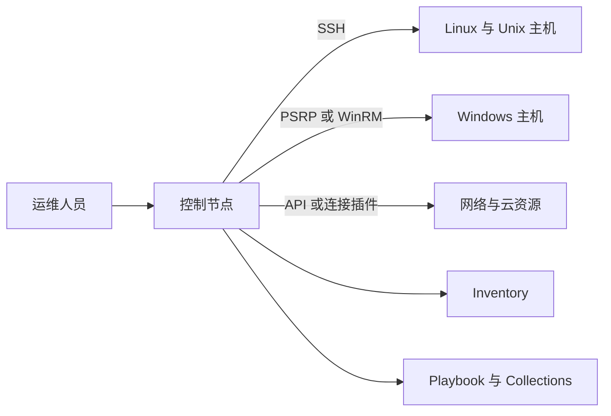
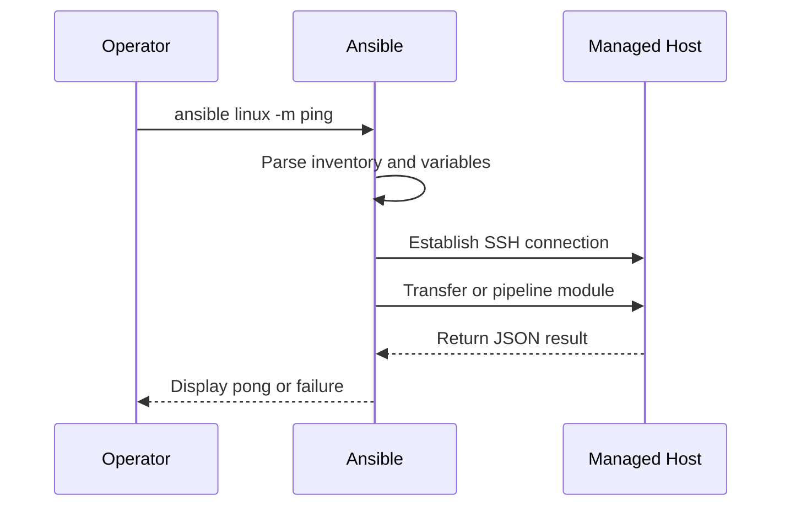
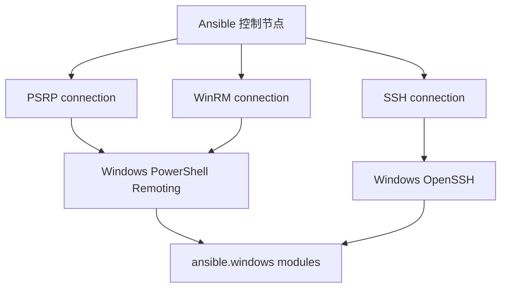
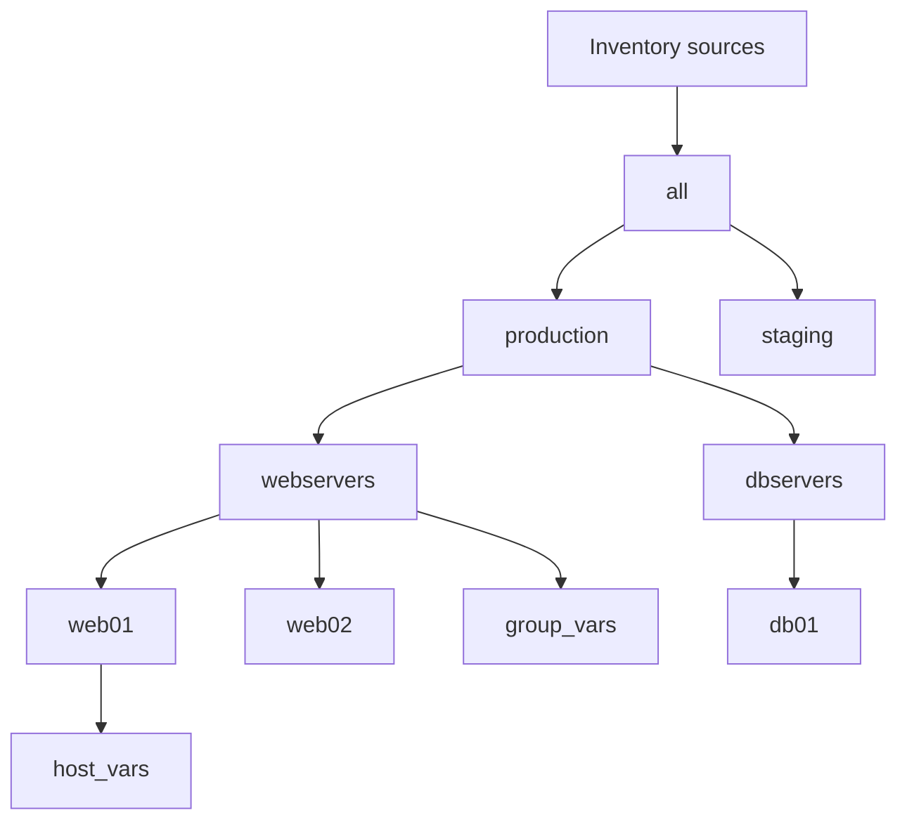
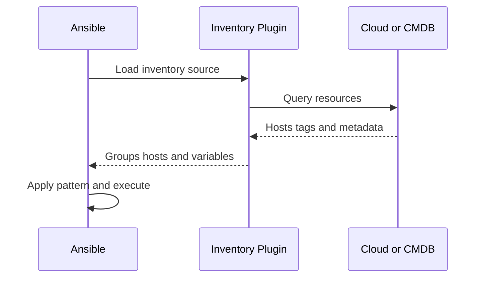
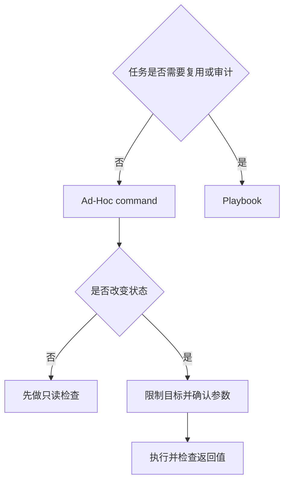

# Ansible 学习笔记 · 第一册：基础、Inventory 与模块

> **适用对象**：运维工程师、SRE、平台工程师和自动化初学者<br>
> **学习目标**：建立 Ansible 的运行环境，理解受管主机组织方式，并能安全地使用 Ad-Hoc 命令与模块完成批量操作<br>
> **版本说明**：原始课程来自 Ansible 1.x 文档。本册保留其教学主线，并按 2026-08-19 的 Ansible 官方文档更新术语、命令和推荐实践；已经淘汰的机制会明确标为历史内容。

## 第一章 · 建立 Ansible 的基础运行环境

### 认识 Ansible 的安装方式与运行前提
Ansible 是一种无代理自动化工具。它安装在控制节点上，通过 SSH、PowerShell Remoting 或其他连接插件管理远端设备，不要求每台受管主机长期运行 Ansible 守护进程，也不依赖中央数据库。



#### 控制节点和受管节点分别承担什么职责

| 角色 | 主要职责 | 常见要求 |
| --- | --- | --- |
| 控制节点 | 保存 Inventory、配置、Playbook 和凭据并发起自动化 | POSIX 环境、受支持的 Python、网络可达性 |
| 受管节点 | 接收模块并执行任务 | Linux/Unix 通常需要 Python；Windows 使用 PowerShell；网络设备取决于 Collection |
| Inventory | 描述主机、分组、变量和连接参数 | INI、YAML、目录或动态插件 |
| Module | 执行一个具体动作并返回结构化结果 | 来自 `ansible.builtin` 或其他 Collection |

“无代理”不等于“零依赖”。Linux/Unix 主机执行大多数模块时仍需要可用的 Python；缺少 Python 的新主机可以先用 `ansible.builtin.raw` 引导安装。Windows 模块在 PowerShell 中执行，并需要配置可用的远程连接方式。

#### 选择 `ansible` 还是 `ansible-core`

当前发行形态分为两个层次：

| 软件包 | 包含内容 | 适用场景 |
| --- | --- | --- |
| `ansible-core` | 核心命令、执行引擎、内置插件和 `ansible.builtin` | 希望严格控制 Collection 的平台团队 |
| `ansible` | `ansible-core` 加一组社区 Collections | 学习、通用自动化和希望开箱即用的用户 |

生产环境应固定经过验证的版本，不要让同一仓库在不同机器上任意漂移。可以把版本写入工具链文件，例如：

```text
# requirements.txt
ansible-core==2.21.*
```

这里的 `2.21` 是本册核对时的当前稳定核心系列。以后使用本笔记时，应先查看官方维护矩阵，再把约束更新到团队实际验证的受支持版本。

具体兼容版本应以项目执行时的官方支持矩阵为准，而不是照抄旧教程里的 Python 2 或 Ansible 1.x 要求。

#### 使用隔离环境安装

`pipx` 能为命令行应用创建隔离的 Python 环境，避免污染系统 Python：

```bash
# 安装完整社区包
pipx install --include-deps ansible

# 或仅安装核心执行引擎
pipx install ansible-core

# 查看实际使用的核心版本和配置位置
ansible --version

# 查看社区包版本
ansible-community --version
```

也可以使用虚拟环境：

```bash
python3 -m venv .venv
source .venv/bin/activate
python3 -m pip install --upgrade pip
python3 -m pip install 'ansible-core==2.21.*'
ansible --version
```

不要在未理解系统 Python 管理策略的情况下执行 `sudo pip install ansible`。现代 Linux 发行版可能启用外部管理环境限制，而全局安装也容易让多个项目发生依赖冲突。

#### 验证安装而不是只看命令是否存在

```bash
ansible --version
ansible-config --version
ansible-galaxy --version
ansible-doc ansible.builtin.ping
```

`ansible --version` 会显示：

- `ansible-core` 版本；
- 配置文件位置；
- 模块和 Collection 搜索路径；
- Python 解释器和版本；
- 可执行文件路径。

若团队成员的结果不同，应先统一执行环境，再排查 Playbook。许多“同一份代码在另一台机器失败”的问题，本质上来自核心版本、Collection 版本或配置文件不同。

#### 历史材料中哪些安装方式不应直接照搬

原课程中的 Python 2、`easy_install`、旧 PPA、`git://` 克隆地址、`ansible-modules-core` 子模块和全局 `sudo pip` 都属于旧版本语境。它们有助于理解 Ansible 的演进，但不应作为新环境的默认安装步骤。

#### 按使用场景选择安装与升级路径

安装方式不是“哪条命令最短”的问题，而是由控制节点、升级责任和可复现要求共同决定：

| 场景 | 建议方式 | 升级与回退责任 |
| --- | --- | --- |
| 个人学习或临时控制节点 | `pipx` 安装 `ansible` | 学习者记录并更新版本 |
| 项目级开发与 CI | 虚拟环境加锁定文件 | 仓库维护者评审依赖升级 |
| 企业自动化平台 | Execution Environment 容器镜像 | 平台团队构建、扫描、签名和回退 |
| 发行版自带包 | 系统包管理器 | 接受发行版的版本和补丁节奏 |
| 参与 Ansible 本身开发 | 源码检出和开发环境 | 仅用于开发与测试，不作为生产部署 |

操作系统包通常集成稳定，但版本可能落后；Python 包更新较快，却要求团队自己管理解释器与依赖。生产环境不应从 Git 主分支直接运行，也不应在发布当天无验证地升级核心版本。一个稳妥升级过程是：读取端口指南与维护矩阵，在隔离环境锁定新版本，执行语法检查和集成测试，最后逐步更新控制节点或 Execution Environment。


当前安装与版本选择可继续查阅 [Ansible 官方安装指南](https://docs.ansible.com/projects/ansible/latest/installation_guide/intro_installation.html)。

### 从 SSH 连接到第一条 Ansible 命令
完成安装后，应先建立一个最小实验项目。把 Inventory、配置和后续 Playbook 放在同一目录，便于版本控制和复现。

```bash
mkdir ansible-quickstart
cd ansible-quickstart
```

创建 `inventory.yml`：

```yaml
all:
  children:
    linux:
      hosts:
        web01:
          ansible_host: 192.0.2.10
        web02:
          ansible_host: 192.0.2.11
      vars:
        ansible_user: ops
```

#### 先验证原生 SSH

Ansible 无法替你修复所有底层连接问题。应先确认控制节点可以直接连接：

```bash
ssh ops@192.0.2.10
```

若使用密钥，推荐让 `ssh-agent` 管理已加密的私钥：

```bash
eval "$(ssh-agent -s)"
ssh-add ~/.ssh/id_ed25519
ssh-add -l
```

然后查看 Ansible 对 Inventory 的解析结果：

```bash
ansible-inventory -i inventory.yml --graph
ansible-inventory -i inventory.yml --host web01
```

#### 用 ping 模块验证完整执行链路

```bash
ansible linux -i inventory.yml -m ansible.builtin.ping
```

`ansible.builtin.ping` 不是 ICMP ping。它会建立 Ansible 连接、在受管节点执行 Python 模块并检查返回值 `pong`，因此能够同时验证 Inventory 匹配、身份认证、远端 Python 和模块传输链路。



常见失败可按层次判断：

| 现象 | 常见原因 | 优先检查 |
| --- | --- | --- |
| `Could not match supplied host pattern` | 主机或组不在 Inventory | `ansible-inventory --graph` |
| `UNREACHABLE` | DNS、路由、端口、账号或密钥问题 | 原生 `ssh -vvv` |
| Python not found | 受管节点没有合适的解释器 | `ansible_python_interpreter` 或 `raw` |
| `FAILED` 且模块已执行 | 参数、权限或目标状态问题 | 模块返回值和 `-vvv` |

#### 使用现代提权参数

原课程使用 `--sudo`、`--sudo-user` 和 `ansible_sudo_*`。这些写法已经被通用的 become 机制替代：

```bash
# 以当前远程用户连接并提权为 root
ansible linux -i inventory.yml -b -m ansible.builtin.command -a 'id'

# 提权为指定用户
ansible linux -i inventory.yml -b --become-user postgres \
  -m ansible.builtin.command -a 'id'

# 需要交互输入提权密码时
ansible linux -i inventory.yml -b --ask-become-pass \
  -m ansible.builtin.command -a 'id'
```

| 旧写法 | 当前写法 |
| --- | --- |
| `--sudo` | `--become` 或 `-b` |
| `--ask-sudo-pass` | `--ask-become-pass` 或 `-K` |
| `--sudo-user` | `--become-user` |
| `ansible_ssh_user` | `ansible_user` |
| `ansible_ssh_port` | `ansible_port` |
| `ansible_ssh_host` | `ansible_host` |

#### 谨慎处理主机密钥检查

主机密钥检查用于发现中间人攻击或主机身份意外变化。实验环境可以临时调整，生产环境不应为了省事长期关闭：

```bash
# 先通过受控渠道写入可信主机密钥
ssh-keyscan -H 192.0.2.10 >> ~/.ssh/known_hosts
```

如果出现主机重装导致的密钥变化，应先核实主机身份，再删除旧记录，而不是直接关闭检查。

### 理解配置文件的查找顺序与常用选项
Ansible 可以从配置文件、环境变量、命令行选项、Playbook 关键字和变量中获得行为设置。排障时必须同时回答两个问题：加载了哪一个配置文件，以及最终值被哪一层覆盖。

#### `ansible.cfg` 只使用找到的第一份

配置文件查找顺序为：

1. `ANSIBLE_CONFIG` 指向的文件；
2. 当前目录中的 `ansible.cfg`；
3. 用户目录中的 `~/.ansible.cfg`；
4. `/etc/ansible/ansible.cfg`。

Ansible 使用第一个找到的文件，不会把多份配置文件叠加。可直接确认当前结果：

```bash
ansible --version
ansible-config view
ansible-config dump --only-changed
```

`ansible-config dump --only-changed` 比手工翻阅一份巨大配置模板更适合排障，因为它只显示偏离默认值的配置及其来源。

#### 配置优先级不等于变量优先级

从低到高可以先记住以下大类：


同一个行为既可能由配置项控制，也可能由连接变量控制。例如 `remote_user` 是配置项，而 `ansible_user` 是变量；后者通常会覆盖前者。额外变量 `-e` 在变量体系中优先级很高，因此不应把它当作日常配置入口滥用。

#### 为项目创建最小配置

```ini
[defaults]
inventory = ./inventory.yml
forks = 20
timeout = 15
host_key_checking = True
retry_files_enabled = False
interpreter_python = auto_silent

[ssh_connection]
pipelining = True
ssh_args = -o ControlMaster=auto -o ControlPersist=60s
```

关键设置：

| 设置 | 作用 | 注意事项 |
| --- | --- | --- |
| `inventory` | 默认 Inventory 来源 | 项目内相对路径更易复现 |
| `forks` | 同时处理的主机数量 | 受控制节点资源和下游承载能力限制 |
| `timeout` | 连接超时 | 不等于模块整体执行超时 |
| `host_key_checking` | 校验 SSH 主机身份 | 生产环境建议保持开启 |
| `interpreter_python` | 选择远端 Python | 优先依赖自动发现，例外再按主机覆盖 |
| `pipelining` | 减少 SSH 往返与临时文件传输 | 需结合提权和安全策略验证 |
| `roles_path` | 补充 Role 搜索路径 | 不宜隐藏跨项目的隐式依赖 |
| `collections_paths` | Collection 搜索路径 | 与项目依赖管理保持一致 |

生成带注释的配置模板：

```bash
ansible-config init --disabled > ansible.cfg.example
```

不要把模板中的每个选项都启用。配置越少，默认行为升级时的认知负担越低。

#### 按行为类别管理配置

旧课程逐项罗列配置很容易让人忽略选项之间的关系。现代项目更适合按用途分组，并只启用确有需求的设置：

```ini
[defaults]
# Facts 与缓存
gathering = smart
fact_caching = jsonfile
fact_caching_connection = ./.cache/ansible-facts
fact_caching_timeout = 3600

# 输出与审计
callbacks_enabled = ansible.posix.profile_tasks
log_path = ./.cache/ansible.log

# 故障行为
force_handlers = False

# 依赖与秘密入口
collections_paths = ./collections
roles_path = ./roles
vault_identity_list = development@prompt,production@./scripts/vault-password-client
```

| 类别 | 典型设置 | 设计问题 |
| --- | --- | --- |
| Facts | `gathering`、`fact_caching*` | 数据是否允许跨运行复用，多久过期 |
| 输出 | callback、display、`log_path` | 谁能读日志，是否可能包含秘密 |
| 故障 | `force_handlers`、重试文件 | 失败后还应执行哪些一致性动作 |
| 路径 | `roles_path`、`collections_paths` | 依赖是否随项目交付而不是依赖控制机全局状态 |
| Vault | `vault_identity_list` | 不同环境如何选择密钥，脚本如何从秘密系统取值 |

示例中的 `jsonfile` 适合单机实验，不适合多个并发控制节点共享；`log_path` 和缓存目录要加入忽略规则并限制权限。启用第三方 callback 或 cache plugin 前，还要把对应 Collection 写入依赖文件。用以下命令确认名称、默认值和生效来源：

```bash
ansible-config list | less
ansible-config dump --only-changed
ansible-doc -t cache -l
ansible-doc -t callback -l
```

#### 配置中的安全边界

- 不把 SSH 密码、become 密码或 Vault 密码明文写进 `ansible.cfg`；
- 不把 `host_key_checking = False` 当作通用修复；
- 不把日志写到所有用户可读的路径；
- 对可能包含秘密的任务设置 `no_log: true`，但不要把它当作完整的秘密管理方案；
- 不从不可信、可被其他用户写入的当前目录加载 `ansible.cfg`。

配置细节可使用本机 `ansible-config list` 查询，也可查阅 [官方配置参考](https://docs.ansible.com/projects/ansible/latest/reference_appendices/config.html) 与 [优先级规则](https://docs.ansible.com/projects/ansible/latest/reference_appendices/general_precedence.html)。

#### 历史配置项如何处理

旧材料中的 `hostfile`、`sudo_*`、`accelerate_*`、`module_name` 等配置属于旧版本。现代项目应先用 `ansible-config list` 确认选项是否存在；Accelerated Mode 已退出当前架构，SSH ControlPersist 与 pipelining 承担了原先大量性能优化诉求。

### 管理 Windows 主机需要哪些额外准备
Windows 不是“把 Linux 模块换个目标地址”那么简单。它有独立的连接方式、模块命名空间、Shell 语义、路径格式和认证模型。



#### 当前支持边界

当前官方文档以 Windows Server 2016 或 Windows 10 及更新版本作为受支持起点，这些系统自带 Windows PowerShell 5.1。旧课程中的 Windows 7、Server 2008 R2、PowerShell 3.0 升级脚本和早期热修复流程，只适合历史环境研究。

Windows 可以作为受管节点。控制节点通常使用 Linux 或其他 POSIX 环境；原生 Windows 不能直接作为常规 Ansible 控制节点，但可以通过 WSL 等 POSIX 环境运行。具体限制应以所用 `ansible-core` 版本文档为准。

#### 选择连接插件

| 连接方式 | 特点 | 常见用途 |
| --- | --- | --- |
| `psrp` | 较新的 PowerShell Remoting 插件，性能和高负载稳定性通常更好 | 新建 Windows 自动化项目 |
| `winrm` | 历史使用广、资料多 | 兼容既有 WinRM 配置 |
| `ssh` | 使用 Windows OpenSSH | 已标准化 SSH 管理的环境 |

安装额外依赖时要注入安装 Ansible 的同一 Python 环境：

```bash
# pipx 安装的完整 ansible 包
pipx inject ansible 'pypsrp<=1.0.0'
pipx inject ansible 'pywinrm>=0.4.0'
```

#### 配置 Windows Inventory

以下示例采用 YAML 和 PSRP：

```yaml
all:
  children:
    windows:
      hosts:
        win-app-01:
          ansible_host: 192.0.2.30
      vars:
        ansible_connection: psrp
        ansible_user: 'EXAMPLE\ansible-ops'
        ansible_psrp_auth: negotiate
        ansible_port: 5986
        ansible_psrp_protocol: https
        ansible_psrp_cert_validation: validate
```

不要把 `ansible_password` 直接提交到普通变量文件。可以使用 Ansible Vault、外部秘密系统，或自动化控制器的 Credential 机制。

域环境优先考虑 Kerberos；本地账号可以选择 HTTPS 上的 Basic 或 NTLM。CredSSP 支持凭据委托，但由于双跳和无约束委托风险，只应在明确需要并理解信任边界时启用。

#### 准备并验证 Windows 主机

Windows Server 2012 之后通常默认启用 WinRM，但监听器、认证、证书和防火墙仍可能需要配置。检查监听器：

```powershell
winrm enumerate winrm/config/Listener
Get-PSSessionConfiguration | Select-Object Name, PSVersion
```

验证 Ansible 通道：

```bash
ansible windows -i inventory.yml -m ansible.windows.win_ping
ansible windows -i inventory.yml -m ansible.windows.setup
```

`win_ping` 与 Linux 的 `ping` 一样验证模块执行链路，不发送 ICMP 报文。

#### 使用 Windows 专用模块

```yaml
- name: 验证 Windows 文件并读取系统信息
  hosts: windows
  gather_facts: false
  tasks:
    - name: 获取 PowerShell 版本
      ansible.windows.win_powershell:
        script: $PSVersionTable.PSVersion.ToString()
      register: ps_version

    - name: 检查配置文件
      ansible.windows.win_stat:
        path: C:\Windows\win.ini
      register: win_ini

    - name: 展示结果
      ansible.builtin.debug:
        msg: "PowerShell={{ ps_version.output[0] }} file_exists={{ win_ini.stat.exists }}"
```

现代模块通常使用完全限定名称，例如 `ansible.windows.win_service`。旧材料里的 `win_*` 短名称有时仍能解析，但 FQCN 能明确模块来自哪个 Collection。

#### 理解 Windows 模块的执行与开发边界

Linux 模块通常由控制节点传输 Python 代码后在目标执行；Windows 模块主要以 PowerShell 实现，并通过 PowerShell Remoting 或 Windows OpenSSH 进入目标。因而 Linux 的 `ansible.builtin.shell`、路径、环境变量和返回结构不能原样套到 Windows。优先选择 `ansible.windows` 或相应 Collection 中的专用模块，只有没有声明式模块时才使用 `ansible.windows.win_powershell`。

Windows Facts 同样进入 `ansible_facts`，但字段取决于平台和模块版本。先用 `ansible.windows.setup` 查看实际数据，再在条件或模板中读取，不要假设 Linux 网卡名、服务管理器和文件权限模型存在于 Windows。

如果需要编写自定义 Windows 模块，应将模块放进 Collection、使用 PowerShell 参数规范和结构化 JSON 返回，并用 FQCN 调用。模块需要明确 `changed`、失败信息、check mode 行为和敏感参数；不要把一段只能在某台机器运行的脚本包装后就称为可复用模块。

更多当前要求见 [Windows 主机管理指南](https://docs.ansible.com/projects/ansible/latest/os_guide/intro_windows.html) 和 [WinRM 指南](https://docs.ansible.com/projects/ansible/latest/os_guide/windows_winrm.html)。

## 第二章 · 用 Inventory 和 Patterns 组织受管主机

### 使用静态 Inventory 描述主机与分组
Inventory 是 Ansible 对受管对象的视图。它不仅列出地址，还定义主机的稳定标识、业务分组、环境分组、连接参数和变量来源。Patterns 再从这个视图中选出本次执行的目标集合。



#### INI 与 YAML 两种常用格式

INI 适合小型清单：

```ini
[webservers]
web01 ansible_host=192.0.2.10
web02 ansible_host=192.0.2.11

[dbservers]
db01 ansible_host=192.0.2.20

[production:children]
webservers
dbservers

[production:vars]
ansible_user=ops
```

YAML 更适合表达层次和复杂变量：

```yaml
all:
  children:
    production:
      children:
        webservers:
          hosts:
            web01:
              ansible_host: 192.0.2.10
            web02:
              ansible_host: 192.0.2.11
        dbservers:
          hosts:
            db01:
              ansible_host: 192.0.2.20
      vars:
        ansible_user: ops
```

Ansible 自动创建 `all` 和 `ungrouped` 两个组。一个主机可以同时属于功能、环境、区域等多个组，但组维度要有清晰含义，避免用组名承载临时执行状态。

#### Inventory 别名与连接参数

```yaml
all:
  hosts:
    bastion:
      ansible_host: 192.0.2.50
      ansible_port: 2222
      ansible_user: ops
      ansible_ssh_private_key_file: ~/.ssh/ops_ed25519
```

这里 `bastion` 是 `inventory_hostname`，也是 Patterns 应使用的稳定标识；`192.0.2.50` 才是实际连接地址。即使 IP 变化，Playbook 仍可继续引用 `bastion`。

常见连接变量包括：

| 变量 | 含义 |
| --- | --- |
| `ansible_host` | 实际连接地址 |
| `ansible_port` | 连接端口 |
| `ansible_user` | 远程用户 |
| `ansible_connection` | `ssh`、`local`、`psrp` 等连接插件 |
| `ansible_python_interpreter` | 远端 Python 路径 |
| `ansible_become` | 是否提权 |
| `ansible_become_user` | 提权后的用户 |

连接变量是行为控制，不应与业务变量混在一起随意覆盖。旧名称 `ansible_ssh_host`、`ansible_ssh_port`、`ansible_ssh_user` 应迁移到通用名称。

#### 用 `group_vars` 和 `host_vars` 分离变量

推荐目录：

```text
inventory/
├── hosts.yml
├── group_vars/
│   ├── all.yml
│   ├── production.yml
│   └── webservers/
│       ├── defaults.yml
│       └── vault.yml
└── host_vars/
    └── web01.yml
```

`group_vars/webservers/defaults.yml`：

```yaml
http_port: 8080
healthcheck_path: /healthz
```

`host_vars/web01.yml`：

```yaml
maintenance_window: sunday-02:00
```

原则上，共同策略放组变量，真正的主机例外才放主机变量。大量主机特例通常说明分组模型需要重构。

#### 将环境分开，而不是靠变量切换所有内容

```text
inventories/
├── staging/
│   ├── hosts.yml
│   └── group_vars/
└── production/
    ├── hosts.yml
    └── group_vars/
```

```bash
ansible-inventory -i inventories/staging --graph
ansible-inventory -i inventories/production --graph
```

分离环境能降低一次命令误选生产主机的概率，也方便对生产 Inventory 实施更严格的审核和权限控制。

#### 在执行前验证清单

```bash
ansible-inventory -i inventory/hosts.yml --graph
ansible-inventory -i inventory/hosts.yml --list
ansible-inventory -i inventory/hosts.yml --host web01
```

把 Inventory 和变量文件纳入版本控制，但将 Vault 密文或外部秘密引用与普通变量分开管理。官方的完整组织方式见 [Inventory 构建指南](https://docs.ansible.com/projects/ansible/latest/inventory_guide/intro_inventory.html)。

### 从外部系统动态生成 Inventory
静态 Inventory 适合变化较慢的环境。当主机由云平台、自动伸缩组、CMDB、LDAP 或容器平台动态维护时，手工清单会产生漂移：已经销毁的主机仍被执行，新建主机却没有进入自动化范围。



#### 优先使用 Inventory Plugin

旧材料大量介绍可执行脚本，如 `ec2.py` 和 `cobbler.py`。现代 Ansible 同时支持脚本与插件，但官方推荐 Inventory Plugin，因为插件能直接复用核心解析、缓存、构造分组和错误处理能力。许多云插件随各自 Collection 发布。

查看可用插件：

```bash
ansible-doc -t inventory -l
ansible-doc -t inventory amazon.aws.aws_ec2
```

安装 Collection 并记录依赖：

```yaml
# requirements.yml
collections:
  # 首次验证后在实际项目中补充明确的 version 约束
  - name: amazon.aws
```

```bash
ansible-galaxy collection install -r requirements.yml
```

一个简化的 AWS 动态源示意：

```yaml
# inventories/production/10-aws.aws_ec2.yml
plugin: amazon.aws.aws_ec2
regions:
  - ap-southeast-1
filters:
  instance-state-name: running
keyed_groups:
  - key: tags.Role
    prefix: role
  - key: placement.region
    prefix: region
compose:
  ansible_host: private_ip_address
```

具体字段取决于 Collection 版本，编写前必须查阅该插件的 `ansible-doc`。

#### 区分 `compose`、`groups` 与 `keyed_groups`

许多 Inventory Plugin 复用了 constructed 能力，但三个选项解决的是不同问题：

| 选项 | 输入 | 输出 | 示例 |
| --- | --- | --- | --- |
| `compose` | 已取得的主机元数据 | 新的主机变量 | 用私网 IP 生成 `ansible_host` |
| `groups` | 条件表达式 | 固定名称的条件组 | 磁盘加密的主机进入 `encrypted` |
| `keyed_groups` | 某个字段的值 | 按值生成的一系列组 | `Role=api` 生成 `role_api` |

```yaml
plugin: amazon.aws.aws_ec2
regions:
  - ap-southeast-1
compose:
  ansible_host: private_ip_address
  deployment_ring: tags.DeploymentRing | default('stable')
groups:
  monitored: tags.Monitoring | default('disabled') == 'enabled'
keyed_groups:
  - key: tags.Role
    prefix: role
  - key: placement.availability_zone
    prefix: az
    parent_group: aws_zones
```

动态生成的组名可能被插件清洗，例如连字符被转换为下划线。不要凭云平台标签猜 Pattern；以 `ansible-inventory --graph` 的实际结果为准。`strict: true` 能让缺少变量时立即失败，但只有在元数据契约稳定时才适合开启。

#### 混合静态与动态来源

Inventory 目录可以同时放入多个来源：

```text
inventories/production/
├── 00-groups.yml
├── 10-aws.aws_ec2.yml
├── 20-on-prem.yml
└── group_vars/
```

文件名的数字前缀明确加载顺序。Ansible 按来源顺序加载内容；同一变量重复定义时，后加载值可能覆盖先前值，因此不能依赖含糊的文件名顺序。

静态源还可以把多个动态组纳入一个稳定的父组。因为某些解析器会丢弃尚无主机的空组，父组文件通常应在产生子组之后加载：

```yaml
# inventories/production/90-parent-groups.yml
all:
  children:
    production_apps:
      children:
        role_api:
        role_worker:
```

```bash
# 多个 -i 参数也按给定顺序合并，后者的同名变量可能覆盖前者
ansible-inventory -i inventories/base.yml -i inventories/production --graph
```

```bash
ansible-inventory -i inventories/production --graph
ansible-inventory -i inventories/production --list --yaml
```

#### 缓存动态 Inventory 并接受新鲜度边界

支持缓存的插件通常可以在源文件中启用 `cache: true` 并配置 cache plugin。缓存减少云 API 或 CMDB 查询，但也意味着已经删除或重新标记的资源会在 TTL 内继续存在。生产变更前必须根据风险判断是接受缓存、刷新缓存，还是让流水线先完成一次 Inventory 同步。

```yaml
plugin: amazon.aws.aws_ec2
cache: true
cache_plugin: ansible.builtin.jsonfile
cache_connection: ./.cache/inventory
cache_timeout: 300
```

不同插件支持的缓存选项不完全相同，应以 `ansible-doc -t inventory <plugin>` 为准。不要让多个作业无协调地共享本地文件缓存，也不要直接编辑 cache plugin 的内部数据。

#### 动态 Inventory 的生产检查清单

- API 凭据来自环境、工作负载身份或秘密系统，不写入插件配置；
- 只查询需要的区域、项目和资源状态，避免慢查询与意外扩域；
- 用稳定标签构造组，不依赖短生命周期 IP；
- 明确缓存有效期，知道资源销毁后多久从清单消失；
- 在正式执行前检查 `--graph` 与 `--host`；
- 对插件和 Collection 固定版本；
- 给生产命令叠加 Patterns 和 `--limit` 双重约束。

官方说明见 [动态 Inventory 指南](https://docs.ansible.com/projects/ansible/latest/inventory_guide/intro_dynamic_inventory.html)。

### 使用 Patterns 精确选择目标主机
Patterns 是集合表达式。它只能选择 Inventory 已知的主机，不会因为写入了一个新 IP 就自动绕过 Inventory。

| 目标 | Pattern |
| --- | --- |
| 全部主机 | `all` 或 `*` |
| 单台主机 | `web01` |
| 两组并集 | `webservers:dbservers` |
| 排除某组 | `webservers:!canary` |
| 两组交集 | `webservers:&staging` |
| 组合选择 | `webservers:dbservers:&staging:!disabled` |
| 通配符 | `*.example.com` |
| 正则表达式 | `~(web\|db).*\.example\.com` |

Shell 会解释 `!`、`*` 等字符，复杂 Pattern 应使用单引号：

```bash
ansible 'webservers:&production:!canary' \
  -i inventories/production \
  -m ansible.builtin.ping
```

#### `hosts` 和 `--limit` 共同决定执行范围

Playbook：

```yaml
- name: 更新 Web 服务
  hosts: webservers
  tasks:
    - name: 验证目标
      ansible.builtin.debug:
        var: inventory_hostname
```

运行时进一步收窄：

```bash
ansible-playbook -i inventories/production site.yml \
  --limit 'webservers:&ap_southeast_1:!canary'
```

`--limit` 与 Play 中的 `hosts` 取交集，不能扩大 Play 原本的目标范围。生产变更前可以先运行：

```bash
ansible-playbook -i inventories/production site.yml \
  --limit 'webservers:&ap_southeast_1:!canary' \
  --list-hosts
```

#### 使用切片与主机列表时明确风险

Pattern 支持以零为起点的位置与范围切片，且范围末端包含在结果中：

```bash
# 第一台和最后一台
ansible 'webservers[0]' -i inventories/production -m ansible.builtin.ping
ansible 'webservers[-1]' -i inventories/production -m ansible.builtin.ping

# 选择索引 0 到 2 共三台
ansible 'webservers[0:2]' -i inventories/production -m ansible.builtin.ping
```

切片适合实验和临时排查，但动态 Inventory 的顺序可能随来源变化，不应把 `webservers[0]` 当作稳定 canary。生产灰度应使用明确的 `canary` 标签或组。

审核后生成的主机名文件可直接作为限制条件：

```text
# approved-hosts.txt
web01
web02
```

```bash
ansible-playbook -i inventories/production site.yml \
  --limit @approved-hosts.txt --list-hosts
```

文件中的名称仍需存在于 Inventory。将主机列表与发布工单关联，比在流水线里拼接一长串临时 Pattern 更容易审计。

#### 常见陷阱

- 使用连接 IP 而不是 Inventory 别名，导致匹配失败；
- 把并集误写成交集，扩大执行范围；
- 忘记给 `!` Pattern 加单引号，被 Shell 处理；
- 对动态组名的清洗规则作假设，没有先看 `--graph`；
- 使用组切片依赖不稳定顺序，把它当作可靠灰度机制；
- 直接对 `all` 执行破坏性命令，没有 `--limit` 和目标预览。

Patterns 的完整语法与处理顺序见 [官方 Patterns 指南](https://docs.ansible.com/projects/ansible/latest/inventory_guide/intro_patterns.html)。

## 第三章 · 使用 Ad-Hoc 命令与模块完成一次性任务

### 用 Ad-Hoc 命令执行批量运维操作
Ad-Hoc 命令是在命令行中直接调用一个模块，适合一次性检查、紧急操作和小范围变更。需要反复执行、需要评审或包含多个步骤的工作，应写成 Playbook 并纳入版本控制。

```text
ansible <pattern> -i <inventory> -m <module> -a '<arguments>' [options]
```

```bash
ansible webservers -i inventory.yml \
  -m ansible.builtin.ping
```



#### 控制并发和提权

```bash
# 每批最多并发处理 10 台主机
ansible webservers -i inventory.yml -f 10 \
  -m ansible.builtin.ping

# 使用 become 执行需要权限的命令
ansible webservers -i inventory.yml -f 5 -b \
  -m ansible.builtin.command \
  -a 'systemctl status nginx'
```

提高 `forks` 不会自动提高安全性或总吞吐。包仓库、数据库、负载均衡器和控制节点都可能成为瓶颈。批量变更先在小组或单台 canary 上验证，再逐步扩大。

#### `command`、`shell` 与 `raw` 的区别

| 模块 | 是否经过 Shell | 典型用途 | 风险 |
| --- | --- | --- | --- |
| `ansible.builtin.command` | 否 | 运行普通可执行程序 | 不支持管道、重定向和 Shell 变量 |
| `ansible.builtin.shell` | 是 | 确实需要管道或重定向 | 引号、注入和幂等性风险更高 |
| `ansible.builtin.raw` | 直接通过连接执行 | 引导无 Python 主机、网络设备特殊命令 | 返回结构少，通常不幂等 |

```bash
# command 不展开远端 Shell 变量
ansible linux -i inventory.yml \
  -m ansible.builtin.command -a 'id'

# 仅在需要 Shell 语义时使用 shell
ansible linux -i inventory.yml \
  -m ansible.builtin.shell -a 'set -o pipefail && journalctl -u nginx | tail -20'

# 为极简 Linux 主机引导 Python
ansible bootstrap -i inventory.yml -b \
  -m ansible.builtin.raw -a 'apt-get update && apt-get install -y python3'
```

Shell 参数用单引号包围，可避免本地 Shell 提前展开 `$TERM` 等变量，但这并不能消除远端命令注入风险。

#### 用声明式模块管理目标状态

复制文件：

```bash
ansible webservers -i inventory.yml -b \
  -m ansible.builtin.copy \
  -a 'src=files/motd dest=/etc/motd owner=root group=root mode=0644 backup=true'
```

创建目录：

```bash
ansible webservers -i inventory.yml -b \
  -m ansible.builtin.file \
  -a 'path=/srv/example state=directory owner=www-data group=www-data mode=0755'
```

安装软件包：

```bash
ansible webservers -i inventory.yml -b \
  -m ansible.builtin.package \
  -a 'name=nginx state=present'
```

启动服务：

```bash
ansible webservers -i inventory.yml -b \
  -m ansible.builtin.service \
  -a 'name=nginx state=started enabled=true'
```

通用 `package` 和 `service` 模块便于跨发行版，但平台专用模块通常暴露更多能力。选择前先查看模块文档和支持属性。

#### 管理账号、代码与文件生命周期

Ad-Hoc 不只适合 ping。原课程中的账号、Git 和文件操作仍然重要，但应使用声明式模块并限制目标：

```bash
# 创建服务组和不可交互的服务账号
ansible 'webservers:&staging' -i inventories/staging -b \
  -m ansible.builtin.group -a 'name=example-app state=present system=true'
ansible 'webservers:&staging' -i inventories/staging -b \
  -m ansible.builtin.user \
  -a 'name=example-app group=example-app shell=/usr/sbin/nologin create_home=false system=true state=present'

# 检出明确版本，避免部署漂移的默认分支
ansible 'webservers:&staging' -i inventories/staging -b \
  -m ansible.builtin.git \
  -a 'repo=https://git.example/app.git dest=/srv/example/releases/1.4.2 version=v1.4.2 update=true'

# 删除前先用 stat 或 check mode 确认目标，state=absent 无法自动恢复数据
ansible 'webservers:&staging' -i inventories/staging -b \
  -m ansible.builtin.file -a 'path=/srv/example/tmp/obsolete state=absent'
```

文件权限的 YAML 与命令行参数都建议写成字符串形式，如 `mode=0640`；删除、改所有者和递归权限操作要先验证路径是否由变量安全生成。Git 检出还涉及代码来源认证、提交签名和构建产物一致性；正式部署通常应交给可审查的 Playbook，而不是长期依赖 Ad-Hoc。

#### 在命令行启动并收集后台任务

Ad-Hoc 也支持异步上限与轮询间隔：

```bash
# 最多运行 30 分钟，每 15 秒轮询
ansible batch_workers -i inventory.yml \
  -B 1800 -P 15 \
  -m ansible.builtin.command -a '/opt/app/bin/rebuild-index'

# -P 0 表示只启动，输出中要保存 ansible_job_id
ansible batch_workers -i inventory.yml \
  -B 1800 -P 0 \
  -m ansible.builtin.command -a '/opt/app/bin/rebuild-index'

# 使用返回的 job id 查询结果
ansible batch_workers -i inventory.yml \
  -m ansible.builtin.async_status -a 'jid=<ansible_job_id>'
```

后台启动不等于任务成功。必须保存 job id、轮询最终状态并处理超时后的远端进程。包管理器等有全局锁的操作不应为了“更快”而无边界并发。

#### 收集 Facts 与快速诊断

```bash
# 收集完整 Facts
ansible linux -i inventory.yml -m ansible.builtin.setup

# 只查看网络相关 Facts
ansible linux -i inventory.yml \
  -m ansible.builtin.setup \
  -a 'filter=ansible_default_ipv4'

# 查看磁盘空间但不改变状态
ansible linux -i inventory.yml \
  -m ansible.builtin.command -a 'df -h'
```

Facts 可能包含网络、硬件和系统细节。不要在公开日志中无筛选地输出敏感主机信息。

#### Ad-Hoc 安全执行清单

1. 用 `ansible-inventory --graph` 确认清单来源；
2. 用精确 Pattern 与 `--limit` 收窄目标；
3. 先执行 `ping` 或只读命令；
4. 查阅 `ansible-doc` 确认参数和 check mode 支持；
5. 对变更操作先在 canary 主机验证；
6. 检查 `changed`、`failed`、`rc`、`stderr` 等返回字段；
7. 可复用的命令立即沉淀为 Playbook。

### 理解模块如何承载 Ansible 的实际操作
模块是 Ansible 的工作单元。Ad-Hoc 命令调用一个模块；Playbook 中的每个 Task 通常也调用一个模块。连接插件负责“怎么到达目标”，模块负责“到达后做什么”。


#### 优先描述状态而不是拼接命令

下面的命令式写法每次都会执行：

```yaml
- name: 创建应用目录
  ansible.builtin.command: mkdir -p /srv/app
```

声明式模块可以检查当前状态，只在必要时变更：

```yaml
- name: 确保应用目录存在
  ansible.builtin.file:
    path: /srv/app
    state: directory
    owner: app
    group: app
    mode: '0750'
```

幂等性意味着重复执行在目标已满足时通常返回 `changed: false`，但不是所有模块和所有参数都天然幂等。`command`、`shell`、第三方 API 和外部脚本尤其需要审查。

#### 使用 `ansible-doc` 作为本地权威入口

```bash
# 阅读模块文档
ansible-doc ansible.builtin.file

# 查看模块片段
ansible-doc -s ansible.builtin.file

# 列出模块
ansible-doc -t module -l

# 阅读 Inventory Plugin
ansible-doc -t inventory amazon.aws.aws_ec2
```

模块文档会说明参数、返回值、平台、check mode、diff mode 和示例。它与本机实际安装版本一致，比搜索到其他版本的网页更可靠。

#### 在 YAML 中使用完全限定集合名称

```yaml
- name: 确保 Nginx 已启动
  ansible.builtin.service:
    name: nginx
    state: started
    enabled: true
```

`ansible.builtin.service` 是 FQCN，格式为 `<namespace>.<collection>.<content>`。它能避免同名模块冲突，并让读者直接知道依赖来自核心还是外部 Collection。

### 辨析核心模块与额外模块的历史分类
旧版 Ansible 把模块分成 `ansible-modules-core` 和 `ansible-modules-extras` 两个仓库。这个分类已经被 Collections 架构替代，不应继续用“核心模块比额外模块更受支持”判断现代依赖。

| 历史模型 | 当前模型 |
| --- | --- |
| `ansible-modules-core` | `ansible-core` 中的 `ansible.builtin` |
| `ansible-modules-extras` | 各 namespace 下独立发布的 Collections |
| 随 Ansible 单体版本升级 | Collection 可独立安装和固定版本 |
| 依据 core/extras 判断来源 | 依据 FQCN、维护者、版本和支持状态判断 |

声明依赖：

```yaml
collections:
  # 首次验证后在实际项目中补充明确的 version 约束
  - name: ansible.posix
  - name: community.general
```

```bash
ansible-galaxy collection install -r requirements.yml
ansible-galaxy collection list
```

选择外部 Collection 时检查：

- 是否仍在维护，发布日期是否合理；
- 支持哪些 `ansible-core` 版本；
- 模块是否支持 check mode、diff mode 和幂等操作；
- 依赖的 Python SDK 与系统库；
- 变更日志和破坏性升级；
- 团队是否固定版本并在隔离环境验证。

### 读取模块的通用返回值与 Facts
模块返回结构化数据。Ad-Hoc 命令会直接显示它；Playbook 可以使用 `register` 保存结果，再用于判断、输出和后续任务。

```yaml
- name: 查询服务状态
  ansible.builtin.command:
    argv:
      - systemctl
      - is-active
      - nginx
  register: nginx_status
  changed_when: false
  failed_when: nginx_status.rc not in [0, 3]

- name: 展示标准输出
  ansible.builtin.debug:
    var: nginx_status.stdout_lines
```

#### 常见返回字段

| 字段 | 含义 | 使用提示 |
| --- | --- | --- |
| `changed` | 模块是否改变目标 | 不是成功与否的同义词 |
| `failed` | 任务是否失败 | 可由模块或 `failed_when` 决定 |
| `skipped` | 任务是否被跳过 | 常见于条件或 check mode |
| `msg` | 面向用户的说明 | 失败排障首先阅读 |
| `rc` | 命令返回码 | 常见于 command、shell、raw |
| `stdout` / `stderr` | 标准输出与错误 | 注意可能含敏感数据 |
| `stdout_lines` / `stderr_lines` | 按行拆分的输出 | 便于循环或展示 |
| `results` | 循环中每一项的结果 | 需要逐项判断失败和变更 |
| `diff` | 变更前后差异 | 需要模块与运行模式支持 |
| `backup_file` | 备份文件路径 | 模块启用备份时出现 |
| `ansible_facts` | 写入主机 Facts 的字典 | 部分内部字段会被 Ansible 消费 |

#### 不要只解析人类可读输出

自动化逻辑应优先读取返回字段，而不是对终端彩色文本做字符串匹配。需要观察详细返回时可提高 verbosity：

```bash
ansible web01 -i inventory.yml \
  -m ansible.builtin.command -a 'id' -vvv
```

但 `-vvv` 可能暴露连接细节，日志共享前需要脱敏。

#### Facts 与注册变量的生命周期不同

- `register` 保存当前任务对当前主机的返回结果；
- `ansible_facts` 会合入当前主机的 Facts；
- facts cache 可以跨执行保存部分 Facts，但需要明确缓存后端和有效期；
- `set_fact` 创建的变量不等同于长期资产数据库；
- 主机之间读取 `hostvars` 时，要确认目标主机的数据已经被收集。

完整字段以模块自身 `RETURN` 文档和 [官方通用返回值](https://docs.ansible.com/projects/ansible/latest/reference_appendices/common_return_values.html) 为准。

#### 第一册学习闭环

完成本册后，应能执行以下最小闭环：

1. 在隔离环境安装并固定 Ansible；
2. 创建静态或动态 Inventory；
3. 用 `ansible-inventory` 验证主机、组和变量；
4. 用 Patterns 与 `--limit` 精确圈定目标；
5. 用 `ping` 验证 Linux 或 Windows 执行链路；
6. 用 FQCN 调用幂等模块完成小型任务；
7. 读取结构化返回值判断成功、失败和变更；
8. 把需要复用和审计的操作迁移到第二册的 Playbook。
