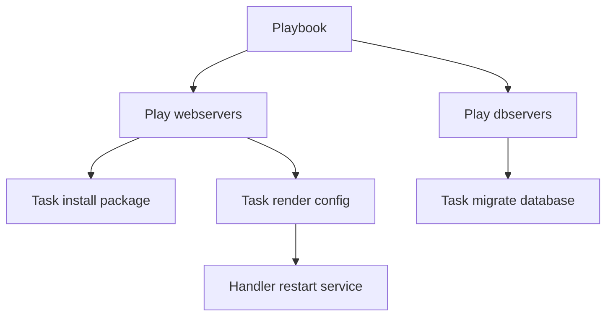
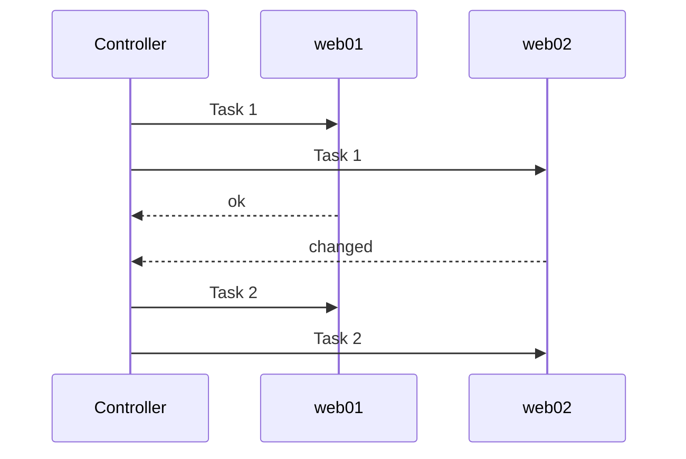
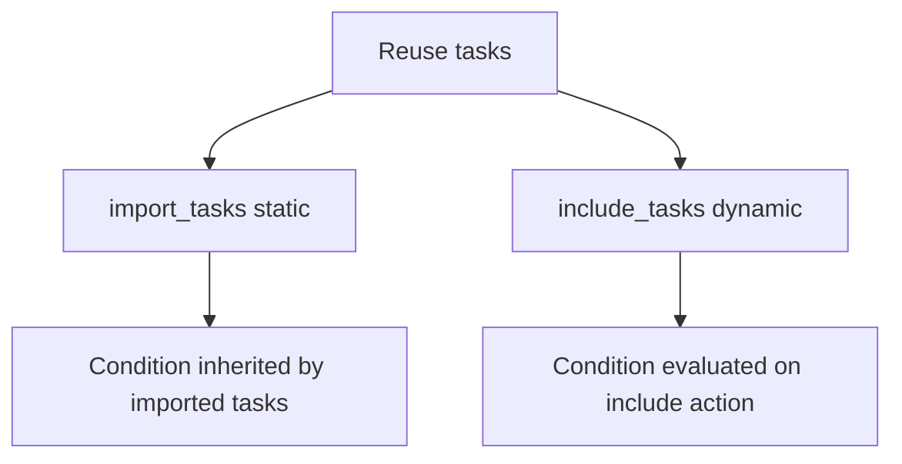
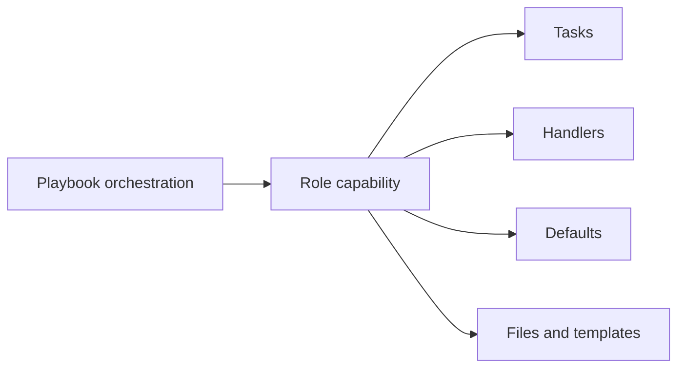
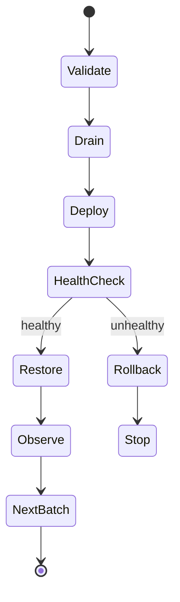

# Ansible 学习笔记 · 第二册：Playbook、运维控制与持续交付

> **适用对象**：已经掌握 Inventory、Patterns、Ad-Hoc 命令与模块基础的运维工程师、SRE 和平台工程师<br>
> **学习目标**：把一次性命令沉淀为可复用、可审查、可预演并能够安全滚动执行的自动化工程<br>
> **版本说明**：原始课程来自 Ansible 1.x 文档。本册按 2026-08-19 的 Ansible 官方文档更新语法和实践，保留旧机制仅用于解释历史演进。

## 第四章 · 编写具备控制逻辑的 Playbook

### 从 Play 和 Task 理解 Playbook 的执行模型
Playbook 是 YAML 编写的自动化执行说明。一个 Playbook 包含一个或多个 Play；每个 Play 把一组主机映射到一组有序 Task；Task 调用模块描述目标状态；Handler 只在收到变更通知时执行。



#### 一个现代化的最小 Playbook

```yaml
---
- name: 配置 Web 服务
  hosts: webservers
  become: true
  gather_facts: true

  vars:
    web_package: nginx
    web_service: nginx

  tasks:
    - name: 确保软件包已安装
      ansible.builtin.package:
        name: "{{ web_package }}"
        state: present

    - name: 写入站点配置
      ansible.builtin.template:
        src: templates/site.conf.j2
        dest: /etc/nginx/conf.d/site.conf
        owner: root
        group: root
        mode: '0644'
        validate: 'nginx -t -c %s'
      notify: 重载 Web 服务

    - name: 确保服务已启动
      ansible.builtin.service:
        name: "{{ web_service }}"
        state: started
        enabled: true

  handlers:
    - name: 重载 Web 服务
      ansible.builtin.service:
        name: "{{ web_service }}"
        state: reloaded
```

现代写法使用 `become` 替代旧课程中的 `sudo`，使用 FQCN 明确模块来源，并用 YAML 映射传参，避免难读的 `key=value` 长行。

#### Task 如何跨主机推进

在线性策略下，Ansible 通常先让当前批次的所有活跃主机完成同一个 Task，再进入下一个 Task。某台主机失败后，它通常退出该 Play 后续 Task，而其他主机继续运行。



执行前先做静态和目标检查：

```bash
ansible-playbook -i inventories/staging site.yml --syntax-check
ansible-playbook -i inventories/staging site.yml --list-hosts
ansible-playbook -i inventories/staging site.yml --list-tasks
```

执行时从小范围开始：

```bash
ansible-playbook -i inventories/staging site.yml --limit web01 --diff
```

#### Handler 把“发生变化”转换成后续动作

只有通知它的 Task 返回 `changed: true` 时，Handler 才会进入待执行队列。同一 Handler 被多次通知通常也只执行一次，并在 Play 的既定刷新点运行。

```yaml
- name: 更新应用配置
  ansible.builtin.template:
    src: app.conf.j2
    dest: /etc/example/app.conf
    mode: '0644'
  notify: 重启应用

- name: 立即执行已通知的 Handler
  ansible.builtin.meta: flush_handlers
```

`flush_handlers` 会改变正常时序，只应在后续 Task 确实依赖重启结果时使用。Handler 名称在 Play 范围内应保持唯一且表达动作。

#### 幂等性需要设计和验证

声明式模块通常能判断目标是否已经满足，但 `command`、`shell` 和外部 API 不会自动幂等。可以用模块自身参数或结果判断补足：

```yaml
- name: 只在数据库尚未初始化时执行命令
  ansible.builtin.command:
    cmd: /opt/app/bin/init-db
    creates: /var/lib/app/.initialized
```

第二次执行 Playbook 时，大部分 Task 应返回 `ok` 而不是 `changed`。持续出现无意义变更会触发 Handler、制造噪声并掩盖真实漂移。

#### 理解 `ansible-pull` 的反向执行模式

常规 Ansible 从控制节点向受管主机推送任务；`ansible-pull` 则在受管主机上定时拉取 Git 仓库并本地执行 Playbook：

```bash
ansible-pull -U https://git.example/infra/node-config.git \
  -C v1.4.2 \
  -i localhost, \
  -c local \
  local.yml
```

这种模式适合难以被中心控制节点主动连接、数量很大的终端或边缘节点，但会把调度、凭据、日志和失败重试责任分散到每台主机。生产使用时要固定经过审核的提交或标签，验证仓库身份，避免多个定时任务并发运行，并把执行结果集中上报。它不是规避 Inventory、审批和审计的捷径。

官方入口见 [Playbook 指南](https://docs.ansible.com/projects/ansible/latest/playbook_guide/index.html)。

### 用变量适配不同主机与运行环境
变量让同一套自动化适配环境、区域、角色和主机差异。变量应描述数据，不应变成隐藏控制流；同一个变量尽量只在一个清晰位置定义。

#### 使用可读的数据结构

```yaml
app:
  name: example-api
  listen_port: 8080
  features:
    metrics: true
    tracing: false
  upstreams:
    - api-a.internal
    - api-b.internal
```

```jinja2
server {
    listen {{ app.listen_port }};

    # upstream {{ loop.index }}: {{ upstream }}

}
```

引用以 Jinja 表达式开头的 YAML 值时必须加引号：

```yaml
install_path: "{{ base_path }}/releases/{{ release_id }}"
```

#### 按“谁应该覆盖它”选择定义位置

| 数据类型 | 建议位置 | 原因 |
| --- | --- | --- |
| Role 的安全默认值 | `roles/<role>/defaults/main.yml` | 易被 Inventory 或调用方覆盖 |
| 环境或地域差异 | `group_vars/` | 与主机分组一致 |
| 单机例外 | `host_vars/` | 范围明确但应尽量少 |
| Play 临时参数 | Play 的 `vars` 或 `vars_files` | 生命周期局限于 Play |
| Task 运行结果 | `register` | 只在本次运行内有效 |
| 强制运行参数 | `--extra-vars` | 优先级最高，应谨慎使用 |
| 秘密 | Vault 或外部秘密系统 | 避免明文进入仓库和日志 |

变量优先级规则很长。工程上更重要的原则是减少同名多处定义，而不是依靠背诵优先级解决覆盖冲突。需要查询时以 [官方变量优先级](https://docs.ansible.com/projects/ansible/latest/playbook_guide/playbooks_variables.html) 为准。

#### Facts、注册变量和魔法变量

```yaml
- name: 根据系统家族选择软件包
  ansible.builtin.debug:
    msg: "OS={{ ansible_facts['os_family'] }} host={{ inventory_hostname }}"

- name: 查询当前应用版本
  ansible.builtin.command: /opt/app/bin/version
  register: app_version_result
  changed_when: false

- name: 展示版本
  ansible.builtin.debug:
    var: app_version_result.stdout
```

- Facts 来自受管主机，可关闭 `gather_facts` 以减少不需要的开销；
- 注册变量是当前主机、本次运行的内存数据，不会自动跨运行持久化；
- `inventory_hostname`、`groups`、`hostvars`、`group_names` 等魔法变量由 Ansible 提供；
- 长时间 Playbook 中的 `ansible_date_time` 可能已经过时，不能当实时钟使用；
- 读取其他主机的 `hostvars` 前，要确保相应 Facts 或变量已经存在。

#### 本地 Facts 与缓存

Linux 主机可在 `facts.d` 中提供自定义本地 Facts；事实缓存则能让后续 Play 或运行复用已收集信息。两者都需要有效期和数据所有权设计，不能替代 CMDB。

静态本地 Fact 文件必须以 `.fact` 结尾。INI、JSON 或能输出 JSON 的可执行脚本都可以作为来源。下面把应用归属信息放进受管节点：

```ini
# /etc/ansible/facts.d/application.fact
[general]
owner=payments
deployment_ring=stable
```

```bash
ansible webservers -m ansible.builtin.setup -a 'filter=ansible_local'
```

```yaml
- name: 展示本地应用归属
  ansible.builtin.debug:
    msg: >-
      owner={{ ansible_local['application']['general']['owner'] }}
      ring={{ ansible_local['application']['general']['deployment_ring'] }}
```

INI 键会被转成小写。若 Playbook 刚创建 `.fact` 文件，需要再次运行 `setup` 才能在同一个 Play 里读取；可执行 Fact 必须由连接用户执行，并且其标准输出必须是合法 JSON，因此还要评估执行成本和安全性。

默认 `memory` 缓存只在当前 Playbook 运行期间有效。需要跨运行复用时可显式选择 cache plugin 和 TTL：

```ini
[defaults]
gathering = smart
fact_caching = jsonfile
fact_caching_connection = ./.cache/ansible-facts
fact_caching_timeout = 3600
```

本地 `jsonfile` 适合单控制节点实验；多控制节点应选择支持并发的共享后端，并设置访问控制。缓存能够减少大规模环境的 Facts 收集开销，也能让未包含在当前 Play 的主机 Facts 供 `hostvars` 读取，但 TTL 内的数据可能已经过时。网络地址、容量和发布状态等高风险决策不能盲信陈旧缓存。

```yaml
- name: 只收集网络相关 Facts
  ansible.builtin.setup:
    gather_subset:
      - '!all'
      - network
```

#### 使用 `hostvars`、`groups` 与 `group_names` 组织跨主机数据

`groups` 将组名映射为 Inventory 主机名列表；`hostvars` 按主机名访问其 Inventory 变量、已收集 Facts 和注册变量；`group_names` 表示当前主机所属组。一个常见用途是为负载均衡器生成后端列表：

```jinja2

server {{ host }} {{ hostvars[host].ansible_host | default(host) }}:{{ app_port }};

```

```yaml
- name: 标识当前主机是否属于灰度组
  ansible.builtin.set_fact:
    is_canary: "{{ 'canary' in group_names }}"
```

如果模板需要其他主机的 `ansible_facts`，必须先在那些主机上收集 Facts，或启用仍在有效期内的事实缓存。对可选层级使用 `default`、`get` 或先做 `is defined` 判断，避免某台主机缺少字段导致整个批次失败。

#### 从文件和命令行载入运行参数

Play 级 `vars_files` 适合载入经版本控制的环境数据：

```yaml
- name: 发布应用
  hosts: app_servers
  vars_files:
    - vars/common.yml
    - "vars/{{ deployment_environment }}.yml"
  tasks:
    - name: 验证发布输入
      ansible.builtin.assert:
        that:
          - release_version is defined
          - deployment_environment in ['staging', 'production']
```

大量运行参数可以从 YAML 或 JSON 文件传给额外变量：

```bash
ansible-playbook release.yml -e @release-input.yml
```

额外变量优先级很高，适合 CI 注入不可变发布版本和工单号，不适合绕过 Inventory 或 Role 默认值随意修补配置。提交前检查输入文件是否含秘密。

常用 Jinja filter 用于把数据整理成模块需要的形状：

```yaml
- name: 规范化输入
  ansible.builtin.set_fact:
    normalized_ports: "{{ app.ports | default([]) | map('int') | unique | sort | list }}"
    feature_items: "{{ app.features | default({}) | dict2items }}"

- name: 读取可选的嵌套字段
  ansible.builtin.debug:
    msg: "{{ app.logging.level | default('info', true) }}"
```

Filter 改变数据，不应隐藏复杂业务决策。表达式需要连续套用很多 filter 时，先用命名变量或 Task 分步转换，便于调试类型和空值。

#### 变量调试避免泄密

```yaml
- name: 验证必须变量存在
  ansible.builtin.assert:
    that:
      - app.listen_port is defined
      - app.listen_port | int > 0
    fail_msg: app.listen_port 必须是正整数
```

不要对整个 `hostvars` 做无差别 debug。输出结构化变量前先确认其中没有密码、Token、证书私钥或个人信息。

### 用条件判断控制任务是否执行
`when` 在每台主机上独立求值，不需要 Jinja 双花括号。条件应使用明确的布尔值、类型转换和 `is defined` 检查。

```yaml
- name: 只在 Debian 系安装 Nginx
  ansible.builtin.apt:
    name: nginx
    state: present
    update_cache: true
  when:
    - ansible_facts['os_family'] == 'Debian'
    - install_web | bool
```

#### 基于注册结果判断

```yaml
- name: 查询应用健康状态
  ansible.builtin.uri:
    url: http://127.0.0.1:8080/healthz
    return_content: true
    status_code:
      - 200
      - 503
  register: health
  changed_when: false

- name: 健康检查失败时终止
  ansible.builtin.fail:
    msg: "应用未就绪 status={{ health.status }}"
  when: health.status != 200
```

常用判断包括 `result is failed`、`result is changed`、`result is skipped` 和 `variable is defined`。先验证变量存在，再访问深层字段。

#### 静态 import 与动态 include 的条件不同



```yaml
- name: 静态导入 Debian 任务
  ansible.builtin.import_tasks: debian.yml
  when: ansible_facts['os_family'] == 'Debian'

- name: 根据运行期变量动态包含任务
  ansible.builtin.include_tasks: "{{ deployment_mode }}.yml"
  when: deployment_mode is defined
```

静态 import 在解析阶段展开，条件会应用到导入的各个 Task；动态 include 在运行时决定是否包含。不要把旧版通用 `include:` 继续用于新代码。

#### 根据平台加载变量

```yaml
- name: 加载平台变量
  ansible.builtin.include_vars:
    file: "vars/{{ ansible_facts['os_family'] }}.yml"

- name: 确保平台软件包存在
  ansible.builtin.package:
    name: "{{ web_package }}"
    state: present
```

平台差异优先放在数据中，避免复制两份几乎相同的 Task。条件语法见 [官方 Conditionals 指南](https://docs.ansible.com/projects/ansible/latest/playbook_guide/playbooks_conditionals.html)。

### 用循环消除重复任务并等待目标状态
现代 Playbook 优先使用统一的 `loop`。旧材料中的大量 `with_items`、`with_dict`、`with_nested` 仍有兼容场景，但新代码通常可由 `loop` 配合 filter 或 lookup 表达。

```yaml
- name: 创建应用用户
  ansible.builtin.user:
    name: "{{ item.name }}"
    groups: "{{ item.groups }}"
    state: present
  loop:
    - name: api
      groups: app
    - name: worker
      groups: app,queue
  loop_control:
    label: "{{ item.name }}"
```

#### 处理字典、笛卡尔积与子元素

```yaml
- name: 展示字典配置
  ansible.builtin.debug:
    msg: "{{ item.key }}={{ item.value }}"
  loop: "{{ app_config | dict2items }}"
```

```yaml
- name: 为用户授予数据库权限
  ansible.builtin.debug:
    msg: "user={{ item.0 }} db={{ item.1 }}"
  loop: "{{ users | product(databases) | list }}"
```

复杂循环如果需要多层 `item.0.1` 才能理解，应先重塑数据或拆成更明确的 Task。

子元素关系可用 `subelements` filter 表达：

```yaml
vars:
  application_users:
    - name: alice
      authorized_keys:
        - ssh-ed25519 AAAA-example-alice
    - name: bob
      authorized_keys:
        - ssh-ed25519 AAAA-example-bob
        - ssh-ed25519 AAAA-example-bob-backup
tasks:
  - name: 安装每个用户的公钥
    ansible.posix.authorized_key:
      user: "{{ item.0.name }}"
      key: "{{ item.1 }}"
    loop: "{{ application_users | subelements('authorized_keys') }}"
    loop_control:
      label: "{{ item.0.name }}"
```

#### 用 `query` 获取控制节点上的外部列表

旧式 `with_fileglob`、`with_first_found` 和 `with_ini` 本质上依赖 lookup plugin。现代写法优先用 `query`，因为它天然返回列表，适合直接交给 `loop`：

```yaml
- name: 复制控制节点上的全部策略文件
  ansible.builtin.copy:
    src: "{{ policy_file }}"
    dest: "/etc/example/policies/{{ policy_file | basename }}"
    mode: '0644'
  loop: "{{ query('ansible.builtin.fileglob', 'files/policies/*.conf') }}"
  loop_control:
    loop_var: policy_file
    label: "{{ policy_file | basename }}"
```

```yaml
- name: 选择第一个存在的平台变量文件
  ansible.builtin.include_vars:
    file: "{{ lookup('ansible.builtin.first_found', candidate_files) }}"
  vars:
    candidate_files:
      files:
        - "{{ ansible_facts['distribution'] }}-{{ ansible_facts['distribution_major_version'] }}.yml"
        - "{{ ansible_facts['os_family'] }}.yml"
        - default.yml
      paths:
        - vars
```

lookup 在控制节点上执行，不是在当前受管主机上。它可能读取本地文件、环境、秘密系统或外部 API，因此其输入必须可信，并要评估网络失败、返回类型和重复查询成本。可用 `ansible-doc -t lookup -l` 查看本机实际安装的插件。

#### 用 filter 替代旧式嵌套与扁平循环

旧材料中的循环可以按数据结构转换：

| 旧写法 | 现代等价思路 | 注意事项 |
| --- | --- | --- |
| `with_items` | `loop: "{{ values \| flatten(levels=1) }}"` | `loop` 不会隐式做完全相同的扁平化 |
| `with_dict` | `dict2items` | 可以用 `key_name`、`value_name` 改字段名 |
| `with_nested` | `product` | 先确认笛卡尔积不会爆炸 |
| `with_subelements` | `subelements` | 为缺少子列表的数据设计默认值 |
| `with_indexed_items` | `loop_control.index_var` | 索引从零开始 |
| `with_sequence` | Jinja `range` 或 sequence query | 数字和字符串格式化需求不同 |

```yaml
- name: 生成三个分片编号
  ansible.builtin.debug:
    msg: "shard-{{ '%02d' | format(shard_index) }}"
  loop: "{{ range(0, 3) | list }}"
  loop_control:
    loop_var: shard_index

- name: 扁平化一层软件包列表
  ansible.builtin.package:
    name: "{{ package_name }}"
    state: present
  loop: "{{ package_groups | flatten(levels=1) }}"
  loop_control:
    loop_var: package_name
```

旧式 `with_lines` 常把控制节点 shell 输出直接变成循环输入。更可审计的做法是用模块取得结构化结果，再遍历 `stdout_lines`；确需 `lookup('pipe', ...)` 时，命令在控制节点执行，不能拼入不可信变量。随机选择会破坏可重复性，配置管理中通常应由 Inventory 或发布输入显式指定；只有真正允许随机的任务才使用 `random`，并记录结果。

#### 用 `loop_control` 提高可读性

```yaml
- name: 配置多个服务
  ansible.builtin.include_tasks: configure-service.yml
  loop: "{{ services }}"
  loop_control:
    loop_var: service_item
    label: "{{ service_item.name }}"
    index_var: service_index
```

在 Role 或嵌套 include 中使用自定义 `loop_var`，可避免内外层都叫 `item` 导致变量覆盖。

#### `until` 是重试机制而不是普通列表循环

```yaml
- name: 等待应用健康
  ansible.builtin.uri:
    url: http://127.0.0.1:8080/healthz
    status_code: 200
  register: healthcheck
  until: healthcheck.status == 200
  retries: 12
  delay: 5
  changed_when: false
```

`retries` 表示达到 `until` 条件前的最大重试控制，`delay` 是重试间隔。为轮询设置总时限，并确保被轮询操作安全可重复。

#### 循环注册结果

```yaml
- name: 查询服务状态
  ansible.builtin.command: "systemctl is-active {{ item }}"
  loop:
    - nginx
    - redis
  register: service_checks
  changed_when: false
  failed_when: false

- name: 输出异常服务
  ansible.builtin.debug:
    msg: "{{ item.item }} rc={{ item.rc }}"
  loop: "{{ service_checks.results }}"
  when: item.rc != 0
```

带循环的 `register` 结果包含 `results` 列表，每个元素才是一次模块调用的返回值。循环详情见 [官方 Loops 指南](https://docs.ansible.com/projects/ansible/latest/playbook_guide/playbooks_loops.html)。

## 第五章 · 组织可复用且易维护的自动化代码

### 使用 Roles 和 Include 拆分复杂 Playbook
Role 用约定目录封装 tasks、handlers、defaults、vars、templates、files 和 metadata。它适合表达“配置 Web 服务”这样的能力，而顶层 Playbook 负责选择环境、主机和角色组合。

```text
roles/web_service/
├── defaults/main.yml
├── handlers/main.yml
├── meta/main.yml
├── tasks/main.yml
├── templates/site.conf.j2
├── files/
└── README.md
```

```yaml
- name: 配置 Web 集群
  hosts: webservers
  become: true
  roles:
    - role: web_service
      vars:
        web_service_port: 8080
```

`defaults/main.yml` 放可覆盖的公共默认值；`vars/main.yml` 优先级较高，只放角色内部不希望调用方改变的数据。为公开 Role 提供参数说明、示例和 `meta/argument_specs.yml` 参数校验。

#### 声明 Role 参数契约

参数校验让错误在角色执行前暴露，而不是等到某个深层 Task 才因类型不符失败：

```yaml
# roles/web_service/meta/argument_specs.yml
argument_specs:
  main:
    short_description: 配置并运行 Web 服务
    options:
      web_service_port:
        type: int
        required: true
      web_service_tls_enabled:
        type: bool
        default: true
      web_service_allowed_networks:
        type: list
        elements: str
        default: []
```

参数规范描述输入类型和约束；Role 的 README 还应说明副作用、支持平台、依赖、标签、Handler 和可运行示例。校验不能替代业务级 `assert`，例如端口范围、互斥开关和外部系统前置条件仍需显式检查。



复用方式分为两类：

| 方式 | 解析时机 | 典型用途 |
| --- | --- | --- |
| `import_tasks` / `import_role` | 静态解析 | 结构固定、需要完整标签继承 |
| `include_tasks` / `include_role` | 运行时 | 文件名或角色由运行期数据决定 |
| `import_playbook` | 静态解析 | 组合多个完整 Play |

旧式通用 `include:` 已被明确的 `import_*` 和 `include_*` 取代。依赖跨项目分发时优先使用 Collection；不要靠隐式全局 `roles_path` 让项目在某台控制机上“碰巧能运行”。详见 [官方 Roles 指南](https://docs.ansible.com/projects/ansible/latest/playbook_guide/playbooks_reuse_roles.html)。

#### 用元数据表达 Role 前置能力

`meta/main.yml` 的 `dependencies` 会在当前 Role 之前执行依赖角色：

```yaml
# roles/web_service/meta/main.yml
dependencies:
  - role: base_hardening
  - role: monitoring_agent
    monitoring_service_name: example-web
```


Role 依赖是执行前置项，不是面向对象式父子关系。Ansible 会在一个 Play 内对参数、标签和条件相同的 Role 调用去重；只有确实需要重复运行时，才在被重复的 Role 的 `meta/main.yml` 中设置 `allow_duplicates: true`。若依赖关系只对某个具体 Play 成立，而不是 Role 的固有前提，应在顶层 Playbook 明确编排，避免隐藏执行顺序。

Role 还能携带 `library/` 自定义模块、`module_utils/` 公共代码、filter/test/lookup 等插件。可跨多个 Role 复用的插件更适合放入 Collection，并配套文档、单元测试和版本约束；不要让同名本地插件悄悄覆盖已安装 Collection 的行为。

#### 安装并固定 Galaxy 依赖

```yaml
# requirements.yml
roles:
  - name: nginx_role
    src: example.nginx
    version: 3.2.1
collections:
  - name: community.general
    version: '>=10.0.0,<11.0.0'
```

```bash
ansible-galaxy role install -r requirements.yml -p roles
ansible-galaxy collection install -r requirements.yml -p collections
ansible-galaxy role list
ansible-galaxy collection list
```

生产项目应固定已经测试的版本或提交，不用浮动默认分支。第三方内容需要审查维护状态、许可证、输入输出、提权和下载行为；内部共享的新能力优先封装成带版本的 Collection，而不是复制 Role 目录到多个仓库。

### 按最佳实践设计目录 变量与部署拓扑
```text
ansible-project/
├── ansible.cfg
├── requirements.yml
├── inventories/
│   ├── staging/
│   └── production/
├── playbooks/
│   ├── site.yml
│   └── rolling-update.yml
├── roles/
├── templates/
└── README.md
```

设计原则：

- 环境由 Inventory 隔离，角色按能力组织；
- Task 名称描述可观察结果，模块使用 FQCN；
- 模板部署前使用模块的 `validate` 参数；
- 服务重启放 Handler，避免每次运行都打断流量；
- 主机差异尽量建模为组和变量，不复制 Playbook；
- Collection 和核心版本都显式约束；
- 生产入口保持少而清晰，先测试再扩大范围；
- 密码不进普通变量，日志不输出秘密。

#### 把平台差异转换为数据和动态组

当任务流程相同、只有包名或服务名不同，应在变量文件中表达差异；当整组任务确实随平台变化，可以先根据 Facts 创建临时组：

```yaml
- name: 根据系统家族建立本次运行的动态组
  hosts: all
  tasks:
    - name: 按系统家族分组
      ansible.builtin.group_by:
        key: "os_{{ ansible_facts['os_family'] | lower }}"

- name: 配置 Debian 系主机
  hosts: os_debian
  roles:
    - debian_baseline
```

`group_by` 只改变当前运行的内存 Inventory，不会写回源清单。能用一套 Role 加变量解决时，不要为每个发行版复制完整 Playbook；平台行为真的不同，再拆成明确的 task 文件或 Role。

#### 分离基础配置与应用发布

配置管理回答“主机长期应是什么状态”，应用发布回答“哪一个不可变版本何时进入哪批主机”。两者可以共享 Role，却不应混成无法独立执行的巨大入口：

```text
playbooks/
├── baseline.yml
├── configure-platform.yml
├── deploy-application.yml
└── rollback-application.yml
```

基础配置通常节奏慢、覆盖面广；发布操作频率高、批次小且要求健康门禁和回滚。数据库迁移还应有独立的兼容性策略。每个 Task 使用有意义的名称，YAML 保持一致缩进和空行，复杂决策写注释说明“为什么”，所有修改进入版本控制并经 review。

模块或插件进入 `ansible.builtin` 不代表它适合所有平台，Collection 中的内容也不代表质量较低。依赖选择应看模块文档、维护状态、check mode、幂等性、平台支持和团队测试证据。

持续验证链：

```bash
yamllint .
ansible-lint
ansible-playbook -i inventories/staging playbooks/site.yml --syntax-check
ansible-playbook -i inventories/staging playbooks/site.yml --check --diff
```

静态检查、check mode 和真实测试各有边界，不能相互替代。涉及服务重启、外部 API 或数据库迁移时，应在隔离环境做真实集成测试。

### 使用标签选择性执行 Play 和 Task
```yaml
- name: 写入监控配置
  ansible.builtin.template:
    src: monitoring.yml.j2
    dest: /etc/example/monitoring.yml
    mode: '0644'
  tags:
    - config
    - monitoring
```

```bash
ansible-playbook site.yml --list-tags
ansible-playbook site.yml --tags config
ansible-playbook site.yml --skip-tags disruptive
```

标签是执行选择器，不是依赖管理器。只运行中间标签可能跳过前置条件，所以标签设计要按可独立执行的能力分组。`always` 通常用于安全检查，`never` 适合必须显式启用的诊断或破坏性任务。动态 include 的标签继承与静态 import 不同，发布前应用 `--list-tasks --tags ...` 检查实际任务集。

### 从指定任务启动并逐步调试 Playbook
```bash
ansible-playbook site.yml --list-tasks
ansible-playbook site.yml --start-at-task '写入应用配置'
ansible-playbook site.yml --step
```

`--start-at-task` 依赖精确 Task 名称，并会跳过此前的前置条件；动态 include 中尚未展开的 Task 也可能无法作为可靠起点。它适合故障恢复和调试，不应成为正常部署方式。`--step` 会逐个询问是否执行，适合实验环境人工观察，不适合无人值守流水线。

### 使用 Check Mode 预演配置变更
```bash
ansible-playbook -i inventories/staging site.yml --check --diff
```

Check mode 让支持它的模块预测变化而不真正修改目标；diff mode 展示文件等资源的前后差异。必须先查模块文档的 `check_mode` 和 `diff_mode` 支持等级。

```yaml
- name: 即使在 check mode 也执行只读探测
  ansible.builtin.command: /opt/app/bin/version
  check_mode: false
  changed_when: false

- name: 在 check mode 跳过外部变更
  ansible.builtin.command: /opt/app/bin/migrate
  when: not ansible_check_mode
```

Check mode 不是事务、回滚或完整测试：依赖前一 Task 新建文件的后续 Task 可能得到错误预测，command/shell 和外部系统也未必支持。生产执行仍需小批次、监控和恢复方案。

## 第六章 · 控制复杂任务的执行 安全与故障行为

### 用异步执行和轮询处理长时间任务
```yaml
- name: 启动长时间升级并定期轮询
  ansible.builtin.command: /opt/app/bin/upgrade
  async: 1800
  poll: 30
```

`async` 是允许任务运行的上限秒数，`poll` 是轮询间隔；`poll: 0` 表示启动后立即继续，需要保存 job id 并用 `async_status` 收尾。

```yaml
- name: 后台启动任务
  ansible.builtin.command: /opt/app/bin/reindex
  async: 3600
  poll: 0
  register: reindex_job

- name: 等待后台任务完成
  ansible.builtin.async_status:
    jid: "{{ reindex_job.ansible_job_id }}"
  register: reindex_result
  until: reindex_result is finished
  retries: 120
  delay: 30
```

不要异步执行有全局锁竞争的包管理任务，也不要启动后永远不收集结果。详情见 [官方异步执行指南](https://docs.ansible.com/projects/ansible/latest/playbook_guide/playbooks_async.html)。

### 定义任务失败 变更与恢复行为
```yaml
- name: 执行健康检查
  ansible.builtin.command: /opt/app/bin/healthcheck
  register: health
  changed_when: false
  failed_when:
    - health.rc != 0
    - "'warming up' not in health.stderr"
```

`ignore_errors` 只应处理已理解且可继续的失败，不应隐藏未知问题。用 block 表达事务边界：

```yaml
- name: 部署并恢复
  block:
    - name: 发布新版本
      ansible.builtin.include_role:
        name: deploy_app
  rescue:
    - name: 恢复上一版本
      ansible.builtin.include_role:
        name: rollback_app
  always:
    - name: 恢复监控
      ansible.builtin.include_role:
        name: enable_monitoring
```

需要跨主机快速停止时，可使用 `any_errors_fatal` 或 `max_fail_percentage`。Handler 默认可能因后续 Task 失败而不运行；确有需要时使用 `force_handlers`，同时理解它无法修复不可达主机。参考 [官方错误处理指南](https://docs.ansible.com/projects/ansible/latest/playbook_guide/playbooks_error_handling.html)。

#### 区分失败、不可达与恢复后的主机状态

模块已运行并返回失败时，`ignore_errors` 才可能继续；连接、认证或网络失败产生的是 `UNREACHABLE`，需要单独考虑 `ignore_unreachable`。忽略不可达只适合后续任务可能恢复连接、且继续执行不会扩大风险的场景：

```yaml
- name: 首次连接探测允许暂时不可达
  ansible.builtin.ping:
  ignore_unreachable: true

- name: 重置已失败主机的连接状态
  ansible.builtin.meta: clear_host_errors
```

`meta: clear_host_errors` 让先前不可达的主机重新进入后续任务候选，不会修复网络本身。执行前要有带外修复或等待动作，并确认重复执行前序步骤不会造成不一致。

`block` 的 `rescue` 只在 block 内任务返回失败后运行，不会捕获 YAML 解析错误或所有不可达情况；`always` 无论 block 成功或被 rescue 都会运行，适合恢复临时监控静默、释放锁和写审计信息。不要在 `always` 中无条件把健康检查失败的节点重新加回负载均衡器。

### 用委托 本地动作和批次控制实现滚动操作
```yaml
- name: 滚动更新 Web 集群
  hosts: webservers
  serial: 2
  max_fail_percentage: 0
  tasks:
    - name: 从负载均衡移除当前主机
      ansible.builtin.uri:
        url: "https://lb.example/api/nodes/{{ inventory_hostname }}"
        method: DELETE
        status_code: [200, 204]
      delegate_to: localhost

    - name: 更新应用
      ansible.builtin.include_role:
        name: deploy_app

    - name: 重新加入负载均衡
      ansible.builtin.uri:
        url: "https://lb.example/api/nodes/{{ inventory_hostname }}"
        method: PUT
        status_code: [200, 201, 204]
      delegate_to: localhost
```

`serial` 控制每批主机数，`throttle` 可限制单个 Task 并发，`run_once` 表示当前批次只执行一次。委托不会自动串行化；多个 fork 同时写同一个委托资源时要显式控制并发。详见 [官方 Delegation 指南](https://docs.ansible.com/projects/ansible/latest/playbook_guide/playbooks_delegation.html)。

#### 委托 Facts 给真正的数据来源主机

委托任务默认把取得的 Facts 归到当前 `inventory_hostname`。需要从未包含在当前 Play 的数据库主机收集信息时，使用 `delegate_facts: true` 把数据存到被委托主机：

```yaml
- name: 为应用部署收集数据库主机 Facts
  ansible.builtin.setup:
  delegate_to: "{{ db_host }}"
  delegate_facts: true
  loop: "{{ groups['dbservers'] }}"
  loop_control:
    loop_var: db_host
  run_once: true
```

之后可以通过 `hostvars[db_host].ansible_facts` 读取。被委托任务的连接变量通常切换到委托主机语境，但 `inventory_hostname` 仍代表当前原始主机；模板和调试信息要明确两者，避免凭据或路径取错对象。

#### 理解 `run_once` 在批次中的语义

配合 `serial` 时，`run_once` 通常是“每个批次一次”，不是整个 Play 永远一次。数据库迁移之类的全局操作最好放到独立 Play，以单一明确主机执行：

```yaml
- name: 只执行一次向后兼容的数据库迁移
  hosts: db_migration_runner
  gather_facts: false
  tasks:
    - name: 执行扩展式迁移
      ansible.builtin.command: /opt/app/bin/migrate --mode expand
      changed_when: true

- name: 分批更新应用节点
  hosts: webservers
  serial: 2
  roles:
    - deploy_app
```

如果必须在批次 Play 中只运行一次，可用条件将其绑定到 `ansible_play_hosts_all` 中明确的一台主机，但动态顺序仍要先验证。`max_fail_percentage` 按当前批次计算，并在失败比例“超过”阈值时停止；想让两台一批中任何一台失败都停止，可以使用 `max_fail_percentage: 0` 或更直接的 `any_errors_fatal`。

#### 运行完整的本地 Play

只有控制节点 API、制品校验或本地模板处理的流程，可以明确声明本地连接：

```yaml
- name: 在控制节点验证发布制品
  hosts: localhost
  connection: local
  gather_facts: false
  tasks:
    - name: 计算制品摘要
      ansible.builtin.stat:
        path: "artifacts/example-{{ release_version }}.tar.gz"
        checksum_algorithm: sha256
      register: artifact_stat
```

本地执行使用控制节点的 Python、文件系统和权限。不要把不可信变量传给本地 shell，也不要假设 CI 容器与开发机安装了相同工具。

### 为任务和代理环境传递环境变量
```yaml
- name: 通过代理安装软件包
  ansible.builtin.package:
    name: example-agent
    state: present
  environment:
    http_proxy: http://proxy.example:8080
    https_proxy: http://proxy.example:8080
    no_proxy: 127.0.0.1,localhost,.internal
```

`environment` 设置的是模块在远端执行时的环境，不是控制节点全局环境，也不会自动成为 Fact。代理凭据属于秘密；环境变量还可能被进程列表、调试输出或子进程继承，应尽量使用短期凭据并配合 `no_log`。

### 使用 Vault 保护 Playbook 中的敏感数据
```bash
ansible-vault create group_vars/production/vault.yml
ansible-vault edit group_vars/production/vault.yml
ansible-vault view group_vars/production/vault.yml
ansible-vault rekey group_vars/production/vault.yml
```

加密或解密已有文件：

```bash
ansible-vault encrypt group_vars/production/secrets.yml
ansible-vault decrypt group_vars/development/local-secrets.yml
```

`decrypt` 会把文件恢复成明文，通常只应在受控迁移中临时使用，完成后立即重新加密或从工作区安全移除，并确认没有被 Git 暂存。

单变量加密：

```bash
ansible-vault encrypt_string --vault-id production@prompt \
  --name database_password
```

运行：

```bash
ansible-playbook site.yml --vault-id production@prompt
```

不同环境使用不同 Vault ID，避免一把密码解开所有数据：

```bash
ansible-vault encrypt --vault-id development@prompt vars/dev-secrets.yml
ansible-vault encrypt --vault-id production@prompt vars/prod-secrets.yml

ansible-playbook site.yml \
  --vault-id development@./scripts/dev-vault-client \
  --vault-id production@./scripts/prod-vault-client
```

密码客户端脚本应只把密码写到标准输出，错误与诊断写到标准错误，并以非零状态报告失败。脚本本身不应硬编码密码；它应通过工作负载身份向秘密管理器领取短期凭据，并限制日志、缓存和进程环境中的暴露。

Vault 只保护静态存储中的密文。解密后秘密仍可能进入日志、模板、远端文件或进程参数；因此还要限制文件权限、设置 `no_log`、控制 CI 凭据和轮换 Vault 密钥。多环境使用 Vault ID，密码来源优先接入秘密管理器脚本或自动化控制器 Credential。参考 [官方 Vault 指南](https://docs.ansible.com/projects/ansible/latest/vault_guide/vault.html)。

### 理解 Accelerated Mode 的历史作用与淘汰背景
Accelerated Mode 是 Ansible 1.x 为减少旧 SSH 连接开销设计的远端临时守护机制，涉及 `accelerate: true`、5099 端口和 `accelerate_*` 配置。它已从现代 Ansible 移除，新项目不得照搬。

当前性能优化顺序通常是：复用 OpenSSH ControlPersist、评估 pipelining、合理设置 forks、减少不必要 Facts、合并模块调用、优化慢查询，并用执行数据定位瓶颈。不要为了速度关闭主机密钥检查或扩大无边界并发。

## 第七章 · 将 Ansible 应用于开发和持续交付

### 使用 Vagrant 搭建可重复的 Ansible 实验环境
Vagrant 可创建可丢弃虚拟机并调用 Ansible provisioner，适合验证 Linux 系统配置、Role 幂等性和多节点流程。

```ruby
Vagrant.configure("2") do |config|
  config.vm.box = "generic/ubuntu2204"
  config.vm.define "web01" do |node|
    node.vm.hostname = "web01"
    node.vm.network "private_network", ip: "192.168.56.21"
  end
  config.vm.provision "ansible" do |ansible|
    ansible.playbook = "playbooks/site.yml"
    ansible.inventory_path = "inventories/vagrant/hosts.yml"
  end
end
```

```bash
vagrant up
vagrant provision
vagrant ssh web01
vagrant destroy
```

#### 使用 Vagrant 生成的 Inventory 手动运行 Ansible

Vagrant provisioner 适合一键初始化；调试时也可以让 Vagrant 只负责虚拟机和 SSH 参数，然后手动运行 Playbook。先查看连接信息：

```bash
vagrant ssh-config web01
```

如果 Vagrantfile 配置了 `ansible.inventory_path`，可直接使用该清单。也可以为实验环境维护一个明确的 Inventory：

```yaml
# inventories/vagrant/hosts.yml
all:
  children:
    webservers:
      hosts:
        web01:
          ansible_host: 192.168.56.21
          ansible_user: vagrant
          ansible_ssh_private_key_file: .vagrant/machines/web01/virtualbox/private_key
```

```bash
ansible-inventory -i inventories/vagrant/hosts.yml --graph
ansible webservers -i inventories/vagrant/hosts.yml -m ansible.builtin.ping
ansible-playbook -i inventories/vagrant/hosts.yml playbooks/site.yml --check --diff
ansible-playbook -i inventories/vagrant/hosts.yml playbooks/site.yml
ansible-playbook -i inventories/vagrant/hosts.yml playbooks/site.yml
```

最后一次重复执行用来观察幂等性。`.vagrant/` 中的私钥和机器状态不应提交；不同 provider 生成的连接参数也可能不同，以 `vagrant ssh-config` 的实际输出为准。

旧教程的 Ubuntu Precise box、`ansible.sudo` 和 `ansible_ssh_*` 已过时。实验环境仍应固定 box 版本、限制私有网络、避免真实生产凭据，并验证第二次 provision 是否保持幂等。

### 编排多层应用的持续交付与滚动升级
滚动发布不是单个 `serial` 参数，而是一条可观测状态机：验证前置条件、摘除流量、部署、健康检查、恢复流量、观察，再进入下一批。



#### 把发布输入变成不可变且可审计的契约

流水线不应让目标主机自己拉取“最新版本”。CI 应构建一次不可变制品，记录版本、提交、摘要和来源，再把同一个版本传给所有环境：

```yaml
# release-input.yml 由 CI 生成并作为流水线制品保存
release_version: 1.4.2
release_commit: 8d3f3a1
release_sha256: 9f2a8c1f-example
change_ticket: CHG-2026-0819
previous_release_version: 1.4.1
```

```bash
ansible-playbook -i inventories/production playbooks/release.yml \
  -e @release-input.yml \
  --limit 'webservers:&production'
```

Playbook 应校验版本和摘要，不应在运行时把 `latest`、可变分支或时间戳重新解析成另一个制品。流水线保存 `--list-hosts` 结果、Ansible 与 Collection 版本、操作者、审批、开始结束时间和 recap，才能回答“谁在何时把什么版本发到哪些主机”。

#### 先定义数据库迁移和回滚边界

应用回滚不自动等于数据库回滚。滚动期间新旧应用版本会同时访问数据库，因此迁移通常采用 expand-contract：

1. 先做向后兼容的 expand，例如新增可空列或新表；
2. 发布同时兼容新旧结构的应用；
3. 完成数据回填并观察；
4. 确认旧版本不再使用旧结构后，另一个发布窗口执行 contract；
5. contract 之后若要回滚应用，必须确认旧版本仍兼容当前结构。

破坏性 DDL、长时间锁表和不可逆数据转换不应藏在每台 Web 主机的 Role 中。它们需要独立 Play、备份或恢复点、锁与超时、专门审批，以及明确的 forward-fix 或数据恢复方案。

#### 编排安全的单节点滚动发布

下面的教学案例将前置校验、监控静默、负载均衡摘流、部署、健康检查、恢复和审计放进同一条可读流程。API 地址和参数是示意值，实际项目应封装为经过测试的 Role 或 Collection 模块。

```yaml
- name: 生产滚动发布
  hosts: webservers
  serial:
    - 1
    - 25%
    - 100%
  any_errors_fatal: true
  order: inventory
  vars:
    application_port: 8080
    healthcheck_url: "http://127.0.0.1:{{ application_port }}/healthz"
  pre_tasks:
    - name: 验证发布契约
      ansible.builtin.assert:
        that:
          - release_version is match('^[0-9]+\.[0-9]+\.[0-9]+$')
          - previous_release_version is match('^[0-9]+\.[0-9]+\.[0-9]+$')
          - release_sha256 | length >= 16
          - change_ticket | length > 0

    - name: 初始化节点健康门禁
      ansible.builtin.set_fact:
        node_safe_for_traffic: false
        release_outcome: started

  tasks:
    - name: 更新当前节点并在失败时回退
      block:
        - name: 为当前节点创建监控静默
          ansible.builtin.uri:
            url: https://monitoring.example/api/silences
            method: POST
            body_format: json
            body:
              host: "{{ inventory_hostname }}"
              ticket: "{{ change_ticket }}"
            status_code: [200, 201]
          delegate_to: localhost
          register: monitoring_silence

        - name: 从负载均衡器摘除当前节点
          ansible.builtin.uri:
            url: "https://lb.example/api/nodes/{{ inventory_hostname }}/drain"
            method: POST
            status_code: [200, 202, 204]
          delegate_to: localhost

        - name: 等待现有连接排空
          ansible.builtin.uri:
            url: "https://lb.example/api/nodes/{{ inventory_hostname }}"
            return_content: true
            status_code: 200
          register: drain_state
          until: drain_state.json.active_connections | int == 0
          retries: 30
          delay: 2
          changed_when: false
          delegate_to: localhost

        - name: 部署指定不可变版本
          ansible.builtin.include_role:
            name: deploy_app
          vars:
            deploy_app_version: "{{ release_version }}"
            deploy_app_sha256: "{{ release_sha256 }}"

        - name: 等待新版本通过本机健康检查
          ansible.builtin.uri:
            url: "{{ healthcheck_url }}"
            status_code: 200
            return_content: true
          register: health
          until:
            - health.status == 200
            - health.json.version == release_version
          retries: 12
          delay: 5
          changed_when: false

        - name: 标记节点可以恢复流量
          ansible.builtin.set_fact:
            node_safe_for_traffic: true
            release_outcome: deployed

      rescue:
        - name: 回退到上一不可变版本
          ansible.builtin.include_role:
            name: deploy_app
          vars:
            deploy_app_version: "{{ previous_release_version }}"

        - name: 验证回退版本健康
          ansible.builtin.uri:
            url: "{{ healthcheck_url }}"
            status_code: 200
            return_content: true
          register: rollback_health
          until:
            - rollback_health.status == 200
            - rollback_health.json.version == previous_release_version
          retries: 12
          delay: 5
          changed_when: false

        - name: 回退成功后允许恢复流量
          ansible.builtin.set_fact:
            node_safe_for_traffic: true
            release_outcome: rolled_back

        - name: 终止后续批次并保留失败信号
          ansible.builtin.fail:
            msg: >-
              {{ inventory_hostname }} 发布失败并已回退到
              {{ previous_release_version }}，停止后续批次

      always:
        - name: 仅将健康节点重新加入负载均衡器
          ansible.builtin.uri:
            url: "https://lb.example/api/nodes/{{ inventory_hostname }}/enable"
            method: POST
            status_code: [200, 202, 204]
          delegate_to: localhost
          when: node_safe_for_traffic | bool

        - name: 解除当前节点的监控静默
          ansible.builtin.uri:
            url: "https://monitoring.example/api/silences/{{ monitoring_silence.json.id }}"
            method: DELETE
            status_code: [200, 204, 404]
          delegate_to: localhost
          when:
            - monitoring_silence is defined
            - monitoring_silence.json is defined
            - monitoring_silence.json.id is defined

        - name: 无论成功或回退都写入发布审计事件
          ansible.builtin.uri:
            url: https://audit.example/api/deployments
            method: POST
            body_format: json
            body:
              host: "{{ inventory_hostname }}"
              release: "{{ release_version }}"
              ticket: "{{ change_ticket }}"
              outcome: "{{ release_outcome }}"
              safe_for_traffic: "{{ node_safe_for_traffic }}"
            status_code: [200, 201, 204]
          delegate_to: localhost

  post_tasks:
    - name: 从负载均衡器确认节点已经恢复服务
      ansible.builtin.uri:
        url: "https://lb.example/api/nodes/{{ inventory_hostname }}"
        return_content: true
        status_code: 200
      register: final_lb_state
      failed_when: not final_lb_state.json.enabled | bool
      changed_when: false
      delegate_to: localhost
```

这个案例刻意把 `node_safe_for_traffic` 作为恢复流量的门禁：新版本或已验证的回退版本健康时才设为 `true`。如果回退本身失败，`always` 仍会解除监控静默，但不会把不健康节点加回负载均衡器，值班人员会看到真实告警并接管。实际系统还要处理 LB API 幂等键、并发限制、监控静默超时、审计 API 故障以及不同健康检查层级。

`pre_tasks` 适合在每批角色执行前完成契约校验，Role 或 `tasks` 承载部署能力，`post_tasks` 做批后验证。审计放在 `always` 中，才能同时记录成功、回退和未恢复流量的结果。若审计失败不应使已经健康的发布被判为业务失败，可以把审计写入可靠队列，或单独定义经过评审的失败策略，而不是随意 `ignore_errors`。

生产流水线至少应具备：代码和依赖审核、staging 验证、目标预览、变更审批、不可变版本、分批发布、健康门禁、失败停止、可执行回滚、审计记录和发布后观察。Ansible 负责编排动作，但“零停机”最终取决于应用兼容性、容量冗余、负载均衡、数据库迁移策略和监控质量。

#### 第二册学习闭环

1. 用 Play、Task、Handler 表达可重复目标状态；
2. 用变量、Facts、条件和循环适配差异；
3. 用 Role 和 Collection 建立可维护边界；
4. 用标签、check mode 和分步执行控制变更范围；
5. 用异步、block、委托和批次处理复杂故障行为；
6. 用 Vault 和外部秘密系统保护敏感数据；
7. 在隔离环境验证后，以可观察、可停止、可回滚的方式滚动交付。

## 第八章 · 环境即代码与交付前置

### 测试环境如何自动创建、隔离、观察和回收
测试环境的数量应由并行测试需求、隔离风险、数据准备成本和回收速度共同决定。环境即代码的目标不是把所有配置复制成更长的 YAML，而是让创建输入、版本、依赖和销毁动作可重复、可审计。

#### 将环境描述拆成四类输入

| 输入 | 示例 | 验收方式 |
| --- | --- | --- |
| 版本 | 应用 Commit、镜像 Digest、Chart 版本 | 与发布记录一致 |
| 拓扑 | 主机组、命名空间、依赖服务 | Inventory 和资源清单可重建 |
| 配置 | 非敏感参数、功能开关、资源配额 | Schema 校验和差异审查 |
| 秘密 | 数据库、Registry、外部 API 凭据 | Vault/Secret 注入，不落日志 |

Playbook 应先执行预检查和 `--check`，再分批创建资源；失败时保留证据并执行明确的清理或恢复动作。环境回收必须是显式任务，不能依赖操作者记忆，否则临时环境会持续占用配额并污染测试结果。

#### 用环境自描述降低排障成本

环境创建完成后输出一份版本化摘要，包括应用版本、依赖版本、Inventory、关键配置摘要、资源地址、创建人和过期时间。摘要不应包含秘密值，但要包含秘密引用的名称和版本。排障时先比较两个环境摘要，再决定是代码、配置、拓扑还是外部依赖造成差异。

#### 用最小实验验证可重复性

```bash
ansible-playbook -i inventories/test hosts.yml --check --diff
ansible-playbook -i inventories/test hosts.yml --limit app --serial 1
ansible-playbook -i inventories/test hosts.yml --tags verify
ansible-playbook -i inventories/test hosts.yml --tags cleanup
```

这些命令只表示执行路径，不代表任何特定环境已经验证成功。真正的验收还要保存每次运行的 Commit、Inventory、变更摘要、失败主机和清理结果，并确认第二次执行不会产生非预期变化。
