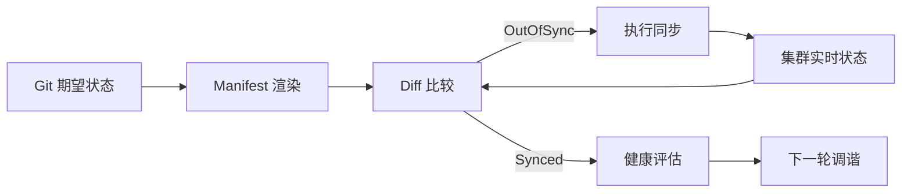
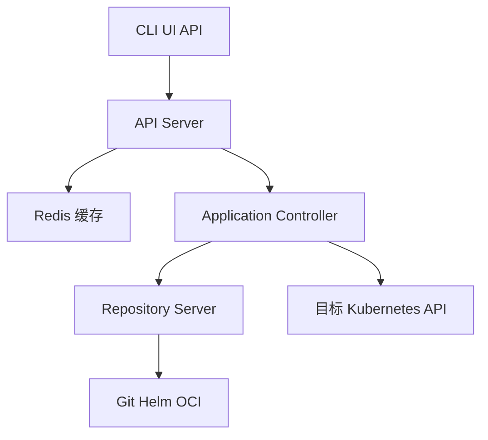
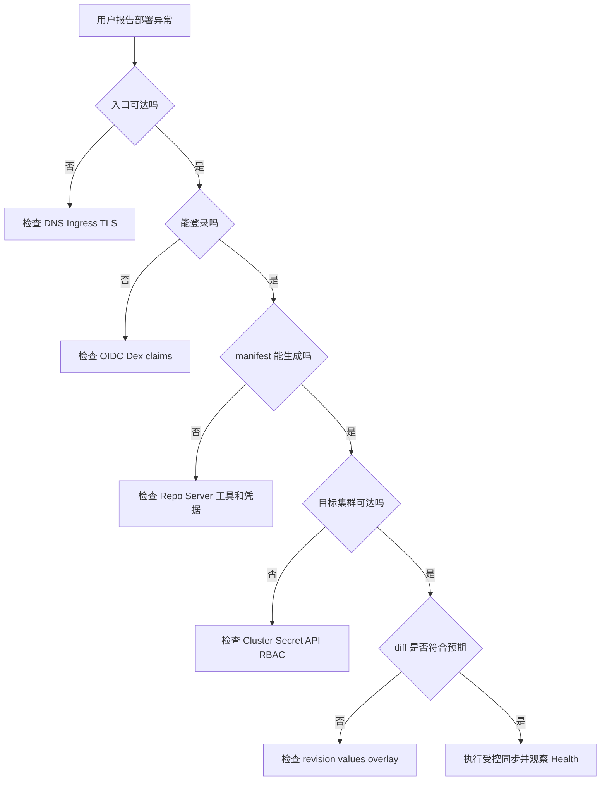

# Argo CD 基础、架构与应用接入学习笔记

## 第 1 章 · 从 GitOps 交付模型认识 Argo CD

### Argo CD 解决什么问题，又不替代哪些系统

Argo CD 是运行在 Kubernetes 上的 GitOps 持续交付控制器。它把 Git、Helm、Kustomize 或其他配置源声明为期望状态，持续比较目标集群的实时状态，并在策略允许时执行同步。它解决的是“配置如何可审计地到达集群”和“集群漂移如何被发现与修复”，不是源码编译、镜像构建、制品扫描或业务审批系统。

| 系统 | 主要职责 | 与 Argo CD 的边界 |
| --- | --- | --- |
| CI | 编译、测试、生成镜像 | 提交版本或更新配置仓库 |
| 镜像仓库 | 保存不可变制品 | Argo CD 拉取引用的镜像 |
| Git | 保存声明式期望状态 | 变更审计和回滚入口 |
| Argo CD | 比较、同步、健康评估 | 不替代 CI 和制品仓库 |
| Kubernetes | 执行控制器和工作负载 | 提供实时状态 |

典型链路是“代码提交→CI 构建镜像→更新环境仓库→Argo CD 同步”。生产环境应避免 CI 直接修改集群，因为绕过 Git 会削弱审计和回滚能力。

#### 一次变更的责任边界

CI 产出镜像 digest 和测试报告，配置仓库记录环境使用哪个 digest，Argo CD 只负责把声明落实到目标集群。出现问题时可以分别回答“制品是否正确”“配置是否正确”“同步是否完成”，而不是把所有失败都归因于部署工具。

一次性数据修复、需要人工交互的迁移、依赖外部审批令牌的动作，不适合直接建模成自动同步。可以把这类动作放在 Job 或变更系统中，让 Argo CD 只管理其声明和生命周期。

### 期望状态、实时状态与持续调谐如何形成闭环

Application 定义 source、destination 和同步策略。控制器周期性读取 Git 版本与集群对象，生成统一的资源树，计算 diff 并评估健康状态。若状态为 `OutOfSync` 且允许自动同步，控制器执行 apply；随后再次读取状态，直到变为 `Synced` 和健康。



调谐不是一次性部署命令：Webhook、定时刷新、手工刷新、资源事件都可能触发它。高风险变更应先查看 diff，再决定同步；暂停调谐后恢复时要预期控制器立即处理积压漂移。

#### 状态判读表

| 状态组合 | 说明 | 首要动作 |
| --- | --- | --- |
| `Synced` + `Healthy` | 期望状态和服务状态都正常 | 记录 revision，等待下一轮 |
| `OutOfSync` + `Healthy` | 资源可用但存在漂移 | 查看 diff，确认是否手工改动 |
| `Synced` + `Degraded` | Git 已应用但运行失败 | 查事件、探针和依赖 |
| `Unknown` | 无法获得可靠状态 | 先查 API、权限和缓存 |

把 `OutOfSync` 当作故障会制造噪声，把 `Degraded` 当作 Git 问题则会错过运行时事故。值班手册应为每种组合规定升级路径。

### API Server、Repository Server 与 Application Controller 如何协作

API Server 是认证、RBAC、Application API 和 Web UI 的入口；Repository Server 负责凭据范围内的仓库访问与 manifest 生成；Application Controller 负责比较、健康评估和同步。Redis 缓存渲染结果与状态，Dex 或 OIDC 提供身份联邦。



入口故障先查 API Server 和 Ingress，渲染故障查 Repository Server，资源未同步查 Application Controller，目标连接失败查集群 Secret 和 Kubernetes API。组件职责清晰是生产排障的第一层证据。

#### 请求路径与证据

`argocd app manifests` 成功只说明 Repository Server 能渲染，不说明目标集群可写；`argocd app get` 能读取状态，也不代表同步操作有权限。排障时把读取期望状态、读取实时状态、执行写操作分别验证。

```bash
argocd app manifests payments-prod --revision main >/tmp/payments.yaml
argocd app get payments-prod -o yaml
kubectl -n argocd logs deploy/argocd-application-controller --since=10m
```

### Argo CD Core 与完整多租户安装如何取舍

Core 是 headless 安装，不包含 API Server 和 Web UI，适合由集群管理员直接使用、无需多租户入口的场景；标准安装包含 API Server、Repository Server、Application Controller、Redis，并可配合 Dex 和 Notifications，适合平台化和多租户场景。选择 Core 后，访问与身份集成由外部系统承担，不能把“组件少”误认为“运维成本低”。Core 仍然需要 Repository Server、Application Controller 和 Redis，因此它不是客户端工具。

## 第 2 章 · 规划安装形态与访问入口

### 根据单租户、多租户与高可用目标选择安装清单

开发环境可用非 HA 清单，生产环境应使用 HA 清单并配置 Pod 反亲和、持久化或可靠的 Redis HA。多租户还需 AppProject、RBAC、命名空间隔离和独立仓库凭据。安装前明确集群规模、同步并发、入口协议和恢复目标。

```bash
kubectl create namespace argocd
kubectl apply -n argocd -f https://raw.githubusercontent.com/argoproj/argo-cd/v3.2.0/manifests/install.yaml
kubectl -n argocd get pods
```

验证标准是所有组件 Ready、Repository Server 能访问仓库、Controller 能访问目标集群，且 API Server 的外部地址与证书一致。

#### 安装后验收清单

```bash
kubectl -n argocd wait --for=condition=Available deployment/argocd-server --timeout=180s
kubectl -n argocd get secret argocd-initial-admin-secret
argocd repo list
argocd cluster list
```

如果只看到 Pod `Running`，还不能判定安装完成：Readiness 可能尚未通过，Repository Server 可能没有仓库凭据，Controller 可能没有目标集群写权限。

### 使用 Kustomize 或 Helm 管理 Argo CD 自身配置

把安装清单作为平台仓库的一部分，用 Kustomize overlay 或 Helm values 固化版本、资源限制、Ingress、Redis 和组件参数。升级通过提交配置变更完成，避免直接在集群中手改 Deployment。保留原始上游版本和 overlay 差异，便于升级冲突审查。

```yaml
resources:
  - https://raw.githubusercontent.com/argoproj/argo-cd/v3.2.0/manifests/ha/install.yaml
patches:
  - path: server-ingress-patch.yaml
```

### 为 gRPC、HTTP 与 CLI 设计 Ingress 和 TLS 终止路径

Web UI 和 REST 使用 HTTP，CLI 同时依赖 gRPC。Ingress 若只支持 HTTP/1.1，CLI 可能出现协议错误；可使用独立 gRPC 主机名、TLS passthrough，或由网关明确配置 h2c。证书终止位置要与 `--insecure`、后端协议和健康检查保持一致。

```yaml
apiVersion: networking.k8s.io/v1
kind: Ingress
metadata:
  name: argocd-server
  namespace: argocd
  annotations:
    nginx.ingress.kubernetes.io/backend-protocol: HTTPS
spec:
  tls:
    - hosts: [argocd.example.com]
      secretName: argocd-tls
```

### 配置外部地址、状态徽章、深链接与界面入口

`url` 应设置为用户实际访问地址，它影响 OAuth 回调、通知链接和状态徽章。深链接用于把 Application、资源和日志直接定位给值班人员；自定义 CSS 只解决品牌和可读性，不应隐藏状态信息。变更后验证浏览器、CLI、回调和通知中的 URL 都能访问。

## 第 3 章 · 用声明式配置接入仓库和目标集群

### 识别 Argo CD 的配置对象、原子配置与多对象配置

核心配置分为 ConfigMap、Secret、Repository、Cluster、AppProject、Application 和 ApplicationSet。小规模环境可用单个 YAML 声明多个对象；大型平台应拆分按职责管理，敏感值通过 Secret 或外部密钥系统注入。命令行参数适合启动级别选项，ConfigMap 适合运行时配置。

### 用 CLI 与 Secret 注册、检查和移除目标集群

CLI 登录 API Server 后，`argocd cluster add` 将 Kubernetes 上下文凭据写入 Argo CD。生产环境优先使用最小权限 ServiceAccount，并核对生成 Secret 中的 server、name 和 project。

```bash
argocd login argocd.example.com --grpc-web
argocd cluster add prod-context --name prod --yes
argocd cluster list
argocd cluster rm prod
```

删除集群注册前先确认没有 Application 仍指向它；否则 Application 会持续报连接失败。

### 接入 HTTPS、SSH、GitHub App 与云厂商私有仓库

HTTPS 仓库使用用户名和 Token，SSH 使用私钥与 known hosts，GitHub App 使用应用 ID、安装 ID 和私钥。凭据应通过 `argocd-repositories` Secret 或声明式 Secret 管理，按 URL 前缀限制匹配范围。私有 CA 必须显式加入 TLS 信任配置，禁止用跳过证书校验掩盖问题。

```yaml
apiVersion: v1
kind: Secret
metadata:
  name: repo-platform
  namespace: argocd
  labels:
    argocd.argoproj.io/secret-type: repository
stringData:
  type: git
  url: https://github.com/example/platform-config.git
  username: gitops-bot
  password: ${GITHUB_TOKEN}
```

### 管理 Git 行为、Webhook 刷新与仓库凭据边界

Webhook 只负责通知刷新，真正的信任仍来自 Git 拉取和凭据校验。配置 Git LFS、代理、并发和超时要结合仓库规模；Webhook Secret 应与仓库 URL 绑定并定期轮换。不要把一个高权限 Token 复用于所有组织和环境。

### 用 GnuPG 验证 Git 提交和发布来源

启用 GnuPG 验证后，只有签名有效且信任链满足要求的提交才可同步。先把公钥导入 Argo CD 的 GnuPG Secret，再在 Project 或 Application 策略中启用校验。密钥轮换时保留旧公钥直到所有引用切换完成。

## 第 4 章 · 掌握 Application 与 AppProject 对象模型

### 从 source、destination、project 和 syncPolicy 阅读 Application

`source` 描述仓库、路径和渲染工具，`destination` 描述集群与命名空间，`project` 提供授权边界，`syncPolicy` 决定手工或自动同步。先读这四块，再看 `ignoreDifferences`、sync options 和 hooks。

```yaml
apiVersion: argoproj.io/v1alpha1
kind: Application
metadata:
  name: payments-prod
  namespace: argocd
spec:
  project: payments
  source:
    repoURL: https://github.com/example/config.git
    targetRevision: main
    path: apps/payments/overlays/prod
  destination:
    server: https://kubernetes.default.svc
    namespace: payments
  syncPolicy:
    automated:
      prune: false
      selfHeal: true
```

### 用 AppProject 限制仓库、集群、命名空间和资源类型

AppProject 是多租户的资源防火墙：`sourceRepos` 限制来源，`destinations` 限制集群和命名空间，`clusterResourceWhitelist` 与 `namespaceResourceWhitelist` 限制资源类型。默认拒绝，再逐项允许；禁止把 `*` 当作平台默认。

### 设计项目角色、全局项目与团队自助边界

项目角色把资源操作映射到 RBAC，适合授予团队同步和查看权限而不暴露集群管理员权限。Global Project 提供组织级基线，但应限制可继承字段；团队自助创建 Application 时，需要同时约束项目、命名空间和仓库。

### 允许任意命名空间中的 Application 时如何保持隔离

启用 any-namespace 后，Application 可以位于业务命名空间，但控制器必须配置允许列表，且 AppProject、RBAC 和资源跟踪要使用一致的命名空间范围。先在非生产命名空间验证，再逐步放开。

### 资源跟踪标签、注解和 installation ID 如何避免冲突

Argo CD 通过标签或注解把资源归属到 Application。多实例或迁移时使用 installation ID，防止两个控制器同时认领同一对象。变更跟踪方式前先盘点现存资源，否则会出现重复、孤儿或误删。

## 第 5 章 · 从不同来源生成 Kubernetes Manifest

### 工具检测顺序和生产环境支持边界是什么

Repository Server 根据路径和文件检测 Jsonnet、Kustomize、Helm 或目录 YAML。显式指定工具版本和插件，避免本地工具升级导致结果变化；生产只使用官方支持的生成器和可复现依赖。

### 管理普通 YAML 目录的递归、包含和排除规则

目录源按文件生成资源，可配置递归、include 和 exclude。把 README、模板片段和密钥文件排除在资源目录之外，并在 CI 中运行 `kubectl kustomize` 或 `argocd app manifests` 验证输出。

### 在 Argo CD 中正确理解 Helm 只负责模板渲染

Argo CD 调用 Helm template 生成 YAML，Release 生命周期由 Argo CD 管理，不使用 Helm release state。Helm hook 会映射为 Argo CD hook，需检查删除策略和幂等性。

### 配置 Helm Values 优先级、外部值文件与 Hook 映射

值优先级通常是 `parameters` 高于 `valuesObject`、`values` 和 valueFiles。外部值文件必须属于允许的来源，且多来源配置要固定版本。敏感值不要提交 Git，使用 Secret 管理或运行时注入。

```yaml
source:
  helm:
    valueFiles: [values.yaml, values-prod.yaml]
    parameters:
      - name: image.tag
        value: "2026.08.29"
```

### 使用 Kustomize、Jsonnet 与 OCI 作为应用来源

Kustomize 适合 overlay 和资源补丁，Jsonnet 适合参数化对象，OCI 适合分发版本化制品。统一规定工具版本、目录布局和验证命令；OCI 凭据与 Git 凭据分开授权。

### 多来源 Application 适合什么场景，何时应该改用 ApplicationSet

多来源适合少量“基础配置仓库+环境值仓库”的组合；来源过多会让归属、审计和故障定位变复杂。需要按集群、租户或目录批量生成 Application 时，改用 ApplicationSet。

### 构建环境变量和参数替换如何影响可复现性

构建环境变量可注入应用名、版本和提交信息，但隐式环境会造成同一提交产生不同 manifest。把关键变量写入 Application 或生成器参数，并记录最终 revision；禁止把 Token 等秘密放入参数日志。

## 第 6 章 · 扩展 Manifest 生成与平台能力

### Config Management Plugin 的 sidecar 模型和安全边界

CMP sidecar 与 Repo Server 分离运行插件，插件通过 tar stream 接收受限工作目录并返回 YAML。sidecar 应使用非 root、只读根文件系统、资源限制和最小网络权限；插件输出必须经过 YAML 和资源类型校验。

### 自定义工具镜像与卷挂载方案如何选择

工具固定在自定义镜像中适合稳定依赖，挂载二进制适合快速验证但版本和供应链风险更高。镜像需锁定 digest，挂载目录只读，并避免把宿主机敏感路径暴露给 Repo Server。

### CLI Plugin、Proxy Extension 与 UI Extension 分别扩展哪一层

CLI Plugin 扩展用户命令，Proxy Extension 代理外部 API，UI Extension 增加资源视图或操作入口。扩展应有独立认证、超时和失败降级；UI 按钮不能绕过 Argo CD RBAC。

### API、CLI 与 kubectl 三种自动化入口如何取舍

API 适合平台集成和幂等程序，CLI 适合人工与流水线脚本，kubectl 插件适合 Kubernetes 原生工作流。自动化优先 API 或声明式 YAML，脚本必须检查退出码和同步结果。

```bash
argocd app get payments-prod --refresh
argocd app diff payments-prod
argocd app sync payments-prod --prune=false
```

## 第一册综合实验：从安装到平台验收

本实验把前六章串成一条可复现路径：平台安装、入口暴露、仓库和集群注册、AppProject 隔离、Application 创建、manifest 生成、资源跟踪，以及扩展能力的安全检查。实验使用 staging 集群和专用测试仓库，完成后应删除所有临时凭据。

### 先建立平台边界

第一册的实验都假定 Argo CD 运行在 `argocd` namespace，业务应用运行在独立 namespace。先把平台自身和业务资源分开，后续的 RBAC、备份和删除演练才有清晰影响面。

```bash
kubectl create namespace argocd
kubectl create namespace payments
kubectl label namespace payments owner=team-payments environment=staging
kubectl get namespace --show-labels
kubectl config current-context
kubectl version
kubectl get crd applications.argoproj.io
```

不要在生产集群直接试验新的 RBAC、删除策略和自定义插件。实验集群应能随时重建，且 Git 仓库使用专用测试组织和短期 Token。

### 对照安装形态

分别记录非 HA、多租户 HA 和 Core 三种安装的组件差异。Core 不提供 API Server 和 UI，不能用 `argocd login` 当作验收命令；多租户安装则要额外验收认证、RBAC、Ingress 和 webhook。

```bash
kubectl apply -n argocd -f manifests/ha/install.yaml
kubectl -n argocd get deploy,statefulset,svc
kubectl -n argocd get pods -o wide
kubectl -n argocd describe pod -l app.kubernetes.io/part-of=argocd
```

| 组件 | 作用 | 失败时先查 |
| --- | --- | --- |
| argocd-server | API、UI、认证 | Ingress、TLS、日志 |
| argocd-repo-server | 拉仓库、生成 manifest | 凭据、磁盘、超时 |
| argocd-application-controller | diff、health、sync | 队列、权限、事件 |
| argocd-redis | 缓存 | 连接和内存 |
| argocd-dex-server | 身份联邦 | 回调和 claims |

安装验收不能只看 Pod 为 `Running`。还要用探针、服务端口、就绪条件和一次真实请求确认组件可用。

### 验证入口协议和 TLS

把外部入口拆成浏览器 HTTP、CLI gRPC、CI REST 三类请求。网关可以统一域名，也可以为 gRPC 单独提供主机名；无论哪种方式，都要把后端协议写清楚。

```bash
curl -vk https://argocd.example.com/api/v1/version
grpcurl -insecure argocd.example.com:443 list
argocd login argocd.example.com --grpc-web --username admin
```

验收记录：

- 浏览器能够加载 UI，静态资源没有跨域或证书错误。
- `/api/v1/version` 返回当前版本，而不是 Ingress 默认后端页面。
- CLI 使用 `--grpc-web` 或原生 gRPC 与网关配置一致。
- OAuth redirect URI 与外部 URL 完全匹配。
- 证书链包含中间证书，客户端不需要关闭校验。
- API Server 的 `--insecure` 只在 TLS 已由可信网关终止时使用。

如果 REST 正常而 CLI 失败，优先检查 HTTP/2、gRPC-Web、Ingress annotation 和代理超时，而不是重置管理员密码。

### 接入仓库和凭据

为 HTTPS、SSH、GitHub App 和 OCI 各准备一个最小测试仓库。每种凭据都记录 URL 匹配范围、权限、过期时间、轮换方式和撤销动作。

```bash
argocd repo add https://github.com/example/platform-config.git --username gitops-bot --password "$GIT_TOKEN"
argocd repo add git@github.com:example/platform-config.git --ssh-private-key-path ./id_ed25519
argocd repo list --output wide
argocd repo get https://github.com/example/platform-config.git
```

| 场景 | 预期 | 失败证据 |
| --- | --- | --- |
| 正确 Token | 连接成功 | `Successful` |
| 过期 Token | 明确认证失败 | `authentication required` |
| 错误 known_hosts | 拒绝连接 | host key 错误 |
| 私有 CA 未配置 | TLS 失败 | unknown authority |
| 无权访问路径 | 403 或 repository not found | 不应返回空仓库 |

Webhook 只是刷新信号，不是仓库授权。收到 webhook 后仍要由 Repo Server 使用已登记凭据拉取 revision；因此 webhook secret 泄露不会直接赋予 Git 写权限，但会造成刷新风暴。

### 声明式配置分层

把平台配置按以下目录组织，避免一个巨型 YAML 难以审查：

```text
argocd-platform/
├── base/
│   ├── namespace.yaml
│   ├── install.yaml
│   └── kustomization.yaml
├── overlays/staging/
│   ├── ingress.yaml
│   ├── resource-limits.yaml
│   └── kustomization.yaml
├── projects/
│   ├── payments.yaml
│   └── shared-services.yaml
├── repositories/
│   └── platform-config.yaml
└── applications/
    └── payments-staging.yaml
```

每次提交按四步验证：

```bash
kubectl kustomize overlays/staging > /tmp/argocd.yaml
kubectl apply --server-side --dry-run=server -f /tmp/argocd.yaml
kubectl diff -f /tmp/argocd.yaml
kubectl apply -f /tmp/argocd.yaml
```

`kubectl diff` 只说明 Kubernetes 对象差异，不说明 Application 资源树是否会变化；后者必须再运行 `argocd app diff`。

### Application 最小闭环

用一个只包含 Namespace、Deployment 和 Service 的仓库创建 Application。先关闭自动同步，手工确认 diff，再打开 selfHeal，最后在测试环境演练 prune。

```yaml
apiVersion: argoproj.io/v1alpha1
kind: Application
metadata:
  name: payments-staging
  namespace: argocd
  labels:
    owner: team-payments
    environment: staging
spec:
  project: payments
  source:
    repoURL: https://github.com/example/platform-config.git
    targetRevision: 8f31c2a
    path: apps/payments/overlays/staging
  destination:
    server: https://kubernetes.default.svc
    namespace: payments
  syncPolicy:
    automated:
      enabled: false
      prune: false
      selfHeal: false
```

```bash
kubectl apply -f applications/payments-staging.yaml
argocd app get payments-staging
argocd app diff payments-staging
argocd app sync payments-staging --prune=false
argocd app wait payments-staging --sync --health
kubectl -n payments get all
```

| 结果 | 含义 | 下一步 |
| --- | --- | --- |
| `ComparisonError` | manifest 生成失败 | 查 source、工具版本、Repo Server |
| `InvalidSpecError` | Application 或 Project 不合法 | 查字段和授权边界 |
| `SyncFailed` | apply、权限或 admission 失败 | 查事件和 Controller 日志 |
| `Progressing` | 对象已写入但未就绪 | 查探针、事件和依赖 |
| `Healthy` | health 规则通过 | 仍需检查业务 SLO |

### AppProject 最小权限

项目先拒绝所有来源和目标，再逐条增加 allow。不要为了快速验证把 project 绑定到 `default` 并允许所有资源。

```yaml
apiVersion: argoproj.io/v1alpha1
kind: AppProject
metadata:
  name: payments
  namespace: argocd
spec:
  sourceRepos:
    - https://github.com/example/platform-config.git
  destinations:
    - namespace: payments
      server: https://kubernetes.default.svc
  clusterResourceWhitelist: []
  namespaceResourceWhitelist:
    - group: apps
      kind: Deployment
    - group: ""
      kind: Service
    - group: ""
      kind: ConfigMap
```

负向测试必须验证：未登记仓库被拒绝，`kube-system` 被拒绝，ClusterRole 被拒绝，普通角色的 `delete` 和 `exec` 被拒绝，只有平台角色能修改 AppProject。

### 资源跟踪迁移

先查看 Application 的资源树与对象 labels，再切换 tracking method。切换前导出资源，切换后比较 owner，确认没有资源同时被两个 Argo CD 实例认领。

```bash
argocd app resources payments-staging
kubectl -n payments get deploy payments -o jsonpath='{.metadata.labels}'
kubectl -n argocd get secret -l argocd.argoproj.io/secret-type=cluster
```

迁移表至少包含旧 tracking method、新 method、安装 ID、受影响 Application 数量、孤儿资源数量、回滚步骤和清理时间。任何 owner 不明确的资源都应先人工确认，不能直接开启 prune。

### 工具来源选择

| 来源 | 最适合 | 常见风险 | 验证方式 |
| --- | --- | --- | --- |
| 目录 YAML | 资源少、结构稳定 | 文件误扫描 | 检查 include/exclude |
| Helm | 参数化 chart | values 覆盖和远程依赖 | `helm template` 对比 |
| Kustomize | 环境 overlay | base 路径和补丁漂移 | `kustomize build` |
| Jsonnet | 复杂组合 | 依赖和可读性 | 固定 vendor |
| OCI | 版本化分发 | tag 可变、凭据范围 | digest 拉取 |

同一团队不要在没有理由的情况下混用多种工具。工具越多，Repo Server 镜像、缓存、升级和排障矩阵越大。

### CMP sidecar 安全检查

```yaml
containers:
  - name: cmp-plugin
    image: registry.example.com/argocd-cmp:v1.3.0@sha256:abc
    securityContext:
      runAsNonRoot: true
      readOnlyRootFilesystem: true
      allowPrivilegeEscalation: false
    resources:
      requests:
        cpu: 50m
        memory: 128Mi
      limits:
        cpu: 500m
        memory: 512Mi
```

检查 discover 规则、generate 超时、共享目录、tar stream 排除项、stdout 是否混入日志，以及升级前后的 manifest diff。插件失败时必须返回明确退出码，不能把空输出当成合法空应用。

### 第一册验收报告

```text
实验环境：
Argo CD 版本：
Kubernetes 版本：
安装形态：
外部入口：
仓库 revision：
目标集群：
Application：

通过项：
- [ ] 组件 Ready
- [ ] TLS 和 gRPC
- [ ] 仓库认证
- [ ] 目标集群连接
- [ ] AppProject 最小权限
- [ ] Application diff
- [ ] 手工同步
- [ ] Health 判读
- [ ] 资源跟踪
- [ ] 工具渲染
- [ ] CMP 隔离
- [ ] API/CLI 自动化

失败项与证据：
回滚动作：
遗留风险：
负责人和复查日期：
```

报告必须附上 Application YAML、生成 manifest 摘要、资源树、组件日志时间范围和关键命令退出码。只写“部署成功”不能作为平台验收证据。

#### 端到端接入练习

先配置仓库 Secret、目标集群凭据、AppProject 和一个手工同步的 Application。依次验证仓库认证、manifest 渲染、目标 API 读权限、diff 和同步写权限，最后才开启 automated。验收点不是页面显示绿色，而是能从 Git revision 追到 manifest、资源 owner、集群对象和最终健康条件。

## 附录：配置参考与排障手册

这一部分把源材料中分散的字段、命令和故障表现整理成可查阅的运行手册。示例中的域名、Token 和集群地址均为占位符，不能直接用于生产。

### API Server 参数检查

API Server 同时承载 REST、gRPC、UI、认证、RBAC、webhook 和 Application 操作。参数变更应通过 `argocd-cmd-params-cm` 或声明式 overlay 管理，避免直接修改 Deployment 后被下一次安装覆盖。

```yaml
apiVersion: v1
kind: ConfigMap
metadata:
  name: argocd-cmd-params-cm
  namespace: argocd
data:
  server.insecure: "false"
  server.grpc.web: "true"
  server.disable.auth: "false"
  server.log.level: info
  server.log.format: json
```

修改后检查：

```bash
kubectl -n argocd rollout status deploy/argocd-server
kubectl -n argocd logs deploy/argocd-server --since=5m
argocd version --server argocd.example.com --grpc-web
```

| 现象 | 优先检查 | 不要先做的事 |
| --- | --- | --- |
| UI 502 | Service、Ingress、TLS、readiness | 重建所有 Pod |
| CLI protocol error | gRPC-Web 或 HTTP/2 | 关闭 TLS 校验 |
| OAuth loop | 外部 URL、redirect URI、cookie | 删除用户 |
| 登录成功但无权限 | groups claim、RBAC policy | 提升为 admin |
| webhook 无刷新 | 路由、secret、签名 | 手工频繁 refresh |

### Repository Server 参数检查

Repository Server 是 manifest 生成的隔离边界，没有目标 Kubernetes 写权限。应为它设置 CPU、内存、临时磁盘和并发上限；大型仓库还要观察 clone、fetch、ls-remote 和缓存命中。

```bash
kubectl -n argocd exec deploy/argocd-repo-server -- df -h /tmp
kubectl -n argocd logs deploy/argocd-repo-server --since=10m | rg 'manifest|timeout|fatal'
argocd app manifests payments-staging --revision 8f31c2a >/tmp/manifest.yaml
```

生成超时时先确认仓库可达，再确认工具版本，然后检查并发和内存，最后才调整 `ARGOCD_EXEC_TIMEOUT`。盲目提高超时会让队列堆积，把单个慢仓库变成平台级延迟。

### Application Controller 参数检查

Controller 有状态处理队列和操作处理队列。状态处理关注 diff、health 和资源事件，操作处理关注 sync、delete 和 hook。两者都排队时，应分别观察处理器数量、队列深度和单次 reconcile 延迟。

```bash
kubectl -n argocd top pod -l app.kubernetes.io/name=argocd-application-controller
kubectl -n argocd get applications -A --no-headers | wc -l
kubectl -n argocd logs statefulset/argocd-application-controller --since=15m
```

如果 Application 数量不多但 reconcile 很慢，优先看 manifest 生成和 Kubernetes API；如果单个集群很慢而其他集群正常，检查该集群网络、API 限流和资源版本转换。

### Repository Secret 字段对照

HTTPS、SSH、GitHub App 和 Helm/OCI 仓库的字段不同。字段缺失时，Argo CD 可能直到第一次 fetch 才失败，因此提交后必须主动执行连接检查。

```yaml
apiVersion: v1
kind: Secret
metadata:
  name: repo-https
  namespace: argocd
  labels:
    argocd.argoproj.io/secret-type: repository
stringData:
  type: git
  url: https://git.example.com/platform/config.git
  username: gitops-bot
  password: ${GIT_TOKEN}
```

凭据轮换按以下顺序执行：创建新凭据，声明式更新 Secret，运行 `argocd repo list` 和一次 manifest 生成，确认所有 Application 正常后删除旧凭据。不要在业务高峰直接删除唯一 Token。

### Cluster Secret 与目标集群连通性

目标集群 Secret 至少需要 server、name 和 config。config 内的 bearer token、CA 和 TLS 设置必须与目标集群匹配；EKS 等云集群可以使用 IAM 角色而不是长期 Token。

```bash
argocd cluster list
argocd cluster get https://kubernetes.staging.example.com
kubectl auth can-i --as=system:serviceaccount:kube-system:argocd-manager get deployments -A
```

删除 Argo CD 注册并不一定撤销目标集群权限。撤销访问要在目标集群删除 ServiceAccount、ClusterRole 和 ClusterRoleBinding，再从 Argo CD 删除 cluster entry。

### Application 字段审查表

审查 Application 时按 source、destination、project、syncPolicy、metadata 和 finalizers 顺序阅读。

| 字段 | 问题 | 风险 |
| --- | --- | --- |
| `repoURL` | 是否在 AppProject allowlist | 供应链注入 |
| `targetRevision` | branch、tag 还是 commit | 可复现性 |
| `path` | 是否包含测试或秘密文件 | 误部署 |
| `project` | 是否为团队允许的项目 | 权限扩大 |
| `destination.server` | 是否为预期集群 | 环境误投 |
| `automated.prune` | 是否经过删除演练 | 级联删除 |
| `ignoreDifferences` | 是否有业务理由 | 隐藏漂移 |
| `finalizers` | 删除时是否级联资源 | 数据丢失 |

### Helm Values 合并演练

Helm values 的实际结果由 chart 默认值、valueFiles、values、valuesObject 和 parameters 共同决定。应在 PR 中展示最终合并结果，而不是只展示某个覆盖文件。

```yaml
source:
  helm:
    valueFiles: [values.yaml, values-staging.yaml]
    valuesObject:
      resources:
        requests:
          cpu: 100m
          memory: 128Mi
    parameters:
      - name: image.tag
        value: 2026.08.29
        forceString: true
```

```bash
helm template payments ./chart -f values.yaml -f values-staging.yaml
argocd app manifests payments-staging | yq 'select(.kind == "Deployment")'
```

常见错误包括 valueFiles 路径相对目录错误、参数名称中的点号未转义、数字被解释为字符串、chart 依赖未锁定，以及远程 chart tag 被重新覆盖。

### Kustomize Overlay 审查

Kustomize 适合把 base 与环境差异分开，但 overlay 仍可能通过 JSON patch 修改任意字段。审查时确认 namePrefix、namespace、images、replicas、patches 和 resources 的最终效果。

```yaml
apiVersion: kustomize.config.k8s.io/v1beta1
kind: Kustomization
namespace: payments
resources:
  - ../../base
images:
  - name: payments
    newName: registry.example.com/payments
    newTag: 2026.08.29
```

```bash
kustomize build apps/payments/overlays/staging > /tmp/payments.yaml
kubectl apply --server-side --dry-run=server -f /tmp/payments.yaml
```

如果最终资源数量突然增加，先对比目录树和 overlay，而不是开启 prune。目录重命名也会改变资源跟踪关系，必须视为迁移。

### 目录 YAML 的生产约束

目录源的优点是透明：每个 YAML 都是最终对象；缺点是缺少 chart 和 overlay 提供的结构约束。生产目录应把资源按生命周期分组，并用 schema 工具阻断未知字段。

```text
apps/payments/base/
├── namespace.yaml
├── serviceaccount.yaml
├── configmap.yaml
├── deployment.yaml
├── service.yaml
├── networkpolicy.yaml
└── kustomization.yaml
```

推荐检查：

```bash
find apps/payments -type f -name '*.yaml' -print
yamllint apps/payments
kubeconform -strict -summary apps/payments/**/*.yaml
kubectl apply --dry-run=server -f apps/payments/base
```

不要把 `Secret` 明文、`.env`、临时调试 Pod 和测试 fixture 放在可递归目录中。即使 exclude 已配置，也要在 CI 中扫描秘密模式和禁止的 kind。

### Helm 渲染的完整检查链

Helm 在 Argo CD 中只执行模板渲染；Release、历史版本和回滚记录由 Application 与 Git revision 表达。理解这一点，可以避免把 Helm CLI 的 release state 当作 Argo CD 的事实来源。

```bash
helm dependency build charts/payments
helm lint charts/payments
helm template payments charts/payments \
  --namespace payments \
  --values charts/payments/values.yaml \
  --values environments/staging/payments.yaml \
  --set-string image.tag=2026.08.29
```

渲染检查清单：

- Chart.lock 是否提交且与 Chart.yaml 一致。
- 子 chart 和远程依赖是否来自可信 registry。
- values 文件路径是否相对于 `spec.source.path`。
- 参数点号、斜杠和反斜杠是否正确转义。
- `forceString` 是否用于端口、版本和注解等字符串字段。
- Helm hook 是否映射成预期的 Argo CD hook。
- `skipCrds` 和 schema 校验是否有书面理由。
- target Kubernetes 版本是否与实际集群一致。

### Helm Hook 与 Argo CD Hook 对照

Helm hook 通过注解表达 chart 生命周期动作，Argo CD 会把部分 Helm hook 映射到对应 phase。迁移时应检查删除策略、执行顺序和失败重试，不要假设两个系统拥有完全相同的语义。

| 目的 | 建议 phase | 典型资源 | 失败处理 |
| --- | --- | --- | --- |
| 数据库前置迁移 | PreSync | Job | 阻断 Sync |
| 初始化配置 | Sync | Job/ConfigMap | 重试或人工确认 |
| 烟囱测试 | PostSync | Job | 标记应用失败 |
| 失败通知 | SyncFail | Job/Webhook | 不覆盖原始错误 |
| 删除后清理 | PostDelete | Job | 保留审计证据 |

Hook Job 必须具备幂等键、超时、资源限制和清理策略。迁移脚本完成后，不应留下永久运行的 Hook Pod。

### Kustomize 版本与补丁策略

Kustomize 的输出取决于二进制版本、资源顺序和 transformer 配置。Argo CD 的内置版本与本地 `kustomize` 版本可能不同，CI 应使用与 Repo Server 相同的版本验证。

```bash
argocd version --client
kubectl kustomize --enable-helm apps/payments/overlays/staging
argocd app manifests payments-staging > /tmp/argocd.yaml
diff -u /tmp/local.yaml /tmp/argocd.yaml
```

补丁选择：

| 类型 | 适合 | 风险 |
| --- | --- | --- |
| Strategic Merge | Kubernetes 原生对象 | CRD schema 不完整时行为不明 |
| JSON 6902 | 精确字段修改 | 数组索引变动导致失败 |
| Image transformer | 统一镜像版本 | 镜像名不匹配时静默无效 |
| NamePrefix/Namespace | 环境隔离 | selector 或引用未同步 |

每个 overlay 都应有一份渲染快照或关键字段断言。

### Jsonnet 的依赖和参数

Jsonnet 适合用函数组合 Kubernetes 对象，但库依赖、extVar 和环境变量会影响可复现性。把 vendor 目录或依赖锁定文件提交到仓库，并记录 `jsonnet --version`。

```bash
jsonnet-bundler install
jsonnet -J vendor -V environment=staging apps/payments/main.jsonnet
jsonnetfmt -n 2 --max-blank-lines 1 --string-style s apps/payments/main.jsonnet
```

检查 extVar 是否有默认值、数组输出是否稳定、对象名称是否唯一，以及生成结果是否包含 namespace。Jsonnet 运行时异常属于比较错误，不能靠同步重试解决。

### OCI 来源的不可变性

OCI chart 或 manifest bundle 的 tag 可能被重新推送。生产应使用 digest、签名和 registry allowlist，并让 Repo Server 的凭据只具备 pull 权限。

```bash
oras manifest fetch registry.example.com/payments:2.4.1
helm pull oci://registry.example.com/charts/payments --version 2.4.1
cosign verify registry.example.com/charts/payments@sha256:abc
```

验证失败时区分 registry 不可达、认证失败、digest 不存在和签名不可信。不要通过 `--insecure-skip-tls-verify` 绕过证书或签名检查。

### 多来源 Application 的冲突模型

多来源允许一个 Application 从多个仓库、chart 或 ref 组装 manifest，但资源归属仍属于同一个 Application。source 数量增加会放大凭据、审计和冲突复杂度。

```yaml
spec:
  sources:
    - repoURL: https://charts.example.com
      chart: payments
      targetRevision: 2.4.1
      helm:
        valueFiles:
          - $values/staging/payments.yaml
    - repoURL: https://git.example.com/platform/env.git
      targetRevision: 4c12a9e
      ref: values
```

审查 source 关系：

1. 每个 source 是否有不同的信任级别。
2. ref 是否只用于 values，而不会意外生成额外资源。
3. 同名资源覆盖是否预期且有警告处理。
4. 删除某 source 后哪些资源会消失。
5. 是否应该拆分为两个 Application。

### 参数替换的优先级和审计

Application 参数、Helm parameters、valuesObject、环境变量和插件参数之间存在优先级。优先级越高，越容易绕过 Git 审查；生产应限制高优先级入口。

```bash
argocd app get payments-staging -o json | jq '.spec.source, .spec.sources'
argocd app history payments-staging
argocd app diff payments-staging --local ./apps/payments
```

参数审计至少保存：操作者、时间、旧值、新值、来源、过期时间和最终 revision。秘密参数只记录名称和 hash，不记录原文。

### Build Environment 的确定性

构建环境可以提供 `ARGOCD_APP_NAME`、`ARGOCD_APP_REVISION`、`KUBE_VERSION` 等上下文。它们适合生成标签、镜像选择和工具行为，但隐式读取环境会让本地复现困难。

```yaml
spec:
  source:
    plugin:
      env:
        - name: APP_ENV
          value: staging
        - name: RELEASE_REVISION
          value: 8f31c2a
```

环境变量命名应避免与系统变量冲突；插件需要的变量必须在 Application 或仓库配置中声明。重现问题时把变量列表、工具版本和目标 Kubernetes 版本一起记录。

### Git Webhook 与轮询

Webhook 可以把刷新延迟从分钟级降低到秒级，但它只通知 Argo CD“可能有变化”。服务器仍会校验仓库、revision 和凭据。轮询是 webhook 失败时的兜底。

```bash
curl -X POST https://argocd.example.com/api/webhook \
  -H 'X-GitHub-Event: push' \
  -H 'X-Hub-Signature-256: sha256=redacted' \
  -d @payload.json
```

监控 webhook 接收数、签名失败数、刷新排队时间、Git fetch 错误和 rate limit。重复 webhook 应被去重，不能触发无限 refresh。

### GnuPG 密钥轮换

签名密钥轮换需要新旧密钥重叠期。先导入新公钥并验证测试提交，再更新分支保护和发布流水线，最后撤销旧密钥。

```bash
gpg --import release-signing-key.asc
gpg --fingerprint release@example.com
git verify-commit 8f31c2a
argocd gpg list
```

排障记录要包含 fingerprint、提交 hash、签名者邮箱、有效期和信任状态。密钥过期不等于提交内容恶意，但生产策略应拒绝过期签名并明确恢复流程。

### Applications in any namespace

允许 Application 位于业务 namespace 后，平台需要同时控制 CRD 读取、ApplicationSet 生成、AppProject 引用和目标资源权限。只放开 namespace 读取而不限制 project，会形成间接越权。

```yaml
data:
  application.namespaces: team-payments,team-orders
  applicationset.allowed.namespaces: platform
```

负向测试：

- `team-orders` 不能引用 `payments` 项目。
- 普通用户不能把 destination 改成生产集群。
- ApplicationSet 不能从未可信的 namespace 加载模板。
- 业务 namespace 删除后，平台对象不会被意外级联删除。

### Secret 管理和外部密钥系统

仓库、集群、OIDC、Webhook 和插件凭据不应共享 Secret。使用 External Secrets、Sealed Secrets 或云 KMS 时，要把解密控制器的权限与 Argo CD 控制器权限分开。

```yaml
apiVersion: v1
kind: Secret
metadata:
  name: repo-platform
  namespace: argocd
  labels:
    argocd.argoproj.io/secret-type: repository
type: Opaque
stringData:
  type: git
  url: https://git.example.com/platform/config.git
  username: gitops-bot
  password: ${SECRET_REF}
```

轮换后要验证旧凭据不可用、新凭据可用、日志无泄露、通知模板无泄露，并清理临时导出文件。

### 组件间权限最小化

Repo Server 不需要目标 Kubernetes 写权限；Controller 需要读取和写入受管理资源；API Server 需要访问配置和代理请求。修改默认 cluster-admin 前先列出实际资源种类和动作。

```bash
kubectl auth can-i --as=system:serviceaccount:argocd:argocd-repo-server get pods -A
kubectl auth can-i --as=system:serviceaccount:argocd:argocd-application-controller create deployments -A
kubectl auth can-i --as=system:serviceaccount:argocd:argocd-server update secrets -n argocd
```

命令结果必须和设计矩阵一致。过宽的读取权限会暴露 Secret，过宽的写权限则意味着可信 Git 仓库被攻破后可直接接管集群。

### CLI 命令参考

```bash
argocd login HOST --grpc-web --username USER
argocd app list
argocd app get APP --refresh
argocd app diff APP
argocd app manifests APP
argocd app sync APP --prune=false
argocd app wait APP --sync --health --timeout 600
argocd app history APP
argocd app rollback APP ID
argocd app terminate-op APP
argocd proj get PROJECT
argocd repo list
argocd cluster list
argocd admin export -n argocd
```

自动化脚本应固定 CLI 主版本，使用 JSON 输出而不是解析人类可读文本，并在网络失败时设置有限重试。

### API 调用的幂等性

创建 Application 前先按名称查询，更新时使用声明式 apply 或完整 spec，删除前读取 finalizers 和资源树。API 请求超时后不能直接重试写操作，应先查询 operation 状态。

```bash
curl -sS -H "Authorization: Bearer $ARGOCD_TOKEN" \
  https://argocd.example.com/api/v1/applications/payments-staging
```

API 客户端应记录响应状态、request ID 和 operation ID，不记录 Authorization header。对于 sync、rollback 和 delete，必须把“请求已接受”和“操作已完成”分开处理。

### 第一册常见故障决策树



每次只沿一条分支验证。若多个分支同时失败，先记录共同时间点和最近变更，优先排查平台级依赖。

### 第一册最终检查清单

- [ ] 安装版本、CRD 和 Kubernetes 版本已记录。
- [ ] API、gRPC、UI、webhook 入口均可验证。
- [ ] 外部 URL、TLS 和 OAuth 回调一致。
- [ ] 仓库凭据按 URL 和用途隔离。
- [ ] 目标集群使用最小权限凭据。
- [ ] AppProject 限制 source、destination 和资源类型。
- [ ] Application source 使用固定 revision 或有明确更新策略。
- [ ] Helm、Kustomize、Jsonnet、OCI 的工具版本可复现。
- [ ] 多来源覆盖关系已审查。
- [ ] 参数覆盖和环境变量具备审计记录。
- [ ] GnuPG 签名验证和密钥轮换流程已演练。
- [ ] CMP sidecar 具备非 root、只读文件系统和资源限制。
- [ ] 扩展入口具备认证、超时、allowlist 和降级。
- [ ] 资源跟踪和 installation ID 不冲突。
- [ ] API/CLI 自动化等待 operation 和 health 完成。
- [ ] 失败证据包括 revision、组件日志、资源树和事件。
- [ ] 回滚动作不依赖临时手工修改。

#### 配置参考：标准 Application

```yaml
apiVersion: argoproj.io/v1alpha1
kind: Application
metadata:
  name: inventory-staging
  namespace: argocd
  labels:
    team: inventory
    env: staging
  annotations:
    notifications.argoproj.io/subscribe.on-sync-succeeded.slack: platform
spec:
  project: inventory
  source:
    repoURL: https://git.example.com/platform/apps.git
    targetRevision: 4c12a9e
    path: inventory/overlays/staging
  destination:
    name: staging
    namespace: inventory
  syncPolicy:
    automated:
      enabled: false
      prune: false
      selfHeal: false
    syncOptions:
      - CreateNamespace=false
      - PrunePropagationPolicy=foreground
  ignoreDifferences:
    - group: apps
      kind: Deployment
      jsonPointers:
        - /spec/replicas
```

这个例子把 HPA 维护的 replicas 作为已知差异，但仍然保留镜像、selector、容器参数等业务字段的比较。开启 automated 前，应先删除 `ignoreDifferences` 做一次完整 diff，确认没有其它未预期变化。

#### 配置参考：严格 AppProject

```yaml
apiVersion: argoproj.io/v1alpha1
kind: AppProject
metadata:
  name: inventory
  namespace: argocd
spec:
  description: Inventory team staging delivery boundary
  sourceRepos:
    - https://git.example.com/platform/apps.git
  destinations:
    - name: staging
      namespace: inventory
  clusterResourceWhitelist: []
  namespaceResourceWhitelist:
    - group: ""
      kind: ConfigMap
    - group: ""
      kind: Secret
    - group: ""
      kind: Service
    - group: apps
      kind: Deployment
    - group: networking.k8s.io
      kind: Ingress
  roles:
    - name: deployer
      description: Read and sync inventory applications
      policies:
        - p, proj:inventory:deployer, applications, get, inventory/*, allow
        - p, proj:inventory:deployer, applications, sync, inventory/*, allow
      groups:
        - team-inventory
```

审查时确认项目角色不能修改 Project、自身角色、Repository Secret 或 Cluster Secret。项目中允许 `Secret` 只代表 Argo CD 能管理该 kind，不代表用户能读取 Secret 内容；API Server 仍应保持敏感字段脱敏。

#### 配置参考：Repository Secret 与仓库凭据模板

```yaml
apiVersion: v1
kind: Secret
metadata:
  name: repo-creds-platform
  namespace: argocd
  labels:
    argocd.argoproj.io/secret-type: repo-creds
stringData:
  url: https://git.example.com/platform
  username: gitops-bot
  password: ${GIT_TOKEN}
---
apiVersion: v1
kind: Secret
metadata:
  name: repo-oci
  namespace: argocd
  labels:
    argocd.argoproj.io/secret-type: repository
stringData:
  type: helm
  name: platform-charts
  enableOCI: "true"
  url: registry.example.com/charts
  username: chart-reader
  password: ${REGISTRY_TOKEN}
```

凭据模板按 URL 前缀匹配多个仓库，使用时要避免前缀过宽。例如 `https://git.example.com` 可能覆盖不属于平台团队的组织；优先使用 `https://git.example.com/platform/` 这样的最小前缀。

#### 配置参考：Ingress 与 gRPC

```yaml
apiVersion: networking.k8s.io/v1
kind: Ingress
metadata:
  name: argocd-server
  namespace: argocd
  annotations:
    nginx.ingress.kubernetes.io/backend-protocol: HTTPS
    nginx.ingress.kubernetes.io/proxy-read-timeout: "300"
    nginx.ingress.kubernetes.io/proxy-send-timeout: "300"
spec:
  ingressClassName: nginx
  tls:
    - hosts:
        - argocd.example.com
      secretName: argocd-tls
  rules:
    - host: argocd.example.com
      http:
        paths:
          - path: /
            pathType: Prefix
            backend:
              service:
                name: argocd-server
                port:
                  number: 443
```

网关的健康检查应访问 API Server 的健康端点，而不是只检查 TCP 端口。CLI 失败时记录 `grpc-status`、代理响应头、TLS SNI 和后端 Service endpoints。

#### 故障样例：ComparisonError

症状：Application 长时间为 `Unknown` 或 `ComparisonError`，没有任何同步 operation。

检查顺序：

1. `argocd app get APP -o yaml` 确认 repoURL、revision 和 path。
2. `argocd app manifests APP` 单独验证 Repo Server。
3. 查看 Repo Server 日志中的工具版本、权限、超时和退出码。
4. 在同版本工具容器中复现 Helm、Kustomize 或 Jsonnet 命令。
5. 检查 include/exclude、远程依赖和私有 CA。

常见根因：

| 根因 | 证据 | 修复 |
| --- | --- | --- |
| revision 不存在 | Git ref not found | 修正 tag/commit |
| 仓库凭据失效 | authentication required | 轮换 Secret |
| 工具缺失 | executable not found | 更新 Repo Server 镜像 |
| 生成超时 | context deadline exceeded | 优化 chart 或限制并发 |
| 非法 YAML | parse error | 修正源文件 |
| 远程依赖不可达 | fetch timeout | 固定依赖或配置代理 |

不要在 ComparisonError 时直接执行 sync；没有可比较的 manifest，sync 不会提供有意义的修复。

#### 故障样例：InvalidSpecError

症状：Application 创建成功但状态立即变为 `InvalidSpecError`。

重点检查：

- `source` 与 `sources` 是否同时存在且表达冲突。
- Git 仓库是否遗漏 `path`，或 Helm chart 误填了 path。
- `destination.server`、`destination.name` 是否同时设置。
- Project 是否允许 source repository 和 destination namespace。
- Helm valueFiles 是否引用了未声明的 `$values` ref。
- namespace 是否符合 any-namespace allowlist。

修复后重新 apply Application，再查看 `status.conditions`；条件消息通常比 UI 顶部状态更具体。PR 检查应在合并前运行 CRD schema 校验，减少无效对象进入集群。

#### 故障样例：SyncFailed

症状：manifest 能生成，operation 启动后部分资源失败。

```bash
argocd app get payments-staging -o json | jq '.status.operationState'
kubectl -n payments get events --sort-by=.lastTimestamp
kubectl auth can-i --as=system:serviceaccount:argocd:argocd-application-controller create deployments -n payments
```

判读维度：

| 失败位置 | 典型错误 | 处理 |
| --- | --- | --- |
| Namespace | already exists 或 forbidden | 调整 Project 或资源声明 |
| CRD | no matches for kind | 先安装 CRD |
| Admission | denied by policy | 查 Gatekeeper/ Kyverno |
| RBAC | forbidden | 缩小并补齐目标权限 |
| Webhook | timeout | 检查 webhook service 和网络 |
| Hook Job | deadline exceeded | 检查幂等、资源和超时 |

一次 operation 可能同时包含多个失败资源。先修复最早失败的依赖，再重试；不要只复制最后一行错误。

#### 故障样例：目标集群 Unknown

症状：多个 Application 同时变为 `Unknown`，repo manifest 仍能生成。

```bash
argocd cluster list
argocd cluster get https://kubernetes.staging.example.com
kubectl -n argocd get secret -l argocd.argoproj.io/secret-type=cluster
kubectl -n argocd logs statefulset/argocd-application-controller --since=10m | rg 'cluster|TLS|forbidden|timeout'
```

如果所有集群同时失败，优先检查 Controller、Redis、网络策略和集群信息刷新；如果单个集群失败，检查该 cluster Secret 的 server、CA、token、代理和目标 API 限流。

凭据轮换步骤：

1. 在目标集群创建新 ServiceAccount 和最小 ClusterRole。
2. 生成新 token 或 IAM 角色配置。
3. 更新 Argo CD Cluster Secret。
4. 执行 `argocd cluster get` 验证连接。
5. 观察关键 Application 一轮 reconcile。
6. 删除旧 ServiceAccount 和绑定。

#### 故障样例：资源被错误认领

症状：Application 资源树中出现不属于该应用的对象，或两个 Argo CD 实例都显示同一资源。

检查 labels、tracking 注解、installation ID、namespace 和 ownerReferences。资源跟踪迁移时先关闭 prune，导出两套实例的资源树，确认唯一 owner 后再切换。

```bash
argocd app resources payments-staging
kubectl -n payments get all -o json | jq '.items[] | {kind:.kind,name:.metadata.name,labels:.metadata.labels,annotations:.metadata.annotations}'
```

错误认领常见于复制 Application YAML 时保留旧 installation ID、手工修改 tracking label、同一资源被多个 source 生成，以及 namespace 迁移未同步更新。修复后要验证删除 Application 不会删除另一个团队的资源。

#### 故障样例：CLI 能登录但同步被拒绝

登录成功只证明 Token 有效。同步还需要 Application `sync` 权限、Project 对象匹配、目标集群写权限和资源类型 allowlist。

```bash
argocd account get-user-info
argocd proj get payments
argocd app get payments-staging
kubectl auth can-i --as=system:serviceaccount:argocd:argocd-application-controller patch deployments -n payments
```

把拒绝分成四层：

- API Server RBAC 拒绝用户操作。
- Project 拒绝 source 或 destination。
- Controller ServiceAccount 没有目标资源权限。
- Kubernetes admission policy 拒绝最终对象。

每层都要由对应管理员修复，不能通过给用户 admin 角色“一次解决”。

#### 参考：变更记录模板

```text
变更编号：
Application：
Project：
仓库与 revision：
目标集群与 namespace：
变更类型：安装 / 配置 / 渲染 / 权限 / 扩展
预期资源变化：
风险资源：CRD / RBAC / Secret / PVC / Ingress
执行入口：Git commit / API / CLI
前置检查：
回滚 revision：
验证命令：
成功标准：
失败升级人：
```

这份记录和 Git commit、Application operation、Kubernetes events 共同构成审计链。没有 revision 或 operation ID 的变更记录无法在事后重现。

#### 运行前检查：网络与 DNS

```bash
kubectl -n argocd run netcheck --rm -it --image=curlimages/curl -- sh
curl -I https://github.com
curl -I https://kubernetes.default.svc
getent hosts argocd-repo-server
getent hosts argocd-server
```

检查出站 NetworkPolicy、代理环境变量、私有 DNS、IPv4/IPv6、MTU 和防火墙。Repo Server 拉不到 Git 时，先从 Repo Server Pod 内测试，而不是从个人电脑测试；两者的 DNS 和证书信任链可能不同。

#### 运行前检查：时间与证书

JWT、Git 签名和 TLS 都依赖时间。节点时间偏差会造成 Token 尚未生效、签名过期或证书 not yet valid。

```bash
date -u
kubectl get nodes -o custom-columns=NAME:.metadata.name,READY:.status.conditions[-1].status
openssl s_client -connect argocd.example.com:443 -servername argocd.example.com -showcerts
```

验收证书时核对 SAN、有效期、中间证书、TLS 最低版本和网关后端协议。证书即将过期应在维护窗口前轮换，不能等到 API Server 全部失联再处理。

#### 运行前检查：资源与配额

```yaml
apiVersion: v1
kind: ResourceQuota
metadata:
  name: payments-quota
  namespace: payments
spec:
  hard:
    requests.cpu: "4"
    requests.memory: 8Gi
    limits.cpu: "8"
    limits.memory: 16Gi
    pods: "40"
---
apiVersion: v1
kind: LimitRange
metadata:
  name: payments-defaults
  namespace: payments
spec:
  limits:
    - type: Container
      defaultRequest:
        cpu: 100m
        memory: 128Mi
      default:
        cpu: 500m
        memory: 512Mi
```

没有配额的预览或自助 namespace 可能耗尽节点资源，进而让 Argo CD 控制器也无法调度。Application 的资源限制应在源仓库中声明，平台 namespace 的配额则由平台仓库管理。

#### 运行中检查：资源树与事件

```bash
argocd app resources payments-staging --output wide
argocd app get payments-staging --show-operation
kubectl -n payments get events --sort-by=.lastTimestamp
kubectl -n payments describe deployment payments
kubectl -n payments describe pod -l app=payments
```

从资源树向下检查 owner、health、sync status、hook phase 和 message。事件按时间排序后，第一条 Warning 往往比最后一条 `BackOff` 更接近根因。

#### 运行中检查：Manifest 快照

每次重要变更保存三份快照：Git 中的源文件、Repository Server 生成的 manifest、目标集群中 `kubectl get -o yaml` 的实时对象。

```bash
git show 8f31c2a:apps/payments/overlays/staging/deployment.yaml
argocd app manifests payments-staging --revision 8f31c2a > desired.yaml
kubectl -n payments get deployment payments -o yaml > live.yaml
diff -u desired.yaml live.yaml
```

三份快照能区分源文件问题、渲染问题和集群漂移。实时对象包含 server-side 默认值和 managedFields，比较时不要简单要求全文相等。

#### 运行后检查：资源归属

```bash
argocd app resources payments-staging
kubectl -n payments get all -L app.kubernetes.io/instance
kubectl get clusterrole,clusterrolebinding -l argocd.argoproj.io/instance=payments-staging
```

检查 namespace 资源、集群级资源、hook 和外部依赖是否有明确 owner。共享 CRD、IngressClass、StorageClass 等资源不应被团队 Application 无条件 prune。

#### 运行后检查：健康条件

Health 规则通常关注 generation、observedGeneration、availableReplicas、conditions 或自定义 Lua 字段。Deployment 的 Pod Ready 不等于业务端到端成功，应用仍可能因为依赖、权限或数据问题返回 5xx。

```bash
kubectl -n payments get deployment payments -o jsonpath='{.status}'
kubectl -n payments get pods -l app=payments -o wide
kubectl -n payments get ingress payments -o yaml
curl -fsS https://payments.staging.example.com/healthz
```

将 Argo CD Health 与业务探针、SLO、合成监控结合，才能判断“资源健康”是否等于“服务可用”。

#### 迁移检查：从手工部署到 GitOps

迁移已有应用时不要直接开启 prune。先把集群对象导出，清理非声明字段，再创建 Application 并选择正确 tracking method。

```bash
kubectl -n payments get deployment payments -o yaml > live.yaml
kubectl -n payments get service payments -o yaml >> live.yaml
argocd app create payments-staging --upsert --sync-policy none \
  --repo https://git.example.com/platform/apps.git \
  --path payments/overlays/staging --dest-name staging \
  --dest-namespace payments --project payments
argocd app diff payments-staging
```

只有 diff 为空或差异全部解释清楚，才能开启 selfHeal。迁移期间保留原发布系统的回滚能力，直到至少完成一次 Git revert 演练。

#### 迁移检查：从 Helm 到 Argo CD

Helm release 迁移要先确定 release name、namespace、values 和 chart version。Argo CD 的 Application name 默认会影响 Helm release name，改变它可能改变资源名称或 selector。

```bash
helm list -n payments
helm get values payments -n payments -a > values-current.yaml
helm get manifest payments -n payments > manifest-current.yaml
argocd app manifests payments-staging > manifest-argocd.yaml
diff -u manifest-current.yaml manifest-argocd.yaml
```

迁移后只保留一个控制器负责资源。Helm 和 Argo CD 同时修改同一 Deployment 会产生持续漂移和字段争用。

#### 供应链检查：可信仓库

仓库 allowlist 只限制初始 clone，并不一定限制 Helm chart dependency、Kustomize remote base 或 Jsonnet import 的后续访问。平台团队需要审计远程依赖链。

```bash
rg -n 'remote|dependency|git::|oci://' apps/ charts/ kustomization.yaml
helm dependency list charts/payments
```

依赖应固定版本、来源和 checksum；无法审计的远程 base 不应进入生产 Application。仓库写权限与 Argo CD 部署权限必须由不同角色管理。

#### 供应链检查：镜像与 digest

```yaml
images:
  - name: registry.example.com/payments
    digest: sha256:0123456789abcdef
```

生产使用 digest 或不可变 tag，并在 CI 中扫描镜像、生成 SBOM 和验证签名。只更新镜像 tag 而不改变 Git revision 时，Argo CD 可能无法立即感知远端 tag 的重新指向，因此不应依赖可变 tag 触发发布。

#### 最小权限复核表

| 主体 | 应有权限 | 不应有权限 |
| --- | --- | --- |
| 平台管理员 | 修改安装、项目、集群 | 无审计的共享账号 |
| 团队部署角色 | get、sync 本项目 Application | 修改 RBAC、Cluster Secret |
| Repo Server | 读取可信仓库、生成 manifest | 目标集群写权限 |
| Controller | 读状态、写受管资源 | 读取不必要的 Secret |
| CI 机器人 | 更新配置仓库、读取结果 | 直接 cluster-admin |
| 通知控制器 | 读取状态、调用通知服务 | 修改业务资源 |

每次新增集成、插件或扩展，都重新填写这张表。权限越过组件边界时，要说明业务必要性和补偿控制。

#### 发布前人工确认点

- [ ] source revision 是 commit、受保护 tag 或有审批的 branch。
- [ ] 目标集群和 namespace 与变更单一致。
- [ ] diff 中没有意外的 ClusterRole、CRD、PVC 删除。
- [ ] Helm values、Kustomize patch 和参数覆盖已展开检查。
- [ ] repo-server 能在生产配置下重复生成相同 manifest。
- [ ] Project allowlist 没有因临时调试扩大。
- [ ] 自动同步、prune、selfHeal 和 allowEmpty 组合符合风险等级。
- [ ] Hook 有超时、清理策略和幂等保证。
- [ ] 失败时知道暂停 reconcile、terminate operation 和 Git revert 的顺序。
- [ ] owner、runbook、外部 URL 和通知订阅完整。

#### 发布后人工确认点

- [ ] Application operation 已完成，没有隐藏的 retry。
- [ ] 关键资源 generation 与 observedGeneration 一致。
- [ ] Pod、Service、Ingress 和依赖均通过健康检查。
- [ ] 业务错误率、延迟和容量指标未超过门限。
- [ ] 通知包含 revision、资源和 runbook，并已正确去重。
- [ ] 任何临时参数和临时权限已撤销。
- [ ] 变更记录包含结果、证据、异常和后续动作。

#### 命令配方：读取 Application 状态

```bash
argocd app get APP
argocd app get APP -o yaml
argocd app get APP --show-operation
argocd app resources APP
argocd app history APP
argocd app diff APP
argocd app manifests APP
argocd app wait APP --sync --health --timeout 600
```

命令输出的 `sync.status`、`health.status`、`operationState.phase` 和 `conditions` 要一起阅读。只看顶部 `Synced` 可能漏掉 `Degraded`；只看 operation `Succeeded` 可能漏掉后续探针失败。

#### 命令配方：读取 Kubernetes 现场

```bash
kubectl -n payments get application.argoproj.io payments-staging -o yaml
kubectl -n payments get deploy,svc,ingress,pod -o wide
kubectl -n payments get events --sort-by=.lastTimestamp
kubectl -n payments describe deployment payments
kubectl -n payments logs deploy/payments --all-containers --since=15m
kubectl -n payments get endpointslice -l kubernetes.io/service-name=payments
```

Deployment 已更新但 Pod 未 Ready 时，依次检查 ReplicaSet、Pod events、镜像拉取、ConfigMap/Secret 挂载、readiness probe、Service endpoints 和 NetworkPolicy。不要因为 Argo CD 显示 `Synced` 就跳过这些检查。

#### 命令配方：暂停与恢复

暂停前记录当前 revision、diff、operation 和健康状态。暂停不是回滚，也不会阻止 Git 继续发生变化。

```bash
kubectl -n argocd annotate application payments-staging \
  argocd.argoproj.io/skip-reconcile=true --overwrite
argocd app get payments-staging
argocd app diff payments-staging
kubectl -n argocd annotate application payments-staging \
  argocd.argoproj.io/skip-reconcile-
argocd app get payments-staging --refresh
```

恢复后观察至少一轮完整 reconcile。若 backlog 很大，先限制自动同步和并发，再逐批恢复；否则暂停期间积累的多个 revision 可能在短时间内集中触发操作。

#### 命令配方：安全删除 Application

```bash
argocd app get payments-staging
argocd app resources payments-staging
argocd app delete payments-staging --cascade=false
kubectl -n argocd get application payments-staging
```

`--cascade=false` 只删除 Application 对象，业务资源保留。若需要级联删除，先导出资源树、确认 finalizer 和传播策略，再在维护窗口执行，并准备从 Git 重新创建 Application 的步骤。

#### 命令配方：回滚到已知 revision

优先通过 Git revert 回滚，这样源仓库、审计和其他环境保持一致。CLI rollback 适合作为受控应急动作，完成后必须把状态写回 Git。

```bash
argocd app history payments-staging
argocd app rollback payments-staging 12
argocd app wait payments-staging --health --timeout 600
git revert 8f31c2a
git push origin main
```

回滚后检查数据库 schema、PVC 数据、外部 API 和镜像 digest 是否与旧版本兼容。应用恢复不代表数据迁移可以自动反向执行。

#### 输出判读：仓库连接

```bash
argocd repo list --output wide
argocd repo get https://git.example.com/platform/apps.git
kubectl -n argocd logs deploy/argocd-repo-server --since=10m
```

| 输出 | 解释 | 动作 |
| --- | --- | --- |
| Successful | 凭据和基本连接正常 | 继续验证 revision |
| authentication required | Token/SSH key 无效 | 轮换并重试 |
| x509 unknown authority | CA 不可信 | 注入正确 CA |
| repository not found | URL、权限或路径错误 | 核对组织和 allowlist |
| context deadline exceeded | 网络、代理或服务端慢 | 分层测量延迟 |

连接成功只验证仓库入口，不验证目标路径、Helm 依赖或最终 manifest。

#### 输出判读：集群连接

```bash
argocd cluster list
argocd cluster get staging
kubectl -n argocd get secret -l argocd.argoproj.io/secret-type=cluster -o name
```

| 输出 | 解释 | 动作 |
| --- | --- | --- |
| Successful | API、TLS、凭据可用 | 继续验证资源权限 |
| x509 error | CA/SNI/证书错误 | 修正 tlsClientConfig |
| unauthorized | token 或 IAM 失败 | 轮换凭据 |
| forbidden | ServiceAccount 无权 | 缩小或补齐 RBAC |
| timeout | 网络或 API 负载问题 | 从 Controller Pod 测试 |

目标集群连接成功后，仍要按资源类型和 namespace 执行 `kubectl auth can-i`，因为“能列集群”不代表“能创建业务资源”。

#### 输出判读：工具渲染

```bash
argocd app manifests payments-staging >/tmp/desired.yaml
rg '^kind:|^  name:|^  namespace:' /tmp/desired.yaml
helm lint charts/payments
helm template payments charts/payments --namespace payments
kustomize build apps/payments/overlays/staging
jsonnet -J vendor apps/payments/main.jsonnet
```

如果本地输出与 Argo CD 输出不同，记录二进制版本、环境变量、工作目录、values 文件、目标 Kubernetes 版本和插件镜像 digest。差异必须可重现，不能只保存最终 YAML。

#### 输出判读：资源跟踪

```bash
argocd app resources payments-staging --output wide
kubectl -n payments get deploy payments -o json | jq '{labels:.metadata.labels,annotations:.metadata.annotations,ownerReferences:.metadata.ownerReferences}'
```

确认每个资源只有一个 Argo CD owner，集群级共享资源有明确责任人，hook 资源有删除策略。发现 owner 不明时先关闭 prune，再进行迁移或清理。

#### 输出判读：RBAC

```bash
argocd account get-user-info
argocd proj get payments
kubectl auth can-i get applications -n argocd
kubectl auth can-i sync applications -n argocd
kubectl auth can-i create deployments -n payments
kubectl auth can-i delete pods -n payments
```

使用普通用户 Token 做验证，记录允许和拒绝结果。管理员 Token 的成功不能证明团队角色配置正确。

#### 输出判读：Ingress 和外部 URL

```bash
curl -fsS https://argocd.example.com/api/v1/version
curl -Ik https://argocd.example.com
openssl s_client -connect argocd.example.com:443 -servername argocd.example.com </dev/null
```

检查 HTTP 状态、Location、Strict-Transport-Security、证书 SAN、过期时间和后端协议。OAuth 登录循环通常来自外部 URL 与 redirect URI 不一致；CLI 协议错误通常来自 gRPC-Web 或 HTTP/2 配置。

#### 变更后清理

删除实验产生的仓库 Secret、Cluster Secret、临时 Token、port-forward、调试 Pod、CMP sidecar 和测试 namespace。清理后重新运行 `argocd repo list`、`argocd cluster list` 和 `argocd app list`，确认没有残留对象。

```bash
kubectl -n argocd delete secret repo-test cluster-test
kubectl -n payments delete pod -l purpose=debug
kubectl delete namespace payments-lab
argocd app list
argocd repo list
argocd cluster list
```

删除前确认对象名称和 namespace，避免把生产凭据或业务资源当成实验对象。

#### Manifest 字段速查样例

以下样例用于练习资源树、namespace、标签和 owner 的阅读，不建议原样部署到生产。每个对象都展示 Argo CD 在 Application 中最终管理的常见字段。

```yaml
apiVersion: v1
kind: Namespace
metadata:
  name: payments
  labels:
    owner: team-payments
---
apiVersion: v1
kind: ServiceAccount
metadata:
  name: payments
  namespace: payments
  labels:
    app.kubernetes.io/name: payments
---
apiVersion: v1
kind: ConfigMap
metadata:
  name: payments-config
  namespace: payments
data:
  LOG_LEVEL: info
  HTTP_PORT: "8080"
---
apiVersion: v1
kind: Secret
metadata:
  name: payments-runtime
  namespace: payments
type: Opaque
stringData:
  DATABASE_HOST: postgres.payments.svc
---
apiVersion: apps/v1
kind: Deployment
metadata:
  name: payments
  namespace: payments
spec:
  replicas: 2
  selector:
    matchLabels:
      app: payments
  template:
    metadata:
      labels:
        app: payments
    spec:
      serviceAccountName: payments
      containers:
        - name: payments
          image: registry.example.com/payments@sha256:0123
          ports:
            - name: http
              containerPort: 8080
          envFrom:
            - configMapRef:
                name: payments-config
          readinessProbe:
            httpGet:
              path: /ready
              port: http
---
apiVersion: v1
kind: Service
metadata:
  name: payments
  namespace: payments
spec:
  selector:
    app: payments
  ports:
    - name: http
      port: 80
      targetPort: http
---
apiVersion: networking.k8s.io/v1
kind: Ingress
metadata:
  name: payments
  namespace: payments
spec:
  rules:
    - host: payments.example.com
      http:
        paths:
          - path: /
            pathType: Prefix
            backend:
              service:
                name: payments
                port:
                  name: http
---
apiVersion: policy/v1
kind: PodDisruptionBudget
metadata:
  name: payments
  namespace: payments
spec:
  minAvailable: 1
  selector:
    matchLabels:
      app: payments
---
apiVersion: autoscaling/v2
kind: HorizontalPodAutoscaler
metadata:
  name: payments
  namespace: payments
spec:
  scaleTargetRef:
    apiVersion: apps/v1
    kind: Deployment
    name: payments
  minReplicas: 2
  maxReplicas: 10
  metrics:
    - type: Resource
      resource:
        name: cpu
        target:
          type: Utilization
          averageUtilization: 70
```

阅读这组对象时，先建立依赖关系：Namespace 承载其余对象，ServiceAccount 提供身份，ConfigMap/Secret 提供配置，Deployment 创建 Pod，Service 提供稳定地址，Ingress 提供外部入口，HPA 改变 replicas，PDB 影响节点维护。Application 的健康状态是这些对象综合后的结果。

#### Manifest 审查练习

对每次 diff 逐项回答：

1. 是否新增或删除了 namespace、CRD、ClusterRole、PVC、Ingress 或 Secret。
2. Deployment selector 是否变化；selector 变化可能导致重建。
3. Service selector、端口和 targetPort 是否仍然匹配 Pod。
4. 镜像是否使用 digest，或 tag 是否受发布流程保护。
5. readiness、liveness 和 startup probe 是否与应用启动时间匹配。
6. HPA 的目标指标是否真实存在，是否会与手工 replicas 产生漂移。
7. PDB 是否会阻止升级或节点排空。
8. NetworkPolicy 是否允许 GitOps 管理组件和业务依赖通信。
9. Secret 是否从外部密钥系统生成，是否被错误写进 ConfigMap。
10. owner、labels、annotations 是否支持资源跟踪和告警路由。

审查结果分为“预期变更”“需要确认”“必须阻断”三类。阻断项包括未知的集群级权限、意外删除持久化资源、外部仓库未在 allowlist、明文凭据和不可复现的可变制品。

#### 反例：把临时 kubectl 修改当成修复

```bash
kubectl -n payments set image deployment/payments payments=registry.example.com/payments:debug
kubectl -n payments scale deployment/payments --replicas=5
```

这些命令可以快速缓解事故，但会制造 Application drift。正确做法是记录临时操作、观察业务恢复、在 Git 中提交正式修复，然后让 Argo CD 重新同步。若必须暂时保留手工修改，应暂停 selfHeal 并设置明确的恢复时间。

#### 反例：用过宽权限解决同步失败

```bash
kubectl create clusterrolebinding emergency-admin \
  --clusterrole=cluster-admin \
  --serviceaccount=argocd:argocd-application-controller
```

这种操作会把单个资源权限问题扩大成整个集群的控制权限。应先读取失败资源的 group、kind、namespace 和 verb，再修改目标集群的最小 RBAC，并在故障结束后撤销临时绑定。

#### 反例：用跳过校验解决仓库问题

```bash
argocd repo add https://git.example.com/platform/apps.git \
  --insecure-skip-server-verification
```

跳过 TLS 校验会让中间人或错误 DNS 难以被发现。正确方式是把私有 CA 证书加入 Argo CD 信任配置，验证证书 SAN 和完整链路，并在仓库服务端修复证书配置。

#### 反例：把最终 manifest 当作唯一审计对象

最终 manifest 只能说明某个时刻 Repo Server 的输出，不能说明是谁提交了源代码、使用了哪个工具版本、哪些参数来自 Application override，也不能说明同步时 admission webhook 修改了哪些字段。完整审计链必须同时保留 Git commit、Application spec、工具版本、生成日志、operation、Kubernetes events 和实时对象快照。

#### 第一册交付边界

完成第一册后，读者应能独立完成：

- 选择 Core、非 HA、HA 和多租户安装形态。
- 设计 HTTP、gRPC、REST 和 TLS 入口。
- 声明式注册 Git、Helm、OCI 仓库和目标集群。
- 用 AppProject 建立 source、destination 和资源类型边界。
- 从 Application spec 预测最终资源树。
- 用目录、Helm、Kustomize、Jsonnet 和 OCI 生成 manifest。
- 解释多来源、参数覆盖和环境变量对可复现性的影响。
- 设计 GnuPG 签名验证和凭据轮换。
- 安全部署 CMP sidecar、自定义工具和扩展入口。
- 用 CLI、API、kubectl 和组件日志完成分层排障。

这些能力是第二册同步策略、第三册 ApplicationSet 和第四册生产运营的前置条件。没有清晰的 source、destination、project 和资源 owner，后续的自动同步、批量生成和故障恢复都会失去可靠边界。
#### 复习题：架构与边界

1. 为什么 Repository Server 不应拥有目标集群写权限？
2. `OutOfSync`、`Degraded` 和 `Unknown` 分别说明哪一层出现问题？
3. Core 安装缺少哪些入口能力？
4. 为什么 webhook 不能替代仓库凭据校验？
5. AppProject 的 sourceRepos 和 destinations 分别防护什么风险？
6. 为什么生产 Application 更适合固定 commit 或不可变 digest？
7. Helm release state 和 Argo CD Application state 有什么区别？
8. 多来源 Application 出现同名资源时如何判断覆盖是否安全？
9. 参数 override 如何破坏 Git 审计链？
10. GnuPG 签名、分支保护和镜像签名分别证明什么？
11. any-namespace 开启后需要增加哪些隔离检查？
12. CMP sidecar 为什么需要非 root、只读文件系统和资源限制？
13. CLI 返回成功为什么还要等待 operation 和 health？
14. 资源 tracking method 迁移前为什么要关闭 prune？
15. 如何区分仓库连接问题和 manifest 生成问题？

#### 复习题参考答案要点

- Repo Server 只处理不可信输入和 manifest 生成，授予写权限会扩大供应链攻击面。
- `OutOfSync` 是期望与实时差异，`Degraded` 是运行健康失败，`Unknown` 是状态不可获得。
- Core 没有 API Server 和 UI，身份、入口和自动化访问由外部系统承担。
- webhook 只触发刷新，真正的 Git fetch 仍要使用已登记凭据。
- sourceRepos 防止不可信配置进入平台，destinations 防止应用投向错误集群或 namespace。
- 固定 revision 和 digest 能让同一变更重复生成相同结果。
- Helm release state 不负责 Argo CD 的 Git 审计和资源跟踪。
- 同名资源要检查覆盖顺序、warning、owner 和删除行为。
- override 改变了期望状态但可能没有 Git commit，必须纳入审计并设置过期。
- GnuPG 证明提交签名，分支保护证明合并规则，镜像签名证明制品来源。
- any-namespace 需要限制 Application、ApplicationSet、Project 引用和目标资源权限。
- CMP 执行仓库代码，必须限制权限、文件系统、网络和资源消耗。
- CLI 成功只代表请求或 operation 接受，health 仍可能失败。
- tracking 迁移中开启 prune 可能把暂时失去 owner 的资源删除。
- Repo 连接测试验证 fetch，manifest 命令才验证工具和路径。

#### 第一册自测记录

```text
题目完成数：
无法回答的题目：
需要回看章节：
已执行的命令：
已观察的状态：
已完成的故障演练：
仍缺少的生产证据：
```

自测不是形式检查。无法解释某个状态或命令输出时，应回到对应 H3，补齐定义、机制、配置、判读和回滚动作，再进入第二册。

#### 复习后的行动清单

- [ ] 为实验集群建立独立 kubeconfig。
- [ ] 为仓库创建短期只读凭据。
- [ ] 为目标集群创建最小 ServiceAccount。
- [ ] 使用 HA 清单完成安装。
- [ ] 验证 API、UI、gRPC 和 REST。
- [ ] 配置外部 URL 和 TLS。
- [ ] 创建严格 AppProject。
- [ ] 注册 Git、Helm 和 OCI 仓库。
- [ ] 注册 staging 目标集群。
- [ ] 创建手工同步 Application。
- [ ] 保存第一次 manifest 快照。
- [ ] 执行一次只读 diff。
- [ ] 完成一次手工同步。
- [ ] 查看资源树和 owner。
- [ ] 查看 Pod、Service、Ingress 健康。
- [ ] 开启 selfHeal 并制造可恢复漂移。
- [ ] 在测试环境演练 prune。
- [ ] 比较 Helm 本地与 Repo Server 输出。
- [ ] 比较 Kustomize 本地与 Repo Server 输出。
- [ ] 验证 Jsonnet 依赖固定。
- [ ] 验证 OCI digest 和签名。
- [ ] 验证 GnuPG 提交签名。
- [ ] 验证参数 override 审计。
- [ ] 验证 webhook 签名和去重。
- [ ] 验证 any-namespace 负向权限。
- [ ] 验证 CMP 非 root 和只读文件系统。
- [ ] 验证扩展入口超时和降级。
- [ ] 导出平台配置并加密保存。
- [ ] 完成一次 Git revert 回滚。
- [ ] 删除临时凭据和实验资源。
- [ ] 归档日志、事件和 operation ID。
- [ ] 为遗留风险指定负责人和日期。

复习结束后，把实验结果提交到内部变更记录，附上实际版本、命令输出摘要、未解决问题和下一次复查日期。第一册只有在这些证据齐全时，才算完成从“会创建 Application”到“能运营 Argo CD 接入平台”的学习闭环。

```text
实验结论：
架构边界是否清晰：是 / 否
安装形态是否匹配目标：是 / 否
入口和 TLS 是否可验证：是 / 否
仓库凭据是否可轮换：是 / 否
目标集群权限是否最小：是 / 否
Application 是否可复现：是 / 否
资源 owner 是否唯一：是 / 否
渲染工具是否固定：是 / 否
扩展能力是否隔离：是 / 否
故障证据是否完整：是 / 否
回滚路径是否演练：是 / 否
```

若任一项为“否”，将它转化为下一次变更或学习任务，而不是在验收报告中用“基本可用”掩盖。

完成标志：

- 能解释每个核心组件的输入、输出和权限。
- 能从 Application 状态回溯到具体证据。
- 能在不扩大权限的情况下修复常见接入故障。
- 能用 Git revision 重现 manifest。
- 能在删除、迁移和凭据轮换前说明影响面。
- 能把临时操作恢复为声明式配置。
- 能为下一册的同步、批量生成和生产治理提供可靠前置条件。

最终复核人：
复核日期：
复核结论：通过 / 有条件通过 / 需要返工

备注：
下一步：
完成时间：
负责人：
