# Jenkins 持续交付实践

## 第一章：从代码事件到流水线触发

### Webhook 触发链由哪些组件组成

持续交付不是从 Jenkins 页面点击“立即构建”开始，而是从一个可验证的代码事件开始。本章把 GitLab 作为事件发送方、Jenkins 作为流水线调度方，重点解释事件如何被接收、识别、排队和追踪。实际使用其他代码平台时，仍可复用同一判断框架。

#### 一条完整触发链

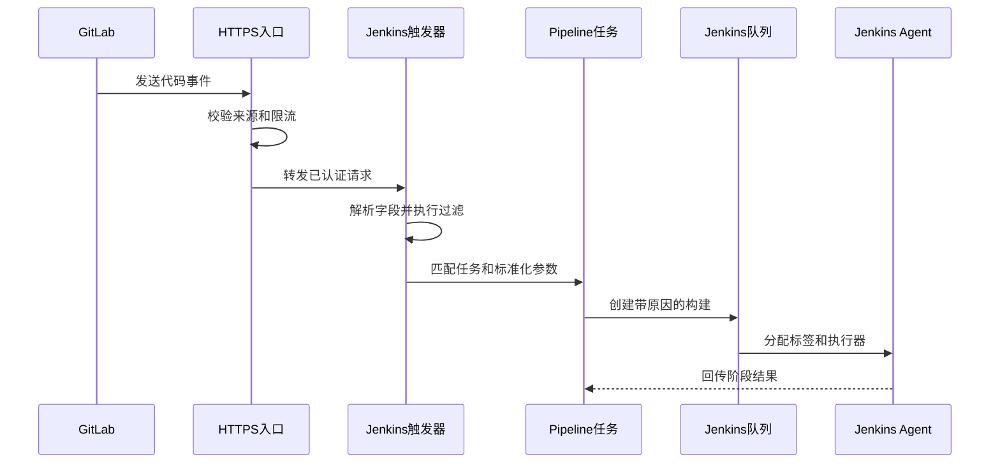

链路中每一层有不同职责：

| 层次 | 核心职责 | 失败时的直接证据 |
| --- | --- | --- |
| GitLab | 产生 Push、Tag 或 Merge Request 事件 | Recent events 中没有投递记录 |
| HTTPS 入口 | TLS、路由、来源限制、限流和访问日志 | 连接失败、TLS 错误或网关状态码 |
| Jenkins 触发器 | 认证、字段提取、过滤和任务匹配 | Jenkins 系统日志中的拒绝原因 |
| Pipeline 任务 | 参数校验、构建原因和阶段编排 | 构建未创建或初始化阶段失败 |
| 队列 | 等待节点标签、资源和并发锁 | Queue reason 长时间不变 |
| Agent | Checkout、构建、测试和发布 | Agent 日志与具体 Stage 日志 |

#### Push、Tag 与 Merge Request 的语义

- **Push** 表示某个引用发生更新。分支创建、普通提交和分支删除都可能产生 Push，因此必须检查 `before`、`after` 与 `ref`，不能只看事件名称。
- **Tag Push** 表示标签创建或删除。只有组织把受保护标签定义为发布入口时，才能用它触发制品发布；流水线还需验证标签指向的 Commit 和命名格式。
- **Merge Request** 表示评审对象发生变化。创建、更新、批准、合并等动作语义不同，接收方要检查 action 和目标分支，避免每次评论或无关更新都触发重构建。

#### Generic Webhook 与专用 SCM 集成

| 方案 | 优势 | 代价 | 适合场景 |
| --- | --- | --- | --- |
| Generic Webhook Trigger | 能从 Header、Query 和 JSON Body 自定义提取字段 | 过滤、认证、去重和字段兼容由平台团队维护 | 多种事件源需要统一入口 |
| GitLab 等专用集成 | 分支发现、提交状态和 MR 语义更完整 | 依赖插件版本与平台 API 兼容 | Multibranch Pipeline 与标准 GitLab 工作流 |
| 中间事件服务 | 可统一验签、重放、限流和路由 | 多一个需要高可用与审计的服务 | 大规模、多租户交付平台 |

选择时先问“需要哪些事件语义和审计能力”，而不是先问“哪个插件安装最方便”。无论哪种方式，公开入口都只负责触发，不应直接把未经校验的 Payload 变成 Shell 参数。

### 如何安全地解析和过滤事件

Webhook 是一个外部输入接口。即便 URL 不公开，只要发送方账号、Token、DNS 或网络边界被突破，攻击者就可能尝试触发高权限任务。因此认证、完整性校验、字段白名单和重放控制必须早于业务处理。

#### 三类输入来源

| 来源 | 常见内容 | 使用原则 |
| --- | --- | --- |
| Header | 事件类型、投递 ID、签名或旧式 Secret Token | 名称按平台文档处理，日志只记录是否通过校验 |
| Query | 兼容旧系统的路由参数 | 不放 Token；网关和浏览器历史容易记录 URL |
| JSON Body | 仓库、引用、Commit、操作者和事件动作 | 用 JSONPath 精确取值，再做格式和集合校验 |

新的 GitLab Webhook 优先使用 Signing Token 验证 HMAC 签名和 Payload 完整性；兼容旧版本时可能仍使用 `X-Gitlab-Token`。无论哪种机制，都应启用 HTTPS，限制可访问入口的网络范围，并把 Token 存在 Jenkins Credentials 或前置网关秘密存储中。

#### 推荐的接收顺序

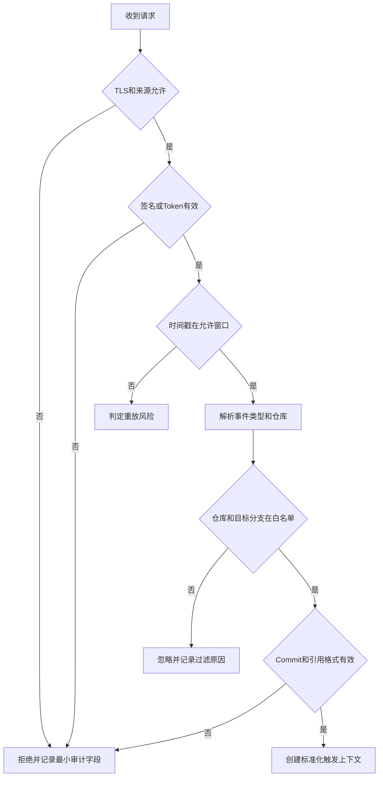

#### 过滤分支创建、删除与普通提交

Git 的空对象 ID 通常表现为全零 SHA。对 Push 事件可以采用以下判断：

| `before` | `after` | 含义 | 默认处理 |
| --- | --- | --- | --- |
| 全零 | 非全零 | 创建分支或标签 | 按明确策略处理，默认不发布 |
| 非全零 | 全零 | 删除分支或标签 | 不 Checkout，不触发构建 |
| 非全零 | 非全零 | 普通更新或强制推送 | 校验 ref、Commit 和项目后触发 |

正则只能作为第一层过滤，关键条件要在 Pipeline 初始化阶段再次验证。分支名、仓库 URL 和版本号必须满足白名单格式；不要把事件传入的仓库 URL 直接交给 `checkout`，应通过项目 ID 映射到平台维护的可信仓库配置。

```groovy
stage('Validate Trigger') {
    steps {
        script {
            if (!(env.TRIGGER_REPO ==~ /platform\/[a-z0-9-]+/)) {
                error 'repository is not allowed'
            }
            if (!(env.TRIGGER_SHA ==~ /[0-9a-f]{40,64}/)) {
                error 'commit sha is invalid'
            }
            if (!(env.TRIGGER_REF ==~ /refs\/heads\/(main|release\/[a-z0-9._-]+)/)) {
                error 'branch is not allowed'
            }
        }
    }
}
```

#### 日志最小化

允许记录事件类型、投递 ID、项目 ID、仓库规范名、短 Commit、目标分支、过滤结果和 Jenkins 构建号。不要记录完整 Payload、签名、Token、用户邮箱、私有仓库 URL 或可能包含提交内容的自由文本。排障需要原始 Payload 时，应由发送方的受控投递记录提供，并设置短期访问与保留策略。

### 如何统一自动触发与手动触发

自动事件和人工操作应进入同一条 Pipeline，但必须先转换成统一的触发上下文。不能用一个宽泛的 `try/catch` 吞掉字段缺失，再悄悄使用不明确的默认值；这会把配置错误伪装成手动触发。

#### 统一触发上下文

| 字段 | 自动触发来源 | 手动触发来源 | 必填性 |
| --- | --- | --- | --- |
| `repository` | 可信项目 ID 映射 | 受限选项参数 | 必填 |
| `ref` | 事件引用 | 校验后的分支或标签参数 | 必填 |
| `commitSha` | 事件 `after` 或 MR SHA | Checkout 后解析并回填 | 最迟 Checkout 后必填 |
| `operator` | 事件操作者 ID | Jenkins 当前用户 | 必填 |
| `reason` | `push`、`tag`、`merge_request` | 变更单或人工原因 | 必填 |
| `deliveryId` | Webhook 投递 ID | `manual-构建号` | 必填 |

优先级应固定为：经过认证的事件字段优先于 UI 默认值；人工触发只能读取显式参数；仓库中的配置只能补充项目内部属性，不能覆盖操作者与触发原因。

```groovy
stage('Resolve Trigger') {
    steps {
        script {
            boolean webhook = env.WEBHOOK_DELIVERY_ID?.trim()
            env.TRIGGER_KIND = webhook ? 'webhook' : 'manual'
            env.TRIGGER_REF = webhook ? env.EVENT_REF : params.GIT_REF.trim()
            env.TRIGGER_REASON = webhook ? env.EVENT_NAME : params.CHANGE_REASON.trim()

            if (!env.TRIGGER_REF || !env.TRIGGER_REASON) {
                error 'trigger context is incomplete'
            }
            currentBuild.description = "${env.TRIGGER_KIND} ${env.TRIGGER_REF}"
        }
    }
}
```

人工参数使用 Choice、Boolean 或经过正则验证的 String，生产环境不能让用户自由输入任意仓库 URL、命令、主机或 Namespace。首次运行参数尚未初始化时，应明确失败并提示重新运行，不要把第一次失败当成可以忽略的正常状态。

### Webhook 不触发时如何排查

排障从发送端向执行端逐层推进，每一层拿到证据后再进入下一层。直接在 Jenkinsfile 加大量日志，既可能泄露 Payload，也无法解释请求是否到达 Jenkins。

#### 分层检查表

| 层次 | 检查内容 | 常见结果 | 下一步 |
| --- | --- | --- | --- |
| GitLab 事件 | 操作是否产生期望事件 | 没有投递 | 检查事件类型与项目配置 |
| 投递记录 | URL、时间、状态码、耗时 | 连接失败或超时 | 查 DNS、路由、防火墙和网关 |
| HTTP 响应 | 401、403、404、429、5xx | 认证或路由错误 | 按状态码定位，不重复提交代码 |
| Jenkins 日志 | Token、签名、JSONPath、正则 | 已接收但被过滤 | 对照脱敏字段与过滤表达式 |
| 任务状态 | 禁用、重命名、权限 | 未创建构建 | 检查任务匹配与触发器配置 |
| 队列 | 标签、执行器、锁、并发 | 已入队未运行 | 检查 Agent 和资源配额 |
| Agent | 在线状态、镜像、Workspace | 运行后失败 | 转入构建阶段排障 |

#### 状态码的方向性判断

- `401`：缺少或无法识别认证信息，检查 Header 是否到达以及凭据是否轮换。
- `403`：身份已识别但无权执行，或 CSRF、来源策略和签名校验拒绝请求。
- `404`：路径、Context Path、反向代理重写或任务端点错误。
- `429`：入口或插件触发限流，检查突发事件和重试退避。
- `5xx`：Jenkins、插件或前置网关内部失败，结合时间戳查服务端日志。

#### 安全地重放

优先使用 GitLab 受控的 Recent events 重发能力，因为它保留事件结构并形成审计记录。重放前确认原请求没有已经创建构建，避免重复发布；若接收端支持投递 ID 去重，应验证同一 ID 的处理结果。不要把生产 Payload 复制到个人 Postman 集合，也不要为了排障临时关闭 TLS 验证或来源限制。

#### 触发链上线检查清单

**发送方检查：**

- Webhook 只选择实际需要的事件，避免 Issue、评论等无关事件造成噪声。
- URL 使用 HTTPS，证书链由发送方信任，不关闭 SSL 验证。
- Signing Token 或 Secret Token 由密码生成器产生，并有所有者与轮换日期。
- 分支过滤规则与受保护分支、标签策略一致。
- Recent events 的保留期满足排障需要，但访问权限受控。

**入口检查：**

- 只暴露 Webhook 所需路径，不把整个 Jenkins 管理接口暴露到公网。
- 设置请求体大小、连接超时、速率限制和并发上限。
- 保留请求 ID、来源、状态码和耗时，不记录 Header 秘密与 Body。
- 反向代理不删除签名、事件类型、投递 ID 等必要 Header。
- Jenkins 不可用时返回明确 5xx，不用 200 接收后静默丢弃。

**Jenkins 检查：**

- Trigger Token 使用 Credentials 管理，不出现在 URL 查询参数和 Job 描述中。
- JSONPath 字段不存在时拒绝请求，不用空字符串继续 Checkout。
- 仓库、项目、ref、Commit 和事件动作均有白名单。
- 任务禁用、过滤拒绝和队列等待能产生不同审计结果。
- 相同投递 ID 的重复请求不会重复执行不可逆发布。

#### 最小审计记录示例

```json
{
  "receivedAt": "2026-08-28T09:15:30Z",
  "deliveryId": "masked-delivery-id",
  "event": "Push Hook",
  "projectId": 128,
  "repository": "platform/payment-api",
  "ref": "refs/heads/main",
  "commit": "01234567",
  "decision": "accepted",
  "jenkinsBuild": "payment-api/main/1842"
}
```

审计记录中的 Commit 可显示短值，但内部关联保留完整 SHA。若决策是 `rejected`，记录标准化原因码，例如 `signature_invalid`、`repository_denied`、`branch_create_ignored`，不要把原始 Token 或 Payload 填进错误信息。

## 第二章：建立可复用的流水线工程

### 项目标准化先统一哪些契约

共享库不能替代项目标准化。如果每个仓库的构建入口、产物目录、版本规则和报告格式都不同，共享库最终只能堆积项目名判断。标准化的目标不是强迫所有语言使用同一命令，而是让不同实现遵守同一输入输出契约。

#### 仓库与构建契约

| 契约 | 推荐约定 | 验收证据 |
| --- | --- | --- |
| 构建入口 | Wrapper 或仓库内脚本，如 `./mvnw`、`./gradlew`、`make ci` | 新 Agent 无全局工具也能启动 |
| 依赖锁定 | 锁文件、校验和、固定构建镜像 | 重跑同一 Commit 可复现 |
| 输出目录 | 明确二进制、前端包、镜像元数据位置 | Pipeline 不扫描整个 Workspace 猜产物 |
| 测试报告 | JUnit XML 或平台约定格式 | Jenkins 能发布趋势与失败详情 |
| 覆盖率 | 语言工具生成、SonarQube 等消费 | 报告在扫描前已经存在 |
| 制品元数据 | 名称、版本、Commit、摘要、构建号 | 可从制品反查源码和流水线 |
| 健康检查 | 机器可判断的存活与就绪接口 | 发布验证无需解析人工页面 |

#### 领域名称不要互相推导

应用名、业务名、环境名、制品坐标和 Jenkins Job 名称应分别建模。Job 移入 Folder 或重命名时，不应改变制品路径和 Kubernetes 资源名。推荐把稳定信息放在受评审的项目配置中，把环境权限放在平台侧策略中。

```yaml
application: payment-api
businessUnit: commerce
build:
  type: go
  entrypoint: make ci
  artifact: dist/payment-api
quality:
  report: reports/junit.xml
delivery:
  artifactType: oci-image
  healthPath: /readyz
```

配置文件仍是不可信仓库输入。共享库需要用 Schema 校验允许字段，拒绝未知环境、绝对路径、Shell 片段和任意凭据 ID。

### Jenkinsfile 和共享库如何分工

Jenkinsfile 是项目的交付声明，应该让项目维护者看见阶段、条件和关键选择；共享库是平台能力实现，封装稳定、重复且需要集中治理的逻辑。两者的边界应让故障容易定位，而不是追求 Jenkinsfile 行数最少。

#### 推荐职责表

| Jenkinsfile 保留 | 共享库封装 |
| --- | --- |
| 项目使用哪类构建流程 | 报告发布、凭据绑定和错误归一化 |
| 哪些阶段启用及其顺序 | 标准 Checkout、制品上传与摘要校验 |
| 项目特有的测试与条件 | SonarQube 等平台集成 |
| 发布目标的逻辑名称 | 审批、锁、审计和通知基础能力 |
| 共享库固定版本 | 不同语言适配器的统一接口 |

```groovy
@Library('delivery-lib@v3.4.1') _

pipeline {
    agent none
    stages {
        stage('CI') {
            steps {
                platformCI(
                    buildType: 'go',
                    command: 'make ci',
                    artifact: 'dist/payment-api'
                )
            }
        }
    }
}
```

`platformCI` 可以组织稳定的校验和报告动作，但不应通过项目名字符串暗中决定是否发布生产。避免 `runEverything(Map config)` 这样的巨型万能函数：参数组合越多，契约越难测试，日志也越难说明失败发生在哪个能力内。

#### 失败契约

共享库必须明确哪些情况抛出错误、哪些设置 `UNSTABLE`、哪些返回结构化结果。不要捕获所有异常后只发一封邮件并返回成功；上层 Pipeline、监控和调用方需要准确构建状态。

### 如何设计和测试共享库

#### 目录职责

```text
.
├── vars/
│   ├── platformCI.groovy
│   └── platformCI.txt
├── src/org/example/delivery/
│   ├── ArtifactMetadata.groovy
│   └── Validation.groovy
├── resources/org/example/delivery/
│   └── schemas/project.schema.json
└── test/
    ├── unit/
    └── contract/
```

- `vars/` 是 Jenkinsfile 面向的薄接口，负责参数默认值、阶段展示和错误转换。
- `src/` 保存可独立测试的领域逻辑，避免到处依赖隐式全局变量。
- `resources/` 保存模板与 Schema，不能保存 Token、环境密码或可变业务状态。

#### 一个可测试的输入契约

```groovy
class BuildRequest implements Serializable {
    String buildType
    String command
    String artifact

    void validate() {
        if (!(buildType in ['maven', 'gradle', 'go', 'npm'])) {
            throw new IllegalArgumentException('unsupported build type')
        }
        if (!artifact || artifact.startsWith('/') || artifact.contains('..')) {
            throw new IllegalArgumentException('artifact path must stay in workspace')
        }
    }
}
```

测试分四层：

1. **单元测试**：纯 Groovy 的校验、版本解析、路径和元数据逻辑。
2. **Pipeline 单元测试**：模拟 Step，验证调用顺序、参数和失败状态。
3. **契约测试**：用最小示例仓库验证 Maven、Gradle、Go、npm 的输入输出一致。
4. **试点任务**：在隔离 Folder 使用候选标签运行真实 Jenkins，再验证日志、凭据作用域与重启恢复。

#### 版本与灰度升级

生产 Jenkinsfile 引用受保护标签或 Commit。共享库发布新版本时生成变更说明，列出兼容性、最低 Jenkins 与插件要求、迁移步骤和回退版本。先让少量试点任务显式升级，观察成功率与耗时，再批量更新其他仓库。

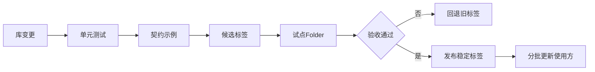

受信任共享库能调用 Jenkins 内部 API 并绕过 Sandbox。仓库写权限、发布标签权限和 Jenkins 配置权限必须分离；每次发布应能关联评审记录。回退依赖上一版本仍然可获取，因此不要删除已经被生产任务引用的稳定标签。

#### 共享库接口设计示例

下面的 `vars/platformCI.groovy` 只负责公开稳定入口，把输入校验和阶段细节交给内部类：

```groovy
import org.example.delivery.BuildRequest

def call(Map raw = [:]) {
    BuildRequest request = new BuildRequest(
        buildType: raw.buildType as String,
        command: raw.command as String,
        artifact: raw.artifact as String
    )
    request.validate()

    stage('Validate') {
        echo "buildType=${request.buildType} artifact=${request.artifact}"
    }
    stage('Build') {
        timeout(time: 30, unit: 'MINUTES') {
            sh request.command
        }
    }
    stage('Reports') {
        junit testResults: 'reports/**/*.xml'
    }
    stage('Package') {
        if (!fileExists(request.artifact)) {
            error "artifact does not exist: ${request.artifact}"
        }
    }
}
```

接口评审逐项回答：

| 问题 | 合格答案 |
| --- | --- |
| 输入是否有类型和允许集合 | 缺失、未知和越权值立即失败 |
| 默认值是否安全 | 默认不发布生产、不跳过质量、不扩大权限 |
| 日志是否可定位 | 显示阶段、对象和原因码，不显示秘密 |
| 外部动作是否可重试 | 读操作可重试，写操作要求幂等或先查询 |
| 异常是否保留语义 | 认证、网络、质量、制品冲突有不同错误 |
| 是否支持取消 | 超时、Abort 和 Agent 中断能停止子进程 |
| 是否能回退 | 上一稳定库标签仍可获取并通过契约测试 |

#### 共享库变更分级

- **Patch**：日志修正、兼容性 Bug 修复，不改变公开输入输出。
- **Minor**：新增可选能力或字段，旧 Jenkinsfile 无需修改。
- **Major**：删除参数、改变默认值、阶段状态或权限需求，必须提供迁移窗口。
- **Emergency**：安全撤销或外部 API 突变，仍需评审、试点和明确回退，不能直接改动可变主分支影响全部任务。

库的版本号只是沟通工具，真正的不可变身份仍是 Git Commit。发布标签应受保护，流水线记录标签和解析后的 Commit，防止标签被移动后无法复现。

## 第三章：设计标准化 CI 流水线

### 一条 CI 流水线应有哪些阶段

CI 的职责是把一个确定的源码版本转换为经过测试、质量判断和完整性校验的不可变制品。每个阶段必须有明确输入、输出和停止条件，这样失败时才能判断是否允许重试，以及是否已经产生需要清理的外部状态。

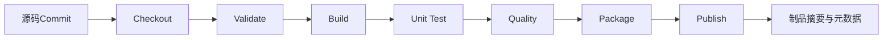

| 阶段 | 输入 | 输出 | 失败条件 |
| --- | --- | --- | --- |
| Checkout | 可信仓库与 Commit SHA | 干净源码树 | SHA 不存在、签出结果不一致 |
| Validate | 项目配置、锁文件、工具版本 | 可执行构建计划 | Schema、版本或策略不满足 |
| Build | 源码与锁定依赖 | 编译输出 | 编译失败或生成非预期文件 |
| Unit Test | 编译输出与测试 | 测试报告、覆盖率 | 测试失败、报告缺失 |
| Quality | 源码、覆盖率、Commit | Quality Gate 结果 | 门禁失败、等待超时 |
| Package | 已验证输出 | 版本化包或镜像 | 文件不唯一、元数据缺失 |
| Publish | 制品、摘要、最小权限身份 | 不可变制品坐标 | 同版本已存在、上传或校验失败 |

Pipeline 最好在 `agent none` 下按阶段分配执行环境，避免审批和 Quality Gate 等待占用 Agent。任何 Publish 前的失败都不能产生“可发布”标记；Publish 后通知失败不应删除已经成功上传的制品，而应把通知作为独立可重试动作。

### 如何适配 Maven、Gradle、Go 和 npm

适配器统一的是结果，不是强行统一命令。每种语言都优先使用仓库内 Wrapper、锁文件和固定构建镜像，让 Agent 只提供容器运行或基础执行能力。

| 构建类型 | 推荐入口 | 锁定依据 | 典型报告 | 典型产物 |
| --- | --- | --- | --- | --- |
| Maven | `./mvnw --batch-mode verify` | Wrapper、`pom.xml` 与依赖校验 | Surefire/Failsafe XML | JAR、WAR |
| Gradle | `./gradlew --no-daemon build` | Wrapper、依赖锁定 | `build/test-results` | JAR、分发包 |
| Go | `go test` 与 `go build` 的仓库脚本 | `go.mod`、`go.sum` | 转换后的 JUnit XML | 单一二进制 |
| npm | `npm ci` 与 `npm test` | `package-lock.json` | Jest 等 JUnit 输出 | `dist` 压缩包 |

```groovy
def commands = [
    maven: './mvnw --batch-mode clean verify',
    gradle: './gradlew --no-daemon clean build',
    go: './ci/build.sh',
    npm: 'npm ci && npm run test:ci && npm run build'
]

if (!commands.containsKey(params.BUILD_TYPE)) {
    error 'unsupported build type'
}
sh commands[params.BUILD_TYPE]
```

这段 Map 必须由共享库维护，不能让仓库参数直接提供任意 Shell。构建镜像应固定版本或摘要，并记录镜像摘要到构建元数据。Wrapper 本身也属于源码供应链的一部分，升级需要评审。

#### 缓存不是制品

依赖缓存用于降低下载耗时，随时可以删除；制品则必须可验证、可晋级和按策略保留。不同信任级别的任务不要共享可写缓存，避免外部 Pull Request 污染生产分支依赖。缓存命中异常时应能禁用缓存重跑，以区分源码问题和缓存问题。

### 如何控制超时、重试、并发和清理

控制项应在 Pipeline 开始时明确，不能等任务挂住后由管理员手工终止。

```groovy
pipeline {
    agent none
    options {
        timeout(time: 45, unit: 'MINUTES')
        disableConcurrentBuilds(abortPrevious: true)
        buildDiscarder(logRotator(numToKeepStr: '30', artifactNumToKeepStr: '10'))
        timestamps()
        skipDefaultCheckout(true)
    }
    stages {
        stage('Build') {
            agent { label 'linux-build' }
            steps {
                retry(2) {
                    sh './ci/fetch-transient-dependencies.sh'
                }
                sh './ci/build.sh'
            }
        }
    }
    post {
        always {
            junit allowEmptyResults: false, testResults: 'reports/**/*.xml'
            deleteDir()
        }
    }
}
```

只重试连接重置、限流后退避、临时 DNS 或远端 5xx 等瞬时错误。编译失败、测试断言、401、403、参数错误、质量门禁失败和制品版本冲突都不应自动重试。重试包含外部写操作时，接口必须幂等或携带幂等键。

并发策略按共享状态选择：普通分支 CI 可以并行；同一环境发布、数据库迁移或同一正式版本 Publish 必须加锁。`abortPrevious` 适合快速反馈分支，但不能用在已经开始生产变更的 CD 流水线。

清理至少包括 Workspace、临时凭据文件、容器登录状态、临时容器和动态 Agent 残留。清理失败应记录为可观测事件，不能因为主任务成功就永久忽略磁盘增长。

### 如何建立构建可追溯性

每个制品都应回答“谁、为何、用什么源码和环境构建、经过什么质量判断”。邮件和聊天通知只是视图，不是唯一审计记录。

#### 最小追溯字段

```json
{
  "application": "payment-api",
  "version": "1.8.0-rc.2",
  "commitSha": "0123456789abcdef0123456789abcdef01234567",
  "pipeline": "delivery-lib@v3.4.1",
  "buildNumber": "1842",
  "builderImageDigest": "sha256:placeholder",
  "artifactDigest": "sha256:placeholder",
  "qualityGate": "OK",
  "triggerKind": "merge_request"
}
```

元数据与制品一起上传，且由平台产生的字段不能被项目自由覆盖。构建描述只显示短 Commit、分支和版本，详细链接指向代码提交、质量结果和制品坐标。

```groovy
stage('Record') {
    steps {
        script {
            currentBuild.description = "${env.VERSION} ${env.GIT_COMMIT.take(8)}"
        }
        fingerprint targets: 'dist/*', recordBuildArtifacts: true
        archiveArtifacts artifacts: 'metadata/build.json', fingerprint: true
    }
}
```

Jenkins Fingerprint 可帮助关联构建与文件，但跨系统追溯仍应以制品库摘要和结构化元数据为核心。构建日志需要统一时间戳并保留阶段边界；不要只保留一封成功邮件，因为邮件无法可靠表达制品是否后来被撤销或晋级。

#### 一条端到端 CI Jenkinsfile

下面示例强调阶段输入输出和失败边界，具体构建命令由项目脚本实现：

```groovy
@Library('delivery-lib@v3.4.1') _

pipeline {
    agent none

    parameters {
        choice(
            name: 'BUILD_TYPE',
            choices: ['maven', 'gradle', 'go', 'npm'],
            description: '项目构建适配器'
        )
    }

    options {
        timeout(time: 50, unit: 'MINUTES')
        disableConcurrentBuilds(abortPrevious: true)
        buildDiscarder(logRotator(numToKeepStr: '40'))
        skipDefaultCheckout(true)
        timestamps()
    }

    stages {
        stage('Checkout') {
            agent { label 'linux-build' }
            steps {
                deleteDir()
                checkout scm
                script {
                    env.SOURCE_SHA = sh(
                        script: 'git rev-parse HEAD',
                        returnStdout: true
                    ).trim()
                    if (!(env.SOURCE_SHA ==~ /[0-9a-f]{40}/)) {
                        error 'cannot resolve source commit'
                    }
                }
                stash name: 'source', includes: '**', useDefaultExcludes: false
            }
        }

        stage('Validate') {
            agent { label 'linux-build' }
            steps {
                deleteDir()
                unstash 'source'
                sh './ci/validate.sh'
            }
        }

        stage('Build and Test') {
            agent { label "build-${params.BUILD_TYPE}" }
            steps {
                deleteDir()
                unstash 'source'
                sh './ci/build.sh'
                junit testResults: 'reports/**/*.xml'
                stash name: 'build-output', includes: 'dist/**,reports/**'
            }
        }

        stage('Quality') {
            agent { label 'linux-build' }
            steps {
                deleteDir()
                unstash 'source'
                unstash 'build-output'
                withSonarQubeEnv('sonarqube-prod') {
                    sh './ci/analyze.sh'
                }
            }
        }

        stage('Quality Gate') {
            agent none
            steps {
                timeout(time: 20, unit: 'MINUTES') {
                    waitForQualityGate abortPipeline: true,
                        webhookSecretId: 'sonarqube-webhook-secret'
                }
            }
        }

        stage('Package') {
            agent { label 'linux-build' }
            steps {
                deleteDir()
                unstash 'build-output'
                sh './ci/package.sh'
                sh 'sha256sum dist/* > metadata/SHA256SUMS'
                stash name: 'release-bundle', includes: 'dist/**,metadata/**'
            }
        }

        stage('Publish') {
            agent { label 'artifact-publisher' }
            steps {
                deleteDir()
                unstash 'release-bundle'
                withCredentials([usernamePassword(
                    credentialsId: 'nexus-release-writer',
                    usernameVariable: 'REPO_USER',
                    passwordVariable: 'REPO_PASSWORD'
                )]) {
                    sh './ci/publish.sh'
                }
            }
        }
    }

    post {
        always {
            script {
                currentBuild.description = env.SOURCE_SHA ?
                    "${env.SOURCE_SHA.take(8)} ${params.BUILD_TYPE}" :
                    params.BUILD_TYPE
            }
        }
        unsuccessful {
            echo 'See the failed stage and standardized reason code'
        }
        cleanup {
            deleteDir()
        }
    }
}
```

`stash` 适合一次 Pipeline 内的小规模传递，不应成为大制品库。大型编译结果可在临时对象存储中使用构建范围凭据传递，最终发布仍进入正式制品库。Pipeline 中每次 `deleteDir()` 都限定在 Agent Workspace，不删除共享目录。

## 第四章：把质量门禁纳入流水线

### SonarQube 在流水线中承担什么职责

SonarQube 负责接收扫描报告、执行服务端分析、保存结果并计算 Quality Gate；Jenkins 负责准备源码与覆盖率、触发 Scanner、等待结果，并根据组织策略决定是否阻断。两者之间是异步任务，不是 Scanner 命令返回零就代表门禁通过。

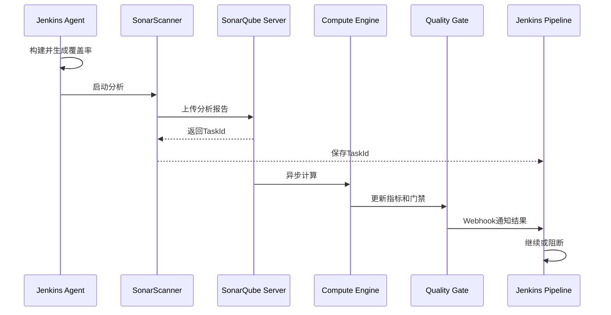

Scanner 不应持有管理员 Token。为 Jenkins 建立最小权限分析身份，把 Token 放在 Jenkins Credentials 中，并限制它能分析的项目。SonarQube 数据库和搜索组件的运行维护属于 SonarQube 平台职责，Jenkins 只消费稳定接口。

### 如何让 Quality Gate 真正阻断交付

扫描阶段必须使用 Jenkins 中配置的 SonarQube 安装，让插件把 Compute Engine Task ID 关联到当前 Pipeline。随后在不占用 Agent 的 Stage 中等待 Webhook。

```groovy
stage('Analysis') {
    agent { label 'linux-build' }
    steps {
        withSonarQubeEnv('sonarqube-prod') {
            sh './mvnw --batch-mode verify sonar:sonar'
        }
    }
}

stage('Quality Gate') {
    agent none
    steps {
        timeout(time: 20, unit: 'MINUTES') {
            waitForQualityGate abortPipeline: true,
                               webhookSecretId: 'sonarqube-webhook-secret'
        }
    }
}
```

SonarQube Webhook 指向 Jenkins 的专用端点，并配置共享 Secret 验证 Payload。等待必须有超时；服务不可用、Webhook 丢失和门禁失败是三种不同结果，应在日志和告警中区分。

#### 失败策略

| 情况 | CI 状态 | 是否允许 Publish |
| --- | --- | --- |
| Quality Gate 失败 | `FAILURE` | 否 |
| 分析服务不可用 | 默认 `FAILURE` | 否，除非受控应急例外 |
| 等待超时 | `FAILURE` | 否 |
| Scanner 配置错误 | `FAILURE` | 否 |
| 显式审批的跳过 | 标记例外并审计 | 仅按组织策略决定 |

“跳过扫描”不能是任何构建者都能修改的 Boolean 参数。例外应要求特定权限、原因、有效期和审批记录，并在制品元数据中标记质量状态未知；生产策略可以直接拒绝这类制品。

### 如何处理覆盖率、分支和提交关联

覆盖率是测试工具生成的事实，SonarQube 负责读取报告而不是替 Jenkins 运行测试。因此阶段顺序必须是测试在前、扫描在后；报告路径错误应失败，而不是把零覆盖率误解释为代码没有测试。

| 分析对象 | 目的 | 关键关联 |
| --- | --- | --- |
| 主分支 | 建立长期质量基线 | 主分支名、Commit SHA |
| 短期分支 | 在合并前发现新增问题 | 分支名、目标基线、Commit SHA |
| Merge Request | 评估变更集并回写状态 | MR 编号、源分支、目标分支、Head SHA |

分支与 Pull Request 分析能力可能受 SonarQube 版本和 Edition 影响，落地前需要按当前官方文档核对。不要通过安装未经评估的社区插件来假装拥有同等语义。

```bash
./mvnw --batch-mode clean verify
test -f target/site/jacoco/jacoco.xml
./mvnw --batch-mode sonar:sonar \
  -Dsonar.projectKey=payment-api \
  -Dsonar.scm.revision="$GIT_COMMIT"
```

质量结果、Jenkins 构建和制品元数据必须引用同一个完整 Commit SHA。若 Pipeline 在分析后再次 Checkout 可变分支，后续打包内容可能与门禁对象不同；正确做法是从开始到 Publish 始终使用同一 SHA，并在 Publish 前再次核对工作树与元数据。

#### Quality Gate 排障手册

| 现象 | 证据 | 判断 | 动作 |
| --- | --- | --- | --- |
| Scanner 立即失败 | Agent 日志无 Task ID | 本地配置、网络或认证错误 | 修复后重新构建 |
| Scanner 成功但一直等待 | 有 Task ID，无 Webhook | 回调 URL、Secret 或网络问题 | 查 SonarQube Webhook 记录 |
| Webhook 返回 404 | SonarQube 投递状态 | Jenkins Context Path 或端点错误 | 修正 URL，保留末尾斜线要求 |
| Webhook 返回 401 或 403 | Jenkins 与 SonarQube 日志 | Secret 不一致或入口策略拒绝 | 轮换并验证 Secret |
| Compute Engine 长时间排队 | SonarQube 后台任务 | 质量平台容量或任务阻塞 | 由质量平台处理，不占 Agent |
| Gate 失败 | 具体失败条件 | 代码质量未达策略 | 修复代码或走审计例外 |
| 报告覆盖率为零 | 报告路径与测试日志 | 报告未生成或扫描路径错误 | 先修测试报告链路 |
| Commit 对不上 | 分析结果 SHA 与构建 SHA | 分析后又签出其他引用 | 固定同一 Commit 重跑 |

例外审批至少记录应用、Commit、制品摘要、失败条件、业务理由、批准人、到期时间和补救任务。过期后平台应自动阻止同类例外继续晋级，不能把临时跳过变成永久默认。

## 第五章：制品是 CI 与 CD 的边界

### 为什么 CI 与 CD 之间必须交付不可变制品

CI 结束时交付的是已经通过测试和质量策略的制品，而不是“某个以后还能重新构建的分支”。CD 只选择这个制品并把它部署到不同环境，这就是 Build once deploy many。

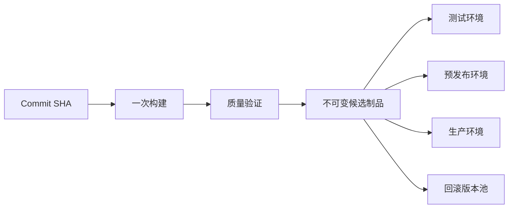

如果每个环境重新编译，即使源码标签相同，依赖解析、构建镜像、时间戳和工具版本也可能不同，测试环境验证的就不是生产实际运行的字节。不可变性要求同一坐标不能覆盖，部署记录使用摘要确认内容。

#### 制品身份

| 字段 | 示例语义 | 作用 |
| --- | --- | --- |
| 应用 | `payment-api` | 稳定业务组件名 |
| 版本 | `1.8.0-rc.2` | 人可读候选版本 |
| 摘要 | `sha256:...` | 内容身份与校验依据 |
| Commit | 完整 SHA | 反查源码 |
| Build | Jenkins Job 与编号 | 反查构建日志 |
| Provenance | 构建器与输入声明 | 供应链验证 |
| Quality | 门禁结果和链接 | 说明为何允许晋级 |

版本用于选择，摘要用于证明内容。容器镜像即使保留标签，也应在发布声明中使用 Digest；二进制包下载后先验证服务端记录的校验和再部署。

### Nexus 和 Harbor 分别管理什么

Nexus Repository 可管理 Maven、npm、raw 等多种包格式，并以 hosted、proxy、group 仓库承担内部发布、外部代理和统一读取入口。Harbor 面向 OCI Artifact，常用于容器镜像及 OCI 化 Chart，提供项目、Robot Account、复制、扫描、保留和不可变标签等能力。

| 制品 | 推荐存储 | 关键治理 |
| --- | --- | --- |
| Maven 包 | Nexus Maven hosted | 禁止正式版本重复部署 |
| 前端压缩包 | Nexus raw hosted | 路径规范、摘要和内容类型 |
| 通用二进制 | Nexus raw 或专用包格式 | 版本坐标、校验和、保留 |
| 容器镜像 | Harbor | 私有项目、Robot Account、Digest、不可变规则 |
| Helm Chart | OCI Registry 或受治理 Chart 仓库 | Chart 版本、签名和依赖锁定 |

Jenkins 使用专用服务身份：Nexus 账号只允许上传指定 hosted 仓库或读取候选仓库；Harbor 优先项目级 Robot Account，将 push 和 pull 权限分离。不要用平台管理员账号，也不要让所有项目共享一个全局 Registry 密码。

#### 不可用时怎么失败

- Publish 前仓库不可用：CI 失败，不在本地 Workspace 假装发布成功。
- 上传响应不确定：先按坐标和摘要查询，再决定是否幂等重试。
- CD 下载失败：停止发布，保留当前运行版本，不从临时共享目录取代。
- 扫描或元数据接口不可用：按策略阻断晋级，不把“未知”当“通过”。

### 如何执行制品发布和晋级

发布由上传、服务端确认、摘要校验和元数据登记组成。HTTP 2xx 只能说明请求完成，不能单独证明坐标正确和内容可用。

```bash
set -euo pipefail

artifact='dist/payment-api'
checksum_file='dist/payment-api.sha256'
sha256sum "$artifact" > "$checksum_file"

curl --fail --show-error --silent \
  --connect-timeout 5 \
  --max-time 120 \
  --user "$NEXUS_USER:$NEXUS_PASSWORD" \
  --upload-file "$artifact" \
  "https://repo.example.com/repository/releases/payment-api/1.8.0/payment-api"
```

示例中的凭据由 `withCredentials` 注入，Shell 展开变量；不要在 Groovy 双引号中拼接。上传后重新查询远端摘要，与本地摘要一致才生成 Publish 成功记录。

#### 候选到正式的晋级

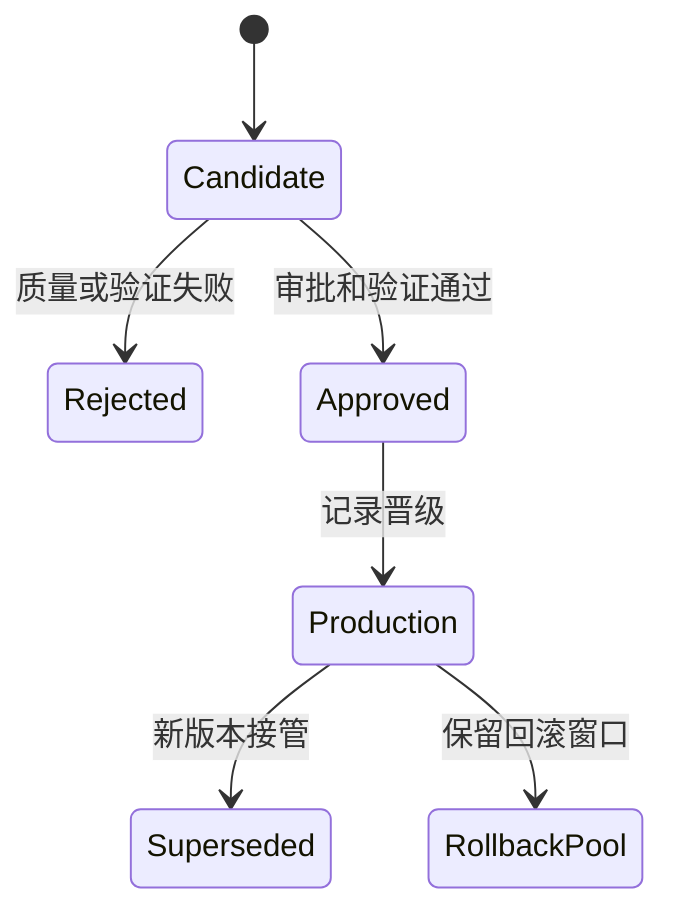

晋级移动或复制已验证制品的引用，不触发重新编译。对镜像可把经过验证的 Digest 写入生产声明，标签只是辅助视图；对包可从候选仓库提升到禁止覆盖的 Release 仓库，并保留原始摘要。

清理策略必须晚于最大回滚窗口和审计保留期。清理时保护当前生产、上一个稳定版本、正在审批的候选和事故调查涉及的制品。制品被发现存在严重漏洞时，标记撤销并阻止新部署，同时保留必要证据，不能简单删除后失去追溯。

#### 制品发布验收清单

发布前：

- 版本来自受控规则，不能由 Job 名称字符串隐式截取。
- Commit SHA、质量结果和构建器镜像摘要已经固定。
- 目标仓库是 hosted 或正式 Registry 项目，不是 proxy 缓存。
- 写入身份只拥有目标路径或项目的 push 权限。
- 正式版本不可覆盖规则已经在服务端启用。

发布中：

- 请求设置连接超时和总超时。
- 不在命令行、日志和错误消息中显示密码。
- 大文件上传失败区分“服务端未收到”和“响应丢失”。
- 每个文件计算本地摘要并保存结构化清单。
- 同一版本冲突立即失败，不用自动删除旧内容。

发布后：

- 通过服务端 API 查询坐标、大小、摘要和创建时间。
- 用只读发布身份执行一次下载或 Manifest 查询。
- 把正式 URL 或 Digest 写入构建元数据。
- 标记候选、批准、撤销等生命周期状态。
- 将保留与清理策略关联生产和回滚引用。

#### 容器镜像发布示例

```groovy
stage('Publish Image') {
    agent { label 'isolated-image-builder' }
    steps {
        withCredentials([usernamePassword(
            credentialsId: 'harbor-payment-pusher',
            usernameVariable: 'REGISTRY_USER',
            passwordVariable: 'REGISTRY_PASSWORD'
        )]) {
            sh '''
              set -euo pipefail
              set +x
              printf '%s' "$REGISTRY_PASSWORD" | \
                docker login registry.example.com \
                  --username "$REGISTRY_USER" --password-stdin

              image="registry.example.com/payment/payment-api:$VERSION"
              docker build --tag "$image" .
              docker push "$image"
              docker inspect --format='{{index .RepoDigests 0}}' "$image" \
                > metadata/image-digest.txt
              docker logout registry.example.com
            '''
        }
    }
}
```

示例用于表达凭据和摘要流程；生产镜像构建应根据环境评估 Docker Socket、特权容器和无守护进程构建器的风险。无论用哪种工具，构建身份与生产拉取身份分离，最终部署引用 `metadata/image-digest.txt` 中的 Digest。

#### 晋级记录示例

```yaml
application: payment-api
artifact:
  repository: registry.example.com/payment/payment-api
  version: 1.8.0
  digest: sha256:placeholder
source:
  commit: 0123456789abcdef0123456789abcdef01234567
quality:
  status: passed
  policy: production-default
promotion:
  from: candidate
  to: production
  approvedBy: release-approver-id
  changeId: CHG-2026-0001
```

晋级记录本身也应防篡改并可查询。若审批系统、制品库和 Jenkins 分属不同平台，用共同的制品 Digest 和变更 ID 关联，而不是依赖名称模糊匹配。

## 第六章：设计可回滚的 CD 流水线

### CD 流水线需要哪些控制面

CD 不是把部署命令放进 Jenkinsfile。它需要对环境、版本、审批、时间、并发、验证和记录建立控制面，并使用与 CI 不同的身份。CI 只能发布候选制品，CD 才能读取批准制品并操作目标环境。

#### 发布请求模型

| 字段 | 校验 |
| --- | --- |
| 应用 | 必须存在于平台目录，不能自由输入 |
| 环境 | 从授权集合选择，生产单独授权 |
| 版本与摘要 | 必须在制品库存在且质量状态允许 |
| 变更单 | 格式有效、状态和窗口满足策略 |
| 操作者 | 来自 Jenkins 身份，不由参数伪造 |
| 发布策略 | 应用和环境允许的策略集合 |
| 回滚目标 | 上一个已验证制品与配置快照 |

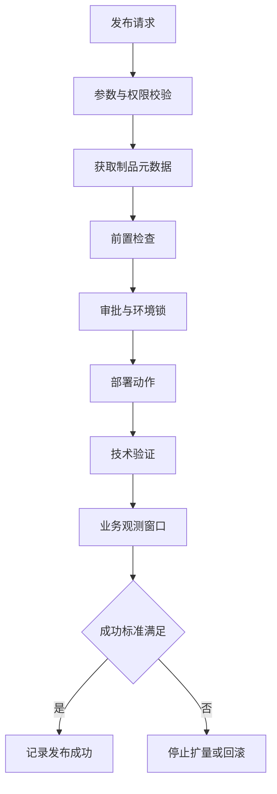

#### 一个受控 Pipeline 骨架

```groovy
pipeline {
    agent none
    options {
        timeout(time: 60, unit: 'MINUTES')
        disableConcurrentBuilds()
        timestamps()
    }
    stages {
        stage('Validate') {
            agent { label 'delivery-control' }
            steps { validateReleaseRequest() }
        }
        stage('Approve Production') {
            when { expression { params.ENVIRONMENT == 'production' } }
            steps {
                input message: "Deploy ${params.VERSION} to production",
                      submitter: 'production-approvers'
            }
        }
        stage('Deploy') {
            agent { label 'production-deployer' }
            options { lock resource: "payment-api-${params.ENVIRONMENT}" }
            steps { deployImmutableArtifact() }
        }
        stage('Verify') {
            agent { label 'delivery-control' }
            steps { verifyRelease() }
        }
    }
}
```

审批只说明谁允许继续，不证明部署安全。审批前应展示版本、摘要、变更、差异、风险、回滚目标和验证计划；批准者不能修改隐藏参数。等待审批不占用生产 Agent，也不持有容易过期的临时凭据。

### 如何选择滚动、蓝绿和灰度发布

| 策略 | 使用条件 | 额外容量 | 流量控制 | 主要回滚方式 |
| --- | --- | --- | --- | --- |
| 滚动 | 新旧版本可短期共存，兼容共享依赖 | 较低 | 由工作负载逐批替换 | 暂停、撤销或部署旧版本 |
| 蓝绿 | 能维护两套完整环境并原子切流 | 接近双份 | LB、Service 或路由切换 | 切回旧环境 |
| 灰度 | 有可靠分群、指标与逐步扩量能力 | 随灰度比例增加 | 权重、Header、Cookie 或用户分群 | 停止扩量并把流量归零 |

滚动发布成本低，但数据库和协议必须向前向后兼容；蓝绿回切快，但双环境数据写入和后台任务要防止并行冲突；灰度能降低爆炸半径，但如果没有业务指标和自动停止条件，只是把风险延长。

#### 灰度状态机

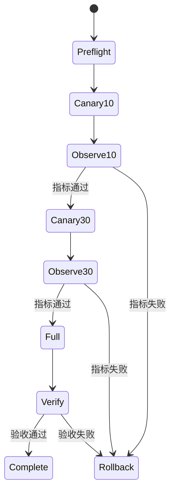

“部署命令成功”只说明控制面接受了请求。发布成功至少需要副本就绪、错误率、延迟、关键业务成功率和观测窗口通过。扩量条件应机器可判定，并把原始指标查询或结果链接写入发布记录。

#### 滚动发布 Runbook

**适用前提：**

- 应用支持新旧版本短期并存。
- 数据库与消息格式满足向前、向后兼容。
- Readiness 能阻止未准备实例接收流量。
- 资源配额允许 `maxSurge` 产生额外副本。
- 旧制品与配置在回滚窗口内仍可获取。

**执行步骤：**

1. 记录当前 Deployment Revision、镜像 Digest、副本和策略。
2. 校验新 Digest、变更单、质量结果和回滚目标。
3. 更新模板并观察第一个新 Pod 的调度、拉镜像和启动事件。
4. 等待 Readiness，通过合成请求验证实例能力。
5. 观察新旧副本变化、不可用数、错误率与延迟。
6. 等待 rollout 完成后进入业务观测窗口。
7. 验收通过才记录成功并释放环境锁。

**停止条件：**

- 新 Pod 无法在超时内 Ready。
- 可用副本低于服务 SLO 所需最小值。
- 错误率、延迟或资源饱和超过阈值。
- 日志出现兼容性、Schema 或协议错误。
- 指标查询为空或观测系统不可用。

**回滚注意：**

`rollout undo` 恢复 Pod Template，不会自动回滚数据库、外部配置和已发送消息。回滚后再次等待 Ready、执行合成请求并观察业务指标；确认旧版本恢复前不关闭事故。

#### 蓝绿发布 Runbook

**环境模型：**

| 对象 | Blue | Green |
| --- | --- | --- |
| 应用副本 | 当前生产版本 | 候选版本 |
| 入口 | 当前承载生产流量 | 仅测试入口或无生产流量 |
| 配置 | 当前配置摘要 | 候选兼容配置摘要 |
| 后台任务 | 活动 | 默认关闭，防止重复消费 |
| 验证 | 持续生产监控 | 合成、回归与预热 |

**执行步骤：**

1. 确认 Green 容量、依赖、秘密和数据访问边界。
2. 部署候选 Digest 到 Green，不修改生产入口。
3. 运行技术检查、关键业务合成请求和缓存预热。
4. 保存切流前 Blue 后端集合和入口配置。
5. 在受控变更中把流量切换到 Green。
6. 观察连接、错误率、延迟、业务成功率和后台任务。
7. 保留 Blue 到回滚窗口结束，再按策略缩容或清理。

**风险控制：**

- 两套环境不得同时执行非幂等定时任务和消息消费。
- 用户会话、缓存和文件状态不能只存在 Blue 本地。
- 数据库变更仍需 Expand and Contract，切流不能撤销数据写入。
- DNS 切换受 TTL 和客户端缓存影响，不一定是原子动作。
- 回切前确认 Green 没有产生 Blue 无法读取的新数据格式。

#### 灰度发布 Runbook

**灰度维度选择：**

- 随机权重适合总体无状态流量，但同一用户可能跨版本。
- Header 适合内部测试与合成探针，不能作为唯一真实流量验证。
- Cookie 可保持用户粘性，需要考虑过期、隐私和客户端行为。
- 用户、租户或地域分群利于业务分析，但要避免把风险集中给脆弱群体。

**每一批次记录：**

```yaml
step: canary-10
candidateDigest: sha256:placeholder
trafficPercent: 10
startedAt: 2026-08-28T10:00:00Z
observationWindow: 15m
technical:
  errorRate: within-threshold
  latencyP95: within-threshold
  saturation: within-threshold
business:
  successRate: within-threshold
  criticalJourney: passed
decision: proceed
decidedBy: automated-policy
```

**扩量规则：**

1. 当前批次达到最小请求量和最小观测时间。
2. 候选与基线使用相同时间窗口和流量特征比较。
3. 技术指标、业务指标和日志异常都在阈值内。
4. 没有正在进行的相关事故、依赖故障和指标缺口。
5. 每次只扩大预定义一级，不从 10% 直接跳到 100%。
6. 任何失败先把候选流量降到零，再判断是否删除候选实例。

#### 发布策略选择问题

| 问题 | 是 | 否 |
| --- | --- | --- |
| 新旧版本能否同时读写同一数据 | 可考虑滚动或灰度 | 优先蓝绿或先改兼容性 |
| 是否有接近双份容量 | 蓝绿可行 | 考虑滚动或小比例灰度 |
| 是否有可靠细粒度路由 | 灰度可行 | 不要把灰度只做成副本并存 |
| 是否能自动比较业务指标 | 可自动扩量 | 每批需要人工观测且风险更高 |
| 后台任务能否单实例或幂等 | 可并存 | 需要发布前禁用候选任务 |
| 回滚是否只涉及应用 | 自动化空间大 | 数据与外部副作用需人工边界 |

策略由应用架构、容量和观测能力决定，不应让所有项目共享一个硬编码发布函数。共享库提供策略组件和控制面，应用目录声明允许策略与验证标准。

#### 发布验证脚本的接口

```bash
#!/usr/bin/env bash
set -euo pipefail

base_url="$1"
expected_version="$2"

curl --fail --show-error --silent \
  --connect-timeout 3 \
  --max-time 10 \
  "$base_url/readyz"

actual_version="$({
  curl --fail --show-error --silent \
    --connect-timeout 3 \
    --max-time 10 \
    "$base_url/version"
} | tr -d '\n')"

if [[ "$actual_version" != "$expected_version" ]]; then
  echo 'deployed version does not match expected version' >&2
  exit 1
fi
```

健康接口不能返回秘密、内部依赖地址或完整环境变量。脚本只负责确定性技术验证，业务指标通过监控查询接口判断，并记录查询范围和结果摘要。

### 失败时如何停止和回滚

失败分为三类：技术动作失败，如 API 超时或 Pod 无法就绪；健康检查失败，如就绪探针或合成请求失败；业务指标失败，如支付成功率下降。三者都可能触发停止，但自动回滚边界不同。

#### 自动与人工接管

| 情况 | 默认动作 | 原因 |
| --- | --- | --- |
| 新副本无法就绪且没有流量 | 自动停止并回滚 | 状态明确、风险有限 |
| 灰度错误率超过阈值 | 自动停止扩量并回切流量 | 先控制影响面 |
| 数据库迁移已执行 | 停止发布并人工接管 | 回滚应用可能不等于回滚数据 |
| 外部依赖同时异常 | 保持当前稳定流量并人工判断 | 避免错误归因导致二次影响 |
| 观测数据缺失 | 默认停止，不继续扩量 | 未知不等于健康 |

回滚使用已经验证的旧制品和对应配置快照，不重新 Checkout 旧标签后编译。开始发布前就要确认旧制品可下载、目标环境仍兼容，并记录当前流量配置。

```groovy
try {
    deployCandidate()
    verifyTechnicalHealth()
    verifyBusinessSignals()
} catch (err) {
    currentBuild.result = 'FAILURE'
    stopTrafficExpansion()
    if (isSafeToAutoRollback()) {
        deployPreviousDigest()
        verifyRollback()
    } else {
        createIncidentContext(err)
    }
    throw err
}
```

回滚本身也可能失败，所以必须单独验证。若回滚失败，Pipeline 应保持失败状态、停止进一步自动动作、保留日志和目标状态，并把接管步骤、当前流量、候选与旧版本摘要提供给值班人员。

#### 回滚验证清单

回滚不是执行一条命令后把事故状态改成已恢复。至少验证：

- 目标工作负载实际引用上一稳定制品摘要。
- 期望副本全部 Ready，旧候选副本不再接收流量。
- Service、Ingress、LB 或流量策略已回到记录状态。
- 存活、就绪与关键合成请求通过。
- 错误率、延迟、饱和度和重启次数回到基线。
- 关键业务成功率恢复，并经过最小观测窗口。
- 数据库、消息和缓存不存在新旧版本不兼容残留。
- 定时任务、消费者和后台 Worker 没有重复运行。
- 回滚产生的新 Helm Revision 或 Deployment Revision 已记录。
- 事故时间线包含自动与人工操作、执行者和结果。

#### 回滚失败的接管顺序

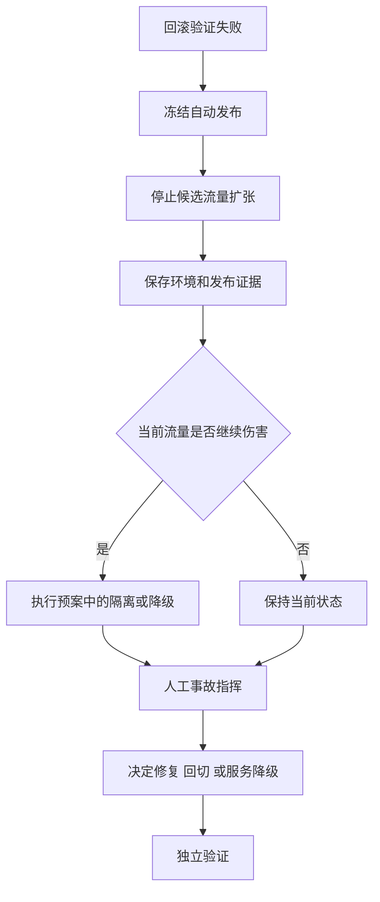

接管期间只有事故指挥授权的单一控制面可以修改环境。暂停 GitOps 协调、Jenkins Pipeline 或人工操作中的冲突路径，避免三个执行者互相覆盖。所有临时修改都记录目标、命令、时间和回退方式。

#### 发布通知不是发布事实

通知内容应从已经保存的发布记录生成，包含：

```text
应用和环境
发布状态
新旧版本与短摘要
制品或镜像 Digest
变更单与操作者
发布策略和最终流量
技术与业务验证摘要
是否发生停止或回滚
Jenkins 构建和指标链接
```

聊天或邮件发送失败时，发布记录仍保持真实状态；通知步骤可独立重试，但不能重新执行部署。反过来，消息发送成功也不能把失败发布显示为成功。

#### 发布后复核

发布结束后的短周期复核关注：

- 实际环境版本与发布记录是否一致。
- 制品摘要、配置摘要和数据库迁移版本是否一致。
- 新版本错误预算消耗是否异常。
- 扩容、缩容、重启和调度事件是否稳定。
- 是否出现仅在长连接、定时任务或低频业务中的问题。
- 旧版本制品和配置是否仍满足回滚窗口。

中长期复核关注交付前置时间、变更失败率、平均恢复时间和人工接管比例。指标用于改进门禁与自动化，不用于鼓励团队拆分无意义发布或隐藏失败。

#### 停止条件如何量化

| 信号 | 示例判定方式 | 注意事项 |
| --- | --- | --- |
| Ready 副本 | 超时内达到期望数 | 防止只看 Pod Running |
| HTTP 错误率 | 候选高于基线和绝对阈值 | 需要最小请求量 |
| 延迟 | P95、P99 超过阈值 | 区分冷启动和持续退化 |
| 资源饱和 | CPU、内存、连接池持续异常 | 避免瞬时尖峰误判 |
| 业务成功率 | 关键交易低于 SLO | 必须能区分候选流量 |
| 日志错误 | 新错误签名持续出现 | 日志采样也要计数 |
| 指标缺失 | 查询无数据或延迟过大 | 默认停止，不当作零错误 |

阈值由应用 SLO、流量规模和历史基线共同定义，不能在共享库里为所有服务固定一个数字。平台负责统一表达式和停止机制，应用负责人提供关键业务信号并验证其可用性。

#### 发布取消语义

用户点击 Abort 后，Pipeline 需要：

1. 停止尚未开始的批次和流量扩张。
2. 中断可安全取消的外部命令并释放环境锁。
3. 查询实际环境，判断取消发生在变更前、变更中还是验证中。
4. 已改变环境时不能简单返回 `ABORTED`，要进入停止或回滚决策。
5. 保存当前版本、流量、Revision 和最后一个成功动作。
6. 清理临时凭据和 Agent，但保留受控证据。
7. 通知值班人员需要继续验证还是已经安全恢复。

取消是状态转换，不是进程信号的同义词。共享库应对关键外部动作实现查询和补偿接口，让中断后的下一步可以依据事实决定。

#### 发布前置检查

```text
[身份] 操作者和流水线服务身份均有目标环境权限
[窗口] 变更单处于可执行状态且当前时间在变更窗口内
[版本] 制品存在 摘要一致 质量策略通过 未被撤销
[容量] 新旧版本共存所需 CPU 内存和实例配额充足
[依赖] 数据库 消息系统 下游API处于允许发布状态
[兼容] Schema 协议和配置支持新旧版本短期共存
[回滚] 旧制品 配置 流量状态和回滚命令均已确认
[观测] 技术指标 业务指标 查询与阈值可用
[通信] 值班人 审批人和事故渠道可达
```

任一关键项未知时默认停止。Dry Run 成功只证明 API 接受对象格式，不证明配额、镜像拉取、调度、业务依赖和观测指标都会成功。

#### 发布结果模型

| 状态 | 含义 | 是否允许下一次发布 |
| --- | --- | --- |
| `validated` | 请求和前置检查通过，尚未变更环境 | 是 |
| `deploying` | 正在改变目标环境 | 同应用环境禁止并发 |
| `observing` | 技术健康通过，等待业务窗口 | 禁止覆盖观测结果 |
| `succeeded` | 所有成功标准通过 | 是 |
| `failed` | 未达到成功标准且影响已控制 | 先完成复盘或明确处置 |
| `rolled_back` | 已恢复旧版本且验证通过 | 是，但保留事故关联 |
| `manual_intervention` | 自动化无法安全继续 | 否，直到人工关闭状态 |

#### 发布记录至少包含什么

- 请求时间、开始时间、结束时间和每个观测窗口。
- 应用、环境、Namespace 或主机组等逻辑目标。
- 新旧版本、制品摘要、Chart 与配置摘要。
- 操作者、审批者、触发原因和变更单。
- 执行策略、批次、流量比例和每次扩量决策。
- 技术检查、业务指标、阈值和查询链接。
- 回滚是否触发、目标版本、结果和人工操作。
- Jenkins 构建 URL、Agent 和共享库 Commit。

#### 数据库变更的特殊边界

数据库迁移通常不能像应用镜像一样简单回滚。推荐使用 Expand and Contract：先添加兼容字段或表，新旧应用都能工作；完成应用切换并观察后，再在独立变更中删除旧结构。流水线不得在未备份、未评估锁表和未验证兼容性的情况下自动执行破坏性 DDL。

| 阶段 | 数据库动作 | 应用要求 |
| --- | --- | --- |
| Expand | 增加兼容结构 | 新旧版本都可读写 |
| Migrate | 回填或双写数据 | 可监控进度并可暂停 |
| Switch | 新应用使用新结构 | 保留旧读取路径 |
| Contract | 删除旧结构 | 确认无旧版本与回滚需求 |

当迁移已经产生不可逆数据变化，自动回滚应用可能进一步破坏一致性。此时停止流量扩张、保护现场并交给预先指定的人工流程。

## 第七章：Jenkins 与 Kubernetes 交付

### Jenkins 直接执行 Kubectl 属于什么模型

Jenkins Agent 取得集群身份并调用 Kubernetes API，是典型的推送式 CD：流水线把变更主动推入目标集群。它可以实现可靠发布，但信任边界集中在 Jenkins、Agent、凭据和网络路径上，不能因为部署声明存放在 Git 就自动称为 GitOps。

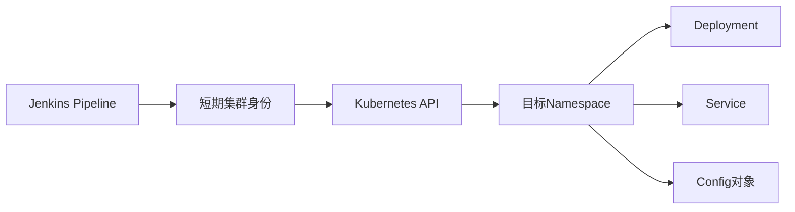

#### 最小权限设计

| 维度 | 推荐边界 |
| --- | --- |
| 集群 | 不同生产集群使用不同凭据和部署 Agent |
| Namespace | 每个应用或团队只操作授权 Namespace |
| 资源 | 只允许所需 Deployment、Service、ConfigMap 等类型 |
| 动词 | 只开放 get、list、watch、patch、update 等必要动作 |
| 身份寿命 | 优先短期 Token、工作负载身份或动态凭据 |
| 审计 | Kubernetes Audit 与 Jenkins 构建号、操作者关联 |

Agent 管理 Pod 的 ServiceAccount 与业务发布 ServiceAccount 必须分离。通用构建 Agent 不保存长期 `cluster-admin` Kubeconfig；生产部署可放到网络受限的专用 Agent，并让凭据只在部署 Stage 的最小作用域内存在。

```groovy
stage('Deploy') {
    agent { label 'prod-k8s-deployer' }
    steps {
        withCredentials([file(
            credentialsId: 'prod-payment-kubeconfig',
            variable: 'KUBECONFIG'
        )]) {
            sh '''
              set -euo pipefail
              kubectl --namespace payment apply --server-side --filename deploy/
              kubectl --namespace payment rollout status deployment/payment-api \
                --timeout=5m
            '''
        }
    }
}
```

`apply` 返回成功后仍需 `rollout status` 和业务验证。清单中的镜像使用 Digest，Namespace 由平台配置，不接受任意参数。部署前可用服务端 Dry Run 和策略引擎检查权限与对象合法性。

### Helm 如何提供 Release 历史和回滚

Helm 把 Chart、Values 和集群中的 Release 组合成带 Revision 的发布历史。它能帮助查看差异和回滚到先前 Revision，但不会自动判断业务是否健康，也不会替代制品不可变和外部审计。

| 对象 | 含义 | 发布控制 |
| --- | --- | --- |
| Chart | Kubernetes 模板与元数据 | 固定 Chart 版本并校验来源 |
| Values | 环境差异输入 | 受评审，秘密使用外部机制注入 |
| Release | 某 Namespace 内的安装实例 | 名称稳定，禁止用户自由构造 |
| Revision | 每次 install、upgrade、rollback 的序号 | 发布前后记录并用于回滚 |

```bash
set -euo pipefail

helm upgrade --install payment-api oci://registry.example.com/charts/payment-api \
  --version "$CHART_VERSION" \
  --namespace payment \
  --create-namespace \
  --values environments/production.yaml \
  --set-string "image.digest=$IMAGE_DIGEST" \
  --wait \
  --timeout 8m \
  --atomic

helm history payment-api --namespace payment
helm status payment-api --namespace payment
```

`--wait` 根据 Kubernetes 就绪条件等待，`--atomic` 在升级失败时尝试回滚，但两者都不代表业务指标正常。执行前用 `helm lint`、`helm template` 和策略检查验证渲染结果；执行后仍需合成请求与观测窗口。

回滚前先查看历史和目标 Revision：

```bash
helm history payment-api --namespace payment
helm rollback payment-api "$TARGET_REVISION" \
  --namespace payment \
  --wait \
  --timeout 8m
```

Revision 是 Release 内部序号，不等同于应用版本。发布记录需要同时保存 Revision、Chart 版本、Values 摘要与镜像 Digest。若旧 Chart 引用了已清理镜像，Helm 历史存在也无法完成回滚。

### 推送式 CD 与 GitOps 有何区别

GitOps 的关键不是“流水线中执行 Git 和 kubectl”，而是声明式期望状态、版本化且不可变的来源、自动拉取和持续协调。集群内控制器反复比较期望状态与实际状态，并处理漂移。

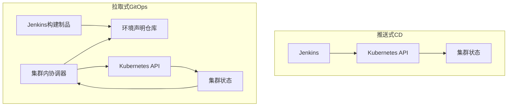

| 维度 | Jenkins 推送式 CD | 拉取式 GitOps |
| --- | --- | --- |
| 集群凭据 | Jenkins 或部署 Agent 持有 | 协调器位于集群内 |
| 触发 | Pipeline 主动调用 API | 协调器发现期望状态变化 |
| 漂移 | 需要额外检查 | 持续比较并按策略协调 |
| 回滚 | Pipeline 再次部署旧版本 | 恢复 Git 期望状态并重新协调 |
| 审计核心 | Jenkins 发布记录 | Git 变更加协调器状态 |

两种模型都可以安全落地。Jenkins 在 GitOps 中通常负责构建、质量门禁、推送镜像，以及通过 Pull Request 更新环境声明；集群内协调器负责真正部署。不要让 Jenkins 更新 Git 后又绕过协调器直接修改同一资源，否则会形成两个控制面并制造漂移。

#### Namespace 级发布 RBAC 示例

下面只展示 Deployment 发布所需的起点权限，实际还要根据工具的 API 调用通过审计日志收敛。不要直接复制为所有应用的通用角色。

```yaml
apiVersion: v1
kind: ServiceAccount
metadata:
  name: payment-api-deployer
  namespace: payment
---
apiVersion: rbac.authorization.k8s.io/v1
kind: Role
metadata:
  name: payment-api-deployer
  namespace: payment
rules:
  - apiGroups: ["apps"]
    resources: ["deployments"]
    resourceNames: ["payment-api"]
    verbs: ["get", "patch", "update"]
  - apiGroups: ["apps"]
    resources: ["replicasets"]
    verbs: ["get", "list", "watch"]
  - apiGroups: [""]
    resources: ["pods"]
    verbs: ["get", "list", "watch"]
  - apiGroups: [""]
    resources: ["events"]
    verbs: ["get", "list", "watch"]
---
apiVersion: rbac.authorization.k8s.io/v1
kind: RoleBinding
metadata:
  name: payment-api-deployer
  namespace: payment
roleRef:
  apiGroup: rbac.authorization.k8s.io
  kind: Role
  name: payment-api-deployer
subjects:
  - kind: ServiceAccount
    name: payment-api-deployer
    namespace: payment
```

如果 Pipeline 通过 `apply` 创建 ConfigMap、Service 或其他对象，上述权限会不足。正确做法是列出发布工具的对象与动词，增加必要项并用 `kubectl auth can-i` 验证，而不是改为通配权限。

```bash
kubectl auth can-i patch deployment/payment-api \
  --namespace payment \
  --as system:serviceaccount:payment:payment-api-deployer

kubectl auth can-i delete namespace \
  --as system:serviceaccount:payment:payment-api-deployer
```

第二条检查应返回不允许。RBAC 只能控制 API 权限，还要用准入策略限制特权容器、HostPath、可变镜像标签和越权 ServiceAccount。

#### GitOps 环境声明变更示例

```yaml
apiVersion: apps/v1
kind: Deployment
metadata:
  name: payment-api
  namespace: payment
spec:
  template:
    spec:
      containers:
        - name: payment-api
          image: registry.example.com/payment/payment-api@sha256:placeholder
```

Jenkins 只修改允许的镜像 Digest 字段，提交到短期分支并创建 Pull Request。合并后由协调器拉取期望状态。Pipeline 等待协调器报告目标 Revision 健康，而不是再调用 `kubectl apply`。

GitOps 排障依次检查：声明变更是否合并、协调器是否拉取新 Commit、渲染是否成功、权限或策略是否拒绝、资源是否健康、是否出现人工漂移。回滚通过恢复声明仓库中的旧 Digest，再观察协调器完成收敛。

## 第八章：生产运行与治理

### 如何观察 Jenkins 的运行状态

Jenkins 的可用性不能只看首页是否打开。运维需要同时观察 Controller、队列、Agent、Pipeline、存储和外部依赖，并用同一构建号关联日志。

#### 核心信号

| 信号 | 说明 | 典型异常 |
| --- | --- | --- |
| 队列长度与等待时间 | 需求是否超过执行能力 | 标签错误、Agent 不足、锁竞争 |
| 执行器占用率 | Agent 是否长期饱和 | 容量不足或任务挂住 |
| Agent 在线率 | 静态和动态执行环境健康度 | 网络、证书、镜像或配额故障 |
| 阶段耗时分位数 | Checkout、Build、Test、Publish 趋势 | 依赖源慢、缓存失效、测试退化 |
| 构建失败率 | 按团队、阶段和原因分类 | 平台故障与代码故障混在一起 |
| Controller JVM | Heap、GC、线程与响应时间 | 插件泄漏、Pipeline 负载过高 |
| 磁盘增长 | Home、构建记录、日志和 Workspace | 保留策略或清理失效 |
| 外部调用 | GitLab、SonarQube、Nexus、Harbor、集群 | 超时、限流、认证轮换失败 |

队列等待时间比平均执行器利用率更能反映用户体验。监控应按 Label 分组，否则某个专用 Agent 池耗尽会被整体空闲执行器掩盖。

#### 日志关联

1. 从构建 URL 获取 Job、构建号、时间范围和触发原因。
2. 用 Queue ID 判断何时入队、为何等待和分配到哪个 Agent。
3. 用 Stage 时间定位外部系统调用，再查对应系统日志与请求 ID。
4. Controller 日志用于插件、调度和系统错误；Agent 日志用于连接、工具和 Workspace。
5. 日志只记录制品坐标、短 Commit 与请求 ID，不记录完整 Token 或 Payload。

告警必须指向可执行动作。例如“队列等待超过十分钟且原因是没有匹配 Label”应引导检查节点模板、配额和最近变更；仅告警“Jenkins 慢”很难形成止损。

### 常见故障如何分层定位

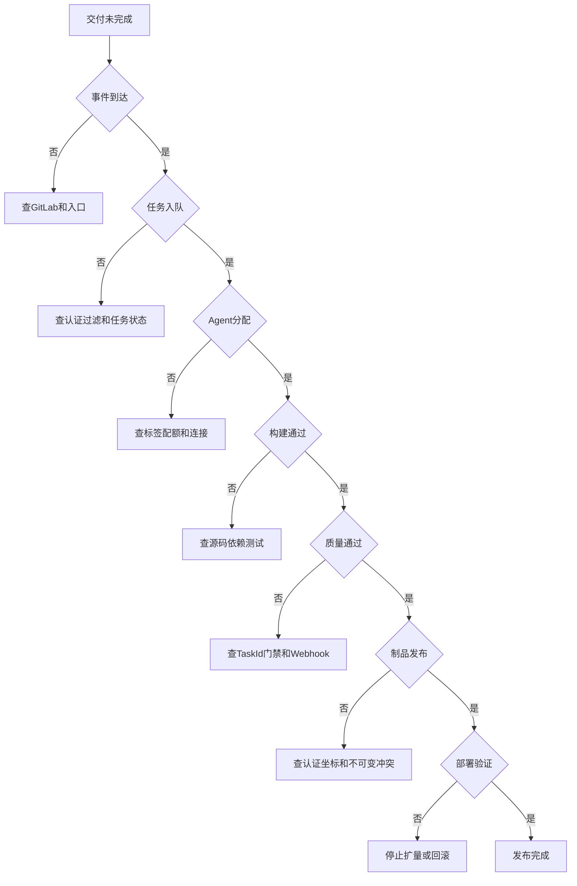

| 层级 | 必要证据 | 负责人边界 | 停止条件 |
| --- | --- | --- | --- |
| 事件 | 投递 ID、状态码、时间 | SCM 与入口维护者 | 请求未到 Jenkins |
| 任务 | 过滤原因、Job 状态 | Jenkins 平台 | 未创建构建 |
| 队列 | Queue reason、Label、锁 | Jenkins 与基础设施 | 无可用执行环境 |
| 构建 | 命令退出码、测试报告 | 应用团队与构建平台 | 源码或工具链失败 |
| 质量 | Task ID、Gate 条件 | 应用与质量平台 | 门禁未通过 |
| 制品 | 坐标、响应、摘要 | 制品平台 | 上传或校验失败 |
| 部署 | Release、资源事件、指标 | 发布平台与应用值班 | 健康或业务验证失败 |

排障结束要记录根因层级，避免把所有失败都归为“Jenkins 失败”。平台可用性指标应排除明确的代码测试失败，同时保留端到端交付成功率。

#### 分层故障演练目录

故障演练用于验证告警、证据和停止条件，必须在隔离环境或明确的低风险窗口执行。每个场景提前写清注入方式、预期告警、最大影响、终止条件和恢复动作。

| 场景 | 注入方式 | 预期证据 | 合格结果 |
| --- | --- | --- | --- |
| Webhook Token 错误 | 使用无效测试 Token | GitLab 401 或 403、Jenkins 拒绝日志 | 不创建构建且不记录秘密 |
| 分支过滤拒绝 | 推送不允许的测试分支 | 投递 2xx 或受控响应、过滤原因 | 不进入队列 |
| Agent Label 错误 | 请求不存在的测试 Label | Queue reason | 告警指向 Label 而非代码失败 |
| 动态 Agent 配额不足 | 降低测试 Namespace 配额 | Kubernetes Event、创建失败 | 有限重试后失败并清理 |
| 依赖源短暂 5xx | 测试代理返回 503 | 下载步骤和重试日志 | 退避重试不超过上限 |
| 构建断言失败 | 提交失败测试 | JUnit 报告 | 不重试、不进入质量与 Publish |
| SonarQube 回调阻断 | 阻断测试回调路径 | Task 完成、Jenkins 等待超时 | 不占 Agent，超时后阻断 |
| Quality Gate 失败 | 使用测试规则制造失败 | Gate 失败条件 | 不发布制品 |
| Nexus 版本冲突 | 重复测试版本 | 409 或服务端冲突 | 不覆盖，不自动删除 |
| Harbor 凭据过期 | 撤销测试 Robot Secret | 认证失败与 Harbor 审计 | 立即停止，不打印密码 |
| Kubernetes 权限不足 | 删除测试 Role 动词 | API Forbidden、Audit | 不扩大为管理员权限 |
| 新版本无法就绪 | 使用无效测试镜像 | Pod Event、rollout 超时 | 停止并恢复旧版本 |
| 业务指标缺失 | 测试查询返回空 | 验证阶段原因码 | 未知判失败，不继续扩量 |
| 回滚目标丢失 | 删除测试候选引用 | 前置检查失败 | 部署前发现，不改变环境 |

#### 一次故障的证据包

```text
时间范围和时区
触发投递ID或人工原因
Jenkins Job 构建号 Queue ID Agent
失败阶段和标准化错误码
完整 Commit 与制品 Digest
外部系统请求ID和状态码
Kubernetes Namespace Release Revision
关键日志的受控链接
指标查询与阈值
自动停止或回滚动作
当前环境与流量状态
人工接管人和下一决策点
```

证据包只保存必要数据，不复制秘密。日志和指标系统的保留期要覆盖典型事故调查时间；如果链接会过期，按安全流程归档脱敏摘要。

#### 排障中的重试决策表

| 错误 | 是否自动重试 | 原因 |
| --- | --- | --- |
| DNS 临时失败 | 有限重试 | 可能瞬时恢复 |
| TCP 连接重置 | 有限重试 | 写操作需先确认幂等 |
| HTTP 429 | 按 Retry-After 退避 | 避免加剧限流 |
| HTTP 500、502、503、504 | 有限退避 | 确认外部服务状态 |
| HTTP 400 | 否 | 请求内容错误 |
| HTTP 401 | 否 | 身份缺失或过期 |
| HTTP 403 | 否 | 权限或策略拒绝 |
| HTTP 404 | 否 | 路径或对象错误 |
| 测试失败 | 否 | 重试会制造不稳定通过 |
| Quality Gate 失败 | 否 | 策略明确拒绝 |
| 正式版本冲突 | 否 | 不可变规则生效 |
| 发布验证失败 | 否 | 应停止扩量或回滚 |

### 如何治理插件、凭据和脚本

#### 插件治理

维护插件清单，记录能力用途、所有者、当前版本、依赖、最低 Jenkins 版本、维护状态和回退方式。升级前先升级测试 Controller 并运行代表性任务；生产按可归因的小批次变更。被弃用或无维护者的插件应制定替代或隔离计划。

#### 凭据治理

| 生命周期 | 动作 |
| --- | --- |
| 创建 | 专用机器人身份、最小权限、明确所有者和到期日 |
| 使用 | 最低 Folder 作用域、最小 Stage 绑定、禁止 Groovy 插值 |
| 监控 | 记录任务使用关系、认证失败和异常外联 |
| 轮换 | 双凭据过渡或短期身份，验证后撤销旧值 |
| 泄露 | 立即撤销、查使用日志、评估制品与环境影响、补发身份 |
| 删除 | 确认无引用并保留审计记录 |

#### 脚本与共享库治理

Groovy Sandbox 和 Script Approval 是最后一道控制，不是代码评审替代品。审批签名前要理解它授予所有脚本的能力范围；不要为消除告警批量批准陌生方法。受信任共享库仓库执行分支保护、强制评审、签名标签或等价发布控制，并限制谁能配置全局库。

Shell 代码采用 `set -euo pipefail`，对外部请求设连接与总超时，参数使用引用和白名单。危险动作在执行前打印目标的非敏感标识并做 Dry Run；不允许仓库内容决定任意主机、凭据 ID 或集群管理员身份。

#### 多租户平台的信任分层

| 信任级别 | 代码来源 | 可用身份 | 执行环境 |
| --- | --- | --- | --- |
| 外部贡献 | Fork 或未知作者 Pull Request | 无生产秘密，只读公共依赖 | 隔离短生命周期 Agent |
| 内部分支 CI | 受保护组织仓库 | 项目级只读与候选 Publish | 团队隔离 Agent 池 |
| 受保护主分支 | 强制评审与签名规则 | 正式制品 Publish | 受控构建 Agent |
| 非生产 CD | 已批准不可变制品 | 指定测试环境权限 | 非生产部署 Agent |
| 生产 CD | 审批与变更窗口 | 最小生产发布身份 | 网络隔离专用 Agent |
| 平台管理 | 受信任库与 Jenkins 配置仓库 | 管理能力 | 极少数管理路径 |

不同层级不能只靠 `if (branch == 'main')` 区分，因为攻击者可能影响分支名、SCM 配置或 Replay。应结合任务类型、Folder 权限、SCM 来源、受保护分支状态和独立凭据作用域。

#### 脚本安全评审问题

- 所有外部输入是否经过集合或正则白名单，而非黑名单替换？
- Shell 变量是否引用，是否存在命令替换、通配符或路径穿越？
- 凭据是否在最小块绑定，工具是否会写入 Home 或缓存文件？
- HTTP 是否使用 HTTPS、超时、允许状态码和有限重试？
- 写操作是否幂等，响应不确定时能否查询实际状态？
- 删除、覆盖、回滚目标是否由 API 查询后精确确认？
- 日志是否包含 Token、邮箱、内部 URL、Payload 或个人数据？
- 取消 Pipeline 时子进程、锁、临时 Pod 和流量操作是否停止？
- 失败状态是否准确传播，是否存在捕获异常后返回成功？
- 共享库、镜像、Chart 和制品是否固定不可变版本？

#### 凭据轮换演练

1. 创建新凭据并赋予与旧身份相同的最小权限。
2. 在隔离任务验证读取或写入能力和审计主体。
3. 通过受评审配置把试点任务切换到新 Credentials ID。
4. 检查没有把新秘密写进日志、参数和 Workspace。
5. 扩大到全部使用方，并从 Jenkins 使用关系确认旧 ID 无引用。
6. 在外部系统撤销旧身份，运行负向验证确认旧值失效。
7. 删除 Jenkins 中旧凭据，保留轮换记录而不保留秘密。

高风险生产身份优先使用工作负载身份或短期 Token，从根本上减少静态秘密轮换和泄露窗口。

### 如何做备份、恢复和升级回退

备份范围、恢复顺序和升级回退必须作为一套设计。只验证备份文件存在，不能证明 Controller 能恢复。

#### 备份范围

- `JENKINS_HOME` 中系统、Folder、Job、用户和节点配置。
- `secrets/`、主密钥与凭据密文，密钥副本单独加密保管。
- 插件 ID、版本、依赖与 Jenkins 核心、Java 版本组合。
- JCasC、初始化脚本、容器镜像 Digest 和部署声明。
- 恢复所需的 DNS、TLS、存储、身份源与外部系统配置记录。
- 构建制品由 Nexus、Harbor 等外部系统备份，不依赖 Workspace。

#### 恢复演练

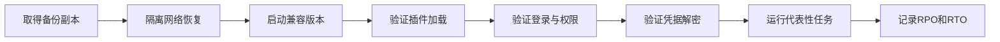

代表性任务至少覆盖 SCM Checkout、动态 Agent、凭据绑定、质量等待和制品读写，但使用隔离测试目标，不能从演练环境发布生产。恢复结果记录缺失文件、手工步骤、耗时和下一次改进项。

#### Controller 升级与回退

1. 阅读目标 LTS 升级指南、Java 支持矩阵、安全公告和插件最低版本。
2. 用生产备份恢复测试 Controller，先升级 Java 或 Jenkins 的顺序按官方指南执行。
3. 升级必要插件并运行启动检查、权限验证和代表性 Pipeline。
4. 生产进入 Quiet Down，等待或受控终止任务，创建一致性备份和存储快照。
5. 执行升级，观察日志、队列、Agent 重连、凭据和外部集成。
6. 达到回退条件时整体恢复 Jenkins、Java、插件和 Home 的兼容组合，不能只降级一个插件碰碰运气。

回退条件应在变更前量化，例如 Controller 无法启动、关键插件加载失败、凭据无法解密、Agent 大面积离线或代表性任务失败。升级完成后的静态页面可访问不等于验收完成；只有实际代表性链路通过并完成观察窗口，才能结束变更。

#### 日常、每周与每月运行清单

**每日：**

- 检查 Controller 健康、错误日志和安全告警。
- 查看队列最长等待任务及等待原因。
- 检查静态 Agent 离线、动态 Agent 创建失败和残留 Pod。
- 按阶段查看失败率突变，区分代码、平台和外部依赖。
- 检查 Home、日志、Workspace 与制品缓存磁盘增长。

**每周：**

- 复核失败最多的任务、插件异常与超时分布。
- 检查凭据临近到期、最近使用和无人负责项。
- 检查备份任务结果，并抽样读取备份清单与校验和。
- 检查构建镜像、Agent 模板和依赖源的版本漂移。
- 清理确认无引用的 Workspace、临时缓存和孤儿 Agent。

**每月或变更周期：**

- 阅读 Jenkins 核心、插件和依赖组件安全公告。
- 在测试 Controller 验证计划中的 Java、Jenkins 和插件组合。
- 执行一次隔离恢复或至少按季度完成完整恢复演练。
- 复核 Folder 权限、受信任库写权限和生产部署身份。
- 抽查制品能否从生产实例反查到质量结果和 Commit。
- 复核队列容量、存储趋势、构建保留和回滚窗口。

#### 事故接管信息模板

```text
事件时间:
影响应用与环境:
Jenkins Job 和构建号:
当前阶段与标准化错误码:
触发类型和投递ID:
源码 Commit:
候选制品版本与摘要:
上一稳定版本与摘要:
当前流量比例:
Kubernetes Release 或 Helm Revision:
已经执行的自动动作:
回滚是否安全:
需要人工决定的问题:
关联日志与指标链接:
```

模板禁止粘贴 Token、Kubeconfig、完整 Webhook Body 和用户隐私字段。事故结束后，把临时人工命令还原成受评审的自动化或 Runbook，并撤销应急凭据。

#### 容量问题的判断顺序

1. 按 Label 查看队列，确认是否只有某一 Agent 池等待。
2. 区分没有在线节点、执行器已满、锁等待和云配额不足。
3. 检查任务时长是否因依赖下载、测试退化或缓存失效增加。
4. 检查动态 Agent 启动耗时、镜像拉取和调度事件。
5. 优先修复异常时长与错误标签，再决定横向扩容。
6. 扩容后观察队列分位数，而不是只看节点数增加。

盲目增加 Controller 执行器会把构建负载带回控制面，可能放大故障。容量扩展应发生在合适的 Agent 池，并同时验证外部依赖是否能承受新增并发。

#### 端到端上线验收矩阵

**触发与队列：**

- 合法 Push 能创建一次构建，构建原因包含投递 ID 与短 Commit。
- 分支创建、删除和不允许仓库不会进入构建队列。
- 手动触发缺少原因或引用时明确失败。
- 重复投递不会重复执行不可逆动作。
- 无匹配 Agent 时 Queue reason 和告警可定位。

**构建与质量：**

- Maven、Gradle、Go 和 npm 示例仓库均产生统一报告与制品元数据。
- 同一 Commit 重跑能使用相同锁定依赖和构建镜像。
- 测试失败不会自动重试或进入 Publish。
- Quality Gate 等待不占 Agent，失败、超时和不可用状态可区分。
- 分析 Commit、构建 Commit 和制品 Commit 完全一致。

**制品：**

- 正式版本无法覆盖，重复发布得到明确冲突。
- 上传后下载校验和或镜像 Digest 与本地一致。
- Jenkins Publish 身份不能删除仓库或修改项目权限。
- 生产只部署已批准制品，不能输入任意 URL。
- 当前和上一稳定制品在回滚窗口内可获取。

**发布：**

- 前置检查失败时环境无变化。
- 生产审批展示版本、摘要、变更、风险和回滚目标。
- 同应用同环境并发发布被锁阻止。
- 部署命令成功后仍执行技术与业务验证。
- 指标失败、数据缺失和超时都会停止扩量。
- 回滚使用旧制品，不重新编译旧代码，并单独验证结果。

**Kubernetes 与 GitOps：**

- 发布身份只能操作目标 Namespace 和资源。
- Agent 管理身份不能发布业务，发布身份不能管理 Agent。
- Helm 记录 Chart、Values 摘要、镜像 Digest 和 Revision。
- 推送式 CD 明确由 Jenkins 持有集群调用能力。
- GitOps 模式由集群内协调器部署，Jenkins 不绕过协调器。
- 人工漂移能被检测并按策略处理。

**治理与恢复：**

- 匿名、开发、维护、Agent 运维和管理员权限符合预期。
- 外部 Pull Request 无法获得内部或生产凭据。
- 凭据轮换和泄露撤销流程完成负向测试。
- 插件升级在测试 Controller 运行代表性任务。
- 恢复演练能解密凭据、加载任务并运行完整链路。
- 监控覆盖队列、Agent、阶段、Controller、存储和外部系统。

#### 验收结果记录

```yaml
scope: jenkins-delivery-platform
environment: staging
jenkinsLts: verified-in-environment
javaRuntime: verified-in-environment
sharedLibraryCommit: immutable-commit
testSuites:
  trigger: passed
  buildAdapters: passed
  qualityGate: passed
  artifactImmutability: passed
  deploymentRollback: passed
  credentialIsolation: passed
  restoreDrill: passed
knownLimitations:
  - runtime results belong to the tested staging environment only
approvedForProductionChange: false
```

文档示例和静态构建不能替代该矩阵的真实环境执行。若没有连接 Jenkins、GitLab、SonarQube、Nexus、Harbor 或 Kubernetes，交付报告只能说明静态内容与 Roadmap 构建通过，不能把示例写成运行时验证结论。

#### 平台能力所有权

| 能力 | 主责 | 应用团队责任 | 交接证据 |
| --- | --- | --- | --- |
| Jenkins Controller | Jenkins 平台团队 | 按规范维护 Jenkinsfile | SLO、升级与恢复 Runbook |
| Agent 基础设施 | 平台或基础设施团队 | 选择正确 Label 与资源 | 镜像、配额、连接告警 |
| GitLab Webhook | SCM 与 Jenkins 平台 | 配置项目事件和分支策略 | 投递记录与触发原因 |
| 共享库 | 交付平台团队 | 固定版本并参与契约迁移 | 发布说明与契约测试 |
| SonarQube | 质量平台团队 | 修复质量问题和覆盖率 | Task ID 与 Gate 结果 |
| Nexus、Harbor | 制品平台团队 | 维护坐标和依赖规范 | 摘要、保留与审计 |
| 生产发布 | 发布平台与应用值班 | 提供业务成功标准 | 变更、指标、回滚记录 |

负责人边界不是甩锅边界。端到端事故由第一个发现者携带证据推进，直到确认具体层级和接手人；平台指标同时保留整体交付结果和分层原因。

#### 与仓库其他专题的学习边界

本册只解释 Jenkins 如何调用和治理交付能力，不重复完整基础教程。需要深入时按问题进入对应专题：

| 问题 | 继续学习 |
| --- | --- |
| Ansible Inventory、Playbook、批次和故障控制 | [Ansible 专题](../ansible/README.md) |
| Docker 镜像、容器与运行时基础 | [Docker 专题](../../cloud-native/docker/README.md) |
| Kubernetes 工作负载、Service、RBAC 和排障 | [Kubernetes 专题](../../cloud-native/kubernetes/README.md) |
| Helm Chart、Release、仓库、安全和命令排障 | [Helm 专题](../../cloud-native/helm/README.md) |

使用这些专题时仍保持同一交付原则：

- Jenkins 传递明确版本和摘要，不让下游重新猜测制品。
- 外部工具使用最小权限身份，不共享 Jenkins 管理凭据。
- 命令成功之后继续验证目标状态和业务结果。
- 超时、取消和失败都要留下可接管的当前状态。
- 回滚依赖已验证旧制品、配置和兼容性，不重新构建。
- 运行时事实回写发布记录，而不是只存在控制台输出。

#### 学习后的实践顺序

1. 在隔离 Jenkins 建立单仓库 Push 与手动触发，验证过滤和排障。
2. 用一个示例项目建立 Build、Test、Quality、Package 和 Publish。
3. 为制品增加摘要、Commit 和质量元数据，验证禁止覆盖。
4. 在非生产环境实现审批、环境锁、部署、验证与旧制品回滚。
5. 分别演练 Webhook、Agent、Quality Gate、制品库和部署故障。
6. 再评估滚动、蓝绿、灰度或 GitOps，不从复杂策略起步。
7. 最后补齐监控、权限复核、凭据轮换、升级和恢复演练。

每一步都保存成功与失败证据。只有在目标环境真正执行过的项目才能标记为运行时验证；阅读代码、生成 Roadmap 和静态检查属于内容验证，不应混为一谈。

完成练习后还应保留三类成果：项目侧可读的 Jenkinsfile、平台侧可复用但版本固定的共享库、运维侧可执行的监控与故障 Runbook。三者使用相同的应用名、Commit、制品摘要和发布状态，才能在事故中互相印证。

如果实际环境与本文假设不同，优先记录差异和安全边界，再调整命令：例如托管 Jenkins、外部身份系统、OCI Chart、工作负载身份或 GitOps 协调器都会改变实现，但不会改变最小权限、不可变制品、可验证发布和可恢复运行这些目标。

正式应用前，应由平台维护者与应用值班人员共同评审示例，把组织实际的身份、SLO、审批、变更窗口和事故流程补入本地 Runbook。

## 第 9 章 · 交付质量与流水线效率

### 持续集成的最小闭环和触发契约是什么
CI 的最小闭环是：可信事件进入、固定输入构建、自动验证、生成不可变制品并反馈结果。Webhook 只负责传递事件，Jenkins 仍需重新读取仓库状态、校验提交和判断是否允许构建；否则重放事件或伪造参数可能触发错误流水线。

#### 触发输入必须可审计

流水线开始时保存事件类型、仓库、Commit、变更请求、触发人和参数快照。分支过滤、权限校验和重复构建策略应写入代码，不依赖 Job 页面上的隐含配置。手动触发也必须使用同一套参数校验，不能绕过质量门禁。

#### 失败结果要区分责任

代码测试失败、依赖下载失败、Agent 不可用、凭据拒绝和 Jenkins 控制器故障应使用不同的结果标签。只有前两类通常能直接归因到变更；平台故障应进入重试或人工接管，不应被统计成开发缺陷。

### 构建速度、弹性资源和构建检测如何协同
构建优化应先区分排队、依赖下载、编译、测试和制品上传时间。盲目增加并发会把瓶颈转移到网络、制品库或下游测试环境，还可能导致共享缓存污染。

#### 用阶段数据决定优化动作

| 现象 | 优先检查 | 风险 |
| --- | --- | --- |
| Agent 长时间排队 | 标签、配额、Executor 和弹性扩容 | 扩容触发风暴 |
| 依赖下载慢 | 代理仓库、缓存命中和版本固定 | 缓存不一致 |
| 编译耗时高 | 增量构建、并行阶段和资源配额 | 结果不可重复 |
| 测试波动 | 测试隔离、外部依赖和重试 | 掩盖真实缺陷 |

构建检测应在早期阻断 JDK、构建工具、依赖版本和制品命名错误。缓存只能复用确定输入的结果，不能用来绕过检测。

#### 用基线判断优化是否有效

固定同一 Commit、Agent 规格和依赖缓存状态，分别测量冷缓存与热缓存的排队、下载、编译、测试和上传耗时。优化后若只改善热缓存而冷启动变慢，应把缓存收益和资源成本一起纳入决策，不能只报告最快一次运行。

### 自动化测试、静态检查和内建质量如何成为发布门禁
质量门禁不是把所有检查都设为阻断，而是根据风险决定哪些失败必须停止发布。单元测试、静态分析、依赖漏洞、接口回归、契约测试和破坏性测试应有清晰的输入、耗时预算和责任人。

#### 让门禁结果可解释

门禁记录规则版本、扫描范围、基线、失败样本和豁免到期时间。临时豁免必须绑定变更和负责人，不能通过删除测试或降低阈值“修复”红灯。Mock 和回放可以提高反馈速度，但仍需定期用真实依赖验证契约，防止测试环境与生产行为分叉。

#### 用发布风险选择测试顺序

先执行快速、确定性高的检查，再执行耗时的集成和破坏性测试；高风险变更可提高测试覆盖和观察窗口。测试通过只表示当前输入满足规则，不代表业务一定可用，发布后仍需用业务指标和真实请求完成验证。

### 部署、发布、灰度和回滚分别承担什么责任
部署改变运行实例，发布决定用户是否接收新版本；灰度控制接收比例，回滚恢复已验证的旧版本。数据库 schema、消息格式和外部副作用可能使代码回滚不再安全，因此发布前必须判断数据方向和兼容窗口。

#### 发布停止条件必须先于放量

```text
预检查 -> 小比例放量 -> 观察技术指标和业务指标
    |                         |
    +-- 失败或超阈值 ---------+--> 停止放量 -> 恢复旧制品或降低流量
                                      |
                                      +--> 验证数据、连接、队列和副作用
```

停止条件至少包含错误率、P95/P99、关键业务成功率、依赖延迟和队列积压。任何一个关键指标超过阈值都应停止继续放量，而不是用总体平均值掩盖局部异常。

#### 回滚依赖制品和配置的兼容性

回滚前确认旧制品、旧配置、数据库 schema、缓存格式和消息消费者仍然兼容。不能把“重新构建同一分支”当作回滚；应直接使用之前保存的制品摘要和配置版本，并记录恢复耗时、残留任务和数据补偿结果。

## 第 10 章 · 发布系统的控制面与用户体验

### 发布系统如何设计用户体验、控制面和失败恢复
发布系统的用户体验首先是状态可理解、操作可预期和失败可接管。页面上的“成功”应能链接到制品、配置、审批、目标环境、观测窗口和回滚入口；“运行中”必须显示当前阶段、等待原因、超时点和取消后果，而不是只显示一个旋转图标。

#### 控制面应保存明确状态机

```text
待校验 -> 已批准 -> 分批执行 -> 观察中 -> 已完成
    |        |          |          |
    +--------+----------+----------+--> 已停止 -> 已回滚/人工接管
```

每个状态都要定义进入条件、允许动作、超时和恢复方式。取消操作不能简单杀掉进程；系统应先停止新动作、记录已完成批次和当前版本，再决定是否回滚或等待人工处理。

#### 发布输入要适配业务架构

有状态服务、数据库迁移、异步消息和长连接应用的发布策略不同。发布系统应让应用声明兼容窗口、排空时间、迁移步骤和业务验收，而不是用一个通用滚动参数覆盖所有服务。无法声明关键副作用时，应降低自动化等级并要求人工确认。

### 质量门禁如何避免“绿灯但不可用”
流水线绿灯只表示预先定义的检查通过。发布系统还要验证目标环境是否接收正确版本、关键接口是否成功、依赖是否健康以及业务指标是否处于观察窗口内。门禁结果应按版本和环境关联，不能引用一张与当前发布无关的全局仪表盘截图。

#### 设计可停止的观察窗口

观察窗口应有最小样本、最大等待时间和停止条件。若指标源不可用，结果应为未知并暂停放量，而不是默认通过。发布完成后保留技术指标、业务指标、日志链接和操作者确认，供事故复盘和后续回滚使用。

## 第 11 章 · 移动端与多形态应用的交付抽象

### 移动 App 流水线哪些原则可以迁移到服务交付
移动 App 同时面对多平台构建、签名、测试设备、分发渠道和审核状态，因此比服务发布多出制品变体和外部审批。可迁移的核心仍是固定输入、不可变制品、分阶段验证、渠道权限和可追溯回退；平台差异应作为参数和策略管理，而不是复制多套不可维护流水线。

#### 将制品变体纳入统一身份

每个构建结果应关联源码 Commit、依赖锁文件、构建工具、目标平台、签名身份和渠道。Android、iOS、测试包和生产包即使来自同一提交，也应拥有独立 Digest/版本号，发布记录不能只保存“构建成功”。

#### 把外部审核当作异步状态

应用商店审核或人工验收不应阻塞 Jenkins Executor。流水线提交制品和元数据后进入可查询状态，审核结果回写同一发布记录；超时、拒绝和撤回都要有明确的人工接管和重新提交路径。这样可以释放构建资源，也避免重复上传同一制品。

### 多平台流水线如何控制资源和测试成本
多平台构建应把平台无关阶段和平台相关阶段拆开：依赖解析、静态检查和单元测试尽量复用，签名、打包和设备测试按平台并行。并行度受许可证、设备池、Runner 配额和下游分发限制，不能只由 Jenkins Executor 数量决定。

#### 用取消和优先级回收资源

同一分支的新提交到达时，可取消尚未进入发布阶段的旧构建，但已经生成并对外分发的制品不能静默删除。为紧急修复、主干验证和夜间回归设置不同优先级，并记录取消原因、已消耗资源和未完成阶段，避免把资源回收误算成构建成功。

#### 设备和签名环境必须可审计

设备型号、系统版本、签名证书、Provisioning Profile 和构建镜像都应写入构建摘要。共享设备池发生污染时，先隔离设备并重置环境，再判断测试结果是否可信；证书轮换要能在测试环境先验证，不能在生产流水线首次使用新签名。
